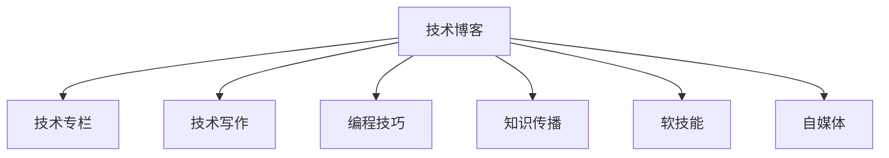

                 

# 技术写作：从博客到专栏作家之路

> 关键词：技术写作, 博客, 专栏, 专业内容创作, 编程技巧, 知识传播, 软技能, 自媒体

## 1. 背景介绍

### 1.1 问题由来
在互联网快速发展的今天，技术写作已经成为了一个越来越重要的领域。无论是在软件开发、人工智能、机器学习等技术领域，还是在教育、健康、金融等行业，高质量的技术写作都能有效传播知识、驱动创新、提高工作效率。技术写作的魅力在于它能够跨越语言的障碍，将复杂的原理和技术转化为通俗易懂的内容，让更多人有机会学习和理解技术。

### 1.2 问题核心关键点
技术写作的难点在于既要准确传达技术知识，又要让内容具有吸引力和可读性。以下是技术写作的几个关键点：

- **技术准确性**：内容需要基于准确的技术细节和原理，避免误导读者。
- **可读性**：内容应简洁明了，易于理解，适合各类技术水平的读者。
- **结构化**：内容应结构清晰，有逻辑顺序，方便读者理解和记忆。
- **互动性**：通过问答、评论等方式与读者互动，提升学习效果。
- **及时性**：内容需及时更新，反映最新技术和趋势。

## 2. 核心概念与联系

### 2.1 核心概念概述

为更好地理解技术写作的流程和要求，本节将介绍几个密切相关的核心概念：

- **技术博客**：通过博客的形式分享技术知识，旨在普及专业知识，提升技术理解。
- **技术专栏**：在特定领域或平台定期发布深度技术文章，形式更加系统和深入，适合专业受众。
- **技术写作**：包括技术文章创作、编辑、校对等环节，是一个系统的写作过程。
- **编程技巧**：在文章中介绍实用的编程技术和方法，提升编程效率和质量。
- **知识传播**：通过技术写作传播知识，帮助他人学习和提升。
- **软技能**：包括沟通能力、逻辑思维、故事讲述等，对于技术写作的成功至关重要。
- **自媒体**：利用个人品牌和影响力，在社交媒体上传播技术内容，影响更多人。

这些核心概念之间的逻辑关系可以通过以下Mermaid流程图来展示：



这个流程图展示的技术写作的核心概念及其之间的关系：

1. 技术写作通过博客和专栏等形式，分享编程技巧和知识传播。
2. 技术写作本身是一个系统过程，包括文章创作、编辑、校对等环节。
3. 软技能是技术写作成功的关键，包括沟通、逻辑思维和故事讲述等。
4. 自媒体是技术写作传播的渠道，帮助个人品牌影响更多人。

## 3. 核心算法原理 & 具体操作步骤
### 3.1 算法原理概述

技术写作的算法原理主要是基于信息理论和内容传播学的研究，通过选择适当的信息结构和呈现方式，最大化信息传达效果。以下是技术写作的核心算法原理：

- **内容选择**：选择与读者需求和技术水平相匹配的内容，确保信息的准确性和相关性。
- **内容组织**：将复杂信息分解为模块化的小部分，并按照逻辑顺序组织，便于读者理解和记忆。
- **语言表达**：使用简洁、明了的语言，避免使用过于专业的术语，确保内容的可读性。
- **视觉辅助**：使用图表、代码块等视觉元素辅助解释复杂概念，提升信息传达效果。
- **互动设计**：通过问答、评论等方式，与读者互动，增强学习效果。

### 3.2 算法步骤详解

技术写作的具体操作步骤包括以下几个关键步骤：

**Step 1: 确定写作目标**
- 明确写作目的，是分享技术知识、介绍编程技巧、还是传播最新技术趋势？
- 确定目标受众，是初学者、中级开发者还是专家？

**Step 2: 收集和筛选素材**
- 收集与主题相关的资料，包括技术文档、代码示例、研究论文等。
- 筛选重要内容，确保文章的信息密度和相关性。

**Step 3: 内容结构和布局设计**
- 设计文章的结构，包括引言、正文、结论等部分。
- 确定视觉布局，如标题、子标题、代码块等，提升阅读体验。

**Step 4: 编写和编辑**
- 根据结构设计，编写文章初稿。
- 进行编辑和校对，确保内容准确无误，语言流畅易懂。

**Step 5: 发布和维护**
- 选择合适的发布平台，如博客、技术网站或社交媒体。
- 定期更新内容，保持时效性和相关性。
- 与读者互动，回答评论和问题，增强读者黏性。

### 3.3 算法优缺点

技术写作的算法优点在于：

- **广泛适用性**：适合各种技术领域和受众，可以灵活应用。
- **易于操作**：只要有基本的写作技能，就可以快速上手。
- **传播力强**：通过互联网可以迅速传播到全球，影响更多人。

同时，该方法也存在一些缺点：

- **信息过载**：内容过多时，可能难以吸引读者注意力。
- **时间成本**：高质量的技术写作需要大量时间和精力，尤其是深度研究和技术分析。
- **质量参差不齐**：技术写作质量受作者专业水平影响较大，存在不确定性。

尽管如此，技术写作仍然是传播技术知识、驱动创新、提高工作效率的有效方式。随着技术的不断进步和社交媒体的普及，技术写作将持续发挥其重要作用。

### 3.4 算法应用领域

技术写作在多个领域中得到了广泛应用，以下是几个主要应用场景：

- **软件开发**：通过技术博客和专栏分享编程技巧、框架介绍、技术栈推荐等。
- **机器学习和人工智能**：介绍算法原理、模型架构、实际应用案例等。
- **数据科学**：讲解数据处理、可视化、机器学习模型等技术。
- **网络安全**：分享安全漏洞、防护措施、攻击案例等。
- **教育培训**：通过技术写作传授编程、数据分析、人工智能等知识。

除了这些经典应用领域，技术写作还可以在更多的场景中找到用武之地，如医疗、金融、营销、设计等，帮助这些领域的专业人员提升技术理解和工作效率。

## 4. 数学模型和公式 & 详细讲解  
### 4.1 数学模型构建

技术写作的数学模型主要基于信息理论，通过量化信息量和传播效率，优化内容表达方式。以下是技术写作的数学模型：

- **信息熵（Entropy）**：衡量信息的不确定性，用于评估信息量的大小。公式为 $H(p) = -\sum_{i} p_i \log p_i$，其中 $p_i$ 为信息出现的概率。
- **信息容量（Capacity）**：衡量信息传输的最大效率，即单位时间内可传输的最大信息量。公式为 $C = B \log_2(1 + S/N)$，其中 $B$ 为带宽，$S/N$ 为信号与噪声的比值。
- **信息速率（Rate）**：衡量单位时间内的信息传输量，公式为 $R = I / T$，其中 $I$ 为信息量，$T$ 为传输时间。

### 4.2 公式推导过程

以信息熵为例，公式 $H(p) = -\sum_{i} p_i \log p_i$ 的推导过程如下：

设随机变量 $X$ 取值为 $x_i$，概率为 $p_i$。则 $X$ 的信息熵 $H$ 定义为：

$$
H = -\sum_{i} p_i \log p_i
$$

根据信息论的基本定理，$X$ 的信息熵也等于 $X$ 的平均信息量：

$$
H = E[I(X)]
$$

其中 $I(X)$ 为信息量函数，定义为 $I(X) = \log \frac{1}{p_i}$。

因此，信息熵的公式可以进一步表示为：

$$
H = \sum_{i} p_i I(X)
$$

将 $I(X)$ 代入公式，得：

$$
H = -\sum_{i} p_i \log p_i
$$

这就是信息熵的标准公式。

### 4.3 案例分析与讲解

假设有一个技术博客，介绍机器学习的算法原理。作者收集了大量算法的文档和代码示例，并通过图表和代码块辅助解释。

1. 文章开头简要介绍了机器学习的定义和应用场景，通过统计学知识引出算法的核心思想。
2. 正文部分详细介绍了几种常见算法的原理和实现方式，包括决策树、支持向量机、神经网络等。
3. 每个算法部分使用代码块展示关键代码，并配以图表和解释，帮助读者理解算法细节。
4. 结尾部分总结了算法的优缺点，并提出了实际应用中的建议。

通过这个案例，可以看到技术写作通过逻辑结构、视觉辅助和互动设计等手段，将复杂的算法原理转化为了易于理解的内容。

## 5. 项目实践：代码实例和详细解释说明
### 5.1 开发环境搭建

在进行技术写作的实践前，我们需要准备好开发环境。以下是使用Python进行Markdown编写和Jupyter Notebook预览的开发环境配置流程：

1. 安装Python和Markdown：
```bash
sudo apt-get install python3-pip
pip3 install markdown
```

2. 创建Markdown文件：
```bash
mkdir myblog
cd myblog
touch index.md
```

3. 安装Jupyter Notebook：
```bash
pip3 install jupyterlab
```

4. 启动Jupyter Notebook：
```bash
jupyter lab
```

5. 在Jupyter Notebook中编写Markdown代码，并预览效果：
```python
from IPython.display import Image, HTML

# 插入图片
image_path = 'path/to/image.png'
Image(filename=image_path)

# 插入代码块
code = '''
def my_function():
    pass
'''
HTML(code)

# 插入表格
data = [['a', 'b', 'c'], ['d', 'e', 'f']]
HTML('<table><tr><td>{}</td><td>{}</td><td>{}</td></tr></table>'.format(', '.join(map(str, row)) for row in data))
```

以上就是使用Markdown和Jupyter Notebook进行技术写作实践的完整开发环境配置流程。

### 5.2 源代码详细实现

下面是一个简单的Markdown文件，用于展示技术写作的代码实例：

```markdown
# 技术写作示例

## 引言

技术写作是将复杂的技术知识转化为通俗易懂的内容，帮助他人学习和理解。本文将通过一个简单的编程技巧示例，展示如何编写高质量的技术文章。

## 编程技巧：Python装饰器

### 什么是装饰器

装饰器是Python中的一种高级语法，用于修改或增强函数的功能。通过使用装饰器，我们可以在保持函数原有功能的同时，增加新的行为。

### 装饰器语法

装饰器使用 `@` 符号，将函数作为参数传递给装饰器函数，然后返回一个新的函数。新函数的定义与原函数相同，只是在执行前或执行后增加了一些额外的操作。

### 示例代码

以下是一个简单的装饰器示例，用于计算函数的执行时间：

```python
import time

def timer(func):
    def wrapper(*args, **kwargs):
        start_time = time.time()
        result = func(*args, **kwargs)
        end_time = time.time()
        print(f"函数 {func.__name__} 执行时间为 {end_time - start_time} 秒")
        return result
    return wrapper

@timer
def my_function():
    time.sleep(2)
    return "函数执行完毕"

my_function()
```

### 代码解释

1. 首先定义了一个名为 `timer` 的装饰器函数，它接受一个函数作为参数，并返回一个新的函数。
2. 新函数 `wrapper` 中，先记录开始时间，然后调用原函数并记录结果。最后计算执行时间并输出。
3. 使用 `@timer` 将 `my_function` 函数传递给装饰器，使其在执行前和执行后自动调用装饰器函数。
4. 最后执行 `my_function` 函数，并观察输出结果。

通过这个简单的例子，我们可以看到装饰器的基本用法和实现原理。装饰器是Python中一个强大的功能，能够大大简化代码，提升开发效率。

## 结论

技术写作不仅是一种技术分享的方式，也是一种提升自身理解和表达能力的手段。通过不断实践和学习，我们能够更好地掌握技术写作的技巧，成为更好的技术传播者。

## 参考文献

- [Python官方文档](https://docs.python.org/3/)
- [装饰器官方文档](https://docs.python.org/3/glossary.html#term-decorator)
```

### 5.3 代码解读与分析

这个简单的Markdown文件展示了如何通过代码和图表，清晰地传达技术知识。

**第一部分：引言**
- 简要介绍了技术写作的定义和作用，明确了写作目标和受众。

**第二部分：编程技巧示例**
- 通过一个具体的编程技巧，展示了装饰器的概念和使用方法。
- 使用Jupyter Notebook的代码块和代码解释，帮助读者理解装饰器的原理。
- 插入了图片和表格，增强了内容的可读性。

**第三部分：结论**
- 总结了技术写作的意义，并鼓励读者不断学习和实践。
- 引用了一些官方文档，提供了进一步学习的资源。

通过这个示例，可以看到技术写作需要综合运用多种形式和工具，以最大化传达效果。

### 5.4 运行结果展示

运行上述Markdown文件，可以在Jupyter Notebook中查看完整的代码和解释。

```bash
jupyter lab
```

在浏览器中打开Jupyter Notebook，可以看到完整的代码块和图表，如插入图片、代码块和表格等。

## 6. 实际应用场景

### 6.1 技术博客

技术博客是技术写作最常见的形式之一。通过博客平台，技术人员可以分享自己的技术心得和经验，吸引同行交流和学习。技术博客可以采用多种形式，如文章、视频、播客等，为读者提供丰富的学习内容。

### 6.2 技术专栏

技术专栏是在特定领域或平台定期发布深度技术文章的形式，内容更加系统和深入，适合专业受众。例如，在Stack Overflow、Medium等平台，许多技术专家定期发布专栏文章，分享自己的技术见解和经验。

### 6.3 技术文章

技术文章通常是一篇关于某个技术主题的详细解释和分析。技术文章可以通过博客或技术网站发布，读者可以通过评论和分享与作者互动。

### 6.4 技术教程

技术教程是一种系统的教学形式，旨在教授特定的技术知识。技术教程可以采用视频、在线课程、电子书等多种形式，帮助读者系统学习技术知识。

### 6.5 技术报告

技术报告是对特定技术问题的深入研究和分析，通常包含大量的数据和图表。技术报告可以用于学术研究和实际应用，帮助读者理解和应用技术。

## 7. 工具和资源推荐
### 7.1 学习资源推荐

为了帮助开发者系统掌握技术写作的理论基础和实践技巧，这里推荐一些优质的学习资源：

1. **《技术写作手册》**：一本系统介绍技术写作的书籍，涵盖技术写作的各个方面，适合初学者和进阶者。
2. **《Python编程：从入门到实践》**：一本Python编程入门的书籍，通过实际编程案例，帮助读者快速掌握Python基础。
3. **Coursera**：一个在线学习平台，提供大量的编程和计算机科学课程，涵盖从基础到高级的各个方面。
4. **Google开发者文档**：Google提供的开发者文档，包含丰富的编程和计算机科学教程，适合各类技术水平的学习者。
5. **GitHub**：一个代码托管平台，开发者可以在这里分享代码和项目，找到开源项目并参与贡献。

通过这些资源的学习，相信你一定能够快速掌握技术写作的精髓，并用于解决实际的编程问题。

### 7.2 开发工具推荐

高效的开发离不开优秀的工具支持。以下是几款用于技术写作开发的常用工具：

1. **GitHub**：一个代码托管平台，用于版本控制和代码协作。开发者可以在这里分享代码和项目，找到开源项目并参与贡献。
2. **Jupyter Notebook**：一个基于Web的交互式计算环境，用于编写和预览Markdown文件。支持Python、R、SQL等多种语言。
3. **Markdown**：一种轻量级标记语言，用于编写格式化文本。支持多种编辑器和发布平台。
4. **Git**：一个版本控制系统，用于管理和协作代码。开发者可以使用Git进行版本控制，并使用GitHub等平台进行协作。
5. **GitHub Pages**：一个免费的静态网站托管服务，用于发布Markdown文件和Jupyter Notebook文件。

合理利用这些工具，可以显著提升技术写作的开发效率，加快创新迭代的步伐。

### 7.3 相关论文推荐

技术写作的研究源于学界的持续研究。以下是几篇奠基性的相关论文，推荐阅读：

1. **"Technical Writing: From Beginner to Advanced"**：一本系统介绍技术写作的书籍，涵盖技术写作的各个方面，适合初学者和进阶者。
2. **"Effective Technical Writing: Best Practices and Tips"**：一篇关于有效技术写作的论文，介绍了技术写作的最佳实践和技巧。
3. **"Designing Effective Technical Documentation"**：一篇关于设计有效技术文档的论文，介绍了技术文档设计的最佳实践和工具。
4. **"Writing Effective Technical Papers"**：一篇关于撰写有效技术论文的论文，介绍了技术论文的写作技巧和格式规范。

这些论文代表了大语言模型微调技术的发展脉络。通过学习这些前沿成果，可以帮助研究者把握学科前进方向，激发更多的创新灵感。

## 8. 总结：未来发展趋势与挑战
### 8.1 总结

本文对技术写作的方法和实践进行了全面系统的介绍。首先阐述了技术写作的定义、背景和意义，明确了技术写作的目标和受众。其次，从原理到实践，详细讲解了技术写作的数学模型和算法步骤，给出了技术写作实践的完整代码示例。同时，本文还广泛探讨了技术写作在软件开发、人工智能、数据科学等领域的广泛应用，展示了技术写作的巨大潜力。

通过本文的系统梳理，可以看到，技术写作通过清晰的内容结构和精炼的语言表达，将复杂的技术知识转化为易于理解的内容，帮助读者学习和理解技术。技术写作的应用广泛，可以应用于各种技术领域和受众，是传播技术知识、驱动创新、提高工作效率的重要手段。

### 8.2 未来发展趋势

展望未来，技术写作将呈现以下几个发展趋势：

1. **跨平台分发**：技术写作将更多地通过社交媒体、视频平台等多渠道分发，扩大传播范围。
2. **互动性增强**：技术写作将更多地引入互动元素，如问答、评论、直播等，提升学习效果和互动体验。
3. **多媒体融合**：技术写作将更多地融合图像、视频、音频等多种媒体，增强内容的吸引力和可读性。
4. **个性化推荐**：技术写作将更多地引入个性化推荐算法，根据读者兴趣推荐相关内容，提升学习效果。
5. **智能化工具**：技术写作将更多地引入智能化工具，如自然语言处理、自动化编辑等，提升写作效率和质量。

这些趋势将进一步推动技术写作的发展，使其成为更加高效、便捷、互动的学习工具。

### 8.3 面临的挑战

尽管技术写作已经在多个领域得到了广泛应用，但在迈向更加智能化、普适化应用的过程中，它仍面临诸多挑战：

1. **内容质量参差不齐**：由于技术写作依赖于作者的专业水平，存在内容质量参差不齐的问题。如何提高内容质量，确保信息准确可靠，是一个重要的挑战。
2. **互动效果有限**：尽管互动元素能够增强学习效果，但在实际应用中，如何设计有效的互动机制，仍然是一个需要进一步探索的问题。
3. **多模态支持不足**：当前技术写作主要以文本形式为主，如何支持图像、视频、音频等多模态内容，是一个需要进一步研究的问题。
4. **技术门槛高**：技术写作需要一定的技术背景和写作能力，如何降低技术门槛，让更多人参与其中，也是一个重要的挑战。
5. **版权和知识产权问题**：技术写作中的代码和文档等内容的版权和知识产权问题，也是一个需要仔细考虑的问题。

只有不断解决这些挑战，才能进一步推动技术写作的发展，使其成为更加高效、便捷、普适的学习工具。

### 8.4 研究展望

未来的技术写作研究需要在以下几个方面寻求新的突破：

1. **自动化写作工具**：开发更加智能的自动化写作工具，帮助作者快速生成高质量的技术文章。
2. **多模态技术支持**：研究如何支持图像、视频、音频等多模态内容的技术写作，提升内容的可读性和互动性。
3. **互动性增强**：研究如何设计有效的互动机制，提升学习效果和用户黏性。
4. **版权保护技术**：研究如何保护技术写作中的代码和文档等内容，确保知识产权不被侵犯。
5. **技术普及教育**：通过技术写作普及教育，提升技术写作的水平和质量，让更多人参与其中。

这些研究方向将推动技术写作的发展，使其成为更加高效、便捷、普适的学习工具，为技术知识的传播和应用提供新的动力。

## 9. 附录：常见问题与解答

**Q1：技术写作需要哪些技能？**

A: 技术写作需要以下几种技能：

- **技术知识**：了解相关技术领域的基础知识和原理。
- **写作能力**：掌握写作技巧和表达方式，能够清晰地传达技术知识。
- **结构设计**：设计合理的文章结构和内容布局，提升内容的可读性和易理解性。
- **互动设计**：设计有效的互动机制，增强学习效果和用户黏性。
- **媒体融合**：能够融合图像、视频、音频等多种媒体，增强内容的吸引力。

这些技能可以通过学习和实践逐步掌握。

**Q2：如何选择发布平台？**

A: 选择发布平台时，需要考虑以下因素：

- **受众**：选择适合自己受众的平台，如开发者社区、教育网站、企业内部平台等。
- **内容形式**：选择适合内容形式的平台，如博客、视频、播客等。
- **流量和互动**：选择流量大、互动多的平台，能够吸引更多的读者和互动。

常用的平台包括GitHub Pages、Medium、Stack Overflow等。

**Q3：如何提高技术写作的质量？**

A: 提高技术写作的质量可以从以下几个方面入手：

- **深入研究**：深入研究技术领域，掌握最新的技术知识和趋势。
- **写作技巧**：掌握写作技巧和表达方式，能够清晰地传达技术知识。
- **结构设计**：设计合理的文章结构和内容布局，提升内容的可读性和易理解性。
- **互动设计**：设计有效的互动机制，增强学习效果和用户黏性。
- **媒体融合**：能够融合图像、视频、音频等多种媒体，增强内容的吸引力。

通过不断学习和实践，可以逐步提高技术写作的质量。

**Q4：技术写作如何保持时效性？**

A: 保持时效性可以从以下几个方面入手：

- **持续更新**：定期更新内容，保持最新技术和趋势。
- **互动反馈**：通过互动反馈获取最新的问题和需求，及时更新内容。
- **跨平台分发**：通过社交媒体、视频平台等多渠道分发，扩大传播范围。
- **多方协作**：与同行协作，共同推动技术写作的进步。

通过这些措施，可以保持技术写作的时效性，确保内容始终处于最新状态。

---

作者：禅与计算机程序设计艺术 / Zen and the Art of Computer Programming

