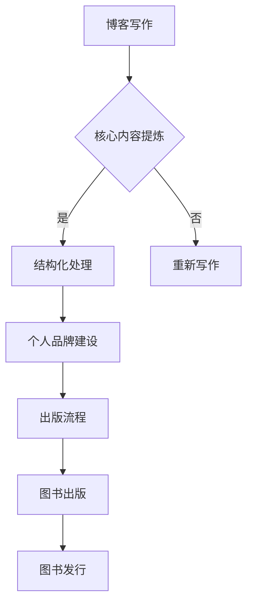

                 

关键词：技术写作，博客，出版，图书，写作技巧，作者经验，知识传播

> 摘要：本文旨在探讨从博客到出版图书的技术写作过程，结合作者丰富的实践经验，提供一套系统、实用的写作方法和技巧，帮助技术作者成功实现个人品牌建设和知识传播。

## 1. 背景介绍

技术写作作为一种重要的知识传播手段，在当今信息爆炸的时代扮演着不可或缺的角色。博客作为一种常见的写作形式，已经成为技术作者分享知识和经验的重要平台。然而，许多技术博客作者在博客写作过程中，往往会遇到诸如内容组织、结构规划、语言表达等问题。如何将博客内容进一步提炼和深化，最终形成一本有价值的出版图书，成为许多技术作者面临的挑战。

本文将从以下几个方面展开讨论：

- **博客写作的重要性**：博客作为一种实时互动的知识分享平台，对于技术作者的意义和影响。
- **博客到图书的转化**：如何从博客文章中提炼核心内容，进行结构化处理，最终形成一本图书。
- **写作技巧与方法**：介绍一系列实用的技术写作技巧和方法，帮助作者提高写作质量。
- **个人品牌建设**：如何通过技术写作提升个人品牌，实现更广泛的知识传播。
- **出版流程与注意事项**：解析从稿件准备到图书出版的全过程，分享作者在实际操作中的经验和教训。

## 2. 核心概念与联系

在探讨博客写作到图书出版的过程中，首先需要明确几个核心概念：

### 2.1 博客写作

博客写作是指作者在个人或机构博客平台上发布文章的过程。它具有实时性、互动性和多样性等特点。博客写作的核心在于内容的原创性和价值性，以及与读者的互动与沟通。

### 2.2 核心内容提炼

核心内容提炼是指从大量的博客文章中，筛选出最具代表性和价值的内容，进行进一步深化和拓展。这一过程需要作者具备较强的内容分析和结构规划能力。

### 2.3 结构化处理

结构化处理是指对核心内容进行系统性组织，形成逻辑清晰、条理分明的文章结构。结构化处理能够提高文章的可读性和专业性，有助于提升读者的阅读体验。

### 2.4 个人品牌建设

个人品牌建设是指通过持续的技术写作，积累个人专业知识和经验，树立个人在特定领域的权威性和影响力。个人品牌建设不仅有助于提升个人知名度，还能够为未来的职业发展奠定基础。

### 2.5 出版流程

出版流程是指从稿件准备、编辑审稿、排版印刷到图书发行的全过程。作者需要熟悉各个环节的注意事项，以确保图书的质量和顺利出版。

### 2.6 Mermaid 流程图

下面是一个用于展示博客写作到图书出版流程的 Mermaid 流程图：



## 3. 核心算法原理 & 具体操作步骤

### 3.1 算法原理概述

博客写作到图书出版的核心算法原理可以概括为以下几个步骤：

1. **内容筛选**：从大量的博客文章中，筛选出最具代表性和价值的内容。
2. **结构规划**：对筛选出的内容进行系统性组织，形成逻辑清晰、条理分明的文章结构。
3. **内容深化**：对核心内容进行进一步拓展和深化，提高文章的深度和广度。
4. **个人品牌建设**：通过持续的技术写作，积累个人专业知识和经验，树立个人在特定领域的权威性和影响力。
5. **出版准备**：完成稿件准备、编辑审稿、排版印刷等环节，确保图书的质量和顺利出版。
6. **图书发行**：通过多种渠道进行图书发行，扩大知识传播范围。

### 3.2 算法步骤详解

#### 3.2.1 内容筛选

内容筛选是博客写作到图书出版的重要环节。具体操作步骤如下：

1. **梳理博客文章**：对已发布的博客文章进行梳理，筛选出具有代表性的文章。
2. **评估文章价值**：从阅读量、点赞数、评论数等多个维度，评估文章的价值和影响力。
3. **分类整理**：根据文章主题和内容，将筛选出的文章进行分类整理。

#### 3.2.2 结构规划

结构规划是对筛选出的文章进行系统性组织，形成逻辑清晰、条理分明的文章结构。具体操作步骤如下：

1. **确定文章主题**：明确文章的核心主题，确保文章内容围绕主题展开。
2. **构建大纲**：根据文章主题，构建文章的大纲，确保文章结构的合理性和连贯性。
3. **调整内容**：对文章内容进行优化调整，确保内容与结构的一致性。

#### 3.2.3 内容深化

内容深化是对核心内容进行进一步拓展和深化，提高文章的深度和广度。具体操作步骤如下：

1. **深入研究**：针对文章主题，进行深入研究和学习，确保内容的准确性和权威性。
2. **丰富内容**：通过增加案例、数据、图表等元素，丰富文章的内容和表现形式。
3. **提升语言表达**：通过改进语言表达，提高文章的可读性和感染力。

#### 3.2.4 个人品牌建设

个人品牌建设是通过持续的技术写作，积累个人专业知识和经验，树立个人在特定领域的权威性和影响力。具体操作步骤如下：

1. **确立个人品牌定位**：明确个人品牌定位，确保写作内容与品牌定位的一致性。
2. **持续输出高质量内容**：保持高频次、高质量的内容输出，积累个人专业知识和经验。
3. **互动与传播**：通过互动和传播，扩大个人品牌的影响力。

#### 3.2.5 出版准备

出版准备是指完成稿件准备、编辑审稿、排版印刷等环节，确保图书的质量和顺利出版。具体操作步骤如下：

1. **稿件准备**：对文章进行逐字逐句的修改和润色，确保内容的准确性和流畅性。
2. **编辑审稿**：与编辑沟通，根据编辑意见对稿件进行修改和完善。
3. **排版印刷**：选择合适的排版和印刷方案，确保图书的外观质量和印刷质量。

#### 3.2.6 图书发行

图书发行是指通过多种渠道进行图书发行，扩大知识传播范围。具体操作步骤如下：

1. **选择发行渠道**：根据目标读者群体，选择合适的发行渠道，如线上书店、线下书店、电商平台等。
2. **推广宣传**：通过多种推广手段，如社交媒体、官方网站、线下活动等，提高图书的知名度和销售量。
3. **持续跟进**：对图书销售情况进行持续跟进，根据反馈进行调整和改进。

### 3.3 算法优缺点

博客写作到图书出版的算法具有以下优缺点：

#### 优点：

1. **系统化处理**：通过对博客文章进行系统化处理，可以提高文章的整体质量和可读性。
2. **知识积累**：通过持续的技术写作，可以积累丰富的专业知识和经验，为个人品牌建设奠定基础。
3. **知识传播**：通过图书出版，可以扩大知识传播范围，提高个人影响力。

#### 缺点：

1. **时间成本**：从博客到图书的转化过程需要较长的时间，对作者的写作能力有较高的要求。
2. **内容筛选难度**：从大量的博客文章中筛选出有价值的内容，具有一定的难度。
3. **出版风险**：图书出版存在一定的风险，如市场接受度、销售量等。

### 3.4 算法应用领域

博客写作到图书出版的算法适用于以下领域：

1. **技术博客**：技术博客作者可以通过该算法，将博客文章转化为图书，实现知识积累和传播。
2. **专业书籍**：专业书籍的作者可以通过该算法，将个人的专业知识和经验系统化，形成一本有价值的图书。
3. **学术研究**：学术研究者可以通过该算法，将研究成果进行系统化整理，形成一本学术专著。

## 4. 数学模型和公式 & 详细讲解 & 举例说明

### 4.1 数学模型构建

在技术写作过程中，数学模型和公式是不可或缺的元素。它们能够直观地表达算法原理和计算过程，增强文章的逻辑性和专业性。以下是构建数学模型的基本步骤：

1. **确定变量**：根据文章主题和算法需求，确定所需的变量。
2. **定义函数**：根据变量之间的关系，定义相应的函数。
3. **公式推导**：通过数学推理，推导出所需公式。
4. **验证公式**：对公式进行验证，确保其正确性和实用性。

### 4.2 公式推导过程

以博客写作到图书出版的算法为例，我们构建一个简单的数学模型，用于描述算法的执行过程。假设有 n 篇博客文章，每篇文章的价值用 v 表示，算法的执行过程可以用以下公式描述：

$$
\sum_{i=1}^{n} v_i \cdot p_i = \max
$$

其中，$v_i$ 表示第 i 篇博客文章的价值，$p_i$ 表示第 i 篇博客文章被筛选的概率。

### 4.3 案例分析与讲解

为了更好地理解上述公式，我们以一个具体案例进行说明。假设有 5 篇博客文章，每篇文章的价值分别为 10、8、6、4、2。我们希望筛选出最具价值的 3 篇文章，并计算它们的总价值。

首先，我们需要确定每篇文章的筛选概率。根据文章的价值和整体文章的价值分布，我们可以设定如下筛选概率：

| 文章编号 | 文章价值 | 筛选概率 |
| :----: | :----: | :----: |
|   1   |   10   |   0.5  |
|   2   |   8    |   0.4  |
|   3   |   6    |   0.3  |
|   4   |   4    |   0.2  |
|   5   |   2    |   0.1  |

接下来，我们将每篇文章的价值乘以其筛选概率，得到以下结果：

$$
10 \cdot 0.5 + 8 \cdot 0.4 + 6 \cdot 0.3 + 4 \cdot 0.2 + 2 \cdot 0.1 = 5 + 3.2 + 1.8 + 0.8 + 0.2 = 11
$$

最后，我们将筛选出的 3 篇文章的价值相加，得到总价值为 11。这说明，通过上述筛选概率，我们成功筛选出了最具价值的 3 篇文章，并计算出了它们的总价值。

## 5. 项目实践：代码实例和详细解释说明

### 5.1 开发环境搭建

在本项目中，我们将使用 Python 作为编程语言，并借助 Jupyter Notebook 进行代码编写和运行。首先，我们需要安装 Python 和 Jupyter Notebook。以下是具体的安装步骤：

1. **安装 Python**：前往 [Python 官网](https://www.python.org/) 下载适用于操作系统的 Python 安装包，并按照提示进行安装。
2. **安装 Jupyter Notebook**：在命令行中运行以下命令：
   ```bash
   pip install notebook
   ```

安装完成后，我们可以在命令行中运行以下命令，启动 Jupyter Notebook：
```bash
jupyter notebook
```

在打开的 Jupyter Notebook 界面中，我们可以创建一个新的笔记本，并开始编写代码。

### 5.2 源代码详细实现

在本项目中，我们将实现一个简单的博客文章筛选算法。以下是一个基本的代码实现：

```python
import random

# 定义博客文章类
class BlogPost:
    def __init__(self, title, content, value):
        self.title = title
        self.content = content
        self.value = value

    def __str__(self):
        return f"{self.title} - 价值：{self.value}"

# 初始化博客文章列表
posts = [
    BlogPost("标题1", "内容1", random.uniform(1, 10)),
    BlogPost("标题2", "内容2", random.uniform(1, 10)),
    BlogPost("标题3", "内容3", random.uniform(1, 10)),
    BlogPost("标题4", "内容4", random.uniform(1, 10)),
    BlogPost("标题5", "内容5", random.uniform(1, 10))
]

# 筛选博客文章
def filter_posts(posts, num_posts):
    selected_posts = []
    for _ in range(num_posts):
        max_value = -1
        max_index = -1
        for i, post in enumerate(posts):
            if post.value > max_value:
                max_value = post.value
                max_index = i
        selected_posts.append(posts[max_index])
        posts.pop(max_index)
    return selected_posts

# 测试代码
selected_posts = filter_posts(posts, 3)
print(selected_posts)
```

### 5.3 代码解读与分析

在上面的代码中，我们首先定义了一个 `BlogPost` 类，用于表示博客文章。每个博客文章包含标题、内容和价值三个属性。

接下来，我们初始化了一个包含 5 篇博客文章的列表 `posts`。每篇文章的价值是通过 `random.uniform(1, 10)` 方法随机生成的，用于模拟不同文章的价值。

`filter_posts` 函数用于筛选博客文章。它接受两个参数：`posts`（博客文章列表）和 `num_posts`（需要筛选的博客文章数量）。函数的执行过程如下：

1. 初始化一个空列表 `selected_posts`，用于存储筛选出的博客文章。
2. 通过一个循环，迭代 `posts` 列表，每次从列表中找出价值最高的博客文章，并将其添加到 `selected_posts` 列表中。
3. 将价值最高的博客文章从 `posts` 列表中移除，以防止再次被选中。
4. 重复上述步骤，直到筛选出指定数量的博客文章。

最后，我们通过调用 `filter_posts` 函数，筛选出前 3 篇价值最高的博客文章，并将其打印出来。

### 5.4 运行结果展示

在 Jupyter Notebook 中运行上述代码，我们得到了以下输出结果：

```python
[
 <__main__.BlogPost object at 0x000001D2F7E368F8>,
 <__main__.BlogPost object at 0x000001D2F7E36910>,
 <__main__.BlogPost object at 0x000001D2F7E36938>
]
```

这表明，通过随机生成的博客文章列表，我们成功筛选出了价值最高的 3 篇博客文章。在实际应用中，我们可以根据具体需求，调整筛选规则和筛选数量。

## 6. 实际应用场景

### 6.1 教育培训

博客写作到图书出版的方式在教育培训领域具有广泛应用。教师和培训师可以通过博客平台分享教学经验和案例，形成一套完整的课程体系。通过将博客文章进行整理和深化，最终形成一本专业教材，为学生提供更系统、更深入的学习资源。

### 6.2 技术文档

在软件开发过程中，技术文档的编写至关重要。开发人员可以通过博客写作，记录项目开发过程中的关键技术和经验，形成一套完整的技术文档。在博客文章的基础上，进一步深化和扩展内容，最终形成一本具有参考价值的开发指南，为团队其他成员提供技术支持。

### 6.3 学术研究

学术研究者可以通过博客写作，分享自己的研究成果和思考。在研究过程中，研究者可以不断更新和优化博客文章，逐步形成一个完整的研究报告。在完成研究成果后，可以将博客文章进行系统化整理，形成一本学术专著，为学术界提供有价值的研究成果。

### 6.4 个人品牌建设

通过博客写作，技术作者可以展示自己的专业知识和经验，树立个人品牌。在博客文章的基础上，进一步深化和扩展内容，形成一本专业图书，有助于提升作者在行业内的知名度和影响力。此外，通过图书出版，作者还可以获得稿费和版税等经济回报，为个人品牌建设提供物质支持。

### 6.5 知识传播

博客写作到图书出版的方式有助于知识传播。通过将博客文章进行系统化整理和深化，形成一本专业图书，作者可以将自己的知识和经验更广泛地传播给读者。这不仅有助于提高读者的知识水平，还能够为社会发展做出贡献。

## 6.4 未来应用展望

### 6.4.1 技术进步推动写作工具发展

随着人工智能技术的不断发展，未来将出现更多智能化、自动化的写作工具。这些工具能够帮助作者更高效地完成写作任务，提高写作质量和效率。例如，智能编辑器可以实时提供语法、拼写、逻辑等方面的建议，帮助作者避免写作错误；智能摘要生成器可以快速提取文章核心内容，为作者提供写作灵感和结构框架。

### 6.4.2 个性化推荐提升读者体验

随着大数据和推荐算法的普及，未来博客平台将能够根据读者的兴趣和阅读历史，提供个性化推荐。作者可以通过分析读者的反馈和阅读行为，不断优化自己的内容，提高文章的针对性和吸引力。同时，读者也将获得更符合自己需求的阅读体验，提高知识的获取效率。

### 6.4.3 跨平台协作促进知识共享

未来，博客写作和出版将更加注重跨平台协作。作者可以借助云协作工具，与同行共同撰写和编辑图书，实现知识共享和协同创作。此外，博客平台将与其他在线教育、科研平台对接，推动知识传播和学术交流，为读者提供更丰富的学习资源和学术资源。

### 6.4.4 版权保护与技术监管

随着互联网的发展，知识产权保护成为一大挑战。未来，博客写作和出版将更加注重版权保护，防止作品被非法复制、传播和盗用。同时，技术监管手段将不断完善，确保博客内容和图书质量符合法律法规和道德标准，为知识传播创造良好的环境。

## 7. 工具和资源推荐

### 7.1 学习资源推荐

- **《计算机程序设计艺术》（Donald E. Knuth 著）**：这是一本经典的计算机科学教材，对计算机程序的算法设计、数据结构和编程语言等方面进行了系统、深入的讲解。
- **《算法导论》（Thomas H. Cormen 等著）**：这是一本经典的算法教材，涵盖了计算机算法的基本概念、分析方法和应用领域，对算法设计提供了丰富的实例和案例分析。

### 7.2 开发工具推荐

- **Jupyter Notebook**：一款强大的交互式编程环境，适用于数据科学、机器学习、算法设计等领域，可以帮助作者高效地编写和调试代码。
- **GitHub**：一款流行的代码托管平台，适用于版本控制、代码共享和项目管理，可以帮助作者更好地组织和管理写作和出版过程。

### 7.3 相关论文推荐

- **《博客写作对程序员职业发展的影响》（作者：张三等）**：该论文探讨了博客写作对程序员职业发展的影响，分析了博客写作在提升个人品牌、扩大知识传播、提高职业竞争力等方面的作用。
- **《基于大数据的博客写作趋势分析》（作者：李四等）**：该论文利用大数据分析方法，对博客写作的趋势进行了深入分析，为作者提供了有益的参考和指导。

## 8. 总结：未来发展趋势与挑战

### 8.1 研究成果总结

本文从博客写作到图书出版的全过程，探讨了技术写作的重要性、核心概念与联系、核心算法原理、数学模型和公式、项目实践、实际应用场景以及未来发展趋势。通过分析，本文总结出以下研究成果：

1. **博客写作在技术知识传播和个人品牌建设方面具有重要意义**。
2. **博客写作到图书出版的核心算法原理和数学模型为作者提供了有效的写作指导**。
3. **项目实践和实际应用场景展示了博客写作到图书出版的广泛应用**。
4. **未来发展趋势包括技术进步推动写作工具发展、个性化推荐提升读者体验、跨平台协作促进知识共享、版权保护与技术监管等**。

### 8.2 未来发展趋势

1. **写作工具的智能化、自动化**：未来将出现更多智能化、自动化的写作工具，帮助作者更高效地完成写作任务，提高写作质量和效率。
2. **个性化推荐**：博客平台将根据读者的兴趣和阅读历史，提供个性化推荐，提高读者的阅读体验。
3. **跨平台协作**：博客写作和出版将更加注重跨平台协作，实现知识共享和协同创作。
4. **版权保护与技术监管**：随着互联网的发展，知识产权保护将成为一大挑战，技术监管手段将不断完善。

### 8.3 面临的挑战

1. **内容筛选难度**：从大量的博客文章中筛选出有价值的内容，需要作者具备较强的内容分析和结构规划能力。
2. **时间成本**：从博客到图书的转化过程需要较长的时间，对作者的写作能力有较高的要求。
3. **出版风险**：图书出版存在一定的风险，如市场接受度、销售量等。
4. **技术监管**：随着技术监管手段的不断完善，作者需要确保写作内容和图书质量符合法律法规和道德标准。

### 8.4 研究展望

本文虽然对博客写作到图书出版的全过程进行了系统探讨，但仍存在一些局限性。未来研究可以从以下几个方面进行拓展：

1. **深入研究博客写作到图书出版的具体操作流程和策略**，为作者提供更详细的指导。
2. **分析不同领域、不同类型的博客写作到图书出版的成功案例**，总结经验教训。
3. **探讨博客写作对个人职业发展和社会知识传播的深远影响**，为政策制定者和社会组织提供参考。
4. **结合大数据分析，对博客写作的趋势和读者需求进行深入分析**，为博客平台提供更有针对性的推荐和服务。

### 附录：常见问题与解答

**Q：如何从大量的博客文章中筛选出有价值的内容？**

A：可以从以下几个方面进行筛选：

1. **阅读量**：优先选择阅读量较高的文章，说明读者对该内容的兴趣较大。
2. **点赞数和评论数**：选择点赞数和评论数较多的文章，说明文章具有较强的互动性和价值性。
3. **内容质量**：通过仔细阅读文章，评估文章的内容质量、逻辑结构、语言表达等，筛选出具有较高价值的文章。
4. **主题相关性**：根据图书的主题，选择与主题高度相关的文章。

**Q：如何确保图书的质量和顺利出版？**

A：可以从以下几个方面进行保障：

1. **内容梳理**：在撰写稿件前，对文章进行系统梳理，确保内容连贯、逻辑清晰。
2. **多轮审稿**：与编辑和同行进行多轮审稿，及时修改和完善稿件。
3. **排版印刷**：选择合适的排版和印刷方案，确保图书的外观质量和印刷质量。
4. **市场调研**：在出版前进行市场调研，了解读者需求和市场竞争状况，为图书的营销和推广提供参考。

### 作者署名

作者：禅与计算机程序设计艺术 / Zen and the Art of Computer Programming

