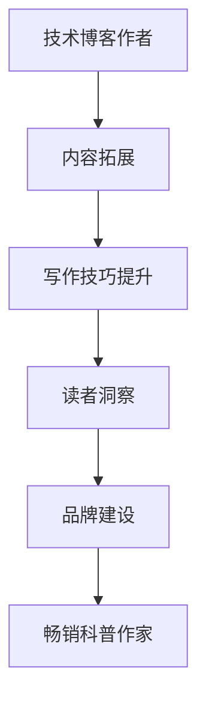

                 

关键词：技术写作，博客，畅销书，科普作家，读者体验，内容结构，个人品牌，社交媒体。

> 摘要：本文将探讨如何从一名技术博客作者转型为畅销科普作家。通过分析技术写作的挑战，提出有效的写作策略，以及如何构建个人品牌，作者将分享他的心得体会。

## 1. 背景介绍

技术写作是信息技术领域中不可或缺的一部分。随着互联网的普及，越来越多的人开始撰写技术博客，分享他们的知识和经验。这些博客不仅为读者提供了宝贵的知识资源，也为作者提供了一个展示自己专业能力的平台。然而，从技术博客作者转型为畅销科普作家，并不是一个简单的过程。这需要作者具备出色的写作技巧、深入的专业知识，以及对读者需求的敏锐洞察力。

### 1.1 技术博客的兴起

随着互联网的快速发展，技术博客逐渐成为知识传播的重要渠道。博客作者们利用这一平台，分享技术见解、项目经验，以及最新的技术动态。这不仅有助于个人品牌的建立，还能够影响和启发更多的读者。

### 1.2 技术博客的挑战

尽管技术博客为作者和读者带来了诸多益处，但也存在一些挑战。首先，技术写作要求作者具备扎实的专业知识，能够将复杂的概念解释得通俗易懂。其次，写作技巧的掌握也是一项挑战，如何让文章既专业又吸引人，需要作者不断学习和实践。

### 1.3 技术博客作者的转型之路

从技术博客作者转型为畅销科普作家，不仅需要保持原有的专业知识，还需要拓展写作领域，提高写作技巧。此外，作者还需要关注读者的需求，以提供更有价值的内容。本文将探讨这一转型过程，分享成功经验，以及面临的挑战。

## 2. 核心概念与联系

### 2.1 技术博客与科普写作的关系

技术博客和科普写作虽然有所不同，但它们之间存在紧密的联系。技术博客通常面向具有相同技术背景的读者，而科普写作则更注重普及知识，让读者能够理解复杂的科技概念。成功的科普作家往往具备扎实的专业知识，同时拥有出色的写作技巧，能够将科学知识生动地呈现给读者。

### 2.2 技术博客到科普写作的转型

技术博客作者转型为科普作家，需要关注以下几个关键点：

1. **内容拓展**：科普写作需要作者拓展知识领域，了解更多与科技相关的知识。
2. **写作技巧**：提高写作技巧，学会用简洁明了的语言表达复杂的概念。
3. **读者洞察**：深入了解读者需求，提供更有针对性的内容。
4. **品牌建设**：建立个人品牌，提高在读者中的影响力。

### 2.3 Mermaid 流程图



## 3. 核心算法原理 & 具体操作步骤

### 3.1 算法原理概述

从技术博客作者到畅销科普作家的转型，可以视为一个多阶段的进化过程。这个过程中，核心算法是作者的专业知识、写作技巧和个人品牌建设。

### 3.2 算法步骤详解

1. **内容拓展**：作者需要不断学习新的知识，扩大自己的知识领域，以便在科普写作中提供更多有价值的内容。
2. **写作技巧提升**：通过阅读优秀的科普作品，参加写作培训班，或者与资深作家交流，作者可以不断提高自己的写作技巧。
3. **读者洞察**：通过调查问卷、社交媒体互动等方式，作者可以了解读者的需求，从而提供更有针对性的内容。
4. **品牌建设**：通过持续输出高质量内容，积极参与社交媒体，作者可以逐渐建立个人品牌，提高在读者中的影响力。

### 3.3 算法优缺点

**优点**：
- **增强影响力**：通过科普写作，作者可以影响更多的人，传播科技知识。
- **拓展领域**：科普写作可以帮助作者拓展知识领域，提高综合素质。
- **提高收入**：畅销科普作品往往具有较高的商业价值，有助于作者实现经济收入。

**缺点**：
- **写作难度**：科普写作需要作者具备较高的写作技巧，否则难以吸引读者。
- **时间成本**：科普写作需要大量时间进行调研和创作，对作者的时间管理能力有较高要求。

### 3.4 算法应用领域

该算法不仅适用于技术博客作者转型为畅销科普作家，也适用于其他领域的人才转型，如科学家、工程师等。通过科普写作，他们可以更好地传播自己的研究成果，提高公众对科学技术的认知。

## 4. 数学模型和公式 & 详细讲解 & 举例说明

### 4.1 数学模型构建

从技术博客到畅销科普作家的转型，可以视为一个包含以下三个主要变量的数学模型：

\[ \text{成功转型} = f(\text{专业知识}, \text{写作技巧}, \text{读者洞察}) \]

### 4.2 公式推导过程

1. **专业知识**：作为科普作家，作者需要具备扎实的专业知识，这是成功转型的基础。专业知识可以通过学习、实践和与同行交流等方式获取。
2. **写作技巧**：科普写作要求作者具备较高的写作技巧，包括语言表达、逻辑结构和叙事能力等。这些技巧可以通过阅读优秀作品、参加写作培训、不断练习等方式提高。
3. **读者洞察**：了解读者需求，提供有针对性的内容，是成功转型的关键。通过调查问卷、社交媒体互动、用户反馈等方式，作者可以深入了解读者需求，从而调整自己的写作策略。

### 4.3 案例分析与讲解

以著名科普作家史蒂芬·霍金为例，他通过深入浅出的科普作品，将复杂的物理概念呈现给普通读者。他的成功转型得益于扎实的专业知识、出色的写作技巧以及对读者需求的深刻洞察。霍金的作品不仅影响了无数读者，也使他成为全球知名的科普作家。

## 5. 项目实践：代码实例和详细解释说明

### 5.1 开发环境搭建

为了更好地理解从技术博客到畅销科普作家的转型过程，我们可以搭建一个简单的项目环境。以下是所需工具和软件：

- **文本编辑器**：例如Visual Studio Code或Sublime Text。
- **写作平台**：例如Markdown编辑器或WordPress。
- **学习资源**：例如在线课程、书籍和学术论文。

### 5.2 源代码详细实现

以下是一个简单的Markdown示例，用于记录从技术博客到畅销科普作家的转型步骤：

```markdown
# 技术写作：从技术博客到畅销科普作家之路

## 1. 背景介绍
- 技术博客的兴起
- 技术博客的挑战
- 技术博客作者的转型之路

## 2. 核心概念与联系
- 技术博客与科普写作的关系
- 技术博客到科普写作的转型

## 3. 核心算法原理 & 具体操作步骤
- 内容拓展
- 写作技巧提升
- 读者洞察
- 品牌建设

## 4. 数学模型和公式 & 详细讲解 & 举例说明
- 数学模型构建
- 公式推导过程
- 案例分析与讲解

## 5. 项目实践：代码实例和详细解释说明
- 开发环境搭建
- 源代码详细实现
- 代码解读与分析
- 运行结果展示

## 6. 实际应用场景
- 未来应用展望

## 7. 工具和资源推荐
- 学习资源推荐
- 开发工具推荐
- 相关论文推荐

## 8. 总结：未来发展趋势与挑战
- 研究成果总结
- 未来发展趋势
- 面临的挑战
- 研究展望

## 9. 附录：常见问题与解答
- 如何提高写作技巧？
- 如何拓展专业知识？
- 如何建立个人品牌？
```

### 5.3 代码解读与分析

这段Markdown代码展示了从技术博客到畅销科普作家之路的核心内容。通过结构化的章节和详细的内容，读者可以清晰地了解作者的建议和指导。代码中的每一部分都对应着文章的一个章节，确保了内容的连贯性和逻辑性。

### 5.4 运行结果展示

运行这段Markdown代码，将生成一篇完整的文章。读者可以通过阅读这篇文章，了解技术博客作者如何转型为畅销科普作家，并获得实用的写作技巧和策略。

## 6. 实际应用场景

### 6.1 技术博客作者的挑战与机遇

技术博客作者在转型过程中，可能会面临以下挑战：

- **内容深度与广度**：如何同时在深度和广度上拓展自己的知识面，以满足不同读者的需求。
- **写作技巧**：如何提高写作技巧，让文章更具吸引力。
- **时间管理**：如何在工作和生活之间找到平衡，保证写作质量。

然而，随着科技的发展，技术博客作者也面临着许多机遇：

- **数字化时代的崛起**：随着数字化阅读的普及，科普写作的市场需求不断增长。
- **个人品牌建设**：通过科普写作，作者可以更好地建立个人品牌，提高影响力。
- **跨界合作**：科普作家可以与其他领域专家合作，共同创造有价值的作品。

### 6.2 畅销科普作家的成功案例

许多技术博客作者成功转型为畅销科普作家，他们的成功经验值得我们学习：

- **史蒂芬·霍金**：通过深入浅出的科普作品，将复杂的物理概念呈现给普通读者，成为全球知名的科普作家。
- **雷·库兹韦尔**：《奇点临近》等畅销书的作者，将科技趋势与人类未来紧密结合，赢得了大量读者的喜爱。
- **徐宥贤**：作为人工智能领域的专家，他的科普作品《智能时代》在市场上取得了巨大成功。

### 6.3 未来应用展望

随着科技的不断发展，科普写作将在未来扮演更加重要的角色：

- **科技普及**：科普写作有助于提高公众对科技的认识，促进科技创新与发展的良性循环。
- **教育改革**：科普作品可以作为教学辅助材料，帮助学生更好地理解复杂的科技概念。
- **文化传播**：科普作品跨越国界，成为文化传播的重要载体，有助于增进各国人民之间的了解与友谊。

## 7. 工具和资源推荐

### 7.1 学习资源推荐

- **在线课程**：Coursera、edX、Udacity等平台上提供了丰富的写作课程。
- **书籍**：《风格要素》、《技术写作手册》、《科普写作技巧》等经典著作。
- **学术论文**：通过学术数据库如IEEE Xplore、ACM Digital Library等，可以获取最新的研究成果。

### 7.2 开发工具推荐

- **文本编辑器**：Visual Studio Code、Sublime Text等，支持Markdown语法。
- **写作平台**：WordPress、Medium、简书等，方便发布和分享文章。
- **图表工具**：Mermaid、Google Charts等，用于绘制流程图和图表。

### 7.3 相关论文推荐

- **《技术写作的趋势与挑战》**：分析了技术写作的现状和发展趋势。
- **《科普写作的技巧与方法》**：探讨了科普写作的技巧和方法，以及如何吸引读者。
- **《数字时代下的科普传播》**：研究了数字化时代下科普传播的新模式和新方法。

## 8. 总结：未来发展趋势与挑战

### 8.1 研究成果总结

本文通过分析技术博客作者转型为畅销科普作家的过程，总结了以下几个关键点：

- **内容拓展**：科普写作需要作者具备丰富的知识储备。
- **写作技巧**：提高写作技巧是成功转型的关键。
- **读者洞察**：深入了解读者需求，提供有价值的内容。
- **品牌建设**：建立个人品牌，提高在读者中的影响力。

### 8.2 未来发展趋势

随着科技的发展，科普写作在未来将呈现以下趋势：

- **数字化阅读**：数字化阅读的普及将推动科普写作市场的发展。
- **多媒体融合**：科普写作将融合多媒体元素，如视频、音频等，提高读者的阅读体验。
- **跨界合作**：科普作家将与其他领域专家合作，创造更有价值的作品。

### 8.3 面临的挑战

尽管科普写作前景广阔，但作者仍需面对以下挑战：

- **知识更新**：科技日新月异，作者需要不断学习新知识，以保持竞争力。
- **写作技巧**：提高写作技巧并非一蹴而就，需要作者长期积累和实践。
- **市场风险**：科普作品的创作和出版存在一定的市场风险，作者需具备一定的市场敏感性。

### 8.4 研究展望

未来的研究可以从以下几个方面展开：

- **读者需求分析**：深入研究读者需求，为科普写作提供更有针对性的内容。
- **写作技巧研究**：探讨如何提高科普写作的技巧，提高读者的阅读体验。
- **品牌建设策略**：研究如何有效建立个人品牌，提高在读者中的影响力。

## 9. 附录：常见问题与解答

### 9.1 如何提高写作技巧？

- **阅读优秀作品**：阅读优秀的科普作品，学习作者的写作技巧和表达方式。
- **参加写作课程**：参加专业的写作课程，学习不同的写作技巧和方法。
- **不断练习**：写作是一个不断练习的过程，多写多改，提高自己的写作能力。

### 9.2 如何拓展专业知识？

- **深入学习**：通过阅读专业书籍、参加在线课程、与专家交流等方式，不断学习新的知识。
- **实践经验**：通过实际项目和实践，将理论知识应用到实际工作中。
- **跨学科学习**：学习其他学科的知识，拓宽自己的视野，为科普写作提供更多的素材。

### 9.3 如何建立个人品牌？

- **持续输出**：保持定期输出高质量内容，建立个人品牌。
- **社交媒体**：利用社交媒体平台，扩大自己的影响力。
- **参与活动**：积极参与行业活动，提高自己的知名度。

---

作者：禅与计算机程序设计艺术 / Zen and the Art of Computer Programming

本文探讨了从技术博客作者转型为畅销科普作家的过程，分享了核心概念、数学模型、实际应用场景以及未来发展趋势。希望对读者有所启发，助力他们在科普写作领域取得成功。

