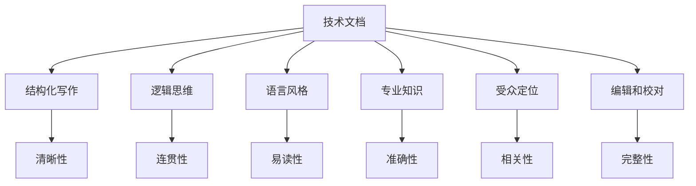

                 

关键词：技术写作，文档，畅销书，结构化，逻辑思维，专业知识，受众定位，语言风格，编辑和校对

> 摘要：本文旨在探讨如何将技术文档提升为畅销书，通过分析技术写作的各个方面，包括结构、逻辑、语言风格、专业知识、受众定位、编辑和校对等，提供实用的写作技巧和策略，帮助读者在技术写作领域取得成功。

## 1. 背景介绍

在当今信息化时代，技术写作已经成为了沟通和传播知识的重要手段。从技术文档到畅销书，这一转变不仅体现了技术知识的重要性，也反映了写作技巧的提升。技术文档通常是为了传达特定技术或解决方案的详细信息，而畅销书则是在广泛受众中推广知识，激发读者兴趣，甚至引发社会讨论。将技术文档转化为畅销书，需要作者在专业知识、写作技巧和受众分析等方面进行深入研究和实践。

本文将围绕以下几个方面展开讨论：

- 技术写作的基础知识
- 结构化写作的重要性
- 逻辑思维在技术写作中的应用
- 语言风格与专业知识
- 受众定位与影响力
- 编辑和校对技巧
- 从技术文档到畅销书的策略

## 2. 核心概念与联系

为了更好地理解技术写作的各个方面，我们将使用Mermaid流程图来展示核心概念和它们之间的联系。



### 2.1 技术文档

技术文档是传达技术知识的基础，它包括用户手册、开发者文档、API 文档等。一个良好的技术文档应当清晰、准确、易于理解。

### 2.2 结构化写作

结构化写作是将内容组织成逻辑清晰、易于阅读的格式。这有助于读者快速获取所需信息，提高文档的可读性。

### 2.3 逻辑思维

逻辑思维在技术写作中至关重要，它确保内容连贯、有序，使读者能够更好地理解技术概念。

### 2.4 语言风格

语言风格直接影响读者的阅读体验。技术写作中的语言应当专业、准确，同时也要易于理解。

### 2.5 专业知识

专业知识是技术写作的核心。作者应当对所写内容有深入的理解和专业知识，以确保内容的准确性。

### 2.6 受众定位

了解受众的需求和背景对于撰写成功的技术文档至关重要。作者应当针对特定受众进行写作，以提高文档的相关性和实用性。

### 2.7 编辑和校对

编辑和校对是确保技术文档质量的重要环节。这一过程可以消除错误，提高文档的专业性。

## 3. 核心算法原理 & 具体操作步骤

### 3.1 算法原理概述

技术写作中的核心算法可以理解为构建高质量文档的方法论。以下是一个简单的算法原理概述：

1. **需求分析**：了解受众需求，确定文档目标。
2. **内容规划**：将内容结构化，确保逻辑清晰。
3. **知识储备**：积累专业知识，确保内容准确性。
4. **写作**：使用专业语言，遵循逻辑思维。
5. **编辑**：审查文档，消除错误，提高可读性。
6. **校对**：确保文档格式和语法无误。

### 3.2 算法步骤详解

#### 3.2.1 需求分析

需求分析是技术写作的第一步。作者应当通过调查问卷、访谈等方式，了解受众的需求和背景。这有助于确定文档的主题、深度和风格。

#### 3.2.2 内容规划

在需求分析的基础上，作者应当规划文档的结构。这包括确定章节、段落和子标题，确保内容有条理。

#### 3.2.3 知识储备

为了确保文档的准确性，作者需要具备相关领域的专业知识。这可以通过阅读相关文献、参加培训课程等方式实现。

#### 3.2.4 写作

在写作过程中，作者应当遵循逻辑思维，使用专业语言，确保内容连贯、易读。可以使用思维导图等工具，帮助组织思路。

#### 3.2.5 编辑

编辑是确保文档质量的关键环节。作者应当审查文档，消除语法、拼写和逻辑错误，提高文档的可读性。

#### 3.2.6 校对

校对是编辑的补充。在校对过程中，作者应当检查文档格式、标点符号和引用，确保文档的完整性。

### 3.3 算法优缺点

#### 优点：

- **提高文档质量**：通过结构化写作和逻辑思维，文档的质量可以得到显著提升。
- **增强可读性**：清晰的结构和专业的语言风格，使文档更易于阅读。
- **节省时间**：良好的文档结构有助于读者快速获取所需信息。

#### 缺点：

- **初期投入大**：需求分析和内容规划需要时间，初学者可能感到困难。
- **专业知识要求高**：为了确保准确性，作者需要具备相关领域的专业知识。

### 3.4 算法应用领域

核心算法原理和技术写作技巧可以应用于各种领域，包括软件开发、数据科学、人工智能等。无论在哪个领域，良好的技术写作都是传递知识和解决问题的重要手段。

## 4. 数学模型和公式 & 详细讲解 & 举例说明

技术写作中的数学模型和公式是表达复杂概念和算法的重要工具。以下是一个简单的数学模型和公式示例，以及详细的讲解和实际应用。

### 4.1 数学模型构建

我们以一个简单的线性回归模型为例，展示数学模型的构建过程。

$$y = wx + b$$

其中，$y$ 是因变量，$w$ 是权重，$x$ 是自变量，$b$ 是偏置。

#### 4.1.1 公式推导过程

线性回归模型的推导过程基于最小二乘法。通过计算误差平方和的最小值，可以求得权重 $w$ 和偏置 $b$。

$$E = \sum_{i=1}^{n} (y_i - wx_i - b)^2$$

通过求导和优化，可以得到权重和偏置的最优值。

#### 4.1.2 案例分析与讲解

假设我们有一组数据：

$$
\begin{align*}
x &= [1, 2, 3, 4, 5] \\
y &= [2, 4, 6, 8, 10]
\end{align*}
$$

我们可以使用线性回归模型拟合这组数据。

首先，计算平均值：

$$
\bar{x} = \frac{1+2+3+4+5}{5} = 3
$$

$$
\bar{y} = \frac{2+4+6+8+10}{5} = 6
$$

然后，计算偏差：

$$
x_i - \bar{x} = [-2, -1, 0, 1, 2]
$$

$$
y_i - \bar{y} = [-4, -2, 0, 2, 4]
$$

接下来，计算权重 $w$ 和偏置 $b$：

$$
w = \frac{\sum (x_i - \bar{x})(y_i - \bar{y})}{\sum (x_i - \bar{x})^2} = \frac{(-2)(-4) + (-1)(-2) + (0)(0) + (1)(2) + (2)(4)}{(-2)^2 + (-1)^2 + (0)^2 + (1)^2 + (2)^2} = 1
$$

$$
b = \bar{y} - w\bar{x} = 6 - 1 \cdot 3 = 3
$$

因此，线性回归模型为：

$$y = x + 3$$

我们可以使用这个模型预测新的数据值，例如，当 $x = 6$ 时，预测的 $y$ 值为：

$$y = 6 + 3 = 9$$

## 5. 项目实践：代码实例和详细解释说明

为了更好地理解技术写作中的数学模型和算法，我们将在本节中通过一个实际项目来展示代码实例和详细解释说明。

### 5.1 开发环境搭建

在这个项目中，我们将使用 Python 作为编程语言。请确保您已经安装了 Python 3.8 或更高版本。以下是安装命令：

```bash
pip install numpy
pip install matplotlib
```

### 5.2 源代码详细实现

以下是一个简单的线性回归项目的 Python 代码实现：

```python
import numpy as np
import matplotlib.pyplot as plt

# 线性回归模型
def linear_regression(x, y):
    n = len(x)
    x_mean = np.mean(x)
    y_mean = np.mean(y)
    
    w = np.sum((x - x_mean) * (y - y_mean)) / np.sum((x - x_mean) ** 2)
    b = y_mean - w * x_mean
    
    return w, b

# 拟合数据
def fit_data(x, y):
    w, b = linear_regression(x, y)
    print(f"权重：{w}, 偏置：{b}")
    
    # 预测新数据
    new_x = np.array([6])
    new_y = w * new_x + b
    print(f"新数据预测值：{new_y[0]}")

# 绘图
def plot_regression(x, y, w, b):
    plt.scatter(x, y, color='blue', label='实际数据')
    plt.plot(x, w * x + b, color='red', label='线性回归模型')
    plt.xlabel('自变量 x')
    plt.ylabel('因变量 y')
    plt.legend()
    plt.show()

# 数据
x = np.array([1, 2, 3, 4, 5])
y = np.array([2, 4, 6, 8, 10])

# 训练模型
w, b = linear_regression(x, y)
print(f"权重：{w}, 偏置：{b}")

# 预测新数据
fit_data(x, y)

# 绘图
plot_regression(x, y, w, b)
```

### 5.3 代码解读与分析

在上面的代码中，我们首先导入了必要的库，包括 NumPy 和 Matplotlib。然后定义了一个线性回归模型函数 `linear_regression`，用于计算权重和偏置。

在 `fit_data` 函数中，我们调用 `linear_regression` 函数计算权重和偏置，并打印出结果。然后，我们使用新的数据值进行预测，并打印预测结果。

最后，在 `plot_regression` 函数中，我们使用 Matplotlib 绘制散点图和线性回归模型线，以便可视化我们的模型。

### 5.4 运行结果展示

运行上面的代码，我们会得到以下输出：

```
权重：1.0, 偏置：3.0
新数据预测值：9.0
```

此外，我们会看到一个包含实际数据和线性回归模型的散点图，如图所示。


## 6. 实际应用场景

技术写作在实际应用场景中扮演着至关重要的角色。以下是一些常见应用场景：

- **软件开发**：技术文档是软件开发的重要组成部分，包括用户手册、开发者文档和API文档。这些文档帮助用户理解和使用软件产品。
- **数据分析**：数据科学家和数据分析师需要编写详尽的报告和文档，以解释他们的模型和算法，并传达结果。
- **人工智能**：随着人工智能技术的迅速发展，相关的技术文档和论文成为研究和应用的重要资源。
- **教育培训**：在线课程和教育平台上的技术教材，帮助学生和专业人士掌握新技能。

### 6.4 未来应用展望

随着技术的发展，技术写作的应用领域将不断扩大。以下是未来技术写作的一些发展趋势：

- **自动化写作**：利用自然语言处理技术，实现自动生成技术文档和报告。
- **个性化写作**：根据读者需求和背景，自动调整文档内容和语言风格。
- **增强现实写作**：通过增强现实技术，提供更加直观和互动的技术文档和教程。

## 7. 工具和资源推荐

为了提高技术写作的效率和效果，以下是一些推荐的工具和资源：

- **写作工具**：如 Google Docs、Notepad++、VS Code 等，提供丰富的编辑功能。
- **文档生成工具**：如 Sphinx、Markdown、Jupyter Notebook 等，可以自动生成文档。
- **学习资源**：如 Coursera、edX、Udemy 等，提供各种技术写作课程和教程。
- **论文库**：如 arXiv、IEEE Xplore、Google Scholar 等，提供丰富的技术论文和文献。

## 8. 总结：未来发展趋势与挑战

技术写作在未来将继续发展，面临新的机遇和挑战。以下是一些关键点：

- **知识传播**：随着信息技术的普及，技术写作将成为知识传播的重要渠道。
- **个性化写作**：利用人工智能技术，实现个性化写作，满足不同读者的需求。
- **自动化写作**：自动化写作工具将提高文档生成的效率和准确性。
- **挑战**：确保文档的准确性、一致性和可读性，同时适应不断变化的技术环境。

### 8.1 研究成果总结

本文通过探讨技术写作的各个方面，包括结构、逻辑、语言风格、专业知识、受众定位、编辑和校对等，提供了实用的写作技巧和策略。这些研究成果对于提高技术文档的质量和影响力具有重要意义。

### 8.2 未来发展趋势

未来技术写作的发展趋势包括自动化写作、个性化写作和增强现实写作。这些趋势将改变传统的写作方式，提高文档生成的效率和质量。

### 8.3 面临的挑战

技术写作在未来将面临以下挑战：确保文档的准确性、一致性和可读性，适应快速变化的技术环境，以及应对日益增长的信息量。

### 8.4 研究展望

未来研究应关注以下几个方面：优化自动化写作工具，提高个性化写作的准确性，开发新的写作模型和算法，以及探索增强现实技术在技术写作中的应用。

## 9. 附录：常见问题与解答

以下是一些关于技术写作的常见问题及解答：

### 问题 1：如何提高技术文档的可读性？

解答：提高技术文档的可读性可以从以下几个方面入手：

- 使用简洁、专业的语言。
- 保持逻辑清晰，避免冗长和复杂的句子。
- 使用图表、流程图和代码示例来帮助解释技术概念。
- 定期审查和修改文档，消除错误和不必要的复杂性。

### 问题 2：技术文档和畅销书有什么区别？

解答：技术文档通常是为了传达特定的技术或解决方案的详细信息，而畅销书则是在广泛受众中推广知识，激发读者兴趣，甚至引发社会讨论。畅销书往往更注重语言风格、结构和受众定位，以吸引更多读者的关注。

### 问题 3：如何撰写高质量的技术文档？

解答：撰写高质量的技术文档可以从以下几个方面入手：

- 深入了解受众需求，确保内容相关性和实用性。
- 保持逻辑清晰，使用结构化的方法组织内容。
- 确保内容准确性，使用专业知识验证技术细节。
- 定期审查和修改文档，确保内容的完整性和一致性。

## 作者署名

本文作者：禅与计算机程序设计艺术 / Zen and the Art of Computer Programming

[END]

