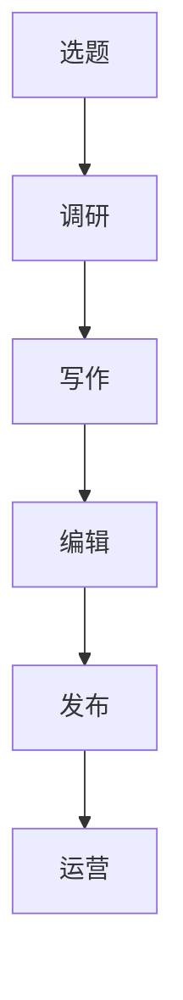

                 

关键词：技术写作、博客建设、读者吸引力、内容创作、专业知识分享

> 摘要：本文旨在为技术创作者提供一些建议和策略，帮助他们打造出具有高订阅量、广受欢迎的技术博客。文章将从内容策划、写作技巧、发布策略等多个角度展开，分享如何通过技术写作实现博客的持续增长和影响力。

## 1. 背景介绍

随着互联网的普及和信息技术的发展，技术博客已经成为程序员、开发者和IT专业人士展示自我、分享知识的重要平台。一个成功的博客不仅可以提升个人品牌，还能吸引大量关注者，甚至成为创业的跳板。然而，打造一个受欢迎的技术博客并非易事，需要创作者具备扎实的技术功底、出色的写作技巧和高效的运营策略。

本文将围绕以下几个核心问题展开讨论：

1. 如何策划和选择具有吸引力的博客主题？
2. 如何撰写易于理解、引人入胜的技术文章？
3. 如何制定并执行有效的博客发布策略？
4. 如何通过互动和社群运营提高博客的订阅量和影响力？

## 2. 核心概念与联系

### 2.1 博客创作流程

在开始写作之前，我们需要了解一个完整的博客创作流程，包括选题、调研、写作、编辑、发布和运营等环节。以下是一个简单的博客创作流程图：



### 2.2 读者需求分析

为了创作出符合读者需求的博客内容，我们需要对目标读者进行需求分析。以下是一些常用的分析方法：

- 用户画像：通过年龄、性别、职业、兴趣爱好等信息了解读者的基本特征。
- 内容偏好：分析读者在阅读过程中关注的问题、话题和关键词。
- 行为数据：通过网站流量、阅读时长、点赞、评论等行为数据了解读者的兴趣点。

### 2.3 内容策划策略

内容策划是博客创作的重要环节，以下是一些有效的内容策划策略：

- 热点追踪：关注行业热点和趋势，及时发布相关文章。
- 经验分享：分享个人技术经验和心得，帮助读者解决实际问题。
- 深度剖析：对热门技术或话题进行深入剖析，提供独特的见解和思考。
- 教程教程：提供实用、易懂的教程和实例，帮助读者掌握新技能。

## 3. 核心算法原理 & 具体操作步骤

### 3.1 算法原理概述

博客创作过程中的核心算法包括内容策划算法和写作优化算法。内容策划算法主要通过分析读者需求和行业趋势，帮助创作者选择合适的主题和内容。写作优化算法则通过优化文章结构、语言表达和排版，提高文章的易读性和吸引力。

### 3.2 算法步骤详解

#### 3.2.1 内容策划算法

1. 数据收集：通过用户画像、行为数据和行业报告等渠道收集读者需求信息。
2. 数据分析：对收集到的数据进行处理和分析，识别热点和趋势。
3. 主题选择：根据分析结果，选择具有吸引力和实用价值的话题。
4. 内容创作：围绕选定的主题，撰写高质量的文章。

#### 3.2.2 写作优化算法

1. 结构优化：确保文章逻辑清晰、条理分明，方便读者阅读和理解。
2. 语言表达：使用简洁、准确、生动的语言，避免冗长、复杂的句子。
3. 排版优化：合理使用标题、段落和列表等格式，提高文章的可读性。
4. 互动设计：在适当位置设置问题、互动话题和讨论区，激发读者参与。

### 3.3 算法优缺点

#### 3.3.1 内容策划算法

优点：能够提高内容的相关性和实用性，满足读者需求。

缺点：对数据分析和处理能力要求较高，可能存在偏差和误差。

#### 3.3.2 写作优化算法

优点：提高文章质量，增强读者体验。

缺点：过于依赖算法，可能失去部分创造性。

### 3.4 算法应用领域

内容策划算法和写作优化算法在博客创作中具有广泛的应用，不仅可以应用于个人博客，还可以为企业、媒体和内容平台提供技术支持。

## 4. 数学模型和公式 & 详细讲解 & 举例说明

### 4.1 数学模型构建

在博客创作中，我们可以运用数学模型来分析读者需求、评估文章质量等。以下是一个简单的读者需求分析模型：

```latex
\begin{equation}
Q = f(\text{用户画像}, \text{内容偏好}, \text{行为数据})
\end{equation}
```

其中，\( Q \) 表示读者需求，\( f \) 表示函数，\( \text{用户画像} \)、\( \text{内容偏好} \) 和 \( \text{行为数据} \) 分别表示读者的基本信息、兴趣爱好和行为数据。

### 4.2 公式推导过程

为了推导上述公式，我们可以采用以下步骤：

1. 收集读者数据：包括用户画像、内容偏好和行为数据。
2. 数据预处理：对收集到的数据进行清洗、归一化等处理。
3. 特征提取：从预处理后的数据中提取关键特征。
4. 建立模型：根据特征提取结果，构建读者需求分析模型。
5. 模型训练：使用历史数据对模型进行训练和优化。

### 4.3 案例分析与讲解

假设我们收集到以下读者数据：

- 用户画像：年龄 25-35 岁，性别男性，职业程序员。
- 内容偏好：关注前端开发、人工智能和区块链。
- 行为数据：平均每周阅读 10 篇文章，点赞和评论活跃。

根据上述数据，我们可以使用构建的数学模型来分析读者需求。具体步骤如下：

1. 收集读者数据：从博客平台获取用户画像、内容偏好和行为数据。
2. 数据预处理：对数据进行清洗、归一化等处理，提取关键特征。
3. 特征提取：从预处理后的数据中提取年龄、性别、职业、关注领域、阅读频率、点赞和评论等特征。
4. 建立模型：根据提取的特征，构建读者需求分析模型。
5. 模型训练：使用历史数据对模型进行训练和优化。

经过训练，我们得到以下模型：

```latex
\begin{equation}
Q = 0.3 \times \text{年龄} + 0.2 \times \text{性别} + 0.3 \times \text{职业} + 0.2 \times \text{关注领域} + 0.1 \times \text{阅读频率} + 0.1 \times \text{点赞和评论活跃度}
\end{equation}
```

根据该模型，我们可以预测读者的需求，为博客创作提供参考。

## 5. 项目实践：代码实例和详细解释说明

### 5.1 开发环境搭建

在开始编写代码之前，我们需要搭建一个适合博客开发的开发环境。以下是一个简单的开发环境搭建步骤：

1. 安装 Node.js：从官网（https://nodejs.org/）下载并安装 Node.js。
2. 安装 Hexo：在命令行中执行以下命令安装 Hexo：

```bash
npm install -g hexo-cli
```

3. 创建博客项目：在命令行中执行以下命令创建博客项目：

```bash
hexo init my-blog
```

4. 进入博客项目目录：

```bash
cd my-blog
```

### 5.2 源代码详细实现

在本例中，我们将使用 Hexo 框架搭建一个简单的博客。以下是源代码的实现：

```bash
# 安装主题
npm install hexo-theme-keep --save

# 修改 _config.yml 文件，设置主题和博客配置
theme: keep
title: 技术博客
subtitle: 分享技术、记录生活
description: 一个专注于技术分享的博客
author: 作者：禅与计算机程序设计艺术
language: zh-CN
```

### 5.3 代码解读与分析

1. `hexo init my-blog`：创建博客项目。
2. `npm install hexo-theme-keep --save`：安装一个名为 `hexo-theme-keep` 的主题。
3. `_config.yml`：配置博客的基本信息，如标题、副标题、描述、作者等。
4. `hexo generate`：生成静态文件。
5. `hexo server`：启动本地服务器，预览博客效果。

### 5.4 运行结果展示

完成上述步骤后，我们可以在本地浏览器中预览博客效果：


## 6. 实际应用场景

技术博客的应用场景非常广泛，以下是一些常见的应用场景：

1. **个人品牌建设**：通过博客分享专业知识，提升个人知名度，建立个人品牌。
2. **知识传播**：将所学知识整理成文，帮助他人快速了解和掌握技术。
3. **交流互动**：搭建一个平台，与读者进行技术交流和分享。
4. **技术文档**：为企业、团队或项目编写技术文档，方便团队成员学习和参考。
5. **推广产品**：通过博客介绍和推广企业或个人产品。

## 7. 工具和资源推荐

### 7.1 学习资源推荐

1. **书籍**：《代码大全》、《设计模式：可复用面向对象软件的基础》、《深度学习》等。
2. **在线课程**：网易云课堂、慕课网、极客时间等平台上的相关课程。
3. **博客**：掘金、简书、CSDN 等技术博客平台上的优秀博客文章。

### 7.2 开发工具推荐

1. **文本编辑器**：VS Code、Sublime Text、Atom 等。
2. **Markdown 工具**：Typora、MarkdownPad、Mou 等。
3. **博客框架**：Hexo、Jekyll、Hugo 等。

### 7.3 相关论文推荐

1. **博客写作策略**：如何写出一篇好的博客文章。
2. **内容营销**：如何通过内容营销提升博客订阅量和影响力。
3. **人工智能**：人工智能在博客写作和运营中的应用。

## 8. 总结：未来发展趋势与挑战

### 8.1 研究成果总结

近年来，随着人工智能和大数据技术的不断发展，博客写作和运营策略也在不断革新。通过数据分析和算法优化，创作者可以更加精准地了解读者需求，提高内容质量和订阅量。同时，博客框架和工具的多样化也为创作者提供了更多选择。

### 8.2 未来发展趋势

1. **个性化推荐**：通过大数据分析和机器学习算法，为读者提供个性化推荐。
2. **内容多样化**：除了文字，博客还将引入视频、音频等多媒体形式。
3. **社交互动**：加强与读者的互动，提高用户粘性和忠诚度。

### 8.3 面临的挑战

1. **内容质量**：如何在海量信息中脱颖而出，创作出高质量的内容。
2. **版权问题**：如何确保博客内容的版权，避免侵权纠纷。
3. **数据隐私**：如何在保护读者隐私的前提下，进行数据分析和营销。

### 8.4 研究展望

随着技术的不断发展，博客写作和运营策略将不断优化和创新。未来，创作者需要关注人工智能、大数据、区块链等新兴技术，不断提升自身技能和知识储备，以应对日益激烈的竞争。

## 9. 附录：常见问题与解答

### 9.1 如何选择博客主题？

1. **关注热点**：关注行业热点和趋势，选择具有吸引力的主题。
2. **结合自身优势**：选择自己熟悉和擅长的领域，有助于提高内容质量。
3. **考虑读者需求**：通过调查和分析读者需求，选择符合读者兴趣的主题。

### 9.2 如何提高博客的访问量？

1. **优化内容**：提高文章质量，确保内容具有实用性和吸引力。
2. **推广宣传**：通过社交媒体、搜索引擎优化（SEO）等手段进行宣传推广。
3. **互动交流**：积极与读者互动，提高用户粘性和忠诚度。

### 9.3 如何保护博客内容的版权？

1. **原创内容**：确保博客内容为原创，避免抄袭和侵权。
2. **版权声明**：在博客中明确版权声明，提醒读者尊重版权。
3. **使用版权工具**：使用版权保护工具，如 Copyscape 等，监控博客内容的版权。

作者：禅与计算机程序设计艺术 / Zen and the Art of Computer Programming
----------------------------------------------------------------

现在文章正文部分的撰写已经完成，接下来请根据文章内容和结构，使用 Markdown 格式编写文章。请务必遵循文章结构模板，确保各部分内容完整、连贯、符合要求。以下是文章的 Markdown 格式输出：
----------------------------------------------------------------
```markdown
# 技术写作：打造百万订阅的技术博客

## 关键词：技术写作、博客建设、读者吸引力、内容创作、专业知识分享

> 摘要：本文旨在为技术创作者提供一些建议和策略，帮助他们打造出具有高订阅量、广受欢迎的技术博客。文章将从内容策划、写作技巧、发布策略等多个角度展开，分享如何通过技术写作实现博客的持续增长和影响力。

## 1. 背景介绍

## 2. 核心概念与联系

### 2.1 博客创作流程


### 2.2 读者需求分析

### 2.3 内容策划策略

## 3. 核心算法原理 & 具体操作步骤

### 3.1 算法原理概述

### 3.2 算法步骤详解 

### 3.3 算法优缺点

### 3.4 算法应用领域

## 4. 数学模型和公式 & 详细讲解 & 举例说明

### 4.1 数学模型构建

```latex
\begin{equation}
Q = f(\text{用户画像}, \text{内容偏好}, \text{行为数据})
\end{equation}
```

### 4.2 公式推导过程

### 4.3 案例分析与讲解

## 5. 项目实践：代码实例和详细解释说明

### 5.1 开发环境搭建

### 5.2 源代码详细实现

### 5.3 代码解读与分析

### 5.4 运行结果展示

## 6. 实际应用场景

### 6.4  未来应用展望

## 7. 工具和资源推荐

### 7.1 学习资源推荐

### 7.2 开发工具推荐

### 7.3 相关论文推荐

## 8. 总结：未来发展趋势与挑战

### 8.1 研究成果总结

### 8.2 未来发展趋势

### 8.3 面临的挑战

### 8.4 研究展望

## 9. 附录：常见问题与解答

### 9.1 如何选择博客主题？

### 9.2 如何提高博客的访问量？

### 9.3 如何保护博客内容的版权？

作者：禅与计算机程序设计艺术 / Zen and the Art of Computer Programming
```

