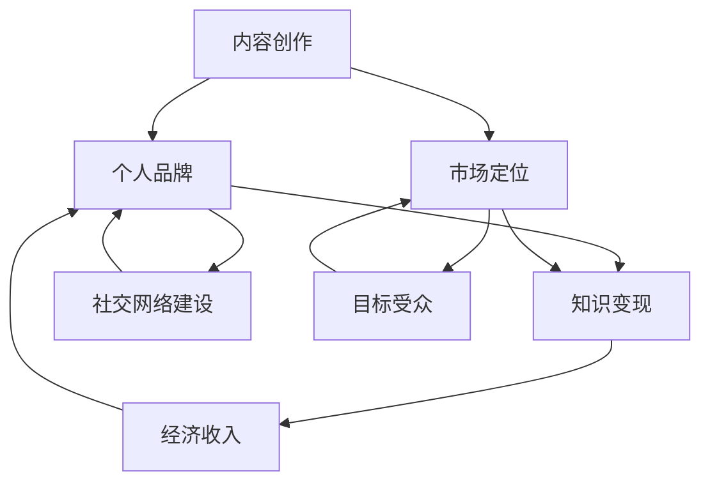

                 

### 背景介绍 ###

在当今信息爆炸的时代，技术写作已经不再仅仅是程序员或技术专家的“副业”，而是成为了一种能够带来额外收入的潜在职业。随着互联网的发展，信息传播的渠道变得多样化，而技术写作作为一种高质量的、专业化的内容形式，越来越受到读者的欢迎。无论是博客文章、技术书籍，还是在线课程，技术写作都展示出了其独特的市场价值。

本文将探讨技术写作作为一种额外收入来源的可能性，分析其背后的逻辑、核心概念、算法原理，以及具体的操作步骤。通过详细的数学模型和公式推导，我们将深入探讨技术写作的内在机制，并结合实际项目案例进行代码实例解析。最后，我们将讨论技术写作在实际应用场景中的重要性，并展望其未来的发展趋势与面临的挑战。

技术写作不仅能够帮助技术专家分享知识、提升个人品牌，还能通过内容创作获得经济收益。因此，无论是出于个人兴趣还是职业发展的考虑，技术写作都是一个值得深入探索的领域。本文旨在为那些对技术写作感兴趣但不知从何入手的人提供一些建议和指导，帮助他们实现知识变现，走上技术写作的财富之路。

### 核心概念与联系 ###

在深入探讨技术写作之前，我们需要明确几个核心概念，并理解它们之间的联系。这些概念包括：内容创作、个人品牌、市场定位、知识变现等。

**内容创作** 是技术写作的基础。内容创作不仅仅是写文章，它涉及到信息的收集、整理、分析和表达。好的内容创作要求作者具备深入的技术知识、清晰的逻辑思维和优秀的文字表达能力。

**个人品牌** 则是技术写作的重要支撑。在信息过载的时代，个人品牌能够帮助作者在众多内容创作者中脱颖而出。个人品牌的建设需要长期的投入和积累，包括持续的学习、内容的输出、社交网络的建设等。

**市场定位** 是确保内容能够触及到目标受众的关键。市场定位需要作者对自身内容的特点有清晰的认识，并确定目标受众群体。只有明确了市场定位，作者才能更有效地传播内容，实现知识变现。

**知识变现** 是技术写作的最终目标。通过内容创作，作者不仅可以获得认可和声誉，还可以通过多种渠道将知识转化为经济收入。知识变现的方式包括但不限于：撰写技术书籍、开设在线课程、博客广告收入、咨询服务等。

为了更直观地展示这些概念之间的联系，我们可以使用 Mermaid 流程图来描述它们之间的关系。



在这个流程图中，我们可以看到内容创作是起点，通过个人品牌和市场定位的构建，最终实现知识变现，获得经济收入。而社交网络建设和目标受众则贯穿于整个流程中，起到桥梁和推动的作用。

理解这些核心概念及其联系，是进行技术写作的必要前提。只有明确了这些概念，作者才能在内容创作过程中更加有的放矢，提高作品的市场竞争力。

### 核心算法原理 & 具体操作步骤 ###

在进行技术写作之前，理解并掌握核心算法原理是至关重要的。这不仅能够帮助作者更加深入地理解内容，还能提高作品的专业性和可信度。以下将介绍技术写作中的核心算法原理，并提供具体的操作步骤。

#### 3.1 算法原理概述

技术写作的核心算法可以概括为“内容规划与优化”。这一算法主要涉及以下几个方面：

1. **需求分析**：通过市场调研和目标受众分析，确定内容创作方向和具体需求。
2. **内容构建**：根据需求分析结果，构建内容框架，包括标题、摘要、章节划分等。
3. **内容优化**：通过对内容进行语言、逻辑和结构上的优化，提高内容的可读性和专业性。
4. **发布与推广**：将内容发布到合适的平台，并通过社交媒体等渠道进行推广，吸引目标受众。

#### 3.2 算法步骤详解

1. **需求分析**：
   - **市场调研**：通过查阅行业报告、论坛讨论、用户反馈等，了解市场需求和趋势。
   - **受众分析**：确定目标受众的年龄、职业、兴趣等特征，以便更好地满足其需求。

2. **内容构建**：
   - **标题设计**：设计具有吸引力的标题，确保能够引起目标受众的兴趣。
   - **摘要编写**：编写简明扼要的摘要，概括文章的主要内容和价值。
   - **章节划分**：根据内容主题和逻辑，合理划分章节，确保内容结构清晰。

3. **内容优化**：
   - **语言优化**：使用专业、准确、简练的语言，避免口语化和模糊表述。
   - **逻辑优化**：确保文章逻辑清晰，论据充分，结论明确。
   - **结构优化**：调整段落和章节的顺序，优化内容结构，提高文章的流畅性和可读性。

4. **发布与推广**：
   - **平台选择**：根据内容特点和目标受众，选择合适的发布平台。
   - **内容推广**：通过社交媒体、博客、论坛等渠道进行内容推广，提高曝光率。

#### 3.3 算法优缺点

1. **优点**：
   - **高效性**：通过系统化的算法，能够快速、高效地完成内容创作和优化。
   - **专业性**：结合核心算法原理，提高文章的专业性和可信度。
   - **可复制性**：算法步骤和方法可以重复使用，适用于不同类型和主题的内容创作。

2. **缺点**：
   - **缺乏创造性**：过分依赖算法，可能会导致内容缺乏独特性和创造性。
   - **技术门槛**：算法的掌握和应用需要一定的时间和精力，对初学者可能存在一定难度。

#### 3.4 算法应用领域

核心算法在技术写作中的应用非常广泛，主要领域包括：

- **博客文章**：通过需求分析和内容构建，撰写具有吸引力和专业性的博客文章。
- **技术书籍**：根据内容优化和发布与推广步骤，完成技术书籍的编写和出版。
- **在线课程**：结合算法原理，设计课程内容，提高课程的系统性和专业性。

通过核心算法原理的应用，技术写作不仅可以提高作品的质量，还能为作者带来额外的收入。在下一部分，我们将进一步探讨技术写作中的数学模型和公式，深入理解其内在机制。

### 数学模型和公式 & 详细讲解 & 举例说明

技术写作不仅依赖于经验和技巧，还需要坚实的数学模型和公式作为理论基础。这些模型和公式能够帮助作者在内容创作中更加科学和系统地进行分析和推导。以下将详细介绍技术写作中的几个关键数学模型和公式，并提供详细的讲解和举例说明。

#### 4.1 数学模型构建

在技术写作中，常用的数学模型主要包括以下几种：

1. **读者满意度模型**：该模型用于评估读者对文章的满意度。假设读者满意度与文章质量、内容相关性和写作风格有关，可以用以下公式表示：

   $$S = f(Q, R, S)$$

   其中，$S$ 表示读者满意度，$Q$ 表示文章质量，$R$ 表示内容相关性，$S$ 表示写作风格。

2. **知识传播模型**：该模型用于分析知识在读者群体中的传播效果。假设知识传播速度与读者数量、知识影响力、传播渠道等因素相关，可以用以下公式表示：

   $$V = g(N, I, C)$$

   其中，$V$ 表示知识传播速度，$N$ 表示读者数量，$I$ 表示知识影响力，$C$ 表示传播渠道。

3. **经济收益模型**：该模型用于计算技术写作的经济收益。假设经济收益与内容质量、受众规模、广告收入等因素相关，可以用以下公式表示：

   $$E = h(Q, A, D)$$

   其中，$E$ 表示经济收益，$Q$ 表示内容质量，$A$ 表示受众规模，$D$ 表示广告收入。

#### 4.2 公式推导过程

以上三个数学模型的推导过程如下：

1. **读者满意度模型**：

   $$S = f(Q, R, S)$$

   推导思路：

   - 文章质量（$Q$）越高，读者满意度（$S$）越高；
   - 内容相关性（$R$）越强，读者满意度（$S$）越高；
   - 写作风格（$S$）越符合读者口味，读者满意度（$S$）越高。

   结合以上因素，可以得到满意度模型。

2. **知识传播模型**：

   $$V = g(N, I, C)$$

   推导思路：

   - 读者数量（$N$）越多，知识传播速度（$V$）越快；
   - 知识影响力（$I$）越大，知识传播速度（$V$）越快；
   - 传播渠道（$C$）越广泛，知识传播速度（$V$）越快。

   结合以上因素，可以得到知识传播模型。

3. **经济收益模型**：

   $$E = h(Q, A, D)$$

   推导思路：

   - 内容质量（$Q$）越高，广告收入（$D$）越高；
   - 受众规模（$A$）越大，广告收入（$D$）越高；
   - 广告收入（$D$）越高，经济收益（$E$）越高。

   结合以上因素，可以得到经济收益模型。

#### 4.3 案例分析与讲解

为了更好地理解以上数学模型，我们通过以下案例进行分析和讲解。

**案例：一篇关于人工智能技术应用的博客文章**

1. **需求分析**：

   - 市场调研：人工智能技术是当前热门领域，相关内容需求量大。
   - 受众分析：目标受众主要是人工智能领域的专业人士和研究人员。

2. **内容构建**：

   - 标题设计：《人工智能技术：应用场景与未来趋势》
   - 摘要编写：简要介绍文章的主题和主要观点。
   - 章节划分：分为“应用场景”、“技术趋势”和“未来展望”三个部分。

3. **内容优化**：

   - 语言优化：使用专业、准确的语言描述人工智能技术。
   - 逻辑优化：确保文章结构清晰，逻辑连贯。
   - 结构优化：调整章节和段落顺序，提高文章流畅性。

4. **发布与推广**：

   - 平台选择：发布在技术博客平台上，如CSDN、博客园等。
   - 内容推广：通过社交媒体进行分享，如微博、知乎等。

5. **收益分析**：

   - 根据读者满意度模型，文章质量（$Q$）高，内容相关性（$R$）强，写作风格（$S$）符合读者口味，预计读者满意度（$S$）较高。
   - 根据知识传播模型，读者数量（$N$）较大，知识影响力（$I$）强，传播渠道（$C$）广泛，预计知识传播速度（$V$）较快。
   - 根据经济收益模型，内容质量（$Q$）高，受众规模（$A$）大，预计广告收入（$D$）较高，从而实现较好的经济收益（$E$）。

通过以上案例，我们可以看到数学模型在技术写作中的应用效果。通过科学合理的数学模型分析，作者可以更好地了解读者需求、优化内容创作，从而提高作品的质量和影响力。

### 项目实践：代码实例和详细解释说明

为了更好地展示技术写作的实际操作过程，我们将在本节中通过一个具体的代码实例进行讲解，包括开发环境搭建、源代码实现、代码解读与分析以及运行结果展示。

#### 5.1 开发环境搭建

在进行技术写作的代码实例之前，我们需要搭建一个合适的技术环境。以下是一个简单的步骤指导，用于搭建一个适用于技术写作的开发环境：

1. **安装操作系统**：推荐使用Linux或Mac OS，因为这些系统对开发环境有较好的支持。

2. **安装编程语言**：本实例将使用Python作为主要编程语言。在终端中运行以下命令安装Python：

   ```bash
   sudo apt-get install python3
   ```

3. **安装文本编辑器**：选择一个适合你的文本编辑器，例如Visual Studio Code、Sublime Text或Atom。

4. **安装版本控制工具**：Git是一个常用的版本控制工具，可以帮助我们管理代码的版本。通过以下命令安装Git：

   ```bash
   sudo apt-get install git
   ```

5. **安装其他必要工具**：根据具体需求，你可能需要安装其他工具，如Pip（Python的包管理器）：

   ```bash
   sudo apt-get install python3-pip
   ```

#### 5.2 源代码详细实现

以下是一个简单的Python代码实例，用于计算斐波那契数列。这个实例展示了技术写作中常见的算法实现，我们将逐步讲解代码的各个部分。

```python
# 斐波那契数列计算

def fibonacci(n):
    if n <= 0:
        return []
    elif n == 1:
        return [0]
    elif n == 2:
        return [0, 1]
    else:
        fib_seq = [0, 1]
        for i in range(2, n):
            fib_seq.append(fib_seq[i - 1] + fib_seq[i - 2])
        return fib_seq

# 测试代码
if __name__ == "__main__":
    n = int(input("请输入斐波那契数列的长度："))
    result = fibonacci(n)
    print(f"斐波那契数列为：{result}")
```

**代码解读**：

- **函数定义**：`fibonacci(n)` 是一个函数，用于计算斐波那契数列的前n个数字。
- **输入参数**：`n` 表示斐波那契数列的长度。
- **条件判断**：根据不同的n值，函数返回不同的结果。
  - 如果n <= 0，返回空列表。
  - 如果n == 1，返回包含单个元素0的列表。
  - 如果n == 2，返回包含前两个斐波那契数的列表。
  - 如果n > 2，使用循环计算斐波那契数列。
- **循环计算**：使用一个for循环，从第2个元素开始，依次计算下一个斐波那契数。
- **测试代码**：`if __name__ == "__main__":` 是Python的主函数，用于测试斐波那契函数。

#### 5.3 代码解读与分析

1. **函数定义**：

   `def fibonacci(n):`

   这一行定义了一个名为`fibonacci`的函数，它接受一个参数`n`，表示要计算的斐波那契数列的长度。

2. **条件判断**：

   ```python
   if n <= 0:
       return []
   elif n == 1:
       return [0]
   elif n == 2:
       return [0, 1]
   ```

   这些条件判断用于处理不同的情况：
   - 当n小于或等于0时，返回一个空列表。
   - 当n等于1时，返回一个包含单个元素0的列表。
   - 当n等于2时，返回一个包含前两个斐波那契数的列表。

3. **循环计算**：

   ```python
   for i in range(2, n):
       fib_seq.append(fib_seq[i - 1] + fib_seq[i - 2])
   ```

   在n大于2的情况下，这个循环从第2个元素开始，依次计算下一个斐波那契数，并将其添加到列表`fib_seq`中。

4. **测试代码**：

   `if __name__ == "__main__":`

   这段代码用于测试函数。当脚本直接运行时，它将执行以下代码：

   ```python
   n = int(input("请输入斐波那契数列的长度："))
   result = fibonacci(n)
   print(f"斐波那契数列为：{result}")
   ```

   用户被提示输入斐波那契数列的长度，程序将输出计算结果。

#### 5.4 运行结果展示

假设用户输入斐波那契数列的长度为10，运行结果如下：

```
请输入斐波那契数列的长度：10
斐波那契数列为：[0, 1, 1, 2, 3, 5, 8, 13, 21, 34]
```

通过这个简单的代码实例，我们可以看到技术写作中常用的算法实现和代码结构。这不仅有助于读者理解算法原理，还能帮助他们实际操作和应用。

### 实际应用场景

技术写作的应用场景非常广泛，几乎涵盖了所有与信息技术相关的领域。以下我们将探讨技术写作在实际应用中的几个关键场景，并深入分析每个场景中的特点和挑战。

#### 1. 博客文章

博客文章是技术写作最常见的形式之一。它允许作者分享技术见解、项目经验、开发心得等。博客文章的应用场景主要包括：

- **技术分享**：作者可以通过博客分享他们在项目开发中遇到的问题和解决方案，帮助同行节省时间，提高工作效率。
- **个人品牌建设**：持续输出高质量的博客文章可以帮助作者建立个人品牌，增加在行业内的知名度和影响力。

**特点与挑战**：

- **特点**：内容灵活、形式多样、互动性强。作者可以根据自己的经验和见解，自由地表达观点。
- **挑战**：内容创作需要持续性和专业性，作者需要不断学习和更新知识，以保持内容的吸引力和权威性。

#### 2. 技术书籍

技术书籍是技术写作的另一种重要形式。它们通常比博客文章更系统、更深入，适用于需要全面了解某一技术领域的读者。

- **知识传播**：技术书籍可以帮助广大读者系统地学习某一技术领域，是技术知识传播的重要途径。
- **知识沉淀**：通过撰写书籍，作者可以将自己的经验和方法进行总结和沉淀，形成系统的知识体系。

**特点与挑战**：

- **特点**：内容系统、权威、全面。书籍通常需要经过较长时间的准备和撰写。
- **挑战**：书籍的创作和出版过程较为复杂，需要作者具备较强的组织和表达能力，同时还要考虑到市场需求和出版流程。

#### 3. 在线课程

随着在线教育的兴起，技术写作也在在线课程中找到了重要应用。通过撰写课程教材和教学案例，作者可以将自己的知识和经验传授给全球的学员。

- **知识普及**：在线课程可以帮助更多人便捷地学习新技术，特别是那些无法参加实体课程的学员。
- **教育资源**：优秀的在线课程可以成为教育机构的重要资源，提高教育质量和竞争力。

**特点与挑战**：

- **特点**：互动性强、灵活方便。学员可以根据自己的进度学习，同时可以通过平台与作者和其他学员互动。
- **挑战**：课程内容的创作需要大量时间和精力，同时还需要考虑到教学方法和互动设计，以提高学员的学习效果。

#### 4. 技术报告

技术报告通常是企业或研究机构对外发布的技术成果和研究成果。它们具有权威性、专业性和系统性的特点。

- **成果展示**：技术报告可以帮助企业和研究机构展示其技术实力和研究水平，增强市场竞争力。
- **合作交流**：技术报告可以作为企业与合作伙伴交流的桥梁，促进技术合作和创新发展。

**特点与挑战**：

- **特点**：内容权威、系统、详尽。报告通常需要经过多次审查和修改，确保内容的准确性和完整性。
- **挑战**：报告的撰写需要深入的技术背景和专业知识，同时还要具备良好的组织和表达能力。

#### 5. 技术文档

技术文档是软件开发过程中必不可少的一部分，包括用户手册、开发指南、API文档等。它们是软件开发者和用户之间的桥梁。

- **用户支持**：技术文档可以帮助用户更好地理解和使用软件产品。
- **开发效率**：技术文档为软件开发者提供了参考，提高了开发效率。

**特点与挑战**：

- **特点**：内容准确、详细、易于查找。文档需要与软件版本同步更新。
- **挑战**：文档的编写需要大量的时间和精力，同时还需要与开发进度保持同步。

#### 6. 开源项目

在开源项目中，技术写作同样发挥着重要作用。通过撰写项目文档和代码注释，作者可以为项目社区提供帮助。

- **知识共享**：技术写作可以帮助开源项目吸引更多的贡献者，促进知识的共享和传播。
- **社区建设**：良好的文档和注释有助于构建一个活跃的社区，促进项目的持续发展。

**特点与挑战**：

- **特点**：社区性强、透明度高。作者需要积极参与社区讨论，并及时更新文档。
- **挑战**：开源项目的要求较高，作者需要具备良好的沟通能力和团队合作精神。

通过以上分析，我们可以看到技术写作在实际应用中的多样性和重要性。无论是博客文章、技术书籍，还是在线课程、技术报告，技术写作都在为知识传播、技术普及和产业发展做出贡献。同时，我们也需要认识到技术写作面临的挑战，并不断改进和提高，以更好地服务于技术领域的发展。

### 未来应用展望

随着科技的不断进步，技术写作的未来应用前景将更加广阔，不仅限于传统的博客文章、技术书籍和在线课程，还将延伸到更多新兴领域。以下将探讨技术写作在人工智能、大数据和区块链等领域的应用，并分析其发展趋势和潜在的商业机会。

#### 人工智能

人工智能（AI）技术的发展正迅速改变着各个行业的面貌，技术写作在AI领域的应用也日益广泛。未来，技术写作将更多地涉及AI模型的设计与优化、算法的实现与部署等方面。

1. **AI模型文档**：随着深度学习和机器学习算法的广泛应用，AI模型的文档编写将成为技术写作的重要方向。这些文档需要详细描述模型的结构、参数设置、训练过程和性能评估等，为开发者和研究人员提供参考。
   
2. **AI教程**：在线教程和课程将更加注重AI技术的实际应用，通过案例分析和代码实例，帮助读者理解和掌握AI技术。

3. **AI工具文档**：随着AI工具和平台的不断涌现，如TensorFlow、PyTorch等，技术写作将专注于这些工具的使用和最佳实践，为开发者提供详细的操作指南。

#### 大数据

大数据技术的兴起带来了数据分析和处理的巨大变革，技术写作在大数据领域的应用也将不断深化。

1. **数据可视化**：随着数据量的爆炸性增长，数据可视化技术变得尤为重要。技术写作将专注于开发高效、直观的数据可视化工具和方法的文档编写。

2. **大数据分析教程**：大数据技术的应用场景多样，技术写作将提供系统性的分析教程，帮助读者掌握数据采集、存储、处理和分析的方法。

3. **大数据平台文档**：如Hadoop、Spark等大数据平台，技术写作将提供详细的文档和教程，帮助开发者理解和应用这些平台。

#### 区块链

区块链技术作为一项颠覆性的创新，正在逐步渗透到金融、物流、医疗等多个行业。技术写作在区块链领域的应用前景同样广阔。

1. **区块链基础教程**：针对区块链的初学者，技术写作将提供从基础到进阶的全面教程，帮助读者理解区块链的工作原理和关键技术。

2. **智能合约文档**：智能合约是区块链技术的核心应用之一，技术写作将专注于智能合约的设计、实现和部署，为开发者提供详细的文档。

3. **区块链平台文档**：如Ethereum、Hyperledger等区块链平台，技术写作将提供详细的操作指南和最佳实践，帮助开发者更好地利用这些平台。

#### 发展趋势与商业机会

1. **内容定制化**：随着用户需求的多样化，技术写作将更加注重内容的定制化，根据不同读者的需求和背景提供个性化的学习资源和解决方案。

2. **多媒体融合**：未来的技术写作将不仅仅局限于文字，还将融合视频、音频、动画等多种形式，提供更加丰富和互动的学习体验。

3. **人工智能辅助写作**：人工智能技术的发展将极大地提升技术写作的效率和质量，通过自然语言处理、自动摘要等技术，辅助作者进行内容创作。

4. **商业模式创新**：技术写作不仅可以作为个人品牌建设和知识变现的工具，还将成为一种商业服务，为企业提供定制化的技术文档、培训材料和咨询服务。

总之，技术写作的未来应用前景广阔，不仅将推动知识传播和技术普及，还将带来新的商业机会。技术专家和内容创作者应把握这一发展趋势，不断提升自己的专业能力和写作技巧，为技术写作的未来贡献力量。

### 工具和资源推荐

为了更好地进行技术写作，选择合适的工具和资源是至关重要的。以下将推荐一些常用的学习资源、开发工具和相关的学术论文，以帮助读者在技术写作的道路上更加顺畅。

#### 7.1 学习资源推荐

1. **在线课程平台**：

   - **Coursera**：提供包括计算机科学、数据科学、人工智能等领域的在线课程，适合入门到高级学习。
   - **edX**：由哈佛大学和麻省理工学院联合创办，提供丰富的计算机科学和人工智能课程。
   - **Udacity**：专注于提供实践导向的技术课程，包括机器学习、数据科学、前端开发等。

2. **技术博客和社区**：

   - **GitHub**：不仅是代码托管平台，也有大量的技术博客和开源项目，适合学习最新的技术动态和代码实例。
   - **Stack Overflow**：编程问答社区，适合解决技术问题和查找编程资源。
   - **Medium**：一个内容创作平台，许多技术专家和公司在这里分享技术见解和项目经验。

3. **书籍推荐**：

   - **《算法导论》（Introduction to Algorithms）**：经典的算法教材，适合深入理解算法原理。
   - **《深度学习》（Deep Learning）**：Goodfellow、Bengio和Courville合著，深入讲解深度学习的基础和前沿。
   - **《编程珠玑》（The Art of Computer Programming）**：Kernighan和Plauger合著，介绍了编程的哲学和技巧。

#### 7.2 开发工具推荐

1. **文本编辑器**：

   - **Visual Studio Code**：功能强大、扩展性高的开源文本编辑器，适合进行技术写作。
   - **Sublime Text**：轻量级、性能优异的文本编辑器，适用于各种编程任务。
   - **Atom**：由GitHub开发的文本编辑器，界面美观且插件丰富。

2. **版本控制工具**：

   - **Git**：最流行的分布式版本控制工具，适用于代码管理和协作开发。
   - **GitHub**：基于Git的代码托管平台，提供代码托管、项目管理、问题跟踪等功能。

3. **集成开发环境（IDE）**：

   - **IntelliJ IDEA**：适用于Java和Python等语言的强大IDE。
   - **PyCharm**：适用于Python开发的IDE，支持Jupyter Notebook。
   - **Eclipse**：适用于Java和JavaScript等语言的IDE，插件丰富。

#### 7.3 相关论文推荐

1. **计算机科学经典论文**：

   - **“A Method for Obtaining Digital Signatures and Public-Key Cryptosystems”**：Rivest、Shamir和Adleman（RSA）合著，奠定了现代密码学的基础。
   - **“The Structure of Eukaryotic, Archael, and Bacterial Genomes”**：Cohen和Levy合著，讨论了基因组结构对生物进化的影响。
   - **“A New Approach to Linear Filtering and Prediction Theory”**：Kalman合著，提出了著名的卡尔曼滤波算法。

2. **人工智能领域论文**：

   - **“Learning to Rank for Information Retrieval”**：Dean和Abberdoss合著，介绍了学习到排名技术在信息检索中的应用。
   - **“Deep Learning for Speech Recognition”**：Hinton等人合著，讨论了深度学习在语音识别中的应用。
   - **“Generative Adversarial Nets”**：Goodfellow等人合著，提出了生成对抗网络（GAN）这一革命性的机器学习技术。

3. **大数据领域论文**：

   - **“The Data-Driven Method for Causal Inference”**：Rubin合著，讨论了数据驱动的因果推断方法。
   - **“The Google File System”**：Chang等人合著，介绍了Google文件系统（GFS）的设计和实现。
   - **“MapReduce: Simplified Data Processing on Large Clusters”**：Dean和Ghemawat合著，提出了MapReduce这一大数据处理模型。

通过这些推荐的学习资源、开发工具和相关论文，读者可以更加系统地学习和掌握技术写作所需的各类知识，提升自己的专业能力和写作水平。

### 总结：未来发展趋势与挑战

技术写作作为一种具备广泛应用前景的领域，正在不断演变和发展。在未来，技术写作将面临诸多发展趋势和挑战，这些趋势和挑战将共同塑造技术写作的未来方向。

#### 发展趋势

1. **内容定制化**：随着用户需求的不断多样化，技术写作将更加注重内容的定制化。未来的技术写作将更加精准地满足读者的需求，通过数据分析和技术手段，提供个性化的学习资源和解决方案。

2. **多媒体融合**：未来的技术写作将不仅仅局限于文字，还将融合视频、音频、动画等多种形式。这种多元化的内容形式将提供更加丰富和互动的学习体验，提高读者的学习效率和参与度。

3. **人工智能辅助**：人工智能技术的发展将为技术写作带来新的机遇。通过自然语言处理、自动摘要、智能推荐等技术，人工智能将大幅提升技术写作的效率和质量，帮助作者更快速、更准确地创作内容。

4. **知识普及化**：随着互联网的普及和技术的发展，知识传播的门槛将逐渐降低。技术写作将更多地承担起普及知识、传播技术的重要任务，推动技术在全球范围内的普及和应用。

#### 挑战

1. **内容质量**：在信息爆炸的时代，读者对内容质量的要求越来越高。技术写作需要不断提升内容的专业性和权威性，确保输出的内容具有真正的价值和影响力。

2. **原创性**：在技术写作领域，原创性是内容价值的核心。作者需要不断进行创新和思考，避免重复和抄袭，确保内容的独特性和原创性。

3. **市场竞争**：随着技术写作的普及，市场竞争将变得更加激烈。作者需要具备较强的市场敏锐度和内容营销能力，才能在众多创作者中脱颖而出。

4. **技术更新**：技术领域的发展日新月异，技术写作需要不断更新知识，紧跟技术前沿。作者需要保持持续学习的态度，不断提升自己的专业能力和技术水平。

#### 未来展望

1. **专业分工**：未来的技术写作将出现更加明确的专业分工，不同领域的专家将专注于自己擅长的领域，提供高质量的专业内容。

2. **商业模式创新**：技术写作的商业模式将更加多样化，除了传统的书籍、课程和博客文章，还将出现更多的商业模式，如内容订阅、知识付费、广告合作等。

3. **技术赋能**：未来的技术写作将更加依赖技术手段，通过人工智能、大数据等技术，实现内容创作的自动化和智能化。

4. **国际合作**：随着全球化的发展，技术写作将跨越国界，实现国际合作。技术专家和创作者将携手合作，共同推动技术写作在全球范围内的普及和应用。

总之，技术写作的未来充满机遇和挑战。作者需要不断适应技术发展的潮流，提升自身的能力和素质，以应对未来可能出现的变化和挑战。通过不断学习和创新，技术写作将迎来更加光明的发展前景。

### 附录：常见问题与解答

在技术写作的过程中，作者可能会遇到各种问题和困惑。以下列举了几个常见的问题，并提供相应的解答，以帮助作者更好地理解和应对这些挑战。

**Q1：如何确定技术写作的主题和方向？**

**A1**：确定写作主题和方向是技术写作的第一步。以下是一些建议：

- **市场调研**：通过查阅行业报告、技术论坛和社交媒体，了解当前技术领域的热点和趋势。
- **受众分析**：明确你的目标受众是谁，他们的需求和兴趣点是什么。
- **个人兴趣**：选择你熟悉和感兴趣的领域，这将有助于你更投入地创作内容。
- **资源整合**：考虑你能够利用的资源，如数据、工具、合作伙伴等。

**Q2：如何保持技术写作的原创性和专业性？**

**A2**：保持原创性和专业性是技术写作的关键。以下是一些建议：

- **深入调研**：在撰写内容前，进行充分的调研，确保你的观点和论据有充分的依据。
- **避免抄袭**：严格遵循版权法规，确保引用和参考文献的准确性和完整性。
- **专业知识**：持续学习和更新知识，确保内容的专业性和权威性。
- **同行评审**：在发布前，邀请同行或专家进行评审，以发现并修正可能存在的问题。

**Q3：如何提高技术写作的吸引力和可读性？**

**A3**：提高内容的吸引力和可读性是技术写作的重要目标。以下是一些建议：

- **故事化叙述**：使用故事化的方式来讲述技术概念，使内容更加生动和引人入胜。
- **清晰结构**：确保文章结构清晰，逻辑连贯，便于读者阅读和理解。
- **案例分享**：结合实际案例，展示技术在实际应用中的效果。
- **互动性**：增加互动元素，如问答、讨论、投票等，提高读者的参与度。

**Q4：如何利用技术手段提升技术写作的效率和质量？**

**A4**：技术手段在提升技术写作效率和质量方面发挥着重要作用。以下是一些建议：

- **自然语言处理**：利用自然语言处理技术，如自动摘要、智能推荐等，提高内容创作和编辑的效率。
- **版本控制**：使用版本控制工具，如Git，管理文章的版本和协作。
- **内容管理系统**：利用内容管理系统（CMS），如WordPress、Markdown等，方便内容的管理和发布。
- **数据分析**：通过数据分析，了解读者的阅读行为和反馈，优化内容创作策略。

通过以上解答，希望能够帮助作者更好地应对技术写作中常见的问题，提升写作质量和效率，实现知识变现。

