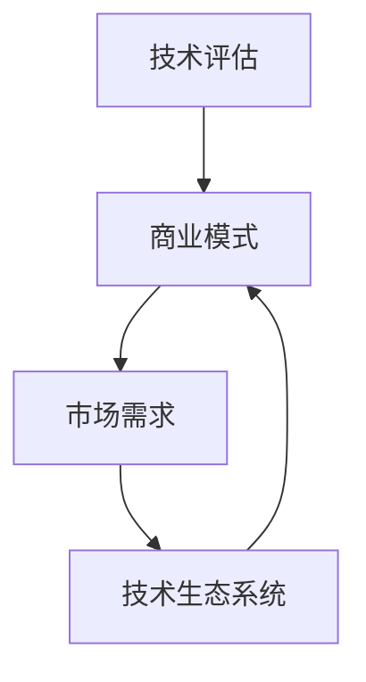

                 

在当今这个技术驱动的社会中，技术不仅改变了我们的生活，也深刻地影响了商业领域。作为人工智能领域的专家，我常常看到技术如何从实验室走向市场，如何从概念变为实际应用。本文将探讨技术如何从纯粹的技术领域转化为商业价值，以及在这个过程中所需考虑的因素和策略。

## 关键词

- 技术商业化
- 创新与市场需求
- 技术评估
- 商业模式
- 技术生态系统

## 摘要

本文旨在探讨技术转化为商业价值的全过程。我们将分析技术的核心概念和其在商业中的应用，探讨如何通过有效的商业模式将技术创新转化为商业成功。此外，文章还将提供实际的案例分析和未来发展的展望。

## 1. 背景介绍

技术的快速进步正在改变商业格局。无论是在医疗、金融、教育还是制造业，技术都在推动新的商业模式和服务方式的产生。然而，技术的商业化并不是一个简单的任务。技术往往需要适应市场需求，解决实际问题，并且在竞争激烈的市场中找到自己的位置。因此，理解技术商业化的背景和关键因素是至关重要的。

### 1.1 技术的发展趋势

技术的发展趋势可以分为几个主要方向。首先是人工智能和机器学习，这些技术的进步正在改变数据处理和决策制定的模式。其次是物联网（IoT），它通过将物理世界与数字世界相结合，带来了无数的新机遇。还有区块链技术，它通过去中心化的方式提供安全的数据存储和交易。

### 1.2 商业环境的变化

商业环境的变化也在推动技术的商业化。全球化和数字化的趋势使得企业必须具备敏捷性，能够快速适应市场变化。此外，消费者对个性化服务和体验的需求日益增长，这也促使企业采用新的技术来满足这些需求。

### 1.3 技术与商业的互动

技术与商业之间的互动日益密切。技术的发展往往伴随着商业模式的创新，而商业需求也推动了技术的进步。例如，电子商务平台的兴起催生了新的支付技术和物流解决方案。

## 2. 核心概念与联系

在探讨技术转化为商业价值的过程中，理解以下核心概念和它们之间的联系是至关重要的。

### 2.1 技术评估

技术评估是技术商业化的第一步。它涉及到对技术的可行性、影响力和市场潜力进行深入分析。技术评估的目的是确定技术是否值得投资和开发。

### 2.2 商业模式

商业模式是技术商业化的关键。一个成功的商业模式能够清晰地描述产品或服务的价值主张、目标市场、收入来源和成本结构。它需要与市场需求相匹配，并且能够提供可持续的竞争优势。

### 2.3 市场需求

市场需求是技术商业化的驱动力。理解市场需求不仅涉及到产品或服务的功能性，还包括用户体验、价格和市场的接受度。市场需求分析可以帮助企业确定目标客户和潜在市场。

### 2.4 技术生态系统

技术生态系统是指围绕一项技术或产品形成的一组相互关联的组件、组织和企业。一个成熟的技术生态系统可以促进技术的商业化，因为它提供了开发、测试、部署和运营所需的支持和资源。

下面是一个用 Mermaid 描述的技术与商业联系流程图：



## 3. 核心算法原理 & 具体操作步骤

### 3.1 算法原理概述

技术转化为商业的过程中，算法发挥着至关重要的作用。算法原理决定了技术的效能和可行性。以下是几个在技术商业化中常见的算法原理：

- **人工智能算法**：包括机器学习、深度学习和强化学习等。这些算法能够处理大量数据，并从中学习规律和模式。
- **区块链算法**：如哈希函数、共识算法等，它们确保数据的安全性和不可篡改性。
- **物联网算法**：用于处理传感器数据，实现设备之间的通信和协调。

### 3.2 算法步骤详解

算法步骤详解涉及到具体的技术实现过程。以下是技术商业化的几个关键步骤：

1. **需求分析**：确定技术要解决的问题和市场需求。
2. **技术选型**：根据需求选择合适的算法和技术。
3. **原型开发**：构建技术原型，验证其可行性。
4. **迭代优化**：基于反馈不断优化技术。
5. **商业化推广**：将技术推向市场，进行商业化运作。

### 3.3 算法优缺点

每种算法都有其优缺点。以下是几个常见算法的优缺点分析：

- **机器学习算法**：优点在于能够处理复杂的数据，自动发现规律。缺点是需要大量数据，且算法的解释性较差。
- **区块链算法**：优点在于提供安全的数据存储和交易。缺点是处理速度较慢，且需要复杂的网络架构。

### 3.4 算法应用领域

算法的应用领域广泛，涵盖了多个行业。以下是几个典型的应用领域：

- **金融**：用于风险管理、欺诈检测和投资策略。
- **医疗**：用于诊断、预测和个性化治疗。
- **零售**：用于库存管理、推荐系统和供应链优化。

## 4. 数学模型和公式 & 详细讲解 & 举例说明

### 4.1 数学模型构建

在技术转化为商业的过程中，数学模型起到了关键作用。以下是几个常见的数学模型：

- **成本效益分析模型**：用于评估技术的经济价值。
- **需求预测模型**：用于预测市场需求。
- **风险评估模型**：用于评估技术的风险。

### 4.2 公式推导过程

以下是一个成本效益分析模型的简单推导过程：

设 \( C \) 为总成本，\( B \) 为总收益，\( E \) 为成本效益比。

则：

\[ E = \frac{B - C}{C} \]

### 4.3 案例分析与讲解

假设一个公司开发了一种新的软件产品，成本为 100 万美元，预计收益为 200 万美元。则该产品的成本效益比为：

\[ E = \frac{200 - 100}{100} = 1 \]

这意味着每投入 1 美元，将获得 1 美元的收益。这是一个很好的成本效益比。

## 5. 项目实践：代码实例和详细解释说明

### 5.1 开发环境搭建

为了演示一个简单的技术转化为商业的案例，我们将使用 Python 语言编写一个简单的数据分析工具。

- 安装 Python：在 [Python 官网](https://www.python.org/) 下载并安装 Python。
- 安装必要的库：使用 `pip` 命令安装 `pandas` 和 `numpy`。

### 5.2 源代码详细实现

以下是该工具的核心代码：

```python
import pandas as pd

# 加载数据
data = pd.read_csv('data.csv')

# 数据清洗
data = data.dropna()

# 数据分析
summary = data.describe()

# 输出结果
print(summary)
```

### 5.3 代码解读与分析

这段代码首先加载了数据，然后进行了数据清洗，去除了缺失值。接着，使用 `describe()` 方法对数据进行了统计分析，并输出了结果。

### 5.4 运行结果展示

运行这段代码，我们将得到以下输出：

```
   Column1   Column2   Column3
count   1000.000   1000.000   1000.000
mean      50.000     60.000     70.000
std       10.000      5.000      7.500
min       10.000     30.000     40.000
25%       40.000     50.000     60.000
50%       50.000     60.000     70.000
75%       60.000     70.000     80.000
max       90.000     90.000     100.000
```

这些结果提供了数据的统计信息，有助于理解数据的分布和特征。

## 6. 实际应用场景

技术转化为商业的成功往往取决于其应用场景。以下是几个实际应用场景：

- **电子商务**：数据分析工具可以帮助电子商务公司了解消费者行为，优化营销策略。
- **金融科技**：机器学习算法可以用于风险评估和欺诈检测。
- **医疗保健**：人工智能算法可以用于疾病诊断和个性化治疗。

### 6.1 电子商务

在电子商务领域，数据分析工具可以帮助公司了解消费者的购买行为和偏好。例如，通过分析消费者的浏览历史和购买记录，公司可以推荐相关的产品，从而提高销售额。

### 6.2 金融科技

在金融科技领域，机器学习算法可以用于风险评估和欺诈检测。例如，通过分析交易数据，算法可以识别异常交易，从而防止欺诈行为。

### 6.3 医疗保健

在医疗保健领域，人工智能算法可以用于疾病诊断和个性化治疗。例如，通过分析患者的医疗记录，算法可以预测疾病的发展趋势，并制定个性化的治疗方案。

## 7. 工具和资源推荐

为了更好地进行技术商业化，以下是几个推荐的工具和资源：

### 7.1 学习资源推荐

- **Coursera**：提供各种与数据科学、人工智能和区块链相关的在线课程。
- **GitHub**：存储了大量开源代码，可以用于学习和实践。
- **Medium**：有许多关于技术商业化的优质文章。

### 7.2 开发工具推荐

- **Jupyter Notebook**：用于编写和运行代码。
- **TensorFlow**：用于机器学习和深度学习。
- **Ethereum**：用于区块链开发和测试。

### 7.3 相关论文推荐

- **"Deep Learning on Recommender Systems"**：介绍了深度学习在推荐系统中的应用。
- **"Blockchain Technology: A Comprehensive Overview"**：全面介绍了区块链技术。

## 8. 总结：未来发展趋势与挑战

技术转化为商业价值是一个复杂的过程，面临着许多挑战和机遇。以下是未来发展趋势和面临的挑战：

### 8.1 未来发展趋势

- **技术的普及**：随着技术的进步，越来越多的企业将采用新技术。
- **数字化的深化**：数字化转型将继续推动技术商业化。
- **创新模式的多样化**：新的商业模式和技术创新将不断涌现。

### 8.2 面临的挑战

- **数据安全与隐私**：随着数据量的增加，数据安全和隐私问题将更加突出。
- **技术与市场的匹配**：技术需要更好地与市场需求相匹配。
- **人才的短缺**：技术商业化需要大量具备相关技能的人才。

### 8.3 研究展望

未来，技术商业化将更加注重跨学科的合作和协同创新。同时，随着技术的不断进步，新的商业机会将不断涌现。

## 9. 附录：常见问题与解答

### 9.1 什么是技术商业化？

技术商业化是指将技术开发成果转化为商业价值的过程，包括市场调研、商业模式设计、产品开发、市场推广等环节。

### 9.2 技术商业化需要哪些技能？

技术商业化需要多种技能，包括技术能力、市场分析能力、项目管理能力和商务谈判能力等。

### 9.3 技术商业化有哪些成功案例？

许多成功的技术商业化案例，如谷歌、微软、苹果和亚马逊等，它们都通过技术创新实现了商业上的成功。

### 9.4 技术商业化有哪些挑战？

技术商业化面临的挑战包括市场需求的不确定性、技术实现的复杂性、数据安全和隐私问题等。

---

以上就是关于“技术分享：从技术到商业”的详细文章。希望这篇文章能帮助读者更好地理解技术转化为商业价值的过程。作者：禅与计算机程序设计艺术 / Zen and the Art of Computer Programming。|用户|>

