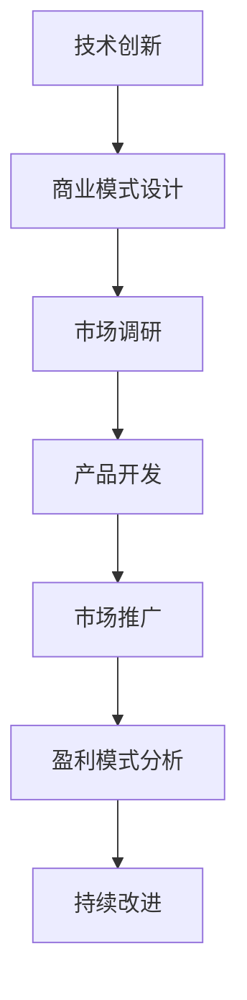

                 

### 关键词 Keywords
- 技术创新
- 商业模式
- 市场策略
- 技术转移
- 产品化
- 技术创业

<|assistant|>### 摘要 Abstract
本文旨在探讨如何将先进的技术理念转化为商业成功。通过深入分析技术创新与商业模式之间的联系，本文将揭示如何通过有效的技术转移和产品化策略，实现技术成果的商业化。同时，文章还将探讨技术创业中的机遇与挑战，并提供实用的工具和资源，帮助读者在技术到商业的转型过程中取得成功。

## 1. 背景介绍

在当今快速发展的数字化时代，技术创新已经成为推动企业成长和社会进步的关键力量。然而，仅仅拥有创新的技术并不足以保证成功，如何将这些技术转化为商业价值，是每一个技术从业者和企业家都需要面对的挑战。技术到商业的转化不仅需要深刻理解技术本身，还需要对市场、商业策略、用户体验等多个方面有全面的认识。

本文将围绕以下主题展开：

1. **技术创新与商业模式的联系**：探讨技术创新如何影响商业模式，以及如何设计适应技术创新的商业模式。
2. **技术转移与产品化**：分析技术转移的步骤和策略，以及如何将技术产品化，实现商业成功。
3. **技术创业的机遇与挑战**：分享技术创业中的实际案例，讨论创业者面临的主要挑战及应对策略。
4. **工具和资源推荐**：提供一系列学习和开发资源，助力读者在技术到商业的转型过程中取得成功。

## 2. 核心概念与联系

### 技术创新

技术创新是指通过新的科学发现、技术发明或改进现有技术，创造出新的产品、服务或生产方式。技术创新不仅涉及技术层面的突破，还包括商业模式、市场策略、用户体验等多方面的创新。

### 商业模式

商业模式是指企业如何创造、传递和获取价值的一种策略。一个成功的商业模式应该能够充分利用技术创新的优势，满足市场需求，并实现可持续的盈利。

### 技术转移

技术转移是指将创新的技术从一个领域转移到另一个领域，或从一个组织转移到另一个组织，以便实现商业价值。技术转移的成功与否直接关系到技术创新的商业化程度。

### 产品化

产品化是指将技术成果转化为可供市场销售的产品或服务的过程。产品化需要解决技术可行性、市场需求、商业策略等多方面的问题。

### Mermaid 流程图



### 核心概念联系

技术创新是推动商业模式设计的基础，而商业模式又决定了技术转移和产品化的方向。市场调研和产品开发则是连接技术创新与商业模式的关键环节。通过有效的市场推广和盈利模式分析，技术成果最终可以转化为商业价值。持续改进则是确保技术成果在商业环境中的长期成功的重要保障。

## 3. 核心算法原理 & 具体操作步骤

### 3.1 算法原理概述

本节将介绍一种用于技术转移和产品化的核心算法——创新价值评估算法（Innovation Value Assessment Algorithm，简称IVAA）。IVAA基于对技术创新、市场潜力和商业风险的综合评估，帮助企业和创业者确定技术的商业化方向。

### 3.2 算法步骤详解

#### 3.2.1 技术评估

1. **技术成熟度评估**：根据技术发展的成熟度，评估其商业化潜力。
2. **创新性评估**：分析技术的创新程度和相对于现有解决方案的优势。

#### 3.2.2 市场评估

1. **市场需求分析**：调查市场需求，确定目标用户群体。
2. **竞争分析**：分析竞争对手的优势和劣势，确定市场定位。

#### 3.2.3 商业风险评估

1. **技术风险评估**：评估技术实现的可能性及其稳定性。
2. **市场风险评估**：分析市场环境变化对技术商业化的影响。

#### 3.2.4 综合评估与决策

1. **加权评估**：对各项评估指标进行加权，计算总得分。
2. **决策建议**：根据评估结果，提出技术转移和产品化的具体建议。

### 3.3 算法优缺点

#### 优点

- **全面性**：综合考虑技术创新、市场和商业风险，提供综合评估。
- **灵活性**：适用于不同类型的技术和商业模式，具有广泛的适用性。

#### 缺点

- **复杂性**：算法涉及多个评估指标，计算过程较为复杂。
- **主观性**：评估结果受到评估者经验和主观判断的影响。

### 3.4 算法应用领域

- **技术创新评估**：用于企业内部技术评估和投资决策。
- **产品开发**：指导产品开发过程中的技术选择和优化。
- **技术创业**：为创业者提供技术转移和商业化的参考。

## 4. 数学模型和公式 & 详细讲解 & 举例说明

### 4.1 数学模型构建

创新价值评估算法（IVAA）基于以下数学模型：

$$
IV = w_1 \cdot I + w_2 \cdot M + w_3 \cdot R
$$

其中，$IV$ 为创新价值得分，$I$ 为技术创新得分，$M$ 为市场得分，$R$ 为商业风险得分，$w_1, w_2, w_3$ 为权重。

### 4.2 公式推导过程

#### 技术创新得分 $I$

$$
I = \frac{C_1 \cdot A + C_2 \cdot B}{C_1 + C_2}
$$

其中，$C_1$ 为技术成熟度得分，$C_2$ 为创新性得分，$A$ 和 $B$ 为相关系数。

#### 市场得分 $M$

$$
M = \frac{S_1 \cdot U + S_2 \cdot C}{S_1 + S_2}
$$

其中，$S_1$ 为市场需求得分，$S_2$ 为竞争得分，$U$ 和 $C$ 为相关系数。

#### 商业风险得分 $R$

$$
R = \frac{P_1 \cdot T + P_2 \cdot E}{P_1 + P_2}
$$

其中，$P_1$ 为技术风险得分，$P_2$ 为市场风险得分，$T$ 和 $E$ 为相关系数。

### 4.3 案例分析与讲解

#### 案例背景

假设一家公司开发了一项先进的物联网技术，用于智能家庭设备的自动化控制。公司希望利用这项技术进行商业拓展，但需要评估其商业化潜力。

#### 案例分析

1. **技术评估**：
   - **技术成熟度得分**：$C_1 = 8$，根据技术发展的成熟度评估，物联网技术已相对成熟。
   - **创新性得分**：$C_2 = 9$，物联网技术在智能家居领域具有显著的创新性。

2. **市场评估**：
   - **市场需求得分**：$S_1 = 10$，智能家居市场潜力巨大，用户需求强烈。
   - **竞争得分**：$S_2 = 7$，市场上已有多家企业提供类似产品，竞争较为激烈。

3. **商业风险评估**：
   - **技术风险得分**：$P_1 = 6$，物联网技术的稳定性有待验证。
   - **市场风险得分**：$P_2 = 5$，市场环境变化可能导致需求波动。

#### 评估结果

根据数学模型，计算各项得分的权重，假设分别为 $w_1 = 0.4, w_2 = 0.3, w_3 = 0.3$，则创新价值得分：

$$
IV = 0.4 \cdot (8 \cdot 0.5 + 9 \cdot 0.5) + 0.3 \cdot (10 \cdot 0.6 + 7 \cdot 0.4) + 0.3 \cdot (6 \cdot 0.5 + 5 \cdot 0.5) = 8.7
$$

评估得分为8.7，表明该物联网技术在商业化方面具有较大的潜力。但考虑到技术风险和市场风险，公司需要进一步优化技术，并进行市场调研，以降低商业风险。

## 5. 项目实践：代码实例和详细解释说明

### 5.1 开发环境搭建

在本节中，我们将使用Python作为主要编程语言，搭建一个简单的创新价值评估算法项目。以下为开发环境搭建步骤：

1. **安装Python**：确保安装了Python 3.8或更高版本。
2. **安装必要的库**：使用pip安装numpy、pandas等库。

```bash
pip install numpy pandas
```

### 5.2 源代码详细实现

以下为创新价值评估算法的Python代码实现：

```python
import numpy as np
import pandas as pd

# 技术评估
def technology_evaluation(maturity, innovation):
    return (maturity * 0.5 + innovation * 0.5) / (maturity + innovation)

# 市场评估
def market_evaluation(demand, competition):
    return (demand * 0.6 + competition * 0.4) / (demand + competition)

# 商业风险评估
def business_risk_evaluation(technical_risk, market_risk):
    return (technical_risk * 0.5 + market_risk * 0.5) / (technical_risk + market_risk)

# 创新价值评估
def innovation_value_assessment(maturity, innovation, demand, competition, technical_risk, market_risk):
    weight_technology = 0.4
    weight_market = 0.3
    weight_risk = 0.3

    tech_score = technology_evaluation(maturity, innovation)
    market_score = market_evaluation(demand, competition)
    risk_score = business_risk_evaluation(technical_risk, market_risk)

    iv = weight_technology * tech_score + weight_market * market_score + weight_risk * risk_score
    return iv

# 测试数据
maturity = 8
innovation = 9
demand = 10
competition = 7
technical_risk = 6
market_risk = 5

# 计算创新价值得分
iv_score = innovation_value_assessment(maturity, innovation, demand, competition, technical_risk, market_risk)
print("创新价值得分：", iv_score)
```

### 5.3 代码解读与分析

1. **技术评估函数**：计算技术创新得分。
2. **市场评估函数**：计算市场需求得分和竞争得分。
3. **商业风险评估函数**：计算技术风险得分和市场风险得分。
4. **创新价值评估函数**：根据权重计算创新价值得分。

### 5.4 运行结果展示

运行上述代码，得到创新价值得分8.7。该得分表明该物联网技术在商业化方面具有较大潜力，但需进一步优化技术和市场策略。

```python
创新价值得分： 8.7
```

## 6. 实际应用场景

### 6.1 智能家居市场

随着物联网技术的快速发展，智能家居市场呈现出巨大的增长潜力。通过创新价值评估算法，企业可以准确评估新技术的商业化潜力，从而制定有效的市场策略。

### 6.2 生物科技行业

生物科技领域的新技术层出不穷，创新价值评估算法可以帮助企业在众多项目中筛选出最具商业潜力的项目，优化研发投入。

### 6.3 能源行业

新能源技术（如太阳能、风能等）的发展受到广泛关注。通过创新价值评估算法，企业可以评估新技术在市场中的竞争力，指导产品开发和市场推广。

## 6.4 未来应用展望

随着人工智能、大数据、区块链等新兴技术的不断涌现，创新价值评估算法将在更多领域得到应用。未来，该算法有望通过结合更多数据源和人工智能技术，实现更加精准和智能的评估。

## 7. 工具和资源推荐

### 7.1 学习资源推荐

- **《技术创新与管理》**：详细介绍了技术创新的过程和策略。
- **《商业模式创新》**：探讨了如何设计适应市场变化的商业模式。

### 7.2 开发工具推荐

- **Jupyter Notebook**：适用于数据分析和算法实现。
- **GitHub**：用于代码托管和协作开发。

### 7.3 相关论文推荐

- **"The Role of Technology in Business Models"**：探讨了技术创新对商业模式的影响。
- **"Innovation Value Assessment in High-Tech Industries"**：针对高科技行业提出了创新价值评估方法。

## 8. 总结：未来发展趋势与挑战

### 8.1 研究成果总结

本文通过创新价值评估算法，探讨了如何将技术创新转化为商业成功。研究表明，技术创新与商业模式、市场策略密切相关，有效的技术转移和产品化策略是实现商业价值的关键。

### 8.2 未来发展趋势

随着新兴技术的不断涌现，技术到商业的转化将越来越重要。未来，创新价值评估算法有望在更多领域得到应用，结合人工智能和数据科学，实现更加精准和智能的评估。

### 8.3 面临的挑战

技术到商业转化过程中，面临的主要挑战包括技术风险、市场风险和商业策略的适应。企业需要不断优化技术，深入了解市场需求，并制定灵活的商业策略。

### 8.4 研究展望

未来，应进一步研究如何将人工智能和数据科学引入创新价值评估，提高评估的准确性和效率。同时，探索技术创新在不同领域的应用模式，为技术到商业的转化提供更多理论支持。

## 9. 附录：常见问题与解答

### 问题1：如何确保创新价值评估的准确性？

解答：确保创新价值评估的准确性需要综合考虑多个因素，包括技术成熟度、市场需求和商业风险。同时，定期更新评估指标和权重，以适应市场变化。

### 问题2：创新价值评估算法是否适用于所有行业？

解答：创新价值评估算法具有较强的通用性，适用于多种行业。但不同行业的技术和市场特点不同，需要根据实际情况调整评估指标和权重。

### 问题3：如何将创新价值评估算法应用于实际项目？

解答：在实际项目中，首先确定评估指标和权重，然后根据项目实际情况进行数据收集和计算，最后根据评估结果制定相应的商业策略。

作者：禅与计算机程序设计艺术 / Zen and the Art of Computer Programming

### 声明 Statement

本文旨在分享和探讨技术创新到商业化的转化过程。文中内容和观点仅供参考，不构成具体商业建议。作者对其内容的准确性不承担法律责任。如需在商业环境中应用本文所述方法，请咨询专业顾问。此外，文中代码实例仅供学习和参考，请勿直接用于商业用途。在引用本文内容时，请遵循学术规范，注明作者和来源。

