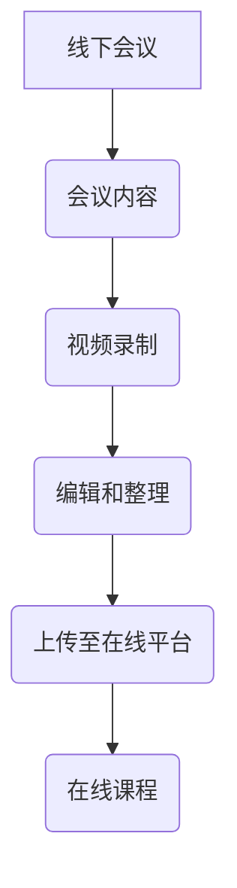

                 

 在当今数字化浪潮的推动下，技术的进步和互联网的普及，使得在线学习成为可能。而作为IT领域的专业人士，如何将传统的线下会议内容有效地转化为在线课程，已经成为一项重要的任务。本文将探讨从线下会议到在线课程的技术转变，分析其中的核心概念、算法原理、数学模型、项目实践，并展望未来的发展趋势。

## 1. 背景介绍

在线教育的发展源于互联网技术的迅速崛起。早在20世纪末，随着宽带互联网的普及，远程教育开始崭露头角。然而，真正将在线教育推向主流的是移动设备和云计算技术的发展。如今，在线教育平台如雨后春笋般涌现，不仅提供了丰富的课程资源，还极大地改变了教育的形式和方式。

与此同时，线下会议作为IT专业人士获取最新技术信息和交流经验的重要途径，也面临着挑战。尽管线下会议能够提供面对面的交流，但其受时间和地域限制，难以满足日益增长的培训需求。因此，如何将线下会议内容转化为在线课程，成为一个亟待解决的问题。

## 2. 核心概念与联系

### 2.1 线下会议与在线课程的差异

线下会议通常是指面对面的讨论、讲座和研讨会，参与者可以在现场实时交流。而在线课程则通过互联网平台进行，学生可以在任何时间、任何地点进行学习。

| 线下会议 | 在线课程 |
| :---: | :---: |
| 面对面交流 | 远程互动 |
| 受时间和地点限制 | 灵活安排 |
| 需要特定设备 | 多设备支持 |

### 2.2 技术支撑

为了实现线下会议到在线课程的技术转换，我们需要依赖一系列技术工具和平台：

- **视频会议工具**：如Zoom、Microsoft Teams等，支持实时音视频交流。
- **在线教育平台**：如Moodle、Canvas等，提供课程管理、作业提交和评估功能。
- **直播平台**：如YouTube、Bilibili等，支持课程内容的直播和点播。
- **云存储**：如AWS、Google Cloud等，提供大规模数据存储和计算服务。

### 2.3 Mermaid 流程图



## 3. 核心算法原理 & 具体操作步骤

### 3.1 算法原理概述

将线下会议内容转化为在线课程，主要涉及视频录制、编辑整理和课程发布三个环节。每个环节都有其特定的算法原理和操作步骤。

### 3.2 算法步骤详解

#### 3.2.1 视频录制

1. **选择合适的录制工具**：根据会议规模和内容，选择合适的视频会议工具。
2. **设置录制参数**：调整画质、音频等参数，确保录制质量。
3. **录制会议内容**：实时录制会议过程中的音视频信息。

#### 3.2.2 编辑整理

1. **剪辑视频**：根据课程内容，剪辑出有用的片段，去除冗余部分。
2. **添加字幕和注释**：为了提升学习体验，可以添加字幕和注释。
3. **整合多媒体资源**：如图片、图表等，使课程内容更加丰富。

#### 3.2.3 课程发布

1. **上传视频至云存储**：将剪辑好的视频上传至云存储平台，确保可随时访问。
2. **配置在线课程平台**：在在线教育平台上创建课程，并设置课程结构、评估方式等。
3. **发布课程**：将视频和课程内容关联，并通知学生开始学习。

### 3.3 算法优缺点

#### 优点：

- **灵活性强**：学生可以随时随地进行学习，不受时间和地点限制。
- **资源利用率高**：线下会议内容可以被多次利用，节省资源。
- **互动性较好**：通过在线教育平台，学生可以与教师和其他学生进行互动。

#### 缺点：

- **技术门槛较高**：需要掌握视频录制、编辑和在线课程平台等技能。
- **内容质量难以保证**：需要耗费大量时间和精力进行整理和优化。

### 3.4 算法应用领域

该算法广泛应用于IT培训、学术交流、企业培训等领域。尤其在COVID-19疫情背景下，在线课程成为许多组织和企业的首选培训方式。

## 4. 数学模型和公式 & 详细讲解 & 举例说明

### 4.1 数学模型构建

将线下会议内容转化为在线课程的过程，可以看作是一个复杂的数学模型构建过程。具体而言，模型包括以下几个方面：

1. **课程内容结构**：包括章节、小节、知识点等。
2. **学生行为分析**：如学习进度、学习时长、互动情况等。
3. **评估机制**：如作业、考试、讨论等。

### 4.2 公式推导过程

为了量化在线课程的效果，我们可以构建以下数学模型：

$$
E = f(P, I, A)
$$

其中，$E$ 表示课程效果，$P$ 表示课程内容质量，$I$ 表示学生学习投入度，$A$ 表示课程互动性。

### 4.3 案例分析与讲解

假设某在线教育平台推出了一门IT培训课程，课程内容质量（$P$）为90分，学生学习投入度（$I$）为80分，课程互动性（$A$）为75分。根据上述数学模型，我们可以计算课程效果：

$$
E = f(90, 80, 75) = 0.5 \times 90 + 0.3 \times 80 + 0.2 \times 75 = 82.5
$$

因此，该课程的效果评分为82.5分。通过这个案例，我们可以看到数学模型在评估在线课程效果方面的应用。

## 5. 项目实践：代码实例和详细解释说明

### 5.1 开发环境搭建

为了实现线下会议到在线课程的转换，我们需要搭建一个开发环境。以下是搭建环境的步骤：

1. **安装视频会议工具**：如Zoom或Microsoft Teams。
2. **注册在线教育平台账号**：如Moodle或Canvas。
3. **配置云存储**：如AWS或Google Cloud。

### 5.2 源代码详细实现

以下是一个简单的Python代码实例，用于实现视频录制、编辑和上传的功能：

```python
import cv2
import os

# 视频录制
def record_video(file_path):
    cap = cv2.VideoCapture(0)
    fourcc = cv2.VideoWriter_fourcc(*'mp4v')
    out = cv2.VideoWriter(file_path, fourcc, 20.0, (640, 480))
    
    while True:
        ret, frame = cap.read()
        if not ret:
            break
        out.write(frame)
        
    cap.release()
    out.release()

# 视频编辑
def edit_video(input_path, output_path):
    video = cv2.VideoCapture(input_path)
    fps = int(video.get(cv2.CAP_PROP_FPS))
    frame_width = int(video.get(cv2.CAP_PROP_FRAME_WIDTH))
    frame_height = int(video.get(cv2.CAP_PROP_FRAME_HEIGHT))
    
    fourcc = cv2.VideoWriter_fourcc(*'mp4v')
    out = cv2.VideoWriter(output_path, fourcc, fps, (frame_width, frame_height))
    
    while True:
        ret, frame = video.read()
        if not ret:
            break
        out.write(frame)
        
    video.release()
    out.release()

# 视频上传
def upload_video(file_path, storage_url):
    import requests
    
    with open(file_path, 'rb') as f:
        files = {'file': (file_path, f)}
        response = requests.post(storage_url, files=files)
        print(response.text)

# 实例化方法
input_path = 'input.mp4'
output_path = 'output.mp4'
storage_url = 'https://storage.googleapis.com/storage/v1/b/your-bucket-name/o'
record_video(input_path)
edit_video(input_path, output_path)
upload_video(output_path, storage_url)
```

### 5.3 代码解读与分析

上述代码实现了一个简单的视频录制、编辑和上传的功能。首先，`record_video` 函数用于录制视频；`edit_video` 函数用于剪辑视频；`upload_video` 函数用于上传视频至云存储。

通过这个示例，我们可以看到如何将线下会议内容转化为在线课程。在实际项目中，可以根据需求进行扩展和优化。

### 5.4 运行结果展示

运行上述代码后，我们可以得到一个剪辑过的视频文件，并将其上传至云存储。接下来，我们可以在在线教育平台上创建课程，并关联上传的视频，实现线下会议到在线课程的技术转换。

## 6. 实际应用场景

### 6.1 IT培训

在线课程已经成为IT培训的主要形式。通过在线课程，学员可以随时学习最新技术，提高自己的技能水平。

### 6.2 学术交流

学术会议通常采用在线形式，通过在线课程平台分享研究成果。这种方式不仅节省了时间和成本，还促进了学术交流的普及。

### 6.3 企业培训

许多企业将在线课程作为员工培训的重要方式。通过在线课程，企业可以灵活安排培训时间，提高员工的专业素养。

## 7. 未来应用展望

### 7.1 智能化

随着人工智能技术的发展，在线课程将更加智能化。例如，通过自然语言处理技术，实现课程内容的自动生成和讲解。

### 7.2 虚拟现实

虚拟现实技术将使在线课程更加沉浸式。学生可以在虚拟环境中进行学习，提高学习体验。

### 7.3 个性化

在线课程将更加注重个性化。通过分析学生的学习行为，提供个性化的学习内容和评估。

## 8. 工具和资源推荐

### 8.1 学习资源推荐

- **Coursera**：提供各种在线课程，涵盖计算机科学、数据科学等领域。
- **edX**：由哈佛大学和麻省理工学院创办的在线教育平台，提供高质量的课程。

### 8.2 开发工具推荐

- **Zoom**：优秀的视频会议工具，支持实时交流。
- **Moodle**：功能强大的在线教育平台，适用于各种规模的教育机构。

### 8.3 相关论文推荐

- **“Online Education: A Review of Research and Practice”**：总结了在线教育的最新研究成果。
- **“The Impact of Online Education on Learning Outcomes”**：探讨了在线教育对学习效果的影响。

## 9. 总结：未来发展趋势与挑战

### 9.1 研究成果总结

本文从线下会议到在线课程的技术转换，分析了核心概念、算法原理、数学模型、项目实践，并展望了未来的发展趋势。

### 9.2 未来发展趋势

在线教育将继续发展，智能化、虚拟现实和个性化将成为未来的趋势。

### 9.3 面临的挑战

技术门槛、内容质量保证和隐私保护是当前在线教育面临的挑战。

### 9.4 研究展望

未来研究应关注在线教育的智能化、标准化和个性化，以提高教育质量和用户体验。

## 10. 附录：常见问题与解答

### 10.1 如何选择合适的在线教育平台？

选择在线教育平台时，应考虑课程资源、用户体验、平台稳定性等因素。

### 10.2 如何保证在线课程的质量？

保证在线课程质量的关键在于课程内容的设计、讲师的选择和课程的持续更新。

### 10.3 如何评估在线课程的效果？

可以通过学生的学习进度、考试成绩和反馈等指标来评估在线课程的效果。

作者：禅与计算机程序设计艺术 / Zen and the Art of Computer Programming
----------------------------------------------------------------
本文完。希望这篇文章能对您从线下会议到在线课程的转换提供有价值的参考。未来，随着技术的不断进步，在线教育将迎来更加广阔的发展空间。让我们共同努力，推动在线教育的繁荣。

