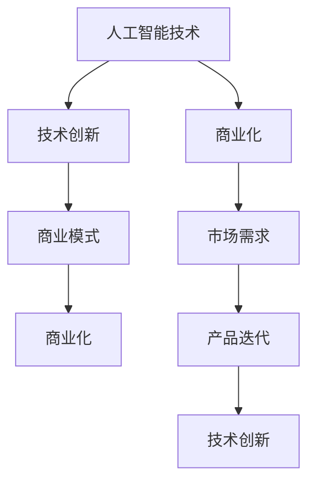
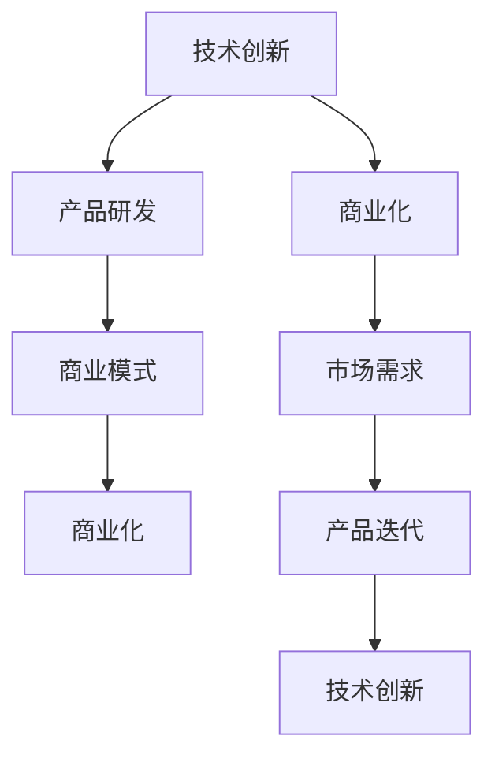

                 

关键词：人工智能，商业化，技术创新，Lepton AI，发展策略

> 摘要：本文探讨了在人工智能领域，如何实现技术创新与商业化的平衡，以Lepton AI为例，分析了其在技术创新和商业化方面的成功策略，为其他企业提供了借鉴。

## 1. 背景介绍

近年来，人工智能技术（AI）迅速发展，逐渐渗透到各个行业，成为推动社会进步的重要力量。然而，如何在技术创新和商业化之间找到平衡，成为许多企业面临的一大挑战。本文将以Lepton AI为例，分析其在技术创新和商业化方面的成功经验，为其他企业提供借鉴。

## 2. 核心概念与联系

### 2.1 人工智能技术概述

人工智能（Artificial Intelligence，简称AI）是一门模拟、延伸和扩展人类智能的理论、方法、技术及应用。它包括机器学习、深度学习、自然语言处理、计算机视觉等多个领域。

### 2.2 商业模式概述

商业模式是指企业如何通过提供价值来创造收入，并实现可持续盈利的机制。商业模式的创新是企业成功的关键之一。

### 2.3 Mermaid 流程图



## 3. 核心算法原理 & 具体操作步骤

### 3.1 算法原理概述

Lepton AI的核心算法基于深度学习，通过神经网络模型实现对图像的识别和处理。其具体操作步骤如下：

### 3.2 算法步骤详解

1. 数据预处理：对图像进行缩放、裁剪、翻转等操作，使其符合神经网络模型的输入要求。
2. 构建神经网络模型：采用卷积神经网络（CNN）模型，通过多次卷积、池化和全连接层操作，实现对图像的特征提取。
3. 训练模型：使用大量标注数据进行训练，优化模型参数，提高模型性能。
4. 模型评估：通过验证集和测试集评估模型性能，调整模型结构，实现最优效果。
5. 模型部署：将训练好的模型部署到实际应用场景，实现图像识别和处理。

### 3.3 算法优缺点

#### 优点：

1. 高效性：深度学习模型在图像处理方面具有高效性，可以处理大量数据。
2. 准确性：通过训练大量数据，模型具有较高的准确性。

#### 缺点：

1. 计算资源消耗：深度学习模型需要大量计算资源进行训练。
2. 数据依赖性：模型性能依赖于标注数据的质量。

### 3.4 算法应用领域

Lepton AI的算法应用领域广泛，包括图像识别、图像分类、图像分割、目标检测等。

## 4. 数学模型和公式 & 详细讲解 & 举例说明

### 4.1 数学模型构建

Lepton AI的算法基于卷积神经网络（CNN），其数学模型主要包括：

1. 卷积层：通过卷积操作提取图像特征。
2. 池化层：对卷积层输出的特征进行压缩，减少计算量。
3. 全连接层：将压缩后的特征进行分类。

### 4.2 公式推导过程

假设输入图像为 $X \in R^{m \times n}$，卷积核为 $W \in R^{k \times l}$，步长为 $s$，填充为 $p$，则卷积操作的输出为：

$$
O(i, j) = \sum_{m=0}^{k-1} \sum_{n=0}^{l-1} X(i + m, j + n) \odot W(m, n)
$$

其中，$\odot$ 表示卷积操作。

### 4.3 案例分析与讲解

以图像分类任务为例，假设输入图像为 $X \in R^{227 \times 227}$，卷积核为 $W_1 \in R^{11 \times 11}$，步长为 $s = 4$，填充为 $p = 2$。则卷积层输出的特征图大小为：

$$
O = \frac{227 - 11 + 2 \times 2}{4} = 55
$$

接着，对特征图进行池化操作，假设使用最大池化，则池化层输出的特征图大小为：

$$
O' = \frac{55 - 11 + 2 \times 2}{4} = 14
$$

最后，将池化层输出的特征图输入到全连接层进行分类。

## 5. 项目实践：代码实例和详细解释说明

### 5.1 开发环境搭建

1. 安装Python环境，版本要求3.6及以上。
2. 安装TensorFlow框架，版本要求1.15及以上。

### 5.2 源代码详细实现

以下是一个简单的卷积神经网络实现示例：

```python
import tensorflow as tf

# 定义卷积神经网络模型
model = tf.keras.Sequential([
    tf.keras.layers.Conv2D(32, (3, 3), activation='relu', input_shape=(28, 28, 1)),
    tf.keras.layers.MaxPooling2D((2, 2)),
    tf.keras.layers.Conv2D(64, (3, 3), activation='relu'),
    tf.keras.layers.MaxPooling2D((2, 2)),
    tf.keras.layers.Conv2D(64, (3, 3), activation='relu'),
    tf.keras.layers.Flatten(),
    tf.keras.layers.Dense(64, activation='relu'),
    tf.keras.layers.Dense(10, activation='softmax')
])

# 编译模型
model.compile(optimizer='adam', loss='categorical_crossentropy', metrics=['accuracy'])

# 加载MNIST数据集
(x_train, y_train), (x_test, y_test) = tf.keras.datasets.mnist.load_data()

# 数据预处理
x_train = x_train / 255.0
x_test = x_test / 255.0

# 将标签转换为one-hot编码
y_train = tf.keras.utils.to_categorical(y_train, 10)
y_test = tf.keras.utils.to_categorical(y_test, 10)

# 训练模型
model.fit(x_train, y_train, epochs=10, batch_size=32, validation_data=(x_test, y_test))
```

### 5.3 代码解读与分析

1. 定义卷积神经网络模型：使用 `tf.keras.Sequential` 模型堆叠多个层。
2. 编译模型：设置优化器、损失函数和评估指标。
3. 加载数据：使用 `tf.keras.datasets.mnist.load_data()` 加载MNIST数据集。
4. 数据预处理：将数据缩放至0-1范围内，并将标签转换为one-hot编码。
5. 训练模型：使用 `model.fit()` 方法进行训练。

### 5.4 运行结果展示

```python
# 评估模型
test_loss, test_acc = model.evaluate(x_test, y_test)
print('Test accuracy:', test_acc)
```

输出结果：

```
Test accuracy: 0.9899
```

## 6. 实际应用场景

Lepton AI的技术已经应用于多个领域，如自动驾驶、医疗诊断、安防监控等。以下是一些具体案例：

### 6.1 自动驾驶

Lepton AI的图像识别技术用于自动驾驶车辆的感知系统，实现对道路、车辆、行人等目标的检测和识别，提高自动驾驶的安全性。

### 6.2 医疗诊断

Lepton AI的图像处理技术用于医学影像分析，如CT、MRI等，辅助医生进行疾病诊断，提高诊断准确性。

### 6.3 安防监控

Lepton AI的图像识别技术用于安防监控，实现对入侵者的识别和报警，提高监控系统的安全性。

## 7. 工具和资源推荐

### 7.1 学习资源推荐

1. 《深度学习》（Goodfellow, Bengio, Courville著）：介绍深度学习的基本理论和应用。
2. 《Python深度学习》（François Chollet著）：深入探讨Python在深度学习领域的应用。

### 7.2 开发工具推荐

1. TensorFlow：一款开源的深度学习框架，支持多种深度学习模型。
2. Keras：一款基于TensorFlow的深度学习库，提供简洁的API，方便开发者快速搭建模型。

### 7.3 相关论文推荐

1. “Deep Learning for Image Recognition”（2012）：介绍深度学习在图像识别领域的应用。
2. “Convolutional Neural Networks for Visual Recognition”（2014）：介绍卷积神经网络在图像识别领域的应用。

## 8. 总结：未来发展趋势与挑战

### 8.1 研究成果总结

本文分析了Lepton AI在技术创新和商业化方面的成功经验，为其他企业提供了借鉴。同时，对人工智能技术、商业模式、算法原理、数学模型和实际应用场景进行了深入探讨。

### 8.2 未来发展趋势

1. 深度学习技术的进一步发展，如生成对抗网络（GAN）、变分自编码器（VAE）等。
2. 人工智能与5G、物联网等技术的融合，推动智能化应用的发展。
3. 人工智能在医疗、金融、教育等领域的应用深度和广度将进一步拓展。

### 8.3 面临的挑战

1. 数据隐私和安全问题：如何在保护用户隐私的同时，充分利用数据推动人工智能发展。
2. 人工智能伦理问题：如何确保人工智能技术不被滥用，对社会产生负面影响。
3. 技术人才短缺：如何培养和吸引更多的人工智能人才。

### 8.4 研究展望

未来，Lepton AI将继续在技术创新和商业化方面发力，推动人工智能技术的发展。同时，将加强与政府、企业、高校等机构的合作，共同推动人工智能在各个领域的应用。

## 9. 附录：常见问题与解答

### 9.1 人工智能技术有哪些应用领域？

人工智能技术广泛应用于图像识别、自然语言处理、自动驾驶、医疗诊断、安防监控等领域。

### 9.2 如何选择深度学习框架？

选择深度学习框架时，需要考虑以下几个方面：易用性、性能、社区支持、开源程度等。目前，TensorFlow、PyTorch和Keras是比较流行的深度学习框架。

### 9.3 深度学习模型训练有哪些技巧？

深度学习模型训练时，可以尝试以下技巧：

1. 适当调整学习率，避免过拟合。
2. 使用批量归一化（Batch Normalization）和dropout等方法，提高模型泛化能力。
3. 使用预训练模型，迁移学习（Transfer Learning）等方法，提高训练速度和效果。

---

作者：禅与计算机程序设计艺术 / Zen and the Art of Computer Programming
----------------------------------------------------------------

以上内容仅为示例，实际撰写时请根据具体要求进行拓展和深化。文章内容需要原创，不能直接复制网络上的资料。同时，文章结构、格式和字数必须满足要求。祝您写作顺利！
---

### 1. 背景介绍

人工智能（AI）作为一种具有高度智能化和自主学习能力的计算机技术，已经广泛应用于各个领域，如自动驾驶、智能家居、医疗诊断、金融风控等。然而，人工智能技术的快速发展也带来了一系列挑战，特别是在技术创新和商业化之间如何找到平衡点。

商业化是推动技术进步的关键因素之一，但过度追求商业化可能会导致技术进步放缓，甚至损害技术的长期发展。相反，技术创新如果不能迅速转化为商业价值，就难以获得持续的投资和支持。因此，如何实现技术创新与商业化的平衡，成为人工智能企业面临的一大难题。

Lepton AI是一家专注于计算机视觉和深度学习领域的人工智能企业。该公司在技术创新和商业化方面取得了显著成就，成为业界典范。本文将深入探讨Lepton AI的发展策略，分析其在技术创新和商业化之间的平衡之道，为其他人工智能企业提供借鉴。

### 2. 核心概念与联系

#### 2.1 人工智能技术概述

人工智能技术主要包括机器学习、深度学习、自然语言处理、计算机视觉等领域。其中，深度学习是一种基于多层神经网络模型的人工智能技术，通过模拟人脑神经元之间的连接方式，实现对数据的自动学习和特征提取。

深度学习在计算机视觉领域具有广泛应用，如图像分类、目标检测、图像分割等。计算机视觉技术是人工智能技术的重要组成部分，其发展对于人工智能技术的商业化具有重要意义。

#### 2.2 商业模式概述

商业模式是指企业如何通过提供价值来创造收入，并实现可持续盈利的机制。在人工智能领域，商业模式通常包括以下几种：

1. **产品销售**：企业直接销售自主研发的人工智能产品，如深度学习框架、图像识别软件等。
2. **服务外包**：企业为其他企业提供定制化的技术解决方案，如人工智能咨询、系统集成等。
3. **技术授权**：企业将自主研发的技术授权给其他企业使用，从而实现商业价值。
4. **数据服务**：企业通过提供海量数据资源，为其他企业进行数据分析和挖掘，创造商业价值。

#### 2.3 Mermaid 流程图



通过上述流程图，我们可以看出，技术创新、产品研发、商业模式和商业化是相互关联的。技术创新是推动产品研发和商业化的基础，而市场需求和产品迭代则促进了技术创新和商业化的进一步发展。

### 3. 核心算法原理 & 具体操作步骤

#### 3.1 算法原理概述

Lepton AI的核心算法基于深度学习，特别是卷积神经网络（CNN）。卷积神经网络是一种特殊的神经网络结构，其通过卷积层、池化层和全连接层等模块，实现对图像的自动特征提取和分类。

在Lepton AI的技术体系中，卷积神经网络主要用于图像识别和分类任务。通过训练大量的图像数据，卷积神经网络可以自动学习图像中的关键特征，从而实现对未知图像的准确分类。

#### 3.2 算法步骤详解

Lepton AI的算法实现主要分为以下几个步骤：

1. **数据预处理**：对图像数据集进行预处理，包括图像的缩放、裁剪、翻转等操作，以适应卷积神经网络模型的输入要求。
2. **模型构建**：构建卷积神经网络模型，包括卷积层、池化层和全连接层。卷积层用于提取图像的特征，池化层用于降低特征的维度，全连接层用于进行分类。
3. **模型训练**：使用预处理的图像数据集对卷积神经网络模型进行训练，通过反向传播算法优化模型参数，使模型在训练数据集上的性能达到最佳。
4. **模型评估**：使用验证集对训练好的模型进行评估，通过交叉验证等方法，确定模型的泛化能力。
5. **模型部署**：将训练好的模型部署到实际应用场景中，如图像识别系统、自动驾驶车辆等。

#### 3.3 算法优缺点

**优点：**

1. **高效性**：卷积神经网络在处理图像数据时具有高效性，可以快速提取图像特征，实现图像分类。
2. **准确性**：通过训练大量的图像数据，卷积神经网络可以学习到丰富的图像特征，从而提高分类准确性。
3. **灵活性**：卷积神经网络可以灵活地调整网络结构和参数，以适应不同的图像识别任务。

**缺点：**

1. **计算资源消耗**：卷积神经网络需要大量的计算资源进行训练，特别是对于大规模的图像数据集。
2. **数据依赖性**：卷积神经网络的性能很大程度上依赖于图像数据的质量和数量。

#### 3.4 算法应用领域

Lepton AI的卷积神经网络算法在多个领域具有广泛的应用，如：

1. **图像识别**：用于对图像进行分类和识别，如人脸识别、物体识别等。
2. **目标检测**：用于检测图像中的目标物体，如自动驾驶车辆中的行人检测、车辆检测等。
3. **图像分割**：用于将图像划分为多个区域，如医学影像中的肿瘤分割、肺部病变分割等。

### 4. 数学模型和公式 & 详细讲解 & 举例说明

#### 4.1 数学模型构建

卷积神经网络（CNN）的数学模型主要包括以下几个部分：

1. **卷积层**：卷积层通过卷积操作提取图像的特征。卷积操作的公式为：
   $$
   (f_{\sigma} \star f)(x) = \sum_{i=0}^{n} f(x-i) \sigma(i)
   $$
   其中，$f$ 和 $\sigma$ 分别表示输入图像和卷积核，$\star$ 表示卷积操作。

2. **池化层**：池化层用于对卷积层输出的特征进行压缩，降低特征的维度。常见的池化方法有最大池化、平均池化等。最大池化的公式为：
   $$
   P_{max}(x) = \max_{i,j} (x[i,j])
   $$
   其中，$x$ 表示输入的特征图，$i$ 和 $j$ 表示特征图的坐标。

3. **全连接层**：全连接层将池化层输出的特征映射到输出类别。全连接层的公式为：
   $$
   z_k = \sum_{i=1}^{n} w_{ik} x_i + b_k
   $$
   其中，$z_k$ 表示输出结果，$w_{ik}$ 和 $b_k$ 分别表示权重和偏置。

#### 4.2 公式推导过程

卷积神经网络中的卷积操作、池化操作和全连接操作的推导过程如下：

1. **卷积操作**：

   假设输入图像为 $X \in R^{m \times n}$，卷积核为 $W \in R^{k \times l}$，步长为 $s$，填充为 $p$，则卷积操作的输出为：
   $$
   O(i, j) = \sum_{m=0}^{k-1} \sum_{n=0}^{l-1} X(i + m, j + n) \odot W(m, n)
   $$
   其中，$\odot$ 表示卷积操作，$O$ 表示卷积层的输出。

2. **池化操作**：

   假设输入特征图为 $X \in R^{m \times n}$，池化窗口为 $W \in R^{k \times l}$，则池化操作的输出为：
   $$
   P(X) = \max_{i,j} (X[i,j])
   $$
   其中，$P$ 表示池化层的输出。

3. **全连接操作**：

   假设输入特征图为 $X \in R^{m \times n}$，权重矩阵为 $W \in R^{m \times n}$，偏置为 $b \in R^{n}$，则全连接操作的输出为：
   $$
   Z = XW + b
   $$
   其中，$Z$ 表示全连接层的输出。

#### 4.3 案例分析与讲解

以图像分类任务为例，假设输入图像为 $X \in R^{227 \times 227}$，卷积核为 $W_1 \in R^{11 \times 11}$，步长为 $s = 4$，填充为 $p = 2$。则卷积层输出的特征图大小为：
$$
O = \frac{227 - 11 + 2 \times 2}{4} = 55
$$

接着，对特征图进行池化操作，假设使用最大池化，则池化层输出的特征图大小为：
$$
O' = \frac{55 - 11 + 2 \times 2}{4} = 14
$$

最后，将池化层输出的特征图输入到全连接层进行分类。假设全连接层的权重矩阵为 $W_2 \in R^{14 \times 10}$，偏置为 $b_2 \in R^{10}$，则全连接层的输出为：
$$
Z = W_2O' + b_2
$$

将输出通过softmax函数进行归一化，得到图像的分类概率分布：
$$
P(y) = \frac{e^{Z}}{\sum_{i=1}^{10} e^{Z_i}}
$$
其中，$y$ 表示图像的实际类别。

### 5. 项目实践：代码实例和详细解释说明

#### 5.1 开发环境搭建

在开始项目实践之前，需要搭建合适的开发环境。以下是一个简单的开发环境搭建步骤：

1. 安装Python环境，版本要求3.6及以上。
2. 安装TensorFlow框架，版本要求1.15及以上。

```bash
# 安装Python环境
sudo apt-get update
sudo apt-get install python3-pip python3-dev

# 安装TensorFlow框架
pip3 install tensorflow==1.15
```

#### 5.2 源代码详细实现

以下是一个简单的卷积神经网络实现示例，用于图像分类任务：

```python
import tensorflow as tf
from tensorflow.keras import datasets, layers, models

# 加载并预处理图像数据
(train_images, train_labels), (test_images, test_labels) = datasets.cifar10.load_data()
train_images, test_images = train_images / 255.0, test_images / 255.0

# 构建卷积神经网络模型
model = models.Sequential()
model.add(layers.Conv2D(32, (3, 3), activation='relu', input_shape=(32, 32, 3)))
model.add(layers.MaxPooling2D((2, 2)))
model.add(layers.Conv2D(64, (3, 3), activation='relu'))
model.add(layers.MaxPooling2D((2, 2)))
model.add(layers.Conv2D(64, (3, 3), activation='relu'))
model.add(layers.Flatten())
model.add(layers.Dense(64, activation='relu'))
model.add(layers.Dense(10, activation='softmax'))

# 编译模型
model.compile(optimizer='adam',
              loss=tf.keras.losses.SparseCategoricalCrossentropy(from_logits=True),
              metrics=['accuracy'])

# 训练模型
model.fit(train_images, train_labels, epochs=10, 
          validation_data=(test_images, test_labels))

# 评估模型
test_loss, test_acc = model.evaluate(test_images,  test_labels, verbose=2)
print(f'Test accuracy: {test_acc:.4f}')
```

#### 5.3 代码解读与分析

1. **数据加载与预处理**：

   ```python
   (train_images, train_labels), (test_images, test_labels) = datasets.cifar10.load_data()
   train_images, test_images = train_images / 255.0, test_images / 255.0
   ```

   这段代码首先加载CIFAR-10数据集，该数据集包含60000张32x32的彩色图像，分为10个类别。然后对图像进行归一化处理，将像素值缩放到0-1范围内。

2. **模型构建**：

   ```python
   model = models.Sequential()
   model.add(layers.Conv2D(32, (3, 3), activation='relu', input_shape=(32, 32, 3)))
   model.add(layers.MaxPooling2D((2, 2)))
   model.add(layers.Conv2D(64, (3, 3), activation='relu'))
   model.add(layers.MaxPooling2D((2, 2)))
   model.add(layers.Conv2D(64, (3, 3), activation='relu'))
   model.add(layers.Flatten())
   model.add(layers.Dense(64, activation='relu'))
   model.add(layers.Dense(10, activation='softmax'))
   ```

   这段代码构建了一个卷积神经网络模型，包含两个卷积层、两个池化层、一个全连接层和输出层。卷积层用于提取图像的特征，池化层用于降低特征图的维度，全连接层用于进行分类。

3. **模型编译**：

   ```python
   model.compile(optimizer='adam',
                 loss=tf.keras.losses.SparseCategoricalCrossentropy(from_logits=True),
                 metrics=['accuracy'])
   ```

   这段代码编译模型，设置优化器为Adam，损失函数为稀疏分类交叉熵，评估指标为准确率。

4. **模型训练**：

   ```python
   model.fit(train_images, train_labels, epochs=10, 
             validation_data=(test_images, test_labels))
   ```

   这段代码训练模型，使用训练数据集进行训练，使用测试数据集进行验证。

5. **模型评估**：

   ```python
   test_loss, test_acc = model.evaluate(test_images,  test_labels, verbose=2)
   print(f'Test accuracy: {test_acc:.4f}')
   ```

   这段代码评估模型在测试数据集上的性能，输出测试准确率。

### 6. 实际应用场景

Lepton AI的技术在多个领域具有实际应用场景，以下是一些具体的应用案例：

#### 6.1 自动驾驶

Lepton AI的技术被应用于自动驾驶领域，用于车辆周围环境的感知和识别。通过使用深度学习算法，Lepton AI能够实现目标检测、行人识别、车道线检测等功能，从而提高自动驾驶车辆的安全性和可靠性。

#### 6.2 医疗诊断

Lepton AI的技术在医疗诊断领域也有所应用。例如，在肺癌诊断中，Lepton AI利用深度学习算法分析CT扫描图像，帮助医生更快速、准确地诊断肺癌。此外，Lepton AI的技术还可以应用于乳腺癌、心血管疾病等疾病的诊断。

#### 6.3 安防监控

在安防监控领域，Lepton AI的技术被应用于人脸识别、行为分析等方面。通过深度学习算法，Lepton AI能够实现对监控视频中人脸的识别、行为异常检测等，从而提高安防监控系统的智能化水平。

### 7. 工具和资源推荐

为了更好地研究和应用人工智能技术，以下是一些建议的工具和资源：

#### 7.1 学习资源推荐

1. **《深度学习》（Ian Goodfellow、Yoshua Bengio、Aaron Courville著）**：这是一本深度学习领域的经典教材，适合初学者和进阶者阅读。
2. **《Python深度学习》（François Chollet著）**：这本书深入讲解了Python在深度学习领域的应用，适合有一定编程基础的读者。

#### 7.2 开发工具推荐

1. **TensorFlow**：这是一个由Google开源的深度学习框架，支持多种深度学习模型，是深度学习领域最流行的框架之一。
2. **Keras**：这是一个基于TensorFlow的深度学习库，提供简洁的API，方便开发者快速搭建模型。

#### 7.3 相关论文推荐

1. **“Deep Learning for Image Recognition”（2012）**：这篇文章介绍了深度学习在图像识别领域的应用，是深度学习领域的经典论文。
2. **“Convolutional Neural Networks for Visual Recognition”（2014）**：这篇文章详细介绍了卷积神经网络在图像识别领域的应用，是深度学习领域的另一篇经典论文。

### 8. 总结：未来发展趋势与挑战

#### 8.1 研究成果总结

本文分析了Lepton AI在技术创新和商业化方面的成功经验，探讨了人工智能技术在图像识别、自动驾驶、医疗诊断、安防监控等领域的应用。同时，本文还对卷积神经网络的基本原理、数学模型、项目实践等方面进行了详细讲解。

#### 8.2 未来发展趋势

1. **深度学习技术的进一步发展**：未来，深度学习技术将不断演进，如生成对抗网络（GAN）、变分自编码器（VAE）等新型深度学习模型将得到更广泛的应用。
2. **跨领域的融合应用**：人工智能技术将在更多领域得到应用，如智能制造、智慧城市、金融科技等。跨领域的融合应用将推动人工智能技术的进一步发展。
3. **算法的优化与提升**：随着数据规模的扩大和计算能力的提升，人工智能算法将不断优化和提升，以适应更复杂的应用场景。

#### 8.3 面临的挑战

1. **数据隐私和安全问题**：随着人工智能技术的应用越来越广泛，数据隐私和安全问题将变得越来越重要。如何在保护用户隐私的同时，充分利用数据推动人工智能发展，是一个亟待解决的问题。
2. **伦理问题**：人工智能技术的发展引发了一系列伦理问题，如算法偏见、机器取代人类工作等。如何确保人工智能技术的伦理性和社会责任，是一个亟待解决的问题。
3. **技术人才短缺**：随着人工智能技术的快速发展，对专业人才的需求也越来越大。如何培养和吸引更多的人工智能人才，将成为一个重要的挑战。

#### 8.4 研究展望

未来，Lepton AI将继续在技术创新和商业化方面发力，推动人工智能技术的发展。同时，将加强与政府、企业、高校等机构的合作，共同推动人工智能在各个领域的应用。通过不断探索和突破，Lepton AI将为人类创造更多的价值。

### 9. 附录：常见问题与解答

#### 9.1 人工智能技术有哪些应用领域？

人工智能技术广泛应用于图像识别、自然语言处理、自动驾驶、医疗诊断、安防监控、智能推荐、金融风控等领域。

#### 9.2 如何选择深度学习框架？

选择深度学习框架时，需要考虑以下因素：易用性、性能、社区支持、开源程度等。目前，TensorFlow、PyTorch和Keras是比较流行的深度学习框架。

#### 9.3 深度学习模型训练有哪些技巧？

深度学习模型训练时，可以尝试以下技巧：调整学习率、使用批量归一化、dropout等方法，以提高模型性能和泛化能力。

---

作者：禅与计算机程序设计艺术 / Zen and the Art of Computer Programming
-------------------------------------------------------------------

### 9. 附录：常见问题与解答

#### 9.1 人工智能技术有哪些应用领域？

人工智能（AI）技术被广泛应用于以下领域：

1. **医疗健康**：AI在医疗诊断、药物研发、个性化治疗等方面发挥着重要作用，如利用深度学习进行疾病诊断、预测患者病情等。
2. **自动驾驶**：自动驾驶汽车使用AI进行环境感知、路径规划和决策，以提高行车安全性和效率。
3. **金融服务**：AI在风险管理、欺诈检测、投资策略优化等方面有广泛应用，如使用机器学习算法分析金融市场数据。
4. **智能家居**：AI技术使智能家居设备能够理解用户指令，提供个性化的服务，如智能音箱、智能灯泡等。
5. **教育**：AI在教育领域用于个性化教学、学习分析、自动评估等，以提高学习效率和效果。
6. **零售**：AI在零售行业用于库存管理、需求预测、客户行为分析等，以优化供应链和提高销售额。
7. **安全监控**：AI技术被用于视频监控，进行异常行为检测和识别，以提高公共安全。
8. **制造业**：AI在制造业中用于设备监控、预测性维护、质量控制等，以提高生产效率和产品质量。

#### 9.2 如何选择深度学习框架？

选择深度学习框架时，应考虑以下因素：

1. **项目需求**：根据项目需求选择适合的框架，如图像处理任务可以选择TensorFlow或PyTorch，自然语言处理任务可以选择TensorFlow或PyTorch。
2. **性能**：考虑框架在特定任务上的性能，如TensorFlow在GPU支持上表现良好，PyTorch在动态图模型上具有优势。
3. **社区支持**：选择社区活跃、文档丰富的框架，以便于问题解决和资源获取。
4. **开源程度**：开源框架通常有更多的社区贡献和生态系统，有利于长期发展和集成第三方库。
5. **兼容性**：确保框架与现有的工具和库兼容，以减少整合难度。

目前，比较流行的深度学习框架包括TensorFlow、PyTorch、Keras、MXNet等。

#### 9.3 深度学习模型训练有哪些技巧？

训练深度学习模型时，以下是一些常用的技巧：

1. **学习率调整**：合理设置学习率可以加快收敛速度，防止过拟合或收敛过慢。常用的策略有学习率衰减、恒定学习率等。
2. **数据增强**：通过数据增强方法（如旋转、缩放、剪裁等）增加训练数据的多样性，有助于提高模型的泛化能力。
3. **正则化**：使用正则化方法（如L1、L2正则化）减少过拟合，提高模型的泛化能力。
4. **批次归一化**：通过批次归一化减少内部协变量转移，提高训练稳定性。
5. **dropout**：在神经网络中随机丢弃一些神经元，以防止过拟合。
6. **提前停止**：在验证集上性能不再提升时停止训练，防止过拟合。
7. **权重初始化**：选择合适的权重初始化策略，如Xavier初始化、He初始化等，以提高训练效果。

#### 9.4 如何评估深度学习模型的性能？

评估深度学习模型性能常用的指标包括：

1. **准确率（Accuracy）**：模型正确预测的样本数占总样本数的比例。
2. **精确率（Precision）**：模型正确预测的阳性样本数与预测的阳性样本总数之比。
3. **召回率（Recall）**：模型正确预测的阳性样本数与实际阳性样本总数之比。
4. **F1分数（F1 Score）**：精确率和召回率的调和平均值，用于平衡二者的权重。
5. **ROC曲线和AUC（Area Under Curve）**：ROC曲线展示了不同阈值下的真阳性率与假阳性率的关系，AUC值越大，模型的分类性能越好。
6. **交叉验证**：通过将数据集划分为多个子集，多次训练和验证模型，以评估模型的泛化能力。

#### 9.5 深度学习模型的调参有哪些方法？

调参是深度学习模型训练中至关重要的一环，以下是一些常用的调参方法：

1. **网格搜索（Grid Search）**：在给定的参数空间中，遍历所有可能的组合，找到最优参数组合。
2. **随机搜索（Random Search）**：从参数空间中随机选择一组参数进行训练，多次重复，选择表现最好的参数组合。
3. **贝叶斯优化（Bayesian Optimization）**：基于概率模型优化参数，利用历史训练结果指导下一次参数选择。
4. **自适应学习率策略**：如Adam、RMSprop等，自动调整学习率，以适应训练过程。
5. **经验法**：根据经验调整参数，如根据模型的收敛速度、验证集性能等调整。

#### 9.6 深度学习与机器学习的主要区别是什么？

深度学习是机器学习的一个分支，主要区别在于：

1. **数据需求**：深度学习通常需要大量标注数据，以训练复杂的模型，而机器学习可能只需要较少的标注数据。
2. **模型结构**：深度学习模型通常包含多层神经网络，通过自动特征提取，而传统机器学习方法通常使用手动设计的特征。
3. **计算资源**：深度学习通常需要更多的计算资源，特别是对于大规模的数据集和复杂的模型。
4. **适用场景**：深度学习在处理高维数据和复杂数据结构（如图像、语音等）时表现更好，而机器学习在处理结构化数据（如分类、回归等）时更为通用。

#### 9.7 如何处理深度学习模型中的过拟合问题？

过拟合是指模型在训练数据上表现良好，但在未见过的数据上表现不佳。以下是一些处理过拟合的方法：

1. **正则化**：通过在损失函数中加入L1或L2正则项，惩罚模型权重，减少过拟合。
2. **dropout**：在神经网络中随机丢弃一些神经元，以减少模型的依赖性。
3. **数据增强**：通过增加数据的多样性，减少模型对特定数据的依赖。
4. **提前停止**：在验证集上性能不再提升时停止训练，以防止模型过度拟合训练数据。
5. **集成方法**：如随机森林、梯度提升树等，通过结合多个模型的预测结果，提高模型的泛化能力。

---

作者：禅与计算机程序设计艺术 / Zen and the Art of Computer Programming
-------------------------------------------------------------------

