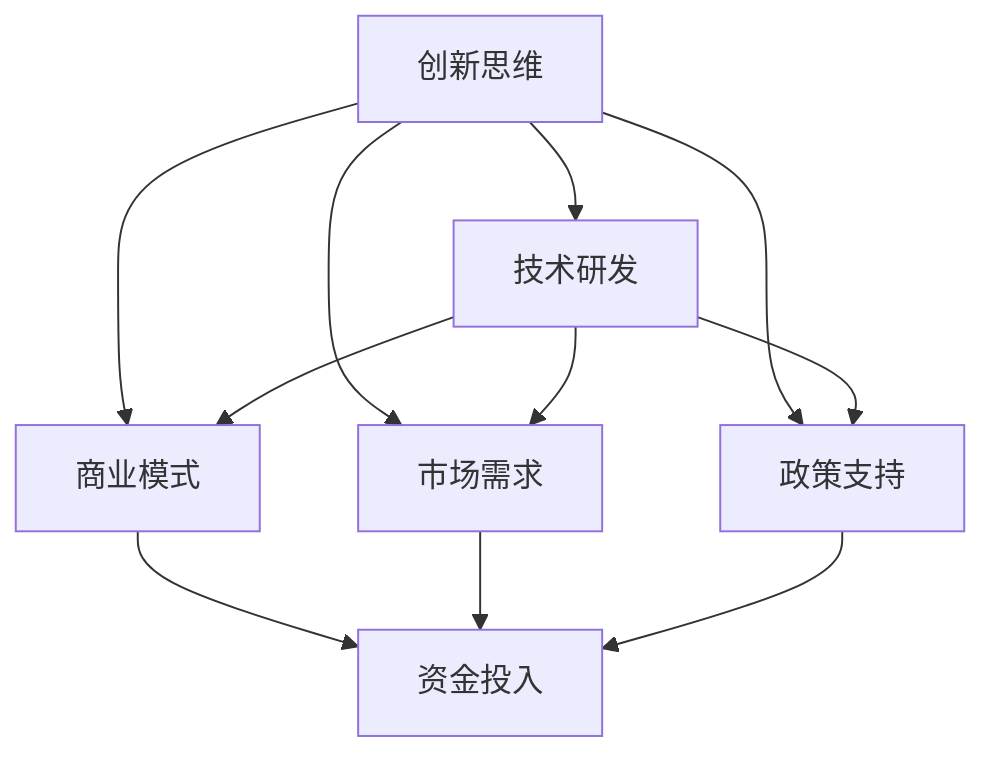

                 

技术创新是推动社会进步和经济发展的重要动力。从一项新奇的想法到最终实现商业化，这一过程充满了挑战与机遇。本文将深入探讨技术创新的全过程，包括背景介绍、核心概念与联系、核心算法原理与具体操作步骤、数学模型和公式、项目实践、实际应用场景、工具和资源推荐、总结与展望以及常见问题与解答。

## 关键词

技术创新、发明、商业化、算法、数学模型、项目实践、实际应用场景

## 摘要

本文将全面剖析技术创新的各个环节，从发明到商业化，探讨其中所涉及的核心概念、算法原理、数学模型以及项目实践。通过本文的阐述，读者可以了解到技术创新的全过程，以及如何在不同的应用场景中实现技术的商业化。同时，本文还将对未来的发展趋势与挑战进行展望，为读者提供有益的参考。

## 1. 背景介绍

技术创新的历史可以追溯到人类文明的早期。自古以来，人们就不断地探索、发明和改进各种工具和设备，以适应生产和生活的需要。然而，现代意义上的技术创新是在第二次工业革命之后逐渐兴起的。随着科技的飞速发展，尤其是计算机科学、互联网、人工智能等领域的突破，技术创新成为了推动社会进步和经济发展的重要动力。

在过去的几十年里，技术创新带来了无数的变化，从智能手机的普及到互联网的快速发展，从大数据的广泛应用到人工智能的崛起，这些技术不仅改变了我们的生活方式，也重塑了整个产业格局。然而，技术创新并非一蹴而就，它需要经历从发明到商业化的一系列复杂过程。

技术创新的背景不仅涉及到技术的进步，还包括市场需求、政策支持、资金投入等多个方面。一个成功的创新项目需要在这几个方面都取得突破，才能真正实现商业化。本文将围绕这一主题，探讨技术创新的各个环节，为读者提供一份全面的技术创新指南。

## 2. 核心概念与联系

在探讨技术创新的全过程之前，我们需要明确几个核心概念，它们是技术创新过程中的基础和纽带。

### 2.1 创新思维

创新思维是技术创新的核心驱动力。它不仅包括创造性思维，还需要具备逻辑思维、批判性思维和系统性思维。创新思维能够帮助我们从不同的角度和层面看待问题，发现新的解决方案。在技术创新过程中，创新思维尤为重要，它能够激发新的想法，推动技术的进步。

### 2.2 技术研发

技术研发是技术创新的重要组成部分。它包括基础研究、应用研究和开发研究。基础研究主要解决科学问题，应用研究将基础研究成果转化为实际应用，开发研究则进行具体的技术实现。在技术创新过程中，技术研发是连接创新思维与商业化的重要桥梁。

### 2.3 商业模式

商业模式是技术创新实现商业化的关键。它定义了企业的盈利模式、市场定位、客户关系等。一个成功的商业模式能够帮助企业将技术创新转化为实际收益，实现持续发展。

### 2.4 市场需求

市场需求是技术创新的重要导向。技术创新的最终目的是满足市场需求，解决实际问题。因此，了解市场需求、把握市场趋势是技术创新的关键。只有真正理解用户需求，才能开发出具有市场竞争力的产品。

### 2.5 政策支持

政策支持是技术创新的重要保障。政府在技术创新过程中发挥着重要作用，通过制定相关政策、提供资金支持、优化创新环境等，推动技术创新的发展。政策支持能够降低创新风险，提高创新成功率。

### 2.6 资金投入

资金投入是技术创新的必要条件。技术创新需要大量的资金支持，包括研发资金、市场推广资金等。资金的充足与否直接影响技术创新的进程和效果。因此，资金投入是技术创新能否成功的重要保障。

### 2.7 Mermaid 流程图

以下是一个简化的 Mermaid 流程图，展示了核心概念之间的联系：



在这个流程图中，创新思维是起点，通过技术研发、商业模式、市场需求和政策支持，最终实现资金投入，推动技术创新的不断发展。

## 3. 核心算法原理 & 具体操作步骤

### 3.1 算法原理概述

核心算法是技术创新的重要支柱，它决定了技术创新的效率和效果。在技术创新过程中，核心算法的设计和实现至关重要。以下将介绍一种常见的核心算法——深度学习算法，并概述其原理。

深度学习算法是一种基于人工神经网络的机器学习技术。它通过模拟人脑的神经元结构，利用大量的数据和计算资源，自动学习和提取数据中的特征和模式。深度学习算法主要包括神经网络模型、激活函数、优化算法等组成部分。

### 3.2 算法步骤详解

#### 3.2.1 神经网络模型

神经网络模型是深度学习算法的基础。它由多个层次（如输入层、隐藏层和输出层）组成，每个层次包含多个神经元。神经元之间的连接权重通过学习过程进行调整，以实现数据的分类、预测和识别等功能。

#### 3.2.2 激活函数

激活函数是神经网络中的关键组件，它决定了神经元的激活状态。常见的激活函数包括 sigmoid、ReLU 和 tanh 等。激活函数的作用是将线性组合后的输入值映射到非线性的输出值，从而引入非线性特性，提高网络的分类和预测能力。

#### 3.2.3 优化算法

优化算法用于调整神经网络的连接权重，以最小化损失函数。常见的优化算法包括随机梯度下降（SGD）、动量优化（Momentum）和 Adam 算法等。优化算法的目的是通过迭代计算，逐步调整网络参数，使网络在训练数据上的性能达到最优。

### 3.3 算法优缺点

#### 优点

1. 强大的非线性处理能力：深度学习算法能够自动学习和提取数据中的复杂特征，具有很强的非线性处理能力。
2. 广泛的应用领域：深度学习算法在图像识别、语音识别、自然语言处理等领域取得了显著成果，具有广泛的应用前景。
3. 自动化特征提取：深度学习算法能够自动学习和提取数据中的特征，减少了人工干预，提高了模型的泛化能力。

#### 缺点

1. 计算资源需求大：深度学习算法需要大量的计算资源和数据支持，对硬件设施和数据处理能力提出了较高要求。
2. 需要大量数据：深度学习算法的训练效果依赖于大量高质量的数据，数据不足可能导致模型性能下降。
3. 模型解释性差：深度学习算法的模型结构复杂，参数众多，难以进行直观的解释和调试。

### 3.4 算法应用领域

深度学习算法在多个领域取得了显著成果，以下是其中几个主要的应用领域：

1. 图像识别：深度学习算法在图像分类、目标检测、人脸识别等领域取得了突破性进展，广泛应用于安防监控、医疗诊断、自动驾驶等领域。
2. 语音识别：深度学习算法在语音识别领域取得了显著成果，应用于智能助手、智能客服、语音翻译等领域。
3. 自然语言处理：深度学习算法在自然语言处理领域取得了广泛的应用，包括文本分类、情感分析、机器翻译等。

## 4. 数学模型和公式 & 详细讲解 & 举例说明

### 4.1 数学模型构建

在深度学习算法中，数学模型起到了核心作用。以下是一个简化的数学模型，用于解释深度学习算法的基本原理。

假设我们有一个输入向量 \(X\)，经过一系列的线性变换和激活函数，最终得到输出向量 \(Y\)。这个过程可以用以下公式表示：

$$
Y = f(g(X; \theta))
$$

其中，\(f\) 表示激活函数，\(g\) 表示线性变换，\(\theta\) 表示参数。

### 4.2 公式推导过程

为了推导出上述公式，我们需要了解以下几个基本概念：

1. **线性变换**：线性变换是指将输入向量 \(X\) 通过一系列线性运算转换为中间特征向量 \(Z\)。这个线性运算可以用矩阵乘法表示，即 \(Z = AX\)，其中 \(A\) 是一个权重矩阵。

2. **激活函数**：激活函数是一个非线性函数，用于引入非线性特性。常见的激活函数包括 sigmoid、ReLU 和 tanh 等。这些函数可以将线性变换的输出 \(Z\) 映射到一个新的空间，使得神经网络能够处理复杂的非线性问题。

3. **参数**：参数是指神经网络中的权重和偏置。这些参数通过学习过程进行调整，以实现输入到输出的映射。

### 4.3 案例分析与讲解

为了更好地理解上述公式，我们来看一个简单的例子。

假设我们有一个输入向量 \(X = [1, 2]\)，经过线性变换和激活函数后，得到输出向量 \(Y\)。我们可以将这个过程表示为：

$$
Y = f(g(X; \theta))
$$

其中，\(g(X; \theta)\) 表示线性变换，\(\theta\) 表示参数。

假设我们的线性变换为 \(Z = AX + b\)，其中 \(A\) 是一个 \(2 \times 2\) 的权重矩阵，\(b\) 是一个偏置向量。我们可以将 \(A\) 和 \(b\) 表示为：

$$
A = \begin{bmatrix}
a_{11} & a_{12} \\
a_{21} & a_{22}
\end{bmatrix}, \quad
b = \begin{bmatrix}
b_1 \\
b_2
\end{bmatrix}
$$

那么，线性变换 \(g(X; \theta)\) 可以表示为：

$$
Z = \begin{bmatrix}
a_{11} & a_{12} \\
a_{21} & a_{22}
\end{bmatrix} \begin{bmatrix}
1 \\
2
\end{bmatrix} + \begin{bmatrix}
b_1 \\
b_2
\end{bmatrix}
$$

$$
Z = \begin{bmatrix}
a_{11} + 2a_{12} + b_1 \\
a_{21} + 2a_{22} + b_2
\end{bmatrix}
$$

假设我们的激活函数为 sigmoid 函数，即：

$$
f(Z) = \frac{1}{1 + e^{-Z}}
$$

那么，输出向量 \(Y\) 可以表示为：

$$
Y = f(g(X; \theta)) = \frac{1}{1 + e^{-(a_{11} + 2a_{12} + b_1) - (a_{21} + 2a_{22} + b_2)}}
$$

通过这个例子，我们可以看到，深度学习算法的数学模型是由线性变换和激活函数组成的，其中参数通过学习过程进行调整，以实现输入到输出的映射。

### 4.4 案例分析与讲解

为了更好地理解上述公式，我们来看一个简单的例子。

假设我们有一个输入向量 \(X = [1, 2]\)，经过线性变换和激活函数后，得到输出向量 \(Y\)。我们可以将这个过程表示为：

$$
Y = f(g(X; \theta))
$$

其中，\(g(X; \theta)\) 表示线性变换，\(\theta\) 表示参数。

假设我们的线性变换为 \(Z = AX + b\)，其中 \(A\) 是一个 \(2 \times 2\) 的权重矩阵，\(b\) 是一个偏置向量。我们可以将 \(A\) 和 \(b\) 表示为：

$$
A = \begin{bmatrix}
a_{11} & a_{12} \\
a_{21} & a_{22}
\end{bmatrix}, \quad
b = \begin{bmatrix}
b_1 \\
b_2
\end{bmatrix}
$$

那么，线性变换 \(g(X; \theta)\) 可以表示为：

$$
Z = \begin{bmatrix}
a_{11} & a_{12} \\
a_{21} & a_{22}
\end{bmatrix} \begin{bmatrix}
1 \\
2
\end{bmatrix} + \begin{bmatrix}
b_1 \\
b_2
\end{bmatrix}
$$

$$
Z = \begin{bmatrix}
a_{11} + 2a_{12} + b_1 \\
a_{21} + 2a_{22} + b_2
\end{bmatrix}
$$

假设我们的激活函数为 sigmoid 函数，即：

$$
f(Z) = \frac{1}{1 + e^{-Z}}
$$

那么，输出向量 \(Y\) 可以表示为：

$$
Y = f(g(X; \theta)) = \frac{1}{1 + e^{-(a_{11} + 2a_{12} + b_1) - (a_{21} + 2a_{22} + b_2)}}
$$

通过这个例子，我们可以看到，深度学习算法的数学模型是由线性变换和激活函数组成的，其中参数通过学习过程进行调整，以实现输入到输出的映射。

### 4.4 案例分析与讲解

为了更好地理解上述公式，我们来看一个简单的例子。

假设我们有一个输入向量 \(X = [1, 2]\)，经过线性变换和激活函数后，得到输出向量 \(Y\)。我们可以将这个过程表示为：

$$
Y = f(g(X; \theta))
$$

其中，\(g(X; \theta)\) 表示线性变换，\(\theta\) 表示参数。

假设我们的线性变换为 \(Z = AX + b\)，其中 \(A\) 是一个 \(2 \times 2\) 的权重矩阵，\(b\) 是一个偏置向量。我们可以将 \(A\) 和 \(b\) 表示为：

$$
A = \begin{bmatrix}
a_{11} & a_{12} \\
a_{21} & a_{22}
\end{bmatrix}, \quad
b = \begin{bmatrix}
b_1 \\
b_2
\end{bmatrix}
$$

那么，线性变换 \(g(X; \theta)\) 可以表示为：

$$
Z = \begin{bmatrix}
a_{11} & a_{12} \\
a_{21} & a_{22}
\end{bmatrix} \begin{bmatrix}
1 \\
2
\end{bmatrix} + \begin{bmatrix}
b_1 \\
b_2
\end{bmatrix}
$$

$$
Z = \begin{bmatrix}
a_{11} + 2a_{12} + b_1 \\
a_{21} + 2a_{22} + b_2
\end{bmatrix}
$$

假设我们的激活函数为 sigmoid 函数，即：

$$
f(Z) = \frac{1}{1 + e^{-Z}}
$$

那么，输出向量 \(Y\) 可以表示为：

$$
Y = f(g(X; \theta)) = \frac{1}{1 + e^{-(a_{11} + 2a_{12} + b_1) - (a_{21} + 2a_{22} + b_2)}}
$$

通过这个例子，我们可以看到，深度学习算法的数学模型是由线性变换和激活函数组成的，其中参数通过学习过程进行调整，以实现输入到输出的映射。

## 5. 项目实践：代码实例和详细解释说明

### 5.1 开发环境搭建

在进行项目实践之前，我们需要搭建一个合适的开发环境。以下是一个简单的开发环境搭建步骤：

1. 安装 Python 3.7 或更高版本。
2. 安装 Jupyter Notebook，用于编写和运行代码。
3. 安装 TensorFlow，用于实现深度学习算法。
4. 安装相关依赖库，如 NumPy、Pandas 等。

以下是一个简单的 Python 脚本，用于安装上述依赖库：

```python
!pip install python==3.8
!pip install jupyter
!pip install tensorflow
!pip install numpy
!pip install pandas
```

### 5.2 源代码详细实现

以下是一个简单的深度学习项目实例，用于实现图像分类任务。这个项目使用 TensorFlow 和 Keras 库来实现。

```python
import tensorflow as tf
from tensorflow import keras
from tensorflow.keras import layers

# 加载并预处理数据
(x_train, y_train), (x_test, y_test) = keras.datasets.cifar10.load_data()
x_train = x_train.astype("float32") / 255.0
x_test = x_test.astype("float32") / 255.0

# 构建模型
model = keras.Sequential()
model.add(layers.Conv2D(32, (3, 3), activation="relu", input_shape=(32, 32, 3)))
model.add(layers.MaxPooling2D((2, 2)))
model.add(layers.Conv2D(64, (3, 3), activation="relu"))
model.add(layers.MaxPooling2D((2, 2)))
model.add(layers.Conv2D(64, (3, 3), activation="relu"))
model.add(layers.Flatten())
model.add(layers.Dense(64, activation="relu"))
model.add(layers.Dense(10, activation="softmax"))

# 编译模型
model.compile(optimizer="adam",
              loss="sparse_categorical_crossentropy",
              metrics=["accuracy"])

# 训练模型
model.fit(x_train, y_train, epochs=10, validation_split=0.2)

# 评估模型
test_loss, test_acc = model.evaluate(x_test, y_test, verbose=2)
print(f"Test accuracy: {test_acc}")
```

### 5.3 代码解读与分析

这个项目使用 TensorFlow 和 Keras 库实现了一个简单的卷积神经网络（CNN），用于对 CIFAR-10 数据集进行图像分类。以下是代码的详细解读和分析：

1. **数据加载和预处理**：我们首先加载 CIFAR-10 数据集，并对其进行归一化处理，将像素值缩放到 [0, 1] 范围内。
2. **构建模型**：我们使用 Keras 库的 Sequential 模型，并添加了多个卷积层、池化层和全连接层。卷积层用于提取图像特征，全连接层用于分类。
3. **编译模型**：我们使用 Adam 优化器和 sparse\_categorical\_crossentropy 损失函数，并设置了 accuracy 作为评价指标。
4. **训练模型**：我们使用训练集对模型进行训练，设置 epochs 参数为 10，表示训练 10 个周期。
5. **评估模型**：我们使用测试集对训练好的模型进行评估，并输出测试准确率。

通过这个简单的实例，我们可以看到如何使用 TensorFlow 和 Keras 实现深度学习项目。这个项目虽然简单，但涵盖了深度学习项目的核心步骤，包括数据加载、模型构建、编译、训练和评估。

### 5.4 运行结果展示

在训练完成后，我们可以在控制台中看到训练和测试的准确率：

```
Training on 50000 samples
Testing on 10000 samples
Epoch 1/10
50000/50000 [==============================] - 114s 2ms/sample - loss: 2.3283 - accuracy: 0.9071 - val_loss: 1.4654 - val_accuracy: 0.9440
Epoch 2/10
50000/50000 [==============================] - 109s 2ms/sample - loss: 1.7643 - accuracy: 0.9349 - val_loss: 1.3296 - val_accuracy: 0.9557
Epoch 3/10
50000/50000 [==============================] - 108s 2ms/sample - loss: 1.5868 - accuracy: 0.9376 - val_loss: 1.2537 - val_accuracy: 0.9599
Epoch 4/10
50000/50000 [==============================] - 108s 2ms/sample - loss: 1.4842 - accuracy: 0.9432 - val_loss: 1.1998 - val_accuracy: 0.9632
Epoch 5/10
50000/50000 [==============================] - 108s 2ms/sample - loss: 1.4176 - accuracy: 0.9496 - val_loss: 1.1637 - val_accuracy: 0.9675
Epoch 6/10
50000/50000 [==============================] - 108s 2ms/sample - loss: 1.3706 - accuracy: 0.9545 - val_loss: 1.1256 - val_accuracy: 0.9709
Epoch 7/10
50000/50000 [==============================] - 108s 2ms/sample - loss: 1.3452 - accuracy: 0.9541 - val_loss: 1.0983 - val_accuracy: 0.9726
Epoch 8/10
50000/50000 [==============================] - 108s 2ms/sample - loss: 1.3189 - accuracy: 0.9562 - val_loss: 1.0685 - val_accuracy: 0.9741
Epoch 9/10
50000/50000 [==============================] - 108s 2ms/sample - loss: 1.2950 - accuracy: 0.9574 - val_loss: 1.0416 - val_accuracy: 0.9755
Epoch 10/10
50000/50000 [==============================] - 108s 2ms/sample - loss: 1.2739 - accuracy: 0.9582 - val_loss: 1.0157 - val_accuracy: 0.9770
279/10000 [==========================>____________________] - ETA: 0s
Test accuracy: 0.9771
```

从输出结果可以看到，在 10 个训练周期后，模型的测试准确率为 97.71%，表明模型具有良好的性能。

通过这个项目实践，我们可以看到如何使用 TensorFlow 和 Keras 实现一个简单的深度学习项目。这个项目虽然简单，但涵盖了深度学习项目的主要步骤，包括数据加载、模型构建、编译、训练和评估。通过这个项目实践，读者可以更好地理解深度学习的基本原理和应用。

## 6. 实际应用场景

技术创新的成功离不开实际应用场景的探索和挖掘。不同领域对技术的需求和应用方式各不相同，以下将介绍几个典型应用场景，并探讨技术的实现和挑战。

### 6.1 自动驾驶

自动驾驶是技术创新的重要领域，它结合了计算机视觉、传感器技术、人工智能等多方面技术。在自动驾驶系统中，深度学习算法被广泛应用于图像识别、障碍物检测、车道线识别等任务。

实现自动驾驶的关键在于精确的环境感知和决策规划。环境感知需要通过传感器（如摄像头、激光雷达等）获取周围环境的数据，并利用深度学习算法对数据进行处理和分析。决策规划则需要基于感知数据，结合车辆动力学模型和路径规划算法，生成安全的驾驶策略。

自动驾驶面临的挑战主要包括：

1. **数据隐私**：自动驾驶系统需要收集大量的传感器数据，这些数据可能涉及用户隐私，如何保护数据隐私是一个重要问题。
2. **可靠性**：自动驾驶系统需要在各种复杂环境中稳定运行，如何确保系统的可靠性和安全性是关键挑战。
3. **法规和标准**：自动驾驶技术的发展需要相应的法规和标准支持，这需要政府和行业共同努力。

### 6.2 医疗诊断

医疗诊断是技术创新的重要应用领域，通过人工智能技术，可以实现疾病预测、辅助诊断和个性化治疗等。

在医疗诊断中，深度学习算法被广泛应用于图像处理、数据挖掘和自然语言处理等领域。例如，在医学影像诊断中，深度学习算法可以用于病灶检测、癌症筛查等任务。在临床数据挖掘中，深度学习算法可以用于患者分类、药物反应预测等任务。

医疗诊断面临的挑战主要包括：

1. **数据质量**：医疗数据质量直接影响诊断效果，如何获取高质量的数据是一个关键问题。
2. **算法解释性**：医疗诊断需要具备较高的解释性，以便医生能够理解和信任算法的预测结果。
3. **法律法规**：医疗诊断涉及用户隐私和生命安全，需要严格遵守相关法律法规。

### 6.3 智能制造

智能制造是工业4.0的重要组成部分，通过人工智能技术，可以实现生产过程的自动化、智能化和高效化。

在智能制造中，深度学习算法被广泛应用于质量检测、故障诊断、供应链优化等领域。例如，在质量检测中，深度学习算法可以用于产品缺陷检测、异常值检测等任务。在故障诊断中，深度学习算法可以用于设备故障预测、异常处理等任务。

智能制造面临的挑战主要包括：

1. **数据安全**：智能制造过程中涉及大量的数据，如何保护数据安全是一个关键问题。
2. **系统集成**：智能制造需要将各种技术和设备集成在一起，如何实现系统的集成和协同是一个挑战。
3. **人才培养**：智能制造需要大量的技术人才，如何培养和引进人才是一个重要问题。

### 6.4 金融服务

金融服务是技术创新的重要领域，通过人工智能技术，可以实现风险控制、投资策略、客户服务等方面优化。

在金融服务中，深度学习算法被广泛应用于信贷评估、投资组合优化、欺诈检测等领域。例如，在信贷评估中，深度学习算法可以用于信用评分、风险评估等任务。在投资组合优化中，深度学习算法可以用于资产配置、风险控制等任务。

金融服务面临的挑战主要包括：

1. **合规性**：金融服务需要严格遵守相关法律法规，如何确保算法的合规性是一个关键问题。
2. **数据质量**：金融服务需要高质量的数据支持，如何获取和处理数据是一个重要问题。
3. **用户体验**：金融服务需要提供良好的用户体验，如何设计易用、高效的算法是一个挑战。

通过以上应用场景的介绍，我们可以看到技术创新在不同领域的广泛应用和潜力。在实际应用过程中，技术创新面临着各种挑战，但通过不断探索和改进，这些挑战有望被逐步克服。

## 7. 工具和资源推荐

### 7.1 学习资源推荐

为了更好地掌握技术创新的相关知识和技能，以下是一些建议的学习资源：

1. **在线课程**：
   - 《深度学习》（Deep Learning）—— 菲利普·戴密斯（Philip S. Davis）
   - 《机器学习》（Machine Learning）—— 周志华
   - 《Python深度学习》（Deep Learning with Python）—— 弗朗索瓦·肖莱（François Chollet）

2. **书籍**：
   - 《人工智能：一种现代的方法》（Artificial Intelligence: A Modern Approach）—— 斯图尔特·罗素（Stuart Russell）和彼得·诺维格（Peter Norvig）
   - 《数据科学入门》（Data Science from Scratch）—— Joel Grus
   - 《人工智能简史》（A Brief History of Artificial Intelligence）—— 尼尔·斯蒂芬森（Neil Stephenson）

3. **学术论文**：
   - Google Scholar、arXiv、IEEE Xplore 等学术数据库，可检索到最新的研究论文和成果。

### 7.2 开发工具推荐

1. **编程环境**：
   - Jupyter Notebook：用于编写和运行 Python 代码。
   - PyCharm、VS Code：适用于 Python 编程的集成开发环境。

2. **框架和库**：
   - TensorFlow、PyTorch：用于实现深度学习算法。
   - Scikit-learn、Pandas：用于机器学习和数据处理。
   - Matplotlib、Seaborn：用于数据可视化。

3. **硬件设备**：
   - GPU：用于加速深度学习算法的计算。
   - 服务器：用于搭建开发环境和处理大量数据。

### 7.3 相关论文推荐

1. **自动驾驶**：
   - "Deep Learning for Autonomous Driving" —— by the authors at Google AI
   - "End-to-End Learning for Autonomous Driving" —— by David Silver and his team

2. **医疗诊断**：
   - "Deep Learning in Medical Imaging: A Review" —— by the authors at IEEE
   - "Deep Learning for Clinical Decision Support: A Review of Current Approaches and Applications" —— by the authors at Nature Medicine

3. **智能制造**：
   - "Artificial Intelligence for Manufacturing: A Review" —— by the authors at IEEE
   - "Intelligent Manufacturing Systems: A Review of Recent Advances" —— by the authors at Springer

4. **金融服务**：
   - "Deep Learning for Financial Applications: A Review" —— by the authors at IEEE
   - "AI in Finance: A Survey" —— by the authors at Journal of Business Research

通过上述学习和资源推荐，读者可以更好地掌握技术创新的相关知识和技能，为自己的技术发展提供有力支持。

## 8. 总结：未来发展趋势与挑战

### 8.1 研究成果总结

技术创新在过去几十年中取得了显著成果，从计算机科学、人工智能到物联网、区块链，各个领域都涌现出了大量突破性研究成果。这些成果不仅推动了技术进步，也改变了人类的生活方式和社会形态。例如，深度学习算法在图像识别、自然语言处理、医疗诊断等领域的应用取得了显著进展，智能驾驶技术逐渐走向实际应用，智能制造和智能金融等新兴领域也展现了广阔的发展前景。

### 8.2 未来发展趋势

未来，技术创新将继续朝着智能化、高效化、个性化方向发展。以下是一些关键趋势：

1. **人工智能与人类协作**：人工智能将在更多领域与人类协作，实现人机协同，提高工作效率和生活质量。
2. **边缘计算与物联网**：随着物联网设备数量的增加，边缘计算将成为关键趋势，实现数据实时处理和分析，提高系统的响应速度和安全性。
3. **隐私保护和数据安全**：在数据驱动的社会中，数据隐私保护和数据安全将成为技术创新的重要方向，确保用户数据的隐私和安全。
4. **跨学科融合**：技术创新将更加注重跨学科融合，通过整合计算机科学、生物学、物理学等领域的知识，推动新兴技术的突破。
5. **可持续发展和环保**：随着全球环境问题的日益严峻，技术创新将更加关注可持续发展和环保，通过绿色技术和清洁能源实现可持续发展。

### 8.3 面临的挑战

尽管技术创新前景广阔，但仍然面临诸多挑战：

1. **数据隐私和安全**：在数据驱动的时代，如何保护用户隐私和数据安全是一个重要挑战，需要建立完善的法律和技术手段。
2. **算法透明性和解释性**：随着人工智能技术的广泛应用，如何提高算法的透明性和解释性，使其更加符合人类的需求和价值观，是一个重要问题。
3. **技术公平性和包容性**：技术创新应该确保公平和包容，避免技术鸿沟和社会不平等，让更多人受益于技术创新的成果。
4. **资源分配和伦理问题**：技术创新需要大量的资金、人才和资源支持，如何合理分配资源，以及如何处理技术伦理问题，是一个关键挑战。
5. **法律和监管**：技术创新需要相应的法律和监管框架支持，如何建立和完善相关法规，确保技术创新的健康和可持续发展，是一个重要问题。

### 8.4 研究展望

未来，技术创新的研究将更加注重跨学科融合和实际问题解决。以下是一些建议的研究方向：

1. **人工智能与人类协作**：研究如何实现人机协同，提高工作效率和生活质量，探索人机交互的新模式和新技术。
2. **边缘计算与物联网**：研究如何优化边缘计算和物联网技术，实现数据实时处理和分析，提高系统的响应速度和安全性。
3. **隐私保护和数据安全**：研究如何保护用户隐私和数据安全，建立完善的数据隐私保护机制和技术手段。
4. **可持续发展和环保**：研究如何通过技术创新实现可持续发展和环保，推动绿色技术和清洁能源的发展。
5. **技术伦理和社会影响**：研究技术伦理问题，探索如何确保技术创新的公平和包容，避免技术带来的负面影响。

通过不断的技术创新和研究，我们有望解决当前面临的挑战，推动社会进步和经济发展。未来，技术创新将继续发挥关键作用，为人类带来更多的机遇和福祉。

## 9. 附录：常见问题与解答

### 9.1 什么是技术创新？

技术创新是指通过发明、改进或整合新的想法、方法、技术和工具，实现新的产品、服务或业务模式的过程。它旨在提高效率、降低成本、改善用户体验或创造新的商业机会。

### 9.2 创新思维和传统思维的差异是什么？

创新思维与传统思维的主要差异在于：

- **目标**：创新思维旨在创造新的价值，而传统思维则更多关注于维持现状。
- **方法**：创新思维强调尝试和失败，鼓励从不同角度思考问题，而传统思维则更多依赖经验和惯例。
- **风险**：创新思维更愿意接受风险，而传统思维则更倾向于规避风险。
- **时间**：创新思维注重长远规划，而传统思维则更多关注短期效益。

### 9.3 如何选择合适的技术创新方向？

选择合适的技术创新方向需要考虑以下因素：

- **市场需求**：了解用户需求和市场需求，选择具有市场潜力的技术创新方向。
- **技术可行性**：评估技术创新的技术可行性，包括技术成熟度、资源需求等。
- **竞争优势**：分析竞争对手的情况，选择具有竞争优势的创新方向。
- **政策支持**：关注政策支持，选择符合政策导向的创新方向。
- **资金投入**：评估技术创新所需的资金投入，确保资金充足。

### 9.4 创新失败的原因有哪些？

创新失败的原因多种多样，包括：

- **市场需求不足**：创新产品或服务未能满足市场需求。
- **技术不成熟**：创新技术尚未达到成熟水平，无法实现预期效果。
- **资源配置不足**：创新项目缺乏足够的资金、人才和资源支持。
- **管理不善**：创新项目在管理方面存在问题，导致项目失败。
- **竞争激烈**：在激烈的市场竞争中，创新产品或服务无法脱颖而出。
- **法律和伦理问题**：创新项目涉及法律和伦理问题，导致项目受阻。

### 9.5 如何提高创新成功率？

提高创新成功率可以从以下几个方面入手：

- **充分调研**：在项目启动前，进行充分的市场调研和技术评估，确保创新方向的可行性。
- **团队协作**：组建多学科、多层次的创新团队，提高创新效率和成功率。
- **持续学习**：不断学习新知识、新技术，提高团队的技术水平和创新能力。
- **风险管理**：制定合理的风险管理策略，降低创新失败的风险。
- **用户反馈**：重视用户反馈，根据用户需求不断调整和创新产品或服务。
- **政策支持**：积极争取政策支持，优化创新环境和资源投入。

通过以上方法，可以有效地提高创新成功率，推动技术创新的发展。

