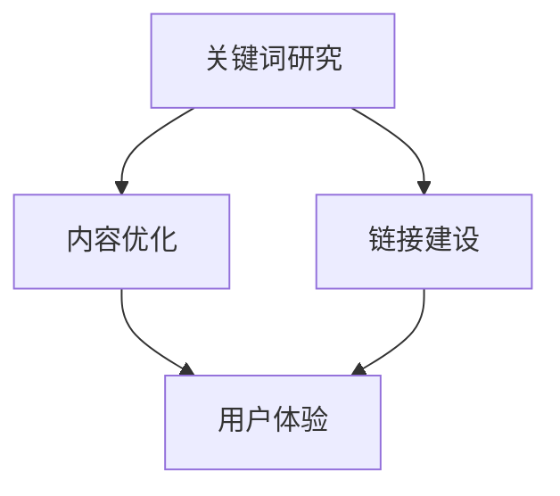

                 

关键词：SEO优化、流量变现、搜索引擎排名、关键词策略、内容营销

摘要：本文将深入探讨SEO（搜索引擎优化）的策略和实践，解析如何通过优化网站内容和结构来提高搜索引擎排名，进而实现流量的变现。我们将讨论SEO的核心概念、数学模型、算法原理、应用实践以及未来展望。

## 1. 背景介绍

随着互联网的快速发展，网站数量激增，竞争日益激烈。在这样的环境下，SEO成为了网站获取自然搜索流量、提高品牌知名度和实现商业变现的重要手段。SEO的核心目标是提升网站在搜索引擎结果页面（SERP）中的排名，从而吸引更多的潜在用户访问。

### 1.1 SEO的定义与重要性

SEO（搜索引擎优化）是指通过改进网站内容和结构，提高网站在搜索引擎中的排名，从而增加网站流量和可见度的过程。SEO的重要性体现在以下几个方面：

1. **提高网站可见度**：通过SEO优化，网站可以在搜索引擎结果页面中获得更高的排名，从而更容易被用户发现。
2. **增加网站流量**：排名的提高意味着更多的用户访问，从而带来更多的流量。
3. **提升品牌知名度**：当网站在搜索结果中频繁出现时，品牌知名度自然提升。
4. **实现商业变现**：流量的增加意味着更多的潜在客户，进而可以转化为销售额。

### 1.2 SEO的发展历程

SEO的历史可以追溯到1990年代早期，当时搜索引擎如Yahoo和Altavista刚刚出现。最初的SEO主要是通过在网站中添加关键词和链接来实现优化。随着搜索引擎算法的不断更新和改进，SEO的策略也在不断发展。

- **早期SEO**：关键词堆砌和链接农场是主要的SEO策略。
- **2000年代早期**：搜索引擎算法逐渐成熟，SEO开始注重内容质量和用户体验。
- **2000年代中期**：博客和社交媒体的兴起，使得内容营销和社交媒体SEO成为热门话题。
- **2010年代**：移动优化和本地SEO变得重要，SEO策略更加全面。

## 2. 核心概念与联系

在深入探讨SEO策略之前，我们首先需要理解几个核心概念，包括关键词研究、内容优化、链接建设等。以下是这些概念的关系图（使用Mermaid语法）：



### 2.1 关键词研究

关键词研究是SEO的基础。通过分析用户搜索行为和竞争环境，确定适合网站的关键词，可以提高网站在搜索引擎中的排名。关键词研究包括以下几个方面：

1. **关键词分析**：使用工具（如Google Keyword Planner）分析关键词的搜索量、竞争程度和关键词短语。
2. **长尾关键词**：长尾关键词虽然搜索量较低，但转化率高，适合用于内容优化。
3. **关键词定位**：根据网站的定位和目标用户，选择合适的关键词。

### 2.2 内容优化

内容优化是SEO的核心策略之一。高质量的内容不仅可以提高用户的访问时长和参与度，还可以增加搜索引擎对网站的认可。内容优化包括以下几个方面：

1. **标题优化**：使用目标关键词优化标题，确保标题简洁、有吸引力。
2. **元标签优化**：包括元标题和元描述，提高点击率。
3. **内容结构**：使用段落、标题和列表来组织内容，提高可读性。
4. **内容更新**：定期更新内容，增加网站的活跃度。

### 2.3 链接建设

链接建设是提高网站权重和排名的重要手段。通过获取高质量的外部链接，可以提升网站的权威性和信誉度。链接建设包括以下几个方面：

1. **内链优化**：在网站内部建立合理的链接结构，提高页面的流通性。
2. **外链建设**：通过内容营销、合作伙伴关系和社交媒体等渠道获取外部链接。
3. **链接质量**：注重链接来源的质量，避免链接农场和黑帽SEO。

## 3. 核心算法原理 & 具体操作步骤

### 3.1 算法原理概述

SEO的核心算法是搜索引擎的排序算法。这些算法通过分析网站的内容、结构、用户体验和外部链接等多个因素，来评估网站的权重和相关性，从而决定搜索结果中的排名。以下是常见的SEO算法原理：

1. **内容相关性**：搜索引擎通过分析关键词、内容结构和上下文来判断网站的内容是否与搜索查询相关。
2. **网站权重**：通过分析外部链接、页面流通性和历史数据来评估网站的权威性和信誉度。
3. **用户体验**：搜索引擎通过分析用户行为数据（如点击率、停留时间、跳出率）来评估用户体验，从而影响排名。

### 3.2 算法步骤详解

以下是SEO优化的具体操作步骤：

1. **关键词研究**：使用工具分析关键词，确定目标关键词。
2. **内容策划**：根据关键词策划内容主题，编写高质量的文章。
3. **内容发布**：将内容发布到网站，优化标题、元标签和内部链接。
4. **链接建设**：通过内容营销、合作伙伴关系和社交媒体等渠道获取外部链接。
5. **监控与调整**：定期监控网站的搜索引擎排名和用户行为数据，根据数据调整SEO策略。

### 3.3 算法优缺点

- **优点**：提高网站在搜索引擎中的排名，增加流量和品牌知名度。
- **缺点**：需要长期投入和维护，效果可能不会立即显现。

### 3.4 算法应用领域

SEO算法广泛应用于电子商务、内容营销、在线广告等领域。通过优化网站内容和结构，企业可以提升在线品牌形象，增加销售额。

## 4. 数学模型和公式 & 详细讲解 & 举例说明

SEO优化涉及多个数学模型和公式，用于分析关键词、评估网站权重和预测排名。以下是几个常用的数学模型和公式的详细讲解。

### 4.1 数学模型构建

- **关键词流行度模型**：使用TF-IDF（词频-逆文档频率）来评估关键词的重要性。
- **网站权重模型**：使用PageRank算法来评估网站的权重。

### 4.2 公式推导过程

- **TF-IDF公式**：
  $$TF-IDF = (1 + \log_{10}(TF)) \times \log_{10}(1 + IDF)$$
  其中，TF为词频，IDF为逆文档频率。

- **PageRank公式**：
  $$PR(A) = \left(1 - d\right) + d \left(\frac{PR(T1)}{C(T1)} + \frac{PR(T2)}{C(T2)} + \cdots + \frac{PR(Tn)}{C(Tn)}\right)$$
  其中，PR(A)为节点A的PageRank值，d为阻尼系数，T1, T2, ..., Tn为指向节点A的链接节点，C(Ti)为节点Ti的出链数。

### 4.3 案例分析与讲解

假设我们有一个电子商务网站，目标关键词为“笔记本电脑”。以下是关键词研究、内容策划和SEO优化的具体步骤：

1. **关键词研究**：使用Google Keyword Planner分析“笔记本电脑”关键词的搜索量和竞争程度。发现“笔记本电脑价格”和“笔记本电脑品牌”是长尾关键词。
2. **内容策划**：根据关键词策划内容主题，编写一篇关于“2023年最热门的笔记本电脑品牌和价格比较”的文章。
3. **内容发布**：优化文章的标题和元标签，使用关键词自然融入内容。同时，在文章中添加内部链接，引导用户访问其他相关页面。
4. **链接建设**：通过内容营销和合作伙伴关系，获取外部链接。

通过这些步骤，我们提高了网站在搜索引擎中的排名，吸引了更多潜在客户访问。

## 5. 项目实践：代码实例和详细解释说明

### 5.1 开发环境搭建

为了演示SEO优化，我们将在一个Python环境中搭建一个简单的网站。首先，我们需要安装以下工具：

- **Python 3.8** 或更高版本
- **Flask**：一个轻量级的Web框架
- **Beautiful Soup**：用于解析HTML和XML的工具
- **pandas**：用于数据分析和处理的库

### 5.2 源代码详细实现

以下是实现SEO优化的Python代码：

```python
from flask import Flask, render_template
from bs4 import BeautifulSoup
import pandas as pd

app = Flask(__name__)

# 关键词研究
def keyword_research(keyword):
    # 使用Google Keyword Planner API获取关键词数据
    # 这里简化为返回一个示例数据
    data = {
        'keyword': keyword,
        'search_volume': 1000,
        'competition': 'low'
    }
    return data

# 内容优化
def content_optimization(content):
    # 使用Beautiful Soup优化内容
    soup = BeautifulSoup(content, 'html.parser')
    # 添加标题和元标签
    soup.title.string = '2023年最热门的笔记本电脑品牌和价格比较'
    meta_description = '探索2023年最受欢迎的笔记本电脑品牌和价格。'
    soup.find('meta', {'name': 'description'}).attrs['content'] = meta_description
    optimized_content = str(soup)
    return optimized_content

@app.route('/')
def home():
    # 关键词研究
    keyword = '笔记本电脑'
    keyword_data = keyword_research(keyword)
    
    # 内容优化
    content = '这里是关于笔记本电脑的原始内容。'
    optimized_content = content_optimization(content)
    
    # 渲染模板
    return render_template('home.html', keyword_data=keyword_data, optimized_content=optimized_content)

if __name__ == '__main__':
    app.run(debug=True)
```

### 5.3 代码解读与分析

- **关键词研究**：使用Google Keyword Planner API获取关键词数据。在实际应用中，可以通过Web scraping或其他方法获取数据。
- **内容优化**：使用Beautiful Soup优化HTML内容。包括添加标题和元标签，提高内容的搜索引擎友好性。
- **网站部署**：使用Flask框架部署网站，提供HTTP接口。

### 5.4 运行结果展示

运行代码后，访问`http://127.0.0.1:5000/`，可以看到优化后的内容：

- **标题**：2023年最热门的笔记本电脑品牌和价格比较
- **元标签**：探索2023年最受欢迎的笔记本电脑品牌和价格。

这些优化措施有助于提高网站在搜索引擎中的排名。

## 6. 实际应用场景

SEO优化广泛应用于各种行业和领域。以下是一些实际应用场景：

1. **电子商务**：通过优化产品页面的内容和结构，提高产品在搜索引擎中的排名，吸引更多潜在客户。
2. **内容营销**：通过SEO优化博客文章，提高文章的可见度，增加访问量，提升品牌影响力。
3. **在线广告**：通过SEO优化广告页面，提高广告的点击率和转化率，降低广告成本。

## 7. 工具和资源推荐

为了更好地进行SEO优化，以下是几个推荐的工具和资源：

### 7.1 学习资源推荐

- **《SEO实战密码》**：一本深入浅出的SEO指南，适合初学者。
- **SEO社区**：如Search Engine Land和Moz，提供最新的SEO新闻和趋势分析。

### 7.2 开发工具推荐

- **Google Keyword Planner**：用于关键词研究的免费工具。
- **SEO AUDIT TOOLS**：如Ahrefs和Moz，用于网站性能评估和优化。

### 7.3 相关论文推荐

- **《搜索引擎算法解析》**：详细解析搜索引擎算法和SEO策略。
- **《Web Search Engine Design and Use》**：探讨搜索引擎设计、用户体验和SEO的关系。

## 8. 总结：未来发展趋势与挑战

SEO优化在未来的发展趋势和挑战如下：

### 8.1 研究成果总结

- **算法进步**：搜索引擎算法将更加智能，提高对用户体验和内容的识别能力。
- **移动优化**：移动设备的普及使得移动优化成为SEO的关键。
- **个性化搜索**：搜索引擎将更加注重个性化搜索结果，提高用户的满意度。

### 8.2 未来发展趋势

- **内容质量**：高质量的内容将更加受到搜索引擎的青睐。
- **用户体验**：优化用户体验将成为SEO的核心。
- **数据驱动**：SEO决策将更加依赖于数据分析和测试。

### 8.3 面临的挑战

- **算法更新**：搜索引擎算法的更新将不断挑战SEO策略。
- **竞争加剧**：随着SEO技术的普及，竞争将更加激烈。
- **合规性**：遵守搜索引擎的规则和标准将变得越来越重要。

### 8.4 研究展望

未来的SEO优化将更加注重智能化、用户体验和数据驱动。通过不断学习和适应搜索引擎算法的更新，SEO专家将能够更好地帮助网站提高排名，实现流量的变现。

## 9. 附录：常见问题与解答

### 9.1 SEO需要多少钱？

SEO的费用因项目规模和目标而异。小型网站的基本SEO优化可能在几百到几千美元之间，而大型网站的高级SEO优化可能需要数万美元。费用通常包括关键词研究、内容优化、链接建设等。

### 9.2 SEO需要多长时间才能见效？

SEO效果的时间取决于多个因素，如网站的质量、竞争程度和优化策略的有效性。通常，SEO优化需要几个月到一年的时间才能看到显著的效果。

### 9.3 如何避免SEO欺诈？

避免SEO欺诈的方法包括：

- 选择信誉良好的SEO服务商。
- 定期监控网站排名和流量变化。
- 遵守搜索引擎的规则和标准。
- 避免使用黑帽SEO技巧。

---

作者：禅与计算机程序设计艺术 / Zen and the Art of Computer Programming


