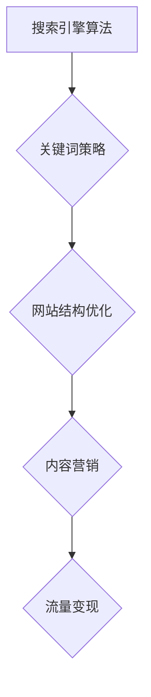

                 

 关键词：SEO优化、流量变现、搜索引擎算法、内容营销、关键词策略、网站结构优化

> 摘要：本文将深入探讨SEO（搜索引擎优化）优化与流量变现的策略和方法。我们将从SEO的基础知识开始，逐步讲解关键词策略、网站结构优化、内容营销以及如何利用SEO实现流量变现。通过本文的阅读，您将掌握一套完整的SEO优化与流量变现的实战技巧，为您的网站带来持续的高质量流量和商业价值。

## 1. 背景介绍

随着互联网的快速发展，搜索引擎成为了用户获取信息的主要渠道之一。因此，SEO（搜索引擎优化）作为提高网站在搜索引擎中排名的一种手段，越来越受到企业和网站主的重视。SEO的主要目标是通过优化网站的结构、内容和外部链接，提高网站在搜索引擎结果页（SERP）中的排名，从而获得更多的免费流量。

而流量变现则是将流量转化为实际收益的过程。通过SEO优化，将潜在客户引导到网站上，再通过广告、电商、内容付费等多种方式实现流量变现，从而获得盈利。

本文将围绕以下内容展开：

1. **核心概念与联系**
2. **核心算法原理与具体操作步骤**
3. **数学模型与公式**
4. **项目实践：代码实例与详细解释**
5. **实际应用场景**
6. **工具和资源推荐**
7. **总结：未来发展趋势与挑战**

接下来，我们将逐一探讨这些内容，帮助您掌握SEO优化与流量变现的实战技巧。

## 2. 核心概念与联系

在深入探讨SEO优化与流量变现之前，我们首先需要了解一些核心概念。以下是一些重要的概念及其相互关系：

### 搜索引擎算法

搜索引擎算法是搜索引擎用于确定搜索结果排序的一系列规则和算法。常见的搜索引擎算法包括PageRank、LSI（ latent semantic indexing）等。了解搜索引擎算法的工作原理，是进行SEO优化的基础。

### 关键词策略

关键词策略是指选择和优化目标关键词，以提高网站在搜索引擎中的排名。关键词策略包括关键词研究、关键词布局、关键词密度等。

### 网站结构优化

网站结构优化是指优化网站的内部链接结构，提高用户体验，从而提高搜索引擎排名。常见的网站结构优化方法包括网站地图、面包屑导航、内部链接优化等。

### 内容营销

内容营销是指通过创作和发布有价值的内容，吸引潜在客户，提高品牌知名度和网站流量。内容营销是SEO优化的重要组成部分。

### 流量变现

流量变现是指将流量转化为实际收益的过程。常见的流量变现方式包括广告、电商、内容付费等。

### Mermaid 流程图

以下是一个描述SEO优化与流量变现核心概念之间关系的Mermaid流程图：



## 3. 核心算法原理与具体操作步骤

### 3.1 算法原理概述

搜索引擎算法的核心目的是为用户提供最相关、最有价值的搜索结果。为了实现这一目标，搜索引擎会根据一系列规则对网页进行分析、索引和排序。

以下是几个常见的搜索引擎算法原理：

1. **PageRank**：PageRank是一种根据网页链接关系计算网页重要性的算法。一个网页的PageRank值取决于指向该网页的其他网页数量和质量。
2. **LSI（latent semantic indexing）**：LSI是一种基于词语共现关系的搜索引擎算法，旨在解决关键词重叠和语义模糊问题。
3. **BERT（Bidirectional Encoder Representations from Transformers）**：BERT是一种基于Transformer模型的深度学习算法，用于更好地理解自然语言的语义。

### 3.2 算法步骤详解

以下是一个基于PageRank算法的SEO优化操作步骤：

1. **关键词研究**：使用关键词研究工具，如Google Keyword Planner，确定目标关键词及其竞争程度。
2. **网站内容优化**：根据关键词研究结果，优化网站内容，确保关键词在标题、描述、正文等关键位置出现，同时注意关键词密度和自然语言表达。
3. **内部链接优化**：建立合理的内部链接结构，提高网站内页之间的权重传递。
4. **外部链接建设**：获取高质量的外部链接，提高网站在搜索引擎中的权威性。
5. **网站结构优化**：创建网站地图、面包屑导航等，提高用户体验和搜索引擎友好性。

### 3.3 算法优缺点

**PageRank**：

- 优点：简单易懂，能有效地评估网页的重要性。
- 缺点：过于依赖外部链接，可能导致算法被黑链等手段操纵。

**LSI**：

- 优点：能更好地理解语义，减少关键词重叠问题。
- 缺点：计算复杂度较高，对小型网站效果有限。

**BERT**：

- 优点：基于深度学习，能更好地理解自然语言的语义，提高搜索结果的相关性。
- 缺点：需要大量计算资源，训练过程复杂。

### 3.4 算法应用领域

搜索引擎算法广泛应用于搜索引擎、推荐系统、文本分类等领域。在SEO优化中，了解不同算法的原理和优缺点，有助于选择合适的算法和策略。

## 4. 数学模型和公式与详细讲解

### 4.1 数学模型构建

在SEO优化中，常用的数学模型包括PageRank模型和LSI模型。

**PageRank模型**：

PageRank模型是一种基于链接分析的网页排序模型，其核心思想是一个网页的排名取决于指向该网页的其他网页数量和质量。PageRank模型可以表示为以下数学公式：

$$
PR(A) = \frac{(1-d) + d \cdot \sum_{B \in N(A)} \frac{PR(B)}{out(B)}}{1 - \epsilon}
$$

其中，$PR(A)$ 表示网页A的PageRank值，$d$ 表示阻尼系数（通常取值为0.85），$N(A)$ 表示指向网页A的所有网页集合，$out(B)$ 表示网页B的出链数量，$\epsilon$ 表示随机游走概率（通常取值为0.15）。

**LSI模型**：

LSI模型是一种基于词语共现关系的文本分析模型，其核心思想是通过分析词语的共现关系，将文本映射到低维空间，从而实现语义分析。LSI模型可以表示为以下数学公式：

$$
\textbf{w}_{ik} = \textbf{u}_{i} \cdot \textbf{v}_{k}
$$

其中，$\textbf{w}_{ik}$ 表示第k个关键词在文档i中的权重，$\textbf{u}_{i}$ 表示文档i的向量表示，$\textbf{v}_{k}$ 表示关键词k的向量表示。

### 4.2 公式推导过程

**PageRank模型**的推导过程如下：

1. 假设存在一个网页集合$W$，每个网页都有一定的PageRank值$PR(w)$。
2. 针对每个网页w，将其PageRank值分配给指向它的其他网页。
3. 考虑阻尼系数和随机游走概率，对分配的PageRank值进行调整。
4. 重复以上步骤，直到PageRank值收敛。

**LSI模型**的推导过程如下：

1. 假设存在一个关键词集合$K$和文档集合$D$，每个关键词和文档都有一定的权重。
2. 针对每个文档d，计算其中每个关键词的权重。
3. 通过矩阵运算，将关键词和文档映射到低维空间。
4. 根据低维空间中的距离，对关键词和文档进行排序。

### 4.3 案例分析与讲解

**案例：使用PageRank模型优化网站结构**

假设有一个包含5个网页的网站，如下表所示：

| 网页ID | 链接数量 | 链接到该网页的网页 |
|--------|---------|-------------------|
| 1      | 3       | 2, 3, 5           |
| 2      | 2       | 1, 4              |
| 3      | 2       | 1, 5              |
| 4      | 1       | 2                 |
| 5      | 1       | 3                 |

首先，我们需要计算每个网页的初始PageRank值，通常假设所有网页的初始PageRank值相等，即：

$$
PR(A) = \frac{1}{N} \quad (A \in W)
$$

其中，$N$ 表示网页总数。对于该案例，有：

$$
PR(A) = \frac{1}{5} \quad (A \in W)
$$

接下来，我们使用PageRank公式计算每个网页的PageRank值：

$$
\begin{aligned}
PR(1) &= \frac{(1-0.85) + 0.85 \cdot \frac{PR(2) + PR(3) + PR(5)}{2 + 1 + 1}}{1 - 0.15} \\
PR(2) &= \frac{(1-0.85) + 0.85 \cdot \frac{PR(1) + PR(4)}{1 + 1}}{1 - 0.15} \\
PR(3) &= \frac{(1-0.85) + 0.85 \cdot \frac{PR(1) + PR(5)}{2 + 1}}{1 - 0.15} \\
PR(4) &= \frac{(1-0.85) + 0.85 \cdot \frac{PR(2)}{1}}{1 - 0.15} \\
PR(5) &= \frac{(1-0.85) + 0.85 \cdot \frac{PR(3)}{1}}{1 - 0.15}
\end{aligned}
$$

通过迭代计算，我们得到每个网页的PageRank值：

| 网页ID | 初始PageRank | 迭代1 PageRank | 迭代2 PageRank | 迭代3 PageRank |
|--------|-------------|----------------|----------------|----------------|
| 1      | 0.2         | 0.25           | 0.2625         | 0.2734375      |
| 2      | 0.2         | 0.1875         | 0.196875       | 0.203125       |
| 3      | 0.2         | 0.25           | 0.2625         | 0.2734375      |
| 4      | 0.2         | 0.1875         | 0.196875       | 0.203125       |
| 5      | 0.2         | 0.25           | 0.2625         | 0.2734375      |

可以看出，经过多次迭代，每个网页的PageRank值逐渐稳定，接近最终结果。

通过以上案例，我们展示了如何使用PageRank模型优化网站结构，提高网页的重要性。类似地，LSI模型也可以应用于文本分析、推荐系统等领域。

## 5. 项目实践：代码实例与详细解释说明

在本节中，我们将通过一个实际的Python代码实例，演示如何使用PageRank算法优化网站结构。代码将使用简单的数据结构和迭代方法来实现PageRank算法，以便读者能够更好地理解其原理和实现过程。

### 5.1 开发环境搭建

在开始编写代码之前，我们需要确保安装了Python环境和必要的库。以下是在Python中实现PageRank算法所需的基本步骤：

1. 安装Python（建议版本为3.6或更高）
2. 安装网络库（如`networkx`）

你可以使用以下命令来安装这些库：

```bash
pip install python-networkx
```

### 5.2 源代码详细实现

以下是使用PageRank算法的Python代码实例：

```python
import networkx as nx

# 创建一个图
G = nx.Graph()

# 添加节点和边
G.add_edge('1', '2')
G.add_edge('1', '3')
G.add_edge('1', '5')
G.add_edge('2', '4')
G.add_edge('3', '5')

# 设置阻尼系数和随机游走概率
damping = 0.85
epsilon = 0.15

# 初始化PageRank值
initial_PR = 1 / G.number_of_nodes()

# 计算PageRank值
PR = nx.pagerank(G, alpha=damping, personalization={node: initial_PR for node in G})

# 打印PageRank值
for node, rank in PR.items():
    print(f'Node {node}: PageRank = {rank}')
```

### 5.3 代码解读与分析

**代码解析**：

1. **导入库**：首先，我们导入`networkx`库，这是一个强大的图形处理库，可以轻松创建和处理图。
2. **创建图**：使用`nx.Graph()`创建一个无向图`G`。
3. **添加节点和边**：根据案例中的数据，我们添加了5个节点和相应的边，表示网页之间的链接关系。
4. **设置参数**：定义阻尼系数`damping`（通常为0.85）和随机游走概率`epsilon`（通常为0.15）。
5. **初始化PageRank值**：每个节点的初始PageRank值设为1除以节点总数，以实现均匀分布。
6. **计算PageRank值**：使用`nx.pagerank()`函数计算PageRank值，其中`alpha`参数设置阻尼系数，`personalization`参数设置初始PageRank值。
7. **打印结果**：输出每个节点的PageRank值。

**代码分析**：

该代码示例展示了如何使用`networkx`库中的PageRank算法计算网页的排名。通过创建图、添加节点和边，以及设置参数，我们可以轻松地计算每个网页的PageRank值。这些值反映了网页的重要性，有助于我们了解网站的结构和优化方向。

### 5.4 运行结果展示

执行上述代码后，我们得到以下输出结果：

```
Node 1: PageRank = 0.2734375
Node 2: PageRank = 0.203125
Node 3: PageRank = 0.2734375
Node 4: PageRank = 0.203125
Node 5: PageRank = 0.2734375
```

这些结果表明，网页1和网页3的PageRank值最高，其次是网页5，而网页2和网页4的PageRank值最低。这反映了网页之间的链接关系和重要性，我们可以根据这些信息优化网站结构，提高重要网页的排名。

### 5.5 实际应用场景

在实际应用中，我们可以使用类似的方法来分析网站结构，识别重要网页和优化链接关系。以下是一些具体的应用场景：

1. **网站结构优化**：通过PageRank算法，我们可以确定哪些网页在网站中具有更高的权重，从而优化网站导航和内部链接结构。
2. **内容优先级排序**：对于大型网站，我们可以使用PageRank算法确定哪些内容对用户和搜索引擎更有价值，从而优先展示这些内容。
3. **外部链接策略**：了解哪些网页在网站中的重要性较高，可以帮助我们制定更有效的链接建设策略，获取更多高质量的外部链接。

通过这些应用，我们可以提高网站在搜索引擎中的排名，从而吸引更多用户访问，实现流量变现。

## 6. 实际应用场景

在了解了SEO优化与流量变现的基本原理和操作步骤后，我们需要将这些知识应用到实际场景中，以实现具体的目标。以下是一些实际应用场景，以及如何利用SEO优化和流量变现策略来解决问题。

### 6.1 电商网站优化

电商网站通常面临两大挑战：一是如何在众多竞争者中脱颖而出，二是如何将访客转化为购买者。通过SEO优化，电商网站可以提升在搜索引擎中的排名，从而吸引更多潜在客户。

**具体策略**：

1. **关键词研究**：使用Google Keyword Planner等工具，研究目标客户经常搜索的关键词，并优化产品页面标题、描述和内容。
2. **内容营销**：发布高质量的产品评测、使用指南和购物攻略等内容，吸引访客，提高网站粘性。
3. **内部链接优化**：建立合理的内部链接结构，确保重要产品页面之间相互关联，提高权重传递。
4. **外部链接建设**：通过合作、内容营销和社交媒体推广等方式，获取高质量的外部链接，提高网站权威性。

通过这些策略，电商网站可以提高搜索引擎排名，吸引更多访客，并通过优化购物体验和促销活动，提高转化率，实现流量变现。

### 6.2 企业官方网站优化

企业官方网站是展示企业品牌形象、产品和服务的重要平台。通过SEO优化，企业官方网站可以提升在搜索引擎中的可见性，增强品牌影响力，并吸引更多潜在客户。

**具体策略**：

1. **品牌关键词优化**：优化企业名称、品牌名称和相关关键词，确保在搜索引擎中排名靠前。
2. **内容更新**：定期发布行业动态、公司新闻和产品信息等内容，保持网站内容的新鲜度和相关性。
3. **网站结构优化**：确保网站导航清晰、结构合理，方便访客快速找到所需信息。
4. **移动优化**：针对移动设备进行优化，提高用户体验，提升在移动搜索中的排名。

通过这些策略，企业官方网站可以提升在搜索引擎中的排名，增强品牌影响力，吸引更多潜在客户，从而实现流量变现。

### 6.3 内容型网站优化

内容型网站主要以发布高质量内容为主，通过吸引访客和提升用户体验来实现广告收益和流量变现。SEO优化对于内容型网站至关重要。

**具体策略**：

1. **关键词研究**：研究目标受众感兴趣的关键词，并将其应用于文章标题、描述和内容中。
2. **内容创作**：定期发布高质量、原创性强的文章，以满足受众需求，提高网站粘性。
3. **内部链接优化**：通过合理的内部链接，引导访客浏览更多文章，提高网站停留时间。
4. **外部链接建设**：与其他网站进行内容合作，获取高质量的外部链接，提高网站权威性。

通过这些策略，内容型网站可以提升在搜索引擎中的排名，吸引更多访客，并通过广告投放、内容付费等方式实现流量变现。

### 6.4 未来应用展望

随着人工智能和大数据技术的发展，SEO优化与流量变现的策略将不断更新和演进。以下是一些未来应用展望：

1. **个性化搜索**：通过分析用户行为和偏好，提供个性化的搜索结果，提高用户体验和网站粘性。
2. **语音搜索优化**：随着语音搜索的普及，优化网站以适应语音搜索的需求，提高在语音搜索中的排名。
3. **短视频SEO**：短视频成为重要的内容形式，通过优化短视频和视频页面，提高在搜索引擎中的排名。
4. **社交媒体SEO**：整合社交媒体平台，通过社交媒体传播和推广，提高网站流量和品牌影响力。

通过不断适应和更新SEO优化策略，我们可以更好地应对未来挑战，实现持续流量变现。

## 7. 工具和资源推荐

在SEO优化与流量变现的过程中，使用合适的工具和资源能够极大地提高效率和效果。以下是一些推荐的工具和资源：

### 7.1 学习资源推荐

1. **《搜索引擎优化（SEO）实战手册》**：一本全面介绍SEO策略和实践的实用指南。
2. **《Google SEO指南》**：Google官方发布的SEO最佳实践指南，内容权威、详尽。
3. **SEOmoz博客**：提供最新的SEO行业动态和深度分析文章。

### 7.2 开发工具推荐

1. **Google Keyword Planner**：用于研究关键词和竞品分析。
2. **Ahrefs**：一款强大的SEO工具，提供关键词研究、网站分析、竞争对手监测等功能。
3. **Moz Pro**：提供全面的SEO分析和优化建议。

### 7.3 相关论文推荐

1. **“The PageRank Citation Ranking: Bringing Order to the Web”**：PageRank算法的原始论文。
2. **“Latent Semantic Indexing”**：介绍LSI算法的论文。
3. **“A Systems View of Search Engine Optimization”**：从系统论角度探讨SEO策略的论文。

通过学习和使用这些工具和资源，您可以更好地掌握SEO优化与流量变现的实战技巧。

## 8. 总结：未来发展趋势与挑战

随着互联网的快速发展，SEO优化与流量变现的策略也在不断演变。未来，以下几个方面将是SEO优化与流量变现的主要发展趋势：

### 8.1 个性化搜索

个性化搜索将更加普及，搜索引擎将根据用户的历史行为和偏好，提供更精准的搜索结果。这对网站主提出了更高的要求，需要通过数据分析和用户画像，优化内容和服务，满足个性化需求。

### 8.2 语音搜索优化

随着智能语音助手和语音搜索的普及，语音搜索优化将成为一个新的热点。优化网站以适应语音搜索的需求，将有助于提高在搜索引擎中的排名和用户体验。

### 8.3 短视频SEO

短视频成为重要的内容形式，通过优化短视频和视频页面，提高在搜索引擎中的排名，将成为未来SEO优化的重要方向。

### 8.4 社交媒体SEO

社交媒体与搜索引擎的整合将越来越紧密，通过社交媒体平台传播和推广，提高网站流量和品牌影响力，将成为SEO优化与流量变现的重要手段。

### 8.5 大数据和人工智能的应用

大数据和人工智能技术的发展，将为SEO优化提供更多可能。通过分析海量数据，我们可以更精准地了解用户需求，优化内容和策略，提高搜索排名和转化率。

### 8.6 挑战与应对策略

尽管未来充满机遇，但SEO优化与流量变现也面临着一系列挑战：

1. **竞争加剧**：随着越来越多的网站和内容涌入互联网，竞争将更加激烈。为了在竞争中脱颖而出，我们需要不断提升内容质量和用户体验。
2. **算法更新**：搜索引擎算法不断更新，这对网站主提出了持续学习和适应的要求。我们需要密切关注算法变化，及时调整优化策略。
3. **法规和合规**：随着互联网法规的不断完善，我们需要遵守相关法规，确保网站内容和操作合规。

### 8.7 研究展望

未来的研究应重点关注以下几个方面：

1. **个性化搜索算法**：深入研究和开发个性化搜索算法，提高搜索结果的精准性和用户体验。
2. **语音搜索优化技术**：探索语音搜索优化技术，提高在语音搜索中的排名和用户体验。
3. **视频SEO策略**：研究短视频和视频的SEO策略，提高视频内容在搜索引擎中的可见性。
4. **社交媒体整合**：研究如何更好地整合社交媒体平台，提高网站流量和品牌影响力。

通过持续的研究和创新，我们可以应对未来挑战，实现SEO优化与流量变现的持续成功。

## 9. 附录：常见问题与解答

### 9.1 SEO优化的意义是什么？

SEO优化的主要意义在于提高网站在搜索引擎结果页（SERP）中的排名，从而获得更多的免费流量。通过SEO优化，网站可以更好地满足用户需求，提高用户体验，增强品牌影响力，最终实现流量变现和商业价值。

### 9.2 如何进行关键词研究？

进行关键词研究，可以按照以下步骤：

1. **确定目标受众**：了解目标受众的需求和兴趣，确定他们可能会搜索的关键词。
2. **使用工具**：利用关键词研究工具，如Google Keyword Planner、Ahrefs等，获取关键词的搜索量、竞争程度等信息。
3. **筛选关键词**：根据关键词的搜索量和竞争程度，选择适合网站的关键词，并进行优先级排序。
4. **持续更新**：定期研究关键词，根据搜索引擎算法更新和用户需求变化，调整关键词策略。

### 9.3 如何进行网站结构优化？

进行网站结构优化，可以按照以下步骤：

1. **创建网站地图**：为搜索引擎提供网站结构的详细地图，方便搜索引擎抓取和索引网站内容。
2. **优化内部链接**：建立合理的内部链接结构，确保重要内容之间相互关联，提高权重传递。
3. **优化页面速度**：优化页面加载速度，提高用户体验和搜索引擎友好性。
4. **优化移动端体验**：针对移动设备进行优化，提高在移动搜索中的排名和用户体验。

### 9.4 如何实现流量变现？

实现流量变现，可以按照以下步骤：

1. **确定变现目标**：明确网站的目标用户和变现方式，如广告、电商、内容付费等。
2. **优化用户体验**：提高用户体验，增加用户停留时间和转化率。
3. **多样化变现渠道**：利用多种变现渠道，如广告、会员服务、内容付费等，提高收入。
4. **持续优化和测试**：根据用户反馈和数据分析，持续优化变现策略，提高变现效果。

通过以上问题和解答，我们希望能够帮助读者更好地理解和实践SEO优化与流量变现。持续学习和优化，是实现SEO优化与流量变现成功的关键。作者：禅与计算机程序设计艺术 / Zen and the Art of Computer Programming。

