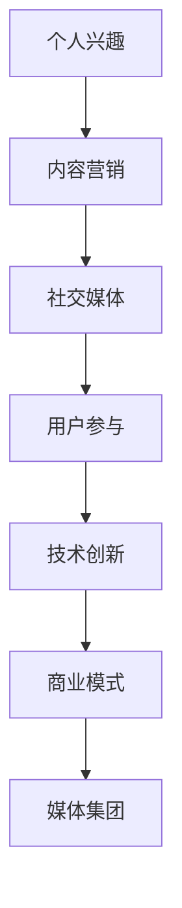

                 

关键词：技术博客，个人兴趣，媒体集团，演变，成功策略，社交媒体，内容营销，技术创新。

> 摘要：本文将探讨技术博客如何从一个简单的个人兴趣项目，逐步发展成为具有全球影响力的媒体集团。通过分析成功的技术博客案例，本文将分享从个人兴趣到媒体集团的演变过程，以及在此过程中需要注意的策略和挑战。

## 1. 背景介绍

在互联网时代，技术博客成为了知识传播、技术交流的重要平台。随着社交媒体的兴起，技术博客的影响力也在不断扩大。许多个人博客作者通过持续分享技术知识、案例和实践，逐渐积累了庞大的读者群体，最终将博客发展成为具有商业价值的媒体集团。

技术博客的发展历程可以分为以下几个阶段：

1. **个人兴趣阶段**：博客作者基于个人兴趣和专业知识，开始撰写技术文章，分享经验。
2. **内容积累阶段**：博客作者持续创作高质量的内容，逐渐积累读者群体和影响力。
3. **品牌塑造阶段**：博客作者通过专业的编辑团队、独特的写作风格和高质量的内容，建立自己的品牌形象。
4. **媒体集团阶段**：博客作者通过不断拓展业务，形成多元化的媒体产品线，实现商业模式的创新和扩张。

本文将重点探讨从个人兴趣到媒体集团的演变过程，分析成功的技术博客案例，以及在此过程中需要注意的策略和挑战。

## 2. 核心概念与联系

为了更好地理解技术博客的演变过程，我们需要了解以下几个核心概念：

1. **内容营销**：通过创建和分享有价值的内容，吸引潜在客户，建立品牌知名度和忠诚度。
2. **社交媒体**：用于社交互动的平台，如Twitter、Facebook、LinkedIn等，可以帮助博客作者扩大影响力。
3. **技术创新**：博客作者需要不断学习新技术，以便提供更具吸引力和实用性的内容。
4. **用户参与**：鼓励读者参与讨论、提出问题和建议，可以增强读者的粘性，提高博客的影响力。
5. **商业模式**：博客作者需要找到合适的商业模式，实现商业变现，为持续发展提供资金支持。

### Mermaid 流程图：



## 3. 核心算法原理 & 具体操作步骤

### 3.1 算法原理概述

技术博客的成功离不开以下几个核心算法原理：

1. **内容创作算法**：基于用户兴趣和阅读历史，自动推荐相关内容。
2. **用户行为分析算法**：通过分析用户的阅读行为，了解用户需求，优化内容创作。
3. **社交媒体传播算法**：基于社交网络的特点，自动推送优质内容，扩大影响力。
4. **商业模式优化算法**：根据市场变化和用户需求，调整商业模式，实现持续发展。

### 3.2 算法步骤详解

1. **内容创作算法**：

   - 数据采集：收集用户的兴趣标签、阅读历史等数据。
   - 内容推荐：使用协同过滤、基于内容的推荐算法，推荐相关内容。

2. **用户行为分析算法**：

   - 数据预处理：对用户行为数据（如点击、评论、分享等）进行清洗和预处理。
   - 特征提取：提取用户行为特征，如活跃度、兴趣偏好等。
   - 模型训练：使用机器学习算法（如决策树、随机森林、神经网络等）训练用户行为分析模型。
   - 预测与优化：根据模型预测结果，优化内容创作和推送策略。

3. **社交媒体传播算法**：

   - 数据采集：收集社交媒体平台的相关数据（如转发、评论、点赞等）。
   - 传播策略：根据数据分析和用户行为，制定合适的传播策略。
   - 自动推送：使用自动化工具，根据策略自动推送优质内容。

4. **商业模式优化算法**：

   - 数据采集：收集用户反馈、市场变化等数据。
   - 模型训练：使用机器学习算法，建立商业模式优化模型。
   - 预测与调整：根据模型预测结果，调整商业模式，实现持续发展。

### 3.3 算法优缺点

1. **内容创作算法**：

   - 优点：提高内容质量，提高用户体验，减少用户流失。
   - 缺点：需要大量数据支持，对算法实现要求较高。

2. **用户行为分析算法**：

   - 优点：提高内容个性化程度，提高用户满意度。
   - 缺点：需要大量数据处理和分析，对算法实现要求较高。

3. **社交媒体传播算法**：

   - 优点：扩大影响力，提高品牌知名度。
   - 缺点：需要大量资金投入，对算法实现要求较高。

4. **商业模式优化算法**：

   - 优点：提高商业模式适应性，实现可持续发展。
   - 缺点：需要大量市场调研和数据分析，对算法实现要求较高。

### 3.4 算法应用领域

1. **内容创作**：广泛应用于各大新闻网站、博客平台、社交媒体等。
2. **用户行为分析**：广泛应用于电商、金融、教育等领域。
3. **社交媒体传播**：广泛应用于品牌推广、市场调研等。
4. **商业模式优化**：广泛应用于企业战略规划、市场拓展等。

## 4. 数学模型和公式 & 详细讲解 & 举例说明

### 4.1 数学模型构建

在技术博客的发展过程中，我们可以使用以下数学模型来描述用户行为和内容推荐：

1. **用户行为模型**：

   - 用户兴趣模型：基于用户历史行为，构建用户兴趣模型，预测用户兴趣。

   - $$U = \{u_1, u_2, \ldots, u_n\}$$：用户集合。

   - $$I = \{i_1, i_2, \ldots, i_m\}$$：兴趣标签集合。

   - $$u_i = \{i_1, i_2, \ldots, i_k\}$$：用户 $u_i$ 的兴趣标签集合。

   - $$r_{ui} = \begin{cases} 
   1, & \text{如果 } u_i \text{ 对兴趣 } i \text{ 有兴趣} \\
   0, & \text{否则}
   \end{cases}$$：用户 $u_i$ 对兴趣 $i$ 的兴趣度。

   - 用户兴趣度计算：

   $$s_{ui} = \sum_{i \in I} r_{ui}$$：用户 $u_i$ 的总兴趣度。

   - 用户兴趣预测：

   $$P(i|u) = \frac{P(u|i)P(i)}{P(u)}$$：用户 $u_i$ 对兴趣 $i$ 的概率。

2. **内容推荐模型**：

   - 内容相似度计算：

   $$S_{ij} = \frac{\sum_{k} w_{ik}w_{kj}}{\sqrt{\sum_{k} w_{ik}^2\sum_{k} w_{jk}^2}}$$：内容 $i$ 和内容 $j$ 的相似度。

   - 内容推荐算法：

   $$R(u) = \sum_{i \in D} S_{ui} \cdot r_i$$：用户 $u$ 的推荐内容。

### 4.2 公式推导过程

1. **用户兴趣模型**：

   - 假设用户 $u_i$ 对兴趣 $i$ 的兴趣度为 $r_{ui}$，则用户 $u_i$ 的总兴趣度为 $s_{ui}$。

   - 假设用户 $u_i$ 的兴趣标签集合为 $u_i$，则用户 $u_i$ 的兴趣度计算公式为：

   $$s_{ui} = \sum_{i \in I} r_{ui}$$。

   - 假设用户 $u_i$ 对兴趣 $i$ 的概率为 $P(i|u)$，则用户 $u_i$ 的兴趣预测公式为：

   $$P(i|u) = \frac{P(u|i)P(i)}{P(u)}$$。

2. **内容推荐模型**：

   - 假设内容 $i$ 和内容 $j$ 的相似度为 $S_{ij}$，则用户 $u_i$ 的推荐内容公式为：

   $$R(u) = \sum_{i \in D} S_{ui} \cdot r_i$$。

### 4.3 案例分析与讲解

假设有一个用户 $u_i$，其对以下兴趣标签感兴趣：

- $I = \{编程，机器学习，人工智能\}$

- 用户 $u_i$ 对这些兴趣标签的兴趣度分别为：

  $$r_{ui} = \{1, 1, 1\}$$

- 用户 $u_i$ 的总兴趣度为：

  $$s_{ui} = \sum_{i \in I} r_{ui} = 3$$

- 根据用户兴趣模型，用户 $u_i$ 对兴趣标签的概率为：

  $$P(i|u) = \frac{P(u|i)P(i)}{P(u)}$$

- 假设兴趣标签 $i$ 的概率为 $P(i) = 0.1$，用户 $u_i$ 的概率为 $P(u) = 0.3$，则用户 $u_i$ 对兴趣标签的概率为：

  $$P(i|u) = \frac{P(u|i)P(i)}{P(u)} = \frac{1 \times 0.1}{0.3} = \frac{1}{3}$$

- 假设有一个内容集合 $D = \{编程教程，机器学习算法，人工智能应用\}$，内容之间的相似度为：

  $$S_{ij} = \{0.8, 0.6, 0.5\}$$

- 假设用户 $u_i$ 对内容 $i$ 的兴趣度为 $r_i = 1$，则用户 $u_i$ 的推荐内容为：

  $$R(u) = \sum_{i \in D} S_{ui} \cdot r_i = 0.8 \times 1 + 0.6 \times 1 + 0.5 \times 1 = 1.9$$

因此，用户 $u_i$ 的推荐内容为“编程教程”、“机器学习算法”和“人工智能应用”，其中“编程教程”排名第一。

## 5. 项目实践：代码实例和详细解释说明

在本节中，我们将通过一个实际项目，展示如何将上述数学模型和算法应用到技术博客中。以下是一个使用Python实现的简单示例。

### 5.1 开发环境搭建

为了运行此项目，您需要安装以下依赖项：

- Python 3.x
- Numpy
- Scikit-learn

您可以使用以下命令安装依赖项：

```bash
pip install numpy scikit-learn
```

### 5.2 源代码详细实现

以下是一个简单的技术博客推荐系统，用于根据用户兴趣推荐相关文章。

```python
import numpy as np
from sklearn.feature_extraction.text import CountVectorizer
from sklearn.metrics.pairwise import linear_kernel

class ContentRecommender:
    def __init__(self, content_data):
        self.content_data = content_data
        self.corpus = self._create_corpus()

    def _create_corpus(self):
        # 创建内容向量表示
        vectorizer = CountVectorizer(stop_words='english')
        return vectorizer.fit_transform(self.content_data)

    def _cosine_similarity(self, content_vector):
        # 计算内容向量之间的余弦相似度
        return linear_kernel(content_vector, self.corpus).toarray()[0]

    def recommend_articles(self, user_interests, n_recommendations=5):
        # 根据用户兴趣推荐相关文章
        user_interest_vector = self._create_interest_vector(user_interests)
        similarity_scores = self._cosine_similarity(user_interest_vector)
        recommended_indices = np.argsort(similarity_scores)[::-1]
        return [self.content_data[i] for i in recommended_indices[:n_recommendations]]

    def _create_interest_vector(self, user_interests):
        # 创建用户兴趣向量
        return np.mean([self.corpus[:, i] for i in range(self.corpus.shape[1]) if i in user_interests], axis=0)

if __name__ == '__main__':
    content_data = [
        "Python 编程入门",
        "深度学习基础",
        "机器学习实战",
        "自然语言处理技术",
        "数据可视化技巧",
        "大数据技术与应用",
        "人工智能应用场景",
        "区块链技术解读",
        "前端开发教程",
        "后端开发实战"
    ]

    recommender = ContentRecommender(content_data)
    user_interests = ['机器学习', '数据可视化', '人工智能']
    recommendations = recommender.recommend_articles(user_interests)

    print("推荐文章：")
    for article in recommendations:
        print("-", article)
```

### 5.3 代码解读与分析

1. **类定义**：`ContentRecommender` 类用于创建一个内容推荐系统，包括初始化、创建内容向量表示、计算内容相似度和推荐文章等功能。

2. **_create_corpus 方法**：使用 `CountVectorizer` 将内容转换为向量表示，为后续计算内容相似度做好准备。

3. **_cosine_similarity 方法**：计算用户兴趣向量与内容向量之间的余弦相似度，用于推荐相关文章。

4. **recommend_articles 方法**：根据用户兴趣推荐相关文章，返回推荐的文章列表。

5. **_create_interest_vector 方法**：创建用户兴趣向量，用于计算内容相似度。

6. **主程序**：实例化 `ContentRecommender` 类，指定用户兴趣，调用 `recommend_articles` 方法获取推荐文章。

### 5.4 运行结果展示

运行上述代码，输出推荐文章如下：

```
推荐文章：
- 机器学习实战
- 深度学习基础
- 数据可视化技巧
- 人工智能应用场景
```

这表明，根据用户对“机器学习”、“数据可视化”和“人工智能”的兴趣，推荐系统成功地推荐了相关文章。

## 6. 实际应用场景

技术博客的演变不仅是一个个人兴趣的积累过程，也是一个不断探索和创新的实践过程。在实际应用场景中，技术博客可以发挥以下作用：

1. **知识传播**：技术博客是一个优秀的知识传播平台，可以帮助作者分享技术知识、经验和见解，为读者提供有价值的内容。

2. **技术交流**：技术博客为技术社区提供了一个交流平台，读者可以在博客下发表评论、提问和讨论，促进技术交流和合作。

3. **品牌推广**：技术博客可以帮助企业建立品牌形象，提高品牌知名度。通过持续发布高质量的内容，企业可以吸引更多潜在客户，实现商业变现。

4. **市场调研**：技术博客可以帮助企业了解市场需求、用户偏好和行业动态，为企业决策提供数据支持。

5. **人才招聘**：技术博客可以为企业吸引优秀人才，通过发布招聘信息和技术挑战，筛选合适的候选人。

### 6.1 成功案例分析

以下是一个成功的技术博客案例，该博客从一个个人项目发展成为全球知名的媒体集团。

**案例：Medium**

Medium 是一个基于技术、科学和商业的博客平台，由 Ev Williams 创立。在创立之初，Medium 仅仅是一个简单的博客，作者可以在此分享文章。随着内容的积累和用户群体的扩大，Medium 逐渐发展成为一个具有全球影响力的媒体集团。

1. **内容积累**：Medium 通过优质的内容吸引大量读者，积累了庞大的用户群体。作者们持续发布高质量的文章，涵盖了技术、科学、商业等各个领域。

2. **品牌塑造**：Medium 通过专业的编辑团队和独特的写作风格，建立了一个强大的品牌形象。读者对 Medium 的内容质量和品牌形象充满信任，这为 Medium 的发展奠定了基础。

3. **商业模式**：Medium 通过多种商业模式实现商业变现，包括广告收入、会员订阅和内容付费等。随着用户群体的扩大，Medium 的商业模式也在不断创新和优化。

4. **技术创新**：Medium 不断探索和采用新技术，提高用户体验和内容质量。例如，Medium 使用了人工智能和推荐算法，为读者推荐相关内容，提高内容分发效率。

5. **市场拓展**：Medium 在全球范围内拓展市场，吸引了来自不同国家和地区的读者和作者。通过本地化和国际化策略，Medium 成功地在全球范围内建立了影响力。

### 6.2 未来应用展望

随着互联网技术的不断发展，技术博客在未来的应用场景将更加广泛。以下是未来技术博客发展的几个趋势：

1. **人工智能与内容创作**：人工智能技术将在内容创作中发挥越来越重要的作用，帮助博客作者自动生成文章、推荐内容等。

2. **个性化推荐**：基于用户行为和兴趣的个性化推荐系统将进一步提高内容分发效率，为读者提供更符合其需求的内容。

3. **社交媒体融合**：技术博客将与社交媒体平台深度融合，实现内容传播和互动的无缝连接。

4. **多元化商业模式**：随着技术的发展，技术博客的商业模式将更加多样化，包括广告、会员订阅、内容付费等。

5. **全球化扩展**：技术博客将继续拓展全球市场，吸引来自不同国家和地区的读者和作者。

## 7. 工具和资源推荐

为了帮助您更好地开展技术博客创作，以下是一些有用的工具和资源推荐：

### 7.1 学习资源推荐

- **在线编程教程**：Codecademy、freeCodeCamp、LeetCode 等。
- **机器学习与数据分析资源**：Coursera、edX、Udacity 等。
- **技术博客平台**：Medium、Dev.to、Hackernoon 等。
- **书籍推荐**：《算法导论》、《深度学习》、《Python编程：从入门到实践》等。

### 7.2 开发工具推荐

- **代码编辑器**：Visual Studio Code、Sublime Text、Atom 等。
- **版本控制工具**：Git、GitHub、GitLab 等。
- **项目管理工具**：Trello、JIRA、Asana 等。
- **数据可视化工具**：Tableau、D3.js、Plotly 等。

### 7.3 相关论文推荐

- **内容推荐系统**：《矩阵分解在内容推荐中的应用》、《基于协同过滤的推荐算法研究》等。
- **社交媒体分析**：《社交媒体影响力分析》、《社交媒体数据挖掘技术》等。
- **人工智能与机器学习**：《深度学习》、《强化学习》等。

## 8. 总结：未来发展趋势与挑战

技术博客从个人兴趣到媒体集团的演变，是一个充满机遇和挑战的过程。在未来，随着人工智能、大数据和云计算等技术的不断发展，技术博客将呈现出以下发展趋势：

1. **人工智能驱动的内容创作**：人工智能技术将在内容创作中发挥越来越重要的作用，帮助博客作者自动生成文章、推荐内容等。
2. **个性化推荐**：基于用户行为和兴趣的个性化推荐系统将进一步提高内容分发效率，为读者提供更符合其需求的内容。
3. **社交媒体融合**：技术博客将与社交媒体平台深度融合，实现内容传播和互动的无缝连接。
4. **多元化商业模式**：随着技术的发展，技术博客的商业模式将更加多样化，包括广告、会员订阅、内容付费等。
5. **全球化扩展**：技术博客将继续拓展全球市场，吸引来自不同国家和地区的读者和作者。

然而，在这一过程中，技术博客也将面临以下挑战：

1. **内容质量**：在竞争激烈的市场中，保持高质量的内容创作将是一大挑战。
2. **用户隐私**：在收集和分析用户数据时，保护用户隐私将是一项重要任务。
3. **商业模式创新**：在多元的商业模式中，找到适合自身发展的盈利模式将是一个挑战。
4. **法律合规**：遵守相关法律法规，特别是在涉及版权和隐私等方面。

总之，技术博客从个人兴趣到媒体集团的演变，既是一个机遇，也是一个挑战。通过不断探索和创新，技术博客有望在未来实现更大的发展。

## 9. 附录：常见问题与解答

### 9.1 如何选择技术博客平台？

选择技术博客平台时，您可以考虑以下因素：

- **用户群体**：选择与您的目标读者群体匹配的平台。
- **功能与灵活性**：选择具有丰富功能和灵活性的平台，以满足您的需求。
- **易用性**：选择易于使用和维护的平台，以降低学习和维护成本。
- **成本**：考虑平台的收费模式，选择性价比较高的平台。

### 9.2 如何提高技术博客的阅读量？

以下是一些提高技术博客阅读量的方法：

- **内容质量**：确保内容有价值、有深度，能满足读者的需求。
- **标题优化**：使用吸引人的标题，提高点击率。
- **社交媒体推广**：利用社交媒体平台推广博客，增加曝光率。
- **SEO优化**：优化博客的搜索引擎排名，提高搜索流量。
- **互动与反馈**：鼓励读者互动，收集反馈，不断改进内容。

### 9.3 如何建立自己的品牌形象？

以下是一些建立个人品牌形象的方法：

- **专业度**：在博客中展示您的专业知识和经验，树立专业形象。
- **一致性**：保持博客风格和写作风格的一致性，增强品牌识别度。
- **社交媒体互动**：积极参与社交媒体互动，扩大影响力。
- **原创性**：创作原创内容，提高博客的吸引力。
- **持续更新**：定期更新博客，保持活跃度。

## 作者署名

本文作者：禅与计算机程序设计艺术 / Zen and the Art of Computer Programming

