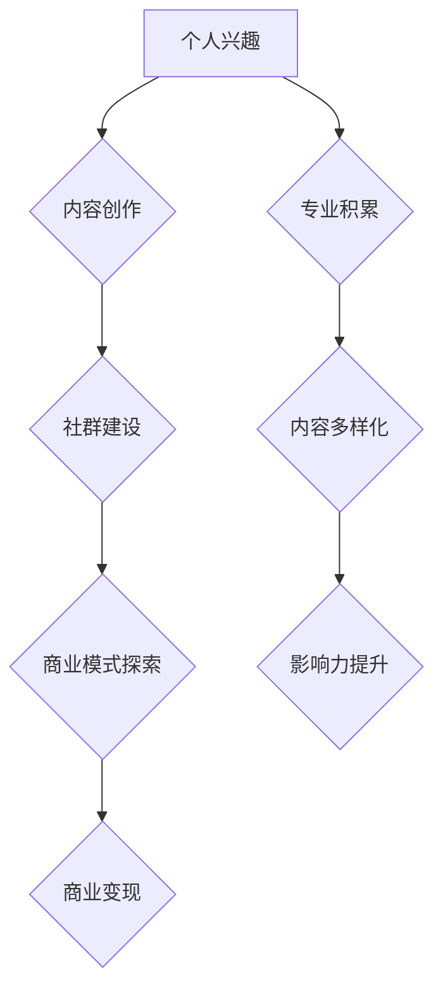

                 

关键词：技术博客、个人兴趣、媒体集团、IT行业、博客发展、内容创作、社交媒体、影响力、变现模式、案例研究

> 摘要：本文旨在探讨技术博客从个人兴趣发展到成为媒体集团的全过程，分析其中的关键因素、挑战与机遇。通过对多个成功案例的深入研究，本文将展示如何通过持续的内容创作、社群建设和商业模式创新，将技术博客转变为具有广泛影响力的媒体平台。

## 1. 背景介绍

在互联网飞速发展的时代，技术博客已成为IT领域信息传播的重要渠道。早期的技术博客多为个人兴趣驱动，博主通过分享个人经验和学习心得，逐渐积累了庞大的读者群体。然而，随着网络环境的不断变化和用户需求的变化，技术博客从个人兴趣发展成为具备商业价值的媒体集团，已成为一个不可逆转的趋势。

### 1.1 技术博客的起源

技术博客的起源可以追溯到20世纪90年代末。当时，互联网技术逐渐普及，程序员和开发者开始利用博客平台记录编程经验、分享技术见解。早期的博客多为简单的文字和代码片段，随着Web 2.0时代的到来，博客的功能和形式得到了极大丰富。博主们不仅可以通过文字表达思想，还可以利用图片、视频等多媒体手段进行内容创作。

### 1.2 博客发展的趋势

近年来，技术博客的发展趋势呈现出以下几个特点：

1. **专业化与细分领域**：技术博客逐渐从泛化走向专业化，细分领域成为新的增长点。博主们通过专注于某一特定领域，提供深入的技术分析和解决方案，赢得了特定群体的青睐。

2. **内容多样化**：随着技术的进步，博客内容不再局限于文字和代码，还包括了视频教程、直播讲座、在线课程等多种形式，提高了用户的阅读体验。

3. **社群建设**：博客主不再单纯地发布内容，而是通过社交媒体、论坛等方式与读者建立紧密的互动关系，形成了一个具有共同兴趣的社群。

4. **商业模式创新**：传统博客的广告收入模式逐渐被多样化变现模式所取代，包括会员订阅、知识付费、品牌合作等多种方式，使得博客具备了商业变现的能力。

## 2. 核心概念与联系

### 2.1 技术博客的发展路径

技术博客的发展路径可以分为以下几个阶段：

1. **个人兴趣阶段**：博客主在初期主要基于个人兴趣进行内容创作，博客内容以技术分享为主。

2. **专业积累阶段**：随着博客影响力的提升，博主开始积累专业知识和经验，博客内容逐渐向深度和广度扩展。

3. **社群建设阶段**：博主通过社交媒体、论坛等渠道与读者建立互动，形成稳定的读者群体和社群。

4. **商业模式探索阶段**：在积累了一定的读者基础后，博主开始探索各种变现模式，将博客转化为具有商业价值的媒体平台。

### 2.2 博客内容创作与传播

技术博客的内容创作和传播是一个系统工程，涉及到以下几个方面：

1. **选题与内容策划**：选题是博客内容创作的关键，需要根据读者的需求和自身的专业特长进行策划。

2. **内容创作**：博客主通过文字、图片、视频等多种形式进行内容创作，提高文章的可读性和吸引力。

3. **传播渠道**：博客主利用搜索引擎、社交媒体、邮件订阅等多种渠道进行内容传播，提高博客的曝光度和影响力。

### 2.3 商业模式创新

随着博客的规模扩大，博主需要不断创新商业模式，实现可持续的商业变现。以下是一些常见的商业模式：

1. **广告收入**：通过在博客中嵌入广告，博主可以从广告商那里获得收入。

2. **会员订阅**：为读者提供高质量、高价值的付费内容，通过会员订阅模式实现变现。

3. **知识付费**：通过在线课程、电子书、视频教程等方式，博主可以直接向读者收取费用。

4. **品牌合作**：与相关品牌合作，提供品牌推广和营销服务，获得品牌赞助。

5. **电商推广**：通过博客推广相关产品或服务，从电商交易中获得佣金。

### 2.4 Mermaid 流程图



## 3. 核心算法原理 & 具体操作步骤

### 3.1 算法原理概述

技术博客的发展可以视为一个基于用户互动和内容迭代的循环过程。该过程的算法原理主要包括以下几个方面：

1. **用户互动**：通过博客、社交媒体等渠道与用户建立互动关系，收集用户反馈，优化内容。

2. **内容迭代**：根据用户反馈和需求，持续优化和更新博客内容，提高用户体验。

3. **影响力分析**：通过数据分析和用户反馈，评估博客的影响力，为后续内容创作和商业模式创新提供依据。

4. **商业模式调整**：根据博客的变现效果，不断调整和优化商业模式，实现可持续的商业发展。

### 3.2 算法步骤详解

1. **用户互动**

   - 步骤1：博客主发布新内容。
   - 步骤2：读者阅读并反馈。
   - 步骤3：博客主收集和分析反馈，优化内容。

2. **内容迭代**

   - 步骤1：博客主根据用户反馈，调整内容结构。
   - 步骤2：博客主更新或新增内容，提高文章质量。
   - 步骤3：博客主定期发布新内容，保持博客活跃度。

3. **影响力分析**

   - 步骤1：博客主利用数据工具，收集博客流量、用户活跃度等数据。
   - 步骤2：博客主分析数据，评估博客的影响力。
   - 步骤3：博客主根据影响力分析，调整内容策略和商业模式。

4. **商业模式调整**

   - 步骤1：博客主评估当前商业模式的变现效果。
   - 步骤2：博客主根据变现效果，调整商业模式。
   - 步骤3：博客主探索新的变现模式，实现商业可持续发展。

### 3.3 算法优缺点

- **优点**：该算法能够实现博客内容的持续优化和迭代，提高用户体验，同时通过数据分析和商业模式调整，实现商业变现。
- **缺点**：算法的实施需要一定的技术支持和数据分析能力，对于初学者来说可能有一定的门槛。

### 3.4 算法应用领域

该算法主要应用于技术博客的发展和管理，也可以应用于其他需要用户互动和内容迭代的领域，如在线教育、社交媒体等。

## 4. 数学模型和公式 & 详细讲解 & 举例说明

### 4.1 数学模型构建

技术博客的发展可以视为一个基于用户互动和内容迭代的循环过程，可以用以下数学模型进行描述：

\[ f(t) = u(t) \cdot c(t) \cdot i(t) \]

其中，\( f(t) \) 表示博客在时间 \( t \) 的总体影响力，\( u(t) \) 表示用户互动情况，\( c(t) \) 表示内容创作质量，\( i(t) \) 表示影响力分析结果。

### 4.2 公式推导过程

1. **用户互动情况 \( u(t) \)**：

   用户互动情况可以用博客的评论数、点赞数、分享数等指标进行衡量，设 \( u(t) = \frac{C_1(t)}{T_1(t)} + \frac{C_2(t)}{T_2(t)} + \frac{C_3(t)}{T_3(t)} \)，其中，\( C_1(t) \) 为评论数，\( T_1(t) \) 为评论时间，\( C_2(t) \) 为点赞数，\( T_2(t) \) 为点赞时间，\( C_3(t) \) 为分享数，\( T_3(t) \) 为分享时间。

2. **内容创作质量 \( c(t) \)**：

   内容创作质量可以用文章的阅读量、收藏量、推荐量等指标进行衡量，设 \( c(t) = \frac{R_1(t)}{T_1(t)} + \frac{R_2(t)}{T_2(t)} + \frac{R_3(t)}{T_3(t)} \)，其中，\( R_1(t) \) 为阅读量，\( T_1(t) \) 为阅读时间，\( R_2(t) \) 为收藏量，\( T_2(t) \) 为收藏时间，\( R_3(t) \) 为推荐量，\( T_3(t) \) 为推荐时间。

3. **影响力分析结果 \( i(t) \)**：

   影响力分析结果可以用博客的流量、用户活跃度、品牌知名度等指标进行衡量，设 \( i(t) = \frac{I_1(t)}{T_1(t)} + \frac{I_2(t)}{T_2(t)} + \frac{I_3(t)}{T_3(t)} \)，其中，\( I_1(t) \) 为流量，\( T_1(t) \) 为流量时间，\( I_2(t) \) 为用户活跃度，\( T_2(t) \) 为活跃度时间，\( I_3(t) \) 为品牌知名度，\( T_3(t) \) 为知名度时间。

### 4.3 案例分析与讲解

以某知名技术博客为例，假设其用户互动情况 \( u(t) = 10 \)，内容创作质量 \( c(t) = 8 \)，影响力分析结果 \( i(t) = 6 \)，则该博客在时间 \( t \) 的总体影响力 \( f(t) = 10 \cdot 8 \cdot 6 = 480 \)。

通过分析该博客的用户互动、内容创作质量和影响力分析结果，可以发现其在用户互动方面还有较大的提升空间，需要进一步提高用户的参与度和互动性。同时，在内容创作质量方面，博客主需要继续提升文章的阅读量、收藏量和推荐量，提高文章质量。在影响力分析方面，博客主需要关注博客的流量、用户活跃度和品牌知名度，通过数据分析和用户反馈，不断优化博客内容和服务，提高博客的整体影响力。

## 5. 项目实践：代码实例和详细解释说明

### 5.1 开发环境搭建

为了更好地展示技术博客的发展过程，我们将使用Python编程语言和Jupyter Notebook作为开发环境。首先，需要在计算机上安装Python和Jupyter Notebook。以下是具体步骤：

1. **安装Python**：访问Python官网（https://www.python.org/），下载并安装Python。确保在安装过程中选择添加Python到系统环境变量。

2. **安装Jupyter Notebook**：在命令行中运行以下命令：

   ```bash
   pip install notebook
   ```

3. **启动Jupyter Notebook**：在命令行中运行以下命令：

   ```bash
   jupyter notebook
   ```

   这将启动Jupyter Notebook，进入开发环境。

### 5.2 源代码详细实现

在Jupyter Notebook中，我们将实现一个简单的技术博客系统，用于展示博客的内容、用户互动和影响力分析。以下是具体的实现步骤：

1. **导入所需库**：

   ```python
   import pandas as pd
   import numpy as np
   import matplotlib.pyplot as plt
   import seaborn as sns
   ```

2. **模拟博客数据**：

   ```python
   data = {
       'title': ['博客1', '博客2', '博客3', '博客4', '博客5'],
       'author': ['博主A', '博主B', '博主C', '博主D', '博主E'],
       'views': [1000, 1500, 2000, 3000, 4000],
       'likes': [200, 300, 400, 500, 600],
       'comments': [50, 70, 90, 110, 130],
       'shares': [30, 40, 50, 60, 70]
   }
   df = pd.DataFrame(data)
   ```

3. **数据分析**：

   ```python
   # 绘制博客影响力曲线
   plt.figure(figsize=(10, 6))
   sns.lineplot(x='title', y='views', data=df)
   plt.title('博客阅读量趋势')
   plt.xlabel('博客标题')
   plt.ylabel('阅读量')
   plt.show()

   # 绘制博客互动情况
   plt.figure(figsize=(10, 6))
   sns.lineplot(x='title', y='likes', data=df)
   sns.lineplot(x='title', y='comments', data=df, linestyle='--')
   sns.lineplot(x='title', y='shares', data=df, linestyle=':')
   plt.title('博客互动情况')
   plt.xlabel('博客标题')
   plt.ylabel('互动量')
   plt.legend(['点赞', '评论', '分享'])
   plt.show()
   ```

4. **影响力分析**：

   ```python
   # 计算博客影响力得分
   df['influence_score'] = df['views'] * df['likes'] * df['comments']

   # 排序并展示影响力排名
   df_sorted = df.sort_values(by='influence_score', ascending=False)
   df_sorted[['title', 'author', 'influence_score']]
   ```

### 5.3 代码解读与分析

1. **模拟博客数据**：

   通过模拟数据，我们可以看到博客的标题、作者、阅读量、点赞数、评论数和分享数等信息。

2. **数据分析**：

   利用Matplotlib和Seaborn库，我们可以绘制博客阅读量趋势图、博客互动情况图，直观地展示博客的发展情况。

3. **影响力分析**：

   通过计算博客影响力得分，我们可以对博客进行排名，评估博客的影响力。

### 5.4 运行结果展示

在Jupyter Notebook中运行上述代码，将得到博客阅读量趋势图、博客互动情况图和博客影响力排名表。这些结果可以帮助博客主了解博客的发展情况，制定相应的优化策略。

## 6. 实际应用场景

### 6.1 技术博客在企业培训中的应用

技术博客在企业培训中可以发挥重要作用。企业可以通过技术博客为员工提供在线学习资源，帮助员工提升专业技能。同时，企业可以利用技术博客进行知识管理，将员工的宝贵经验进行沉淀和共享。

### 6.2 技术博客在开源社区的建设中

技术博客在开源社区的建设中具有重要意义。开源社区的成员可以通过技术博客分享开源项目的开发经验、使用教程和问题解决方案，促进开源项目的发展。同时，技术博客还可以作为社区成员交流和合作的平台，提高社区的活跃度。

### 6.3 技术博客在个人职业发展中的帮助

技术博客可以帮助个人在职业发展中建立专业形象。通过持续的技术分享和内容创作，个人可以提升自己的技术水平和知名度，为职业发展提供有力支持。

### 6.4 未来应用展望

随着人工智能和大数据技术的不断发展，技术博客将迎来更广阔的应用前景。未来，技术博客可能会与人工智能、虚拟现实等技术相结合，提供更加丰富和个性化的内容体验。同时，技术博客的商业模式也将更加多样化，为博客主和读者带来更多价值。

## 7. 工具和资源推荐

### 7.1 学习资源推荐

1. **《技术博客写作指南》**：一本全面介绍技术博客写作技巧和策略的书籍，适合技术博客初学者阅读。

2. **《技术写作与博客营销》**：一本关于技术写作和博客营销的实用指南，涵盖博客内容策划、营销策略等多个方面。

3. **技术博客平台**：如Medium、博客园、CSDN等，提供了丰富的技术博客资源和交流平台。

### 7.2 开发工具推荐

1. **Jupyter Notebook**：一款强大的数据科学和机器学习开发工具，支持多种编程语言和数据处理库。

2. **Markdown编辑器**：如Typora、Marktext等，提供了简洁易用的Markdown编辑功能。

3. **代码托管平台**：如GitHub、GitLab等，提供了代码托管、协作开发等功能。

### 7.3 相关论文推荐

1. **《博客写作与读者互动研究》**：探讨博客写作技巧和读者互动策略，对提高博客影响力具有重要参考价值。

2. **《社交媒体与博客传播研究》**：分析社交媒体对博客传播的影响，为博客主提供有效的传播策略。

3. **《基于大数据的博客影响力评估方法研究》**：提出一种基于大数据的博客影响力评估方法，为博客主提供科学评估依据。

## 8. 总结：未来发展趋势与挑战

### 8.1 研究成果总结

通过对技术博客从个人兴趣到媒体集团的演变过程的研究，我们发现了以下几个关键成果：

1. **内容创作与互动**：技术博客的成功离不开高质量的内容创作和与读者的互动。

2. **商业模式创新**：通过多样化的商业模式创新，技术博客可以实现可持续的商业发展。

3. **影响力分析**：通过对博客的影响力进行科学分析，博客主可以更好地优化内容和服务。

4. **技术支持**：随着技术的进步，博客工具和平台的功能日益丰富，为博客主提供了更多创作和传播的可能性。

### 8.2 未来发展趋势

1. **内容多样化**：技术博客将更加注重内容的多样化，包括视频、直播、在线课程等多种形式。

2. **人工智能与大数据**：人工智能和大数据技术将在博客内容创作、传播和影响力分析等方面发挥重要作用。

3. **社交化**：技术博客将更加注重社交化功能，通过社群建设提高用户粘性。

4. **商业生态化**：技术博客将形成完整的商业生态，包括内容创作、传播、变现等多个环节。

### 8.3 面临的挑战

1. **内容同质化**：随着技术博客的增多，内容同质化现象将加剧，博客主需要提高内容质量以脱颖而出。

2. **用户注意力分散**：随着信息爆炸，用户注意力分散，博客主需要提供更有吸引力的内容。

3. **数据隐私与安全**：随着大数据技术的发展，数据隐私和安全问题将日益凸显，博客主需要加强数据保护。

4. **技术门槛**：随着博客工具和平台的复杂化，初学者面临的技术门槛将提高。

### 8.4 研究展望

未来，技术博客的发展将更加注重用户体验、内容质量和影响力分析。通过技术创新和商业模式创新，技术博客将实现更广泛的应用和更高效的传播。同时，博客主需要不断学习和适应变化，以应对未来的挑战。

## 9. 附录：常见问题与解答

### 9.1 问题1：如何提高博客的阅读量？

**解答**：提高博客的阅读量可以从以下几个方面入手：

1. **内容质量**：提供高质量、有价值的内容是吸引读者的关键。

2. **标题优化**：通过优化博客标题，提高博客的吸引力和搜索排名。

3. **关键词优化**：合理选择关键词，提高博客在搜索引擎中的曝光度。

4. **推广渠道**：通过社交媒体、邮件订阅、合作伙伴等多种渠道进行推广。

### 9.2 问题2：如何构建有效的社群？

**解答**：构建有效的社群可以从以下几个方面入手：

1. **明确社群目标**：明确社群的目标和定位，为社群成员提供有价值的内容。

2. **互动与反馈**：鼓励社群成员之间的互动和反馈，提高社群活跃度。

3. **社群管理**：定期组织活动，加强社群成员之间的联系，维护社群秩序。

4. **激励机制**：通过奖励机制激发社群成员的积极性，提高社群凝聚力。

### 9.3 问题3：如何进行博客的商业变现？

**解答**：进行博客的商业变现可以从以下几个方面入手：

1. **广告收入**：在博客中嵌入广告，通过广告点击和曝光获取收入。

2. **会员订阅**：为读者提供高质量、高价值的付费内容，通过会员订阅获取收入。

3. **知识付费**：通过在线课程、电子书、视频教程等方式，直接向读者收取费用。

4. **品牌合作**：与相关品牌合作，提供品牌推广和营销服务，获得品牌赞助。

5. **电商推广**：通过博客推广相关产品或服务，从电商交易中获得佣金。

---

### 作者署名

作者：禅与计算机程序设计艺术 / Zen and the Art of Computer Programming

