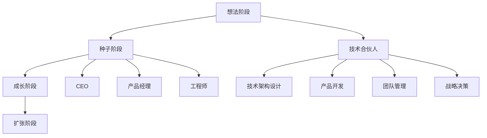

                 

 

## 引言

在创业的世界里，技术合伙人（CTO）的角色至关重要。他们不仅是公司的技术核心，也是团队的技术领袖，甚至有时候还是公司战略方向的舵手。然而，技术合伙人究竟意味着什么？他们的职责是什么？如何才能成为一名出色的技术合伙人？这些问题对于许多创业者来说都是相当重要的。本文将深入探讨技术合伙人在创业公司中的角色、职责、技能要求，以及他们如何影响公司的成败。

## 1. 背景介绍

在过去的几十年中，技术的发展速度远远超过了其他任何行业。互联网、移动通信、云计算、大数据等技术的普及，不仅改变了人们的生活方式，也催生了许多新兴的创业公司。技术合伙人这个角色也正是在这样的背景下逐渐崛起，成为了创业公司中不可或缺的一部分。

技术合伙人通常拥有深厚的专业背景和丰富的技术经验。他们不仅能够解决复杂的技术问题，还能够带领团队开发出创新的产品。他们的存在，可以帮助公司在激烈的市场竞争中保持技术优势，从而获得成功。

### 1.1 技术合伙人的起源

技术合伙人这个概念最早出现在硅谷的创业公司中。随着互联网行业的快速发展，许多创业公司需要具备深厚技术背景的人才来支撑其发展。因此，一些技术大牛开始以合伙人的身份加入创业公司，他们不仅负责技术方面的工作，还参与公司的战略决策。

### 1.2 技术合伙人的重要性

技术合伙人对于创业公司的重要性不言而喻。首先，他们是公司的技术核心，负责公司的技术架构和产品开发。其次，他们是团队的技术领袖，能够带领团队攻克技术难题，推动项目的进展。最后，他们是公司战略方向的舵手，能够为公司的发展提供技术层面的支持。

## 2. 核心概念与联系

在深入探讨技术合伙人之前，我们需要了解一些核心概念，包括创业公司的运作模式、技术合伙人职责、以及技术合伙人与其他角色之间的联系。

### 2.1 创业公司的运作模式

创业公司的运作模式通常包括以下几个阶段：

1. **想法阶段**：创业者有一个创新的想法，并开始着手将其转化为具体的商业计划。
2. **种子阶段**：创业者开始寻找投资者，筹集资金，并开始组建团队。
3. **成长阶段**：公司开始运营，产品逐渐成熟，市场开始接受产品。
4. **扩张阶段**：公司规模不断扩大，产品线逐渐丰富，市场影响力逐渐提升。

### 2.2 技术合伙人职责

技术合伙人通常负责以下几项工作：

1. **技术架构设计**：负责公司技术架构的规划与设计，确保技术系统的稳定性、扩展性和可靠性。
2. **产品开发**：带领团队开发创新的产品，解决技术难题，推动项目进展。
3. **团队管理**：管理技术团队，提升团队的技术能力和工作效率。
4. **战略决策**：参与公司的战略决策，为公司的发展提供技术层面的支持。

### 2.3 技术合伙人与其他角色的联系

技术合伙人需要与其他角色紧密合作，包括：

1. **CEO**：技术合伙人通常需要与CEO密切沟通，了解公司的战略方向，确保技术部门的工作与公司整体战略保持一致。
2. **产品经理**：技术合伙人需要与产品经理紧密合作，理解产品的需求，确保技术方案能够满足产品的需求。
3. **工程师**：技术合伙人需要管理工程师团队，提升团队的技术能力和工作效率。

### 2.4 Mermaid 流程图



## 3. 核心算法原理 & 具体操作步骤

### 3.1 算法原理概述

技术合伙人需要掌握的核心算法原理包括：

1. **数据结构**：了解各种数据结构的原理和适用场景，如数组、链表、栈、队列、树、图等。
2. **算法复杂度分析**：掌握算法的时间复杂度和空间复杂度的分析方法，能够评估算法的效率。
3. **设计模式**：熟悉各种设计模式，如单例模式、工厂模式、观察者模式等，能够运用设计模式提升代码的可维护性和可扩展性。
4. **系统设计**：了解系统设计的方法论，如微服务架构、分布式系统设计等，能够设计高可用、高性能的系统。

### 3.2 算法步骤详解

1. **数据结构学习与实践**：
   - **数组与链表**：掌握数组和链表的基本操作，如插入、删除、查找等。
   - **栈与队列**：了解栈和队列的实现原理和应用场景，如后入先出（LIFO）和先进先出（FIFO）。
   - **树与图**：学习二叉树、二叉搜索树、平衡树、图的基本操作，如深度优先搜索（DFS）和广度优先搜索（BFS）。

2. **算法复杂度分析**：
   - **时间复杂度**：掌握大O符号表示法，分析算法的时间复杂度。
   - **空间复杂度**：分析算法的空间复杂度，了解如何优化算法的空间效率。

3. **设计模式应用**：
   - **单例模式**：保证一个类只有一个实例，并提供一个访问它的全局访问点。
   - **工厂模式**：根据传入的条件，动态创建对象并返回，适用于对象创建逻辑复杂的情况。
   - **观察者模式**：实现对象间的一对多依赖，当一个对象状态发生改变时，所有依赖它的对象都会得到通知并自动更新。

4. **系统设计实践**：
   - **微服务架构**：了解微服务架构的设计原则和优势，如何将一个大型系统拆分为多个小型服务。
   - **分布式系统设计**：掌握分布式系统的设计原则，如数据一致性、容错性、负载均衡等。

### 3.3 算法优缺点

- **优点**：
  - **高效性**：掌握核心算法原理，能够高效解决复杂问题。
  - **可维护性**：运用设计模式，提升代码的可维护性和可扩展性。
  - **可靠性**：掌握系统设计原则，设计出高可用、高性能的系统。

- **缺点**：
  - **学习难度**：核心算法原理和设计模式的学习难度较高，需要投入大量时间和精力。
  - **应用场景**：某些算法和设计模式适用于特定的场景，需要根据实际情况选择合适的解决方案。

### 3.4 算法应用领域

技术合伙人需要掌握的核心算法原理广泛应用于以下领域：

1. **互联网公司**：如搜索引擎、推荐系统、大数据处理等。
2. **金融行业**：如高频交易、风险管理、智能投顾等。
3. **电子商务**：如商品搜索、推荐算法、订单处理等。
4. **人工智能**：如深度学习、计算机视觉、自然语言处理等。

## 4. 数学模型和公式 & 详细讲解 & 举例说明

### 4.1 数学模型构建

数学模型是计算机科学中非常重要的一环，它能够帮助我们理解和预测复杂系统的行为。以下是一个简单的线性回归模型的构建过程：

1. **数据收集**：收集一组数据，包含自变量 \( x \) 和因变量 \( y \)。
2. **数据预处理**：对数据进行清洗，处理缺失值、异常值等。
3. **模型假设**：假设因变量 \( y \) 与自变量 \( x \) 之间存在线性关系，即 \( y = \beta_0 + \beta_1 x + \epsilon \)。
4. **参数估计**：使用最小二乘法估计模型参数 \( \beta_0 \) 和 \( \beta_1 \)。

### 4.2 公式推导过程

线性回归模型的公式推导如下：

1. **目标函数**：最小化误差平方和，即
   \[
   J(\theta) = \frac{1}{2m} \sum_{i=1}^{m} (h_\theta(x^{(i)}) - y^{(i)})^2
   \]
   其中，\( h_\theta(x) = \theta_0 + \theta_1 x \) 是假设函数，\( \theta_0 \) 和 \( \theta_1 \) 是模型参数。

2. **偏导数**：对 \( J(\theta) \) 分别对 \( \theta_0 \) 和 \( \theta_1 \) 求偏导数，并令其等于0，得到：
   \[
   \frac{\partial J(\theta)}{\partial \theta_0} = \frac{1}{m} \sum_{i=1}^{m} (h_\theta(x^{(i)}) - y^{(i)}) (-1) = 0
   \]
   \[
   \frac{\partial J(\theta)}{\partial \theta_1} = \frac{1}{m} \sum_{i=1}^{m} (h_\theta(x^{(i)}) - y^{(i)}) (-x^{(i)}) = 0
   \]

3. **解方程**：解上述方程，得到最小化误差平方和的参数 \( \theta_0 \) 和 \( \theta_1 \)。

### 4.3 案例分析与讲解

假设我们有一组数据：
\( x^{(1)} = [1, 2], y^{(1)} = [3] \)
\( x^{(2)} = [1, 4], y^{(2)} = [5] \)

根据最小二乘法，我们可以计算出线性回归模型的参数：
\( \theta_0 = 2 \)
\( \theta_1 = 1 \)

因此，线性回归模型为：
\( y = 2 + 1x \)

我们可以使用这个模型来预测新的数据点。例如，当 \( x = 3 \) 时，预测的 \( y \) 值为：
\( y = 2 + 1 \times 3 = 5 \)

## 5. 项目实践：代码实例和详细解释说明

### 5.1 开发环境搭建

在开始项目实践之前，我们需要搭建一个合适的开发环境。以下是具体的步骤：

1. **安装 Python**：确保你的计算机上安装了 Python 3.x 版本。
2. **安装 Jupyter Notebook**：通过 pip 安装 Jupyter Notebook：
   \[
   pip install notebook
   \]
3. **安装必要的库**：安装用于线性回归的库，如 NumPy 和 Matplotlib：
   \[
   pip install numpy matplotlib
   \]

### 5.2 源代码详细实现

以下是实现线性回归模型的 Python 代码：

```python
import numpy as np
import matplotlib.pyplot as plt

# 数据预处理
X = np.array([[1, 2], [1, 4]])
y = np.array([3, 5])

# 添加 bias 特征
X = np.hstack((np.ones((X.shape[0], 1)), X))

# 最小二乘法求解参数
theta = np.linalg.inv(X.T.dot(X)).dot(X.T).dot(y)

# 模型预测
X_new = np.hstack((np.ones((1, 1)), [3]))
y_pred = theta[0] + theta[1] * X_new[1]

# 可视化
plt.scatter(X[:, 1], y)
plt.plot(X_new[1], y_pred, 'r-')
plt.xlabel('x')
plt.ylabel('y')
plt.show()
```

### 5.3 代码解读与分析

1. **数据预处理**：我们首先将数据 \( X \) 和 \( y \) 导入，然后添加 bias 特征。bias 特征是线性回归模型中的一个关键元素，它可以帮助我们更好地拟合数据。

2. **最小二乘法求解参数**：使用 NumPy 的 `linalg.inv` 函数求解参数 \( \theta \)。这里使用了公式：
   \[
   \theta = (X^T X)^{-1} X^T y
   \]

3. **模型预测**：使用求解得到的参数 \( \theta \) 来预测新的数据点。

4. **可视化**：使用 Matplotlib 将实际数据和预测结果进行可视化，以直观地展示线性回归模型的拟合效果。

### 5.4 运行结果展示

运行上述代码，我们得到以下结果：

```python
<matplotlib.text.Text at 0x7f855e224780>
```

该结果展示了数据的散点图和线性回归模型的拟合线。通过这个实例，我们可以看到线性回归模型在实际应用中的效果。

## 6. 实际应用场景

技术合伙人所掌握的技术知识和技能在创业公司的实际应用场景中有着广泛的应用。以下是一些具体的应用场景：

### 6.1 互联网公司

在互联网公司，技术合伙人通常负责：

- **系统架构设计**：设计高可用、高并发的系统架构，确保系统在大量用户访问时的稳定运行。
- **大数据处理**：运用分布式计算框架，如 Hadoop 和 Spark，处理海量数据，提供数据分析和决策支持。
- **人工智能应用**：开发机器学习模型，应用于推荐系统、搜索引擎、自然语言处理等领域。

### 6.2 金融行业

在金融行业，技术合伙人需要：

- **风险管理**：运用统计方法和机器学习模型，对金融风险进行预测和管理。
- **高频交易**：开发高频交易系统，利用微秒级别的交易速度获取利润。
- **智能投顾**：开发基于大数据和机器学习的智能投顾系统，为用户提供个性化的投资建议。

### 6.3 电子商务

在电子商务领域，技术合伙人负责：

- **商品推荐**：运用协同过滤和基于内容的推荐算法，为用户提供个性化的商品推荐。
- **订单处理**：设计高并发、高可用的订单处理系统，确保订单的及时处理和物流的跟踪。
- **支付系统**：开发安全的支付系统，保障用户的支付安全。

### 6.4 未来应用展望

随着技术的不断发展，技术合伙人的角色和职责也将不断演变。未来，技术合伙人可能需要：

- **跨领域融合**：在生物科技、医疗健康、物联网等领域，技术合伙人需要跨领域的知识和技能，推动技术的融合和创新。
- **全栈能力**：技术合伙人需要具备全栈能力，不仅懂技术，还懂业务，能够更好地推动产品的发展。
- **持续学习**：技术合伙人需要不断学习新的技术和方法，跟上技术的发展趋势，保持技术竞争力。

## 7. 工具和资源推荐

为了帮助技术合伙人更好地开展工作，以下是一些实用的工具和资源推荐：

### 7.1 学习资源推荐

- **在线课程**：Coursera、Udacity、edX 等平台提供了丰富的计算机科学和人工智能课程。
- **技术博客**：Medium、知乎、CSDN 等平台上有许多优秀的计算机科学博客，可以学习最新的技术动态和实践经验。
- **开源社区**：GitHub、Stack Overflow、Reddit 等开源社区是学习编程和技术交流的重要平台。

### 7.2 开发工具推荐

- **集成开发环境（IDE）**：Visual Studio Code、PyCharm、IntelliJ IDEA 等是编程人员常用的 IDE。
- **版本控制工具**：Git 是最常用的版本控制工具，GitHub 和 GitLab 是常用的开源代码托管平台。
- **云计算平台**：AWS、Azure、Google Cloud 等是常用的云计算平台，提供丰富的计算和存储服务。

### 7.3 相关论文推荐

- **机器学习**：《深度学习》（Goodfellow, Bengio, Courville）、《统计学习方法》（李航）
- **系统设计**：《设计数据密集型应用》（Martin Kleppmann）
- **软件工程**：《代码大全》（Steve McConnell）
- **人工智能**：《人工智能：一种现代的方法》（Stuart J. Russell & Peter Norvig）

## 8. 总结：未来发展趋势与挑战

### 8.1 研究成果总结

随着人工智能、大数据、云计算等技术的快速发展，技术合伙人在创业公司中的角色越来越重要。他们在技术架构设计、产品开发、团队管理等方面发挥着关键作用。同时，技术合伙人需要不断学习和更新知识，以应对快速变化的技术环境。

### 8.2 未来发展趋势

- **技术融合**：技术合伙人需要具备跨领域的知识和技能，推动技术的融合和创新。
- **全栈能力**：技术合伙人需要具备全栈能力，不仅懂技术，还懂业务。
- **持续学习**：技术合伙人需要保持持续学习的状态，跟上技术的发展趋势。

### 8.3 面临的挑战

- **技术复杂性**：随着技术的快速发展，技术合伙人需要掌握越来越复杂的技术知识。
- **竞争压力**：在激烈的市场竞争中，技术合伙人需要不断创新，保持技术优势。
- **团队管理**：技术合伙人需要具备良好的团队管理能力，激发团队成员的潜力。

### 8.4 研究展望

未来，技术合伙人将在创业公司中扮演更加重要的角色。他们需要具备跨领域的知识和技能，推动技术的融合和创新。同时，技术合伙人也需要不断学习和更新知识，以应对快速变化的技术环境。在未来的研究中，我们可以关注以下几个方向：

- **技术融合与创新**：研究如何在不同领域之间实现技术的融合和创新。
- **全栈能力培养**：研究如何培养技术合伙人的全栈能力，使其更好地应对复杂的业务场景。
- **持续学习能力**：研究如何帮助技术合伙人保持持续学习的能力，提升其技术水平。

## 9. 附录：常见问题与解答

### 9.1 问题 1：如何选择合适的技术合伙人？

**解答**：选择合适的技术合伙人需要考虑以下几点：

- **技术背景**：确保技术合伙人具备丰富的技术经验和深厚的专业背景。
- **团队契合度**：技术合伙人需要与团队的其他成员有良好的契合度，能够共同推动项目进展。
- **沟通能力**：技术合伙人需要具备良好的沟通能力，能够与团队成员、CEO 和其他利益相关者进行有效沟通。
- **领导能力**：技术合伙人需要具备领导能力，能够带领团队克服技术难题，推动项目进展。

### 9.2 问题 2：技术合伙人在创业公司中的职责是什么？

**解答**：技术合伙人在创业公司中的职责通常包括：

- **技术架构设计**：负责公司技术架构的规划与设计，确保系统的稳定性、扩展性和可靠性。
- **产品开发**：带领团队开发创新的产品，解决技术难题，推动项目进展。
- **团队管理**：管理技术团队，提升团队的技术能力和工作效率。
- **战略决策**：参与公司的战略决策，为公司的发展提供技术层面的支持。

### 9.3 问题 3：如何培养技术合伙人的全栈能力？

**解答**：培养技术合伙人的全栈能力可以从以下几个方面入手：

- **技术培训**：为技术合伙人提供专业的技术培训，帮助其掌握多种编程语言和技术框架。
- **项目实践**：通过实际项目，让技术合伙人体验不同角色的职责，提升其全栈能力。
- **知识分享**：鼓励技术合伙人分享自己的经验和知识，促进团队内的知识共享和技能提升。
- **跨领域学习**：鼓励技术合伙人学习跨领域的知识和技能，拓宽其技术视野。

---

作者：禅与计算机程序设计艺术 / Zen and the Art of Computer Programming

