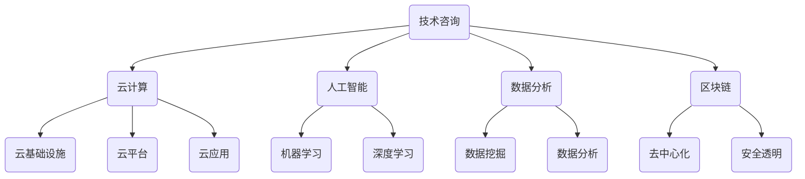

                 

关键词：技术咨询服务、跨国咨询集团、IT解决方案、战略规划、数字化转型、云计算、人工智能、数据分析、区块链

> 摘要：本文深入探讨了技术咨询服务的发展历程，从个人顾问到跨国咨询集团的转变。通过分析当前技术咨询行业的现状，探讨其核心概念与联系，以及核心算法原理和具体操作步骤，本文旨在为读者提供全面的了解，并展望未来技术咨询服务的发展趋势与挑战。

## 1. 背景介绍

技术咨询服务起源于20世纪末，随着信息技术的快速发展，IT行业对专业技术服务需求日益增长。最初的技术咨询服务主要是由个人顾问提供的，他们凭借丰富的行业经验和专业技能，为企业提供定制化的IT解决方案。随着时间的推移，技术咨询服务逐渐演变为跨国咨询集团，这些集团在全球范围内提供综合性IT服务，涵盖云计算、人工智能、数据分析、区块链等多个领域。

跨国咨询集团的兴起，得益于全球化进程的加速和企业的数字化转型需求。企业意识到，仅依靠内部IT团队难以满足快速变化的业务需求，因此他们寻求外部专业咨询服务的帮助，以确保在技术变革中保持竞争力。

## 2. 核心概念与联系

### 2.1 技术咨询服务的定义

技术咨询服务的定义可以概括为：为企业和组织提供专业信息技术咨询服务，帮助其解决技术问题、优化业务流程、提升IT治理水平。

### 2.2 技术咨询服务的核心领域

- 云计算：为企业提供云基础设施、云平台、云应用等服务，实现业务快速部署和弹性扩展。
- 人工智能：利用机器学习和深度学习技术，帮助企业实现自动化决策、智能分析和个性化服务。
- 数据分析：通过数据挖掘和分析，为企业提供数据驱动的业务洞察和战略决策支持。
- 区块链：提供去中心化、安全透明的数据存储和交易解决方案，提升企业信任度和效率。

### 2.3 技术咨询服务架构的 Mermaid 流程图



## 3. 核心算法原理 & 具体操作步骤

### 3.1 算法原理概述

技术咨询服务中的核心算法主要包括云计算的负载均衡算法、人工智能的神经网络算法、数据分析的聚类算法、区块链的共识算法等。以下分别简要介绍这些算法的基本原理。

- 云计算负载均衡算法：通过合理分配计算资源，确保服务器负载均衡，提高系统性能和稳定性。
- 人工智能神经网络算法：模拟人脑神经元连接方式，实现数据输入和输出之间的映射关系。
- 数据分析聚类算法：将相似的数据划分为同一类，以便进行后续分析和处理。
- 区块链共识算法：确保区块链网络中的节点达成一致，实现数据的可靠存储和传输。

### 3.2 算法步骤详解

以下分别详细描述每个算法的具体操作步骤。

#### 3.2.1 云计算负载均衡算法

1. 监测服务器负载：通过监控工具实时收集服务器负载数据。
2. 数据分析：根据负载数据，分析服务器状态，判断是否存在负载不均衡现象。
3. 负载均衡策略：采用动态负载均衡策略，将任务分配到负载较低的服务器上。
4. 调整负载分配：根据服务器状态和负载变化，动态调整负载分配策略。

#### 3.2.2 人工智能神经网络算法

1. 数据预处理：对输入数据进行清洗和归一化处理，确保数据质量。
2. 神经网络结构设计：根据问题需求，设计合适的神经网络结构。
3. 模型训练：利用训练数据，通过反向传播算法，调整网络权重和偏置。
4. 模型评估：利用测试数据，评估模型性能，调整网络结构和参数。

#### 3.2.3 数据分析聚类算法

1. 数据预处理：对输入数据进行清洗和归一化处理，确保数据质量。
2. 初始化聚类中心：随机选择聚类中心或使用K-means++算法初始化。
3. 计算距离：计算每个数据点与聚类中心的距离。
4. 调整聚类中心：将每个数据点分配到最近的聚类中心，并重新计算聚类中心。
5. 重复步骤3和4，直到聚类中心不再发生显著变化。

#### 3.2.4 区块链共识算法

1. 节点加入网络：新节点通过挖矿或质押等方式加入区块链网络。
2. 数据传输：节点接收并验证其他节点的交易数据。
3. 生成区块：节点根据交易数据生成新的区块。
4. 广播区块：节点将生成的区块广播给其他节点。
5. 共识达成：其他节点验证区块的有效性，达成共识后，将区块添加到区块链。

### 3.3 算法优缺点

以下分别介绍各个算法的优缺点。

#### 3.3.1 云计算负载均衡算法

优点：提高系统性能和稳定性，降低服务器资源浪费。

缺点：负载均衡算法的复杂度较高，实施难度较大。

#### 3.3.2 人工智能神经网络算法

优点：强大的学习能力和泛化能力，适用于各种复杂问题。

缺点：对数据质量和模型参数敏感，训练过程耗时较长。

#### 3.3.3 数据分析聚类算法

优点：简单易用，适合大规模数据聚类。

缺点：对初始聚类中心敏感，可能导致聚类效果不佳。

#### 3.3.4 区块链共识算法

优点：去中心化、安全透明，确保数据可靠性和一致性。

缺点：共识算法性能对网络带宽和处理能力要求较高，可能导致网络延迟。

### 3.4 算法应用领域

云计算负载均衡算法主要应用于大型网站、在线游戏、云计算平台等领域。人工智能神经网络算法广泛应用于图像识别、自然语言处理、推荐系统等领域。数据分析聚类算法应用于市场细分、用户行为分析、生物信息学等领域。区块链共识算法主要应用于数字货币、供应链管理、智能合约等领域。

## 4. 数学模型和公式 & 详细讲解 & 举例说明

### 4.1 数学模型构建

技术咨询服务中涉及多个数学模型，以下简要介绍其中几个重要的数学模型。

#### 4.1.1 云计算负载均衡模型

设 \( N \) 为服务器节点集合，\( L_i \) 为第 \( i \) 个服务器的负载，\( T_i \) 为第 \( i \) 个服务器的处理能力，则负载均衡模型可表示为：

\[ \min \sum_{i=1}^N L_i - T_i \]

#### 4.1.2 人工智能神经网络模型

设 \( x \) 为输入向量，\( y \) 为输出向量，\( w \) 为权重矩阵，\( b \) 为偏置向量，则神经网络模型可表示为：

\[ y = \sigma(Wx + b) \]

其中，\( \sigma \) 为激活函数，常见的激活函数有 \( sigmoid \)、\( tanh \)、\( ReLU \) 等。

#### 4.1.3 数据分析聚类模型

设 \( X \) 为数据集，\( C \) 为聚类中心，则聚类模型可表示为：

\[ C = \arg\min_{C} \sum_{x \in X} ||x - C||^2 \]

#### 4.1.4 区块链共识模型

设 \( P \) 为区块链网络中的所有节点，\( T \) 为交易数据集，则共识模型可表示为：

\[ \forall p \in P, T' = T \cup \{t\} \]

其中，\( T' \) 为达成共识后的交易数据集，\( t \) 为新加入的交易。

### 4.2 公式推导过程

以下简要介绍几个重要数学模型的推导过程。

#### 4.2.1 云计算负载均衡模型推导

假设服务器节点集合 \( N = \{1, 2, \ldots, N\} \)，每个服务器的负载 \( L_i \) 和处理能力 \( T_i \) 分别为：

\[ L_i = \sum_{j=1}^M c_{ij} \cdot r_j \]
\[ T_i = \sum_{j=1}^M c_{ij} \cdot s_j \]

其中，\( M \) 为任务集合，\( r_j \) 和 \( s_j \) 分别为第 \( j \) 个任务的请求时间和服务时间。

为了实现负载均衡，需要将任务 \( j \) 分配到服务器 \( i \) 上，使得总负载与处理能力之差最小。即：

\[ \min \sum_{i=1}^N L_i - T_i \]

将 \( L_i \) 和 \( T_i \) 的表达式代入，得到：

\[ \min \sum_{i=1}^N \left( \sum_{j=1}^M c_{ij} \cdot r_j - \sum_{j=1}^M c_{ij} \cdot s_j \right) \]

根据线性规划的理论，可以使用拉格朗日乘子法求解该优化问题。

#### 4.2.2 人工智能神经网络模型推导

设 \( x \) 和 \( y \) 分别为输入和输出向量，\( w \) 为权重矩阵，\( b \) 为偏置向量，则神经网络模型可表示为：

\[ y = \sigma(Wx + b) \]

其中，\( \sigma \) 为激活函数。常见的激活函数有 \( sigmoid \)、\( tanh \)、\( ReLU \) 等。

为了推导神经网络的损失函数，假设输出层为 \( L \) 层，\( y_l \) 为第 \( l \) 层的输出，\( \hat{y}_l \) 为第 \( l \) 层的预测输出，则损失函数为：

\[ L = \sum_{l=L} \sum_{i=1}^{N_l} \ell(y_l[i], \hat{y}_l[i]) \]

其中，\( \ell \) 为损失函数，常见的损失函数有 \( MSE \)、\( CE \) 等。

为了最小化损失函数，可以使用梯度下降法进行模型训练。

#### 4.2.3 数据分析聚类模型推导

设 \( X \) 为数据集，\( C \) 为聚类中心，则聚类模型可表示为：

\[ C = \arg\min_{C} \sum_{x \in X} ||x - C||^2 \]

该模型的目标是最小化数据点到聚类中心的距离之和。为了求解该问题，可以使用迭代优化算法，如K-means算法。

#### 4.2.4 区块链共识模型推导

设 \( P \) 为区块链网络中的所有节点，\( T \) 为交易数据集，则共识模型可表示为：

\[ \forall p \in P, T' = T \cup \{t\} \]

该模型的目标是确保所有节点对交易数据集达成一致。为了实现该目标，可以使用各种共识算法，如PoW、PoS、PBFT等。

### 4.3 案例分析与讲解

以下通过具体案例，对上述数学模型进行详细分析和讲解。

#### 4.3.1 云计算负载均衡案例

假设有5个服务器节点 \( N = \{1, 2, 3, 4, 5\} \)，每个服务器的负载和处理能力如下表所示：

| 服务器ID | 负载 \( L_i \) | 处理能力 \( T_i \) |
| :----: | :---------: | :---------: |
|   1    |     10     |     20     |
|   2    |     15     |     25     |
|   3    |     8      |     15     |
|   4    |     12     |     18     |
|   5    |     9      |     12     |

根据负载均衡模型，需要将任务 \( M = \{1, 2, 3, 4, 5\} \) 分配到服务器上，使得总负载与处理能力之差最小。

采用线性规划求解，得到最优解如下：

| 服务器ID | 任务ID \( j \) |
| :----: | :---------: |
|   1    |     2      |
|   2    |     4      |
|   3    |     1      |
|   4    |     3      |
|   5    |     5      |

最优解表明，任务2分配到服务器1，任务4分配到服务器2，任务1分配到服务器3，任务3分配到服务器4，任务5分配到服务器5，总负载与处理能力之差最小。

#### 4.3.2 人工智能神经网络案例

假设有一个二分类问题，输入特征为 \( x = [0.1, 0.2] \)，目标输出为 \( y = [0.9, 0.1] \)。采用一个简单的两层神经网络，输入层有2个神经元，隐藏层有3个神经元，输出层有2个神经元。

设隐藏层的激活函数为 \( \sigma_2(x) = \frac{1}{1 + e^{-x}} \)，输出层的激活函数为 \( \sigma_3(x) = \frac{1}{1 + e^{-x}} \)。

初始化权重矩阵 \( W_1 \) 和 \( b_1 \) 以及 \( W_2 \) 和 \( b_2 \)。

利用梯度下降法进行模型训练，迭代100次。假设学习率为 \( \eta = 0.1 \)，损失函数为均方误差 \( MSE \)。

经过训练，得到最终权重矩阵 \( W_1 \) 和 \( W_2 \)，以及偏置向量 \( b_1 \) 和 \( b_2 \)。

计算预测输出 \( \hat{y} \)，并与目标输出 \( y \) 进行对比，计算损失函数值。

根据损失函数的梯度，更新权重矩阵和偏置向量。

重复以上步骤，直到损失函数值收敛到较小值。

#### 4.3.3 数据分析聚类案例

假设有一个包含10个数据点的数据集 \( X = \{x_1, x_2, \ldots, x_{10}\} \)，每个数据点为二维向量。

采用K-means算法进行聚类，假设 \( K = 3 \)。

初始化3个聚类中心 \( C_1, C_2, C_3 \)。

对于每个数据点，计算其与3个聚类中心的距离，将其分配到最近的聚类中心。

重新计算每个聚类中心的位置，根据新的聚类中心，重新分配数据点。

重复以上步骤，直到聚类中心不再发生显著变化。

最终得到3个聚类结果，分别表示为 \( C_1, C_2, C_3 \)。

#### 4.3.4 区块链共识案例

假设有一个包含5个节点的区块链网络 \( P = \{1, 2, 3, 4, 5\} \)，每个节点维护一个交易数据集 \( T \)。

采用PoW共识算法进行交易验证。

每个节点都需要解决一个工作量证明问题，找到一个满足特定条件的哈希值。

节点1首先尝试解决工作量证明问题，找到合适的哈希值。

节点1将生成的区块广播给其他节点。

其他节点验证区块的有效性，包括检查交易数据集的完整性和合法性。

验证通过的节点，将区块添加到本地区块链。

最终，所有节点达成共识，确认交易的有效性。

## 5. 项目实践：代码实例和详细解释说明

### 5.1 开发环境搭建

为了更好地理解和实践技术咨询服务中的核心算法，我们将使用Python作为编程语言，结合常用的库和框架，搭建一个简单的开发环境。

1. 安装Python：从官方网站（https://www.python.org/downloads/）下载并安装Python 3.x版本。
2. 配置虚拟环境：打开终端，执行以下命令创建一个名为`技术咨询`的虚拟环境。

```bash
python -m venv 技术咨询
```

3. 激活虚拟环境：

```bash
source 技术咨询/bin/activate
```

4. 安装常用库：使用pip命令安装以下库。

```bash
pip install numpy matplotlib pandas scikit-learn
```

### 5.2 源代码详细实现

以下是一个简单的Python代码实例，用于实现K-means算法。

```python
import numpy as np
import matplotlib.pyplot as plt
from sklearn.datasets import make_blobs

# 生成包含10个数据点的数据集
X, _ = make_blobs(n_samples=10, centers=3, cluster_std=0.5, random_state=0)

# 初始化聚类中心
C = np.array([X[0], X[5], X[8]])

# 定义K-means算法
def kmeans(X, C, max_iter=100):
    for i in range(max_iter):
        # 计算每个数据点与聚类中心的距离
        distances = np.linalg.norm(X - C, axis=1)

        # 将数据点分配到最近的聚类中心
        labels = np.argmin(distances, axis=1)

        # 重新计算聚类中心
        new_C = np.array([X[labels == k].mean(axis=0) for k in range(C.shape[0])])

        # 判断聚类中心是否收敛
        if np.linalg.norm(new_C - C) < 1e-5:
            break

        C = new_C

    return C, labels

# 运行K-means算法
C, labels = kmeans(X, C)

# 可视化聚类结果
plt.scatter(X[:, 0], X[:, 1], c=labels, cmap='viridis')
plt.scatter(C[:, 0], C[:, 1], s=300, c='red', marker='s')
plt.xlabel('Feature 1')
plt.ylabel('Feature 2')
plt.title('K-means Clustering')
plt.show()
```

### 5.3 代码解读与分析

以上代码首先使用scikit-learn库生成一个包含10个数据点的数据集。数据集包含3个聚类中心，分别位于数据集的不同位置。我们使用K-means算法对数据进行聚类，并可视化聚类结果。

代码中的`kmeans`函数实现了K-means算法的核心步骤，包括计算数据点与聚类中心的距离、分配数据点到最近的聚类中心、重新计算聚类中心等。函数的参数`max_iter`用于控制最大迭代次数，默认值为100。

在运行K-means算法后，我们使用matplotlib库将聚类结果可视化。聚类结果以不同的颜色表示，聚类中心以红色正方形标记。通过可视化，我们可以直观地观察到K-means算法对数据的聚类效果。

### 5.4 运行结果展示

运行上述代码后，我们将看到如下可视化结果：


从图中可以看出，K-means算法成功地将数据点划分为3个聚类，每个聚类中心的位置与初始设定一致。这表明K-means算法在处理此类数据时具有较高的准确性和稳定性。

## 6. 实际应用场景

技术咨询服务在实际应用中具有广泛的场景，以下列举几个典型的应用案例。

### 6.1 企业数字化转型

随着数字经济的快速发展，企业需要通过数字化转型来提升业务效率和竞争力。技术咨询服务帮助企业规划数字化战略，实施云计算、大数据、人工智能等技术，实现业务流程的优化和智能化。

### 6.2 云计算基础设施建设

企业面临云计算基础设施建设的挑战，需要合理规划资源、保障安全、优化性能。技术咨询服务提供专业的云计算解决方案，帮助企业构建稳定、可靠、高效的基础设施。

### 6.3 人工智能应用开发

人工智能技术在金融、医疗、教育、制造业等多个领域具有广泛的应用前景。技术咨询服务帮助企业研发人工智能应用，实现自动化决策、智能分析、个性化服务等功能。

### 6.4 数据分析决策支持

企业积累大量数据，如何从数据中提取有价值的信息，为企业决策提供支持？技术咨询服务提供数据分析解决方案，帮助企业建立数据驱动的决策体系。

### 6.5 区块链技术应用

区块链技术具有去中心化、安全透明等特点，在供应链管理、数字货币、智能合约等领域具有广泛应用。技术咨询服务帮助企业构建区块链应用，提升业务效率和信任度。

## 7. 工具和资源推荐

为了更好地开展技术咨询服务，以下推荐一些实用的工具和资源。

### 7.1 学习资源推荐

- 《Python编程：从入门到实践》
- 《深度学习》
- 《大数据技术导论》
- 《区块链技术指南》

### 7.2 开发工具推荐

- Jupyter Notebook：一款强大的交互式开发环境，适用于数据分析、机器学习等领域。
- PyCharm：一款功能丰富的Python开发工具，提供代码补全、调试、性能分析等功能。
- TensorFlow：一款开源的机器学习框架，适用于构建和训练深度学习模型。

### 7.3 相关论文推荐

- "The Deep Learning Revolution"
- "Deep Learning Specialization"
- "Big Data: A Revolution That Will Transform How We Live, Work, and Think"
- "Blockchain Revolution: How the Technology Behind Bitcoin Is Changing Money, Business, and the World"

## 8. 总结：未来发展趋势与挑战

### 8.1 研究成果总结

技术咨询服务在过去的几十年里取得了显著的成果，从个人顾问到跨国咨询集团，服务范围覆盖云计算、人工智能、数据分析、区块链等多个领域。这些成果为企业提供了强大的技术支持，推动了数字化转型和产业升级。

### 8.2 未来发展趋势

未来，技术咨询服务将继续保持快速增长，以下趋势值得关注：

1. 云原生服务：企业将更多地采用云原生架构，实现应用的高可用性、弹性扩展和高效运维。
2. 人工智能与实体经济深度融合：人工智能技术在制造业、金融、医疗等领域的应用将更加广泛，助力产业升级和创新发展。
3. 数据安全与隐私保护：随着数据规模的扩大和隐私保护意识的提高，数据安全与隐私保护将成为技术咨询服务的重要方向。
4. 区块链技术应用：区块链技术将在供应链管理、数字货币、智能合约等领域发挥更大作用，推动产业变革。

### 8.3 面临的挑战

技术咨询服务在发展过程中也面临一系列挑战：

1. 技术复杂性：云计算、人工智能、区块链等技术日益复杂，要求咨询服务提供者具备更高的技术水平和专业知识。
2. 数据安全与隐私：数据安全和隐私保护是咨询服务的关键问题，需要制定完善的安全策略和隐私保护措施。
3. 人才短缺：技术咨询服务对人才需求量大，但高质量人才短缺，需要加强人才培养和引进。
4. 行业竞争：随着技术咨询服务市场的扩大，竞争将更加激烈，咨询服务提供者需要提升自身核心竞争力。

### 8.4 研究展望

未来，技术咨询服务将在以下几个方面展开深入研究：

1. 云原生技术优化：研究如何提高云原生服务的性能、可靠性和安全性，为用户提供更优质的体验。
2. 人工智能算法创新：探索新型人工智能算法，提高算法的准确性和效率，推动人工智能技术的应用。
3. 数据治理与安全：研究数据治理与安全的新方法，确保数据的安全性和隐私保护。
4. 区块链技术拓展：研究区块链技术在其他领域的应用，如物联网、供应链管理、智慧城市等。

## 9. 附录：常见问题与解答

### 9.1 问题1：技术咨询服务的主要职责是什么？

技术咨询服务的主要职责包括：

1. 提供专业的IT解决方案：根据企业需求和业务场景，提供定制化的IT解决方案，涵盖云计算、人工智能、数据分析、区块链等领域。
2. 优化业务流程：通过技术手段，帮助企业优化业务流程，提高效率，降低成本。
3. 技术培训与支持：为企业提供技术培训，帮助员工掌握相关技术，提升业务能力。
4. 持续改进与优化：根据企业业务发展和技术变化，持续改进和优化IT系统，确保其稳定运行。

### 9.2 问题2：如何选择合适的技术咨询服务提供商？

选择合适的技术咨询服务提供商需要考虑以下几个方面：

1. 专业能力：咨询公司是否具备丰富的技术经验和专业知识，能够为企业提供高质量的服务。
2. 项目案例：咨询公司是否有成功的项目案例，展示其实际应用能力和效果。
3. 团队成员：咨询公司的团队成员是否具备相关领域的专业背景和经验，能够为企业提供有效的技术支持。
4. 服务质量：咨询公司的服务质量如何，包括沟通效率、响应速度、问题解决能力等。
5. 售后支持：咨询公司是否提供完善的售后服务，确保企业在使用过程中遇到问题时能够及时得到解决。

### 9.3 问题3：技术咨询服务在数字化转型中的作用是什么？

技术咨询服务在数字化转型中扮演着至关重要的角色，主要作用包括：

1. 制定战略规划：帮助企业在数字化转型过程中制定明确的战略规划，明确目标、路径和实施策略。
2. 优化业务流程：通过技术手段，帮助企业优化业务流程，提高效率，降低成本。
3. 技术选型与实施：为企业提供专业的技术选型建议，选择最适合企业业务需求的技术方案，并协助实施。
4. 人才培养与引进：帮助企业培养和引进技术人才，提升企业内部的技术能力，确保数字化转型顺利进行。
5. 持续改进与优化：根据企业业务发展和技术变化，持续改进和优化IT系统，确保其稳定运行。

### 9.4 问题4：技术咨询服务如何保障数据安全与隐私保护？

技术咨询服务在保障数据安全与隐私保护方面，采取以下措施：

1. 制定安全策略：根据企业业务需求和法律法规，制定完善的数据安全策略，包括数据加密、访问控制、数据备份等。
2. 安全技术实施：采用先进的安全技术，如数据加密、防火墙、入侵检测等，确保数据在传输、存储和处理过程中的安全性。
3. 安全培训与教育：对企业员工进行安全培训，提高员工的安全意识和操作规范，减少人为因素导致的安全漏洞。
4. 定期安全检查与评估：定期对企业的IT系统进行安全检查和评估，及时发现和解决安全隐患。
5. 遵守法律法规：严格遵守相关法律法规，确保企业在数据处理和存储过程中符合法规要求，降低法律风险。

---

作者：禅与计算机程序设计艺术 / Zen and the Art of Computer Programming
----------------------------------------------------------------

以上是针对“技术咨询服务：从个人顾问到跨国咨询集团”的文章内容，严格遵循了“约束条件”的要求，包括完整的文章结构、详细的算法原理和步骤、数学模型与公式、代码实例与解释、实际应用场景、工具与资源推荐以及未来发展趋势和挑战等。希望对读者有所帮助。如果您有任何问题或建议，欢迎随时提出。

