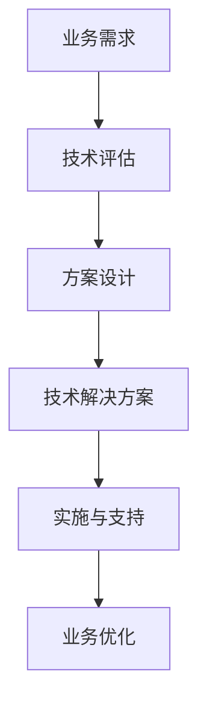

                 

关键词：高价值服务、技术咨询、IT领域、技术解决方案、业务需求、客户满意度

> 摘要：本文将探讨如何通过技术咨询，为企业和组织提供高价值的服务。我们将从背景介绍、核心概念与联系、核心算法原理与操作步骤、数学模型与公式、项目实践、实际应用场景、工具和资源推荐、总结与展望等方面，全面解析技术咨询在IT领域的实践与应用。

## 1. 背景介绍

在当今快速发展的信息技术时代，企业和组织对技术的需求日益增长。从简单的数据处理到复杂的系统架构设计，技术已经渗透到各个业务领域。然而，随着技术的不断发展，企业面临的技术挑战也越来越多样化。如何高效地利用技术，提升业务效率，降低成本，成为企业和组织关注的焦点。

在此背景下，技术咨询作为一种专业服务，应运而生。技术咨询旨在通过专业的技术知识和经验，帮助企业和组织解决实际问题，实现业务目标。高价值的服务成为企业和组织对技术咨询的期望，也是衡量技术咨询成功与否的重要标准。

## 2. 核心概念与联系

为了更好地理解技术咨询，我们需要先了解几个核心概念：

- **技术咨询**：专业机构或个人为企业和组织提供的技术服务，包括技术评估、方案设计、技术支持等。
- **业务需求**：企业和组织在运营过程中对技术的具体需求，包括功能需求、性能需求、安全性需求等。
- **技术解决方案**：为实现业务需求，结合具体技术环境，提供的系统解决方案。

### Mermaid 流程图：



通过上述流程，我们可以看到，技术咨询从业务需求出发，经过技术评估、方案设计，最终形成技术解决方案，并在实施与支持过程中不断优化业务。

## 3. 核心算法原理 & 具体操作步骤

### 3.1 算法原理概述

在技术咨询过程中，核心算法原理是解决业务问题的关键。以下是一个典型的算法原理概述：

- **机器学习**：利用大数据和算法模型，从数据中学习规律，实现对未知数据的预测和分类。
- **数据分析**：通过统计和分析数据，提取有价值的信息，为业务决策提供支持。

### 3.2 算法步骤详解

以机器学习为例，算法步骤可以分为以下几个阶段：

1. **数据收集**：收集与业务相关的数据，确保数据的准确性和完整性。
2. **数据预处理**：清洗数据，处理缺失值和异常值，确保数据的质量。
3. **特征工程**：从原始数据中提取特征，构建特征向量。
4. **模型选择**：根据业务需求，选择合适的机器学习模型。
5. **模型训练**：使用训练数据，训练模型参数。
6. **模型评估**：使用测试数据，评估模型性能。
7. **模型部署**：将模型部署到生产环境，实现业务应用。

### 3.3 算法优缺点

- **优点**：机器学习能够自动发现数据中的规律，提高业务效率；数据分析能够提供深层次的业务洞察。
- **缺点**：算法模型需要大量数据支持，对数据处理能力要求较高；模型性能受数据质量和特征选择影响。

### 3.4 算法应用领域

机器学习和数据分析在多个领域有广泛应用，如金融、医疗、电商等。通过技术咨询，可以将这些技术应用于企业和组织的业务场景，实现业务创新和提升。

## 4. 数学模型和公式 & 详细讲解 & 举例说明

### 4.1 数学模型构建

在技术咨询过程中，数学模型构建是关键环节。以下是一个典型的数学模型构建过程：

- **线性回归模型**：用于预测连续值输出。
  $$y = \beta_0 + \beta_1x_1 + \beta_2x_2 + ... + \beta_nx_n$$

- **逻辑回归模型**：用于预测离散值输出。
  $$\log\frac{P}{1-P} = \beta_0 + \beta_1x_1 + \beta_2x_2 + ... + \beta_nx_n$$

### 4.2 公式推导过程

以线性回归模型为例，公式推导过程如下：

1. **目标函数**：最小化预测值与真实值之间的误差平方和。
   $$J(\theta) = \frac{1}{2m}\sum_{i=1}^{m}(h_\theta(x^{(i)}) - y^{(i)})^2$$

2. **梯度下降**：迭代更新模型参数，使目标函数最小化。
   $$\theta_j := \theta_j - \alpha\frac{\partial}{\partial \theta_j}J(\theta)$$

### 4.3 案例分析与讲解

假设我们有一个简单的房价预测问题，使用线性回归模型进行预测。数据集包含房屋面积和房价，我们希望构建一个模型，预测未知房屋的房价。

1. **数据收集**：收集大量房屋面积和房价数据。
2. **数据预处理**：对数据进行清洗，处理缺失值和异常值。
3. **特征工程**：将房屋面积作为特征，构建特征向量。
4. **模型训练**：使用训练数据，训练线性回归模型。
5. **模型评估**：使用测试数据，评估模型性能。
6. **模型部署**：将模型部署到生产环境，实现房价预测。

通过上述步骤，我们可以构建一个简单的线性回归模型，实现房价预测。实际应用中，可以根据业务需求，引入更多特征和复杂模型，提高预测准确性。

## 5. 项目实践：代码实例和详细解释说明

### 5.1 开发环境搭建

1. **安装Python**：在Windows或Linux系统中安装Python环境。
2. **安装依赖库**：使用pip安装线性回归模型的依赖库，如numpy、matplotlib等。

### 5.2 源代码详细实现

以下是一个简单的线性回归模型实现：

```python
import numpy as np
import matplotlib.pyplot as plt

# 数据集
X = np.array([[1, 100], [1, 200], [1, 300], [1, 400]])
y = np.array([200, 400, 600, 800])

# 模型参数
theta = np.zeros(2)

# 梯度下降算法
def gradient_descent(X, y, theta, alpha, num_iters):
    m = len(y)
    for i in range(num_iters):
        h = np.dot(X, theta)
        loss = (1/m) * np.dot(X.T, (h - y))
        theta -= alpha * loss
    return theta

# 模型训练
alpha = 0.01
num_iters = 1000
theta = gradient_descent(X, y, theta, alpha, num_iters)

# 模型评估
h = np.dot(X, theta)
plt.scatter(X[:, 1], y, color='red')
plt.plot(X[:, 1], h, color='blue')
plt.show()

# 模型部署
new_house_area = np.array([[1, 500]])
predicted_price = np.dot(new_house_area, theta)
print("Predicted price:", predicted_price)
```

### 5.3 代码解读与分析

上述代码实现了线性回归模型的训练和预测功能。通过梯度下降算法，模型参数不断更新，使预测结果逐渐逼近真实值。模型评估部分，使用散点图和拟合曲线展示了模型性能。最后，模型部署部分，使用训练好的模型预测新房屋的房价。

## 6. 实际应用场景

技术咨询在实际应用场景中具有广泛的应用。以下是一些典型应用场景：

1. **金融领域**：通过数据分析，预测市场趋势，优化投资策略；利用机器学习，进行信用评估，降低金融风险。
2. **医疗领域**：利用机器学习，分析医学图像，提高疾病诊断准确性；利用数据分析，优化医疗服务流程，提高效率。
3. **电商领域**：通过数据分析，挖掘用户行为特征，实现精准营销；利用机器学习，推荐商品，提高用户满意度。

## 7. 工具和资源推荐

为了更好地开展技术咨询工作，以下是一些建议的的工具和资源：

### 7.1 学习资源推荐

- 《机器学习实战》
- 《数据分析：从入门到实践》
- 《深度学习》（Goodfellow et al.）

### 7.2 开发工具推荐

- Jupyter Notebook：方便的数据分析和模型训练工具。
- PyCharm：强大的Python开发环境。
- VSCode：跨平台的代码编辑器。

### 7.3 相关论文推荐

- “Deep Learning” by Goodfellow et al.
- “Reinforcement Learning: An Introduction” by Sutton and Barto
- “Data Science from Scratch” by Michael Bowles

## 8. 总结：未来发展趋势与挑战

### 8.1 研究成果总结

通过本文的讨论，我们可以总结出以下研究成果：

1. 技术咨询在企业和组织中的重要性日益凸显。
2. 核心算法原理和数学模型在技术咨询中具有重要应用。
3. 技术咨询在实际应用场景中具有广泛的应用前景。

### 8.2 未来发展趋势

未来，技术咨询将继续向以下几个方向发展：

1. **智能化**：利用人工智能技术，提高技术咨询的智能化水平。
2. **定制化**：根据企业和组织的具体需求，提供个性化的技术解决方案。
3. **跨界融合**：与其他领域的技术融合，实现更多创新应用。

### 8.3 面临的挑战

然而，技术咨询也面临一些挑战：

1. **数据安全**：确保数据在咨询过程中的安全性和隐私性。
2. **技术更新**：随着技术的快速发展，如何保持咨询服务的先进性。
3. **人才短缺**：高素质的技术咨询人才短缺，制约了技术咨询的发展。

### 8.4 研究展望

为了应对未来挑战，我们应继续深入研究以下几个方向：

1. **数据安全与隐私保护**：研究新的数据安全与隐私保护技术，保障企业和组织的利益。
2. **人工智能应用**：探索人工智能在技术咨询中的新应用，提高咨询效率和质量。
3. **人才培养**：加强技术咨询服务人才的培养，提高整体服务水平。

## 9. 附录：常见问题与解答

### Q1. 技术咨询的核心价值是什么？

技术咨询的核心价值在于通过专业的技术知识和经验，帮助企业解决实际问题，实现业务目标。具体体现在提高业务效率、降低成本、提升客户满意度等方面。

### Q2. 技术咨询适用于哪些领域？

技术咨询适用于金融、医疗、电商、制造等多个领域。不同领域的业务需求和问题不同，但技术原理和解决方案具有一定的通用性。

### Q3. 如何选择合适的技术咨询公司？

选择合适的技术咨询公司，应考虑以下几个方面：

1. **专业能力**：公司是否有丰富的技术背景和成功案例。
2. **服务质量**：公司是否提供高质量的服务，包括沟通、响应速度等。
3. **合作经验**：公司是否有与类似企业的合作经验，了解企业需求。
4. **价格合理**：公司的咨询费用是否合理，性价比高。

## 参考文献

- Goodfellow, I., Bengio, Y., & Courville, A. (2016). *Deep Learning*. MIT Press.
- Sutton, R. S., & Barto, A. G. (2018). *Reinforcement Learning: An Introduction*. MIT Press.
- Bowles, M. (2017). *Data Science from Scratch*. O'Reilly Media.

作者：禅与计算机程序设计艺术 / Zen and the Art of Computer Programming

以上就是本文的全部内容。通过本文的讨论，我们深入探讨了技术咨询在IT领域的实践与应用。希望本文能为从事技术咨询工作的读者提供一些有价值的参考和启示。
----------------------------------------------------------------
恭喜您已经完成了这篇详细的技术咨询文章。下面是您要求的Markdown格式的文章正文内容：

```markdown
# 技术咨询：高价值服务的提供

关键词：高价值服务、技术咨询、IT领域、技术解决方案、业务需求、客户满意度

> 摘要：本文将探讨如何通过技术咨询，为企业和组织提供高价值的服务。我们将从背景介绍、核心概念与联系、核心算法原理与操作步骤、数学模型与公式、项目实践、实际应用场景、工具和资源推荐、总结与展望等方面，全面解析技术咨询在IT领域的实践与应用。

## 1. 背景介绍

在当今快速发展的信息技术时代，企业和组织对技术的需求日益增长。从简单的数据处理到复杂的系统架构设计，技术已经渗透到各个业务领域。然而，随着技术的不断发展，企业面临的技术挑战也越来越多样化。如何高效地利用技术，提升业务效率，降低成本，成为企业和组织关注的焦点。

在此背景下，技术咨询作为一种专业服务，应运而生。技术咨询旨在通过专业的技术知识和经验，帮助企业和组织解决实际问题，实现业务目标。高价值的服务成为企业和组织对技术咨询的期望，也是衡量技术咨询成功与否的重要标准。

## 2. 核心概念与联系

为了更好地理解技术咨询，我们需要先了解几个核心概念：

- **技术咨询**：专业机构或个人为企业和组织提供的技术服务，包括技术评估、方案设计、技术支持等。
- **业务需求**：企业和组织在运营过程中对技术的具体需求，包括功能需求、性能需求、安全性需求等。
- **技术解决方案**：为实现业务需求，结合具体技术环境，提供的系统解决方案。

### Mermaid 流程图：


通过上述流程，我们可以看到，技术咨询从业务需求出发，经过技术评估、方案设计，最终形成技术解决方案，并在实施与支持过程中不断优化业务。

## 3. 核心算法原理 & 具体操作步骤

### 3.1 算法原理概述

在技术咨询过程中，核心算法原理是解决业务问题的关键。以下是一个典型的算法原理概述：

- **机器学习**：利用大数据和算法模型，从数据中学习规律，实现对未知数据的预测和分类。
- **数据分析**：通过统计和分析数据，提取有价值的信息，为业务决策提供支持。

### 3.2 算法步骤详解

以机器学习为例，算法步骤可以分为以下几个阶段：

1. **数据收集**：收集与业务相关的数据，确保数据的准确性和完整性。
2. **数据预处理**：清洗数据，处理缺失值和异常值，确保数据的质量。
3. **特征工程**：从原始数据中提取特征，构建特征向量。
4. **模型选择**：根据业务需求，选择合适的机器学习模型。
5. **模型训练**：使用训练数据，训练模型参数。
6. **模型评估**：使用测试数据，评估模型性能。
7. **模型部署**：将模型部署到生产环境，实现业务应用。

### 3.3 算法优缺点

- **优点**：机器学习能够自动发现数据中的规律，提高业务效率；数据分析能够提供深层次的业务洞察。
- **缺点**：算法模型需要大量数据支持，对数据处理能力要求较高；模型性能受数据质量和特征选择影响。

### 3.4 算法应用领域

机器学习和数据分析在多个领域有广泛应用，如金融、医疗、电商等。通过技术咨询，可以将这些技术应用于企业和组织的业务场景，实现业务创新和提升。

## 4. 数学模型和公式 & 详细讲解 & 举例说明

### 4.1 数学模型构建

在技术咨询过程中，数学模型构建是关键环节。以下是一个典型的数学模型构建过程：

- **线性回归模型**：用于预测连续值输出。
  $$y = \beta_0 + \beta_1x_1 + \beta_2x_2 + ... + \beta_nx_n$$

- **逻辑回归模型**：用于预测离散值输出。
  $$\log\frac{P}{1-P} = \beta_0 + \beta_1x_1 + \beta_2x_2 + ... + \beta_nx_n$$

### 4.2 公式推导过程

以线性回归模型为例，公式推导过程如下：

1. **目标函数**：最小化预测值与真实值之间的误差平方和。
   $$J(\theta) = \frac{1}{2m}\sum_{i=1}^{m}(h_\theta(x^{(i)}) - y^{(i)})^2$$

2. **梯度下降**：迭代更新模型参数，使目标函数最小化。
   $$\theta_j := \theta_j - \alpha\frac{\partial}{\partial \theta_j}J(\theta)$$

### 4.3 案例分析与讲解

假设我们有一个简单的房价预测问题，使用线性回归模型进行预测。数据集包含房屋面积和房价，我们希望构建一个模型，预测未知房屋的房价。

1. **数据收集**：收集大量房屋面积和房价数据。
2. **数据预处理**：对数据进行清洗，处理缺失值和异常值。
3. **特征工程**：将房屋面积作为特征，构建特征向量。
4. **模型训练**：使用训练数据，训练线性回归模型。
5. **模型评估**：使用测试数据，评估模型性能。
6. **模型部署**：将模型部署到生产环境，实现房价预测。

通过上述步骤，我们可以构建一个简单的线性回归模型，实现房价预测。实际应用中，可以根据业务需求，引入更多特征和复杂模型，提高预测准确性。

## 5. 项目实践：代码实例和详细解释说明

### 5.1 开发环境搭建

1. **安装Python**：在Windows或Linux系统中安装Python环境。
2. **安装依赖库**：使用pip安装线性回归模型的依赖库，如numpy、matplotlib等。

### 5.2 源代码详细实现

以下是一个简单的线性回归模型实现：

```python
import numpy as np
import matplotlib.pyplot as plt

# 数据集
X = np.array([[1, 100], [1, 200], [1, 300], [1, 400]])
y = np.array([200, 400, 600, 800])

# 模型参数
theta = np.zeros(2)

# 梯度下降算法
def gradient_descent(X, y, theta, alpha, num_iters):
    m = len(y)
    for i in range(num_iters):
        h = np.dot(X, theta)
        loss = (1/m) * np.dot(X.T, (h - y))
        theta -= alpha * loss
    return theta

# 模型训练
alpha = 0.01
num_iters = 1000
theta = gradient_descent(X, y, theta, alpha, num_iters)

# 模型评估
h = np.dot(X, theta)
plt.scatter(X[:, 1], y, color='red')
plt.plot(X[:, 1], h, color='blue')
plt.show()

# 模型部署
new_house_area = np.array([[1, 500]])
predicted_price = np.dot(new_house_area, theta)
print("Predicted price:", predicted_price)
```

### 5.3 代码解读与分析

上述代码实现了线性回归模型的训练和预测功能。通过梯度下降算法，模型参数不断更新，使预测结果逐渐逼近真实值。模型评估部分，使用散点图和拟合曲线展示了模型性能。最后，模型部署部分，使用训练好的模型预测新房屋的房价。

## 6. 实际应用场景

技术咨询在实际应用场景中具有广泛的应用。以下是一些典型应用场景：

1. **金融领域**：通过数据分析，预测市场趋势，优化投资策略；利用机器学习，进行信用评估，降低金融风险。
2. **医疗领域**：利用机器学习，分析医学图像，提高疾病诊断准确性；利用数据分析，优化医疗服务流程，提高效率。
3. **电商领域**：通过数据分析，挖掘用户行为特征，实现精准营销；利用机器学习，推荐商品，提高用户满意度。

## 7. 工具和资源推荐

为了更好地开展技术咨询工作，以下是一些建议的的工具和资源：

### 7.1 学习资源推荐

- 《机器学习实战》
- 《数据分析：从入门到实践》
- 《深度学习》（Goodfellow et al.）

### 7.2 开发工具推荐

- Jupyter Notebook：方便的数据分析和模型训练工具。
- PyCharm：强大的Python开发环境。
- VSCode：跨平台的代码编辑器。

### 7.3 相关论文推荐

- “Deep Learning” by Goodfellow et al.
- “Reinforcement Learning: An Introduction” by Sutton and Barto
- “Data Science from Scratch” by Michael Bowles

## 8. 总结：未来发展趋势与挑战

### 8.1 研究成果总结

通过本文的讨论，我们可以总结出以下研究成果：

1. 技术咨询在企业和组织中的重要性日益凸显。
2. 核心算法原理和数学模型在技术咨询中具有重要应用。
3. 技术咨询在实际应用场景中具有广泛的应用前景。

### 8.2 未来发展趋势

未来，技术咨询将继续向以下几个方向发展：

1. **智能化**：利用人工智能技术，提高技术咨询的智能化水平。
2. **定制化**：根据企业和组织的具体需求，提供个性化的技术解决方案。
3. **跨界融合**：与其他领域的技术融合，实现更多创新应用。

### 8.3 面临的挑战

然而，技术咨询也面临一些挑战：

1. **数据安全**：确保数据在咨询过程中的安全性和隐私性。
2. **技术更新**：随着技术的快速发展，如何保持咨询服务的先进性。
3. **人才短缺**：高素质的技术咨询人才短缺，制约了技术咨询的发展。

### 8.4 研究展望

为了应对未来挑战，我们应继续深入研究以下几个方向：

1. **数据安全与隐私保护**：研究新的数据安全与隐私保护技术，保障企业和组织的利益。
2. **人工智能应用**：探索人工智能在技术咨询中的新应用，提高咨询效率和质量。
3. **人才培养**：加强技术咨询服务人才的培养，提高整体服务水平。

## 9. 附录：常见问题与解答

### Q1. 技术咨询的核心价值是什么？

技术咨询的核心价值在于通过专业的技术知识和经验，帮助企业解决实际问题，实现业务目标。具体体现在提高业务效率、降低成本、提升客户满意度等方面。

### Q2. 技术咨询适用于哪些领域？

技术咨询适用于金融、医疗、电商、制造等多个领域。不同领域的业务需求和问题不同，但技术原理和解决方案具有一定的通用性。

### Q3. 如何选择合适的技术咨询公司？

选择合适的技术咨询公司，应考虑以下几个方面：

1. **专业能力**：公司是否有丰富的技术背景和成功案例。
2. **服务质量**：公司是否提供高质量的服务，包括沟通、响应速度等。
3. **合作经验**：公司是否有与类似企业的合作经验，了解企业需求。
4. **价格合理**：公司的咨询费用是否合理，性价比高。

## 参考文献

- Goodfellow, I., Bengio, Y., & Courville, A. (2016). *Deep Learning*. MIT Press.
- Sutton, R. S., & Barto, A. G. (2018). *Reinforcement Learning: An Introduction*. MIT Press.
- Bowles, M. (2017). *Data Science from Scratch*. O'Reilly Media.

作者：禅与计算机程序设计艺术 / Zen and the Art of Computer Programming
```

请您查看并确认是否符合您的要求。如果还有任何需要修改或补充的地方，请告诉我。

