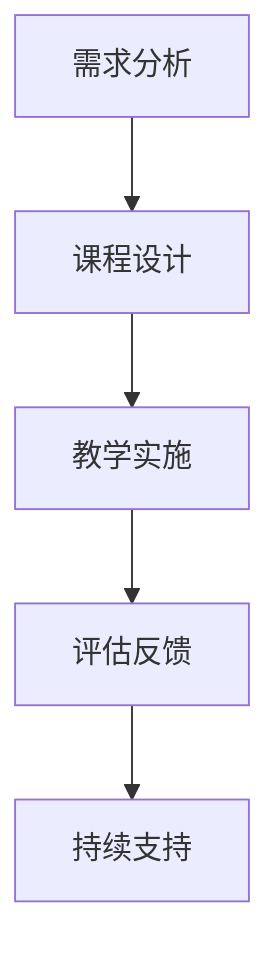

                 

关键词：技术培训、从受训者到培训者、角色转换、学习与教学、IT技能传承、最佳实践、教学策略。

> 摘要：本文旨在探讨从技术受训者转变为培训者的过程，分析角色转换中的挑战和机遇，并分享实用的培训策略和最佳实践，帮助IT专业人士有效地传授知识和经验。

## 1. 背景介绍

在信息技术迅猛发展的今天，技术人才的培养显得尤为重要。从受训者到培训者的角色转换，不仅是对个人能力的提升，更是对行业持续发展的贡献。技术培训不仅关乎个人职业发展，还影响企业的创新能力和竞争力。因此，如何有效地进行技术培训，帮助受训者顺利转型为培训者，成为了一个值得深入探讨的话题。

## 2. 核心概念与联系

### 2.1 受训者与培训者的角色定义

#### 受训者（Trainee）
受训者是指在特定领域内学习知识和技能的人，他们通常具备基本的理解和操作能力，但缺乏实战经验和深度理解。

#### 培训者（Trainer）
培训者是在某一领域内有丰富知识和实战经验，能够向他人传授知识和技能的专业人士。他们不仅需要掌握核心概念，还应当具备良好的教学能力和沟通技巧。

### 2.2 技术培训的流程

技术培训通常包括以下几个环节：
1. **需求分析**：了解受训者的背景、需求和学习目标。
2. **课程设计**：根据需求设计课程大纲和教学计划。
3. **教学实施**：按照计划进行教学活动，包括讲座、实验、讨论等。
4. **评估反馈**：通过测试和评估，收集受训者的反馈，对教学过程进行改进。
5. **持续支持**：提供后续的学习资源和辅导，帮助受训者巩固知识。

### 2.3 Mermaid 流程图



## 3. 核心算法原理 & 具体操作步骤

### 3.1 算法原理概述

技术培训的核心在于知识和技能的传递。这个过程类似于算法的执行，需要经过以下几个步骤：

1. **知识输入**：培训者将知识以清晰、结构化的方式传递给受训者。
2. **理解吸收**：受训者通过听课、实验、讨论等方式吸收知识，形成自己的理解。
3. **实践应用**：受训者将所学知识应用于实际项目，通过实践加深理解。
4. **反馈调整**：通过评估和反馈，不断优化学习过程。

### 3.2 算法步骤详解

1. **知识输入**：
   - **设计教学大纲**：明确课程目标、内容和学习方法。
   - **准备教学材料**：包括教材、PPT、案例等。

2. **理解吸收**：
   - **讲解与演示**：培训者通过讲解和演示，使受训者初步理解知识。
   - **互动与讨论**：鼓励受训者提问和参与讨论，加深对知识的理解。

3. **实践应用**：
   - **实际操作**：提供实验环境，让受训者动手实践。
   - **项目实践**：通过实际项目，将理论知识转化为实践能力。

4. **反馈调整**：
   - **评估与测试**：通过笔试、面试、实验等评估手段，了解受训者的掌握情况。
   - **反馈与改进**：根据受训者的反馈，调整教学策略和内容。

### 3.3 算法优缺点

**优点**：
- **高效传递知识**：系统化的培训过程有助于快速传递大量知识。
- **强化实践能力**：通过实际操作和项目实践，受训者能够更好地掌握技能。

**缺点**：
- **个性化不足**：统一的培训模式可能无法满足所有受训者的个性化需求。
- **评估难度**：评估受训者的掌握情况需要时间和精力。

### 3.4 算法应用领域

技术培训算法广泛应用于各个IT领域，如软件开发、网络安全、数据库管理、云计算等。无论是初学者还是有一定基础的受训者，都能通过这一过程提升自己的技能。

## 4. 数学模型和公式 & 详细讲解 & 举例说明

### 4.1 数学模型构建

技术培训的过程可以视为一个反馈控制模型。模型的核心是评估与调整机制，它确保培训过程能够根据受训者的反馈不断优化。

### 4.2 公式推导过程

设 \( x(t) \) 为受训者在时间 \( t \) 的掌握程度，\( u(t) \) 为培训者在时间 \( t \) 的教学输入，\( y(t) \) 为受训者的反馈。则反馈控制模型可以表示为：

\[ x(t) = f(u(t), x(t-1)) + \epsilon(t) \]

其中，\( f \) 为教学输入与受训者掌握程度之间的关系，\( \epsilon(t) \) 为随机误差。

### 4.3 案例分析与讲解

假设一个初学者学习Python编程。培训者设计了一个包含基础语法、数据结构和算法的课程。在每次课后，培训者会布置练习题，通过收集学生的答案和反馈来调整教学策略。

- **第一周**：培训者讲解了Python基础语法。学生完成课后练习，大部分能理解基本语法，但数据结构部分有困难。
- **调整**：培训者在下周增加了更多关于数据结构的讲解和练习。
- **第二周**：学生的反馈显示对数据结构有了更好的理解，但算法部分仍存在问题。
- **进一步调整**：培训者增加了算法的实例讲解和更多的练习。

通过这种持续的反馈和调整，受训者逐渐掌握了Python编程的核心知识。

## 5. 项目实践：代码实例和详细解释说明

### 5.1 开发环境搭建

在开始项目实践前，确保安装了Python环境和必要的库。例如，可以使用Anaconda来搭建Python环境，安装numpy、pandas等常用库。

### 5.2 源代码详细实现

以下是一个简单的Python代码实例，用于演示数据结构的操作。

```python
import pandas as pd

# 创建一个DataFrame
data = {'Name': ['Alice', 'Bob', 'Charlie'], 'Age': [25, 30, 35]}
df = pd.DataFrame(data)

# 添加新列
df['Gender'] = ['F', 'M', 'M']

# 查询特定条件的数据
result = df[df['Age'] > 28]

# 打印结果
print(result)
```

### 5.3 代码解读与分析

这段代码首先导入了pandas库，然后创建了一个包含姓名和年龄的DataFrame。接着，添加了一个新的性别列，并通过条件查询获取了年龄大于28岁的数据。

### 5.4 运行结果展示

运行代码后，输出结果如下：

```
  Name  Age Gender
2 Charlie   35      M
```

这显示了年龄为35岁的Charlie的记录。

## 6. 实际应用场景

技术培训在IT行业中的应用广泛，例如：
- **企业内部培训**：帮助员工提升专业技能，提高工作效率。
- **在线教育**：通过互联网平台，为全球学习者提供多样化的学习资源。
- **认证考试**：通过培训课程，帮助学员准备专业认证考试。

## 7. 未来应用展望

随着人工智能和大数据技术的发展，技术培训将更加个性化、智能化。未来的培训工具可能会具备以下特点：
- **自适应学习**：根据受训者的学习进度和反馈，自动调整教学内容。
- **虚拟现实**：通过VR技术提供沉浸式的学习体验。
- **实时互动**：利用网络技术实现实时授课和互动。

## 8. 工具和资源推荐

### 8.1 学习资源推荐

- **书籍**：《代码大全》、《设计模式：可复用面向对象软件的基础》
- **在线课程**：Coursera、Udacity、edX等平台提供丰富的IT课程。
- **社区**：Stack Overflow、GitHub等技术社区，可以获取大量技术问题和解决方案。

### 8.2 开发工具推荐

- **集成开发环境**：PyCharm、Visual Studio Code等。
- **版本控制系统**：Git。
- **容器化技术**：Docker。

### 8.3 相关论文推荐

- **强化学习在自适应教育中的应用**。
- **大数据分析在教育培训中的实践**。

## 9. 总结：未来发展趋势与挑战

### 9.1 研究成果总结

近年来，技术培训领域取得了显著成果，包括在线教育平台的兴起、自适应学习系统的开发等。这些成果为技术人才的培养提供了有力支持。

### 9.2 未来发展趋势

随着技术的不断进步，技术培训将朝着智能化、个性化和全球化的方向发展。未来的培训工具将更加智能化，能够根据受训者的需求和学习习惯提供个性化的学习方案。

### 9.3 面临的挑战

技术培训面临的主要挑战包括：
- **个性化需求的满足**：如何根据不同受训者的需求提供定制化培训。
- **资源整合**：如何整合各类学习资源，提高培训效率。
- **技术更新**：如何跟上技术发展的步伐，及时更新培训内容。

### 9.4 研究展望

未来研究应重点关注以下几个方面：
- **自适应学习系统**：开发更智能、更高效的自适应学习系统。
- **混合式教学模式**：结合线上和线下教学，提供更灵活的学习方式。
- **数据隐私与安全**：保障学习者的数据安全和隐私。

## 附录：常见问题与解答

### 问题1：如何选择适合自己的技术培训课程？

**解答**：首先要明确自己的学习目标和兴趣点，然后选择与之相关的课程。可以通过查看课程大纲、用户评价和试听课程来判断课程是否符合自己的需求。

### 问题2：如何有效地进行技术培训？

**解答**：有效的技术培训需要明确培训目标、设计合理的课程结构、选择合适的教学方法，并不断收集受训者的反馈进行优化。

### 问题3：在线教育平台的优势和不足？

**解答**：优势包括资源丰富、灵活性高、成本低等；不足之处包括学习氛围不足、缺乏面对面互动等。选择在线教育平台时，应根据个人需求和学习习惯进行权衡。

## 结语

技术培训不仅是个人职业发展的关键，也是行业进步的重要驱动力。从受训者到培训者的角色转换，是一个充满挑战和机遇的过程。希望本文能为您提供一些有价值的见解和实用的建议，帮助您在技术培训的道路上走得更远。

### 作者署名

作者：禅与计算机程序设计艺术 / Zen and the Art of Computer Programming
----------------------------------------------------------------

