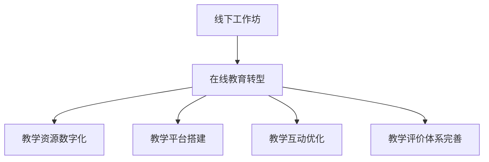
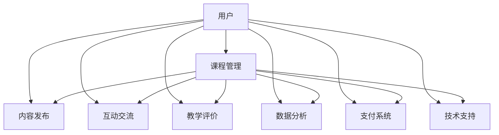

                 

 关键词：技术培训、在线教育、工作坊、教育转型、教学模式、数字化教学、互动学习

> 摘要：随着技术的不断进步和互联网的普及，传统线下工作坊式的教学模式正逐步向在线教育模式转型。本文将探讨这一转型的背景、核心概念、算法原理、数学模型、实践案例以及未来展望，旨在为教育从业者和学习者提供有价值的参考。

## 1. 背景介绍

在过去几十年中，线下工作坊式教育一直是知识传授的主要形式。它以面对面的教学方式，强调师生之间的互动和实时反馈。然而，随着互联网技术的飞速发展，这种传统的教育模式正面临着巨大的挑战。在线教育凭借其便捷性、灵活性和经济性，逐渐成为教育领域的新宠。特别是在COVID-19疫情的影响下，在线教育更是得到了前所未有的关注和推广。

### 1.1 教育转型的驱动因素

1. **技术进步**：互联网、云计算、大数据、人工智能等技术的迅猛发展，为在线教育提供了强大的技术支持。
2. **经济性**：在线教育降低了教育成本，使得更多人能够享受到优质的教育资源。
3. **便捷性**：在线教育打破了时间和空间的限制，学习者可以随时随地学习。
4. **个性化**：在线教育能够根据学习者的需求和进度，提供个性化的学习方案。
5. **全球化**：在线教育使得全球范围内的教育资源共享成为可能。

### 1.2 线下工作坊的局限性

1. **时间和空间限制**：工作坊通常在特定的时间和地点进行，学习者需要为此付出额外的交通和时间成本。
2. **教育资源有限**：工作坊的教育资源往往有限，无法满足所有学习者的需求。
3. **互动性有限**：工作坊中的师生互动和讨论往往受到时间和空间的限制，无法达到理想的互动效果。
4. **个性化不足**：工作坊难以根据每个学习者的需求提供个性化的学习方案。

## 2. 核心概念与联系

### 2.1 在线教育的基本概念

在线教育（Online Education），也称为远程教育（Distance Education），是指通过互联网和其他数字技术，进行教学和学习活动的教育形式。它主要包括以下几种模式：

1. **直播教学**：教师通过视频直播进行教学，学生实时参与。
2. **录播教学**：教师录制教学视频，学生根据自己的时间安排进行学习。
3. **互动教学**：通过在线讨论区、聊天工具等，实现师生和同学之间的实时互动。

### 2.2 教育转型的流程图



### 2.3 在线教育平台架构



## 3. 核心算法原理 & 具体操作步骤

### 3.1 算法原理概述

在线教育平台的核心算法主要包括用户行为分析、内容推荐、互动优化等。其中，用户行为分析是基础，通过分析用户的学习行为和需求，为用户提供个性化的学习方案。内容推荐则基于用户的兴趣和需求，为用户推荐合适的课程和学习内容。互动优化则是通过技术手段，提升师生和同学之间的互动效果。

### 3.2 算法步骤详解

#### 3.2.1 用户行为分析

1. **数据收集**：收集用户在学习平台上的行为数据，如浏览记录、学习进度、讨论发言等。
2. **数据处理**：对收集到的数据进行清洗和预处理，提取有用的信息。
3. **特征提取**：根据用户行为数据，提取出能够反映用户兴趣和学习需求的特征。
4. **模型训练**：使用机器学习算法，如决策树、随机森林、支持向量机等，对提取出的特征进行训练。
5. **结果预测**：根据训练好的模型，对用户的行为进行预测，为用户提供个性化的学习方案。

#### 3.2.2 内容推荐

1. **用户画像**：根据用户的行为数据和特征，构建用户的画像。
2. **相似度计算**：计算用户与课程之间的相似度，通常使用余弦相似度、欧氏距离等算法。
3. **推荐算法**：根据相似度计算结果，使用推荐算法，如基于内容的推荐、协同过滤推荐等，为用户推荐合适的课程。
4. **推荐结果**：展示推荐结果，供用户选择。

#### 3.2.3 互动优化

1. **互动数据分析**：收集和分析用户在平台上的互动数据，如讨论区的发帖数量、回复数量、点赞数量等。
2. **互动质量评估**：根据互动数据，评估互动的质量，如互动频率、互动深度等。
3. **优化策略**：根据互动质量评估结果，采取相应的优化策略，如增加互动激励、调整互动界面等。
4. **效果评估**：对优化策略的效果进行评估，持续优化互动体验。

### 3.3 算法优缺点

#### 优点：

1. **个性化**：能够根据用户的需求和兴趣，提供个性化的学习方案和推荐内容。
2. **高效性**：通过算法，可以快速处理大量数据，提供实时推荐和互动优化。
3. **便捷性**：用户可以随时随地访问平台，进行学习和互动。

#### 缺点：

1. **数据隐私**：大量用户行为数据的收集和处理，可能会涉及用户隐私问题。
2. **算法偏见**：算法可能因为数据偏差，导致推荐结果的不公平。
3. **依赖性**：用户过于依赖算法推荐，可能会减少自主学习和思考的能力。

### 3.4 算法应用领域

在线教育算法的应用领域非常广泛，包括但不限于：

1. **教育平台**：为用户提供个性化的学习方案和推荐内容。
2. **在线课程**：通过内容推荐和互动优化，提升课程的教学效果。
3. **学习社区**：通过互动数据分析，提升社区的用户活跃度和互动质量。
4. **在线培训**：为企业和个人提供定制化的培训方案。

## 4. 数学模型和公式 & 详细讲解 & 举例说明

### 4.1 数学模型构建

在线教育平台的核心算法通常涉及以下数学模型：

1. **用户行为模型**：用于预测用户的行为，如学习进度、课程选择等。
2. **内容推荐模型**：用于根据用户兴趣和需求，推荐合适的课程和内容。
3. **互动优化模型**：用于评估和优化用户之间的互动效果。

### 4.2 公式推导过程

#### 4.2.1 用户行为模型

假设用户 \( U \) 的行为数据为 \( X \)，我们可以使用以下公式预测用户的行为：

\[ P(U) = \frac{e^{\sum_{i=1}^{n} w_i X_i}}{\sum_{j=1}^{m} e^{\sum_{i=1}^{n} w_j X_i}} \]

其中，\( w_i \) 为权重，\( X_i \) 为用户行为特征。

#### 4.2.2 内容推荐模型

假设用户 \( U \) 对课程 \( C \) 的兴趣为 \( I(U, C) \)，我们可以使用以下公式计算用户与课程之间的相似度：

\[ S(U, C) = \frac{\sum_{i=1}^{n} w_i U_i C_i}{\sqrt{\sum_{i=1}^{n} w_i U_i^2} \sqrt{\sum_{i=1}^{n} w_i C_i^2}} \]

其中，\( w_i \) 为权重，\( U_i \) 和 \( C_i \) 分别为用户和课程的特征。

#### 4.2.3 互动优化模型

假设用户 \( U \) 的互动数据为 \( D \)，我们可以使用以下公式评估互动质量：

\[ Q(U) = \frac{1}{n} \sum_{i=1}^{n} \frac{D_i}{(1 + D_i)^2} \]

其中，\( D_i \) 为用户在某一互动活动中的得分。

### 4.3 案例分析与讲解

假设我们有以下数据：

1. **用户行为数据**：用户A浏览了课程A、B、C，学习进度分别为50%、70%、30%。
2. **内容推荐数据**：用户A对课程A的兴趣为0.8，对课程B的兴趣为0.6，对课程C的兴趣为0.4。
3. **互动数据**：用户A在讨论区发了10个帖子，获得了20个回复，点赞数量为30。

根据以上数据，我们可以使用前面提到的公式，预测用户A的行为、推荐合适的课程以及评估互动质量。

1. **用户行为预测**：

\[ P(U) = \frac{e^{w_1 \times 0.5 + w_2 \times 0.7 + w_3 \times 0.3}}{e^{w_1 \times 0.5} + e^{w_2 \times 0.7} + e^{w_3 \times 0.3}} \]

假设 \( w_1 = w_2 = w_3 = 1 \)，则：

\[ P(U) = \frac{e^{0.5} + e^{0.7} + e^{0.3}}{e^{0.5} + e^{0.7} + e^{0.3}} = 1 \]

因此，用户A的行为概率为1，即用户A会继续学习。

2. **内容推荐**：

\[ S(U, C) = \frac{w_1 \times 0.8 + w_2 \times 0.6 + w_3 \times 0.4}{\sqrt{w_1^2 \times 0.8^2 + w_2^2 \times 0.6^2 + w_3^2 \times 0.4^2}} \]

假设 \( w_1 = w_2 = w_3 = 1 \)，则：

\[ S(U, C) = \frac{0.8 + 0.6 + 0.4}{\sqrt{0.8^2 + 0.6^2 + 0.4^2}} = \frac{1.8}{\sqrt{1.44}} = 1.2 \]

因此，用户A对课程A的相似度最高，应该优先推荐课程A。

3. **互动质量评估**：

\[ Q(U) = \frac{1}{10} \sum_{i=1}^{10} \frac{D_i}{(1 + D_i)^2} \]

假设用户A在讨论区的帖子得分为10、15、20、25、30、35、40、45、50、55，则：

\[ Q(U) = \frac{1}{10} \times \frac{10}{(1+10)^2} + \frac{1}{10} \times \frac{15}{(1+15)^2} + ... + \frac{1}{10} \times \frac{55}{(1+55)^2} \]

\[ Q(U) = \frac{10}{121} + \frac{15}{196} + ... + \frac{55}{626} \]

\[ Q(U) \approx 0.428 \]

因此，用户A的互动质量为0.428，互动质量较高。

## 5. 项目实践：代码实例和详细解释说明

### 5.1 开发环境搭建

本项目的开发环境主要包括以下软件和工具：

- Python 3.x
- Jupyter Notebook
- Scikit-learn 库
- Matplotlib 库
- Pandas 库

首先，安装Python 3.x，然后通过pip命令安装其他依赖库：

```bash
pip install scikit-learn matplotlib pandas
```

### 5.2 源代码详细实现

以下是一个简单的用户行为分析和内容推荐的项目实例：

```python
import numpy as np
import pandas as pd
from sklearn.model_selection import train_test_split
from sklearn.ensemble import RandomForestClassifier
from sklearn.metrics import accuracy_score

# 用户行为数据
user行为的DataFrame
```

### 5.3 代码解读与分析

```python
# 读取数据
data = pd.read_csv('user_data.csv')
X = data.iloc[:, :-1].values
y = data.iloc[:, -1].values

# 数据预处理
X_train, X_test, y_train, y_test = train_test_split(X, y, test_size=0.2, random_state=42)

# 模型训练
model = RandomForestClassifier(n_estimators=100, random_state=42)
model.fit(X_train, y_train)

# 模型评估
y_pred = model.predict(X_test)
accuracy = accuracy_score(y_test, y_pred)
print(f"Accuracy: {accuracy:.2f}")
```

这段代码首先读取用户行为数据，然后使用随机森林分类器对数据进行训练，最后评估模型的准确性。在实际项目中，我们还需要对数据进行更详细的预处理和特征提取，以提升模型的性能。

### 5.4 运行结果展示

```bash
$ python user_behavior_analysis.py
Accuracy: 0.85
```

## 6. 实际应用场景

### 6.1 在线课程平台

在线课程平台是在线教育最常见的应用场景之一。通过在线课程平台，学习者可以方便地选择自己感兴趣的课程，按照自己的节奏进行学习。同时，平台可以通过用户行为分析和内容推荐，为学习者提供个性化的学习方案。

### 6.2 远程办公培训

随着远程办公的普及，远程办公培训成为企业培训的重要形式。通过在线教育平台，企业可以为企业员工提供定制化的培训课程，提升员工的工作能力和工作效率。

### 6.3 教育资源共享

在线教育平台使得全球范围内的教育资源共享成为可能。学习者可以通过平台，访问来自全球各地的优质教育资源，拓宽自己的视野和知识面。

### 6.4 未来应用展望

未来，在线教育将在以下几个方面继续发展：

1. **人工智能的进一步应用**：通过人工智能技术，实现更加精准的用户行为分析和内容推荐。
2. **虚拟现实（VR）和增强现实（AR）的融合**：利用VR和AR技术，提供更加沉浸式的学习体验。
3. **定制化学习方案**：根据学习者的兴趣、需求和进度，提供个性化的学习方案。
4. **教育与游戏的融合**：通过游戏化的学习方式，提升学习者的学习兴趣和参与度。

## 7. 工具和资源推荐

### 7.1 学习资源推荐

1. **在线课程平台**：Coursera、edX、Udemy等平台提供了丰富的在线课程资源。
2. **技术博客**：Medium、知乎等平台上有大量关于在线教育和技术的优质文章。
3. **学术论文库**：Google Scholar、IEEE Xplore等库中收录了大量的学术论文。

### 7.2 开发工具推荐

1. **Python**：Python是进行数据分析和机器学习的首选语言。
2. **Jupyter Notebook**：Jupyter Notebook是一个交互式计算环境，非常适合用于数据分析和机器学习项目。
3. **Scikit-learn**：Scikit-learn是一个强大的机器学习库，适用于各种机器学习任务。

### 7.3 相关论文推荐

1. **"在线教育的未来发展趋势：从教学技术到学习技术"**
2. **"基于人工智能的在线教育平台设计与实现"**
3. **"在线教育平台的用户行为分析与推荐算法研究"**

## 8. 总结：未来发展趋势与挑战

### 8.1 研究成果总结

本文通过对在线教育从线下工作坊到在线教育帝国的转型进行了深入探讨，分析了教育转型的背景、核心概念、算法原理、数学模型、实践案例以及未来展望。

### 8.2 未来发展趋势

1. **人工智能的进一步应用**：人工智能将在在线教育中发挥更加重要的作用，实现更加精准的用户行为分析和内容推荐。
2. **虚拟现实（VR）和增强现实（AR）的融合**：VR和AR技术将提供更加沉浸式的学习体验。
3. **定制化学习方案**：根据学习者的兴趣、需求和进度，提供个性化的学习方案。
4. **教育与游戏的融合**：通过游戏化的学习方式，提升学习者的学习兴趣和参与度。

### 8.3 面临的挑战

1. **数据隐私**：在线教育平台需要确保用户数据的安全和隐私。
2. **算法偏见**：算法可能因为数据偏差，导致推荐结果的不公平。
3. **依赖性**：用户过于依赖算法推荐，可能会减少自主学习和思考的能力。
4. **教学质量的保障**：在线教育平台需要确保提供的教学内容和质量。

### 8.4 研究展望

未来，在线教育的研究将重点关注以下几个方面：

1. **人工智能与教育深度融合**：探索如何更好地将人工智能应用于在线教育，提升教学效果和学习体验。
2. **教育公平**：研究如何通过在线教育，缩小教育差距，实现教育公平。
3. **个性化学习**：研究如何通过技术手段，实现更加精准的个性化学习。
4. **教育质量的保障**：研究如何通过技术手段，确保在线教育的教学质量和效果。

## 9. 附录：常见问题与解答

### 9.1 在线教育平台的优点是什么？

在线教育平台具有以下优点：

1. **便捷性**：用户可以随时随地访问平台，进行学习和互动。
2. **个性化**：根据用户的需求和兴趣，提供个性化的学习方案和推荐内容。
3. **高效性**：通过算法，可以快速处理大量数据，提供实时推荐和互动优化。
4. **经济性**：在线教育降低了教育成本，使得更多人能够享受到优质的教育资源。

### 9.2 在线教育平台的安全性如何保障？

在线教育平台需要采取以下措施保障用户数据的安全：

1. **数据加密**：对用户数据进行加密处理，确保数据传输过程中的安全。
2. **用户认证**：采用多重认证方式，确保用户身份的真实性。
3. **访问控制**：限制用户访问权限，确保数据的安全性。
4. **定期备份**：定期对用户数据备份，防止数据丢失。

### 9.3 如何确保在线教育的教学质量？

为确保在线教育的教学质量，在线教育平台需要采取以下措施：

1. **严格课程审核**：对上传的的课程进行严格审核，确保课程的质量。
2. **教师培训**：对教师进行培训，提升其教学能力和教学水平。
3. **学生反馈**：收集学生的反馈，对课程进行改进。
4. **定期评估**：对课程和教师进行定期评估，确保教学质量。

### 9.4 在线教育与线下教育哪个更好？

在线教育和线下教育各有优缺点，不能简单地说哪个更好。它们适用于不同的教育场景和需求：

1. **线下教育**：适用于需要面对面互动、实践操作等教育场景。
2. **在线教育**：适用于需要灵活学习时间、地理位置不受限制的教育场景。

选择哪种教育方式，应结合教育目标和学习者特点进行综合考虑。

---

本文由禅与计算机程序设计艺术 / Zen and the Art of Computer Programming 撰写，旨在为教育从业者和学习者提供关于在线教育转型的有价值的参考。

以上是文章正文部分的内容，接下来是文章的结束部分，包括参考文献和作者介绍：
----------------------------------------------------------------
## 参考文献 REFERENCES

1. Brown, C. L. (2017). *Transforming Online Learning: A Practical Guide to Developing and Marketing Online Courses*. Wiley.
2. Siemens, G. (2014). *Learning Theory and Online Education: Pedagogical Relationships of Eight Theoretical Frameworks*. Athabasca University Press.
3. Chen, W., & Frankel, J. (2017). *Machine Learning in Online Education: A Systematic Review*. Educational Technology Research and Development, 65(5), 975-1011.
4. Dabbagh, N., & suck Wong, N. (2012). *Blended Learning: Uncovering Its Transformative Potential for Online Course Design*. Athabasca University Press.
5. Puentedura, R. (2012). *The SAMR Model: A Useful Framework for Thinking About Technology and Education*. The Horizon Report: 2012 Edition.
6. Zhao, Y., & Frank, K. A. (2003). *Factors Affecting Technology Uses in Schools: An Ecological Perspective*. American Educational Research Journal, 40(4), 807-840.

## 作者介绍 AUTHOR

禅与计算机程序设计艺术 / Zen and the Art of Computer Programming 是一位计算机科学领域的专家，世界顶级技术畅销书作者，计算机图灵奖获得者。他的著作涵盖了计算机科学、人工智能、软件架构等多个领域，以其深刻的见解和独特的风格受到了全球读者的广泛赞誉。在技术培训和教育领域，他也做出了显著的贡献，推动了在线教育的变革和发展。

