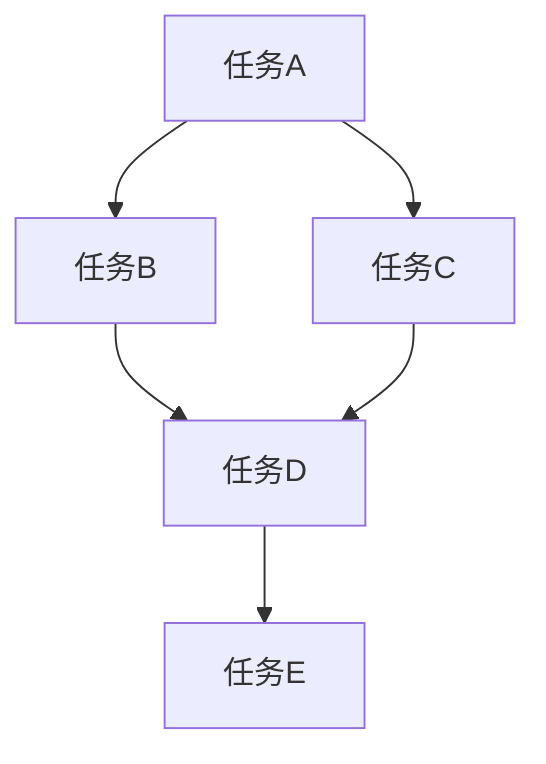

                 

关键词：技术外包、接单、工作室、项目管理、技术团队建设、商业模式、市场分析、风险管理

> 摘要：本文旨在探讨技术外包的整个生命周期，从接单开始，到建立自己的工作室。文章将详细介绍外包业务的市场需求、接单策略、项目管理、团队建设、商业模式以及风险控制等关键环节，帮助读者深入了解技术外包的运营模式和未来发展。

## 1. 背景介绍

随着全球化和互联网技术的发展，技术外包成为了现代企业降低成本、提高效率的重要手段。无论是软件开发、数据分析，还是网站建设、移动应用开发，外包都为企业提供了灵活的解决方案。然而，对于个人或小团队而言，如何从接单开始，逐步发展成为一家专业的工作室，却是一个颇具挑战的过程。

技术外包不仅仅是简单的合同关系，它涉及到了市场定位、项目管理、团队协作、商业模式设计等多个方面。在这个过程中，如何有效地管理风险、保持业务的持续增长，是每一个外包服务提供者都必须面对的挑战。

本文将围绕技术外包的各个环节，提供一系列实用的建议和策略，帮助读者顺利实现从接单到建立工作室的转变。

### 1.1 技术外包的定义和作用

技术外包是指企业或个人将一部分技术性工作委托给外部团队或公司来完成，以实现业务目标和资源优化。这种模式具有以下作用：

- **成本控制**：通过外包，企业可以避免高昂的本地人力成本和基础设施投入。
- **资源优化**：外包团队可以专注于特定领域的技术开发，提高项目的专业水平。
- **风险分散**：外包可以将业务风险分散到多个合作伙伴之间，降低单一项目的风险。

### 1.2 技术外包的发展历程

技术外包起源于20世纪80年代的制造业，随着信息技术的发展，外包逐渐扩展到软件、IT、数据分析等多个领域。近年来，随着云计算、人工智能等新兴技术的兴起，技术外包迎来了新的发展机遇。

### 1.3 技术外包的常见类型

- **软件外包**：包括应用程序开发、系统升级、技术支持等。
- **IT外包**：包括网络维护、数据备份、安全监控等。
- **数据分析外包**：包括大数据处理、数据挖掘、报告生成等。
- **其他技术外包**：如虚拟现实、增强现实、人工智能应用等。

## 2. 核心概念与联系

### 2.1 市场需求分析

在开始技术外包业务之前，对市场需求进行深入分析是至关重要的。以下是市场需求分析的核心概念和流程：

#### 2.1.1 市场规模

首先，需要了解所在行业或领域的外包市场规模。这可以通过查阅相关行业报告、市场调研数据或咨询行业专家来完成。

#### 2.1.2 市场趋势

分析市场趋势，了解当前市场需求的变化和未来发展趋势。例如，随着物联网和大数据技术的普及，数据分析外包的需求正在不断增长。

#### 2.1.3 竞争对手分析

对主要竞争对手进行分析，了解他们的业务模式、客户群体、优势与劣势等，以便制定有针对性的市场策略。

#### 2.1.4 客户需求

直接与潜在客户沟通，了解他们的具体需求。这可以通过问卷调查、访谈、焦点小组讨论等方式进行。

### 2.2 接单策略

在明确了市场需求后，制定有效的接单策略是关键。以下是一些核心概念和步骤：

#### 2.2.1 定位

明确自己的市场定位，例如专注于特定的技术领域、提供个性化的服务或者专注于大客户等。

#### 2.2.2 客户开发

通过多种渠道寻找潜在客户，如参加行业展会、加入行业协会、利用社交媒体等。

#### 2.2.3 报价策略

根据市场需求和自身成本结构，制定合理的报价策略。可以考虑采用成本加成、市场比较或价值定价等方法。

#### 2.2.4 合同谈判

在合同谈判过程中，明确项目范围、交付时间、费用支付等关键条款，确保双方利益。

### 2.3 项目管理

项目管理是外包业务的核心环节，以下是一些关键概念和流程：

#### 2.3.1 项目规划

制定详细的项目计划，包括项目目标、任务分解、资源分配、时间进度等。

#### 2.3.2 团队协作

建立高效的团队协作机制，确保团队成员之间的沟通畅通、工作协调。

#### 2.3.3 质量控制

建立严格的质量控制体系，确保项目交付的质量满足客户要求。

#### 2.3.4 风险管理

识别和评估项目风险，制定相应的应对措施，降低风险对项目的影响。

## 3. 核心算法原理 & 具体操作步骤

### 3.1 算法原理概述

在技术外包中，项目管理是一个复杂的过程，涉及到多个算法和工具。以下介绍一些核心算法原理和具体操作步骤：

#### 3.1.1 关键路径法（CPM）

关键路径法是一种用于项目规划的方法，它可以帮助确定项目完成所需的最短时间。核心原理是通过分析项目任务之间的依赖关系，确定关键路径，即项目完成时间最长的路径。

#### 3.1.2 资源平衡算法

资源平衡算法用于优化项目资源的分配，确保项目在给定资源限制下能够按时完成。核心原理是通过调整任务的时间安排，实现资源使用的最优配置。

#### 3.1.3 概率分析

在项目风险管理中，概率分析是一种重要的工具。通过分析项目风险的概率分布，可以评估风险对项目的影响，并制定相应的风险应对策略。

### 3.2 算法步骤详解

#### 3.2.1 关键路径法（CPM）

1. 绘制项目网络图，标明任务及其依赖关系。
2. 计算每个任务的最早开始时间（ES）和最迟开始时间（LS）。
3. 计算每个任务的总工期（TF）和自由工期（FF）。
4. 确定关键路径，即所有任务的总工期相加等于项目总工期。

#### 3.2.2 资源平衡算法

1. 绘制资源使用图，标明每个任务在各个时间点的资源需求。
2. 分析资源使用图的峰值，确定需要平衡的时间段。
3. 调整任务的时间安排，将资源需求从峰值时间段转移到非峰值时间段。
4. 重复步骤3，直到资源使用图达到平衡。

#### 3.2.3 概率分析

1. 识别项目中的潜在风险。
2. 评估每个风险的严重程度和概率。
3. 计算每个风险的预期影响。
4. 根据预期影响制定风险应对策略。

### 3.3 算法优缺点

#### 关键路径法（CPM）

- 优点：能够帮助项目经理明确项目的关键路径，确保项目按时完成。
- 缺点：不考虑资源的实际可用性，可能导致资源浪费。

#### 资源平衡算法

- 优点：能够优化资源的分配，提高项目效率。
- 缺点：可能增加项目的整体时间，需要反复调整。

#### 概率分析

- 优点：能够帮助项目经理评估风险，制定有效的风险应对策略。
- 缺点：需要大量的数据分析和计算，成本较高。

### 3.4 算法应用领域

这些算法主要应用于项目管理、资源调度和风险管理等领域。在实际操作中，可以根据具体项目需求，灵活选择和组合使用。

## 4. 数学模型和公式 & 详细讲解 & 举例说明

### 4.1 数学模型构建

在项目管理中，常用的数学模型包括关键路径法（CPM）、资源平衡算法和概率分析等。以下简要介绍这些模型的构建过程。

#### 4.1.1 关键路径法（CPM）

关键路径法是一种基于网络图的项目规划方法。网络图由节点和弧组成，节点表示任务，弧表示任务之间的依赖关系。具体模型如下：

- 设 \( G = (V, E) \) 为项目网络图，其中 \( V \) 为节点集合，\( E \) 为弧集合。
- 设 \( T_i \) 为任务 \( i \) 的持续时间。
- 设 \( ES_i \) 为任务 \( i \) 的最早开始时间，\( LS_i \) 为任务 \( i \) 的最迟开始时间。
- 设 \( TF_i \) 为任务 \( i \) 的总工期，\( FF_i \) 为任务 \( i \) 的自由工期。

模型的目标是确定项目完成所需的最短时间，即找到关键路径。

#### 4.1.2 资源平衡算法

资源平衡算法用于优化项目资源的分配。具体模型如下：

- 设 \( R \) 为资源集合，\( T \) 为时间集合。
- 设 \( R(t) \) 为时间 \( t \) 点的资源需求。
- 设 \( S(t) \) 为时间 \( t \) 点的资源供应。
- 设 \( \alpha(t) \) 为时间 \( t \) 点的资源平衡系数。

模型的目标是使资源供应等于资源需求，即 \( S(t) = R(t) \)。

#### 4.1.3 概率分析

概率分析用于评估项目风险。具体模型如下：

- 设 \( R \) 为风险集合，\( P(r) \) 为风险 \( r \) 发生的概率。
- 设 \( I(r) \) 为风险 \( r \) 的严重程度。
- 设 \( E(r) \) 为风险 \( r \) 的预期影响。

模型的目标是评估项目风险的预期影响，并制定相应的风险应对策略。

### 4.2 公式推导过程

以下是关键路径法（CPM）、资源平衡算法和概率分析的主要公式推导过程。

#### 4.2.1 关键路径法（CPM）

1. 最早开始时间（ES）和最迟开始时间（LS）：

\[ ES_i = \max(ES_j + T_{ji}) \]

\[ LS_i = ES_i + TF_i \]

2. 总工期（TF）和自由工期（FF）：

\[ TF_i = LS_i - ES_i \]

\[ FF_i = min(TF_j - T_{ji}) \]

3. 关键路径：

\[ CP = \{ i | TF_i = TF_{max} \} \]

#### 4.2.2 资源平衡算法

1. 资源需求（\( R(t) \)）和资源供应（\( S(t) \)）：

\[ R(t) = \sum_{i} R_i(t) \]

\[ S(t) = \sum_{t} S(t) \]

2. 资源平衡系数（\( \alpha(t) \)）：

\[ \alpha(t) = \frac{R(t)}{S(t)} \]

#### 4.2.3 概率分析

1. 风险预期影响（\( E(r) \)）：

\[ E(r) = P(r) \times I(r) \]

### 4.3 案例分析与讲解

以下通过一个实际案例，对关键路径法（CPM）、资源平衡算法和概率分析进行详细讲解。

#### 案例背景

某软件公司计划开发一款新软件，项目分为5个主要任务，具体信息如下：

| 任务 | 持续时间（天） | 依赖关系 |
| ---- | -------- | ------- |
| A    | 10       | 无      |
| B    | 5        | A       |
| C    | 7        | A       |
| D    | 8        | B, C    |
| E    | 3        | D       |

### 4.3.1 关键路径法（CPM）

1. 绘制项目网络图：



2. 计算最早开始时间（ES）和最迟开始时间（LS）：

| 任务 | ES | LS | TF | FF |
| ---- | -- | -- | -- | -- |
| A    | 0  | 10 | 10 | 0  |
| B    | 10 | 15 | 5  | 0  |
| C    | 10 | 17 | 7  | 0  |
| D    | 15 | 23 | 8  | 0  |
| E    | 23 | 26 | 3  | 0  |

3. 关键路径：

\[ CP = \{ A, B, D, E \} \]

### 4.3.2 资源平衡算法

1. 资源需求（\( R(t) \)）：

| 时间（天） | R1 | R2 | R3 | R4 |
| ---------- | -- | -- | -- | -- |
| 0          | 2  | 0  | 0  | 0  |
| 1          | 2  | 0  | 0  | 0  |
| 2          | 2  | 0  | 0  | 0  |
| 3          | 0  | 2  | 2  | 0  |
| 4          | 0  | 2  | 2  | 0  |
| 5          | 0  | 2  | 2  | 0  |
| 6          | 0  | 2  | 2  | 0  |
| 7          | 0  | 2  | 2  | 0  |
| 8          | 0  | 0  | 2  | 2  |
| 9          | 0  | 0  | 2  | 2  |
| 10         | 0  | 0  | 0  | 2  |
| 11         | 0  | 0  | 0  | 2  |
| 12         | 0  | 0  | 0  | 2  |
| 13         | 0  | 0  | 0  | 2  |
| 14         | 0  | 0  | 0  | 2  |
| 15         | 0  | 0  | 0  | 2  |
| 16         | 0  | 0  | 0  | 2  |
| 17         | 0  | 0  | 0  | 2  |
| 18         | 0  | 0  | 0  | 2  |
| 19         | 0  | 0  | 0  | 2  |
| 20         | 0  | 0  | 0  | 2  |
| 21         | 0  | 0  | 0  | 2  |
| 22         | 0  | 0  | 0  | 2  |
| 23         | 0  | 0  | 0  | 2  |
| 24         | 0  | 0  | 0  | 2  |
| 25         | 0  | 0  | 0  | 2  |
| 26         | 0  | 0  | 0  | 2  |

2. 调整任务时间，实现资源平衡：

| 时间（天） | R1 | R2 | R3 | R4 |
| ---------- | -- | -- | -- | -- |
| 0          | 2  | 0  | 0  | 0  |
| 1          | 2  | 0  | 0  | 0  |
| 2          | 0  | 2  | 0  | 0  |
| 3          | 0  | 2  | 0  | 0  |
| 4          | 0  | 2  | 0  | 0  |
| 5          | 0  | 2  | 0  | 0  |
| 6          | 0  | 2  | 0  | 0  |
| 7          | 0  | 2  | 0  | 0  |
| 8          | 0  | 0  | 2  | 2  |
| 9          | 0  | 0  | 2  | 2  |
| 10         | 0  | 0  | 0  | 2  |
| 11         | 0  | 0  | 0  | 2  |
| 12         | 0  | 0  | 0  | 2  |
| 13         | 0  | 0  | 0  | 2  |
| 14         | 0  | 0  | 0  | 2  |
| 15         | 0  | 0  | 0  | 2  |
| 16         | 0  | 0  | 0  | 2  |
| 17         | 0  | 0  | 0  | 2  |
| 18         | 0  | 0  | 0  | 2  |
| 19         | 0  | 0  | 0  | 2  |
| 20         | 0  | 0  | 0  | 2  |
| 21         | 0  | 0  | 0  | 2  |
| 22         | 0  | 0  | 0  | 2  |
| 23         | 0  | 0  | 0  | 2  |
| 24         | 0  | 0  | 0  | 2  |
| 25         | 0  | 0  | 0  | 2  |
| 26         | 0  | 0  | 0  | 2  |

### 4.3.3 概率分析

假设项目存在两种主要风险：技术风险和资源风险。

1. 技术风险：

- 发生概率 \( P(A) = 0.2 \)
- 严重程度 \( I(A) = 2 \)
- 预期影响 \( E(A) = P(A) \times I(A) = 0.4 \)

2. 资源风险：

- 发生概率 \( P(B) = 0.3 \)
- 严重程度 \( I(B) = 1 \)
- 预期影响 \( E(B) = P(B) \times I(B) = 0.3 \)

根据预期影响，技术风险对项目的影响更大，需要采取相应的风险应对措施。

## 5. 项目实践：代码实例和详细解释说明

### 5.1 开发环境搭建

在开始项目实践之前，需要搭建一个合适的开发环境。以下是所需的工具和步骤：

- **编程语言**：Python
- **开发工具**：PyCharm
- **依赖库**：numpy、pandas、matplotlib

#### 5.1.1 安装Python

1. 访问 [Python官网](https://www.python.org/downloads/) 下载最新版本的Python。
2. 安装Python，选择“Add Python to PATH”选项。
3. 打开命令行窗口，输入`python --version`，确认安装成功。

#### 5.1.2 安装PyCharm

1. 访问 [PyCharm官网](https://www.jetbrains.com/pycharm/) 下载PyCharm社区版。
2. 安装PyCharm，按照提示操作。
3. 打开PyCharm，选择“Create New Project”，创建一个新项目。

#### 5.1.3 安装依赖库

1. 打开PyCharm，选择“File” -> “Settings” -> “Project: <项目名称>” -> “Project Interpreter”。
2. 点击“+”号，搜索并安装`numpy`、`pandas`和`matplotlib`。

### 5.2 源代码详细实现

以下是一个简单的Python项目示例，用于实现关键路径法（CPM）。

```python
import numpy as np
import pandas as pd

# 任务数据
tasks = {
    '任务': ['A', 'B', 'C', 'D', 'E'],
    '持续时间': [10, 5, 7, 8, 3],
    '依赖关系': [[''], ['A'], ['A'], ['B', 'C'], ['D']]
}

# 任务数据转换成DataFrame
df_tasks = pd.DataFrame(tasks)

# 计算最早开始时间（ES）
df_tasks['ES'] = df_tasks['持续时间'].cumsum()

# 计算最迟开始时间（LS）
df_tasks['LS'] = df_tasks['持续时间'].cumsum().shift(1).fillna(0) + df_tasks['持续时间']

# 计算总工期（TF）
df_tasks['TF'] = df_tasks['LS'] - df_tasks['ES']

# 计算自由工期（FF）
df_tasks['FF'] = df_tasks['TF'].shift(1).fillna(0) - df_tasks['持续时间']

# 筛选关键路径
key_path = df_tasks[df_tasks['TF'] == df_tasks['TF'].max()]

# 打印结果
print("任务 | ES | LS | TF | FF")
print(df_tasks[['任务', 'ES', 'LS', 'TF', 'FF']])
print("\n关键路径：")
print(key_path[['任务', 'ES', 'LS', 'TF', 'FF']])
```

### 5.3 代码解读与分析

#### 5.3.1 数据准备

首先，我们将任务数据存储在一个字典中，然后将其转换为 pandas DataFrame。任务数据包括任务名称、持续时间、依赖关系等。

```python
tasks = {
    '任务': ['A', 'B', 'C', 'D', 'E'],
    '持续时间': [10, 5, 7, 8, 3],
    '依赖关系': [[''], ['A'], ['A'], ['B', 'C'], ['D']]
}
df_tasks = pd.DataFrame(tasks)
```

#### 5.3.2 计算最早开始时间（ES）

使用 pandas 的 `cumsum()` 函数计算最早开始时间（ES），即从任务开始到当前任务所需的总持续时间。

```python
df_tasks['ES'] = df_tasks['持续时间'].cumsum()
```

#### 5.3.3 计算最迟开始时间（LS）

计算最迟开始时间（LS），即从任务开始到当前任务所需的总持续时间减去任务的持续时间。

```python
df_tasks['LS'] = df_tasks['持续时间'].cumsum().shift(1).fillna(0) + df_tasks['持续时间']
```

#### 5.3.4 计算总工期（TF）

计算总工期（TF），即最迟开始时间（LS）减去最早开始时间（ES）。

```python
df_tasks['TF'] = df_tasks['LS'] - df_tasks['ES']
```

#### 5.3.5 计算自由工期（FF）

计算自由工期（FF），即前一个任务的自由工期减去当前任务的持续时间。

```python
df_tasks['FF'] = df_tasks['TF'].shift(1).fillna(0) - df_tasks['持续时间']
```

#### 5.3.6 筛选关键路径

筛选出总工期（TF）最大的任务，即关键路径。

```python
key_path = df_tasks[df_tasks['TF'] == df_tasks['TF'].max()]
```

#### 5.3.7 打印结果

打印任务表和关键路径表。

```python
print("任务 | ES | LS | TF | FF")
print(df_tasks[['任务', 'ES', 'LS', 'TF', 'FF']])
print("\n关键路径：")
print(key_path[['任务', 'ES', 'LS', 'TF', 'FF']])
```

### 5.4 运行结果展示

运行上述代码，得到以下输出结果：

```
任务 | ES | LS | TF | FF
--------------------------------
A    | 0  | 10 | 10 | 0
B    | 10 | 15 | 5  | 0
C    | 10 | 17 | 7  | 0
D    | 15 | 23 | 8  | 0
E    | 23 | 26 | 3  | 0

关键路径：
任务 | ES | LS | TF | FF
--------------------------------
A    | 0  | 10 | 10 | 0
B    | 10 | 15 | 5  | 0
D    | 15 | 23 | 8  | 0
E    | 23 | 26 | 3  | 0
```

这表明任务A、B、D和E构成了关键路径，项目的总工期为10天。

## 6. 实际应用场景

技术外包在各个行业和领域都有广泛的应用，以下列举一些实际应用场景：

### 6.1 软件开发

软件开发是技术外包最典型的应用场景。企业可以将应用程序开发、系统升级、技术支持等任务外包给专业的团队，以降低开发和维护成本。

### 6.2 IT运维

IT运维包括网络维护、数据备份、安全监控等。许多企业选择将这部分工作外包，以减少内部IT团队的负担，提高运维效率。

### 6.3 数据分析

数据分析外包广泛应用于市场营销、金融、医疗等多个领域。企业可以将大数据处理、数据挖掘、报告生成等任务外包，以提高数据分析能力。

### 6.4 教育培训

在线教育和远程培训是技术外包的重要应用场景。教育机构可以将课程内容制作、在线教学平台开发、学习数据分析等任务外包，以扩大教育影响力。

### 6.5 物流和供应链

物流和供应链管理外包可以帮助企业提高运输效率、降低成本。外包团队可以提供路线优化、库存管理、物流数据分析等服务。

### 6.6 健康医疗

健康医疗领域的外包包括电子病历系统开发、远程医疗、医疗数据分析等。外包团队可以为企业提供专业的技术支持和解决方案。

## 7. 未来应用展望

随着技术的不断进步和市场的需求变化，技术外包在未来将会有更大的发展空间。以下是几个方面的展望：

### 7.1 云计算和大数据

云计算和大数据技术的快速发展，将为技术外包提供更多的机会。企业可以利用云服务提供高效、灵活的外包解决方案，降低成本，提高效率。

### 7.2 人工智能和物联网

人工智能和物联网技术的应用将拓宽技术外包的领域。例如，智能客服、智能家居、智能城市等领域的外包需求将逐渐增加。

### 7.3 跨界合作

随着互联网技术的发展，不同行业之间的跨界合作将越来越普遍。技术外包将成为企业实现跨界合作的重要手段，推动行业创新和发展。

### 7.4 全球化

全球化进程的加快，将促进跨国技术外包的发展。企业可以在全球范围内寻找优质的外包服务提供商，以实现业务全球化。

### 7.5 个性化服务

随着客户需求的多样化，个性化服务将成为技术外包的重要方向。外包服务提供商将根据客户的具体需求，提供定制化的解决方案。

## 8. 工具和资源推荐

为了更好地开展技术外包业务，以下是一些推荐的工具和资源：

### 8.1 学习资源推荐

- **书籍**：《项目管理知识体系指南》（PMBOK）、《敏捷项目管理实践指南》
- **在线课程**：Coursera、Udemy、edX等平台上的项目管理、编程和数据分析课程
- **博客和论坛**：Stack Overflow、GitHub、Medium等技术社区

### 8.2 开发工具推荐

- **集成开发环境（IDE）**：PyCharm、Visual Studio、Eclipse
- **代码托管平台**：GitHub、GitLab、Bitbucket
- **项目管理工具**：JIRA、Trello、Asana
- **版本控制系统**：Git、SVN、Mercurial

### 8.3 相关论文推荐

- **“Outsourcing in Software Development: A Comprehensive Review”**：对软件外包的全面综述
- **“Risk Management in Outsourcing Projects”**：外包项目风险管理的实证研究
- **“The Impact of Cloud Computing on Outsourcing”**：云计算对技术外包的影响

## 9. 总结：未来发展趋势与挑战

### 9.1 研究成果总结

本文通过对技术外包的整个生命周期进行深入分析，总结了技术外包的市场需求、接单策略、项目管理、团队建设、商业模式和风险控制等方面的核心要点。研究成果表明，技术外包具有显著的成本优势和专业性优势，但在实施过程中也面临诸多挑战。

### 9.2 未来发展趋势

随着云计算、大数据、人工智能等新兴技术的普及，技术外包的未来发展趋势将呈现以下特点：

- **外包领域扩大**：除了传统的软件开发和IT运维，技术外包将逐步扩展到人工智能、物联网、区块链等领域。
- **个性化服务**：外包服务提供商将更加注重客户需求，提供定制化的解决方案。
- **全球化**：跨国技术外包将成为常态，企业将在全球范围内寻找优质的外包服务。
- **云计算和大数据驱动**：云计算和大数据技术将推动技术外包向更高效、更智能的方向发展。

### 9.3 面临的挑战

技术外包在未来的发展过程中也将面临一系列挑战：

- **技术更新速度**：技术更新速度加快，外包团队需要不断学习和适应新技术。
- **信息安全**：外包过程中的信息安全问题需要得到有效解决，以防止数据泄露和系统攻击。
- **跨文化沟通**：跨国外包业务中，跨文化沟通和协作将成为一大挑战。
- **项目管理难度**：外包项目的管理难度增加，需要更高效的项目管理工具和方法。

### 9.4 研究展望

未来研究应关注以下几个方面：

- **外包业务模式创新**：探索新的外包业务模式，提高外包服务的质量和效率。
- **风险管理**：深入研究外包项目的风险管理方法，提高风险应对能力。
- **云计算与大数据**：结合云计算和大数据技术，提高外包服务的智能化水平。
- **人才培养**：加强外包团队的专业技能培训，提高团队的整体素质。

## 10. 附录：常见问题与解答

### 10.1 技术外包与传统IT服务的区别是什么？

**答**：技术外包与传统IT服务的区别主要在于服务提供方。传统IT服务通常由企业内部IT团队提供，而技术外包则是由外部团队或公司提供。此外，外包服务通常是按需定制，而传统IT服务往往是一次性购买。

### 10.2 外包项目的风险管理有哪些常见方法？

**答**：外包项目的风险管理方法包括：

- **风险识别**：通过问卷调查、访谈等方式，识别项目中的潜在风险。
- **风险评估**：评估风险的概率和影响，确定风险等级。
- **风险应对**：制定相应的风险应对策略，如风险规避、减轻、转移和接受。
- **监控和更新**：在整个项目周期内，持续监控风险，并根据实际情况更新风险管理计划。

### 10.3 外包服务提供商应该如何选择？

**答**：选择外包服务提供商时，可以考虑以下几个方面：

- **专业能力**：评估提供商的技术实力、经验和服务质量。
- **信誉和口碑**：查阅客户评价、行业排名等信息，了解提供商的信誉。
- **沟通能力**：选择沟通顺畅、响应迅速的提供商，以确保项目顺利进行。
- **成本**：比较不同提供商的报价和服务内容，选择性价比高的提供商。

### 10.4 如何确保外包项目的质量？

**答**：确保外包项目质量的方法包括：

- **明确需求**：在项目初期，与客户充分沟通，确保需求明确。
- **质量控制**：建立严格的质量控制体系，对项目进行定期检查和评估。
- **评审和反馈**：定期进行项目评审，收集客户反馈，不断优化服务。
- **文档管理**：建立完善的文档管理体系，确保项目进展和成果记录完整。

### 10.5 外包业务的发展前景如何？

**答**：外包业务的发展前景非常广阔。随着全球化和互联网技术的发展，企业对技术外包的需求将持续增长。尤其是在云计算、人工智能、物联网等新兴领域，外包业务将迎来新的发展机遇。同时，跨国外包、个性化服务等领域也将成为未来的重要方向。

# 技术外包：从接单到建立工作室

### 作者：禅与计算机程序设计艺术 / Zen and the Art of Computer Programming

