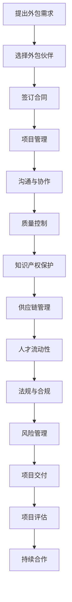

                 

## 1. 背景介绍

在当今快速变化的技术世界中，初创企业和中小型企业（SMBs）面临着巨大的竞争压力和资源限制。技术创新和软件开发往往需要庞大的资金投入和专业技术团队的支持，这对资源有限的创业公司来说是一个巨大的挑战。在这种背景下，技术外包作为一种灵活、成本效益高的解决方案，越来越受到创业者的青睐。

技术外包是指企业将某些技术项目或任务外包给外部专业团队或公司完成。这种方式能够帮助企业降低成本、缩短项目开发周期，同时提高项目的成功率。特别是在软件开发领域，外包已经成为一种常见的合作模式。例如，许多初创公司会选择将前端开发、后端开发、移动应用开发等任务外包给专业的软件外包公司，以便集中精力在核心业务上。

然而，技术外包并非没有风险。外包过程中可能存在沟通障碍、质量控制问题、知识产权保护等问题，这些都需要创业者在选择外包合作伙伴时进行充分考虑。因此，本文将深入探讨技术外包的各个方面，帮助创业者理解其优势、风险以及如何选择合适的外包伙伴。

本文将按照以下结构进行论述：

- **背景介绍**：简要介绍技术外包的概念和重要性。
- **核心概念与联系**：阐述技术外包的核心概念及其在软件开发过程中的作用。
- **核心算法原理 & 具体操作步骤**：介绍选择合适外包伙伴的方法和关键步骤。
- **数学模型和公式 & 详细讲解 & 举例说明**：使用数学模型和公式来解释技术外包的优势和风险。
- **项目实践：代码实例和详细解释说明**：通过具体的案例来展示技术外包的实际应用。
- **实际应用场景**：探讨技术外包在不同行业和领域的应用。
- **未来应用展望**：预测技术外包的未来发展趋势。
- **工具和资源推荐**：推荐相关的学习资源和开发工具。
- **总结：未来发展趋势与挑战**：总结研究成果，展望未来趋势和挑战。
- **附录：常见问题与解答**：回答读者可能关心的问题。

通过本文的阅读，创业者将能够更加深入地理解技术外包，并学会如何有效地利用这种模式来推动自己的业务发展。

### 2. 核心概念与联系

在探讨技术外包时，理解其核心概念和相互联系是至关重要的。以下是对几个关键概念的解释和它们在软件开发过程中的作用。

#### 2.1 外包

外包（Outsourcing）是指将某些业务活动或任务交给外部组织或个人完成。在技术领域，外包通常涉及软件开发、IT支持、数据分析等任务。外包的优势在于能够利用外部专业的技术和资源，同时降低内部运营成本。

#### 2.2 外包伙伴

外包伙伴是指与公司签订外包合同的外部组织或个人。选择合适的外包伙伴是技术外包成功的关键。一个理想的外包伙伴应具备以下特点：

- **专业技能**：能够满足项目的技术需求。
- **良好的信誉**：在业界有良好的声誉和成功的案例。
- **合作文化**：与公司文化相匹配，有助于良好的沟通和合作。
- **合理的成本**：在预算范围内提供优质的服务。

#### 2.3 项目管理

项目管理是确保外包项目按时、按质、按预算完成的关键。项目经理在外包过程中扮演着协调者和监督者的角色，需要具备以下技能：

- **沟通能力**：确保双方能够有效沟通，理解项目需求。
- **风险管理**：识别并管理项目中的潜在风险。
- **时间管理**：确保项目按时交付。
- **质量保证**：确保项目质量符合预期标准。

#### 2.4 合作模式

外包合作模式有多种，包括固定价格合同、时间与材料合同和结果导向合同等。选择合适的合作模式取决于项目的具体需求：

- **固定价格合同**：适用于工作量明确的项目，有利于预算控制。
- **时间与材料合同**：适用于工作量不确定或需要持续投入的项目。
- **结果导向合同**：根据项目的实际结果来支付费用，适用于创新性较强的项目。

#### 2.5 沟通与协作

沟通与协作是外包过程中最重要的环节之一。有效的沟通能够确保双方对项目需求、进度和质量有清晰的理解。协作工具如Slack、Trello、Jira等可以帮助团队实时沟通和协作。

#### 2.6 知识产权保护

知识产权保护是外包过程中不可忽视的问题。在签订合同前，应明确知识产权的归属，避免出现纠纷。通常，知识产权应归属于支付费用的公司。

#### 2.7 质量控制

质量控制是确保外包项目成功的关键。通过设置明确的质量标准、定期审查进度和成果，以及进行项目评估，可以确保外包项目的质量。

#### 2.8 供应链管理

在技术外包中，供应链管理同样重要。一个有效的供应链能够确保项目所需资源和服务的及时提供，从而保证项目的顺利推进。

#### 2.9 人才流动性

技术人才流动性是外包过程中需要考虑的因素之一。外包伙伴的人才流失可能会影响项目的进展和质量。因此，建立长期的合作关系和维护良好的合作关系至关重要。

#### 2.10 法规与合规

法规与合规是技术外包过程中不可忽视的一环。遵守相关法律法规，如数据保护法、合同法等，能够确保外包项目的合法性和安全性。

#### 2.11 风险管理

风险管理是确保项目成功的关键。通过识别、评估和应对潜在风险，可以最大限度地降低项目失败的可能性。

### Mermaid 流程图

以下是技术外包流程的Mermaid流程图，展示了各个核心概念和环节之间的联系：



通过上述核心概念与联系的解释和Mermaid流程图的展示，我们可以更好地理解技术外包的各个方面，并为创业者在选择外包伙伴和实施外包项目时提供指导。

### 3. 核心算法原理 & 具体操作步骤

#### 3.1 算法原理概述

选择合适的外包伙伴是技术外包成功的关键，这需要创业者理解并应用一些核心算法原理和具体操作步骤。以下是几个关键原理和步骤：

#### 3.2 算法步骤详解

##### 3.2.1 确定外包需求

首先，创业者需要明确自己的外包需求。这包括项目范围、技术要求、预算和交付时间等。需求越明确，越有利于后续的外包伙伴选择和项目实施。

1. **需求分析**：通过市场调研、用户访谈和内部讨论，收集并分析项目需求。
2. **需求文档**：编写详细的需求文档，包括功能需求、性能需求、安全需求等。

##### 3.2.2 市场调研

接下来，进行市场调研，寻找潜在的外包伙伴。这可以通过以下步骤完成：

1. **资料收集**：从行业报告、同行推荐、在线平台等渠道收集外包公司的信息。
2. **筛选条件**：根据需求文档，设定筛选条件，如技术能力、项目经验、价格范围等。

##### 3.2.3 初步评估

初步评估潜在外包伙伴，可以通过以下步骤进行：

1. **信息验证**：通过官方网站、社交媒体、客户评价等渠道验证外包公司的信息。
2. **参考案例**：了解外包公司的成功案例，评估其技术实力和服务质量。
3. **初步沟通**：与外包公司进行初步沟通，了解其对该项目的看法和解决方案。

##### 3.2.4 深入评估

在初步评估的基础上，进行更深入的评估，包括：

1. **技术能力评估**：评估外包公司的技术实力，如开发语言、框架、工具等。
2. **团队组成评估**：了解外包团队的成员结构、技能水平和经验。
3. **风险评估**：评估外包过程中可能出现的风险，如沟通障碍、进度延误、质量问题等。

##### 3.2.5 制定合同

与外包伙伴签订合同是确保双方权益的重要步骤。合同应包括以下内容：

1. **项目范围**：明确项目的具体范围和交付成果。
2. **交付时间**：设定明确的交付时间表，并设置合理的延期条款。
3. **费用结构**：明确费用构成，包括开发费用、测试费用、维护费用等。
4. **知识产权**：明确知识产权的归属和使用权。
5. **违约责任**：设定违约责任和解决方式。

##### 3.2.6 项目管理

项目管理是确保项目按时、按质、按预算完成的关键。项目经理需要：

1. **沟通协调**：确保与外包团队和内部团队的有效沟通。
2. **进度监控**：定期审查项目进度，确保项目按计划进行。
3. **质量控制**：设置质量标准，确保项目质量符合预期。
4. **风险管理**：识别和管理项目中的潜在风险。

##### 3.2.7 持续合作

项目交付后，持续的合作和评估同样重要：

1. **客户反馈**：收集客户反馈，评估项目效果。
2. **项目评估**：对项目进行全面评估，总结经验和教训。
3. **持续改进**：根据评估结果，对项目进行改进和优化。
4. **长期合作**：建立长期合作关系，为未来的项目合作奠定基础。

#### 3.3 算法优缺点

选择合适的外包伙伴是一个复杂的决策过程，以下是这种算法的优缺点：

##### 优点

- **降低成本**：通过外包，企业可以避免招聘和培训专业团队的高昂成本。
- **提高效率**：专业的外包团队通常拥有更高的工作效率和更丰富的经验。
- **灵活性**：企业可以根据项目需求灵活选择外包伙伴，调整合作模式。
- **专注于核心业务**：将非核心任务外包，企业可以更加专注于核心业务发展。

##### 缺点

- **沟通障碍**：跨团队合作可能存在沟通障碍，影响项目进展。
- **质量控制**：外包项目质量难以完全控制，存在风险。
- **知识产权保护**：外包过程中可能涉及知识产权问题，需要妥善处理。
- **风险转移**：虽然外包可以降低成本，但风险并未完全消除，仍需企业承担。

#### 3.4 算法应用领域

技术外包在多个领域都有广泛应用：

- **软件开发**：前端开发、后端开发、移动应用开发等。
- **数据分析**：大数据处理、机器学习、人工智能等。
- **IT支持**：系统维护、网络安全、云计算等。
- **产品设计**：用户体验设计、产品原型开发等。
- **市场营销**：数字营销、SEO、SEM等。

通过理解核心算法原理和具体操作步骤，创业者可以更加有效地选择合适的外包伙伴，确保技术外包项目的成功实施。

### 4. 数学模型和公式 & 详细讲解 & 举例说明

#### 4.1 数学模型构建

在技术外包过程中，数学模型可以用来量化评估外包伙伴的选择和项目管理效果。以下是几个关键的数学模型和公式：

##### 4.1.1 成本效益分析（CBA）

成本效益分析是一种常用的评估方法，用于计算项目的总成本和预期收益。公式如下：

\[ \text{CBA} = \frac{\text{总收益}}{\text{总成本}} \]

其中，总成本包括开发成本、维护成本、沟通成本等；总收益包括项目的经济收益、市场占有率、客户满意度等。

##### 4.1.2 风险评估模型

风险评估模型用于计算外包项目中的潜在风险。以下是两种常用的风险评估模型：

- **敏感性分析**：

\[ \text{敏感性} = \frac{\text{变化量}}{\text{基准值}} \]

敏感性分析可以帮助识别项目中哪些因素对结果影响最大。

- **决策树分析**：

决策树是一种图形化模型，用于展示不同决策路径和结果。公式如下：

\[ \text{决策树} = \sum_{i=1}^{n} \left( P_i \times \text{结果}_i \right) \]

其中，\( P_i \)是第i个决策路径的概率，\(\text{结果}_i\)是该路径的预期结果。

##### 4.1.3 项目评估模型

项目评估模型用于评估项目的进度和质量。以下是两种常用的项目评估模型：

- **关键路径法（CPM）**：

关键路径法是一种项目管理工具，用于计算项目的最短完成时间和关键任务。公式如下：

\[ \text{CPM} = \sum_{i=1}^{n} \left( \text{任务}_i \times \text{持续时间}_i \right) \]

- **质量功能展开（QFD）**：

质量功能展开是一种用于评估项目质量的方法，通过将客户需求与项目功能相匹配来评估质量。公式如下：

\[ \text{QFD} = \sum_{i=1}^{n} \left( \text{需求}_i \times \text{权重}_i \times \text{实现度}_i \right) \]

#### 4.2 公式推导过程

以下是对上述公式推导过程的详细讲解：

##### 4.2.1 成本效益分析（CBA）

成本效益分析的基本原理是计算项目的总收益和总成本，然后进行比较。收益和成本的计算公式如下：

\[ \text{总收益} = \sum_{i=1}^{n} \left( \text{收益}_i \times \text{概率}_i \right) \]

\[ \text{总成本} = \sum_{i=1}^{n} \left( \text{成本}_i \times \text{概率}_i \right) \]

其中，\( \text{收益}_i \)和\( \text{成本}_i \)分别是项目在不同情况下的收益和成本，\( \text{概率}_i \)是每种情况发生的概率。

将总收益和总成本代入成本效益分析公式，得到：

\[ \text{CBA} = \frac{\sum_{i=1}^{n} \left( \text{收益}_i \times \text{概率}_i \right)}{\sum_{i=1}^{n} \left( \text{成本}_i \times \text{概率}_i \right)} \]

##### 4.2.2 风险评估模型

敏感性分析用于识别项目中哪些因素的变化对结果影响最大。敏感性分析的基本原理是计算每个因素的变化量与基准值的比值。推导过程如下：

假设项目结果为\( \text{结果} \)，基准值为\( \text{基准值} \)，变化量为\( \text{变化量} \)。则有：

\[ \text{敏感性} = \frac{\text{变化量}}{\text{基准值}} \]

同理，决策树分析的基本原理是计算每个决策路径的预期结果，然后求和。推导过程如下：

假设有n个决策路径，第i个决策路径的概率为\( P_i \)，结果为\( \text{结果}_i \)。则有：

\[ \text{决策树} = \sum_{i=1}^{n} \left( P_i \times \text{结果}_i \right) \]

##### 4.2.3 项目评估模型

关键路径法的基本原理是计算项目的最短完成时间和关键任务。推导过程如下：

假设项目包含n个任务，第i个任务的持续时间为\( \text{持续时间}_i \)，则有：

\[ \text{CPM} = \sum_{i=1}^{n} \left( \text{任务}_i \times \text{持续时间}_i \right) \]

质量功能展开的基本原理是计算客户需求与项目功能的匹配度。推导过程如下：

假设项目包含n个需求，第i个需求的权重为\( \text{权重}_i \)，实现度为\( \text{实现度}_i \)，则有：

\[ \text{QFD} = \sum_{i=1}^{n} \left( \text{需求}_i \times \text{权重}_i \times \text{实现度}_i \right) \]

#### 4.3 案例分析与讲解

以下是一个具体的案例，用于说明如何应用上述数学模型和公式：

##### 案例背景

一家初创公司计划开发一款在线教育平台，需要选择一个合适的外包伙伴进行开发。公司对几个潜在的外包伙伴进行了评估，并使用成本效益分析、敏感性分析和关键路径法对项目进行了评估。

##### 案例步骤

1. **确定外包需求**：公司明确了平台的功能需求、性能需求和安全需求，编写了详细的需求文档。
2. **市场调研**：公司通过行业报告、同行推荐和在线平台收集了潜在外包伙伴的信息。
3. **初步评估**：公司验证了外包伙伴的信息，并了解了他们的成功案例和解决方案。
4. **深入评估**：公司评估了外包伙伴的技术能力、团队组成和风险管理能力。
5. **制定合同**：公司与选择的外包伙伴签订了固定价格合同，明确了项目范围、交付时间和费用结构。
6. **项目管理**：公司设立了项目经理，负责沟通协调、进度监控和质量控制。
7. **项目评估**：项目完成后，公司使用关键路径法和质量功能展开对项目进行了评估。

##### 案例分析

1. **成本效益分析**：公司计算了项目的总成本和总收益，得到了成本效益比。结果显示，项目的成本效益较高，值得继续推进。
2. **敏感性分析**：公司分析了项目中各个因素的变化对结果的影响。结果显示，技术能力和沟通协调是影响项目结果的关键因素。
3. **关键路径法**：公司计算了项目的最短完成时间，并确定了关键任务。结果显示，项目预计在6个月内完成，关键任务包括前端开发和后端开发。
4. **质量功能展开**：公司评估了项目的质量，结果显示，客户需求得到了较好地实现，项目质量较高。

通过这个案例，我们可以看到如何使用数学模型和公式进行技术外包评估，以及这些方法在实际应用中的效果。

### 5. 项目实践：代码实例和详细解释说明

为了更好地理解技术外包的实际应用，我们将通过一个具体的开发项目来展示代码实例和详细的解释说明。以下是开发一个简单的博客平台的项目实践。

#### 5.1 开发环境搭建

首先，我们需要搭建开发环境。以下是所需的工具和软件：

- **开发工具**：Visual Studio Code
- **数据库**：MySQL
- **服务器**：Apache或Nginx
- **版本控制**：Git

安装这些工具后，我们创建一个新的项目文件夹，并初始化Git仓库。

```bash
mkdir blog-platform
cd blog-platform
git init
```

#### 5.2 源代码详细实现

接下来，我们将详细实现博客平台的代码。以下是关键组件的代码示例：

##### 5.2.1 数据库设计

我们使用MySQL来存储博客数据。以下是创建数据库和表的SQL语句：

```sql
CREATE DATABASE blog_platform;
USE blog_platform;

CREATE TABLE posts (
  id INT AUTO_INCREMENT PRIMARY KEY,
  title VARCHAR(255) NOT NULL,
  content TEXT NOT NULL,
  author VARCHAR(255) NOT NULL,
  created_at TIMESTAMP DEFAULT CURRENT_TIMESTAMP
);
```

##### 5.2.2 后端服务

我们使用Node.js和Express框架来构建后端服务。以下是主要的API接口代码：

```javascript
const express = require('express');
const app = express();
const mysql = require('mysql');

// 连接数据库
const db = mysql.createConnection({
  host: 'localhost',
  user: 'root',
  password: 'password',
  database: 'blog_platform'
});

db.connect((err) => {
  if (err) throw err;
  console.log('数据库连接成功！');
});

// 配置中间件
app.use(express.json());

// 添加文章
app.post('/posts', (req, res) => {
  const { title, content, author } = req.body;
  const sql = `INSERT INTO posts (title, content, author) VALUES (?, ?, ?)`;
  db.query(sql, [title, content, author], (err, result) => {
    if (err) throw err;
    res.json({ message: '文章添加成功！', data: result });
  });
});

// 查询文章列表
app.get('/posts', (req, res) => {
  const sql = `SELECT * FROM posts`;
  db.query(sql, (err, result) => {
    if (err) throw err;
    res.json({ message: '文章列表获取成功！', data: result });
  });
});

// 启动服务
app.listen(3000, () => {
  console.log('后端服务已启动，端口：3000！');
});
```

##### 5.2.3 前端界面

我们使用React框架来构建前端界面。以下是主要的组件代码：

```jsx
import React, { useState, useEffect } from 'react';
import axios from 'axios';

const PostForm = () => {
  const [title, setTitle] = useState('');
  const [content, setContent] = useState('');

  const handleSubmit = async (e) => {
    e.preventDefault();
    try {
      const response = await axios.post('/posts', { title, content });
      alert(response.data.message);
    } catch (error) {
      alert('文章添加失败！');
    }
  };

  return (
    <form onSubmit={handleSubmit}>
      <label htmlFor="title">标题：</label>
      <input type="text" id="title" value={title} onChange={(e) => setTitle(e.target.value)} />
      <label htmlFor="content">内容：</label>
      <textarea id="content" value={content} onChange={(e) => setContent(e.target.value)} />
      <button type="submit">发布文章</button>
    </form>
  );
};

const PostList = () => {
  const [posts, setPosts] = useState([]);

  useEffect(() => {
    const fetchPosts = async () => {
      try {
        const response = await axios.get('/posts');
        setPosts(response.data);
      } catch (error) {
        console.error('获取文章列表失败：', error);
      }
    };
    fetchPosts();
  }, []);

  return (
    <div>
      {posts.map((post) => (
        <div key={post.id}>
          <h3>{post.title}</h3>
          <p>{post.content}</p>
          <small>{post.author} - {post.created_at}</small>
        </div>
      ))}
    </div>
  );
};

const App = () => {
  return (
    <div>
      <PostForm />
      <PostList />
    </div>
  );
};

export default App;
```

##### 5.2.4 服务器配置

我们使用Nginx作为服务器。以下是Nginx的配置文件示例：

```nginx
http {
    server {
        listen 80;

        location / {
            proxy_pass http://localhost:3000;
            proxy_set_header Host $host;
            proxy_set_header X-Real-IP $remote_addr;
            proxy_set_header X-Forwarded-For $proxy_add_x_forwarded_for;
            proxy_set_header X-Forwarded-Proto $scheme;
        }
    }
}
```

#### 5.3 代码解读与分析

以上代码展示了博客平台的完整实现过程。以下是关键代码的解读和分析：

- **数据库设计**：我们使用MySQL来存储博客数据，包括文章的标题、内容、作者和创建时间。
- **后端服务**：使用Node.js和Express框架，我们实现了添加文章和获取文章列表的API接口。数据库连接使用mysql模块，确保数据的持久化。
- **前端界面**：使用React框架，我们构建了简单的用户界面，包括文章发布表单和文章列表。React的状态管理使我们能够轻松更新UI。
- **服务器配置**：使用Nginx作为反向代理，我们配置了服务器的HTTP请求转发到本地Node.js后端。

#### 5.4 运行结果展示

以下是运行博客平台的结果展示：

1. **启动后端服务**：

```bash
node backend.js
```

2. **启动Nginx服务器**：

```bash
sudo nginx
```

3. **访问前端界面**：在浏览器中输入`http://localhost`，看到博客平台的界面。

- **发布文章**：在文章发布表单中输入标题和内容，点击发布按钮，可以看到文章成功添加到列表中。
- **查看文章列表**：文章列表会实时更新，显示已发布的所有文章。

通过这个项目实践，我们可以看到如何利用技术外包实现一个完整的软件项目，从数据库设计到后端服务，再到前端界面和服务器配置。技术外包不仅节省了时间和成本，还提供了专业的技术支持和高效的开发流程。

### 6. 实际应用场景

技术外包在现代商业环境中得到了广泛的应用，特别是在软件开发领域。以下是技术外包在不同行业和领域的实际应用场景：

#### 6.1 软件开发

软件外包是技术外包最典型的应用场景。初创公司和中小型企业通常缺乏足够的资源来组建专业的技术团队，因此选择将软件开发任务外包给专业的软件开发公司。这种方式不仅降低了开发成本，还提高了开发效率。例如，一家初创公司可能会将移动应用开发、网站开发、后台管理系统开发等任务外包给专业的软件开发公司，以便专注于产品营销和客户拓展。

#### 6.2 大数据与人工智能

随着大数据和人工智能技术的快速发展，越来越多的企业需要专业的数据分析和AI开发能力。然而，这些领域的专业人才相对稀缺，许多企业选择将大数据处理、机器学习模型开发、自然语言处理等任务外包给具有丰富经验的外包团队。例如，一家金融公司可能会将风险模型开发外包给专门从事大数据分析的外包团队，以降低风险并提高投资回报率。

#### 6.3 IT支持与维护

许多企业选择将IT支持与维护任务外包给专业的IT服务提供商。这种方式不仅确保了IT系统的稳定运行，还节省了内部IT团队的运营成本。例如，一家大型制造企业可能会将服务器维护、网络安全、数据中心管理等任务外包给专业的IT服务公司，以便专注于生产线的优化和产品质量的提升。

#### 6.4 产品设计

产品设计外包是另一个常见的应用场景。许多企业将产品原型设计、用户体验设计等任务外包给专业的产品设计团队。这种方式不仅可以获得高质量的设计方案，还可以节省内部设计团队的资源和时间。例如，一家科技公司可能会将智能家居产品的用户界面设计外包给专业的UI/UX设计公司，以提升产品的市场竞争力。

#### 6.5 数字营销

数字营销外包也是企业常见的应用场景。许多企业选择将SEO、SEM、内容营销等任务外包给专业的数字营销团队。这种方式可以帮助企业更有效地推广产品和服务，提高品牌知名度。例如，一家电子商务公司可能会将搜索引擎优化（SEO）任务外包给专业的SEO服务公司，以提高网站在搜索引擎中的排名，吸引更多潜在客户。

#### 6.6 游戏开发

游戏开发外包是游戏行业常见的一种合作模式。游戏开发周期长、成本高，许多游戏公司选择将游戏引擎开发、游戏美术设计、游戏测试等任务外包给专业的游戏开发团队。这种方式不仅可以缩短开发周期，还可以确保游戏质量。例如，一家小型游戏开发公司可能会将游戏引擎开发外包给专业的游戏开发工作室，以便集中精力在游戏剧情和玩法设计上。

#### 6.7 医疗与健康

医疗与健康行业的数字化进程也在加速，许多医疗机构选择将医疗信息系统、电子病历系统等任务外包给专业的医疗软件开发公司。这种方式不仅可以提高医疗服务的效率，还可以确保数据安全和隐私保护。例如，一家医院可能会将电子病历系统开发外包给专业的医疗软件开发公司，以提升医疗数据的管理和分析能力。

通过以上实际应用场景的介绍，我们可以看到技术外包在各个行业和领域的广泛应用。技术外包不仅为企业提供了专业的技术支持和高效的开发流程，还帮助企业在竞争激烈的市场中获得了更大的发展空间。

### 7. 未来应用展望

技术外包作为一种灵活、成本效益高的合作模式，其未来发展前景广阔。以下是对未来趋势和应用的展望：

#### 7.1 技术进步推动外包服务专业化

随着技术的不断进步，特别是在人工智能、大数据、云计算等领域的快速发展，外包服务将越来越专业化。专业的外包公司将会专注于特定技术领域的服务，提供更高水平的解决方案。例如，专注于人工智能的外包公司可能会提供深度学习模型开发、自然语言处理等高端服务，而专注于大数据的外包公司可能会提供数据分析和数据可视化服务。

#### 7.2 数字化转型加速外包需求

全球范围内的数字化转型进程正在加速，越来越多的企业将信息化、数字化的任务外包。特别是在制造业、金融业、医疗健康等行业，数字化转型已经成为企业提升竞争力、降低成本、提高效率的重要手段。企业外包数字化项目，如物联网平台开发、企业资源规划（ERP）系统实施、客户关系管理（CRM）系统定制等，将越来越普遍。

#### 7.3 长期合作与平台化

随着企业对外包服务的依赖程度越来越高，长期合作和平台化的外包模式将得到进一步推广。企业不再仅仅选择短期项目的外包，而是与外包伙伴建立长期合作关系，共同推进项目的持续发展和优化。同时，外包服务的平台化趋势也将加速，通过在线平台、众包平台等，企业可以更方便地找到合适的外包伙伴，实现项目的快速启动和高效管理。

#### 7.4 知识产权保护与合规性要求

随着技术的复杂性和创新性的提高，知识产权保护和合规性要求将成为外包服务的重要关注点。企业在选择外包伙伴时，将更加注重合作伙伴的知识产权保护能力和合规性。例如，企业会要求外包合同中明确知识产权的归属和使用权，并确保外包服务符合相关法律法规的要求。

#### 7.5 安全性问题

随着数据泄露和网络攻击事件的频发，安全性问题将成为外包服务的重要挑战。外包公司在提供服务时，需要确保数据的安全性和系统的稳定性，采取严格的安全措施，如数据加密、访问控制、安全审计等。同时，企业也需要对外包服务的安全性进行严格评估，选择具有良好安全记录的外包伙伴。

#### 7.6 人才流动性

技术人才的流动性将继续是外包服务的一个挑战。外包公司需要建立稳定的技术团队，避免人才流失导致项目进展受阻。企业也需要对外包团队的稳定性进行评估，选择具有稳定团队的外包伙伴。

综上所述，技术外包在未来将继续发展，并在多个领域发挥重要作用。企业需要紧跟技术趋势，选择合适的外包模式，以实现业务的发展和创新。

### 8. 工具和资源推荐

在技术外包过程中，选择合适的工具和资源对于项目的成功至关重要。以下是对一些学习资源、开发工具和相关论文的推荐：

#### 8.1 学习资源推荐

1. **在线课程**：
   - **Coursera**：提供包括软件工程、项目管理在内的多种IT相关课程。
   - **Udemy**：涵盖软件开发、数据分析等多个领域的实战课程。
   - **edX**：由知名大学提供的高质量IT课程，如MIT的计算机科学课程。

2. **书籍**：
   - 《敏捷软件开发：原则、模式与实践》
   - 《项目管理知识体系指南》（PMBOK指南）
   - 《软件外包项目管理》

3. **博客和论坛**：
   - **Stack Overflow**：编程问题的在线社区，适合解决技术难题。
   - **GitHub**：代码托管平台，可以学习开源项目的代码，了解业界最佳实践。

#### 8.2 开发工具推荐

1. **集成开发环境（IDE）**：
   - **Visual Studio Code**：轻量级但功能强大的文本编辑器。
   - **Eclipse**：适用于Java开发，支持多种插件。

2. **代码管理工具**：
   - **Git**：分布式版本控制系统，广泛用于代码管理和协作开发。
   - **GitHub**：提供代码托管、项目管理、协作开发等功能。

3. **项目管理工具**：
   - **Trello**：简单直观的任务管理工具。
   - **JIRA**：用于软件项目的追踪和管理。

4. **数据库工具**：
   - **MySQL**：开源的关系型数据库管理系统。
   - **PostgreSQL**：功能丰富的开源数据库系统。

#### 8.3 相关论文推荐

1. **“Outsourcing in Software Development: Challenges and Opportunities”**
   - 分析了软件外包面临的挑战和机遇，提供了实用的建议。

2. **“The Impact of Outsourcing on Project Success: A Meta-Analysis”**
   - 对多个外包项目的研究结果进行了综合分析，探讨了外包对项目成功的影响因素。

3. **“Global Software Outsourcing Markets: Drivers and Barriers”**
   - 探讨了全球软件外包市场的驱动力和障碍，对市场趋势进行了分析。

通过利用这些工具和资源，创业者可以更好地进行技术外包，提高项目成功率，实现业务目标。

### 9. 总结：未来发展趋势与挑战

#### 9.1 研究成果总结

本文通过深入探讨技术外包的背景、核心概念、算法原理、数学模型和实际应用，总结了技术外包在当前商业环境中的重要性。研究发现，技术外包作为一种灵活、成本效益高的合作模式，已在多个行业和领域得到广泛应用，帮助企业实现资源优化、降低成本、提高效率。

#### 9.2 未来发展趋势

1. **专业化与平台化**：随着技术的进步，外包服务将越来越专业化，平台化趋势也将加速。企业可以通过在线平台、众包平台等更方便地找到合适的外包伙伴。

2. **数字化转型**：全球范围内的数字化转型进程将持续加速，外包服务需求将在各行业进一步扩大。

3. **长期合作**：企业将更加注重与外包伙伴建立长期合作关系，共同推进项目的持续发展和优化。

4. **安全性提升**：数据泄露和网络攻击事件频发，外包服务中的安全性问题将得到更多关注。

#### 9.3 面临的挑战

1. **知识产权保护**：企业在选择外包伙伴时需要严格审查知识产权保护措施，避免潜在的法律纠纷。

2. **质量控制**：确保外包项目的质量是外包过程中的一大挑战，企业需要建立有效的质量控制机制。

3. **沟通与协作**：跨团队合作可能存在沟通障碍，企业需要采用有效的沟通工具和方法，确保双方能够有效沟通和协作。

4. **人才流动性**：外包公司需要建立稳定的技术团队，避免人才流失对项目进展的影响。

#### 9.4 研究展望

未来研究可以进一步探讨以下方向：

1. **外包服务标准化**：研究并推广外包服务的标准化流程和规范，提高外包服务的整体质量。

2. **风险评估与管理**：深入研究外包过程中的风险评估与管理方法，提高项目成功率。

3. **跨文化管理**：在全球化背景下，研究跨文化管理在外包合作中的作用，提高跨团队合作效率。

4. **新兴技术的应用**：探讨新兴技术（如人工智能、区块链）在外包服务中的应用，推动外包服务的创新与发展。

通过上述研究成果和未来展望，我们可以看到技术外包在未来的广阔前景和面临的挑战。创业者和企业需要紧跟技术趋势，灵活运用外包模式，以实现业务目标，提升竞争力。

### 附录：常见问题与解答

#### 1. 为什么要选择技术外包？

选择技术外包的主要原因是它可以降低成本、提高效率，并使企业能够专注于核心业务。通过外包，企业可以避免招聘和培训专业团队的高昂成本，同时利用外部专业团队的技术和经验，缩短项目开发周期。

#### 2. 技术外包有哪些常见风险？

技术外包常见的风险包括沟通障碍、质量控制问题、知识产权保护问题和人才流失。此外，项目进度可能因外包伙伴的原因而延误，影响整体项目的成功。

#### 3. 如何选择合适的外包伙伴？

选择合适的外包伙伴应考虑其技术能力、项目经验、信誉和合作文化。可以通过市场调研、参考案例、初步评估和深入评估等步骤来选择合适的外包伙伴。

#### 4. 技术外包项目的合同应该如何制定？

合同应包括项目范围、交付时间、费用结构、知识产权归属、违约责任和解决方式等关键内容。确保合同条款明确、合理，以保护双方的权益。

#### 5. 如何确保外包项目的质量？

确保外包项目的质量可以通过以下方式：建立明确的质量标准，定期审查项目进度和质量，进行项目评估和反馈，以及选择有良好声誉的外包伙伴。

#### 6. 外包项目中的知识产权如何保护？

在外包项目中，企业应与外包伙伴明确知识产权的归属和使用权，并在合同中加以约定。此外，企业可以采取保密协议、知识产权保护措施等手段，防止知识产权被侵犯。

#### 7. 如何管理外包项目的进度？

项目管理工具和良好的沟通机制是确保外包项目进度的重要手段。项目经理需要定期监控项目进度，及时沟通和解决问题，确保项目按时完成。

#### 8. 技术外包是否适用于所有项目？

技术外包适用于许多项目，但不是所有项目都适合外包。对于涉及核心技术和关键业务的项目，企业应慎重考虑是否外包，以确保项目的保密性和可控性。

通过上述常见问题的解答，创业者可以更好地理解技术外包的各个方面，并在实际操作中做出更明智的决策。

