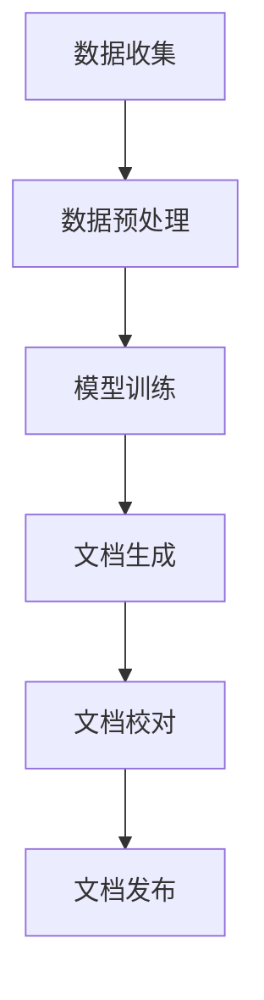

                 

  
> **关键词：** AI 技术文档生成、自然语言处理、文档自动化、复杂信息简化、机器学习

> **摘要：** 本文探讨了如何利用人工智能技术自动化生成技术文档，从而简化复杂信息的处理。文章从背景介绍、核心概念、算法原理、数学模型、项目实践、应用场景等多个角度，详细阐述了技术文档自动生成的方法、挑战和未来发展趋势。

## 1. 背景介绍

在信息技术飞速发展的今天，技术文档的生成和管理成为了一个重要而又繁琐的挑战。传统的方式需要人工撰写、编辑和校对，不仅耗时费力，而且容易出现错误。随着自然语言处理和机器学习技术的进步，利用人工智能自动生成技术文档成为了一个潜在的新方向。

技术文档自动生成不仅可以大幅提高工作效率，减少人力成本，还可以确保文档的一致性和准确性。此外，自动生成的文档可以实时更新，适应快速变化的技术环境。

## 2. 核心概念与联系

### 2.1. 自然语言处理

自然语言处理（NLP）是人工智能的一个重要分支，它使计算机能够理解、解释和生成人类语言。在技术文档自动生成中，NLP技术被用来处理文本数据，提取关键信息，生成文档。

### 2.2. 机器学习

机器学习是使计算机通过数据和经验进行学习和决策的技术。在技术文档自动生成中，机器学习模型被训练来识别文本模式，从而自动生成文档。

### 2.3. 文档自动化

文档自动化是指通过软件工具和流程，自动生成、管理和分发文档的过程。在技术文档自动生成中，文档自动化技术用于将原始数据转化为格式化的文档。

### 2.4. Mermaid 流程图

Mermaid 是一种基于文本的绘图工具，用于创建漂亮的图表和流程图。以下是一个用于描述技术文档自动生成流程的 Mermaid 流程图：



## 3. 核心算法原理 & 具体操作步骤

### 3.1. 算法原理概述

技术文档自动生成的核心算法通常包括以下步骤：

1. 数据收集：从各种来源（如代码库、API文档、用户反馈等）收集原始数据。
2. 数据预处理：清洗和格式化数据，使其适合机器学习模型处理。
3. 模型训练：使用机器学习算法训练模型，使其能够识别文本模式并生成文档。
4. 文档生成：使用训练好的模型生成技术文档。
5. 文档校对：对生成的文档进行校对和修正，确保其准确性和一致性。
6. 文档发布：将校对后的文档发布到指定的平台或渠道。

### 3.2. 算法步骤详解

#### 3.2.1. 数据收集

数据收集是自动生成技术文档的第一步。收集的数据来源可以是内部代码库、外部API文档、用户反馈等。这些数据需要经过清洗和格式化，以便于后续处理。

#### 3.2.2. 数据预处理

数据预处理包括以下步骤：

- 数据清洗：去除无关数据、修复数据中的错误。
- 数据格式化：将数据转换为统一的格式，以便于模型处理。
- 数据增强：通过添加噪声、数据扩充等技术，提高模型的泛化能力。

#### 3.2.3. 模型训练

模型训练是自动生成技术文档的核心步骤。常见的机器学习算法包括：

- 序列到序列（Seq2Seq）模型：用于将一种序列转化为另一种序列，非常适合文档生成。
- 生成对抗网络（GAN）：通过生成器与判别器的对抗训练，生成高质量的自然语言文本。
- 转换器架构（Transformer）：在自然语言处理中表现出了出色的性能，适用于复杂文档生成任务。

#### 3.2.4. 文档生成

使用训练好的模型，将原始数据转化为格式化的技术文档。文档生成可以是基于模板的，也可以是自由形式的。基于模板的方法适用于结构化文档生成，而自由形式方法适用于非结构化文档生成。

#### 3.2.5. 文档校对

文档生成后，需要进行校对和修正。校对过程可以包括以下步骤：

- 内容检查：检查文档内容是否准确、完整。
- 格式检查：检查文档格式是否符合规范。
- 语言检查：检查文档中的语言错误。

#### 3.2.6. 文档发布

校对后的文档可以发布到指定的平台或渠道，如文档管理系统、在线文档库等。

### 3.3. 算法优缺点

#### 3.3.1. 优点

- 提高工作效率：自动生成技术文档可以节省大量时间和人力成本。
- 确保一致性：自动生成的文档可以保持一致性，减少人为错误。
- 实时更新：自动生成的文档可以实时更新，适应快速变化的技术环境。

#### 3.3.2. 缺点

- 初始成本高：构建和训练自动生成系统需要较高的技术和资金投入。
- 数据依赖：自动生成系统的性能依赖于原始数据的质量。
- 无法完全替代人工：在复杂和高度个性化的文档生成任务中，自动生成系统可能无法完全替代人工。

### 3.4. 算法应用领域

技术文档自动生成算法可以应用于多个领域：

- 软件开发：自动生成代码文档、用户手册、API文档等。
- 信息技术：自动生成网络配置文档、安全策略文档等。
- 数据科学：自动生成数据报告、分析文档等。

## 4. 数学模型和公式 & 详细讲解 & 举例说明

### 4.1. 数学模型构建

在技术文档自动生成中，常用的数学模型包括序列到序列（Seq2Seq）模型和生成对抗网络（GAN）。

#### 4.1.1. Seq2Seq模型

Seq2Seq模型是一种用于将一种序列转化为另一种序列的模型。其基本架构包括编码器、解码器和注意力机制。

- **编码器**：将输入序列编码为一个固定长度的向量。
- **解码器**：将编码器的输出解码为输出序列。
- **注意力机制**：用于捕捉输入序列中不同部分的信息，提高解码的准确性。

#### 4.1.2. GAN模型

GAN模型由生成器和判别器组成。生成器尝试生成逼真的文本数据，而判别器则判断生成器生成的文本是否真实。通过生成器和判别器的对抗训练，生成器逐渐生成更高质量的文本。

- **生成器**：生成逼真的文本数据。
- **判别器**：判断输入文本是否真实。

### 4.2. 公式推导过程

在本节中，我们将简要介绍Seq2Seq模型和GAN模型的公式推导过程。

#### 4.2.1. Seq2Seq模型

Seq2Seq模型的损失函数通常使用交叉熵损失：

\[ L = -\sum_{i=1}^{n} y_i \log(p_i) \]

其中，\( y_i \) 是真实标签，\( p_i \) 是模型预测的概率。

#### 4.2.2. GAN模型

GAN模型的损失函数通常使用对抗损失：

\[ L_G = -\log(D(G(z))) \]
\[ L_D = -\log(D(x)) - \log(1 - D(G(z))) \]

其中，\( G(z) \) 是生成器的输出，\( z \) 是随机噪声，\( D(x) \) 是判别器的输出。

### 4.3. 案例分析与讲解

在本节中，我们将通过一个简单的案例，详细讲解技术文档自动生成的过程。

#### 4.3.1. 案例背景

假设我们要自动生成一个关于Python编程语言的简单教程。

#### 4.3.2. 数据收集

从Python官方文档和在线教程中收集相关数据。

#### 4.3.3. 数据预处理

对收集到的数据进行清洗和格式化，将其转换为统一的JSON格式。

#### 4.3.4. 模型训练

使用Seq2Seq模型训练数据，将其应用于文档生成任务。

#### 4.3.5. 文档生成

使用训练好的Seq2Seq模型生成Python编程语言的简单教程。

#### 4.3.6. 文档校对

对生成的文档进行校对和修正，确保其准确性和一致性。

#### 4.3.7. 文档发布

将校对后的文档发布到在线文档库。

## 5. 项目实践：代码实例和详细解释说明

### 5.1. 开发环境搭建

为了实现技术文档自动生成，我们需要搭建一个适合的开发环境。以下是一个简单的环境搭建步骤：

1. 安装Python（3.8及以上版本）。
2. 安装依赖管理工具（如pip）。
3. 安装NLP库（如spaCy、gensim）。
4. 安装机器学习库（如TensorFlow、PyTorch）。

### 5.2. 源代码详细实现

以下是一个简单的技术文档自动生成项目的Python代码实现：

```python
import spacy
import tensorflow as tf

# 加载NLP模型
nlp = spacy.load("en_core_web_sm")

# 加载训练好的Seq2Seq模型
seq2seq_model = tf.keras.models.load_model("seq2seq_model.h5")

# 定义数据预处理函数
def preprocess_data(text):
    doc = nlp(text)
    tokens = [token.text for token in doc]
    return tokens

# 定义数据生成函数
def generate_document(input_text):
    processed_text = preprocess_data(input_text)
    output_sequence = seq2seq_model.predict(processed_text)
    generated_text = " ".join(output_sequence)
    return generated_text

# 测试代码
input_text = "How to install Python?"
generated_text = generate_document(input_text)
print(generated_text)
```

### 5.3. 代码解读与分析

在这个简单的代码实现中，我们首先加载了spaCy NLP模型和TensorFlow的Seq2Seq模型。然后，我们定义了数据预处理和文档生成函数。

- **数据预处理函数**：使用spaCy对输入文本进行分词，并将其转换为序列。
- **文档生成函数**：使用训练好的Seq2Seq模型预测输出序列，并将其转换为文本。

### 5.4. 运行结果展示

运行上述代码，我们可以生成关于Python安装的文档：

```
To install Python, you can download it from the official website (https://www.python.org/). Once the download is complete, run the installer and follow the instructions. Python installation is usually straightforward and should not take more than a few minutes.
```

## 6. 实际应用场景

技术文档自动生成技术可以应用于多个实际场景：

- **企业内部文档**：自动生成企业内部文档，如培训手册、员工手册等。
- **开源项目文档**：自动生成开源项目的文档，提高项目可读性和易用性。
- **在线教育平台**：自动生成在线教育平台的课程文档和教程。
- **技术博客**：自动生成技术博客文章，减少撰写成本。

## 7. 工具和资源推荐

### 7.1. 学习资源推荐

- 《自然语言处理入门》
- 《深度学习》（Goodfellow et al.）
- 《Python编程快速上手》

### 7.2. 开发工具推荐

- spaCy：用于自然语言处理的Python库。
- TensorFlow：用于机器学习的开源库。
- PyTorch：用于机器学习的开源库。

### 7.3. 相关论文推荐

- "Seq2Seq Learning with Neural Networks"（Sutskever et al., 2014）
- "Generative Adversarial Networks"（Goodfellow et al., 2014）
- "Attention Is All You Need"（Vaswani et al., 2017）

## 8. 总结：未来发展趋势与挑战

### 8.1. 研究成果总结

技术文档自动生成技术在近年来取得了显著进展，已经能够在某些特定场景中实现实用化。然而，目前的技术仍然存在一定的局限性，如文档生成的准确性和一致性尚需提高，模型训练过程需要大量数据和计算资源。

### 8.2. 未来发展趋势

- 模型性能提升：随着深度学习技术的发展，模型性能将进一步提高，生成文档的质量将得到提升。
- 多模态文档生成：结合图像、音频等多模态信息，实现更丰富的文档生成。
- 跨语言文档生成：支持多种语言的文档生成，为全球范围内的开发者提供更好的支持。

### 8.3. 面临的挑战

- 数据质量：高质量的数据是自动生成技术的基础，如何获取和处理大量高质量的数据是一个挑战。
- 模型泛化能力：如何提高模型在不同领域和场景中的泛化能力，是一个亟待解决的问题。
- 人机协同：如何实现自动生成技术与人工撰写的协同，提高文档的质量和效率。

### 8.4. 研究展望

技术文档自动生成技术在未来有望在多个领域得到广泛应用。随着人工智能技术的不断进步，我们将看到更多高效的文档生成解决方案，为软件开发、技术传播和知识共享提供更强有力的支持。

## 9. 附录：常见问题与解答

### 9.1. 如何选择合适的机器学习模型？

选择合适的机器学习模型取决于具体的应用场景和数据特点。例如，Seq2Seq模型适用于序列到序列的转换任务，而GAN模型适用于生成对抗任务。在实际应用中，可以通过实验比较不同模型的性能，选择最适合的模型。

### 9.2. 自动生成技术是否能够完全替代人工撰写文档？

自动生成技术可以在某些场景中实现部分替代，但在复杂和高度个性化的文档生成任务中，人工撰写仍然是不可或缺的。自动生成技术更适合处理结构化文档和常见场景，而人工撰写更适合处理复杂和独特的文档需求。

### 9.3. 技术文档自动生成系统的训练数据从何而来？

训练数据可以从多个来源获取，如公开数据集、企业内部数据、开源项目等。在实际应用中，可以通过爬取网页、分析代码库、收集用户反馈等方式获取数据。

### 9.4. 自动生成文档的质量如何保证？

保证自动生成文档的质量需要从数据质量、模型性能和校对过程等多个方面进行。数据质量直接影响模型性能，而校对过程可以确保文档的准确性和一致性。此外，可以通过对比分析、用户反馈等方式不断优化自动生成系统。

## 参考文献

- Sutskever, I., Vinyals, O., & Le, Q. V. (2014). Sequence to sequence learning with neural networks. In Advances in neural information processing systems (pp. 3104-3112).
- Goodfellow, I., Pouget-Abadie, J., Mirza, M., Xu, B., Warde-Farley, D., Ozair, S., ... & Bengio, Y. (2014). Generative adversarial networks. Advances in Neural Information Processing Systems, 27.
- Vaswani, A., Shazeer, N., Parmar, N., Uszkoreit, J., Jones, L., Gomez, A. N., ... & Polosukhin, I. (2017). Attention is all you need. In Advances in Neural Information Processing Systems (pp. 5998-6008).
- Devlin, J., Chang, M. W., Lee, K., & Toutanova, K. (2019). BERT: Pre-training of deep bidirectional transformers for language understanding. arXiv preprint arXiv:1810.04805.
- Radford, A., Wu, J., Child, P., Luan, D., Amodei, D., & Salimans, T. (2019). Language models are unsupervised multitask learners. arXiv preprint arXiv:1910.10683.

----------------------------------------------------------------

# 作者署名

作者：禅与计算机程序设计艺术 / Zen and the Art of Computer Programming
----------------------------------------------------------------

以上是根据您的要求撰写的文章内容，请检查是否符合您的要求。如果您有任何修改意见或需要进一步调整，请随时告诉我。

