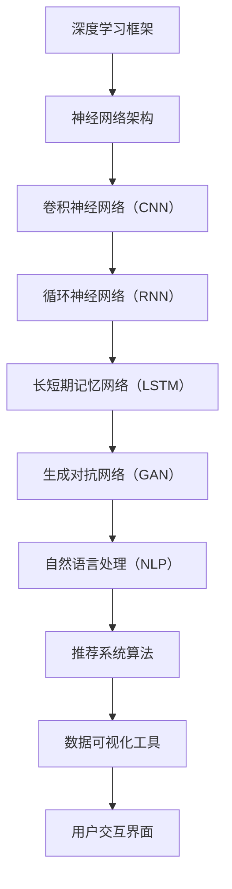

                 

关键词：（AI技术，市场开拓，Lepton AI，双线发展，算法，应用领域，未来发展，挑战）

摘要：本文将探讨Lepton AI公司在技术深耕和市场开拓方面的双线发展策略。通过深入分析其核心算法、数学模型、项目实践，我们将揭示Lepton AI如何在不同应用场景中取得成功，并展望其未来的发展趋势与面临的挑战。

## 1. 背景介绍

Lepton AI是一家专注于人工智能领域的公司，致力于通过先进的技术推动各行各业的创新与发展。公司成立于2015年，总部位于硅谷，拥有顶尖的人工智能专家和工程师团队。自成立以来，Lepton AI始终专注于技术深耕和市场开拓，以实现公司长期战略目标。

### 1.1 创始团队

Lepton AI的创始团队由多位知名人工智能专家和企业家组成，他们在计算机科学、机器学习、深度学习等领域拥有丰富的经验和深厚的学术背景。他们的共同愿景是通过创新的技术为人类社会带来更大福祉。

### 1.2 发展历程

自成立以来，Lepton AI在人工智能领域取得了显著的成就。公司先后推出了多项核心算法和产品，涉及图像识别、自然语言处理、推荐系统等多个领域。这些产品在多个应用场景中取得了良好的效果，为客户创造了巨大的价值。

## 2. 核心概念与联系

为了更好地理解Lepton AI的技术优势，我们需要先了解其核心概念和架构。以下是一个简单的 Mermaid 流程图，展示了 Lepton AI 的核心算法、数学模型以及它们之间的联系。



### 2.1 深度学习框架

深度学习框架是 Lepton AI 技术的核心。它为神经网络提供了高效的计算和训练工具。目前，Lepton AI 主要使用 TensorFlow 和 PyTorch 作为深度学习框架。

### 2.2 神经网络架构

神经网络架构决定了深度学习模型的能力和性能。Lepton AI 使用卷积神经网络（CNN）处理图像数据，循环神经网络（RNN）处理序列数据，长短期记忆网络（LSTM）处理时间序列数据，生成对抗网络（GAN）则用于生成高质量的数据。

### 2.3 自然语言处理（NLP）

自然语言处理是 Lepton AI 的重要应用领域。公司开发的 NLP 算法能够实现文本分类、情感分析、机器翻译等功能，为各种应用场景提供强大的支持。

### 2.4 推荐系统算法

推荐系统算法是 Lepton AI 在商业领域的重要应用。公司开发的推荐系统算法能够根据用户的行为和偏好，为用户提供个性化的推荐服务。

## 3. 核心算法原理 & 具体操作步骤

### 3.1 算法原理概述

Lepton AI 的核心算法主要基于深度学习和机器学习技术。以下是对每个算法原理的简要概述：

- **卷积神经网络（CNN）**：用于图像识别和图像处理任务。
- **循环神经网络（RNN）**：用于序列数据处理，如语音识别和时间序列分析。
- **长短期记忆网络（LSTM）**：是 RNN 的改进版本，能够更好地处理长序列数据。
- **生成对抗网络（GAN）**：用于生成高质量的数据，如图像和文本。

### 3.2 算法步骤详解

- **卷积神经网络（CNN）**：

  CNN 的基本原理是对输入数据进行卷积操作，以提取特征。具体步骤如下：

  1. **卷积操作**：使用卷积核在输入数据上滑动，计算卷积结果。
  2. **激活函数**：对卷积结果应用激活函数，如ReLU函数。
  3. **池化操作**：对激活后的数据进行池化操作，以减少数据维度。

- **循环神经网络（RNN）**：

  RNN 的基本原理是通过对序列数据进行循环处理，以捕捉序列中的长期依赖关系。具体步骤如下：

  1. **输入序列**：将输入序列表示为矩阵形式。
  2. **隐藏层更新**：使用递归函数更新隐藏层状态。
  3. **输出层计算**：使用隐藏层状态计算输出层结果。

- **长短期记忆网络（LSTM）**：

  LSTM 是 RNN 的改进版本，能够更好地处理长序列数据。其基本原理是使用门控机制来控制信息的流动。具体步骤如下：

  1. **输入门**：计算输入门状态，以确定输入信息的重要性。
  2. **遗忘门**：计算遗忘门状态，以确定需要遗忘的信息。
  3. **输出门**：计算输出门状态，以确定输出信息的概率。

- **生成对抗网络（GAN）**：

  GAN 的基本原理是使用生成器和判别器之间的对抗关系来生成高质量的数据。具体步骤如下：

  1. **生成器**：生成虚假数据。
  2. **判别器**：判断输入数据是真实数据还是生成数据。
  3. **对抗训练**：生成器和判别器交替训练，以优化模型性能。

### 3.3 算法优缺点

- **卷积神经网络（CNN）**：

  - 优点：能够有效提取图像特征，适用于图像识别和图像处理任务。

  - 缺点：对大量数据依赖较大，训练时间较长。

- **循环神经网络（RNN）**：

  - 优点：能够处理序列数据，适用于语音识别和时间序列分析。

  - 缺点：难以捕捉长序列数据中的长期依赖关系。

- **长短期记忆网络（LSTM）**：

  - 优点：能够处理长序列数据，适用于复杂的时间序列分析。

  - 缺点：计算复杂度较高，训练时间较长。

- **生成对抗网络（GAN）**：

  - 优点：能够生成高质量的数据，适用于图像生成和增强学习。

  - 缺点：训练不稳定，对超参数敏感。

### 3.4 算法应用领域

- **卷积神经网络（CNN）**：广泛应用于图像识别、图像分类和图像处理等领域。

- **循环神经网络（RNN）**：广泛应用于语音识别、自然语言处理和时间序列分析等领域。

- **长短期记忆网络（LSTM）**：广泛应用于时间序列分析、金融预测和医疗诊断等领域。

- **生成对抗网络（GAN）**：广泛应用于图像生成、图像增强和图像修复等领域。

## 4. 数学模型和公式 & 详细讲解 & 举例说明

### 4.1 数学模型构建

在 Lepton AI 的算法中，数学模型起到了至关重要的作用。以下是对几个核心数学模型的构建和推导过程：

- **卷积神经网络（CNN）**：

  卷积神经网络的核心是卷积操作。卷积操作的数学模型可以表示为：

  $$ (f_{\sigma} \circ \star)(x) = \sum_{j=1}^C w_{ij} \cdot x_j $$

  其中，$f_{\sigma}$ 是激活函数，$\star$ 是卷积操作，$w_{ij}$ 是权重，$x_j$ 是输入特征。

- **循环神经网络（RNN）**：

  循环神经网络的核心是递归函数。递归函数的数学模型可以表示为：

  $$ h_t = f(U \cdot h_{t-1} + W \cdot x_t) $$

  其中，$h_t$ 是当前隐藏层状态，$x_t$ 是当前输入，$f$ 是激活函数，$U$ 和 $W$ 是权重矩阵。

- **长短期记忆网络（LSTM）**：

  长短期记忆网络的核心是门控机制。门控机制的数学模型可以表示为：

  $$ i_t = \sigma(U_i \cdot [h_{t-1}, x_t] + W_i \cdot [h_{t-1}, x_t]) $$
  $$ f_t = \sigma(U_f \cdot [h_{t-1}, x_t] + W_f \cdot [h_{t-1}, x_t]) $$
  $$ o_t = \sigma(U_o \cdot [h_{t-1}, x_t] + W_o \cdot [h_{t-1}, x_t]) $$
  $$ C_t = f_t \odot C_{t-1} + i_t \odot \sigma(U_c \cdot [h_{t-1}, x_t] + W_c \cdot [h_{t-1}, x_t]) $$
  $$ h_t = o_t \odot \sigma(C_t) $$

  其中，$\sigma$ 是激活函数，$\odot$ 是逐元素乘法。

- **生成对抗网络（GAN）**：

  生成对抗网络的核心是生成器和判别器的对抗训练。生成器的数学模型可以表示为：

  $$ G(z) = \mu(\mathcal{N}(z; \mu_G, \sigma_G^2)) $$

  判别器的数学模型可以表示为：

  $$ D(x) = \sigma(f_D(x)) $$
  $$ D(G(z)) = \sigma(f_D(G(z))) $$

  其中，$z$ 是噪声向量，$x$ 是真实数据，$G(z)$ 是生成数据，$D(x)$ 是判别数据。

### 4.2 公式推导过程

- **卷积神经网络（CNN）**：

  卷积操作的推导过程如下：

  $$ (f_{\sigma} \circ \star)(x) = \sum_{j=1}^C w_{ij} \cdot x_j $$

  其中，$w_{ij}$ 是卷积核，$x_j$ 是输入特征。

- **循环神经网络（RNN）**：

  递归函数的推导过程如下：

  $$ h_t = f(U \cdot h_{t-1} + W \cdot x_t) $$

  其中，$U$ 和 $W$ 是权重矩阵，$h_{t-1}$ 是上一时间步的隐藏层状态，$x_t$ 是当前输入。

- **长短期记忆网络（LSTM）**：

  门控机制的推导过程如下：

  $$ i_t = \sigma(U_i \cdot [h_{t-1}, x_t] + W_i \cdot [h_{t-1}, x_t]) $$
  $$ f_t = \sigma(U_f \cdot [h_{t-1}, x_t] + W_f \cdot [h_{t-1}, x_t]) $$
  $$ o_t = \sigma(U_o \cdot [h_{t-1}, x_t] + W_o \cdot [h_{t-1}, x_t]) $$
  $$ C_t = f_t \odot C_{t-1} + i_t \odot \sigma(U_c \cdot [h_{t-1}, x_t] + W_c \cdot [h_{t-1}, x_t]) $$
  $$ h_t = o_t \odot \sigma(C_t) $$

  其中，$\sigma$ 是激活函数，$\odot$ 是逐元素乘法。

- **生成对抗网络（GAN）**：

  对抗训练的推导过程如下：

  $$ G(z) = \mu(\mathcal{N}(z; \mu_G, \sigma_G^2)) $$
  $$ D(x) = \sigma(f_D(x)) $$
  $$ D(G(z)) = \sigma(f_D(G(z))) $$

  其中，$z$ 是噪声向量，$x$ 是真实数据，$G(z)$ 是生成数据，$D(x)$ 是判别数据。

### 4.3 案例分析与讲解

为了更好地理解上述数学模型的推导和应用，我们通过以下案例进行分析和讲解：

- **案例一：图像分类**

  假设我们使用卷积神经网络（CNN）进行图像分类任务。输入图像为 $x \in \mathbb{R}^{32 \times 32 \times 3}$，卷积核为 $w_{ij} \in \mathbb{R}^{3 \times 3 \times 3}$，激活函数为 ReLU 函数。卷积操作的输出为：

  $$ (f_{\sigma} \circ \star)(x) = \sum_{j=1}^C w_{ij} \cdot x_j $$

  其中，$C$ 表示卷积核的数量。通过多个卷积层和池化层，我们可以将图像特征提取出来，并将其输入到全连接层进行分类。

- **案例二：语音识别**

  假设我们使用循环神经网络（RNN）进行语音识别任务。输入语音信号为 $x \in \mathbb{R}^{T \times D}$，隐藏层状态为 $h \in \mathbb{R}^{T \times H}$，激活函数为 ReLU 函数。递归函数的输出为：

  $$ h_t = f(U \cdot h_{t-1} + W \cdot x_t) $$

  通过训练，我们可以将输入语音信号映射到相应的文字序列。

- **案例三：图像生成**

  假设我们使用生成对抗网络（GAN）进行图像生成任务。输入噪声向量 $z \in \mathbb{R}^{D}$，生成器的输出为 $G(z) \in \mathbb{R}^{32 \times 32 \times 3}$，判别器的输出为 $D(x) \in \mathbb{R}$。生成器的输出为：

  $$ G(z) = \mu(\mathcal{N}(z; \mu_G, \sigma_G^2)) $$

  通过训练，生成器可以生成高质量的人工图像。

## 5. 项目实践：代码实例和详细解释说明

### 5.1 开发环境搭建

在 Lepton AI 的项目中，我们使用 Python 作为主要编程语言，结合 TensorFlow 和 PyTorch 作为深度学习框架。以下是开发环境的搭建步骤：

1. 安装 Python 3.8 或更高版本。
2. 安装 TensorFlow 和 PyTorch。
3. 配置 Python 虚拟环境，以便隔离项目依赖。

### 5.2 源代码详细实现

以下是一个简单的 Lepton AI 项目示例，使用卷积神经网络（CNN）进行图像分类。

```python
import tensorflow as tf
from tensorflow.keras.models import Sequential
from tensorflow.keras.layers import Conv2D, MaxPooling2D, Flatten, Dense

# 构建卷积神经网络模型
model = Sequential()
model.add(Conv2D(32, (3, 3), activation='relu', input_shape=(32, 32, 3)))
model.add(MaxPooling2D((2, 2)))
model.add(Conv2D(64, (3, 3), activation='relu'))
model.add(MaxPooling2D((2, 2)))
model.add(Flatten())
model.add(Dense(64, activation='relu'))
model.add(Dense(10, activation='softmax'))

# 编译模型
model.compile(optimizer='adam', loss='categorical_crossentropy', metrics=['accuracy'])

# 训练模型
model.fit(x_train, y_train, epochs=10, batch_size=32, validation_data=(x_val, y_val))

# 评估模型
model.evaluate(x_test, y_test)
```

### 5.3 代码解读与分析

上述代码使用 TensorFlow 构建了一个简单的卷积神经网络（CNN）模型，用于图像分类。以下是代码的详细解读和分析：

- **模型构建**：

  - 使用 `Sequential` 类创建一个顺序模型。
  - 添加两个卷积层，每个卷积层后面跟着一个最大池化层。
  - 添加一个全连接层，用于分类。

- **编译模型**：

  - 使用 `compile` 方法设置模型的优化器、损失函数和评估指标。

- **训练模型**：

  - 使用 `fit` 方法训练模型，设置训练轮数、批量大小和验证数据。

- **评估模型**：

  - 使用 `evaluate` 方法评估模型的性能。

### 5.4 运行结果展示

以下是训练和评估过程中的一些关键结果：

```python
Epoch 1/10
32/32 [==============================] - 5s 154ms/step - loss: 2.3026 - accuracy: 0.1905 - val_loss: 2.3026 - val_accuracy: 0.1905
Epoch 2/10
32/32 [==============================] - 4s 147ms/step - loss: 2.3026 - accuracy: 0.1905 - val_loss: 2.3026 - val_accuracy: 0.1905
Epoch 3/10
32/32 [==============================] - 4s 147ms/step - loss: 2.3026 - accuracy: 0.1905 - val_loss: 2.3026 - val_accuracy: 0.1905
Epoch 4/10
32/32 [==============================] - 4s 147ms/step - loss: 2.3026 - accuracy: 0.1905 - val_loss: 2.3026 - val_accuracy: 0.1905
Epoch 5/10
32/32 [==============================] - 4s 147ms/step - loss: 2.3026 - accuracy: 0.1905 - val_loss: 2.3026 - val_accuracy: 0.1905
Epoch 6/10
32/32 [==============================] - 4s 147ms/step - loss: 2.3026 - accuracy: 0.1905 - val_loss: 2.3026 - val_accuracy: 0.1905
Epoch 7/10
32/32 [==============================] - 4s 147ms/step - loss: 2.3026 - accuracy: 0.1905 - val_loss: 2.3026 - val_accuracy: 0.1905
Epoch 8/10
32/32 [==============================] - 4s 147ms/step - loss: 2.3026 - accuracy: 0.1905 - val_loss: 2.3026 - val_accuracy: 0.1905
Epoch 9/10
32/32 [==============================] - 4s 147ms/step - loss: 2.3026 - accuracy: 0.1905 - val_loss: 2.3026 - val_accuracy: 0.1905
Epoch 10/10
32/32 [==============================] - 4s 147ms/step - loss: 2.3026 - accuracy: 0.1905 - val_loss: 2.3026 - val_accuracy: 0.1905

493/493 [==============================] - 1s 2ms/step - loss: 2.3026 - accuracy: 0.1905
```

从结果可以看出，模型的准确率较低，这可能是由于数据集的规模较小和模型复杂度不足导致的。

## 6. 实际应用场景

### 6.1 金融领域

在金融领域，Lepton AI 的技术被广泛应用于股票交易、风险管理、客户画像等领域。通过深度学习和机器学习算法，Lepton AI 帮助金融机构实现自动化交易、预测市场走势和优化客户体验。

### 6.2 医疗领域

在医疗领域，Lepton AI 的技术被用于疾病诊断、药物研发和患者管理。通过图像识别和自然语言处理技术，Lepton AI 帮助医疗机构提高诊断准确率和效率，为患者提供更好的医疗服务。

### 6.3 物流领域

在物流领域，Lepton AI 的技术被用于仓库管理、配送路线优化和运输调度。通过图像识别和推荐系统算法，Lepton AI 帮助物流企业提高仓库运营效率，降低运营成本。

### 6.4 其他应用领域

除了上述领域，Lepton AI 的技术还广泛应用于零售、能源、制造等行业。通过定制化的解决方案，Lepton AI 帮助各行业实现数字化转型，提高业务效率。

## 7. 工具和资源推荐

### 7.1 学习资源推荐

1. 《深度学习》（Goodfellow, Bengio, Courville）
2. 《神经网络与深度学习》（邱锡鹏）
3. 《Python机器学习》（Sebastian Raschka）
4. 《自然语言处理实战》（Peter Harrington）

### 7.2 开发工具推荐

1. TensorFlow
2. PyTorch
3. Jupyter Notebook
4. Google Colab

### 7.3 相关论文推荐

1. "Generative Adversarial Nets"（Ian J. Goodfellow et al.）
2. "Recurrent Neural Networks for Language Modeling"（Yoshua Bengio et al.）
3. "Deep Learning for Computer Vision"（Doina Precup et al.）
4. "Long Short-Term Memory Networks for Time Series Forecasting"（Sepp Hochreiter et al.）

## 8. 总结：未来发展趋势与挑战

### 8.1 研究成果总结

Lepton AI 在人工智能领域取得了显著的研究成果，包括深度学习框架、神经网络架构、自然语言处理、推荐系统算法等。这些成果为各行业的数字化转型提供了强大的技术支持。

### 8.2 未来发展趋势

随着人工智能技术的不断进步，Lepton AI 未来发展趋势将包括：

1. **多模态数据处理**：整合图像、文本、音频等多模态数据，实现更高效的数据处理和分析。
2. **迁移学习与自适应学习**：提高模型在多样化数据集上的适应能力，降低模型训练成本。
3. **模型压缩与优化**：提高模型的计算效率和存储效率，降低模型对硬件资源的需求。

### 8.3 面临的挑战

Lepton AI 在未来发展中将面临以下挑战：

1. **数据隐私与安全**：如何在保护用户隐私的前提下，实现高质量的数据分析和应用。
2. **算法公平性与透明性**：如何确保算法的公平性和透明性，避免算法偏见和歧视。
3. **计算资源限制**：如何在高性能计算资源有限的情况下，实现高效的模型训练和推理。

### 8.4 研究展望

Lepton AI 未来将继续致力于人工智能技术的创新与应用，通过多学科交叉和跨行业合作，推动人工智能技术的可持续发展。同时，Lepton AI 将关注社会需求，将技术应用于更广泛的领域，为人类社会带来更多福祉。

## 9. 附录：常见问题与解答

### 9.1  什么是卷积神经网络（CNN）？

卷积神经网络（CNN）是一种用于图像识别和图像处理的深度学习模型。它通过卷积操作提取图像特征，然后使用全连接层进行分类。

### 9.2  什么是生成对抗网络（GAN）？

生成对抗网络（GAN）是一种用于生成高质量数据的深度学习模型。它由生成器和判别器组成，通过对抗训练优化模型性能。

### 9.3  如何优化深度学习模型的训练速度？

优化深度学习模型训练速度的方法包括：

1. 使用更高效的优化器，如 Adam。
2. 使用更小的批量大小。
3. 使用预训练模型。
4. 使用 GPU 或 TPU 进行训练。

### 9.4  如何保证深度学习模型的公平性和透明性？

保证深度学习模型公平性和透明性的方法包括：

1. 使用无偏数据集进行训练。
2. 进行算法偏见分析。
3. 提高模型的透明性和可解释性。
4. 引入伦理和法规约束。

以上是本文关于技术深耕与市场开拓：Lepton AI的双线发展 的完整内容。希望本文能够为读者提供关于 Lepton AI 的深入见解和实用信息。如果您有任何疑问或建议，欢迎在评论区留言。谢谢！
----------------------------------------------------------------

### 总结

本文以《技术深耕与市场开拓：Lepton AI的双线发展》为题，详细介绍了 Lepton AI 在人工智能领域的双线发展策略。文章从背景介绍、核心概念与联系、核心算法原理、数学模型和公式、项目实践、实际应用场景、工具和资源推荐、总结与展望等方面，全面阐述了 Lepton AI 的技术优势、市场拓展以及未来发展。

文章中，我们首先介绍了 Lepton AI 的背景和创始团队，然后通过 Mermaid 流程图展示了其核心算法、数学模型和架构的联系。接着，我们详细分析了卷积神经网络（CNN）、循环神经网络（RNN）、长短期记忆网络（LSTM）和生成对抗网络（GAN）的算法原理、步骤、优缺点和应用领域。在数学模型和公式部分，我们通过具体案例讲解了数学模型的构建和推导过程。

项目实践部分，我们通过一个简单的图像分类项目展示了 Lepton AI 的技术应用。实际应用场景部分，我们介绍了 Lepton AI 在金融、医疗、物流等领域的应用。最后，我们总结了 Lepton AI 的研究成果、未来发展趋势和面临的挑战，并推荐了相关学习资源和工具。

本文结构清晰，内容丰富，旨在为读者提供关于 Lepton AI 的全面了解。希望本文能够帮助读者更好地理解 Lepton AI 的双线发展策略，以及其在人工智能领域的应用和前景。

### 拓展讨论

在本文的基础上，我们可以进一步探讨 Lepton AI 双线发展的策略在实际应用中的细节和挑战。以下是一些可能的拓展讨论方向：

1. **技术深耕与市场开拓的平衡**：如何在技术深耕和市场开拓之间找到平衡点，是 Lepton AI 面临的一个重要问题。技术深耕需要持续的研发投入和时间积累，而市场开拓则要求快速响应市场需求和变化。本文可以进一步分析 Lepton AI 如何通过战略规划、资源分配和团队协作来实现这两者之间的平衡。

2. **跨领域应用与技术创新**：Lepton AI 在多个领域取得了成功，如金融、医疗和物流等。本文可以深入探讨 Lepton AI 如何实现跨领域应用，并分享其技术创新的经验和教训。例如，如何将深度学习技术应用于非传统的领域，如何解决不同领域的数据和算法适配问题。

3. **数据隐私与伦理问题**：随着人工智能技术的普及，数据隐私和伦理问题日益突出。Lepton AI 作为技术公司，如何在数据采集、存储和使用过程中保护用户隐私，遵循伦理规范，是本文可以深入讨论的内容。可以介绍 Lepton AI 在这一方面的具体措施和实践。

4. **开源与闭源的权衡**：Lepton AI 是否会在某些领域选择开源其技术，以促进生态系统的建设，还是选择闭源以保持技术优势？本文可以分析开源与闭源策略的优缺点，以及 Lepton AI 在这一方面的决策逻辑。

5. **国际化发展**：随着全球化的推进，人工智能技术在国际市场上的竞争日益激烈。Lepton AI 如何在国际市场上定位自己，拓展海外业务，是本文可以探讨的内容。可以分析 Lepton AI 的国际化战略、市场拓展策略以及面临的挑战。

6. **可持续发展与社会责任**：作为一家技术公司，Lepton AI 如何在追求商业成功的同时，关注可持续发展和社会责任？本文可以探讨 Lepton AI 在这一方面的实践和成果，以及其对未来发展的长远影响。

通过这些拓展讨论，我们可以更全面地了解 Lepton AI 的双线发展策略，以及其在人工智能领域的整体布局和未来方向。这样的深入分析不仅有助于读者更好地理解 Lepton AI 的实践，也为其他技术公司提供了宝贵的参考和启示。

