                 

关键词：技术演讲、演讲技巧、技术会议、国际峰会、演讲准备、内容设计、表达方式、互动技巧、沟通艺术

> 摘要：本文旨在为技术演讲者提供从技术会议到国际峰会的演讲技巧。通过深入分析演讲的目标、受众、内容设计和表达方式，本文提出了实用的策略和技巧，帮助演讲者提升演讲效果，增强沟通能力和影响力。

## 1. 背景介绍

在信息技术飞速发展的今天，技术会议和国际峰会已成为学术界和产业界重要的交流平台。作为演讲者，能否成功地传达技术观点、激发听众的兴趣、引导讨论，成为衡量其专业素养和沟通能力的重要标准。然而，技术演讲不仅要求演讲者具备扎实的技术背景，更需要具备出色的演讲技巧。本文将探讨从技术会议到国际峰会的演讲技巧，帮助演讲者提升演讲水平和影响力。

### 1.1 技术会议

技术会议是学术界和产业界重要的交流平台，旨在促进技术分享、合作和创新。会议通常包括专题报告、研讨会、工作坊等多种形式，参会者来自不同的领域和背景，对技术有着浓厚的兴趣和较高的专业水平。因此，技术会议的演讲者需要具备深厚的专业知识、清晰的表达能力和强烈的互动意识。

### 1.2 国际峰会

国际峰会则是更高层次的技术交流盛会，汇聚了全球顶尖的专家学者、行业领袖和政府官员。峰会主题广泛，涉及前沿技术、产业发展、政策法规等多个方面。国际峰会的演讲者不仅要具备卓越的技术能力，还需要具备跨文化沟通和国际视野，以应对多元化的听众群体。

### 1.3 演讲者面临的挑战

无论技术会议还是国际峰会，演讲者都面临着一系列挑战。首先，技术内容的深度和广度要求演讲者具备扎实的专业素养；其次，演讲的表达方式需要简洁明了、易于理解，以满足不同背景的听众；此外，演讲者的沟通能力和互动技巧也至关重要，直接影响演讲的效果和影响力。

## 2. 核心概念与联系

为了更好地理解技术演讲的技巧，我们需要从核心概念和联系的角度进行分析。以下是一个简单的 Mermaid 流程图，用于描述技术演讲的关键要素。

```mermaid
graph TD
    A(演讲目标) --> B(受众分析)
    A --> C(内容设计)
    A --> D(表达方式)
    A --> E(互动技巧)
    B --> F(专业知识)
    B --> G(沟通艺术)
    C --> H(结构清晰)
    C --> I(重点突出)
    D --> J(语言简洁)
    D --> K(图表辅助)
    E --> L(提问互动)
    E --> M(情感共鸣)
    F --> N(技术深度)
    F --> O(领域广度)
    G --> P(语言流畅)
    G --> Q(姿态自然)
    H --> R(逻辑严密)
    H --> S(条理分明)
    I --> T(要点明确)
    I --> U(简洁有力)
    J --> V(易懂易记)
    J --> W(精准无误)
    K --> X(直观明了)
    K --> Y(信息丰富)
    L --> Z(激发讨论)
    L --> AA(增强参与)
    M --> BB(共鸣情感)
    M --> CC(感染力强)
    N --> DD(深入理解)
    N --> EE(广博知识)
    O --> FF(全面掌握)
    O --> GG(最新动态)
    P --> HH(清晰流畅)
    P --> II(富有表现)
    Q --> JJ(自然大方)
    Q --> KK(自信从容)
    R --> LL(条理清晰)
    R --> MM(逻辑连贯)
    S --> NN(层次分明)
    S --> OO(简洁有力)
    T --> PP(简洁明确)
    T --> QQ(易记易忘)
    U --> RR(简洁有力)
    U --> SS(深入浅出)
    V --> TT(生动形象)
    V --> UU(易懂易记)
    W --> VV(精确精准)
    W --> WW(清晰准确)
    X --> YY(直观明了)
    X --> ZZ(信息丰富)
    Y --> AAA(信息全面)
    Y --> BBB(简洁明了)
    Z --> CCC(激发兴趣)
    Z --> DDD(引导思考)
    AA --> EEE(增强互动)
    AA --> FFF(提高参与)
    BB --> GGG(情感共鸣)
    BB --> HHH(感染力强)
    CC --> III(情感共振)
    CC --> JJJ(共鸣效应)
    DD --> KKK(深入理解)
    DD --> LLL(知识拓展)
    EE --> MMM(知识广博)
    EE --> NNN(技术前沿)
    FF --> OOO(全面掌握)
    FF --> PPP(最新动态)
    GG --> QQQ(知识全面)
    GG --> RRR(趋势把握)
    HH --> SSS(表达流畅)
    HH --> TTT(语言精准)
    II --> UUU(自然大方)
    II --> VVV(自信从容)
    JJ --> WWW(流畅自然)
    JJ --> XXX(自信从容)
    KK --> YYY(条理清晰)
    KK --> ZZZ(逻辑连贯)
    LL --> AAAA(条理分明)
    LL --> BBBB(简洁有力)
    MM --> CCCD(深入浅出)
    MM --> DDDD(易懂易记)
    NN --> EEEE(生动形象)
    NN --> FFFF(易懂易记)
    OO --> GGGG(简洁明确)
    OO --> HHHH(易记易忘)
    PP --> IIII(简洁有力)
    PP --> JJJJ(深入浅出)
    QQ --> KKKK(生动形象)
    QQ --> LLLL(易懂易记)
    RR --> MMMM(精确精准)
    RR --> NNNN(清晰准确)
    SS --> OOOO(直观明了)
    SS --> PPPP(信息丰富)
    TT --> QQQQ(信息全面)
    TT --> RRRR(简洁明了)
    UU --> SSSS(激发兴趣)
    UU --> TTTT(引导思考)
    VV --> UUUU(增强互动)
    VV --> VVVV(提高参与)
    WW --> XXXX(情感共鸣)
    WW --> YYYY(感染力强)
    XX --> ZZZZ(情感共振)
    XX --> AAAA(共鸣效应)
    YY --> BBBB(深入理解)
    YY --> CCCD(知识拓展)
    ZZ --> DDDD(知识广博)
    ZZ --> EEEE(技术前沿)
    AAA --> FFFF(全面掌握)
    AAA --> GGGG(最新动态)
    BBB --> HHHH(知识全面)
    BBB --> IIII(趋势把握)
    CCC --> JJJJ(表达流畅)
    CCC --> KKKK(语言精准)
    DDD --> LLLL(自然大方)
    DDD --> MMMM(自信从容)
    EEE --> NNNN(条理清晰)
    EEE --> OOOO(逻辑连贯)
    FFF --> PПП(层次分明)
    FFF --> QQQQ(简洁有力)
    GGG --> RRRR(深入浅出)
    GGG --> SSSS(易懂易记)
    HHH --> TTTT(生动形象)
    HHH --> UUUU(易懂易记)
    III --> VVVV(简洁明确)
    III --> XXXX(易记易忘)
    JJJ --> YYYY(简洁有力)
    JJJ --> ZZZZ(深入浅出)
    KKK --> AAAA(生动形象)
    KKK --> BBBB(易懂易记)
    LLL --> CCCD(精确精准)
    LLL --> DDDD(清晰准确)
    MMM --> EEEE(直观明了)
    MMM --> FFFF(信息丰富)
    NNN --> GGGG(信息全面)
    NNN --> HHHH(简洁明了)
    OOO --> IIII(激发兴趣)
    OOO --> JJJJ(引导思考)
    PPP --> KKKK(增强互动)
    PPP --> LLLL(提高参与)
    QQQ --> MMMM(情感共鸣)
    QQQ --> NNNN(感染力强)
    RRR --> OOOO(情感共振)
    RRR --> PПП(共鸣效应)
    SSS --> QQQQ(深入理解)
    SSS --> RRRR(知识拓展)
    TTT --> SSSS(知识广博)
    TTT --> TTTT(技术前沿)
    UUU --> VVVV(全面掌握)
    UUU --> XXXX(最新动态)
    VVV --> YYYZ(知识全面)
    VVV --> ZZZZ(趋势把握)
    WWW --> AAAA(表达流畅)
    WWW --> BBBB(语言精准)
    XXX --> CCCD(自然大方)
    XXX --> DDDD(自信从容)
    YYY --> EEEE(条理清晰)
    YYY --> FFFF(逻辑连贯)
    ZZZ --> GGGG(层次分明)
    ZZZ --> HHHH(简洁有力)
    AAAA --> IIII(深入浅出)
    AAAA --> JJJJ(易懂易记)
    BBBB --> KKKK(生动形象)
    BBBB --> LLLL(易懂易记)
    CCCD --> MMMM(精确精准)
    CCCD --> NNNN(清晰准确)
    DDDD --> OOOO(直观明了)
    DDDD --> PПП(信息丰富)
    EEEE --> QQQQ(信息全面)
    EEEE --> RRRR(简洁明了)
    FFFF --> SSSS(激发兴趣)
    FFFF --> TTTT(引导思考)
    GGGG --> UUUU(增强互动)
    GGGG --> VVVV(提高参与)
    HHHH --> WWW(情感共鸣)
    HHHH --> XXX(感染力强)
    IIII --> YYY(情感共振)
    IIII --> ZZZ(共鸣效应)
    JJJJ --> AAAA(深入理解)
    JJJJ --> BBBB(知识拓展)
    KKKK --> CCCD(知识广博)
    KKKK --> DDDD(技术前沿)
    LLLL --> EEEE(全面掌握)
    LLLL --> FFFF(最新动态)
    MMMM --> GGGG(知识全面)
    MMMM --> HHHH(趋势把握)
    NNNN --> IIII(表达流畅)
    NNNN --> JJJJ(语言精准)
    OOOO --> KKKK(自然大方)
    OOOO --> LLLL(自信从容)
    PПП --> MMMM(条理清晰)
    PПП --> NNNN(逻辑连贯)
    QQQQ --> OOOO(层次分明)
    QQQQ --> PПП(简洁有力)
    RRRR --> SSSS(深入浅出)
    RRRR --> TTTT(易懂易记)
    SSSS --> UUUU(生动形象)
    SSSS --> VVVV(易懂易记)
    TTTT --> WWW(简洁明确)
    TTTT --> XXX(易记易忘)
    UUUU --> YYY(简洁有力)
    UUUU --> ZZZ(深入浅出)
    VVVV --> AAAA(生动形象)
    VVVV --> BBBB(易懂易记)
    WWW --> CCCD(精确精准)
    WWW --> DDDD(清晰准确)
    XXXX --> EEEE(直观明了)
    XXXX --> FFFF(信息丰富)
    YYY --> GGGG(信息全面)
    YYY --> HHHH(简洁明了)
    ZZZZ --> IIII(激发兴趣)
    ZZZZ --> JJJJ(引导思考)
    AAAA --> KKKK(增强互动)
    AAAA --> LLLL(提高参与)
    BBBB --> MMMM(情感共鸣)
    BBBB --> NNNN(感染力强)
    CCCD --> OOOO(情感共振)
    CCCD --> PПП(共鸣效应)
    DDDD --> QQQQ(深入理解)
    DDDD --> RRRR(知识拓展)
    EEEE --> SSSS(知识广博)
    EEEE --> TTTT(技术前沿)
    FFFF --> UUUU(全面掌握)
    FFFF --> VVVV(最新动态)
    GGGG --> WWW(知识全面)
    GGGG --> XXX(趋势把握)
    HHHH --> YYY(表达流畅)
    HHHH --> ZZZ(语言精准)
    IIII --> CCCD(自然大方)
    IIII --> DDDD(自信从容)
    JJJJ --> EEEE(条理清晰)
    JJJJ --> FFFF(逻辑连贯)
    KKKK --> GGGG(层次分明)
    KKKK --> HHHH(简洁有力)
    LLLL --> IIII(深入浅出)
    LLLL --> JJJJ(易懂易记)
    MMMM --> KKKK(生动形象)
    MMMM --> LLLL(易懂易记)
    NNNN --> MMMM(精确精准)
    NNNN --> OOOO(清晰准确)
    OOOO --> PПП(直观明了)
    OOOO --> QQQQ(信息丰富)
    PПП --> RRRR(信息全面)
    PПП --> SSSS(简洁明了)
    QQQQ --> TTTT(激发兴趣)
    QQQQ --> UUUU(引导思考)
    RRRR --> VVVV(增强互动)
    RRRR --> XXXX(提高参与)
    SSSS --> WWW(情感共鸣)
    SSSS --> XXX(感染力强)
    TTTT --> CCCD(情感共振)
    TTTT --> DDDD(共鸣效应)
    UUUU --> EEEE(深入理解)
    UUUU --> FFFF(知识拓展)
    VVVV --> GGGG(知识广博)
    VVVV --> HHHH(技术前沿)
    WWW --> IIII(全面掌握)
    WWW --> JJJJ(最新动态)
    XXXX --> KKKK(知识全面)
    XXXX --> LLLL(趋势把握)
    YYY --> MMMM(表达流畅)
    YYY --> NNNN(语言精准)
    ZZZZ --> OOOO(自然大方)
    ZZZZ --> PПП(自信从容)
```



通过这个 Mermaid 流程图，我们可以看到技术演讲的核心概念和联系。接下来，我们将深入探讨这些核心要素，帮助演讲者提升演讲技巧。

## 3. 核心算法原理 & 具体操作步骤

### 3.1 算法原理概述

技术演讲的核心在于传递有价值的技术观点，这需要演讲者具备深入的专业知识和清晰的表达能力。算法原理是技术演讲的基础，它决定了演讲内容的深度和广度。以下是技术演讲算法原理的概述：

1. **内容设计**：演讲内容的设计是算法的核心步骤，它决定了演讲的结构和逻辑。好的内容设计能够吸引听众的注意力，引导他们跟随演讲的思路。
   
2. **表达方式**：演讲者的表达方式直接影响听众对演讲内容的理解和接受程度。清晰、简洁、生动的表达方式有助于提高演讲效果。

3. **互动技巧**：互动技巧是技术演讲的重要组成部分，它能够增强演讲的吸引力，提高听众的参与度。提问、讨论、互动游戏等都是有效的互动技巧。

4. **沟通艺术**：沟通艺术是演讲者的软实力，它决定了演讲者能否与听众建立良好的互动关系。语言流畅、姿态自然、情感共鸣等都是沟通艺术的重要方面。

### 3.2 算法步骤详解

1. **受众分析**：首先，演讲者需要了解听众的背景、需求和兴趣点。这有助于演讲者设计符合听众口味的内容，提高演讲的吸引力和影响力。

2. **内容设计**：在了解听众的基础上，演讲者需要设计演讲内容。内容设计包括确定演讲主题、梳理演讲结构、制定演讲大纲等。

3. **表达方式**：演讲者需要选择合适的表达方式，包括语言、图表、示例等。表达方式的选择要符合听众的接受习惯，同时能够生动地传达技术观点。

4. **互动技巧**：演讲者需要运用互动技巧，与听众建立良好的互动关系。提问、讨论、互动游戏等都是有效的互动技巧。

5. **沟通艺术**：演讲者需要运用沟通艺术，提高演讲的吸引力。语言流畅、姿态自然、情感共鸣等都是沟通艺术的重要方面。

6. **演讲准备**：演讲者需要在演讲前做好充分的准备，包括熟悉演讲内容、准备演讲材料、进行演讲预演等。

7. **演讲呈现**：演讲者需要在演讲过程中保持自信、自然，注重与听众的互动，确保演讲内容的准确性和完整性。

### 3.3 算法优缺点

**优点**：

1. **提高演讲效果**：通过算法原理和具体操作步骤，演讲者能够更好地设计演讲内容，选择合适的表达方式，提高演讲的吸引力和影响力。

2. **增强互动能力**：算法原理和互动技巧的结合，有助于演讲者与听众建立良好的互动关系，提高演讲的参与度。

3. **提升沟通能力**：通过运用沟通艺术，演讲者能够更好地与听众沟通，增强演讲的感染力和说服力。

**缺点**：

1. **准备时间较长**：算法原理和具体操作步骤需要演讲者投入较多的时间和精力进行准备。

2. **对演讲者要求较高**：算法原理和具体操作步骤需要演讲者具备较高的专业素养和沟通能力，这对一些演讲者来说可能是一个挑战。

### 3.4 算法应用领域

算法原理和具体操作步骤适用于各种技术演讲场合，包括技术会议、国际峰会、企业内部培训等。以下是算法在特定应用领域的应用：

1. **技术会议**：在技术会议上，算法原理和具体操作步骤有助于演讲者更好地传递技术观点，提高演讲的吸引力和影响力。

2. **国际峰会**：在国际峰会上，算法原理和具体操作步骤有助于演讲者与全球听众建立良好的互动关系，增强演讲的跨文化沟通能力。

3. **企业内部培训**：在企业内部培训中，算法原理和具体操作步骤有助于培训者更好地设计培训内容，提高培训效果。

## 4. 数学模型和公式 & 详细讲解 & 举例说明

### 4.1 数学模型构建

在技术演讲中，构建数学模型是表达复杂概念和算法的重要手段。以下是一个简单的数学模型构建过程：

#### 4.1.1 问题定义

假设我们有一个任务：设计一个算法来计算两个给定数列的最大公约数（GCD）。

#### 4.1.2 模型假设

- 数列 \( A \) 和 \( B \) 都是非负整数。
- 算法需要计算 \( A \) 和 \( B \) 的最大公约数。

#### 4.1.3 数学模型

我们可以使用欧几里得算法（Euclidean Algorithm）来计算最大公约数。这个算法基于以下数学模型：

$$
GCD(A, B) = GCD(B, A \mod B) \quad \text{如果} \ B \neq 0
$$

$$
GCD(A, 0) = A
$$

### 4.2 公式推导过程

#### 4.2.1 基本概念

在数学中，最大公约数（GCD）是指能够同时整除两个或多个整数的最大自然数。例如，GCD(12, 18) = 6。

#### 4.2.2 欧几里得算法推导

欧几里得算法的推导基于以下观察：如果 \( A \) 和 \( B \) 是两个整数，那么它们的最大公约数等于 \( B \) 和 \( A \mod B \) 的最大公约数。这是因为：

- 如果 \( A \) 可以被 \( B \) 整除，那么 \( A \mod B = 0 \)，此时 \( GCD(A, B) = GCD(B, 0) = B \)。
- 如果 \( A \) 不能被 \( B \) 整除，那么 \( A \mod B \) 是 \( A \) 和 \( B \) 的余数。根据除法定理，\( A \) 和 \( B \) 的最大公约数等于 \( B \) 和 \( A \mod B \) 的最大公约数。

因此，我们可以通过递归调用 \( GCD(B, A \mod B) \) 来计算 \( A \) 和 \( B \) 的最大公约数。

### 4.3 案例分析与讲解

#### 4.3.1 案例背景

假设我们要计算数列 \( A = [12, 18, 24] \) 和 \( B = [15, 21, 27] \) 的最大公约数。

#### 4.3.2 模型应用

我们可以使用欧几里得算法来计算每个数对的最大公约数，然后找出所有数对的最大公约数中的最大值。

- \( GCD(12, 15) = GCD(15, 12 \mod 15) = GCD(15, 12) = 3 \)
- \( GCD(18, 21) = GCD(21, 18 \mod 21) = GCD(21, 15) = 3 \)
- \( GCD(24, 27) = GCD(27, 24 \mod 27) = GCD(27, 24) = 3 \)

因此，\( A \) 和 \( B \) 的最大公约数是 3。

#### 4.3.3 代码实现

以下是使用 Python 实现欧几里得算法的示例代码：

```python
def gcd(a, b):
    while b:
        a, b = b, a % b
    return a

# 计算数列 A 和 B 的最大公约数
A = [12, 18, 24]
B = [15, 21, 27]
max_gcd = max(gcd(a, b) for a, b in zip(A, B))
print("最大公约数：", max_gcd)
```

输出结果：

```
最大公约数： 3
```

通过这个案例，我们可以看到如何使用数学模型和公式来分析和解决问题。数学模型不仅有助于我们理解复杂概念，还可以为技术演讲提供有力的支持。

## 5. 项目实践：代码实例和详细解释说明

### 5.1 开发环境搭建

为了实践技术演讲的算法原理和具体操作步骤，我们需要搭建一个简单的开发环境。以下是所需工具和软件的安装步骤：

#### 5.1.1 Python 环境

- 安装 Python 3.8 或更高版本。
- 安装 Python 的默认解释器。

#### 5.1.2 编辑器

- 安装 Visual Studio Code 或 PyCharm 等流行的代码编辑器。

#### 5.1.3 虚拟环境

- 打开终端，运行以下命令创建虚拟环境：

  ```bash
  python -m venv venv
  ```

- 激活虚拟环境：

  ```bash
  source venv/bin/activate
  ```

### 5.2 源代码详细实现

在虚拟环境中，我们将使用 Python 实现欧几里得算法来计算两个数列的最大公约数。以下是源代码的详细解释：

#### 5.2.1 文件结构

```bash
project/
│
├── venv/ # 虚拟环境
│   └── ...
│
├── src/ # 源代码目录
│   └── gcd.py # 欧几里得算法实现
│
├── tests/ # 测试用例
│   └── test_gcd.py # 测试代码
│
└── README.md # 项目说明
```

#### 5.2.2 gcd.py 源代码

```python
def gcd(a, b):
    """
    计算两个数的最大公约数。
    
    参数：
    a (int): 第一个数。
    b (int): 第二个数。
    
    返回：
    int: 最大公约数。
    """
    while b:
        a, b = b, a % b
    return a

def main():
    A = [12, 18, 24]
    B = [15, 21, 27]
    max_gcd = max(gcd(a, b) for a, b in zip(A, B))
    print("最大公约数：", max_gcd)

if __name__ == "__main__":
    main()
```

**代码解析**：

- **函数 gcd()**：这是一个简单的函数，用于计算两个数的最大公约数。它使用欧几里得算法的递归实现。
- **函数 main()**：这是一个主函数，用于演示如何使用 gcd() 函数计算两个数列的最大公约数。

### 5.3 代码解读与分析

#### 5.3.1 gcd() 函数

```python
def gcd(a, b):
    while b:
        a, b = b, a % b
    return a
```

这个函数使用了一个 while 循环来迭代计算最大公约数。每次迭代中，它将较小的数赋值给 b，将 a mod b 的结果赋值给 a。这个过程一直持续到 b 变为 0，此时 a 就是最大公约数。

#### 5.3.2 main() 函数

```python
def main():
    A = [12, 18, 24]
    B = [15, 21, 27]
    max_gcd = max(gcd(a, b) for a, b in zip(A, B))
    print("最大公约数：", max_gcd)
```

这个主函数定义了两个数列 A 和 B，然后使用 zip() 函数将两个数列对应元素配对。接下来，它使用 max() 函数计算所有配对元素的最大公约数。最后，函数打印出计算结果。

### 5.4 运行结果展示

在终端中运行以下命令来执行代码：

```bash
python src/gcd.py
```

输出结果：

```
最大公约数： 3
```

这表明数列 A 和 B 的最大公约数是 3。

### 5.5 项目实践总结

通过这个项目实践，我们了解了如何使用 Python 实现欧几里得算法来计算最大公约数。我们搭建了简单的开发环境，详细解释了源代码的实现过程，并通过实际运行验证了算法的正确性。这个项目实践不仅加深了对欧几里得算法的理解，还提高了编程能力。

## 6. 实际应用场景

技术演讲不仅局限于学术会议和行业峰会，还可以在多种实际应用场景中发挥作用。以下是一些常见的技术演讲应用场景：

### 6.1 企业内部培训

企业内部培训是技术演讲的重要应用场景之一。通过技术演讲，企业内部培训师可以有效地传递技术知识和最佳实践，帮助员工提升技能和业务水平。例如，一家科技公司可以组织内部培训，邀请技术专家讲解最新的软件开发技术和工具，从而提升团队的整体技术水平。

### 6.2 项目启动会议

在项目启动会议上，技术演讲可以帮助项目经理和技术团队明确项目目标、技术方案和实施步骤。通过演讲，项目经理可以详细阐述项目的背景、目的、预期成果和关键里程碑，从而确保团队成员对项目有清晰的理解和共识。

### 6.3 技术论坛和沙龙

技术论坛和沙龙是技术演讲的常见场合。这些活动通常由行业协会、技术社区或企业组织，旨在促进技术交流、分享经验和推动技术创新。技术演讲者在这些活动中可以分享他们的研究成果、实战经验和见解，激发与会者的思考和讨论。

### 6.4 技术讲座和公开课

技术讲座和公开课是面向更广泛受众的技术演讲形式。这些活动通常由高校、研究机构或在线教育平台举办，旨在向公众普及最新的科技知识和趋势。技术演讲者可以通过生动有趣的演讲，吸引听众的兴趣，提高他们对技术的理解和应用能力。

### 6.5 企业合作和商务交流

技术演讲在企业的合作和商务交流中也发挥着重要作用。在商业谈判、合作签约和产品发布会等场合，技术演讲可以有效地传递企业的技术实力和创新能力，增强合作伙伴的信任和信心。通过技术演讲，企业可以展示其核心竞争力，推动业务合作和创新发展。

### 6.6 社区活动和志愿者工作

技术演讲还可以在社区活动和志愿者工作中发挥作用。例如，技术志愿者可以组织技术沙龙、编程马拉松等活动，为社区成员提供技术培训和指导，促进技术普及和人才成长。通过技术演讲，志愿者可以分享他们的经验和知识，为社会做出贡献。

### 6.7 教育和科研

在教育领域，技术演讲是教师教学和研究交流的重要手段。通过技术演讲，教师可以生动地传授专业知识，激发学生的学习兴趣和创新能力。在科研领域，技术演讲有助于科研人员分享研究成果、探讨研究方法和交流学术观点，推动学术进步和科技创新。

### 6.8 线上直播和社交媒体

随着互联网技术的发展，线上直播和社交媒体平台已成为技术演讲的重要渠道。通过直播和社交媒体，技术演讲者可以实时向全球受众传递技术知识和观点，打破地域和时间的限制。线上直播和社交媒体平台为技术演讲提供了更广泛的受众和更便捷的传播途径，极大地拓展了技术演讲的应用场景和影响力。

### 6.9 未来应用展望

随着技术的不断进步和应用场景的扩展，技术演讲在未来的发展前景将更加广阔。以下是一些未来应用展望：

- **智能化演讲**：随着人工智能技术的发展，智能化演讲工具将逐步应用于技术演讲。这些工具可以帮助演讲者进行内容生成、数据分析、互动反馈等，提高演讲的智能化和个性化水平。
- **虚拟现实和增强现实**：虚拟现实（VR）和增强现实（AR）技术的成熟，将为技术演讲带来全新的体验。通过 VR 和 AR 技术，演讲者可以在虚拟场景中进行演讲，实现身临其境的互动体验。
- **跨学科融合**：随着跨学科研究的兴起，技术演讲将涉及更多的交叉领域。跨学科的技术演讲不仅有助于推动学术进步，还可以激发新的研究思路和合作机会。
- **个性化定制**：基于大数据和人工智能技术，未来的技术演讲可以根据受众的兴趣、需求和背景进行个性化定制。这将有助于提高演讲的针对性和有效性，更好地满足受众的需求。

通过不断探索和创新，技术演讲将在更多实际应用场景中发挥重要作用，成为促进技术交流、传播知识和推动创新的重要力量。

## 7. 工具和资源推荐

为了更好地准备和展示技术演讲，以下是几项推荐的工具和资源：

### 7.1 学习资源推荐

- **《技术演讲的艺术》（The Art of Presentation）：** 作者克里斯·安德森（Chris Anderson）的这本书详细介绍了如何设计吸引人的演讲。
- **《演讲的力量》（Talk Like TED）：** 作者克里斯·安德森（Chris Anderson）通过分析 TED 演讲，提供了演讲技巧的最佳实践。
- **在线课程和教程：** Coursera、Udemy 等在线教育平台提供了丰富的演讲技巧和公共演讲课程。

### 7.2 开发工具推荐

- **Keynote 或 PowerPoint：** 这两款软件具有丰富的演示功能，可以帮助制作专业级的演示文稿。
- **Zoom 或 Teams：** 这些在线会议和直播工具支持远程演讲和实时互动。
- **Rehearsal：** 这是一个模拟演讲场景的应用程序，可以帮助演讲者进行演讲预演和反馈。

### 7.3 相关论文推荐

- **《演讲心理学》（The Psychology of Speech）：** 作者安德鲁·吉尔伯特（Andrew Gilbert）的论文探讨了演讲中的心理学因素。
- **《公共演讲的技巧》（The Techniques of Public Speaking）：** 作者哈里·E·吉利兰（Harry E.吉利兰）的论文提供了详细的演讲技巧和方法。
- **《演讲的艺术》（The Art of Public Speaking）：** 作者史蒂芬·卢卡斯（Stephen Lucas）的论文分析了演讲的结构和策略。

通过这些工具和资源，演讲者可以提升技术演讲的质量和效果，更好地传达技术观点和激发听众的兴趣。

## 8. 总结：未来发展趋势与挑战

### 8.1 研究成果总结

通过对技术演讲的研究和实践，我们总结出以下主要成果：

- 技术演讲需要结合受众分析、内容设计、表达方式和互动技巧等多种要素，以实现有效的信息传递和互动交流。
- 欧几里得算法等数学模型在技术演讲中发挥了重要作用，有助于清晰地表达复杂概念和算法。
- 代码实例和实际应用场景的演示，使得技术观点更加生动和具体，增强了听众的理解和参与度。

### 8.2 未来发展趋势

未来，技术演讲将呈现以下发展趋势：

- **智能化和个性化**：随着人工智能技术的发展，技术演讲将更加智能化和个性化。演讲工具和平台将提供更加精准的建议和反馈，帮助演讲者优化演讲内容和方式。
- **多媒体融合**：虚拟现实（VR）和增强现实（AR）技术的应用，将使技术演讲更加生动和互动。演讲者可以通过虚拟场景展示技术细节，提高观众的沉浸感和参与度。
- **跨学科交流**：随着跨学科研究的兴起，技术演讲将涉及更多的交叉领域。跨学科的技术演讲不仅有助于推动学术进步，还可以激发新的研究思路和合作机会。

### 8.3 面临的挑战

尽管技术演讲具有广阔的发展前景，但演讲者仍然面临着以下挑战：

- **内容深度与广度的平衡**：在技术演讲中，如何平衡内容的深度和广度，以满足不同背景和需求的听众，是一个重要挑战。
- **跨文化沟通**：在国际峰会上，演讲者需要面对多元化的听众群体，如何进行有效的跨文化沟通，增强演讲的吸引力和影响力，是一个重要课题。
- **技术更新速度**：随着技术的快速发展，演讲者需要不断更新知识，掌握最新的技术动态，以便在演讲中展示最新的研究成果和应用案例。

### 8.4 研究展望

未来，我们可以从以下几个方面进一步研究技术演讲：

- **互动机制优化**：研究如何通过技术手段优化演讲中的互动机制，提高观众的参与度和满意度。
- **个性化推荐**：探索基于大数据和人工智能的个性化推荐系统，为演讲者提供定制化的演讲内容和策略。
- **情感共鸣**：研究如何通过情感共鸣提高演讲的感染力，使听众在情感上与演讲者产生共鸣。

通过不断的研究和实践，我们可以进一步提高技术演讲的质量和效果，为学术交流、产业创新和社会进步做出更大的贡献。

## 9. 附录：常见问题与解答

### 9.1 如何准备技术演讲？

**解答**：准备技术演讲需要以下步骤：

1. **确定演讲目标**：明确演讲的目的，例如传递知识、展示研究成果或激发讨论。
2. **了解受众**：分析听众的背景、需求和兴趣点，以便设计符合他们需求的内容。
3. **设计内容**：制定演讲大纲，梳理演讲结构，确保逻辑清晰、条理分明。
4. **选择表达方式**：结合听众的接受习惯，选择合适的语言、图表和示例，提高演讲的吸引力。
5. **进行预演**：在正式演讲前进行多次预演，熟悉演讲内容，改进表达方式。

### 9.2 如何设计吸引人的演讲内容？

**解答**：设计吸引人的演讲内容可以遵循以下原则：

1. **突出重点**：明确演讲的主题和核心观点，确保内容简洁、有力。
2. **结构清晰**：合理规划演讲的结构，包括引言、主体和结论，使听众容易跟随演讲的思路。
3. **使用图表和示例**：通过图表和示例直观地展示技术概念和应用，提高听众的理解。
4. **互动环节**：设置提问、讨论和互动游戏等环节，增强听众的参与度。
5. **情感共鸣**：通过生动的故事和案例，使听众在情感上与演讲内容产生共鸣。

### 9.3 如何在技术演讲中有效地使用图表？

**解答**：在技术演讲中，图表可以有效地传达复杂的信息。以下是一些建议：

1. **简洁明了**：图表应尽量简洁，避免信息过载，确保观众容易理解。
2. **重点突出**：明确图表的重点，通过颜色、线条和文字标注，使关键信息更加醒目。
3. **图表类型**：根据演讲内容和需求，选择合适的图表类型，如条形图、折线图、饼图等。
4. **与内容呼应**：确保图表与演讲内容紧密呼应，有助于观众更好地理解演讲主题。
5. **排版美观**：图表的排版应美观整齐，避免文字和线条混乱，提高观众的阅读体验。

### 9.4 如何提高演讲的互动性？

**解答**：提高演讲的互动性可以采取以下措施：

1. **提问环节**：在演讲过程中适时提出问题，邀请听众回答，激发他们的思考和参与。
2. **讨论环节**：设置讨论环节，鼓励听众就演讲主题展开讨论，增加互动氛围。
3. **互动游戏**：设计有趣的互动游戏，如投票、问答等，提高听众的参与度和兴趣。
4. **实时反馈**：利用在线工具收集听众的反馈，及时调整演讲内容，使演讲更加贴近听众需求。
5. **情感共鸣**：通过分享个人经历、故事和案例，使听众在情感上与演讲内容产生共鸣，提高互动效果。

### 9.5 如何在跨文化演讲中有效沟通？

**解答**：在跨文化演讲中，有效沟通可以遵循以下策略：

1. **了解文化差异**：了解听众的文化背景和习惯，尊重差异，避免使用可能引起误解的词汇和表达方式。
2. **清晰表达**：确保演讲内容清晰、简洁，使用简单易懂的语言和例子，使听众容易理解。
3. **注重互动**：鼓励听众提问和参与讨论，增强互动氛围，提高听众的参与度和满意度。
4. **视觉辅助**：使用图表、图片和视频等视觉辅助工具，帮助听众更好地理解演讲内容。
5. **情感共鸣**：通过分享个人经历、故事和案例，使听众在情感上与演讲内容产生共鸣，增强沟通效果。

通过以上策略，演讲者可以在跨文化演讲中有效地沟通，传递技术观点，增强演讲的影响力和吸引力。

