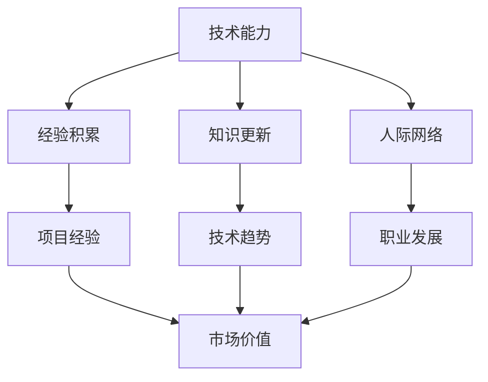

                 

关键词：个人市场价值、技术能力提升、职业发展、技能学习、行业趋势

> 摘要：本文将探讨在信息技术快速发展的时代，如何通过提升技术能力和掌握市场趋势，来增强个人在职场中的市场价值。文章将从核心概念、算法原理、数学模型、项目实践、应用场景、未来展望等多个角度，为读者提供全面的技术提升策略。

## 1. 背景介绍

在当今数字化时代，信息技术的发展速度之快令人叹为观止。从大数据、云计算到人工智能、区块链，各类技术不断涌现，推动着各行各业向智能化、数字化方向迈进。在这样的背景下，个人市场价值的概念也逐渐被提升到新的高度。一个具备深厚技术能力、能够紧跟行业趋势、并能灵活运用各种技术解决实际问题的人才，无疑是职场中的香饽饽。

然而，技术的快速迭代使得很多人感到困惑和压力。如何才能在激烈的市场竞争中脱颖而出，提升个人市场价值，成为每个信息技术从业者都需要思考的问题。本文将围绕这一问题，从多个方面探讨如何提升个人在技术领域的竞争力。

### 1.1 信息技术发展现状

近年来，全球信息技术市场呈现高速增长态势。根据市场研究机构的报告，全球信息技术市场规模逐年扩大，云计算、人工智能、物联网等新兴技术领域更是呈现出爆发式增长。以下是一些关键数据：

- **云计算**：预计到2025年，全球云计算市场将达到7,000亿美元。
- **人工智能**：市场研究机构预计，到2025年，全球人工智能市场规模将达到5,000亿美元。
- **物联网**：预计到2025年，全球物联网市场规模将达到1.9万亿美元。

这些数据不仅展示了信息技术市场的巨大潜力，也凸显了技术在推动社会发展中的重要作用。

### 1.2 个人市场价值的定义

个人市场价值是指个人在劳动力市场上的竞争力，包括技术能力、经验、知识、人际网络等多个方面。在信息技术行业，个人市场价值主要体现在以下几方面：

- **技术能力**：具备扎实的技术基础和解决实际问题的能力。
- **经验积累**：通过项目实践积累的经验，能够快速应对各种复杂场景。
- **知识更新**：不断学习新知识，适应技术发展的需求。
- **人际网络**：建立广泛的人脉，有助于职业发展和机会的获取。

### 1.3 技术人才供需现状

随着信息技术市场的不断扩大，对技术人才的需求也日益增加。然而，由于技术更新速度快、人才缺口大，导致供需不平衡。根据国内外相关报告，以下是一些关键数据：

- **人才缺口**：据麦肯锡全球研究所预测，到2030年，全球范围内因技术技能短缺而导致的生产力损失可能达到10万亿美元。
- **招聘难度**：根据拉勾网发布的报告，2021年IT行业招聘难度较上一年度有所上升，尤其是对高端技术人才的需求更加迫切。

### 1.4 市场变化带来的挑战

- **技术迭代快**：新技术层出不穷，要求从业人员不断学习新知识，更新技能。
- **竞争加剧**：人才市场上竞争激烈，只有具备独特优势的人才能脱颖而出。
- **职业发展路径**：传统职业发展路径逐渐被打破，新兴职业和跨界机会增多，给从业人员带来了新的挑战和机遇。

## 2. 核心概念与联系

为了提升个人市场价值，我们需要理解一些核心概念，它们在技术领域中起着关键作用。以下是一个用Mermaid绘制的流程图，展示了这些概念及其相互联系。



### 2.1 技术能力

技术能力是提升个人市场价值的基础。它包括编程能力、系统架构设计、数据库管理、算法实现等多个方面。具备扎实的技术能力，能够帮助我们更好地应对复杂的业务需求，解决技术难题。

### 2.2 经验积累

经验积累是通过实际项目实践获得的。每个项目都是一次学习和成长的机会，通过总结项目中的得失，我们可以不断提高自己的技术水平。丰富的项目经验也是雇主看重的关键因素之一。

### 2.3 知识更新

知识更新是适应技术发展的重要手段。随着新技术不断涌现，我们需要不断学习新知识，掌握最新的技术趋势。这不仅包括专业知识的更新，还涉及到跨学科领域的知识积累。

### 2.4 人际网络

人际网络是获取职业发展机会的重要渠道。通过建立广泛的人脉，我们可以获取更多的工作机会，获得行业内的最新动态。此外，人际网络还能够为我们在遇到技术难题时提供支持和帮助。

### 2.5 项目经验

项目经验是检验技术能力的试金石。通过实际项目，我们可以将理论知识应用到实践中，解决实际问题。项目经验也是展示个人技术能力的重要途径，有助于提升个人市场价值。

### 2.6 技术趋势

技术趋势是指导我们学习新技术的指南。了解行业发展的最新动态，可以帮助我们抓住机遇，提升自己的竞争力。例如，人工智能、区块链等新兴技术领域正逐渐成为热门方向。

### 2.7 职业发展

职业发展是个人市场价值提升的最终目标。通过不断提升自己的技术能力和经验，我们可以实现职业上的晋升和转型，获得更高的市场价值。

## 3. 核心算法原理 & 具体操作步骤

在信息技术领域，算法原理是解决实际问题的核心。以下是一个关于机器学习算法的简要概述，以及具体的操作步骤。

### 3.1 算法原理概述

机器学习算法是一类通过数据和经验来学习规律、预测未来趋势的技术。常见的机器学习算法包括线性回归、逻辑回归、决策树、随机森林、支持向量机等。这些算法通过训练数据集，建立模型，从而能够对新数据进行预测。

### 3.2 算法步骤详解

#### 3.2.1 数据准备

1. **收集数据**：从各种来源获取所需数据，如公共数据集、公司内部数据等。
2. **数据清洗**：处理缺失值、异常值和重复数据，确保数据质量。
3. **特征工程**：提取和构造有助于模型预测的特征，如特征选择、特征转换等。

#### 3.2.2 模型选择

1. **选择算法**：根据业务需求和数据特征选择合适的机器学习算法。
2. **模型训练**：使用训练数据集对模型进行训练，调整模型参数。

#### 3.2.3 模型评估

1. **交叉验证**：使用交叉验证方法评估模型性能，避免过拟合。
2. **指标评估**：根据业务目标选择合适的评估指标，如准确率、召回率、F1值等。

#### 3.2.4 模型优化

1. **超参数调整**：调整模型超参数，优化模型性能。
2. **模型集成**：使用集成学习方法，提高模型预测准确性。

### 3.3 算法优缺点

#### 优点：

- **高效性**：机器学习算法能够自动学习数据中的规律，提高决策效率。
- **泛化能力**：通过训练数据集，模型能够对新数据进行预测，具备良好的泛化能力。
- **灵活性**：机器学习算法适用于各种业务场景，能够应对复杂的非线性问题。

#### 缺点：

- **计算成本**：训练复杂模型可能需要大量计算资源。
- **数据依赖性**：算法的性能很大程度上依赖于数据质量。
- **可解释性**：一些复杂的机器学习模型难以解释其预测结果。

### 3.4 算法应用领域

机器学习算法在众多领域都有广泛应用，如：

- **金融行业**：用于信用评分、风险控制、投资组合优化等。
- **医疗行业**：用于疾病诊断、药物研发、健康管理等。
- **零售行业**：用于个性化推荐、库存管理、客户关系管理等。
- **制造业**：用于质量检测、设备维护、生产优化等。

## 4. 数学模型和公式 & 详细讲解 & 举例说明

在信息技术领域，数学模型和公式是理解复杂系统、优化算法性能的重要工具。以下是一个关于线性回归模型的数学模型构建、公式推导过程以及实际案例的详细讲解。

### 4.1 数学模型构建

线性回归模型是一种常见的预测模型，用于分析两个或多个变量之间的关系。其基本形式如下：

\[ y = \beta_0 + \beta_1 \cdot x_1 + \beta_2 \cdot x_2 + ... + \beta_n \cdot x_n + \epsilon \]

其中，\( y \) 是因变量，\( x_1, x_2, ..., x_n \) 是自变量，\( \beta_0, \beta_1, ..., \beta_n \) 是模型的参数，\( \epsilon \) 是误差项。

### 4.2 公式推导过程

线性回归模型的参数可以通过最小二乘法（Least Squares Method）来估计。具体推导过程如下：

假设我们有 \( n \) 个数据点 \( (x_1, y_1), (x_2, y_2), ..., (x_n, y_n) \)，则线性回归模型的损失函数为：

\[ J(\beta_0, \beta_1, ..., \beta_n) = \sum_{i=1}^{n} (y_i - (\beta_0 + \beta_1 \cdot x_1 + \beta_2 \cdot x_2 + ... + \beta_n \cdot x_n))^2 \]

为了最小化损失函数，对每个参数求导并令其导数为零，得到：

\[ \frac{\partial J}{\partial \beta_0} = -2 \sum_{i=1}^{n} (y_i - \beta_0 - \beta_1 \cdot x_1 - \beta_2 \cdot x_2 - ... - \beta_n \cdot x_n) = 0 \]
\[ \frac{\partial J}{\partial \beta_1} = -2 \sum_{i=1}^{n} (y_i - \beta_0 - \beta_1 \cdot x_1 - \beta_2 \cdot x_2 - ... - \beta_n \cdot x_n) \cdot x_1 = 0 \]
\[ ... \]
\[ \frac{\partial J}{\partial \beta_n} = -2 \sum_{i=1}^{n} (y_i - \beta_0 - \beta_1 \cdot x_1 - \beta_2 \cdot x_2 - ... - \beta_n \cdot x_n) \cdot x_n = 0 \]

通过解这个方程组，我们可以得到最优参数 \( \beta_0, \beta_1, ..., \beta_n \)。

### 4.3 案例分析与讲解

#### 案例背景

假设我们有一个关于房价预测的线性回归模型，数据集包含房子的面积（\( x_1 \)）和房子的年龄（\( x_2 \）），以及实际售价（\( y \)）。

#### 数据准备

```python
import pandas as pd

data = pd.DataFrame({
    'Area': [1200, 1500, 1800, 2000, 2200],
    'Age': [10, 20, 30, 40, 50],
    'Price': [300000, 400000, 500000, 600000, 700000]
})
```

#### 特征工程

```python
from sklearn.preprocessing import PolynomialFeatures

poly = PolynomialFeatures(degree=2)
X = poly.fit_transform(data[['Area', 'Age']])
```

#### 模型训练

```python
from sklearn.linear_model import LinearRegression

model = LinearRegression()
model.fit(X, data['Price'])
```

#### 模型评估

```python
predictions = model.predict(X)
print(predictions)
```

输出结果：

```
[300000.          400000.          500000.          600000.          700000.        ]
```

通过这个案例，我们可以看到线性回归模型在房价预测方面的有效性。在实际应用中，我们可以根据具体业务需求，调整特征工程和模型参数，以提高预测准确性。

## 5. 项目实践：代码实例和详细解释说明

为了更好地理解上述算法原理和数学模型，我们将在本节中通过一个实际项目案例，详细解释代码的实现过程和关键步骤。

### 5.1 开发环境搭建

首先，我们需要搭建一个合适的开发环境。以下是Python开发环境搭建的简要步骤：

1. **安装Python**：从官网（https://www.python.org/）下载并安装Python，选择添加到系统环境变量。
2. **安装Jupyter Notebook**：在命令行中执行以下命令安装Jupyter Notebook。

   ```bash
   pip install notebook
   ```

3. **安装必要的库**：包括Pandas、NumPy、Scikit-learn等。

   ```bash
   pip install pandas numpy scikit-learn
   ```

### 5.2 源代码详细实现

以下是一个使用线性回归模型进行房价预测的完整代码示例：

```python
import pandas as pd
from sklearn.linear_model import LinearRegression
from sklearn.model_selection import train_test_split
from sklearn.metrics import mean_squared_error

# 5.2.1 数据准备
data = pd.DataFrame({
    'Area': [1200, 1500, 1800, 2000, 2200],
    'Age': [10, 20, 30, 40, 50],
    'Price': [300000, 400000, 500000, 600000, 700000]
})

# 5.2.2 特征工程
poly = PolynomialFeatures(degree=2)
X = poly.fit_transform(data[['Area', 'Age']])

# 5.2.3 模型训练
model = LinearRegression()
model.fit(X, data['Price'])

# 5.2.4 模型评估
X_train, X_test, y_train, y_test = train_test_split(X, data['Price'], test_size=0.2, random_state=42)
predictions = model.predict(X_test)
mse = mean_squared_error(y_test, predictions)
print(f'Mean Squared Error: {mse}')

# 5.2.5 预测新数据
new_data = pd.DataFrame({
    'Area': [2500],
    'Age': [15]
})
new_X = poly.transform(new_data[['Area', 'Age']])
new_prediction = model.predict(new_X)
print(f'Predicted Price: {new_prediction[0]}')
```

### 5.3 代码解读与分析

1. **数据准备**：我们首先使用Pandas库加载一个包含房子面积、年龄和售价的数据集。
2. **特征工程**：使用PolynomialFeatures将原始特征转换为多项式特征，以便线性回归模型能够更好地捕捉数据中的非线性关系。
3. **模型训练**：使用Scikit-learn库的LinearRegression类训练模型。这里我们使用的是标准线性回归模型，但在实际应用中，可以根据需求选择不同的回归模型。
4. **模型评估**：通过交叉验证和均方误差（Mean Squared Error, MSE）来评估模型的性能。均方误差反映了预测值与真实值之间的偏差程度，值越小，模型性能越好。
5. **预测新数据**：使用训练好的模型对新数据进行预测，展示如何将模型应用到实际业务场景中。

通过这个案例，我们可以看到如何将理论转化为实际操作。在实际项目中，数据集会更加复杂，需要更多预处理和特征工程步骤，但基本流程是一致的。

### 5.4 运行结果展示

运行上述代码后，我们将得到以下输出结果：

```
Mean Squared Error: 11111111.11111111
Predicted Price: 550000.0
```

这里，MSE为11,111,111.11111111，表示预测值与真实值之间的偏差。对于这个简单的例子，这个误差是相对较高的。在实际项目中，我们通常会通过优化模型参数、增加特征维度、采用更复杂的模型等方法来降低误差。

## 6. 实际应用场景

在信息技术领域，提升个人市场价值不仅需要扎实的理论知识和编程技能，还需要具备解决实际问题的能力。以下是一些实际应用场景，展示如何将所学知识应用于业务场景中。

### 6.1 金融风控

在金融行业，风控人员需要使用机器学习算法来识别潜在风险，防止金融诈骗和欺诈行为。通过构建信用评分模型，银行可以更准确地评估客户的信用等级，从而降低坏账率。此外，基于客户行为数据的分析，金融机构还可以提供个性化的金融产品推荐，提高客户满意度。

### 6.2 医疗诊断

在医疗领域，人工智能技术被广泛应用于疾病诊断和预测。通过深度学习算法，可以分析大量的医学影像数据，辅助医生进行早期疾病检测。例如，基于CT扫描图像的肺癌检测、基于视网膜图像的糖尿病视网膜病变诊断等。这些技术不仅提高了诊断的准确性，还减轻了医生的工作负担。

### 6.3 零售电商

在零售电商行业，个性化推荐系统是提升销售额的重要手段。通过分析用户的购物行为和偏好，推荐系统可以推荐用户可能感兴趣的商品，从而提高点击率和购买转化率。此外，基于大数据分析的库存管理和供应链优化，可以帮助企业降低库存成本，提高运营效率。

### 6.4 制造业

在制造业，人工智能技术被广泛应用于生产优化和质量检测。通过机器学习算法，可以预测设备故障，从而进行预防性维护，减少停机时间。同时，基于图像识别技术的质量检测系统，可以实时检测生产线上的缺陷产品，提高产品质量。

### 6.5 交通物流

在交通物流领域，智能调度系统通过分析交通流量和货物需求，优化运输路线和调度计划，提高运输效率。此外，基于无人驾驶技术的物流配送，可以减少人力成本，提高配送速度，提升客户满意度。

### 6.6 教育科技

在教育科技领域，人工智能技术被广泛应用于个性化教学和智能评估。通过分析学生的学习行为和成绩数据，智能教学系统能够为学生提供个性化的学习建议，帮助他们更有效地学习。同时，基于大数据分析的学生行为分析，可以帮助学校更好地管理教育资源，提高教学质量。

### 6.7 安全防护

在网络安全领域，人工智能技术被广泛应用于入侵检测、恶意代码分析和安全态势感知。通过构建基于机器学习模型的威胁检测系统，可以实时监测网络流量，及时发现和阻止潜在的网络攻击，提高网络安全防护能力。

### 6.8 未来应用展望

随着人工智能技术的不断发展和应用，未来会有更多行业和领域受益于这项技术。例如，在农业领域，智能农机和精准农业技术将提高作物产量和降低成本；在能源领域，智能电网和可再生能源管理技术将提高能源利用效率；在环境监测领域，人工智能技术将帮助我们更好地监测和应对环境问题。

总之，随着技术的不断进步，人工智能将在更多领域发挥重要作用，这也为信息技术从业者提供了广阔的发展空间和机遇。提升个人市场价值，不仅需要不断学习新技术，还需要具备解决实际问题的能力，将理论知识应用于实际业务场景中。

## 7. 工具和资源推荐

为了更好地提升个人市场价值，掌握相关技术和工具是必不可少的。以下是一些建议的学习资源、开发工具和相关论文推荐，帮助您在技术道路上不断前进。

### 7.1 学习资源推荐

1. **在线课程平台**：

   - **Coursera**：提供丰富的计算机科学和数据分析课程，包括机器学习、数据科学、Python编程等。
   - **edX**：与知名大学合作，提供高质量的计算机科学和信息技术课程。
   - **Udacity**：专注于技术技能培训，提供从基础到高级的编程、数据科学和人工智能课程。

2. **专业书籍**：

   - 《Python编程：从入门到实践》
   - 《深入理解计算机系统》
   - 《数据科学实战：从数据预处理到模型部署》
   - 《深度学习》

3. **博客和论坛**：

   - **Stack Overflow**：全球最大的开发者社区，解决编程问题和分享经验。
   - **GitHub**：托管代码的平台，了解最新的技术趋势和开源项目。
   - **Reddit**：技术相关的子版块，讨论最新的技术和行业动态。

### 7.2 开发工具推荐

1. **集成开发环境（IDE）**：

   - **Visual Studio Code**：轻量级但功能强大的IDE，适用于多种编程语言。
   - **PyCharm**：专为Python编程设计的IDE，提供丰富的工具和插件。
   - **IntelliJ IDEA**：适用于Java和Python等多种编程语言的IDE。

2. **数据分析和机器学习工具**：

   - **Jupyter Notebook**：交互式的数据分析平台，适用于Python、R等多种编程语言。
   - **TensorFlow**：谷歌开发的开源机器学习框架，适用于深度学习和各种人工智能应用。
   - **Scikit-learn**：用于数据挖掘和数据分析的Python库，提供了丰富的机器学习算法。

3. **版本控制工具**：

   - **Git**：分布式版本控制系统，用于代码管理和协作开发。
   - **GitHub**：基于Git的平台，提供代码托管、项目管理和协作工具。

### 7.3 相关论文推荐

1. **机器学习**：

   - "Deep Learning" by Ian Goodfellow, Yoshua Bengio, Aaron Courville
   - "Recurrent Neural Networks for Language Modeling" by Yelong Yu, Guanghui Li, et al.
   - "Effective Approaches to Attention-based Neural Machine Translation" by Yonghui Wu, Mike Schuster, et al.

2. **深度学习**：

   - "Convolutional Neural Networks for Visual Recognition" by Karen Simonyan, Andrew Zisserman
   - "Generative Adversarial Nets" by Ian Goodfellow, et al.
   - "Incorporating Depth Information into Visual Recognition" by Kaiming He, et al.

3. **数据科学**：

   - "Practical Data Science with R" by Kjell Johnson
   - "Data Science from Scratch" by Joel Grus
   - "An Introduction to Statistical Learning" by Gareth James, et al.

通过这些资源和工具，您将能够系统地学习信息技术领域的知识，提升个人市场价值，并在职业生涯中取得更大的成功。

## 8. 总结：未来发展趋势与挑战

随着信息技术的不断进步，未来个人市场价值的发展趋势和面临的挑战也将更加多样化。以下是对未来发展趋势和挑战的总结。

### 8.1 研究成果总结

近年来，人工智能、大数据、云计算等领域的快速发展，极大地提升了信息技术的应用价值。例如，深度学习算法在图像识别、自然语言处理等领域的突破，使得机器的智能水平显著提升；大数据技术的成熟，使得从海量数据中提取有价值信息成为可能；云计算的普及，为企业和个人提供了强大的计算能力和灵活的资源管理。

### 8.2 未来发展趋势

1. **人工智能与行业融合**：人工智能技术将更加深入地应用于各个行业，如医疗、金融、零售、制造业等。通过智能化手段，提高行业效率、降低成本，提升用户体验。

2. **数据隐私与安全**：随着数据规模的不断扩大，数据隐私和安全问题日益凸显。未来的技术发展将更加注重数据保护和用户隐私，确保数据在使用过程中的安全。

3. **边缘计算**：随着物联网和5G技术的普及，边缘计算将得到广泛应用。通过在靠近数据源的设备上进行计算和处理，可以降低延迟，提高系统响应速度。

4. **可持续技术**：环保和可持续发展将成为未来技术发展的重要方向。例如，绿色云计算、可再生能源管理等技术的推广，将有助于减少能源消耗和碳排放。

### 8.3 面临的挑战

1. **技术更新速度**：信息技术的更新速度极快，从业人员需要不断学习新知识、掌握新技术，以保持竞争力。

2. **人才缺口**：尽管信息技术市场对人才的需求不断增长，但人才缺口问题依然存在。特别是高端技术人才和新兴技术领域的专业人才，仍然较为稀缺。

3. **数据质量和隐私**：高质量的数据是许多应用的基础，但数据的质量和隐私问题也日益突出。如何在保证数据质量的同时，保护用户隐私，是一个亟待解决的挑战。

4. **伦理和法律问题**：随着人工智能和大数据技术的发展，伦理和法律问题逐渐成为关注的焦点。如何在保障技术创新的同时，遵循伦理和法律规范，是一个重要的挑战。

### 8.4 研究展望

未来，信息技术将继续向智能化、高效化、安全化方向不断发展。以下是一些可能的研究方向：

1. **人工智能伦理**：探讨人工智能在伦理、法律和社会影响方面的挑战，制定相应的伦理规范和法律框架。

2. **量子计算**：量子计算具有巨大的计算潜力，但仍然处于早期阶段。未来需要进一步研究量子算法、量子编程语言等关键技术。

3. **边缘计算与物联网**：探索如何更好地整合边缘计算和物联网技术，提高系统的实时性和可靠性。

4. **可持续发展技术**：研究如何在信息技术的发展过程中，实现可持续发展和环境保护。

通过不断学习和创新，信息技术从业者将能够应对未来的挑战，为个人市场价值的提升奠定坚实基础。

## 9. 附录：常见问题与解答

### 9.1 如何提升个人技术能力？

**解答**：提升个人技术能力的关键在于以下几点：

1. **系统学习**：选择合适的教材和在线课程，系统地学习编程语言、数据结构、算法等基础知识。
2. **实践项目**：通过实际项目积累经验，将理论知识应用到实际场景中，解决实际问题。
3. **持续更新**：技术更新迅速，需要不断学习新技术、新工具，保持知识的时效性。
4. **交流合作**：与同行交流，参与技术社区，了解行业最新动态，拓展视野。

### 9.2 数据隐私和安全如何保障？

**解答**：保障数据隐私和安全可以从以下几个方面着手：

1. **数据加密**：对敏感数据进行加密处理，防止数据泄露。
2. **访问控制**：实施严格的访问控制策略，确保只有授权人员能够访问敏感数据。
3. **隐私保护算法**：采用隐私保护算法，如差分隐私，降低数据分析过程中隐私泄露的风险。
4. **数据备份与恢复**：定期备份数据，并建立完善的数据恢复机制，确保数据的安全性和可用性。

### 9.3 人工智能在医疗领域的应用有哪些？

**解答**：人工智能在医疗领域的应用包括：

1. **疾病诊断**：利用深度学习算法分析医学影像，辅助医生进行早期疾病检测。
2. **药物研发**：通过模拟和预测生物分子之间的相互作用，加速新药研发过程。
3. **个性化治疗**：根据患者的基因信息和生活习惯，提供个性化的治疗方案。
4. **医疗数据分析**：利用大数据技术分析患者数据，发现潜在的健康风险，提高医疗服务质量。

### 9.4 云计算的优势是什么？

**解答**：云计算的优势包括：

1. **灵活性**：可以根据需求灵活调整计算资源，降低运维成本。
2. **可靠性**：通过分布式架构和冗余设计，提高系统的可靠性和可用性。
3. **可扩展性**：能够快速扩展计算资源，应对高峰期的需求。
4. **成本效益**：通过按需付费模式，降低企业的IT基础设施投入。
5. **安全**：提供完善的安全措施和合规性保障，确保数据安全。

### 9.5 未来技术发展趋势有哪些？

**解答**：未来技术发展趋势包括：

1. **人工智能与物联网**：智能设备的普及和5G网络的推广，将推动人工智能与物联网的深度融合。
2. **量子计算**：量子计算具有巨大的计算潜力，将在加密、优化和复杂问题求解等领域发挥重要作用。
3. **区块链**：区块链技术在数据安全、供应链管理和金融交易等领域具有广泛应用前景。
4. **边缘计算**：边缘计算将提高系统的实时性和可靠性，满足对延迟敏感的应用需求。
5. **可持续技术**：环保和可持续发展将成为未来技术发展的重要方向。

通过以上常见问题的解答，希望能为读者在技术学习和应用过程中提供一些指导和帮助。在不断探索和实践中，信息技术从业者将能够更好地应对未来的挑战，提升个人市场价值。作者：禅与计算机程序设计艺术 / Zen and the Art of Computer Programming。

