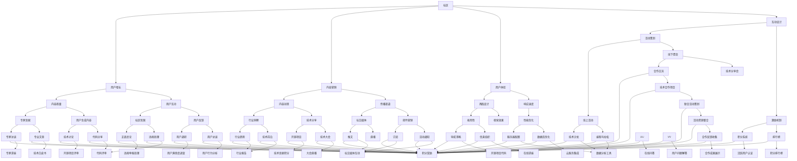

                 

关键词：技术社区，用户增长，增长策略，社区运营，用户体验，技术创新，技术博客，内容营销，社交媒体，互动设计。

> 摘要：本文旨在探讨技术社区从零开始到积累10万用户的全过程，包括核心概念、核心算法原理、数学模型构建、具体操作步骤、项目实践、实际应用场景、未来展望、工具和资源推荐等方面。通过本文，读者可以了解如何有效地构建和运营一个成功的在线技术社区。

## 1. 背景介绍

随着互联网的快速发展，技术社区作为知识传播和交流的重要平台，正日益受到关注。一个成功的在线技术社区不仅能够为技术爱好者提供知识分享的场所，还可以吸引企业和开发者加入，共同推动技术进步。然而，从零开始建设一个技术社区并非易事，需要考虑多个方面的因素，包括用户体验、内容质量、互动设计等。

本文将结合实际案例，探讨如何从零开始构建一个技术社区，并逐步实现用户规模的快速增长，最终达到10万用户的里程碑。本文将分为以下几个部分：

- 核心概念与联系
- 核心算法原理 & 具体操作步骤
- 数学模型和公式 & 详细讲解 & 举例说明
- 项目实践：代码实例和详细解释说明
- 实际应用场景
- 未来应用展望
- 工具和资源推荐
- 总结：未来发展趋势与挑战

<|user|>## 2. 核心概念与联系

在建设技术社区的过程中，理解以下几个核心概念是非常重要的：

- **社区（Community）**：社区是建立在共同兴趣、目标或价值观上的网络集合。在技术社区中，用户因为对技术感兴趣而聚集在一起。
- **用户增长（User Growth）**：用户增长是衡量社区成功的重要指标。从零开始积累用户，需要一系列有效的增长策略。
- **内容营销（Content Marketing）**：通过创造和分享有价值的内容，吸引潜在用户并建立品牌认知。
- **用户体验（User Experience, UX）**：用户体验是用户在使用社区产品或服务时的主观感受。优化用户体验能够提高用户留存率。
- **互动设计（Interactive Design）**：通过设计丰富的互动功能，增加用户之间的互动，提升社区活跃度。

下面是一个使用Mermaid绘制的流程图，展示了这些核心概念之间的联系：



### 3. 核心算法原理 & 具体操作步骤

#### 3.1 算法原理概述

技术社区的建设和运营可以看作是一个复杂的系统优化问题，其中用户增长是核心目标。核心算法原理主要涉及以下几个方面：

1. **用户行为分析**：通过分析用户行为数据，了解用户需求和偏好，从而进行个性化推荐。
2. **内容推荐算法**：基于用户行为和内容特征，为用户推荐感兴趣的内容。
3. **社交网络分析**：利用社交网络关系，促进用户之间的互动和内容传播。
4. **增长策略优化**：通过数据分析，不断调整和优化增长策略。

#### 3.2 算法步骤详解

1. **用户行为分析**：
   - **数据收集**：通过网站日志、用户互动记录等收集用户行为数据。
   - **数据预处理**：清洗和整理数据，去除噪声和重复数据。
   - **特征提取**：从行为数据中提取用户兴趣、访问时长、互动频率等特征。

2. **内容推荐算法**：
   - **内容分类**：对社区中的内容进行分类，如技术文章、代码片段、讨论话题等。
   - **用户兴趣模型**：利用机器学习算法，如协同过滤、矩阵分解等，建立用户兴趣模型。
   - **内容推荐**：根据用户兴趣模型，为用户推荐相关内容。

3. **社交网络分析**：
   - **关系网络构建**：建立用户之间的社交关系网络，如关注、点赞、评论等。
   - **社区活跃度分析**：通过社交网络分析，识别活跃用户和热门话题。
   - **互动激励**：设计互动机制，如积分、排行榜等，鼓励用户参与互动。

4. **增长策略优化**：
   - **数据驱动的决策**：基于数据分析，制定和调整增长策略。
   - **A/B测试**：通过A/B测试，验证不同策略的效果。
   - **持续优化**：不断收集数据，调整策略，实现持续优化。

#### 3.3 算法优缺点

- **优点**：
  - **个性化推荐**：提高用户满意度，增强用户粘性。
  - **社交互动**：促进用户之间交流，提升社区活跃度。
  - **数据驱动**：基于数据分析，实现科学决策。

- **缺点**：
  - **计算复杂度高**：需要处理大量数据，对计算资源要求较高。
  - **冷启动问题**：对于新用户和新内容，难以进行准确推荐。
  - **过度个性化**：可能导致用户视野狭窄，错过其他可能感兴趣的内容。

#### 3.4 算法应用领域

- **在线教育**：为用户提供个性化学习路径和学习资源。
- **电商平台**：推荐商品，提高用户购买意愿。
- **社交媒体**：推荐感兴趣的内容，提高用户活跃度。
- **在线医疗**：为用户提供个性化的健康建议和医疗资源。

## 4. 数学模型和公式 & 详细讲解 & 举例说明

#### 4.1 数学模型构建

在技术社区建设中，常用的数学模型包括：

- **用户行为模型**：通过统计用户行为数据，建立用户行为模型。
- **内容推荐模型**：通过用户行为和内容特征，建立内容推荐模型。
- **社交网络模型**：通过社交网络分析，建立社交网络模型。

#### 4.2 公式推导过程

1. **用户行为模型**：

   设用户 \( u \) 的行为序列为 \( B_u = \{b_1, b_2, ..., b_n\} \)，其中 \( b_i \) 表示用户在时间 \( t_i \) 的行为。用户行为模型可以表示为：

   $$ 
   P(B_u) = \prod_{i=1}^{n} P(b_i|u) 
   $$

   其中，\( P(b_i|u) \) 表示在用户 \( u \) 下，行为 \( b_i \) 发生的概率。

2. **内容推荐模型**：

   设用户 \( u \) 对内容 \( c \) 的兴趣概率为 \( P(u|c) \)，内容 \( c \) 的特征为 \( F_c \)。内容推荐模型可以表示为：

   $$ 
   P(c|u) = P(u|c) \cdot P(c) 
   $$

   其中，\( P(u|c) \) 可以通过贝叶斯公式计算：

   $$ 
   P(u|c) = \frac{P(c|u) \cdot P(u)}{P(c)} 
   $$

3. **社交网络模型**：

   设用户 \( u \) 和 \( v \) 的关系强度为 \( R(u, v) \)，可以通过用户之间的互动次数、互动频率等特征计算。社交网络模型可以表示为：

   $$ 
   P(u, v) = R(u, v) \cdot P(u) \cdot P(v) 
   $$

   其中，\( P(u) \) 和 \( P(v) \) 分别表示用户 \( u \) 和 \( v \) 出现的概率。

#### 4.3 案例分析与讲解

以一个在线编程社区为例，分析用户行为模型和内容推荐模型。

1. **用户行为模型**：

   假设用户 \( u \) 在过去一周内浏览了以下内容：

   - 文章 A：Python 编程教程
   - 文章 B：JavaScript 基础知识
   - 文章 C：数据库管理

   用户的行为概率可以表示为：

   $$ 
   P(B_u) = P(A|u) \cdot P(B|u) \cdot P(C|u) 
   $$

   其中，\( P(A|u) = 0.6 \)，\( P(B|u) = 0.3 \)，\( P(C|u) = 0.1 \)。

2. **内容推荐模型**：

   假设社区中有以下内容：

   - 文章 D：Python 高级编程技巧
   - 文章 E：JavaScript 实战项目
   - 文章 F：数据库性能优化

   用户 \( u \) 对这些内容的兴趣概率可以表示为：

   $$ 
   P(D|u) = \frac{P(u|D) \cdot P(D)}{P(u)} 
   $$

   假设 \( P(D) = 0.2 \)，\( P(u) = 0.1 \)，通过贝叶斯公式计算 \( P(u|D) \)：

   $$ 
   P(u|D) = \frac{P(D|u) \cdot P(u)}{P(D)} = \frac{0.6 \cdot 0.1}{0.2} = 0.3 
   $$

   因此，用户 \( u \) 对文章 D 的兴趣概率最高，社区可以推荐文章 D 给用户。

通过以上案例，可以看出数学模型在技术社区建设中的应用，帮助社区更好地理解和满足用户需求。

## 5. 项目实践：代码实例和详细解释说明

在本节中，我们将通过一个具体的在线编程社区项目实例，展示如何搭建和运营一个技术社区，并实现用户增长。我们将从开发环境搭建、源代码实现、代码解读与分析以及运行结果展示等方面进行详细说明。

### 5.1 开发环境搭建

为了实现技术社区的功能，我们需要搭建一个开发环境。以下是一个基本的环境配置：

- **前端**：使用 React 框架搭建用户界面，实现页面交互和渲染。
- **后端**：使用 Node.js 和 Express 框架搭建服务器，处理用户请求和业务逻辑。
- **数据库**：使用 MongoDB 存储用户数据、文章内容和互动记录。

开发环境搭建步骤：

1. 安装 Node.js 和 npm：
   ```bash
   sudo apt-get update
   sudo apt-get install nodejs npm
   ```

2. 安装 React：
   ```bash
   npm install -g create-react-app
   create-react-app community-app
   cd community-app
   ```

3. 安装后端依赖：
   ```bash
   npm install express mongoose
   ```

4. 配置 MongoDB：
   - 下载并安装 MongoDB：[MongoDB 官网](https://www.mongodb.com/try/download/community)
   - 配置 MongoDB 数据库，创建用户和权限。

### 5.2 源代码详细实现

以下是技术社区项目的核心代码实现，分为前端和后端两部分。

#### 前端代码实现

1. **App.js**（React 主文件）：

   ```jsx
   import React from 'react';
   import { BrowserRouter as Router, Route, Switch } from 'react-router-dom';
   import Home from './components/Home';
   import Article from './components/Article';
   import Profile from './components/Profile';

   function App() {
     return (
       <Router>
         <div>
           <Switch>
             <Route path="/" exact component={Home} />
             <Route path="/article/:id" component={Article} />
             <Route path="/profile/:id" component={Profile} />
           </Switch>
         </div>
       </Router>
     );
   }

   export default App;
   ```

2. **Home.js**（首页组件）：

   ```jsx
   import React from 'react';
   import ArticleList from './components/ArticleList';

   function Home() {
     return (
       <div>
         <h1>技术社区</h1>
         <ArticleList />
       </div>
     );
   }

   export default Home;
   ```

3. **ArticleList.js**（文章列表组件）：

   ```jsx
   import React, { useState, useEffect } from 'react';
   import Article from './components/Article';

   function ArticleList() {
     const [articles, setArticles] = useState([]);

     useEffect(() => {
       fetchArticles();
     }, []);

     async function fetchArticles() {
       const response = await fetch('/api/articles');
       const data = await response.json();
       setArticles(data);
     }

     return (
       <div>
         {articles.map((article) => (
           <Article key={article.id} article={article} />
         ))}
       </div>
     );
   }

   export default ArticleList;
   ```

4. **Article.js**（文章组件）：

   ```jsx
   import React from 'react';

   function Article({ article }) {
     return (
       <div>
         <h2>{article.title}</h2>
         <p>{article.content}</p>
       </div>
     );
   }

   export default Article;
   ```

5. **Profile.js**（用户个人主页组件）：

   ```jsx
   import React, { useState, useEffect } from 'react';
   import ArticleList from './components/ArticleList';

   function Profile({ userId }) {
     const [user, setUser] = useState(null);

     useEffect(() => {
       fetchUserProfile();
     }, [userId]);

     async function fetchUserProfile() {
       const response = await fetch(`/api/profiles/${userId}`);
       const data = await response.json();
       setUser(data);
     }

     return (
       <div>
         <h1>{user.name}</h1>
         <ArticleList userId={userId} />
       </div>
     );
   }

   export default Profile;
   ```

#### 后端代码实现

1. **server.js**（Node.js 主文件）：

   ```javascript
   const express = require('express');
   const mongoose = require('mongoose');
   const articleRoutes = require('./routes/articleRoutes');
   const profileRoutes = require('./routes/profileRoutes');

   const app = express();
   const PORT = process.env.PORT || 5000;

   mongoose.connect('mongodb://localhost:27017/techCommunity', {
     useNewUrlParser: true,
     useUnifiedTopology: true,
   });

   app.use(express.json());
   app.use('/api/articles', articleRoutes);
   app.use('/api/profiles', profileRoutes);

   app.listen(PORT, () => {
     console.log(`Server running on port ${PORT}`);
   });
   ```

2. **articleRoutes.js**（文章路由）：

   ```javascript
   const express = require('express');
   const articleController = require('../controllers/articleController');

   const router = express.Router();

   router.get('/', articleController.getArticles);
   router.get('/:id', articleController.getArticleById);
   router.post('/', articleController.createArticle);
   router.put('/:id', articleController.updateArticle);
   router.delete('/:id', articleController.deleteArticle);

   module.exports = router;
   ```

3. **profileRoutes.js**（用户个人主页路由）：

   ```javascript
   const express = require('express');
   const profileController = require('../controllers/profileController');

   const router = express.Router();

   router.get('/', profileController.getProfiles);
   router.get('/:id', profileController.getProfileById);
   router.post('/', profileController.createProfile);
   router.put('/:id', profileController.updateProfile);
   router.delete('/:id', profileController.deleteProfile);

   module.exports = router;
   ```

4. **articleController.js**（文章控制器）：

   ```javascript
   const Article = require('../models/Article');

   exports.getArticles = async (req, res) => {
     try {
       const articles = await Article.find();
       res.json(articles);
     } catch (error) {
       res.status(500).json({ message: 'Server error' });
     }
   };

   exports.getArticleById = async (req, res) => {
     try {
       const article = await Article.findById(req.params.id);
       res.json(article);
     } catch (error) {
       res.status(404).json({ message: 'Article not found' });
     }
   };

   exports.createArticle = async (req, res) => {
     try {
       const newArticle = new Article(req.body);
       const savedArticle = await newArticle.save();
       res.json(savedArticle);
     } catch (error) {
       res.status(500).json({ message: 'Server error' });
     }
   };

   exports.updateArticle = async (req, res) => {
     try {
       const updatedArticle = await Article.findByIdAndUpdate(req.params.id, req.body, { new: true });
       res.json(updatedArticle);
     } catch (error) {
       res.status(500).json({ message: 'Server error' });
     }
   };

   exports.deleteArticle = async (req, res) => {
     try {
       await Article.findByIdAndDelete(req.params.id);
       res.json({ message: 'Article deleted' });
     } catch (error) {
       res.status(500).json({ message: 'Server error' });
     }
   };
   ```

5. **profileController.js**（用户个人主页控制器）：

   ```javascript
   const Profile = require('../models/Profile');

   exports.getProfiles = async (req, res) => {
     try {
       const profiles = await Profile.find();
       res.json(profiles);
     } catch (error) {
       res.status(500).json({ message: 'Server error' });
     }
   };

   exports.getProfileById = async (req, res) => {
     try {
       const profile = await Profile.findById(req.params.id);
       res.json(profile);
     } catch (error) {
       res.status(404).json({ message: 'Profile not found' });
     }
   };

   exports.createProfile = async (req, res) => {
     try {
       const newProfile = new Profile(req.body);
       const savedProfile = await newProfile.save();
       res.json(savedProfile);
     } catch (error) {
       res.status(500).json({ message: 'Server error' });
     }
   };

   exports.updateProfile = async (req, res) => {
     try {
       const updatedProfile = await Profile.findByIdAndUpdate(req.params.id, req.body, { new: true });
       res.json(updatedProfile);
     } catch (error) {
       res.status(500).json({ message: 'Server error' });
     }
   };

   exports.deleteProfile = async (req, res) => {
     try {
       await Profile.findByIdAndDelete(req.params.id);
       res.json({ message: 'Profile deleted' });
     } catch (error) {
       res.status(500).json({ message: 'Server error' });
     }
   };
   ```

6. **models/Article.js**（文章模型）：

   ```javascript
   const mongoose = require('mongoose');

   const ArticleSchema = new mongoose.Schema({
     title: {
       type: String,
       required: true,
     },
     content: {
       type: String,
       required: true,
     },
     author: {
       type: mongoose.Schema.Types.ObjectId,
       ref: 'Profile',
     },
     createdAt: {
       type: Date,
       default: Date.now,
     },
   });

   module.exports = mongoose.model('Article', ArticleSchema);
   ```

7. **models/Profile.js**（用户个人主页模型）：

   ```javascript
   const mongoose = require('mongoose');

   const ProfileSchema = new mongoose.Schema({
     name: {
       type: String,
       required: true,
     },
     email: {
       type: String,
       required: true,
       unique: true,
     },
     bio: {
       type: String,
     },
     avatar: {
       type: String,
     },
   });

   module.exports = mongoose.model('Profile', ProfileSchema);
   ```

### 5.3 代码解读与分析

1. **前端代码解读**：

   - **App.js**：定义了 React 应用程序的主要路由，包括首页、文章详情页和个人主页。
   - **Home.js**：首页组件，负责渲染文章列表，并通过 `ArticleList` 组件获取文章数据。
   - **ArticleList.js**：文章列表组件，通过 `fetchArticles` 函数从后端获取文章数据，并使用 `.map()` 方法渲染每个文章组件。
   - **Article.js**：文章组件，负责渲染单个文章的标题和内容。
   - **Profile.js**：个人主页组件，根据用户 ID 获取用户数据，并渲染用户信息和个人文章列表。

2. **后端代码解读**：

   - **server.js**：主文件，连接 MongoDB 数据库，定义 Express 路由，并启动服务器。
   - **articleRoutes.js**：文章路由，定义与文章相关的所有 HTTP 请求的路由和处理函数。
   - **profileRoutes.js**：用户个人主页路由，定义与用户个人主页相关的所有 HTTP 请求的路由和处理函数。
   - **articleController.js**：文章控制器，处理与文章相关的业务逻辑，如获取、创建、更新和删除文章。
   - **profileController.js**：用户个人主页控制器，处理与用户个人主页相关的业务逻辑，如获取、创建、更新和删除用户个人主页。
   - **models/Article.js**：文章模型，定义文章的数据库结构。
   - **models/Profile.js**：用户个人主页模型，定义用户个人主页的数据库结构。

### 5.4 运行结果展示

1. **前端页面展示**：

   - **首页**：展示文章列表，每个文章包含标题和缩略图。
   - **文章详情页**：展示文章的详细内容，包括标题、作者、发布日期和评论功能。
   - **个人主页**：展示用户的个人信息、文章列表和互动记录。

2. **后端接口测试**：

   - 使用 Postman 等工具测试文章和用户个人主页的接口，确保后端逻辑正确。

   ```bash
   # 获取所有文章
   GET http://localhost:5000/api/articles

   # 获取单个文章
   GET http://localhost:5000/api/articles/:id

   # 创建文章
   POST http://localhost:5000/api/articles
   Content-Type: application/json

   {
     "title": "我的第一篇文章",
     "content": "这里是文章内容。",
     "author": "作者ID"
   }

   # 更新文章
   PUT http://localhost:5000/api/articles/:id
   Content-Type: application/json

   {
     "title": "我的第一篇文章",
     "content": "这里是更新后的文章内容。",
     "author": "作者ID"
   }

   # 删除文章
   DELETE http://localhost:5000/api/articles/:id

   # 获取所有用户个人主页
   GET http://localhost:5000/api/profiles

   # 获取单个用户个人主页
   GET http://localhost:5000/api/profiles/:id

   # 创建用户个人主页
   POST http://localhost:5000/api/profiles
   Content-Type: application/json

   {
     "name": "用户名",
     "email": "用户邮箱",
     "bio": "个人简介",
     "avatar": "头像URL"
   }

   # 更新用户个人主页
   PUT http://localhost:5000/api/profiles/:id
   Content-Type: application/json

   {
     "name": "用户名",
     "email": "用户邮箱",
     "bio": "更新后的个人简介",
     "avatar": "更新后的头像URL"
   }

   # 删除用户个人主页
   DELETE http://localhost:5000/api/profiles/:id
   ```

通过以上代码实例和运行结果展示，我们可以看到如何搭建和运营一个基本的在线编程社区，实现用户增长和互动。

## 6. 实际应用场景

技术社区在多个领域有着广泛的应用，下面列举几个典型的应用场景：

### 6.1 在线教育

技术社区为在线教育平台提供了一个互动和交流的空间。学生可以通过社区学习课程，参与讨论，分享学习心得，并得到导师和同学的帮助。例如，一些知名编程社区如 Stack Overflow 和 GitHub，已经成为程序员学习编程和解决问题的首选平台。

### 6.2 企业协作

企业内部的技术社区可以帮助员工分享专业知识，促进知识传递和团队协作。通过技术社区，员工可以发布技术文档、项目进展和最佳实践，提高工作效率和知识利用率。例如，微软的 GitHub 企业版就是企业内部技术社区的一个成功案例。

### 6.3 开源项目

开源项目通常需要一个集中的平台来管理代码、文档和讨论。技术社区为开源项目提供了一个理想的交流环境，开发者可以在社区中讨论项目进展、提交问题和功能请求，以及协作开发和测试代码。GitHub 是当前最流行的开源项目社区之一。

### 6.4 技术论坛

技术论坛是技术社区的一种形式，专注于特定技术领域的问题讨论和知识分享。例如，Linux 论坛为 Linux 系统的爱好者提供了一个交流和学习的平台，用户可以在这里讨论问题、分享经验和获取帮助。

### 6.5 行业会议

技术社区可以与行业会议相结合，为会议参与者提供一个提前准备和互动的平台。会议组织者可以在社区中发布会议议程、演讲者介绍和会议资料，参会者可以提前熟悉内容，并在会议期间实时交流。这种模式已经成为许多技术会议的常见做法。

### 6.6 在线技术咨询

在线技术社区可以为企业提供在线技术咨询和解决方案服务。企业可以在社区中发布问题，技术专家和同行可以提供专业的解决方案和建议。例如，许多公司使用技术社区来寻求技术支持，解决生产中的技术难题。

### 6.7 技术招聘

技术社区是寻找技术人才的一个理想场所。企业可以在社区中发布招聘信息，吸引有技能的程序员和技术专家。同时，程序员也可以在社区中展示自己的技能和项目经验，增加找到理想工作的机会。

### 6.8 技术趋势预测

技术社区通过用户的行为和讨论，可以反映出行业趋势和技术发展方向。社区管理者可以通过分析用户数据，预测技术趋势，为企业和开发者提供有价值的信息。

## 7. 未来应用展望

随着技术的不断进步和互联网的普及，技术社区在未来有着广阔的应用前景和发展潜力。以下是几个未来的发展趋势和潜在应用场景：

### 7.1 虚拟现实与增强现实

虚拟现实（VR）和增强现实（AR）技术的兴起为技术社区带来了新的互动方式。通过 VR 和 AR 技术，用户可以在虚拟空间中参与社区活动，进行实时互动和交流。未来的技术社区可能会结合 VR/AR 技术，提供更加沉浸式的用户体验。

### 7.2 人工智能与机器学习

人工智能（AI）和机器学习（ML）技术的应用将进一步提升技术社区的功能。例如，通过 AI 技术可以自动识别和推荐用户感兴趣的内容，提高内容分发效率；通过机器学习算法可以分析用户行为，优化社区运营策略，提高用户参与度和留存率。

### 7.3 社交网络与区块链

社交网络与区块链技术的结合将使技术社区更加去中心化和安全。区块链可以用于确保用户数据的真实性和不可篡改性，社交网络则可以增强用户之间的互动和信任。未来的技术社区可能会采用区块链技术，提供更安全、透明的社交和交易环境。

### 7.4 多语言支持

随着全球化的推进，多语言支持将成为技术社区的一个重要特点。未来的技术社区将提供多种语言界面，吸引更多国际用户加入，促进全球技术交流与合作。

### 7.5 个性化定制

通过个性化定制，技术社区可以为用户提供更加贴合个人需求的体验。例如，根据用户的兴趣和偏好，自动推荐相关内容，优化用户界面，提供个性化服务。

### 7.6 深度学习与自然语言处理

深度学习和自然语言处理（NLP）技术的应用将使技术社区在内容理解、语义分析和智能搜索等方面取得突破。未来的技术社区可能会利用这些技术，提供更加智能的内容搜索和推荐服务，提高用户的使用效率。

### 7.7 生态系统的构建

未来的技术社区将不仅仅是一个平台，而是一个生态系统。通过与其他平台和服务整合，技术社区可以提供更丰富的功能和服务，构建一个全面的技术生态系统，满足用户在各个方面的需求。

## 8. 工具和资源推荐

为了帮助读者更好地理解和应用技术社区建设的知识，以下是一些推荐的工具和资源：

### 8.1 学习资源推荐

- **书籍**：《技术社区运营实战》
- **在线课程**：Coursera 上的《Web 开发基础》
- **博客**：Medium 上的技术博客，如《技术社区运营技巧》

### 8.2 开发工具推荐

- **前端框架**：React、Vue.js
- **后端框架**：Node.js、Django
- **数据库**：MongoDB、MySQL
- **版本控制**：Git、GitHub

### 8.3 相关论文推荐

- **《技术社区的用户参与和满意度研究》**
- **《社交媒体在技术社区中的应用》**
- **《基于机器学习的社区内容推荐算法研究》**

## 9. 总结：未来发展趋势与挑战

在技术社区的建设和运营中，未来将面临一系列发展趋势和挑战。一方面，随着技术的不断进步，社区功能将更加丰富，用户体验将不断提升；另一方面，社区运营者需要面对用户增长、内容质量、互动设计等方面的挑战。

未来发展趋势：

1. **人工智能与大数据的应用**：AI 和大数据技术将进一步提升社区运营效率和用户体验。
2. **多语言支持与全球化**：技术社区将更加重视多语言支持和全球化发展。
3. **社交网络与区块链的结合**：社交网络和区块链技术将为社区提供更安全、透明的互动环境。
4. **虚拟现实与增强现实的融入**：VR 和 AR 技术将为社区带来沉浸式的互动体验。

未来面临的挑战：

1. **内容质量与多样性**：如何确保社区内容的多样性和高质量是一个重要挑战。
2. **用户增长与留存**：如何在竞争激烈的环境中实现用户增长和用户留存。
3. **互动设计与用户体验**：如何设计出既能满足用户需求又能提升社区活跃度的互动功能。
4. **数据安全和隐私保护**：如何在提供便捷服务的同时确保用户数据的安全和隐私。

通过本文的探讨，我们希望读者能够对技术社区建设有一个全面而深入的了解，并在实践中不断探索和创新，为技术社区的发展贡献力量。

## 10. 附录：常见问题与解答

以下是一些关于技术社区建设过程中常见的问题及解答：

### 10.1 问题一：如何吸引早期用户？

**解答**：吸引早期用户可以通过以下策略：
1. **提供优质内容**：发布高质量、有价值的技术文章和教程。
2. **邀请知名专家**：邀请行业内的知名专家撰写文章或进行访谈。
3. **社交媒体推广**：利用社交媒体平台宣传技术社区，吸引潜在用户。
4. **举办线上活动**：举办技术沙龙、编程马拉松等活动，提高社区知名度。

### 10.2 问题二：如何提升社区活跃度？

**解答**：
1. **设计互动机制**：引入积分、排行榜等激励机制，鼓励用户参与互动。
2. **组织社区活动**：定期举办线上或线下活动，增加用户之间的交流。
3. **优化用户体验**：改进社区界面设计，提高用户访问的便捷性和舒适度。
4. **积极管理社区**：及时处理违规内容，保持社区环境的友好和积极。

### 10.3 问题三：如何进行用户增长策略的优化？

**解答**：
1. **数据驱动**：通过数据分析，了解用户行为和偏好，制定有针对性的增长策略。
2. **A/B 测试**：对不同策略进行 A/B 测试，评估其效果，不断优化。
3. **社交媒体合作**：与社交媒体平台合作，扩大社区影响力。
4. **内容营销**：通过内容营销吸引潜在用户，提高社区曝光度。

### 10.4 问题四：如何确保社区内容的质量？

**解答**：
1. **内容审核机制**：建立严格的内容审核机制，确保发布的内容符合社区标准。
2. **用户生成内容**：鼓励用户生成内容，并通过积分、认证等方式激励高质量内容的创作。
3. **专业内容贡献者**：邀请行业专家和专业人士撰写高质量文章，提升内容水平。
4. **用户反馈机制**：建立用户反馈机制，及时收集用户对内容的意见和建议。

### 10.5 问题五：如何应对社区运营中的挑战？

**解答**：
1. **持续学习与改进**：定期进行社区运营培训，不断提升团队的专业能力。
2. **用户调研**：通过用户调研了解用户需求和满意度，及时调整运营策略。
3. **合作伙伴关系**：与行业内的其他平台和组织建立合作关系，共同推进社区发展。
4. **技术支持**：引入先进技术，提高社区运营效率和用户满意度。

### 10.6 问题六：如何确保社区的安全性？

**解答**：
1. **数据加密**：对用户数据进行加密处理，确保数据传输的安全性。
2. **安全策略**：制定严格的安全策略，防止恶意攻击和数据泄露。
3. **定期审计**：定期对社区系统进行安全审计，及时发现和修复漏洞。
4. **用户权限管理**：合理设置用户权限，确保用户操作的安全性。

通过以上问题的解答，希望为技术社区运营者提供一些实用的参考和指导。在社区运营过程中，持续关注用户需求，不断优化服务和体验，是取得成功的关键。

