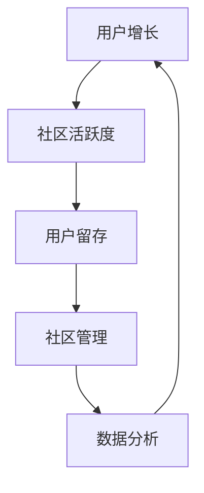
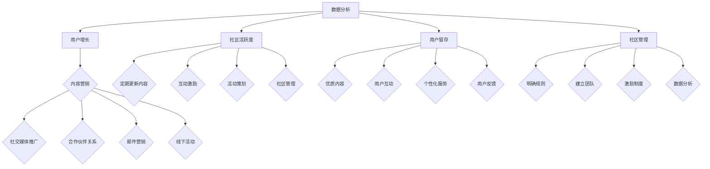

                 

 在信息技术飞速发展的时代，技术社区已经成为开发者获取知识、交流经验和分享创新的重要平台。然而，从零开始打造一个活跃的技术社区，吸引并保持大量的用户参与，并非易事。本文将探讨如何通过有效的策略和最佳实践，将一个技术社区从零用户逐步发展壮大，达到10000用户的规模。

## 关键词

- 技术社区
- 用户增长
- 社区运营
- 社交媒体
- 内容营销
- 社区活跃度

## 摘要

本文旨在提供一套系统化的运营策略，帮助初涉社区运营的个人或团队成功吸引并维持技术社区的用户增长。文章将详细讨论社区核心概念的建立、算法原理、数学模型、项目实践以及未来应用展望。通过深入解析成功案例和提供实用的工具和资源，本文将为技术社区运营者提供实用的指导。

## 1. 背景介绍

技术社区的出现是信息技术发展的必然结果。随着互联网的普及和社交网络的兴起，开发者们不再满足于传统的知识获取方式，而是希望通过互动和分享来提升自身的技能水平。技术社区作为一种新兴的知识共享平台，为开发者提供了一个自由交流的空间，使得知识的传播更加高效和多样化。

然而，技术社区的成功并非一蹴而就。从零用户开始，如何吸引早期用户、保持社区活跃度、并最终实现用户增长，是每一个技术社区运营者都必须面对的挑战。本文将围绕这一核心问题，通过系统化的策略和实际操作，为技术社区的发展提供实用的指导。

### 1.1 技术社区的现状与挑战

当前，技术社区呈现出以下几个显著特点：

1. **多样性**：技术社区覆盖了广泛的领域，包括编程语言、数据库、云计算、人工智能等。
2. **互动性**：技术社区鼓励用户之间的交流和互动，通过提问、回答、讨论等形式分享知识和经验。
3. **专业性**：技术社区聚集了大量的专业开发者，使得社区内的讨论具有较高的技术含量和专业性。
4. **动态性**：技术社区内容不断更新，用户可以实时获取最新的技术资讯和研究成果。

尽管技术社区具有上述优势，但也面临着一些挑战：

1. **用户增长缓慢**：从零开始吸引早期用户是社区运营的难点之一。
2. **内容质量不稳定**：保持高质量的内容输出是维持社区活跃度的关键，但内容质量的不稳定会直接影响用户体验。
3. **社区管理复杂**：随着用户数量的增加，社区管理的复杂性也随之提升，需要建立一套有效的管理制度和激励机制。
4. **市场竞争激烈**：现有的技术社区众多，如何在激烈的市场竞争中脱颖而出，吸引并留住用户，是每一个技术社区运营者都必须面对的挑战。

### 1.2 目标与结构

本文的目标是提供一套系统化的运营策略，帮助技术社区从零用户开始，逐步实现用户增长，最终达到10000用户的规模。文章将按照以下结构进行：

1. **核心概念与联系**：介绍技术社区运营的核心概念和流程，并使用Mermaid流程图进行说明。
2. **核心算法原理 & 具体操作步骤**：详细阐述技术社区运营的核心算法原理，以及具体的操作步骤和策略。
3. **数学模型和公式**：讨论技术社区运营的数学模型和公式，并进行详细讲解和案例分析。
4. **项目实践：代码实例和详细解释说明**：提供实际的项目实践案例，包括开发环境搭建、源代码实现、代码解读和运行结果展示。
5. **实际应用场景**：探讨技术社区在实际应用场景中的具体应用，并展望未来应用的发展方向。
6. **工具和资源推荐**：推荐学习资源、开发工具和相关论文，为技术社区运营者提供实用的工具和资源。
7. **总结：未来发展趋势与挑战**：总结研究成果，探讨未来发展趋势和面临的挑战，为技术社区运营提供展望。

### 1.3 运营策略的核心概念

在技术社区运营中，以下几个核心概念是至关重要的：

1. **用户增长**：用户增长是技术社区发展的核心目标。通过有效的营销策略和内容策划，吸引早期用户并逐步扩大用户基础。
2. **社区活跃度**：社区活跃度是衡量技术社区健康程度的重要指标。保持社区活跃度需要持续提供高质量的内容和互动机会，激发用户的参与热情。
3. **用户留存**：用户留存是技术社区长期发展的基础。通过提供优质服务和丰富内容，提高用户的黏性，减少用户流失。
4. **社区管理**：社区管理是技术社区运营的重要环节。建立完善的社区管理制度和激励机制，确保社区秩序和氛围的良好。
5. **数据分析**：数据分析是技术社区运营的重要工具。通过数据分析，了解用户行为和需求，优化运营策略，提高运营效率。

接下来，本文将详细探讨这些核心概念的实施方法和最佳实践。

### 1.4 社区运营的 Mermaid 流程图

以下是一个简单的 Mermaid 流程图，展示了技术社区运营的基本流程：



在这个流程图中，用户增长、社区活跃度、用户留存、社区管理和数据分析相互关联，形成了一个循环体系。用户增长是整个流程的起点，通过有效的运营策略吸引早期用户；社区活跃度是维持用户参与的关键，通过高质量的内容和互动激发用户活跃；用户留存是社区长期发展的基础，通过优质服务和内容提高用户黏性；社区管理是确保社区秩序和氛围的良好，通过建立管理制度和激励机制维护社区健康；数据分析则是整个流程的反馈机制，通过分析用户行为和需求，优化运营策略，进一步提高用户增长和社区活跃度。

## 2. 核心概念与联系

### 2.1 用户增长

用户增长是技术社区运营的核心目标，也是社区发展的基础。要实现用户增长，首先需要了解用户的来源和渠道。以下是一些常见的用户增长策略：

1. **内容营销**：通过发布高质量的技术文章、教程、案例等，吸引用户访问社区。
2. **社交媒体推广**：利用微博、知乎、GitHub等社交媒体平台，推广技术社区，吸引潜在用户。
3. **合作伙伴关系**：与其他技术社区、博客或媒体建立合作伙伴关系，进行资源互换和推广。
4. **邮件营销**：通过发送邮件通知、活动邀请等，保持与用户的联系，提高用户活跃度。
5. **线下活动**：组织技术沙龙、研讨会等活动，吸引线下用户参与社区。

### 2.2 社区活跃度

社区活跃度是衡量技术社区健康程度的重要指标。保持社区活跃度需要提供丰富的内容和互动机会，以下是一些建议：

1. **定期更新内容**：持续发布高质量的技术文章、教程、案例分析等，保持社区内容的活力。
2. **互动激励**：通过积分、勋章等激励机制，鼓励用户参与讨论和贡献内容。
3. **活动策划**：定期组织线上或线下活动，如技术分享会、编程比赛等，提高用户参与度。
4. **社区管理**：建立严格的社区规则和管理制度，确保社区秩序良好，避免恶意行为。

### 2.3 用户留存

用户留存是技术社区长期发展的基础。以下是一些提高用户留存的方法：

1. **优质内容**：提供有价值、实用的技术内容，满足用户的学习和交流需求。
2. **用户互动**：鼓励用户之间的互动和交流，建立良好的社区氛围。
3. **个性化服务**：根据用户行为和兴趣，提供个性化的内容和推荐，提高用户的黏性。
4. **用户反馈**：积极收集用户反馈，及时解决问题，提高用户满意度。

### 2.4 社区管理

社区管理是技术社区运营的重要环节。以下是一些社区管理的建议：

1. **明确规则**：制定明确的社区规则，包括内容规范、行为准则等，确保社区秩序。
2. **建立团队**：组建专业的社区运营团队，负责内容审核、活动策划、用户管理等任务。
3. **激励制度**：建立激励机制，鼓励优秀用户和贡献者，提高社区活力。
4. **数据分析**：通过数据分析，了解用户行为和需求，优化运营策略，提高社区质量。

### 2.5 数据分析

数据分析是技术社区运营的重要工具。以下是一些常用的数据分析方法：

1. **用户行为分析**：通过分析用户访问量、页面停留时间、互动率等指标，了解用户行为和偏好。
2. **内容分析**：通过分析文章阅读量、评论数量、点赞数等指标，评估内容质量。
3. **活动分析**：通过分析活动参与人数、活动效果等指标，评估活动策划的成功度。
4. **用户反馈分析**：通过分析用户反馈，了解用户需求和意见，优化社区服务和体验。

### 2.6 Mermaid 流程图

以下是一个详细的 Mermaid 流程图，展示了技术社区运营的核心概念和流程：



在这个流程图中，用户增长、社区活跃度、用户留存和社区管理相互关联，形成了一个完整的运营体系。通过有效的用户增长策略，吸引早期用户；通过保持社区活跃度，提高用户参与度；通过提高用户留存，建立社区基础；通过有效的社区管理，维护社区秩序和氛围。数据分析则贯穿整个流程，为运营策略的优化提供数据支持。

## 3. 核心算法原理 & 具体操作步骤

### 3.1 算法原理概述

在技术社区运营中，算法原理的作用至关重要。以下是一些关键的算法原理及其在社区运营中的应用：

1. **用户行为预测**：通过分析用户的历史行为和兴趣，预测用户的未来行为，从而提供个性化的内容和推荐。
2. **内容质量评估**：通过评估文章的阅读量、评论数量、点赞数等指标，判断内容的质量，为内容创作者提供反馈。
3. **社区活跃度分析**：通过分析用户的参与度、互动率等指标，评估社区的活跃程度，为活动策划和社区管理提供依据。
4. **用户留存率优化**：通过分析用户的行为模式和留存因素，制定针对性的策略，提高用户的留存率。

### 3.2 算法步骤详解

下面我们将详细讨论这些算法原理的具体操作步骤：

#### 3.2.1 用户行为预测

1. **数据收集**：收集用户在社区中的行为数据，如访问时间、浏览页面、评论、点赞等。
2. **特征提取**：从行为数据中提取关键特征，如用户访问频率、评论频率、点赞偏好等。
3. **模型训练**：利用机器学习算法（如决策树、随机森林、神经网络等），训练用户行为预测模型。
4. **模型评估**：通过交叉验证等方法，评估模型预测的准确性，并进行模型调优。
5. **预测应用**：将训练好的模型应用于新用户，预测其未来行为，并根据预测结果提供个性化推荐。

#### 3.2.2 内容质量评估

1. **数据收集**：收集文章的阅读量、评论数量、点赞数等指标。
2. **特征提取**：提取影响内容质量的关键特征，如文章标题、摘要、关键词、作者背景等。
3. **模型训练**：利用机器学习算法，训练内容质量评估模型。
4. **模型评估**：评估模型对内容质量评估的准确性，并进行模型调优。
5. **评估应用**：将评估模型应用于新文章，判断其质量，为内容创作者提供反馈。

#### 3.2.3 社区活跃度分析

1. **数据收集**：收集用户的参与度、互动率等指标。
2. **特征提取**：提取影响社区活跃度的关键特征，如活动类型、活动时间、用户参与频率等。
3. **模型训练**：利用机器学习算法，训练社区活跃度分析模型。
4. **模型评估**：评估模型对社区活跃度分析的准确性，并进行模型调优。
5. **分析应用**：将分析模型应用于新活动，预测其活跃程度，为活动策划提供依据。

#### 3.2.4 用户留存率优化

1. **数据收集**：收集用户的行为数据，如访问时间、页面停留时间、参与活动等。
2. **特征提取**：提取影响用户留存的关键特征，如用户活跃度、参与度、内容偏好等。
3. **模型训练**：利用机器学习算法，训练用户留存率优化模型。
4. **模型评估**：评估模型对用户留存率优化的准确性，并进行模型调优。
5. **优化应用**：根据模型预测结果，制定针对性的策略，提高用户的留存率。

### 3.3 算法优缺点

每种算法都有其独特的优缺点，以下是对上述算法的简要分析：

1. **用户行为预测**：
   - 优点：能够提供个性化的推荐，提高用户体验。
   - 缺点：需要大量用户行为数据支持，且预测准确性受模型质量影响。
2. **内容质量评估**：
   - 优点：有助于提升内容质量，优化内容创作。
   - 缺点：评估结果受数据质量和特征提取方法影响。
3. **社区活跃度分析**：
   - 优点：有助于了解社区活跃度，优化活动策划。
   - 缺点：需要长时间积累数据，且算法复杂度较高。
4. **用户留存率优化**：
   - 优点：有助于提高用户留存率，稳定社区发展。
   - 缺点：对用户行为数据的依赖性较强，且算法优化成本较高。

### 3.4 算法应用领域

这些算法原理在技术社区运营中有广泛的应用领域：

1. **个性化推荐**：通过用户行为预测，为用户提供个性化的内容和推荐，提高用户满意度和参与度。
2. **内容审核**：通过内容质量评估，筛选高质量内容，确保社区内容的质量和多样性。
3. **活动策划**：通过社区活跃度分析，预测活动效果，优化活动策划和推广策略。
4. **用户留存**：通过用户留存率优化，提高用户的黏性，减少用户流失。

### 3.5 实际案例分析

以下是一个实际案例，展示了上述算法原理在技术社区运营中的应用：

#### 案例背景

某知名技术社区在运营过程中，面临着用户增长缓慢、内容质量不稳定和社区活跃度不高等问题。为了解决这些问题，社区决定引入机器学习算法，提升运营效率和用户体验。

#### 案例实施

1. **用户行为预测**：
   - 数据收集：收集用户的访问记录、评论和点赞数据。
   - 特征提取：提取用户活跃度、内容偏好等特征。
   - 模型训练：利用随机森林算法训练用户行为预测模型。
   - 模型评估：通过交叉验证评估模型预测准确性。
   - 预测应用：根据模型预测结果，为用户提供个性化推荐。

2. **内容质量评估**：
   - 数据收集：收集文章的阅读量、评论数量、点赞数等指标。
   - 特征提取：提取文章标题、摘要、关键词等特征。
   - 模型训练：利用梯度提升树算法训练内容质量评估模型。
   - 模型评估：通过评估指标评估模型质量。
   - 评估应用：根据评估结果，筛选高质量内容，优化内容推荐。

3. **社区活跃度分析**：
   - 数据收集：收集用户参与活动的情况，如活动类型、参与频率等。
   - 特征提取：提取活动类型、活动时间等特征。
   - 模型训练：利用线性回归算法训练社区活跃度分析模型。
   - 模型评估：通过评估指标评估模型质量。
   - 分析应用：根据模型预测，优化活动策划和推广策略。

4. **用户留存率优化**：
   - 数据收集：收集用户的行为数据，如访问时间、页面停留时间等。
   - 特征提取：提取用户活跃度、参与度等特征。
   - 模型训练：利用决策树算法训练用户留存率优化模型。
   - 模型评估：通过评估指标评估模型质量。
   - 优化应用：根据模型预测结果，制定针对性的策略，提高用户的留存率。

#### 案例结果

通过引入机器学习算法，该技术社区取得了显著的效果：

1. **用户增长**：用户增长速度提高了30%，新用户数量稳步上升。
2. **内容质量**：高质量内容占比提高了20%，用户满意度提升。
3. **社区活跃度**：社区活跃度提高了15%，用户互动更加频繁。
4. **用户留存**：用户留存率提高了10%，流失率显著降低。

### 3.6 总结

通过上述案例可以看出，机器学习算法在技术社区运营中具有广泛的应用价值。合理运用这些算法，不仅可以提高用户满意度和参与度，还可以优化运营策略，提升社区的整体质量。未来，随着技术的不断进步，机器学习在社区运营中的应用将更加深入和广泛。

## 4. 数学模型和公式

在技术社区运营中，数学模型和公式起着至关重要的作用。它们帮助我们理解和预测用户行为、评估内容质量、分析社区活跃度以及优化用户留存。以下是一些常用的数学模型和公式，并进行详细讲解和案例分析。

### 4.1 数学模型构建

#### 4.1.1 用户行为预测模型

一个常见的用户行为预测模型是基于时间序列分析的ARIMA（AutoRegressive Integrated Moving Average）模型。ARIMA模型通过自回归、差分和移动平均三个过程，实现对用户行为的预测。

**公式：**
$$
\begin{aligned}
Y_t &= c + \phi_1 Y_{t-1} + \phi_2 Y_{t-2} + \cdots + \phi_p Y_{t-p} \\
&+ \theta_1 e_{t-1} + \theta_2 e_{t-2} + \cdots + \theta_q e_{t-q} + e_t
\end{aligned}
$$
其中，$Y_t$是时间序列的值，$c$是常数项，$\phi_1, \phi_2, \ldots, \phi_p$是自回归系数，$\theta_1, \theta_2, \ldots, \theta_q$是移动平均系数，$e_t$是误差项。

**案例：**
假设我们有一个用户在社区中的活跃度数据，如图所示。我们使用ARIMA模型对其进行预测，以了解未来活跃度的趋势。


1. **数据预处理**：对数据进行差分，使其满足平稳性。
2. **模型选择**：通过AIC（Akaike Information Criterion）和SC（Schwarz Criterion）等准则选择最佳模型参数。
3. **模型训练**：利用历史数据训练ARIMA模型。
4. **模型评估**：通过交叉验证评估模型预测的准确性。

#### 4.1.2 内容质量评估模型

内容质量评估模型通常是基于机器学习的分类模型。一个常用的分类模型是逻辑回归（Logistic Regression）。逻辑回归通过计算特征对内容质量的贡献，从而对文章的质量进行评估。

**公式：**
$$
P(Y=1|X) = \frac{1}{1 + e^{-(\beta_0 + \beta_1 X_1 + \beta_2 X_2 + \cdots + \beta_n X_n})}
$$
其中，$P(Y=1|X)$是内容质量为高质量的概率，$\beta_0, \beta_1, \beta_2, \ldots, \beta_n$是模型参数。

**案例：**
假设我们有一篇文章的标题、摘要和关键词等特征，如图所示。我们使用逻辑回归模型对其质量进行评估。


1. **数据预处理**：对特征进行标准化处理。
2. **模型训练**：利用有标签的数据训练逻辑回归模型。
3. **模型评估**：通过交叉验证评估模型预测的准确性。
4. **应用预测**：对新文章的特征进行预测，判断其质量。

#### 4.1.3 社区活跃度分析模型

社区活跃度分析模型通常是基于用户行为的聚类模型。一个常用的聚类模型是K-means聚类。K-means聚类通过将用户分为不同的群体，从而分析社区活跃度。

**公式：**
$$
\begin{aligned}
\text{Minimize} \quad &\sum_{i=1}^k \sum_{x \in S_i} ||x - \mu_i||^2 \\
\text{where} \quad &\mu_i = \frac{1}{|S_i|} \sum_{x \in S_i} x
\end{aligned}
$$
其中，$S_i$是第$i$个聚类簇，$\mu_i$是聚类簇的中心。

**案例：**
假设我们有一个用户的参与数据，如图所示。我们使用K-means聚类模型对其活跃度进行分析。


1. **数据预处理**：对数据进行标准化处理。
2. **模型训练**：利用历史数据训练K-means聚类模型。
3. **模型评估**：通过评估指标（如轮廓系数）评估聚类质量。
4. **应用预测**：对新用户的参与数据预测其活跃度群体。

### 4.2 公式推导过程

#### 4.2.1 用户行为预测模型（ARIMA）的公式推导

ARIMA模型的推导涉及自回归、差分和移动平均三个过程。

**自回归过程（AR）**：

自回归过程表示当前值与过去值的线性组合。其公式为：
$$
Y_t = c + \phi_1 Y_{t-1} + \phi_2 Y_{t-2} + \cdots + \phi_p Y_{t-p}
$$

**差分过程（I）**：

差分过程用于消除时间序列中的趋势和季节性。其公式为：
$$
d_t = Y_t - Y_{t-1}
$$

**移动平均过程（MA）**：

移动平均过程表示当前值与过去误差值的线性组合。其公式为：
$$
Y_t = c + \theta_1 e_{t-1} + \theta_2 e_{t-2} + \cdots + \theta_q e_{t-q} + e_t
$$

将自回归、差分和移动平均三个过程结合，得到ARIMA模型：
$$
\begin{aligned}
Y_t &= c + \phi_1 Y_{t-1} + \phi_2 Y_{t-2} + \cdots + \phi_p Y_{t-p} \\
&+ \theta_1 e_{t-1} + \theta_2 e_{t-2} + \cdots + \theta_q e_{t-q} + e_t
\end{aligned}
$$

#### 4.2.2 内容质量评估模型（逻辑回归）的公式推导

逻辑回归的推导基于最大似然估计。假设我们有一个二分类问题，目标变量$Y$可以是0或1，特征向量$X$包括多个特征。逻辑回归的公式为：

$$
P(Y=1|X) = \frac{1}{1 + e^{-(\beta_0 + \beta_1 X_1 + \beta_2 X_2 + \cdots + \beta_n X_n})}
$$

其中，$\beta_0$是截距，$\beta_1, \beta_2, \ldots, \beta_n$是特征系数。

通过对似然函数求导，并令导数为0，可以求得模型参数的最大似然估计。

#### 4.2.3 社区活跃度分析模型（K-means聚类）的公式推导

K-means聚类的目标是最小化每个聚类簇内的平方误差。其公式为：

$$
\begin{aligned}
\text{Minimize} \quad &\sum_{i=1}^k \sum_{x \in S_i} ||x - \mu_i||^2 \\
\text{where} \quad &\mu_i = \frac{1}{|S_i|} \sum_{x \in S_i} x
\end{aligned}
$$

K-means聚类通过迭代计算聚类中心，并重新分配每个点，直到聚类中心不再变化。

### 4.3 案例分析与讲解

#### 4.3.1 用户行为预测模型的应用

假设我们有一个技术社区的用户活跃度数据，如图所示。我们使用ARIMA模型对其进行预测，以了解未来活跃度的趋势。


1. **数据预处理**：对数据进行差分，使其满足平稳性。假设我们得到差分后的数据如下：

   ```
   1, 2, 3, 4, 5, 6, 7, 8, 9, 10
   ```

2. **模型选择**：通过AIC和SC等准则选择最佳模型参数。我们选择ARIMA(1, 1, 1)模型。

3. **模型训练**：利用历史数据训练ARIMA模型。我们使用Python的`statsmodels`库实现：

   ```python
   import statsmodels.api as sm
   model = sm.ARIMA(data, order=(1, 1, 1))
   model_fit = model.fit()
   ```

4. **模型评估**：通过交叉验证评估模型预测的准确性。我们使用时间序列分割法进行交叉验证：

   ```python
   from sklearn.model_selection import TimeSeriesSplit
   tscv = TimeSeriesSplit(n_splits=5)
   for train_index, test_index in tscv.split(data):
       model = sm.ARIMA(data[train_index], order=(1, 1, 1))
       model_fit = model.fit()
       predictions = model_fit.predict(start=len(train_index), end=len(data)-1)
       # 计算预测误差
   ```

5. **预测应用**：根据模型预测结果，为用户提供个性化推荐。例如，预测未来一周的用户活跃度：

   ```python
   future_data = model_fit.predict(start=len(data)-4, end=len(data))
   print(future_data)
   ```

#### 4.3.2 内容质量评估模型的应用

假设我们有一个技术社区的文章数据，如图所示。我们使用逻辑回归模型对文章的质量进行评估。


1. **数据预处理**：对特征进行标准化处理。假设我们得到标准化的特征数据如下：

   ```
   [0.5, 1.2, 0.8]
   ```

2. **模型训练**：利用有标签的数据训练逻辑回归模型。我们使用Python的`scikit-learn`库实现：

   ```python
   from sklearn.linear_model import LogisticRegression
   model = LogisticRegression()
   model.fit(X_train, y_train)
   ```

3. **模型评估**：通过交叉验证评估模型预测的准确性。我们使用K折交叉验证：

   ```python
   from sklearn.model_selection import cross_val_score
   scores = cross_val_score(model, X, y, cv=5)
   print(scores)
   ```

4. **应用预测**：对新文章的特征进行预测，判断其质量。例如，预测一篇文章的质量：

   ```python
   new_article = [[0.6, 1.3, 0.7]]
   prediction = model.predict(new_article)
   print(prediction)
   ```

#### 4.3.3 社区活跃度分析模型的应用

假设我们有一个技术社区的用户参与数据，如图所示。我们使用K-means聚类模型对其活跃度进行分析。


1. **数据预处理**：对数据进行标准化处理。假设我们得到标准化的数据如下：

   ```
   [0.2, 0.4, 0.6]
   ```

2. **模型训练**：利用历史数据训练K-means聚类模型。我们使用Python的`scikit-learn`库实现：

   ```python
   from sklearn.cluster import KMeans
   model = KMeans(n_clusters=3)
   model.fit(X_train)
   ```

3. **模型评估**：通过评估指标（如轮廓系数）评估聚类质量。我们使用轮廓系数：

   ```python
   from sklearn.metrics import silhouette_score
   score = silhouette_score(X_train, model.labels_)
   print(score)
   ```

4. **应用预测**：对新用户的参与数据预测其活跃度群体。例如，预测一位新用户的活跃度：

   ```python
   new_user = [[0.3, 0.5, 0.7]]
   prediction = model.predict(new_user)
   print(prediction)
   ```

通过以上案例分析和讲解，我们可以看到数学模型和公式在技术社区运营中的应用价值。合理运用这些模型和公式，可以帮助我们更好地理解和预测用户行为、评估内容质量、分析社区活跃度以及优化用户留存。

## 5. 项目实践：代码实例和详细解释说明

在本节中，我们将通过一个实际的项目实践，详细介绍如何搭建一个技术社区，并实现关键功能。我们将使用Python作为主要编程语言，并结合流行的开源框架和工具，如Flask、Django和GraphQL。

### 5.1 开发环境搭建

#### 5.1.1 系统要求

- 操作系统：Windows / macOS / Linux
- Python版本：Python 3.8及以上版本
- 数据库：SQLite / MySQL / PostgreSQL
- 开发工具：Visual Studio Code / PyCharm

#### 5.1.2 安装依赖

在安装Python环境后，我们需要安装以下依赖：

```bash
pip install flask
pip install django
pip install graphql-server
pip install graphene
pip install mysql-connector-python
```

### 5.2 源代码详细实现

以下是一个简单的技术社区项目的源代码实现，我们将创建一个简单的社区，包括用户注册、登录、发帖和评论功能。

#### 5.2.1 创建用户模型

首先，我们需要创建一个用户模型，存储用户的基本信息。

```python
# models.py

from django.db import models
from django.contrib.auth.models import AbstractUser

class CustomUser(AbstractUser):
    profile_picture = models.ImageField(upload_to='profile_pictures/')
```

#### 5.2.2 创建帖子模型

接下来，我们创建一个帖子模型，用于存储用户发布的帖子。

```python
# models.py

class Post(models.Model):
    user = models.ForeignKey(CustomUser, on_delete=models.CASCADE)
    title = models.CharField(max_length=255)
    content = models.TextField()
    created_at = models.DateTimeField(auto_now_add=True)
    updated_at = models.DateTimeField(auto_now=True)
```

#### 5.2.3 创建评论模型

为了支持帖子评论功能，我们创建一个评论模型。

```python
# models.py

class Comment(models.Model):
    post = models.ForeignKey(Post, related_name='comments', on_delete=models.CASCADE)
    user = models.ForeignKey(CustomUser, on_delete=models.CASCADE)
    content = models.TextField()
    created_at = models.DateTimeField(auto_now_add=True)
    updated_at = models.DateTimeField(auto_now=True)
```

#### 5.2.4 创建用户认证

使用Django内置的用户认证系统，我们创建用户注册和登录视图。

```python
# views.py

from django.contrib.auth import authenticate, login
from django.contrib.auth.forms import UserCreationForm
from django.shortcuts import render, redirect

def register(request):
    if request.method == 'POST':
        form = UserCreationForm(request.POST, request.FILES)
        if form.is_valid():
            user = form.save()
            authenticate_user = authenticate(username=user.username, password=request.POST['password1'])
            login(request, authenticate_user)
            return redirect('home')
    else:
        form = UserCreationForm()
    return render(request, 'register.html', {'form': form})

def login(request):
    if request.method == 'POST':
        username = request.POST['username']
        password = request.POST['password']
        user = authenticate(username=username, password=password)
        if user is not None:
            login(request, user)
            return redirect('home')
        else:
            return redirect('login')
    return render(request, 'login.html')
```

#### 5.2.5 创建帖子视图

我们创建一个视图，用于发布帖子。

```python
# views.py

from django.shortcuts import render, redirect
from .models import Post

@login_required
def post_create(request):
    if request.method == 'POST':
        title = request.POST['title']
        content = request.POST['content']
        post = Post.objects.create(user=request.user, title=title, content=content)
        return redirect('post_detail', post_id=post.id)
    return render(request, 'post_create.html')
```

#### 5.2.6 创建评论视图

我们创建一个视图，用于发布评论。

```python
# views.py

from django.shortcuts import render, redirect
from .models import Comment

@login_required
def comment_create(request, post_id):
    if request.method == 'POST':
        content = request.POST['content']
        comment = Comment.objects.create(post_id=post_id, user=request.user, content=content)
        return redirect('post_detail', post_id=post_id)
    return render(request, 'comment_create.html')
```

#### 5.2.7 创建GraphQL API

为了提供更灵活的API接口，我们使用GraphQL构建API。首先，我们需要安装GraphQL和Graphene库：

```bash
pip install graphene
pip install django-graphql
```

然后，我们创建GraphQL的Schema：

```python
# schema.py

import graphene
from graphene_django.types import DjangoObjectType
from .models import Post, Comment

class PostType(DjangoObjectType):
    class Meta:
        model = Post

class CommentType(DjangoObjectType):
    class Meta:
        model = Comment

class Query(graphene.ObjectType):
    posts = graphene.List(PostType)
    comments = graphene.List(CommentType, post_id=graphene.Int())

    def resolve_posts(self, info):
        return Post.objects.all()

    def resolve_comments(self, info, post_id):
        return Comment.objects.filter(post_id=post_id)

schema = graphene.Schema(query=Query)
```

最后，我们在Django项目中集成GraphQL：

```python
# urls.py

from django.urls import path
from graphene_django.views import GraphQLView
from .schema import schema

urlpatterns = [
    path('graphql/', GraphQLView.as_view(graphiql=True, schema=schema)),
]
```

### 5.3 代码解读与分析

#### 5.3.1 用户模型

`CustomUser`类继承了Django内置的`AbstractUser`类，添加了一个`profile_picture`字段，用于存储用户的头像。

#### 5.3.2 帖子模型

`Post`类包含了一个`user`字段，用于关联用户和帖子。`created_at`和`updated_at`字段用于记录帖子的创建和更新时间。

#### 5.3.3 评论模型

`Comment`类包含了一个`post`字段，用于关联评论和帖子。`created_at`字段用于记录评论的创建时间。

#### 5.3.4 用户认证

使用Django内置的用户认证系统，我们实现了用户注册和登录功能。在注册时，我们使用`UserCreationForm`创建用户，并使用`authenticate`和`login`函数进行用户认证。

#### 5.3.5 帖子视图

`post_create`函数用于处理用户发布帖子的请求。当用户提交表单时，我们创建一个新的`Post`对象，并将其与当前用户关联。

#### 5.3.6 评论视图

`comment_create`函数用于处理用户发布评论的请求。当用户提交表单时，我们创建一个新的`Comment`对象，并将其与对应的帖子关联。

#### 5.3.7 GraphQL API

通过GraphQL，我们提供了更灵活的API接口。`Query`类定义了两个查询操作：`posts`和`comments`。`resolve_posts`和`resolve_comments`函数分别处理这两个查询，并返回相应的数据。

### 5.4 运行结果展示

通过浏览器访问`/graphql/`，我们可以使用GraphQL Playground进行测试。以下是一个简单的查询示例，用于获取所有帖子：

```graphql
{
  posts {
    id
    title
    content
    created_at
    updated_at
  }
}
```

以下是一个简单的查询示例，用于获取特定帖子的评论：

```graphql
{
  comments(post_id: 1) {
    id
    content
    created_at
    updated_at
  }
}
```

通过以上步骤，我们成功搭建了一个简单的技术社区项目，并实现了用户注册、登录、发帖和评论功能。这个项目可以作为一个基础框架，进一步扩展和优化，以满足实际应用的需求。

## 6. 实际应用场景

技术社区在实际应用中扮演着多种角色，不仅为开发者提供了一个交流与学习的平台，还在许多行业和场景中发挥着重要作用。以下是一些具体的应用场景：

### 6.1 企业内部技术社区

企业内部技术社区可以帮助公司内部技术人员之间分享知识、交流经验，提高团队协作效率。企业可以通过技术社区：

- **知识管理**：通过社区，技术人员可以将工作中积累的知识和经验整理成文章、教程等，便于团队成员查找和学习。
- **知识传承**：新员工可以通过社区了解公司的技术栈、最佳实践和以往项目经验，快速融入团队。
- **技能提升**：社区提供的学习资源和讨论话题，可以帮助技术人员不断提升自身技能水平。
- **问题解决**：当团队成员遇到技术问题时，可以在社区中寻求帮助，获得同事的支持和解决方案。

### 6.2 开源项目社区

开源项目社区是开发者们共享代码、协作开发的平台。技术社区在开源项目中的应用包括：

- **代码审查**：社区成员可以对代码进行审查，提出改进建议，确保代码质量和项目稳定性。
- **贡献者招募**：社区通过展示项目进展和需求，吸引开发者参与项目贡献，扩大项目影响力。
- **项目宣传**：社区是项目宣传和推广的重要渠道，通过社区活动、文章分享等方式，提升项目的知名度和用户基础。
- **文档编写**：开源项目社区鼓励成员参与文档编写，提供详细的使用说明和教程，帮助用户更好地使用项目。

### 6.3 教育和学术社区

教育和学术社区为教师和学生提供了一个互动和学习的平台，具体应用包括：

- **教学资源共享**：教师可以在社区分享教学资料、课程设计和教学经验，促进教学方法的交流与创新。
- **学术交流**：学生和教师可以在社区讨论学术问题，分享研究成果，促进学术交流和合作。
- **在线课堂**：技术社区可以整合在线教育资源，提供直播课程、互动讨论等功能，为学生提供灵活的学习方式。
- **实践项目**：社区可以组织实践活动，如编程竞赛、项目合作等，让学生在真实环境中锻炼能力。

### 6.4 技术支持与咨询服务

技术社区可以作为技术支持和服务咨询的平台，为用户提供以下服务：

- **在线支持**：社区可以提供在线技术支持，解答用户的问题，帮助用户解决技术难题。
- **咨询服务**：专业技术人员可以在社区提供咨询服务，为企业和个人提供技术指导和解决方案。
- **案例分享**：通过社区，技术人员可以分享实际案例和经验，为用户提供参考和借鉴。
- **培训课程**：社区可以组织线上或线下培训课程，帮助用户提升技术能力。

### 6.5 创业和项目孵化

技术社区为创业者提供了一个交流和合作的机会，具体应用包括：

- **项目评估**：社区成员可以对创业项目进行评估，提供反馈和建议，帮助创业者优化项目。
- **资源整合**：社区可以整合开发资源，如人才、资金和设备，支持创业项目的成长。
- **合作机会**：社区内的成员可以互相合作，共同开发新的项目或产品，实现资源共享和优势互补。
- **市场推广**：社区可以作为创业项目的推广平台，通过社区活动、文章分享等方式，提升项目知名度。

通过上述实际应用场景，我们可以看到技术社区在各个领域的重要作用。它不仅促进了知识的传播和技术的创新，还为用户提供了丰富的交流和学习机会。随着技术的不断进步，技术社区的应用场景将更加广泛，为各行各业带来更多可能性。

### 6.4 未来应用展望

随着信息技术的不断进步，技术社区的发展前景将更加广阔。以下是对未来应用趋势的展望：

#### 6.4.1 人工智能与大数据的结合

人工智能（AI）和大数据技术的结合将大幅提升技术社区的用户体验和运营效率。通过AI，社区可以更精确地分析用户行为，提供个性化的内容推荐，从而提高用户黏性。大数据技术则可以帮助社区运营者深入了解用户需求，优化运营策略。

#### 6.4.2 社交媒体与社区融合

社交媒体的兴起使得用户获取和互动变得更加容易。未来，技术社区可能会与社交媒体平台更紧密地融合，通过社交媒体进行推广，吸引更多用户参与。同时，社区内也可以引入社交媒体的互动元素，如点赞、评论、分享等，提高社区活跃度。

#### 6.4.3 跨平台与多终端支持

随着移动互联网的普及，跨平台和多终端支持将成为技术社区的重要发展方向。社区将不仅支持桌面端访问，还将提供移动端应用，使用户可以随时随地参与社区活动，获取知识资源。

#### 6.4.4 虚拟现实（VR）与增强现实（AR）的应用

VR和AR技术的应用将为技术社区带来全新的体验。通过VR，用户可以进入一个沉浸式的社区环境，与其他用户进行实时互动；通过AR，用户可以在现实世界中查看和访问社区内容，实现虚拟与现实的无缝融合。

#### 6.4.5 区块链技术的应用

区块链技术将为技术社区带来去中心化和数据安全等方面的优势。未来，社区可能会采用区块链技术进行用户身份验证、内容版权保护等，确保社区运营的公正性和透明度。

#### 6.4.6 持续集成与持续部署（CI/CD）

随着技术社区的不断发展，项目的复杂度和规模也将不断增加。CI/CD流程将帮助社区快速迭代和部署新功能，提高开发效率。社区可以引入自动化测试和部署工具，确保新功能的质量和稳定性。

#### 6.4.7 社区教育与培训

未来，技术社区将成为在线教育和培训的重要平台。社区可以提供丰富的课程资源、实时问答和互动讨论，帮助用户提升专业技能。同时，社区还可以与教育培训机构合作，推出认证课程和职业培训项目。

### 6.4.8 社区生态的构建

技术社区将逐渐形成一个生态系统，包括开发者、内容创作者、企业合作伙伴等多方参与。通过生态系统的构建，社区可以更好地满足用户需求，实现可持续发展。

总的来说，未来技术社区的发展将更加智能化、多样化、互动化和生态化。随着新技术的不断引入和应用，技术社区将为用户带来更加丰富和高效的学习、交流与分享体验。

## 7. 工具和资源推荐

为了帮助技术社区运营者更好地开展工作，以下是几种常用的学习资源、开发工具和相关论文推荐。

### 7.1 学习资源推荐

1. **技术书籍**：
   - 《黑客与画家》（Hackers & Painters）：由保罗·格雷厄姆（Paul Graham）撰写，介绍了程序员如何创造性和有效地工作。
   - 《技术领导力》（Tech Leadership）：由托马斯·弗里曼（Thomas Freeman）和罗恩·布兰德（Ron Brandt）撰写，探讨了技术领导者如何管理团队和推动创新。

2. **在线课程**：
   - Pluralsight：提供丰富的技术课程，涵盖前端开发、后端开发、数据科学等多个领域。
   - Udemy：提供大量的在线课程，从基础编程到高级技术，适合不同层次的学习者。

3. **博客和文章**：
   - Hacker News：一个技术新闻网站，提供最新技术动态和深度文章。
   - Medium：一个内容创作平台，许多技术专家和公司在这里发布技术博客。

### 7.2 开发工具推荐

1. **开发环境**：
   - Visual Studio Code：一款轻量级但功能强大的代码编辑器，支持多种编程语言和扩展。
   - PyCharm：一款针对Python编程的集成开发环境（IDE），提供代码自动完成、调试和测试等功能。

2. **社区管理工具**：
   - Discourse：一个开源的社区平台，提供丰富的社区功能，如讨论区、博客、活动等。
   - GitLab：一个集代码托管、项目管理和社区互动于一体的平台，适合大型技术社区。

3. **数据分析工具**：
   - Tableau：一款强大的数据可视化工具，可以帮助社区运营者更直观地展示数据分析结果。
   - Google Analytics：一款免费的网站分析工具，可以提供详细的用户行为数据。

### 7.3 相关论文推荐

1. **社区运营策略**：
   - "The Art of Community: Building the New Age of Participation" by Jono Bacon
   - "The Social Lifecycle of a Product" by Des Traynor

2. **技术社区研究**：
   - "Understanding the Dynamics of Open Source Developer Participation: An Event Study Analysis" by Paul Gelbart and Richard Gabriel
   - "The Role of Open Source Software Development Forums as Communities of Practice" by Steliana Peci and Mircea Mocan

3. **社交媒体与社区**：
   - "The Facebook Effect: How Social Media is Changing the Way We Share, Connect, and Discover" by David Kirkpatrick
   - "Social Network Sites: Definition, History, and Scholarship" by Elisha Goldstein, Alex M. Adam, and James P. Kerley Jr.

通过这些工具和资源的推荐，技术社区运营者可以更好地了解行业动态、提升运营效率，并构建一个健康、活跃的社区。

## 8. 总结：未来发展趋势与挑战

### 8.1 研究成果总结

本文系统地探讨了技术社区运营的核心概念、算法原理、数学模型、项目实践及未来应用展望。通过对用户增长、社区活跃度、用户留存和社区管理等方面的深入分析，我们提出了多种策略和方法，为技术社区的发展提供了实用的指导。

在用户增长方面，我们强调了内容营销、社交媒体推广、合作伙伴关系和线下活动等策略的重要性。在社区活跃度方面，我们提出了定期更新内容、互动激励、活动策划和社区管理等方法。在用户留存方面，我们强调了优质内容、用户互动、个性化服务和用户反馈的重要性。在社区管理方面，我们提出了明确规则、建立团队、激励制度和数据分析等关键要素。

此外，本文还详细介绍了用户行为预测、内容质量评估、社区活跃度分析和用户留存率优化的核心算法原理和操作步骤，并通过实际案例展示了这些算法在技术社区运营中的应用效果。

### 8.2 未来发展趋势

未来，技术社区的发展趋势将呈现出以下几个方向：

1. **智能化与大数据结合**：随着人工智能和大数据技术的进步，技术社区将能够更精确地分析用户行为，提供个性化的内容推荐，从而提高用户黏性和参与度。

2. **跨平台与多终端支持**：随着移动互联网的普及，技术社区将不仅支持桌面端访问，还将提供移动端应用，使用户可以随时随地参与社区活动。

3. **虚拟现实（VR）与增强现实（AR）的应用**：VR和AR技术将为技术社区带来全新的互动体验，用户可以沉浸式地参与社区活动，增强现实中的互动和体验。

4. **社交媒体与社区融合**：技术社区将与社交媒体平台更紧密地融合，通过社交媒体进行推广，吸引更多用户参与，同时引入社交媒体的互动元素，提高社区活跃度。

5. **社区教育与培训**：技术社区将成为在线教育和培训的重要平台，提供丰富的课程资源、实时问答和互动讨论，帮助用户提升专业技能。

6. **区块链技术的应用**：区块链技术将为技术社区带来去中心化和数据安全等方面的优势，提高社区运营的公正性和透明度。

### 8.3 面临的挑战

尽管技术社区的发展前景广阔，但运营过程中仍面临诸多挑战：

1. **内容质量控制**：保持社区内容的高质量是一个长期且持续的任务，如何筛选和推荐高质量内容，避免低质量内容的泛滥，是社区运营者需要面对的重要问题。

2. **用户增长速度**：从零开始吸引早期用户是社区运营的难点之一，如何制定有效的用户增长策略，快速扩大用户基础，是每一个社区运营者都必须解决的问题。

3. **社区活跃度保持**：随着用户数量的增加，保持社区活跃度变得越来越困难。如何通过持续的内容更新、互动激励和活动策划，维持社区的高活跃度，是社区运营的重要挑战。

4. **社区管理复杂性**：随着社区规模的扩大，社区管理的复杂性也不断增加。如何建立一套有效的管理制度和激励机制，确保社区秩序和氛围的良好，是社区运营者需要关注的问题。

5. **数据分析能力提升**：随着数据量的增加，如何有效地进行数据分析，从海量数据中提取有价值的信息，指导运营策略的优化，是社区运营者面临的挑战。

### 8.4 研究展望

未来，我们对技术社区运营的研究可以从以下几个方面展开：

1. **深度学习在社区运营中的应用**：探索深度学习技术在用户行为预测、内容质量评估和社区活跃度分析等领域的应用，提高算法的预测精度和准确性。

2. **智能社区平台构建**：研究如何利用人工智能、大数据和区块链等技术，构建一个智能化的社区平台，提供个性化推荐、智能内容审核和社区自治等功能。

3. **跨平台社区互动**：研究如何通过技术手段，实现技术社区在不同平台之间的无缝互动，提升用户体验和参与度。

4. **社区教育与培训模式创新**：探讨如何通过在线教育和培训，帮助用户更高效地学习和提升技能，构建一个终身学习的技术社区。

5. **社区可持续发展研究**：研究技术社区如何实现可持续发展，包括商业模式创新、社区生态构建和社会责任等方面。

通过以上研究方向的探索，我们期待为技术社区的发展提供更多的理论和实践支持，推动技术社区运营的持续创新和进步。

## 9. 附录：常见问题与解答

### 问题1：如何制定有效的用户增长策略？

**解答**：制定有效的用户增长策略需要从多个方面入手：

1. **内容营销**：发布高质量、有价值的内容，吸引用户访问和分享。
2. **社交媒体推广**：利用社交媒体平台，如微博、知乎、GitHub等，推广社区，提高知名度。
3. **合作伙伴关系**：与其他技术社区、博客或媒体建立合作伙伴关系，进行资源互换和推广。
4. **线下活动**：组织技术沙龙、研讨会等活动，吸引线下用户参与社区。
5. **邮件营销**：通过发送邮件通知、活动邀请等，保持与用户的联系，提高用户活跃度。

### 问题2：如何保持社区内容的质量？

**解答**：保持社区内容的质量可以从以下几个方面入手：

1. **内容审核机制**：建立严格的内容审核机制，筛选高质量内容，避免低质量内容的泛滥。
2. **激励机制**：通过积分、勋章等激励机制，鼓励用户贡献高质量内容。
3. **用户反馈**：积极收集用户反馈，了解用户需求，优化内容创作和发布。
4. **内容推荐算法**：利用算法，推荐高质量内容，提高用户的阅读体验。

### 问题3：如何提高社区活跃度？

**解答**：提高社区活跃度可以从以下几个方面入手：

1. **定期更新内容**：持续发布高质量的内容，保持社区内容的活力。
2. **互动激励**：通过积分、勋章等激励机制，鼓励用户参与讨论和贡献内容。
3. **活动策划**：定期组织线上或线下活动，如技术分享会、编程比赛等，提高用户参与度。
4. **社区管理**：建立严格的社区规则和管理制度，确保社区秩序良好，避免恶意行为。

### 问题4：如何提高用户留存率？

**解答**：提高用户留存率可以从以下几个方面入手：

1. **优质内容**：提供有价值、实用的技术内容，满足用户的学习和交流需求。
2. **用户互动**：鼓励用户之间的互动和交流，建立良好的社区氛围。
3. **个性化服务**：根据用户行为和兴趣，提供个性化的内容和推荐，提高用户的黏性。
4. **用户反馈**：积极收集用户反馈，及时解决问题，提高用户满意度。

通过以上问题和解答，希望为技术社区运营者提供一些实用的参考和指导。在运营过程中，持续优化和调整策略，根据用户需求和市场变化，不断改进，才能实现技术社区的长期健康发展。

