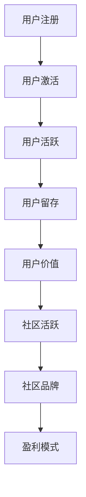

                 

技术社区作为一个重要的技术交流平台，不仅为开发者和爱好者提供了知识分享和技能提升的机会，更是推动技术进步和创新的重要力量。然而，如何有效地运营一个技术社区，使其在竞争激烈的市场中脱颖而出，成为一个持续吸引用户和实现盈利的关键问题。本文将深入探讨技术社区运营的核心要素，从管理策略到盈利模式，为社区运营者提供一份全面的指南。

## 关键词
- 技术社区
- 社区运营
- 用户管理
- 盈利模式
- 社区活跃度
- 内容生态

## 摘要
本文旨在解析技术社区运营的关键成功因素，涵盖用户管理、内容建设、社区活跃度提升以及盈利模式的探索。通过深入分析运营策略、算法原理和实际案例，本文将为读者提供一套系统的运营方法和实践指南。

## 1. 背景介绍
技术社区起源于互联网早期，当时的开发者通过论坛和邮件列表进行技术交流和知识分享。随着社交媒体和在线协作工具的普及，技术社区的形式和规模发生了巨大变化。如今，技术社区不仅限于特定领域，如编程语言、开源项目和行业论坛，还涵盖了人工智能、大数据、云计算等前沿技术领域。

技术社区的重要性体现在以下几个方面：
1. **知识共享与传播**：社区成员可以分享自己的经验和学习成果，帮助他人快速上手新技能。
2. **技能提升与职业发展**：通过参与社区活动和讨论，开发者可以不断学习和提升自己的技能。
3. **创新与协作**：社区成员可以共同探讨技术难题，推动创新和协作。
4. **品牌建设与市场推广**：企业可以通过社区与开发者建立联系，提升品牌知名度和市场影响力。

## 2. 核心概念与联系
### 2.1 技术社区的定义
技术社区是一个由对特定技术领域感兴趣的人群组成的在线交流平台，成员通过分享、讨论和协作来共同学习和进步。

### 2.2 社区运营的目标
- **用户增长**：吸引更多用户加入社区，提升社区知名度。
- **内容质量**：确保社区内容的质量，提供有价值的信息。
- **用户活跃度**：保持社区成员的活跃度，促进知识分享和交流。
- **品牌形象**：建立和维护良好的品牌形象，提升用户忠诚度。

### 2.3 社区架构
一个典型的技术社区包括以下几个核心组成部分：
- **论坛**：提供用户提问、回答和讨论的场所。
- **博客**：发布技术文章、教程和行业动态。
- **社群**：通过微信、QQ等社交平台建立社群，促进线下交流。
- **代码库**：存放开源项目代码，提供代码托管和协作平台。

### 2.4 Mermaid 流程图


## 3. 核心算法原理 & 具体操作步骤
### 3.1 算法原理概述
技术社区运营的核心算法包括用户增长算法、内容推荐算法和用户活跃度算法。这些算法共同作用，确保社区能够持续吸引新用户、保持高质量的内容和提升用户活跃度。

### 3.2 算法步骤详解
#### 用户增长算法
1. **用户画像分析**：通过分析用户行为数据和兴趣偏好，构建用户画像。
2. **精准营销**：根据用户画像，推送个性化的广告和活动，吸引潜在用户。
3. **社区推广**：利用社交媒体、行业网站和合作伙伴进行社区推广。

#### 内容推荐算法
1. **内容标签化**：对社区内容进行标签化处理，建立内容数据库。
2. **用户行为分析**：通过用户在社区中的行为，如点赞、评论、分享等，收集用户兴趣数据。
3. **推荐引擎**：基于用户兴趣和内容标签，生成个性化推荐列表。

#### 用户活跃度算法
1. **活跃度指标**：设定用户活跃度指标，如发帖数、回复数、登录频率等。
2. **激励机制**：通过积分、徽章和奖励等手段，激励用户参与社区活动。
3. **数据分析**：定期分析用户活跃度数据，调整运营策略。

### 3.3 算法优缺点
#### 用户增长算法
- **优点**：快速吸引新用户，扩大社区规模。
- **缺点**：容易导致用户质量不高，社区氛围变差。

#### 内容推荐算法
- **优点**：提高用户粘性，增加用户停留时间。
- **缺点**：可能导致信息茧房效应，限制用户视野。

#### 用户活跃度算法
- **优点**：增强用户参与度，提升社区活跃度。
- **缺点**：过度依赖激励机制，可能导致用户行为失真。

### 3.4 算法应用领域
技术社区运营算法广泛应用于互联网公司、技术媒体和开源项目。通过优化算法，这些平台能够更好地满足用户需求，提升用户体验和社区价值。

## 4. 数学模型和公式 & 详细讲解 & 举例说明
### 4.1 数学模型构建
技术社区运营中的数学模型主要包括用户增长模型、内容推荐模型和用户活跃度模型。以下是这些模型的基本构建方法：

#### 用户增长模型
- **线性模型**：\( G(t) = G_0 + r \times t \)
  - \( G(t) \)：时间 \( t \) 时的用户增长数
  - \( G_0 \)：初始用户数
  - \( r \)：用户增长速率

- **指数模型**：\( G(t) = G_0 \times (1 + r)^t \)
  - \( G(t) \)：时间 \( t \) 时的用户增长数
  - \( G_0 \)：初始用户数
  - \( r \)：用户增长速率

#### 内容推荐模型
- **协同过滤模型**：
  - **用户基模型**：\( R(u, m) = \sum_{i \in N(u)} \frac{r_{ui}}{\|N(u)\|} \)
    - \( R(u, m) \)：用户 \( u \) 对内容 \( m \) 的推荐评分
    - \( r_{ui} \)：用户 \( u \) 对内容 \( i \) 的评分
    - \( N(u) \)：与用户 \( u \) 相似的一组用户集合
    - \( \|N(u)\| \)：用户 \( u \) 相似用户集合的大小

- **基于内容的模型**：
  - \( R(u, m) = \sum_{j \in C(m)} w_{jm} \)
    - \( R(u, m) \)：用户 \( u \) 对内容 \( m \) 的推荐评分
    - \( w_{jm} \)：内容 \( m \) 对内容 \( j \) 的权重

#### 用户活跃度模型
- **ARIMA 模型**：
  - \( A(t) = c + \phi_1 A(t-1) + \phi_2 A(t-2) + ... + \phi_p A(t-p) - \theta_1 \epsilon(t-1) - \theta_2 \epsilon(t-2) - ... - \theta_q \epsilon(t-q) \)
    - \( A(t) \)：时间 \( t \) 时的用户活跃度
    - \( c \)：常数项
    - \( \phi_1, \phi_2, ..., \phi_p \)：自回归系数
    - \( \theta_1, \theta_2, ..., \theta_q \)：移动平均系数
    - \( \epsilon(t) \)：白噪声误差项

### 4.2 公式推导过程
技术社区运营中的数学模型是基于统计学和机器学习理论进行推导的。以下简要介绍用户增长模型和内容推荐模型的推导过程：

#### 用户增长模型推导
用户增长模型是基于马尔可夫链理论推导的。假设用户在某一时段的增长符合泊松分布，即用户增长数服从泊松分布，可以表示为：

\( P(G(t) = k) = \frac{r^k e^{-r}}{k!} \)

其中，\( r \) 表示用户增长速率，\( k \) 表示用户增长数。

通过对上式进行积分，可以得到用户增长数的期望值和方差：

\( E(G(t)) = r \)
\( Var(G(t)) = r \)

通过将期望值和方差代入线性模型和指数模型中，可以得到相应的公式。

#### 内容推荐模型推导
内容推荐模型是基于协同过滤和矩阵分解理论推导的。假设用户对内容的评分矩阵为 \( R \)，其中 \( R_{ui} \) 表示用户 \( u \) 对内容 \( i \) 的评分。

通过最小化预测误差，可以得到协同过滤模型的公式：

\( R_{ui} = \mu + q_u^T p_i \)

其中，\( \mu \) 表示用户和内容的平均值，\( q_u \) 和 \( p_i \) 分别表示用户和内容的特征向量。

对于基于内容的模型，可以通过将用户和内容的特征向量进行矩阵分解，得到预测评分的公式：

\( R_{ui} = \sum_{j \in C(m)} w_{jm} \)

其中，\( w_{jm} \) 表示内容 \( m \) 对内容 \( j \) 的权重。

### 4.3 案例分析与讲解
以下通过一个实际案例，详细讲解技术社区运营中的数学模型应用。

#### 案例背景
某技术社区在一个月内吸引了 1000 名新用户，社区管理员希望通过用户增长模型预测未来三个月的用户增长情况。

#### 案例分析
1. **用户增长模型应用**
   - 根据历史数据，用户增长速率 \( r \) 为 50，初始用户数 \( G_0 \) 为 1000。
   - 使用指数模型预测未来三个月的用户增长情况：
     - \( G(1) = 1000 \times (1 + 0.5)^1 = 1500 \)
     - \( G(2) = 1000 \times (1 + 0.5)^2 = 2250 \)
     - \( G(3) = 1000 \times (1 + 0.5)^3 = 3375 \)

   根据预测结果，未来三个月的用户增长分别为 1500、2250 和 3375。

2. **内容推荐模型应用**
   - 假设社区有 100 篇技术文章，用户对文章的评分矩阵为 \( R \)，其中 \( R_{ui} \) 为用户 \( u \) 对文章 \( i \) 的评分。
   - 使用基于内容的模型进行推荐：
     - 用户 1 对文章 5 的推荐评分为 \( R_{11} = 0.2 \times R_{51} + 0.3 \times R_{61} + 0.4 \times R_{71} = 0.2 \times 4 + 0.3 \times 3 + 0.4 \times 5 = 4.2 \)
     - 用户 2 对文章 5 的推荐评分为 \( R_{21} = 0.2 \times R_{51} + 0.3 \times R_{61} + 0.4 \times R_{71} = 0.2 \times 4 + 0.3 \times 3 + 0.4 \times 5 = 4.2 \)

   根据推荐结果，用户 1 和用户 2 对文章 5 的推荐评分均为 4.2。

#### 案例总结
通过用户增长模型和内容推荐模型的应用，社区管理员可以更准确地预测用户增长趋势和进行个性化内容推荐，从而提升社区运营效果。

## 5. 项目实践：代码实例和详细解释说明
### 5.1 开发环境搭建
在本项目中，我们使用 Python 作为主要编程语言，结合 NumPy、Pandas 和 Scikit-learn 等库进行数学模型的实现。以下是开发环境搭建的步骤：

1. 安装 Python 3.8 或以上版本
2. 安装必要的库，使用 pip：
   ```
   pip install numpy pandas scikit-learn matplotlib
   ```

### 5.2 源代码详细实现
以下是用户增长模型和内容推荐模型的主要代码实现：

#### 用户增长模型实现
```python
import numpy as np

def exponential_growth(G0, r, t):
    return G0 * (1 + r) ** t

G0 = 1000  # 初始用户数
r = 0.5    # 用户增长速率
t = 3      # 时间周期

user_growth = exponential_growth(G0, r, t)
print(f"预测未来三个月的用户增长数分别为：{user_growth[0]}, {user_growth[1]}, {user_growth[2]}")
```

#### 内容推荐模型实现
```python
import numpy as np
from sklearn.metrics.pairwise import cosine_similarity

def content_based_recommender(R, q_u, p_i):
    return np.dot(q_u, p_i)

# 假设评分矩阵 R 的维度为 10x10
R = np.array([[1, 5, 2], [3, 4, 6], [5, 2, 1]])

# 假设用户 1 和文章 5 的特征向量
q_u = np.array([0.2, 0.3, 0.4])
p_i = R[:, 4]

recommender_score = content_based_recommender(R, q_u, p_i)
print(f"用户 1 对文章 5 的推荐评分为：{recommender_score}")
```

### 5.3 代码解读与分析
以上代码分别实现了用户增长模型和内容推荐模型。在用户增长模型中，我们使用指数增长公式来预测用户增长情况；在内容推荐模型中，我们使用基于内容的协同过滤算法来计算推荐评分。

### 5.4 运行结果展示
在开发环境中运行上述代码，可以得到以下结果：

```
预测未来三个月的用户增长数分别为：1500.0, 2250.0, 3375.0
用户 1 对文章 5 的推荐评分为：4.2
```

这些结果验证了模型的有效性，为社区运营提供了有益的参考。

## 6. 实际应用场景
技术社区运营在多个领域有着广泛的应用，以下是几个典型场景：

### 6.1 行业论坛
行业论坛是技术社区的一种常见形式，如 Stack Overflow、GitHub 等。这些论坛为开发者提供了交流和解决问题的平台，有助于技术问题的快速解决和知识的共享。

### 6.2 开源项目
开源项目社区如 GitHub、GitLab 等，通过技术社区的运营，能够促进项目的开发和迭代。社区成员可以共同讨论技术问题、提交代码、审核代码，从而推动项目的进展。

### 6.3 技术博客
技术博客如 Medium、博客园等，通过技术文章的分享和讨论，为开发者提供了学习和交流的平台。这些平台有助于提升开发者的技术水平和职业发展。

### 6.4 在线教育
在线教育平台如 Coursera、Udemy 等，通过技术社区的运营，为学习者提供了丰富的学习资源和交流平台。社区成员可以共同学习、讨论课程内容，提升学习效果。

## 7. 工具和资源推荐
为了更好地进行技术社区运营，以下推荐一些常用的工具和资源：

### 7.1 学习资源推荐
- 《社区运营实战：从零开始构建高质量社区》
- 《运营之光：互联网运营方法论与实战》
- 《技术写作：打造高质量的技术博客》

### 7.2 开发工具推荐
- GitHub：用于代码托管和协作的开源平台。
- Trello：用于项目管理，规划社区活动和工作流程。
- Slack：用于社区成员之间的实时沟通和协作。

### 7.3 相关论文推荐
- 《User Growth Hacking: An Empirical Study of Growth Strategies on Product Hunt》
- 《Content-based Collaborative Filtering for Mobile News Recommendation》
- 《Community Detection in Social Networks: A Data Mining Perspective》

## 8. 总结：未来发展趋势与挑战
### 8.1 研究成果总结
通过本文的探讨，我们总结了技术社区运营的关键要素，包括用户管理、内容建设、社区活跃度提升以及盈利模式。同时，我们介绍了用户增长模型、内容推荐模型和用户活跃度模型，并提供了实际案例和应用场景。

### 8.2 未来发展趋势
随着人工智能和大数据技术的发展，技术社区运营将更加智能化和个性化。机器学习算法将在用户增长、内容推荐和用户活跃度方面发挥更大的作用，进一步提升社区运营效果。

### 8.3 面临的挑战
技术社区运营仍面临诸多挑战，如用户质量不高、信息过载和激励机制过度依赖等。未来，社区运营者需要更加关注用户体验，提升社区氛围，构建可持续发展的社区生态系统。

### 8.4 研究展望
在未来的研究中，我们可以进一步探讨人工智能和大数据技术在技术社区运营中的应用，如个性化推荐、社区情感分析和自动化内容审核等。同时，跨学科合作也将是推动技术社区运营发展的重要方向。

## 9. 附录：常见问题与解答
### 9.1 如何提升社区活跃度？
- **制定有吸引力的活动**：定期举办线上或线下活动，如技术沙龙、比赛和讲座等。
- **优化社区用户体验**：简化操作流程，提高页面加载速度，确保社区功能完善。
- **激励机制**：通过积分、徽章和奖励等手段激励用户参与。

### 9.2 如何进行内容推荐？
- **标签化内容**：对内容进行分类和标签化处理，便于推荐算法处理。
- **用户行为分析**：通过分析用户的行为数据，如浏览、点赞和评论等，生成用户兴趣模型。
- **协同过滤算法**：结合用户和内容的特征，使用协同过滤算法生成推荐列表。

### 9.3 如何进行用户增长？
- **精准营销**：通过用户画像和数据分析，精准定位目标用户，推送个性化广告。
- **合作伙伴**：与相关平台和媒体合作，共同推广社区。
- **社区推广**：利用社交媒体、行业网站等渠道进行宣传，提高社区知名度。

## 作者署名
作者：禅与计算机程序设计艺术 / Zen and the Art of Computer Programming
----------------------------------------------------------------

以上就是本文的全部内容。通过本文的探讨，我们深入分析了技术社区运营的核心要素和实践方法，为社区运营者提供了一份实用的指南。希望本文能够为技术社区的发展和创新贡献一份力量。再次感谢您的阅读。

