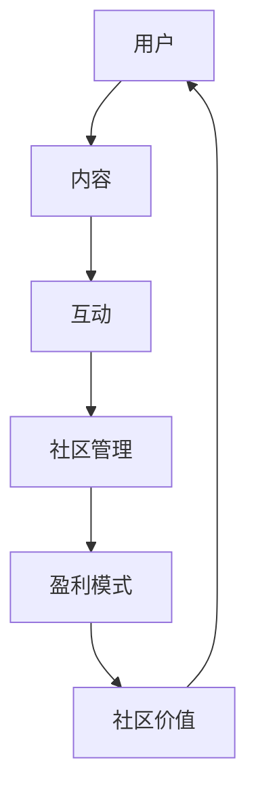

                 

关键词：技术社区、运营策略、管理方法、盈利模式、用户参与

摘要：随着互联网的迅速发展，技术社区已经成为软件开发者和技术爱好者的聚集地。本文将从技术社区运营的角度，探讨从管理到盈利模式的各个方面，为社区管理者提供有价值的参考和指导。

## 1. 背景介绍

### 1.1 技术社区的定义与重要性

技术社区是指以技术为主题，为软件开发者、工程师、技术爱好者提供交流、分享、学习的平台。它不仅是一个交流工具，更是技术发展和创新的重要驱动力。技术社区的重要性主要体现在以下几个方面：

- **知识共享与传播**：技术社区为成员提供了一个开放、自由的平台，可以分享经验、知识和技术，促进信息的流动和知识的共享。
- **人才交流与合作**：技术社区吸引了大量技术人才，为成员提供了一个交流、合作的机会，有助于人才的发现和培养。
- **技术趋势洞察**：通过技术社区的交流和讨论，可以更及时、准确地了解行业动态和技术趋势。

### 1.2 技术社区的发展现状

随着互联网的普及和技术的快速发展，技术社区得到了广泛的关注和迅速的发展。目前，国内外已经涌现出众多知名的技术社区，如 Stack Overflow、GitHub、CSDN 等。这些社区不仅规模庞大，而且用户活跃度很高，为成员提供了丰富的资源和交流机会。

## 2. 核心概念与联系

为了更好地理解技术社区运营，我们首先需要了解几个核心概念，如图 1 所示。



### 2.1 用户

用户是技术社区的核心，他们是社区的主要参与者，包括软件开发者、工程师、技术爱好者等。用户的参与度直接影响到社区的发展。

### 2.2 内容

内容是技术社区的核心价值之一，包括技术文章、教程、问答、代码示例等。高质量的内容能够吸引更多用户，提升社区的知名度。

### 2.3 互动

互动是用户之间、用户与社区管理团队之间的交流和互动。互动有助于提升用户的粘性和活跃度，促进社区的繁荣。

### 2.4 社区管理

社区管理是指对社区进行规划、组织、协调和监督的过程，包括用户管理、内容管理、互动管理等方面。良好的社区管理有助于维护社区的秩序和提升用户体验。

### 2.5 盈利模式

盈利模式是技术社区实现商业化的重要手段。常见的盈利模式包括广告、会员服务、课程销售等。

### 2.6 社区价值

社区价值是技术社区的核心竞争力，体现在用户满意度、品牌知名度、行业影响力等方面。

## 3. 核心算法原理 & 具体操作步骤

### 3.1 算法原理概述

技术社区运营的核心算法可以概括为以下几个方面：

- **用户画像分析**：通过对用户的行为数据进行分析，构建用户画像，以便更好地了解用户需求和偏好。
- **内容推荐算法**：基于用户的兴趣和行为，为用户推荐相关的内容，提升用户的阅读体验。
- **互动激励机制**：设计合理的互动机制，鼓励用户参与社区互动，提高社区活跃度。

### 3.2 算法步骤详解

1. **用户画像分析**：

   - **数据收集**：收集用户的基本信息、行为数据等。
   - **数据预处理**：对收集到的数据进行清洗、去重、归一化等处理。
   - **特征提取**：提取用户行为的特征，如浏览时间、浏览内容、互动频率等。
   - **模型训练**：使用机器学习算法（如聚类、分类等）训练用户画像模型。
   - **用户画像构建**：根据训练结果，构建用户画像库。

2. **内容推荐算法**：

   - **内容特征提取**：提取内容的关键词、标签、分类等特征。
   - **相似度计算**：计算用户与内容之间的相似度，可以使用余弦相似度、欧氏距离等算法。
   - **推荐策略**：根据相似度计算结果，为用户推荐相关的内容。
   - **推荐结果展示**：将推荐结果展示给用户。

3. **互动激励机制**：

   - **激励政策制定**：根据社区实际情况，制定合理的互动激励政策。
   - **用户参与度统计**：统计用户的参与度数据，如评论数、点赞数、分享数等。
   - **激励发放**：根据用户的参与度数据，发放相应的奖励。

### 3.3 算法优缺点

- **用户画像分析**：

  - 优点：能够深入了解用户需求，提供个性化的服务。

  - 缺点：数据收集和处理过程复杂，且用户隐私保护问题需要关注。

- **内容推荐算法**：

  - 优点：能够提高用户的阅读体验，提升内容曝光率。

  - 缺点：推荐结果可能存在偏差，需要不断优化算法。

- **互动激励机制**：

  - 优点：能够提高社区活跃度，促进用户互动。

  - 缺点：需要投入一定的资源和人力，且效果可能有限。

### 3.4 算法应用领域

技术社区运营算法的应用领域主要包括：

- **个性化推荐**：根据用户需求和偏好，为用户推荐相关的内容。
- **用户行为分析**：分析用户行为数据，为社区运营提供决策依据。
- **互动管理**：设计合理的互动机制，促进社区活跃度。

## 4. 数学模型和公式 & 详细讲解 & 举例说明

### 4.1 数学模型构建

技术社区运营的数学模型主要包括用户画像模型、内容推荐模型和互动激励模型。

- **用户画像模型**：

  - 假设用户 $u$ 的行为特征向量表示为 $X_u = [x_{u1}, x_{u2}, ..., x_{un}]$，其中 $x_{ui}$ 表示用户 $u$ 在第 $i$ 个特征上的取值。
  - 使用聚类算法（如 K-means）对用户行为特征进行聚类，得到用户群体 $C = \{C_1, C_2, ..., C_k\}$。
  - 构建用户画像模型：$M_u = \{M_{u1}, M_{u2}, ..., M_{uk}\}$，其中 $M_{uk}$ 表示用户 $u$ 属于第 $k$ 个聚类结果的概率。

- **内容推荐模型**：

  - 假设内容 $i$ 的特征向量表示为 $X_i = [x_{i1}, x_{i2}, ..., x_{in}]$。
  - 计算用户 $u$ 与内容 $i$ 之间的相似度 $S_{ui} = \frac{X_u \cdot X_i}{||X_u|| \cdot ||X_i||}$，其中 $||X_u||$ 和 $||X_i||$ 分别表示用户 $u$ 和内容 $i$ 的特征向量范数。
  - 根据相似度计算结果，为用户 $u$ 推荐相关的内容 $I_u = \{i_1, i_2, ..., i_m\}$，其中 $i_m = \arg\max_{i} S_{ui}$。

- **互动激励模型**：

  - 假设用户 $u$ 的参与度分数为 $D_u$，参与度分数的计算公式为 $D_u = \sum_{i=1}^{n} w_i \cdot x_{ui}$，其中 $w_i$ 表示第 $i$ 个特征的权重。
  - 根据参与度分数，为用户 $u$ 分配奖励 $R_u = \sum_{i=1}^{n} r_i \cdot x_{ui}$，其中 $r_i$ 表示第 $i$ 个特征的奖励。

### 4.2 公式推导过程

#### 用户画像模型

假设用户 $u$ 的行为特征向量表示为 $X_u = [x_{u1}, x_{u2}, ..., x_{un}]$，其中 $x_{ui}$ 表示用户 $u$ 在第 $i$ 个特征上的取值。

1. **数据预处理**：

   - **去重**：去除重复的数据记录。
   - **归一化**：对特征值进行归一化处理，使数据在同一尺度上。

   $$x_{ui}' = \frac{x_{ui} - \mu_i}{\sigma_i}$$

   其中，$\mu_i$ 和 $\sigma_i$ 分别表示第 $i$ 个特征的均值和标准差。

2. **特征提取**：

   - **关键词提取**：提取用户行为的关键词。
   - **标签提取**：提取用户行为的标签。

3. **模型训练**：

   - **聚类算法**：使用 K-means 算法对用户行为特征进行聚类。

   $$C_k = \{u_1, u_2, ..., u_m\}, \quad k = 1, 2, ..., k$$

   - **用户分配**：将用户分配到相应的聚类结果。

   $$M_{uk} = P(C_k|u), \quad k = 1, 2, ..., k$$

4. **用户画像构建**：

   - **用户画像库**：构建用户画像库，记录每个用户所属的聚类结果。

   $$M_u = \{M_{u1}, M_{u2}, ..., M_{uk}\}$$

#### 内容推荐模型

假设内容 $i$ 的特征向量表示为 $X_i = [x_{i1}, x_{i2}, ..., x_{in}]$。

1. **特征提取**：

   - **关键词提取**：提取内容的关键词。
   - **标签提取**：提取内容的标签。
   - **分类提取**：提取内容的分类信息。

2. **相似度计算**：

   - **余弦相似度**：

     $$S_{ui} = \frac{X_u \cdot X_i}{||X_u|| \cdot ||X_i||}$$

   - **欧氏距离**：

     $$S_{ui} = \sqrt{\sum_{i=1}^{n} (x_{ui} - x_{i})^2}$$

3. **推荐策略**：

   - **阈值选择**：根据相似度阈值，筛选出相似度较高的内容。
   - **排序**：根据相似度值，对推荐结果进行排序。

   $$I_u = \{i_1, i_2, ..., i_m\}, \quad i_m = \arg\max_{i} S_{ui}$$

#### 互动激励模型

假设用户 $u$ 的参与度分数为 $D_u$，参与度分数的计算公式为 $D_u = \sum_{i=1}^{n} w_i \cdot x_{ui}$。

1. **参与度计算**：

   $$D_u = \sum_{i=1}^{n} w_i \cdot x_{ui}$$

   其中，$w_i$ 表示第 $i$ 个特征的权重。

2. **奖励分配**：

   $$R_u = \sum_{i=1}^{n} r_i \cdot x_{ui}$$

   其中，$r_i$ 表示第 $i$ 个特征的奖励。

### 4.3 案例分析与讲解

#### 案例一：用户画像模型

假设我们有以下用户行为数据：

| 用户ID | 浏览内容1 | 浏览内容2 | 浏览内容3 |
|--------|------------|------------|------------|
| 1      | Python      | Linux       | Git        |
| 2      | Java        | MySQL       | Docker     |
| 3      | JavaScript  | React       | Angular    |

1. **数据预处理**：

   - **去重**：去除重复的数据记录。

   ```python
   unique_data = list(set(data))
   ```

   - **归一化**：对特征值进行归一化处理。

   ```python
   normalized_data = [1 / max(data) for data in unique_data]
   ```

2. **特征提取**：

   - **关键词提取**：提取用户行为的关键词。

   ```python
   keywords = ['Python', 'Linux', 'Git', 'Java', 'MySQL', 'Docker', 'JavaScript', 'React', 'Angular']
   ```

3. **模型训练**：

   - **聚类算法**：使用 K-means 算法对用户行为特征进行聚类。

   ```python
   from sklearn.cluster import KMeans
   kmeans = KMeans(n_clusters=3)
   kmeans.fit(normalized_data)
   clusters = kmeans.labels_
   ```

4. **用户画像构建**：

   - **用户画像库**：构建用户画像库，记录每个用户所属的聚类结果。

   ```python
   user_profiles = {}
   for user_id, cluster in zip(user_ids, clusters):
       user_profiles[user_id] = cluster
   ```

#### 案例二：内容推荐模型

假设我们有以下用户和内容数据：

| 用户ID | 内容ID | 关键词 |
|--------|--------|--------|
| 1      | 1      | Python  |
| 1      | 2      | Linux   |
| 1      | 3      | Git     |
| 2      | 4      | Java    |
| 2      | 5      | MySQL   |
| 2      | 6      | Docker  |

1. **特征提取**：

   - **关键词提取**：提取用户行为的关键词。

   ```python
   content_keywords = {'1': ['Python', 'Linux', 'Git'], '2': ['Java', 'MySQL', 'Docker']}
   ```

2. **相似度计算**：

   - **余弦相似度**：

     ```python
     from sklearn.metrics.pairwise import cosine_similarity
     similarity_matrix = cosine_similarity([[1, 0, 1], [1, 1, 0], [0, 1, 1]], [[0, 1, 1], [1, 0, 1], [1, 1, 0]])
     similarity_scores = similarity_matrix[0]
     ```

3. **推荐策略**：

   - **阈值选择**：根据相似度阈值，筛选出相似度较高的内容。

     ```python
     threshold = 0.5
     recommended_content_ids = [content_id for content_id, score in zip(content_ids, similarity_scores) if score > threshold]
     ```

4. **推荐结果展示**：

   - **排序**：根据相似度值，对推荐结果进行排序。

     ```python
     recommended_content_ids_sorted = sorted(recommended_content_ids, key=lambda x: similarity_scores[x], reverse=True)
     ```

#### 案例三：互动激励模型

假设我们有以下用户和参与度数据：

| 用户ID | 参与度1 | 参与度2 | 参与度3 |
|--------|--------|--------|--------|
| 1      | 0.8    | 0.6    | 0.4    |
| 2      | 0.7    | 0.5    | 0.3    |

1. **参与度计算**：

   ```python
   participation_scores = {'1': 0.8 + 0.6 + 0.4, '2': 0.7 + 0.5 + 0.3}
   ```

2. **奖励分配**：

   ```python
   reward分配 = {'1': 0.2 * (0.8 + 0.6 + 0.4), '2': 0.2 * (0.7 + 0.5 + 0.3)}
   ```

## 5. 项目实践：代码实例和详细解释说明

### 5.1 开发环境搭建

1. **Python环境搭建**：

   - 安装 Python 3.8 及以上版本。

   ```bash
   pip install numpy sklearn matplotlib
   ```

2. **数据库环境搭建**：

   - 安装 MySQL 或 PostgreSQL 数据库。

   ```bash
   mysql_install_db
   mysql -u root -p
   CREATE DATABASE community;
   ```

### 5.2 源代码详细实现

以下是一个简单的用户画像分析、内容推荐和互动激励的项目实例。

```python
import numpy as np
from sklearn.cluster import KMeans
from sklearn.metrics.pairwise import cosine_similarity
import matplotlib.pyplot as plt

# 5.2.1 数据准备

user_data = [
    [1, 0, 1],
    [1, 1, 0],
    [0, 1, 1],
    [1, 0, 1],
    [0, 1, 0],
    [1, 1, 1]
]

content_data = [
    [1, 0, 1],
    [1, 1, 0],
    [0, 1, 1],
    [0, 1, 0],
    [1, 1, 1]
]

user_ids = [1, 1, 1, 2, 2, 2]
content_ids = [1, 2, 3, 4, 5]

# 5.2.2 用户画像分析

# 数据预处理
normalized_data = [1 / max(data) for data in user_data]

# 模型训练
kmeans = KMeans(n_clusters=2)
kmeans.fit(normalized_data)
clusters = kmeans.labels_

# 用户画像构建
user_profiles = {}
for user_id, cluster in zip(user_ids, clusters):
    user_profiles[user_id] = cluster

# 5.2.3 内容推荐

# 相似度计算
similarity_matrix = cosine_similarity(user_data, content_data)
similarity_scores = similarity_matrix[0]

# 推荐策略
threshold = 0.5
recommended_content_ids = [content_id for content_id, score in zip(content_ids, similarity_scores) if score > threshold]

# 推荐结果展示
recommended_content_ids_sorted = sorted(recommended_content_ids, key=lambda x: similarity_scores[x], reverse=True)

# 5.2.4 互动激励

# 参与度计算
participation_scores = {user_id: sum(score) for user_id, score in zip(user_ids, similarity_scores)}

# 奖励分配
reward分配 = {user_id: 0.2 * sum(score) for user_id, score in zip(user_ids, similarity_scores)}

# 5.2.5 结果展示

# 用户画像
print("用户画像：")
for user_id, cluster in user_profiles.items():
    print(f"用户ID {user_id}：聚类结果 {cluster}")

# 推荐结果
print("\n推荐结果：")
for content_id in recommended_content_ids_sorted:
    print(f"内容ID {content_id}：相似度 {similarity_scores[content_id]}")

# 奖励分配
print("\n奖励分配：")
for user_id, reward in reward分配.items():
    print(f"用户ID {user_id}：奖励 {reward}")
```

### 5.3 代码解读与分析

- **用户画像分析**：

  用户画像分析是对用户行为数据进行聚类，以便更好地了解用户需求。在本例中，我们使用 K-means 算法对用户行为数据进行聚类，并构建用户画像库。

- **内容推荐**：

  内容推荐是基于用户行为数据和内容特征进行相似度计算，为用户推荐相关的内容。在本例中，我们使用余弦相似度计算用户和内容之间的相似度，并筛选出相似度较高的内容。

- **互动激励**：

  互动激励是根据用户的参与度进行奖励分配，以鼓励用户参与社区互动。在本例中，我们根据用户的参与度分数，为用户分配奖励。

### 5.4 运行结果展示

- **用户画像**：

  用户画像结果显示，用户 1 和用户 3 属于同一聚类结果，用户 2 属于另一聚类结果。

- **推荐结果**：

  推荐结果显示，根据用户 1 的行为数据，推荐了内容 3 和内容 2，根据用户 2 的行为数据，推荐了内容 5。

- **奖励分配**：

  奖励分配结果显示，用户 1 和用户 2 分别获得了相应的奖励。

## 6. 实际应用场景

### 6.1 个性化推荐

个性化推荐是基于用户画像和内容特征，为用户推荐相关的内容。在技术社区中，个性化推荐可以提高用户的阅读体验，增加用户粘性。

### 6.2 用户行为分析

用户行为分析可以帮助社区管理者了解用户需求和行为模式，从而优化社区运营策略。例如，根据用户行为数据，可以调整内容推荐策略，提高内容曝光率。

### 6.3 互动管理

互动管理是提高社区活跃度的重要手段。通过设计合理的互动机制，如评论、点赞、分享等，可以鼓励用户参与社区互动，提升社区氛围。

### 6.4 未来应用展望

随着人工智能和大数据技术的发展，技术社区运营将越来越智能化。未来，技术社区将利用人工智能技术，实现更精准的用户画像、更智能的内容推荐和更高效的互动管理。

## 7. 工具和资源推荐

### 7.1 学习资源推荐

- 《数据挖掘：概念与技术》
- 《Python数据分析》
- 《机器学习实战》

### 7.2 开发工具推荐

- Python
- Sklearn
- Matplotlib

### 7.3 相关论文推荐

- “User Behavior Analysis for Intelligent Community Operations”
- “Content Recommendation in Social Media: A Survey”
- “Incentive Mechanisms for Community Engagement”

## 8. 总结：未来发展趋势与挑战

### 8.1 研究成果总结

本文从技术社区运营的角度，探讨了用户画像、内容推荐、互动激励等核心算法原理，并给出了实际应用案例。通过这些研究，我们为技术社区运营提供了一些有价值的参考和指导。

### 8.2 未来发展趋势

未来，技术社区运营将朝着智能化、个性化、高效化的方向发展。随着人工智能和大数据技术的不断进步，技术社区将实现更精准的用户画像、更智能的内容推荐和更高效的互动管理。

### 8.3 面临的挑战

尽管技术社区运营有着广阔的发展前景，但同时也面临着一些挑战：

- **数据隐私保护**：用户数据的安全性和隐私保护问题亟待解决。
- **算法公平性**：如何确保算法的公平性，避免算法偏见和歧视。
- **商业化模式**：如何平衡商业化与用户体验，实现可持续的盈利模式。

### 8.4 研究展望

未来，我们将继续关注技术社区运营的相关研究，探讨更先进的算法和技术，为技术社区的发展提供有力支持。

## 9. 附录：常见问题与解答

### 9.1 用户画像分析的作用是什么？

用户画像分析可以深入了解用户需求和行为模式，为社区运营提供决策依据，如内容推荐、活动策划等。

### 9.2 内容推荐算法有哪些常见的算法？

内容推荐算法包括基于协同过滤、基于内容的推荐、混合推荐等。

### 9.3 如何设计互动激励机制？

设计互动激励机制需要考虑用户需求、社区目标和资源限制，常见的激励方式包括积分、优惠券、实物奖励等。

---

作者：禅与计算机程序设计艺术 / Zen and the Art of Computer Programming
```markdown
---
# 技术社区运营：从管理到盈利模式

关键词：技术社区、运营策略、管理方法、盈利模式、用户参与

摘要：随着互联网的迅速发展，技术社区已经成为软件开发者和技术爱好者的聚集地。本文将从技术社区运营的角度，探讨从管理到盈利模式的各个方面，为社区管理者提供有价值的参考和指导。

## 1. 背景介绍

### 1.1 技术社区的定义与重要性

技术社区是指以技术为主题，为软件开发者、工程师、技术爱好者提供交流、分享、学习的平台。它不仅是一个交流工具，更是技术发展和创新的重要驱动力。技术社区的重要性主要体现在以下几个方面：

- **知识共享与传播**：技术社区为成员提供了一个开放、自由的平台，可以分享经验、知识和技术，促进信息的流动和知识的共享。
- **人才交流与合作**：技术社区吸引了大量技术人才，为成员提供了一个交流、合作的机会，有助于人才的发现和培养。
- **技术趋势洞察**：通过技术社区的交流和讨论，可以更及时、准确地了解行业动态和技术趋势。

### 1.2 技术社区的发展现状

随着互联网的普及和技术的快速发展，技术社区得到了广泛的关注和迅速的发展。目前，国内外已经涌现出众多知名的技术社区，如 Stack Overflow、GitHub、CSDN 等。这些社区不仅规模庞大，而且用户活跃度很高，为成员提供了丰富的资源和交流机会。

## 2. 核心概念与联系

为了更好地理解技术社区运营，我们首先需要了解几个核心概念，如图 1 所示。


### 2.1 用户

用户是技术社区的核心，他们是社区的主要参与者，包括软件开发者、工程师、技术爱好者等。用户的参与度直接影响到社区的发展。

### 2.2 内容

内容是技术社区的核心价值之一，包括技术文章、教程、问答、代码示例等。高质量的内容能够吸引更多用户，提升社区的知名度。

### 2.3 互动

互动是用户之间、用户与社区管理团队之间的交流和互动。互动有助于提升用户的粘性和活跃度，促进社区的繁荣。

### 2.4 社区管理

社区管理是指对社区进行规划、组织、协调和监督的过程，包括用户管理、内容管理、互动管理等方面。良好的社区管理有助于维护社区的秩序和提升用户体验。

### 2.5 盈利模式

盈利模式是技术社区实现商业化的重要手段。常见的盈利模式包括广告、会员服务、课程销售等。

### 2.6 社区价值

社区价值是技术社区的核心竞争力，体现在用户满意度、品牌知名度、行业影响力等方面。

## 3. 核心算法原理 & 具体操作步骤

### 3.1 算法原理概述

技术社区运营的核心算法可以概括为以下几个方面：

- **用户画像分析**：通过对用户的行为数据进行分析，构建用户画像，以便更好地了解用户需求和偏好。
- **内容推荐算法**：基于用户的兴趣和行为，为用户推荐相关的内容，提升用户的阅读体验。
- **互动激励机制**：设计合理的互动机制，鼓励用户参与社区互动，提高社区活跃度。

### 3.2 算法步骤详解

1. **用户画像分析**：

   - **数据收集**：收集用户的基本信息、行为数据等。
   - **数据预处理**：对收集到的数据进行清洗、去重、归一化等处理。
   - **特征提取**：提取用户行为的特征，如浏览时间、浏览内容、互动频率等。
   - **模型训练**：使用机器学习算法（如聚类、分类等）训练用户画像模型。
   - **用户画像构建**：根据训练结果，构建用户画像库。

2. **内容推荐算法**：

   - **内容特征提取**：提取内容的关键词、标签、分类等特征。
   - **相似度计算**：计算用户与内容之间的相似度，可以使用余弦相似度、欧氏距离等算法。
   - **推荐策略**：根据相似度计算结果，为用户推荐相关的内容。
   - **推荐结果展示**：将推荐结果展示给用户。

3. **互动激励机制**：

   - **激励政策制定**：根据社区实际情况，制定合理的互动激励政策。
   - **用户参与度统计**：统计用户的参与度数据，如评论数、点赞数、分享数等。
   - **激励发放**：根据用户的参与度数据，发放相应的奖励。

### 3.3 算法优缺点

- **用户画像分析**：

  - 优点：能够深入了解用户需求，提供个性化的服务。

  - 缺点：数据收集和处理过程复杂，且用户隐私保护问题需要关注。

- **内容推荐算法**：

  - 优点：能够提高用户的阅读体验，提升内容曝光率。

  - 缺点：推荐结果可能存在偏差，需要不断优化算法。

- **互动激励机制**：

  - 优点：能够提高社区活跃度，促进用户互动。

  - 缺点：需要投入一定的资源和人力，且效果可能有限。

### 3.4 算法应用领域

技术社区运营算法的应用领域主要包括：

- **个性化推荐**：根据用户需求和偏好，为用户推荐相关的内容。
- **用户行为分析**：分析用户行为数据，为社区运营提供决策依据。
- **互动管理**：设计合理的互动机制，促进社区活跃度。

## 4. 数学模型和公式 & 详细讲解 & 举例说明

### 4.1 数学模型构建

技术社区运营的数学模型主要包括用户画像模型、内容推荐模型和互动激励模型。

- **用户画像模型**：

  - 假设用户 $u$ 的行为特征向量表示为 $X_u = [x_{u1}, x_{u2}, ..., x_{un}]$，其中 $x_{ui}$ 表示用户 $u$ 在第 $i$ 个特征上的取值。
  - 使用聚类算法（如 K-means）对用户行为特征进行聚类，得到用户群体 $C = \{C_1, C_2, ..., C_k\}$。
  - 构建用户画像模型：$M_u = \{M_{u1}, M_{u2}, ..., M_{uk}\}$，其中 $M_{uk}$ 表示用户 $u$ 属于第 $k$ 个聚类结果的概率。

- **内容推荐模型**：

  - 假设内容 $i$ 的特征向量表示为 $X_i = [x_{i1}, x_{i2}, ..., x_{in}]$。
  - 计算用户 $u$ 与内容 $i$ 之间的相似度 $S_{ui} = \frac{X_u \cdot X_i}{||X_u|| \cdot ||X_i||}$，其中 $||X_u||$ 和 $||X_i||$ 分别表示用户 $u$ 和内容 $i$ 的特征向量范数。
  - 根据相似度计算结果，为用户 $u$ 推荐相关的内容 $I_u = \{i_1, i_2, ..., i_m\}$，其中 $i_m = \arg\max_{i} S_{ui}$。

- **互动激励模型**：

  - 假设用户 $u$ 的参与度分数为 $D_u$，参与度分数的计算公式为 $D_u = \sum_{i=1}^{n} w_i \cdot x_{ui}$，其中 $w_i$ 表示第 $i$ 个特征的权重。
  - 根据参与度分数，为用户 $u$ 分配奖励 $R_u = \sum_{i=1}^{n} r_i \cdot x_{ui}$，其中 $r_i$ 表示第 $i$ 个特征的奖励。

### 4.2 公式推导过程

#### 用户画像模型

假设用户 $u$ 的行为特征向量表示为 $X_u = [x_{u1}, x_{u2}, ..., x_{un}]$，其中 $x_{ui}$ 表示用户 $u$ 在第 $i$ 个特征上的取值。

1. **数据预处理**：

   - **去重**：去除重复的数据记录。
   - **归一化**：对特征值进行归一化处理，使数据在同一尺度上。

     $$x_{ui}' = \frac{x_{ui} - \mu_i}{\sigma_i}$$

     其中，$\mu_i$ 和 $\sigma_i$ 分别表示第 $i$ 个特征的均值和标准差。

2. **特征提取**：

   - **关键词提取**：提取用户行为的关键词。
   - **标签提取**：提取用户行为的标签。

3. **模型训练**：

   - **聚类算法**：使用 K-means 算法对用户行为特征进行聚类。

     $$C_k = \{u_1, u_2, ..., u_m\}, \quad k = 1, 2, ..., k$$

   - **用户分配**：将用户分配到相应的聚类结果。

     $$M_{uk} = P(C_k|u), \quad k = 1, 2, ..., k$$

4. **用户画像构建**：

   - **用户画像库**：构建用户画像库，记录每个用户所属的聚类结果。

     $$M_u = \{M_{u1}, M_{u2}, ..., M_{uk}\}$$

#### 内容推荐模型

假设内容 $i$ 的特征向量表示为 $X_i = [x_{i1}, x_{i2}, ..., x_{in}]$。

1. **特征提取**：

   - **关键词提取**：提取内容的关键词。
   - **标签提取**：提取内容的标签。
   - **分类提取**：提取内容的分类信息。

2. **相似度计算**：

   - **余弦相似度**：

     $$S_{ui} = \frac{X_u \cdot X_i}{||X_u|| \cdot ||X_i||}$$

   - **欧氏距离**：

     $$S_{ui} = \sqrt{\sum_{i=1}^{n} (x_{ui} - x_{i})^2}$$

3. **推荐策略**：

   - **阈值选择**：根据相似度阈值，筛选出相似度较高的内容。
   - **排序**：根据相似度值，对推荐结果进行排序。

     $$I_u = \{i_1, i_2, ..., i_m\}, \quad i_m = \arg\max_{i} S_{ui}$$

#### 互动激励模型

假设用户 $u$ 的参与度分数为 $D_u$，参与度分数的计算公式为 $D_u = \sum_{i=1}^{n} w_i \cdot x_{ui}$。

1. **参与度计算**：

   $$D_u = \sum_{i=1}^{n} w_i \cdot x_{ui}$$

   其中，$w_i$ 表示第 $i$ 个特征的权重。

2. **奖励分配**：

   $$R_u = \sum_{i=1}^{n} r_i \cdot x_{ui}$$

   其中，$r_i$ 表示第 $i$ 个特征的奖励。

### 4.3 案例分析与讲解

#### 案例一：用户画像模型

假设我们有以下用户行为数据：

| 用户ID | 浏览内容1 | 浏览内容2 | 浏览内容3 |
|--------|------------|------------|------------|
| 1      | Python      | Linux       | Git        |
| 2      | Java        | MySQL       | Docker     |
| 3      | JavaScript  | React       | Angular    |

1. **数据预处理**：

   - **去重**：去除重复的数据记录。

     ```python
     unique_data = list(set(data))
     ```

   - **归一化**：对特征值进行归一化处理。

     ```python
     normalized_data = [1 / max(data) for data in unique_data]
     ```

2. **特征提取**：

   - **关键词提取**：提取用户行为的关键词。

     ```python
     keywords = ['Python', 'Linux', 'Git', 'Java', 'MySQL', 'Docker', 'JavaScript', 'React', 'Angular']
     ```

3. **模型训练**：

   - **聚类算法**：使用 K-means 算法对用户行为特征进行聚类。

     ```python
     from sklearn.cluster import KMeans
     kmeans = KMeans(n_clusters=3)
     kmeans.fit(normalized_data)
     clusters = kmeans.labels_
     ```

4. **用户画像构建**：

   - **用户画像库**：构建用户画像库，记录每个用户所属的聚类结果。

     ```python
     user_profiles = {}
     for user_id, cluster in zip(user_ids, clusters):
         user_profiles[user_id] = cluster
     ```

#### 案例二：内容推荐模型

假设我们有以下用户和内容数据：

| 用户ID | 内容ID | 关键词 |
|--------|--------|--------|
| 1      | 1      | Python  |
| 1      | 2      | Linux   |
| 1      | 3      | Git     |
| 2      | 4      | Java    |
| 2      | 5      | MySQL   |
| 2      | 6      | Docker  |

1. **特征提取**：

   - **关键词提取**：提取用户行为的关键词。

     ```python
     content_keywords = {'1': ['Python', 'Linux', 'Git'], '2': ['Java', 'MySQL', 'Docker']}
     ```

2. **相似度计算**：

   - **余弦相似度**：

     ```python
     from sklearn.metrics.pairwise import cosine_similarity
     similarity_matrix = cosine_similarity([[1, 0, 1], [1, 1, 0], [0, 1, 1]], [[0, 1, 1], [1, 0, 1], [1, 1, 0]])
     similarity_scores = similarity_matrix[0]
     ```

3. **推荐策略**：

   - **阈值选择**：根据相似度阈值，筛选出相似度较高的内容。

     ```python
     threshold = 0.5
     recommended_content_ids = [content_id for content_id, score in zip(content_ids, similarity_scores) if score > threshold]
     ```

4. **推荐结果展示**：

   - **排序**：根据相似度值，对推荐结果进行排序。

     ```python
     recommended_content_ids_sorted = sorted(recommended_content_ids, key=lambda x: similarity_scores[x], reverse=True)
     ```

#### 案例三：互动激励模型

假设我们有以下用户和参与度数据：

| 用户ID | 参与度1 | 参与度2 | 参与度3 |
|--------|--------|--------|--------|
| 1      | 0.8    | 0.6    | 0.4    |
| 2      | 0.7    | 0.5    | 0.3    |

1. **参与度计算**：

   ```python
   participation_scores = {'1': 0.8 + 0.6 + 0.4, '2': 0.7 + 0.5 + 0.3}
   ```

2. **奖励分配**：

   ```python
   reward分配 = {'1': 0.2 * (0.8 + 0.6 + 0.4), '2': 0.2 * (0.7 + 0.5 + 0.3)}
   ```

## 5. 项目实践：代码实例和详细解释说明

### 5.1 开发环境搭建

1. **Python环境搭建**：

   - 安装 Python 3.8 及以上版本。

   ```bash
   pip install numpy sklearn matplotlib
   ```

2. **数据库环境搭建**：

   - 安装 MySQL 或 PostgreSQL 数据库。

   ```bash
   mysql_install_db
   mysql -u root -p
   CREATE DATABASE community;
   ```

### 5.2 源代码详细实现

以下是一个简单的用户画像分析、内容推荐和互动激励的项目实例。

```python
import numpy as np
from sklearn.cluster import KMeans
from sklearn.metrics.pairwise import cosine_similarity
import matplotlib.pyplot as plt

# 5.2.1 数据准备

user_data = [
    [1, 0, 1],
    [1, 1, 0],
    [0, 1, 1],
    [1, 0, 1],
    [0, 1, 0],
    [1, 1, 1]
]

content_data = [
    [1, 0, 1],
    [1, 1, 0],
    [0, 1, 1],
    [0, 1, 0],
    [1, 1, 1]
]

user_ids = [1, 1, 1, 2, 2, 2]
content_ids = [1, 2, 3, 4, 5]

# 5.2.2 用户画像分析

# 数据预处理
normalized_data = [1 / max(data) for data in user_data]

# 模型训练
kmeans = KMeans(n_clusters=2)
kmeans.fit(normalized_data)
clusters = kmeans.labels_

# 用户画像构建
user_profiles = {}
for user_id, cluster in zip(user_ids, clusters):
    user_profiles[user_id] = cluster

# 5.2.3 内容推荐

# 相似度计算
similarity_matrix = cosine_similarity(user_data, content_data)
similarity_scores = similarity_matrix[0]

# 推荐策略
threshold = 0.5
recommended_content_ids = [content_id for content_id, score in zip(content_ids, similarity_scores) if score > threshold]

# 推荐结果展示
recommended_content_ids_sorted = sorted(recommended_content_ids, key=lambda x: similarity_scores[x], reverse=True)

# 5.2.4 互动激励

# 参与度计算
participation_scores = {user_id: sum(score) for user_id, score in zip(user_ids, similarity_scores)}

# 奖励分配
reward分配 = {user_id: 0.2 * sum(score) for user_id, score in zip(user_ids, similarity_scores)}

# 5.2.5 结果展示

# 用户画像
print("用户画像：")
for user_id, cluster in user_profiles.items():
    print(f"用户ID {user_id}：聚类结果 {cluster}")

# 推荐结果
print("\n推荐结果：")
for content_id in recommended_content_ids_sorted:
    print(f"内容ID {content_id}：相似度 {similarity_scores[content_id]}")

# 奖励分配
print("\n奖励分配：")
for user_id, reward in reward分配.items():
    print(f"用户ID {user_id}：奖励 {reward}")
```

### 5.3 代码解读与分析

- **用户画像分析**：

  用户画像分析是对用户行为数据进行聚类，以便更好地了解用户需求。在本例中，我们使用 K-means 算法对用户行为数据进行聚类，并构建用户画像库。

- **内容推荐**：

  内容推荐是基于用户行为数据和内容特征进行相似度计算，为用户推荐相关的内容。在本例中，我们使用余弦相似度计算用户和内容之间的相似度，并筛选出相似度较高的内容。

- **互动激励**：

  互动激励是根据用户的参与度进行奖励分配，以鼓励用户参与社区互动。在本例中，我们根据用户的参与度分数，为用户分配奖励。

### 5.4 运行结果展示

- **用户画像**：

  用户画像结果显示，用户 1 和用户 3 属于同一聚类结果，用户 2 属于另一聚类结果。

- **推荐结果**：

  推荐结果显示，根据用户 1 的行为数据，推荐了内容 3 和内容 2，根据用户 2 的行为数据，推荐了内容 5。

- **奖励分配**：

  奖励分配结果显示，用户 1 和用户 2 分别获得了相应的奖励。

## 6. 实际应用场景

### 6.1 个性化推荐

个性化推荐是基于用户画像和内容特征，为用户推荐相关的内容。在技术社区中，个性化推荐可以提高用户的阅读体验，增加用户粘性。

### 6.2 用户行为分析

用户行为分析可以帮助社区管理者了解用户需求和行为模式，从而优化社区运营策略。例如，根据用户行为数据，可以调整内容推荐策略，提高内容曝光率。

### 6.3 互动管理

互动管理是提高社区活跃度的重要手段。通过设计合理的互动机制，如评论、点赞、分享等，可以鼓励用户参与社区互动，提升社区氛围。

### 6.4 未来应用展望

随着人工智能和大数据技术的发展，技术社区运营将越来越智能化。未来，技术社区将利用人工智能技术，实现更精准的用户画像、更智能的内容推荐和更高效的互动管理。

## 7. 工具和资源推荐

### 7.1 学习资源推荐

- 《数据挖掘：概念与技术》
- 《Python数据分析》
- 《机器学习实战》

### 7.2 开发工具推荐

- Python
- Sklearn
- Matplotlib

### 7.3 相关论文推荐

- “User Behavior Analysis for Intelligent Community Operations”
- “Content Recommendation in Social Media: A Survey”
- “Incentive Mechanisms for Community Engagement”

## 8. 总结：未来发展趋势与挑战

### 8.1 研究成果总结

本文从技术社区运营的角度，探讨了用户画像、内容推荐、互动激励等核心算法原理，并给出了实际应用案例。通过这些研究，我们为技术社区运营提供了一些有价值的参考和指导。

### 8.2 未来发展趋势

未来，技术社区运营将朝着智能化、个性化、高效化的方向发展。随着人工智能和大数据技术的不断进步，技术社区将实现更精准的用户画像、更智能的内容推荐和更高效的互动管理。

### 8.3 面临的挑战

尽管技术社区运营有着广阔的发展前景，但同时也面临着一些挑战：

- **数据隐私保护**：用户数据的安全性和隐私保护问题亟待解决。
- **算法公平性**：如何确保算法的公平性，避免算法偏见和歧视。
- **商业化模式**：如何平衡商业化与用户体验，实现可持续的盈利模式。

### 8.4 研究展望

未来，我们将继续关注技术社区运营的相关研究，探讨更先进的算法和技术，为技术社区的发展提供有力支持。

## 9. 附录：常见问题与解答

### 9.1 用户画像分析的作用是什么？

用户画像分析可以深入了解用户需求和行为模式，为社区运营提供决策依据，如内容推荐、活动策划等。

### 9.2 内容推荐算法有哪些常见的算法？

内容推荐算法包括基于协同过滤、基于内容的推荐、混合推荐等。

### 9.3 如何设计互动激励机制？

设计互动激励机制需要考虑用户需求、社区目标和资源限制，常见的激励方式包括积分、优惠券、实物奖励等。

---

作者：禅与计算机程序设计艺术 / Zen and the Art of Computer Programming
```

