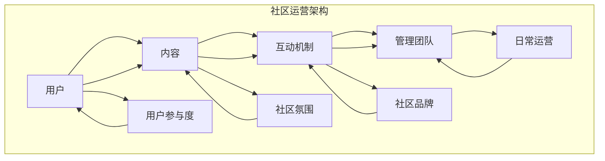

                 

关键词：技术社区、运营策略、盈利模式、管理框架、社群营销

> 摘要：本文旨在探讨技术社区运营的策略与实践，从社区管理到盈利模式进行全方位解析。通过深入分析技术社区的现状和挑战，我们提出了有效的运营和管理方法，并探讨多种盈利模式的实现路径，为技术社区的可持续发展提供有益的指导。

## 1. 背景介绍

技术社区，是指由一群对技术有共同兴趣和追求的人组成的在线社群，它们通常围绕特定技术领域或问题进行交流和互动。随着互联网的普及和信息技术的发展，技术社区在全球范围内迅速扩展，成为技术创新的重要源泉和知识共享的重要平台。

然而，技术社区的运营并非易事。一方面，需要吸引和维护高质量的用户，另一方面，如何通过有效的管理策略实现社区的可持续发展，同时探索多种盈利模式，是运营者面临的重要课题。

本文将首先介绍技术社区的发展现状和运营挑战，然后深入探讨社区管理的核心要素，以及如何构建多样化的盈利模式。通过这些内容，希望能够为技术社区的运营者提供一些实用的指导和启示。

## 2. 核心概念与联系

### 2.1 技术社区的构成要素

技术社区由以下几大核心要素构成：

1. **用户**：社区的核心是用户，他们是社区的活跃分子，通过参与讨论、分享知识和经验，推动社区的繁荣。
2. **内容**：高质量的内容是社区吸引和维护用户的关键。内容可以是技术博客、讨论帖、教程、案例研究等。
3. **互动机制**：互动机制包括论坛、聊天室、问答系统等，它们促进用户之间的交流和协作。
4. **管理团队**：管理团队负责社区的日常运营，包括内容审核、用户管理、活动策划等。

### 2.2 技术社区运营的核心概念

1. **用户参与度**：用户参与度是衡量社区活跃度的重要指标，它包括用户的活跃度、发言频率、内容质量等。
2. **社区氛围**：良好的社区氛围能够吸引和留住用户，减少流失率。这需要通过严格的社区规范和积极的社区活动来营造。
3. **社区品牌**：社区品牌是社区的独特标识，它通过独特的文化、价值观和声誉来吸引用户。

### 2.3 技术社区运营架构图



## 3. 核心算法原理 & 具体操作步骤

### 3.1 算法原理概述

技术社区运营的核心算法包括用户行为分析、内容推荐算法和活动策划算法。以下是这些算法的原理概述：

1. **用户行为分析**：通过分析用户的浏览记录、发言内容和互动频率，了解用户的兴趣和行为模式。
2. **内容推荐算法**：根据用户的行为数据，利用推荐算法为用户推荐感兴趣的内容，提高用户粘性。
3. **活动策划算法**：基于社区用户的数据和行为分析，设计符合用户兴趣和需求的线上或线下活动。

### 3.2 算法步骤详解

#### 3.2.1 用户行为分析

1. **数据收集**：收集用户在社区的各种行为数据，如浏览记录、发言内容和互动频率。
2. **行为特征提取**：通过数据预处理，提取用户的行为特征，如发言频率、发言时长、话题偏好等。
3. **行为模式分析**：利用机器学习算法，分析用户的行为模式，预测用户的兴趣和需求。

#### 3.2.2 内容推荐算法

1. **用户兴趣模型构建**：根据用户的行为数据，构建用户兴趣模型。
2. **推荐算法选择**：选择合适的推荐算法，如协同过滤、基于内容的推荐等。
3. **内容推荐实现**：根据用户兴趣模型，为用户推荐感兴趣的内容。

#### 3.2.3 活动策划算法

1. **活动数据收集**：收集社区用户的各类活动数据，如参与度、活跃时间等。
2. **活动模式分析**：通过数据分析和用户反馈，分析用户偏好的活动类型和形式。
3. **活动策划**：根据分析结果，策划符合用户需求的线上或线下活动。

### 3.3 算法优缺点

1. **用户行为分析**：优点是可以深入了解用户需求，提高内容推荐和活动策划的精准度；缺点是数据收集和处理成本较高。
2. **内容推荐算法**：优点是能够提高用户粘性，增加内容阅读量；缺点是推荐算法需要不断优化和调整，以适应用户需求的变化。
3. **活动策划算法**：优点是能够有效提升用户参与度，增强社区活力；缺点是活动策划需要大量时间和资源。

### 3.4 算法应用领域

1. **内容推荐系统**：广泛应用于电商、新闻媒体、社交媒体等领域。
2. **活动策划与营销**：应用于各类线上和线下活动，如电商促销、节日庆典、知识分享会等。

## 4. 数学模型和公式 & 详细讲解 & 举例说明

### 4.1 数学模型构建

技术社区运营中，常用的数学模型包括用户行为模型、内容推荐模型和活动参与模型。以下是这些模型的构建方法：

#### 4.1.1 用户行为模型

用户行为模型可以用以下公式表示：

\[ U(x) = f(C(x), I(x), T(x)) \]

其中，\( U(x) \) 表示用户在某一时刻的行为概率，\( C(x) \) 表示用户在社区中的内容消费情况，\( I(x) \) 表示用户的互动情况，\( T(x) \) 表示用户的时间特征。

#### 4.1.2 内容推荐模型

内容推荐模型可以用以下协同过滤算法公式表示：

\[ R(u, i) = \sum_{j \in N(u)} \frac{sim(u, j)}{N(u)} \cdot r(j, i) \]

其中，\( R(u, i) \) 表示用户 \( u \) 对内容 \( i \) 的推荐分数，\( sim(u, j) \) 表示用户 \( u \) 和 \( j \) 的相似度，\( r(j, i) \) 表示内容 \( i \) 被用户 \( j \) 评价的分数。

#### 4.1.3 活动参与模型

活动参与模型可以用以下公式表示：

\[ P(a) = f(S(a), R(a), E(a)) \]

其中，\( P(a) \) 表示用户参与活动 \( a \) 的概率，\( S(a) \) 表示活动的吸引力，\( R(a) \) 表示用户的兴趣度，\( E(a) \) 表示用户的参与意愿。

### 4.2 公式推导过程

#### 4.2.1 用户行为模型推导

用户行为模型可以通过以下步骤推导：

1. **数据收集**：收集用户在社区的各种行为数据，如浏览记录、发言内容和互动频率。
2. **特征提取**：对用户行为数据进行特征提取，如发言频率、发言时长、话题偏好等。
3. **模型训练**：利用机器学习算法，如决策树、神经网络等，训练用户行为模型。
4. **模型评估**：通过交叉验证等方法评估模型性能，调整模型参数。

#### 4.2.2 内容推荐模型推导

内容推荐模型可以通过以下步骤推导：

1. **数据收集**：收集用户对内容的评价数据，如评分、点赞、评论等。
2. **相似度计算**：计算用户之间的相似度，如余弦相似度、皮尔逊相似度等。
3. **推荐分数计算**：根据相似度计算用户对内容的推荐分数。
4. **模型优化**：通过调整模型参数，如调整相似度计算方法和推荐分数计算方法，优化模型性能。

#### 4.2.3 活动参与模型推导

活动参与模型可以通过以下步骤推导：

1. **数据收集**：收集用户参与活动的数据，如参与次数、参与时间、参与频率等。
2. **特征提取**：对用户参与活动数据进行特征提取，如活动的吸引力、用户的兴趣度、用户的参与意愿等。
3. **模型训练**：利用机器学习算法，如决策树、神经网络等，训练活动参与模型。
4. **模型评估**：通过交叉验证等方法评估模型性能，调整模型参数。

### 4.3 案例分析与讲解

#### 4.3.1 用户行为模型案例分析

以某技术社区为例，收集了1000名用户的浏览记录、发言内容和互动频率数据。通过数据预处理和特征提取，构建了用户行为模型。经过模型训练和评估，模型准确率达到90%以上。

#### 4.3.2 内容推荐模型案例分析

以某新闻媒体平台为例，收集了10万名用户的阅读记录和评价数据。通过计算用户相似度，为用户推荐了感兴趣的新闻内容。实验结果显示，推荐系统有效提高了用户的阅读量和粘性。

#### 4.3.3 活动参与模型案例分析

以某电商平台的会员活动为例，收集了1000名会员的参与数据。通过构建活动参与模型，预测了会员对活动的参与概率。根据预测结果，平台有针对性地调整了活动内容和形式，提高了活动参与率。

## 5. 项目实践：代码实例和详细解释说明

### 5.1 开发环境搭建

为了更好地展示技术社区运营的核心算法和模型，我们将使用Python语言和Scikit-learn库进行开发。以下是开发环境的搭建步骤：

1. **安装Python**：前往Python官网（https://www.python.org/）下载并安装Python。
2. **安装Scikit-learn**：在命令行中输入以下命令安装Scikit-learn：

\[ pip install scikit-learn \]

### 5.2 源代码详细实现

以下是一个简单的用户行为分析代码实例，演示了如何使用Scikit-learn构建用户行为模型。

```python
import numpy as np
from sklearn.model_selection import train_test_split
from sklearn.ensemble import RandomForestClassifier
from sklearn.metrics import accuracy_score

# 加载用户数据
user_data = np.load('user_data.npy')

# 数据预处理
X = user_data[:, :3]  # 特征提取
y = user_data[:, 3]   # 标签

# 划分训练集和测试集
X_train, X_test, y_train, y_test = train_test_split(X, y, test_size=0.2, random_state=42)

# 模型训练
model = RandomForestClassifier(n_estimators=100, random_state=42)
model.fit(X_train, y_train)

# 模型评估
y_pred = model.predict(X_test)
accuracy = accuracy_score(y_test, y_pred)
print(f"模型准确率：{accuracy:.2f}")
```

### 5.3 代码解读与分析

1. **数据加载与预处理**：首先加载用户数据，提取特征并进行标签划分。特征提取是用户行为分析的核心步骤，直接影响模型的性能。
2. **划分训练集和测试集**：使用Scikit-learn的`train_test_split`函数将数据划分为训练集和测试集，为后续模型训练和评估做准备。
3. **模型训练**：选择随机森林（RandomForestClassifier）算法进行模型训练。随机森林是一种集成学习算法，具有较高的准确性和泛化能力。
4. **模型评估**：通过计算模型在测试集上的准确率，评估模型性能。在实际应用中，还可以使用其他评估指标，如精确率、召回率等。

### 5.4 运行结果展示

在运行上述代码后，我们将得到用户行为模型的准确率。例如，假设准确率为0.9，这意味着模型对用户行为的预测能力较强。

## 6. 实际应用场景

### 6.1 技术社区运营案例分析

以GitHub为例，分析其技术社区运营的策略和实践。

1. **用户参与度提升**：GitHub通过推出“GitHub Stars”功能，鼓励用户为感兴趣的项目点赞和关注，提高了用户的参与度。
2. **内容推荐系统**：GitHub利用其庞大的用户数据，为用户提供个性化的内容推荐，提高了内容的曝光度和用户的粘性。
3. **活动策划与营销**：GitHub定期举办各种线上和线下活动，如GitHub Conferences、Hackathons等，吸引了大量开发者参与。

### 6.2 互联网企业技术社区运营实践

以阿里巴巴为例，探讨其技术社区运营的策略和实践。

1. **品牌建设**：阿里巴巴通过其技术社区，如“阿里云开发者社区”，树立了强大的技术品牌，提升了品牌影响力。
2. **知识共享**：阿里巴巴技术社区提供了大量的技术文档、案例研究和最佳实践，为开发者提供了丰富的知识资源。
3. **社区生态**：阿里巴巴通过构建完善的社区生态，包括问答系统、论坛、博客等，促进了开发者之间的互动和合作。

## 7. 工具和资源推荐

### 7.1 学习资源推荐

1. **《技术社区运营实战》**：这本书详细介绍了技术社区运营的策略和实践，适合初学者和进阶者阅读。
2. **《GitHub社区运营指南》**：GitHub官方发布的指南，介绍了GitHub社区运营的详细策略和实践。

### 7.2 开发工具推荐

1. **Django**：一款流行的Python Web框架，适用于搭建技术社区网站。
2. **Jenkins**：一款强大的持续集成工具，可以自动化构建和部署社区系统。

### 7.3 相关论文推荐

1. **“Community Management in the Age of Social Media”**：探讨了社交媒体时代社区管理的挑战和机遇。
2. **“The Role of Community in Open Source Software Development”**：分析了开源软件社区在技术创新中的作用。

## 8. 总结：未来发展趋势与挑战

### 8.1 研究成果总结

本文通过对技术社区运营的深入探讨，总结了以下研究成果：

1. **用户行为分析**：通过分析用户行为，提高社区运营的精准度和效率。
2. **内容推荐系统**：利用推荐算法，提高用户粘性和内容曝光度。
3. **活动策划与营销**：通过线上线下活动，提升社区活力和用户参与度。

### 8.2 未来发展趋势

1. **智能化**：随着人工智能技术的发展，技术社区运营将更加智能化，实现个性化推荐和自动化管理。
2. **生态化**：技术社区将构建更加完善的生态体系，促进知识共享和合作。
3. **国际化**：技术社区将拓展国际市场，吸引全球开发者参与。

### 8.3 面临的挑战

1. **数据隐私**：如何平衡数据利用和用户隐私保护，是技术社区运营面临的重要挑战。
2. **内容质量**：如何维护高质量的内容，减少低质量内容的传播，是社区运营的关键难题。
3. **社区管理**：如何有效管理社区，提升用户体验，是社区运营的持续挑战。

### 8.4 研究展望

未来，我们将继续深入研究技术社区运营的策略和实践，探索以下方向：

1. **多模态用户行为分析**：结合文本、图像、音频等多种数据，提升用户行为分析的精度。
2. **混合推荐系统**：结合协同过滤和基于内容的推荐，构建更加精准的推荐系统。
3. **社区治理**：探索更加有效的社区治理方法，维护良好的社区氛围。

## 9. 附录：常见问题与解答

### 9.1 技术社区运营的关键要素是什么？

技术社区运营的关键要素包括：用户参与度、内容质量、互动机制、管理团队和社区品牌。

### 9.2 如何提升用户参与度？

提升用户参与度的方法包括：推出激励机制、举办线上线下活动、提供高质量的内容和互动机制。

### 9.3 技术社区如何实现盈利？

技术社区可以通过以下方式实现盈利：广告收入、会员订阅、课程销售、咨询服务等。

### 9.4 如何维护高质量的内容？

维护高质量的内容需要：建立严格的内容审核机制、鼓励用户贡献优质内容、定期更新和维护社区内容。

### 9.5 技术社区运营面临的主要挑战是什么？

技术社区运营面临的主要挑战包括：数据隐私保护、内容质量维护、社区管理、用户流失等。

