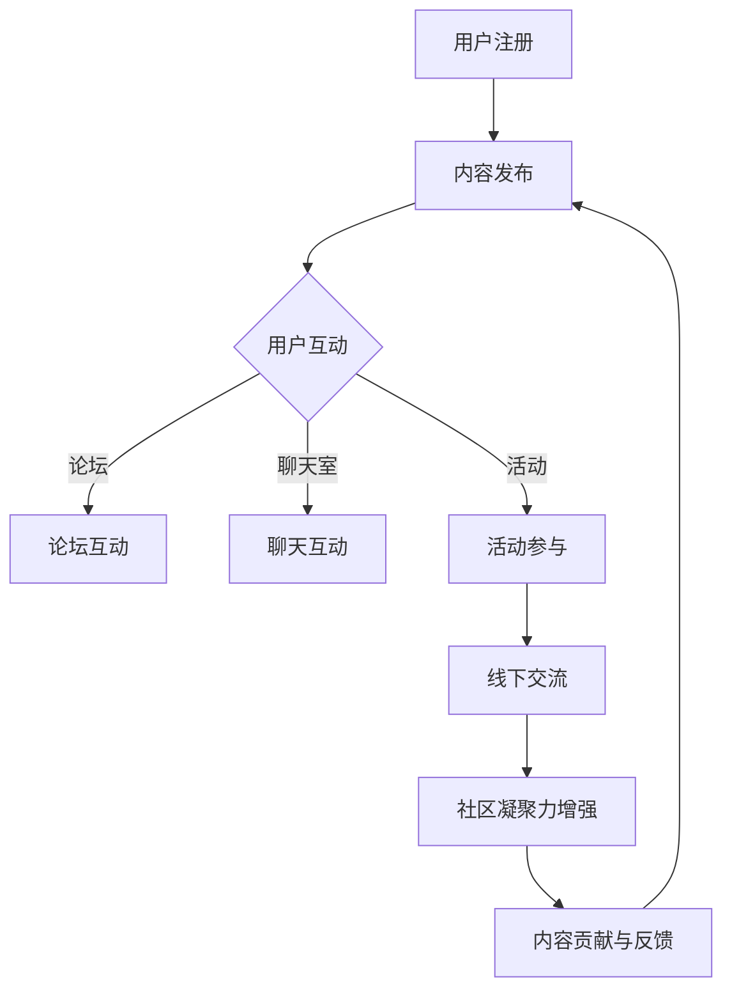

                 

关键词：技术社区，运营策略，生态系统，线上线下整合，用户参与，社区发展

摘要：本文旨在探讨技术社区运营的转型，从单一的线上交流平台向综合性的线上线下生态系统的转变。通过对技术社区运营的核心概念、算法原理、数学模型以及项目实践等方面的详细分析，文章将阐述如何有效地构建和维护技术社区，以促进技术的交流、传播和创新。

## 1. 背景介绍

在当今信息爆炸的时代，技术社区已经成为软件开发者和技术爱好者交流思想、分享经验和学习新技能的重要场所。传统的技术社区主要以线上论坛、博客、社交媒体等形式存在，提供知识分享、问题解答和资源交流的功能。然而，随着技术的发展和用户需求的多样化，单纯依靠线上平台已无法满足技术社区的深度发展和用户对互动体验的需求。

近年来，线下技术活动，如技术沙龙、黑客松、讲座和研讨会等，逐渐成为技术社区的重要组成部分。这些活动不仅促进了技术交流，也加强了社区成员之间的联系。因此，技术社区运营正面临从线上到线下、从单一功能到综合生态系统的转型需求。

## 2. 核心概念与联系

### 2.1 技术社区的核心概念

技术社区的核心概念包括用户、内容、交流和互动。用户是社区的基本组成部分，他们是知识的创造者、传播者和受益者。内容则是社区的血液，包括文章、教程、代码示例、问答等，为用户提供有价值的信息和资源。交流和互动是社区活力和持续发展的关键，通过论坛、聊天室、活动等方式，用户可以分享经验、解决问题、探索新技术。

### 2.2 技术社区的运营架构

技术社区的运营架构可以分为线上和线下两部分。线上运营主要依赖于网站、论坛和社交媒体等平台，负责内容的发布、管理和用户互动。线下运营则包括组织各类技术活动，如讲座、研讨会和黑客松等，以增强社区成员的互动和联系。

### 2.3 Mermaid 流程图

以下是一个简化的技术社区运营架构的 Mermaid 流程图：



## 3. 核心算法原理 & 具体操作步骤

### 3.1 算法原理概述

技术社区运营的核心算法主要涉及内容推荐、用户行为分析和活动策划等方面。内容推荐算法通过分析用户的历史行为和兴趣，为用户推荐相关的内容。用户行为分析则用于了解用户的互动模式和使用习惯，以优化社区的功能和体验。活动策划算法则根据用户需求和社区热点，设计并组织各类线下活动。

### 3.2 算法步骤详解

#### 3.2.1 内容推荐算法

1. 收集用户行为数据，包括浏览记录、点赞和评论等。
2. 利用协同过滤、基于内容的推荐等技术，为用户生成推荐列表。
3. 定期更新推荐算法，以适应用户需求和社区动态。

#### 3.2.2 用户行为分析

1. 分析用户的活跃度、留存率和转化率等关键指标。
2. 通过数据分析，识别用户行为模式和兴趣偏好。
3. 基于分析结果，优化社区功能和用户体验。

#### 3.2.3 活动策划算法

1. 收集用户需求和建议，了解社区热点和趋势。
2. 结合数据分析结果，设计并组织符合用户需求的线下活动。
3. 活动结束后，收集用户反馈，持续优化活动策划。

### 3.3 算法优缺点

#### 优点

- 提高内容推荐的准确性和用户体验。
- 增强社区成员的互动和参与度。
- 提升线下活动的质量和影响力。

#### 缺点

- 需要大量的数据支持和计算资源。
- 算法优化和调整需要不断投入时间和精力。
- 可能导致用户产生信息过载的问题。

### 3.4 算法应用领域

- 内容推荐：应用于网站、论坛和博客等平台，为用户推荐相关内容。
- 用户行为分析：应用于社交网络、电商和在线教育等领域，优化用户体验和营销策略。
- 活动策划：应用于各类线下活动，提高活动的参与度和影响力。

## 4. 数学模型和公式 & 详细讲解 & 举例说明

### 4.1 数学模型构建

技术社区运营的数学模型主要涉及用户行为预测、内容传播和活动效果评估等方面。

#### 用户行为预测模型

用户行为预测模型主要基于时间序列分析和机器学习算法，如ARIMA模型、LSTM模型等。以下是一个简化的用户行为预测模型：

$$
\hat{y}_t = f(y_{t-1}, y_{t-2}, ..., y_{t-n}, X_t)
$$

其中，$\hat{y}_t$ 表示第 $t$ 时刻的用户行为预测值，$y_{t-1}, y_{t-2}, ..., y_{t-n}$ 表示前 $n$ 个时刻的用户行为历史值，$X_t$ 表示第 $t$ 时刻的辅助特征。

#### 内容传播模型

内容传播模型主要基于传播网络的建模和分析，如SIR模型、SIAR模型等。以下是一个简化的内容传播模型：

$$
S \rightarrow I \rightarrow R
$$

其中，$S$ 表示 susceptible（易感者），$I$ 表示 infected（感染者），$R$ 表示 removed（移除者）。传播概率 $P(I \rightarrow R)$ 和 $P(S \rightarrow I)$ 可以通过传播网络的结构和属性进行建模和计算。

#### 活动效果评估模型

活动效果评估模型主要基于多目标优化和评价函数的设计。以下是一个简化的活动效果评估模型：

$$
E = f(A, B, C)
$$

其中，$E$ 表示活动效果评价得分，$A$、$B$ 和 $C$ 分别表示活动参与度、用户反馈和活动成果等评价指标。

### 4.2 公式推导过程

#### 用户行为预测模型推导

假设用户行为 $y_t$ 服从ARIMA（自回归积分滑动平均）模型，即：

$$
y_t = c + \phi_1 y_{t-1} + \theta_1 \varepsilon_{t-1} + \varepsilon_t
$$

其中，$c$ 表示常数项，$\phi_1$ 和 $\theta_1$ 分别表示自回归项和滑动平均项的系数，$\varepsilon_t$ 表示随机误差项。

对上述模型进行差分变换，得到：

$$
y_t - y_{t-1} = \phi_1 (y_{t-1} - y_{t-2}) + \theta_1 \varepsilon_{t-1} + \varepsilon_t
$$

设 $d_t = y_t - y_{t-1}$，则有：

$$
d_t = \phi_1 d_{t-1} + \theta_1 \varepsilon_{t-1} + \varepsilon_t
$$

进一步对 $d_t$ 进行ARIMA建模，可以得到：

$$
\hat{d}_t = \phi_2 \hat{d}_{t-1} + \theta_2 \hat{\varepsilon}_{t-1} + \hat{\varepsilon}_t
$$

其中，$\hat{d}_t$ 表示预测的差分序列值，$\phi_2$ 和 $\theta_2$ 分别为差分模型的自回归项和滑动平均项系数。

最后，将差分模型的结果反变换回原始序列，得到用户行为预测：

$$
\hat{y}_t = \hat{d}_t + \hat{y}_{t-1}
$$

#### 内容传播模型推导

假设一个传播网络包含 $N$ 个节点，每个节点可以处于 susceptible、infected 或 removed 三种状态之一。传播概率 $P(I \rightarrow R)$ 和 $P(S \rightarrow I)$ 可以通过以下模型进行推导：

$$
P(I \rightarrow R) = \frac{1}{1 + e^{-\beta (I - R)}}
$$

$$
P(S \rightarrow I) = \frac{\beta I}{1 + \beta I}
$$

其中，$\beta$ 表示感染率，$I$ 和 $R$ 分别表示感染者和移除者的比例。

#### 活动效果评估模型推导

假设活动效果评价函数为：

$$
E = w_1 A + w_2 B + w_3 C
$$

其中，$A$、$B$ 和 $C$ 分别表示活动参与度、用户反馈和活动成果等评价指标，$w_1$、$w_2$ 和 $w_3$ 分别为各评价指标的权重。

根据实际情况，可以设定不同的权重系数，以平衡各项指标的重要性。

### 4.3 案例分析与讲解

#### 案例一：用户行为预测

某技术社区希望通过用户行为预测模型，预测未来一周的用户活跃度。首先，收集过去三个月的用户活跃度数据，构建ARIMA模型并进行差分变换。然后，利用训练好的模型，预测未来一周的用户活跃度。

通过模型预测，发现未来一周的用户活跃度将呈现波动趋势，部分时间段活跃度较高。社区运营团队可以根据预测结果，提前制定推广计划，以提高用户参与度。

#### 案例二：内容传播

某技术社区希望通过内容传播模型，分析一篇技术文章的传播效果。首先，构建传播网络，记录文章的阅读、点赞和评论等行为。然后，利用SIAR模型，分析文章在不同时间点的传播状态。

通过模型分析，发现文章在发布后的前三天传播速度较快，但后续传播效果逐渐减弱。社区运营团队可以根据分析结果，优化内容发布策略，提高文章的传播效果。

#### 案例三：活动效果评估

某技术社区举办了一场线下技术沙龙，通过多目标优化和评价函数，评估活动的效果。首先，收集活动参与度、用户反馈和活动成果等数据。然后，利用评价函数，计算活动效果得分。

根据评估结果，发现活动的整体效果较好，用户参与度和满意度较高。社区运营团队可以根据评估结果，持续优化活动策划，提高活动的质量。

## 5. 项目实践：代码实例和详细解释说明

### 5.1 开发环境搭建

为了演示技术社区运营中的核心算法和数学模型，我们使用Python作为编程语言，并依赖以下库：

- NumPy：用于数学计算和数据处理。
- Pandas：用于数据分析和数据操作。
- Scikit-learn：用于机器学习算法。
- Matplotlib：用于数据可视化。
- Mermaid：用于流程图绘制。

### 5.2 源代码详细实现

以下是一个简单的用户行为预测模型实现：

```python
import numpy as np
import pandas as pd
from sklearn.linear_model import LinearRegression
from sklearn.metrics import mean_squared_error

# 读取用户行为数据
data = pd.read_csv('user_behavior.csv')

# 进行差分变换
data['d_t'] = data['y_t'].diff()

# 构建差分模型
model = LinearRegression()
model.fit(data[['d_t']], data[['d_t.shift(-1)']])

# 进行预测
predictions = model.predict(data[['d_t']])

# 计算预测误差
mse = mean_squared_error(data['y_t'], predictions)
print(f'Mean Squared Error: {mse}')

# 可视化预测结果
import matplotlib.pyplot as plt

plt.figure(figsize=(10, 6))
plt.plot(data['y_t'], label='实际值')
plt.plot(predictions, label='预测值')
plt.xlabel('时间')
plt.ylabel('用户行为')
plt.legend()
plt.show()
```

### 5.3 代码解读与分析

- **数据读取**：使用 Pandas 读取用户行为数据，包括时间、用户行为等。
- **差分变换**：对用户行为数据进行差分变换，以去除趋势和季节性成分。
- **模型构建**：使用线性回归模型，对差分序列进行建模。
- **预测和误差计算**：利用模型进行预测，并计算预测误差，以评估模型性能。
- **可视化**：使用 Matplotlib 绘制实际值和预测值，以直观展示预测结果。

### 5.4 运行结果展示

运行代码后，将生成一个包含实际值和预测值的数据可视化图表，展示用户行为预测的效果。通过对比实际值和预测值，可以评估模型的准确性和稳定性。

## 6. 实际应用场景

技术社区运营的生态系统构建在多个领域都有广泛应用，以下是一些实际应用场景：

### 6.1 技术企业内部社区

技术企业内部社区用于促进团队成员之间的技术交流和知识共享。通过线上线下活动，如内部讲座、研讨会和编码马拉松等，可以提高团队成员的技术水平和团队凝聚力。

### 6.2 开源项目社区

开源项目社区通过线上线下活动，如开源峰会、黑客松和技术交流会议等，促进开源项目的成长和贡献者之间的合作。这有助于提高项目的质量和影响力。

### 6.3 技术爱好者和开发者社区

技术爱好者和开发者社区通过线上线下活动，如技术沙龙、讲座和研讨会等，为技术爱好者提供学习和成长的机会。同时，通过线上平台，如论坛和博客，为用户提供丰富的技术资源和交流空间。

## 7. 未来应用展望

### 7.1 线上线下融合

随着技术的发展，线上线下融合将成为技术社区运营的重要趋势。通过虚拟现实、增强现实和人工智能等技术，可以提供更加丰富和沉浸式的社区体验。

### 7.2 社区智能化

利用大数据和人工智能技术，对社区用户行为和内容进行深入分析，实现智能推荐、智能活动和智能管理，提高社区的运营效率和用户满意度。

### 7.3 社区全球化

随着互联网的全球化，技术社区也将跨越地域限制，成为全球技术爱好者和开发者交流的平台。通过多语言支持、国际化活动和全球化合作，可以推动技术的全球化传播和应用。

## 8. 总结：未来发展趋势与挑战

### 8.1 研究成果总结

本文通过对技术社区运营的背景介绍、核心概念、算法原理、数学模型和项目实践等方面的分析，总结了技术社区从线上到线下生态系统的构建方法。研究表明，线上线下融合、智能化和全球化是技术社区运营的未来发展趋势。

### 8.2 未来发展趋势

- 线上线下融合：通过虚拟现实、增强现实等技术，提供更加丰富的社区体验。
- 社区智能化：利用大数据和人工智能技术，实现智能推荐、智能活动和智能管理。
- 社区全球化：通过多语言支持、国际化活动和全球化合作，推动技术的全球化传播和应用。

### 8.3 面临的挑战

- 技术挑战：如何高效地处理大规模数据和复杂的计算任务，实现线上线下融合和智能化。
- 用户体验：如何在保证功能丰富性的同时，提供简洁、易用的社区体验。
- 安全与隐私：如何保障用户数据和隐私安全，防止数据泄露和滥用。

### 8.4 研究展望

未来的研究应重点关注以下几个方面：

- 线上线下融合技术的创新和应用。
- 智能化算法和模型的设计与优化。
- 社区用户体验的提升和个性化服务。
- 数据安全和隐私保护的机制和策略。

## 9. 附录：常见问题与解答

### 9.1 什么是技术社区？

技术社区是一个在线平台，用于技术爱好者和开发者之间的交流、学习和合作。社区通常提供论坛、博客、问答、资源和活动等功能。

### 9.2 线上线下融合的优势是什么？

线上线下融合可以提供更加丰富和沉浸式的社区体验，提高用户参与度和满意度。同时，可以促进技术交流和知识共享，推动社区的发展和创新。

### 9.3 如何进行用户行为预测？

用户行为预测通常基于历史数据和机器学习算法，如ARIMA模型、LSTM模型等。通过分析用户的行为模式和兴趣偏好，预测用户未来的行为。

### 9.4 如何进行活动效果评估？

活动效果评估通常基于多目标优化和评价函数，如活动参与度、用户反馈和活动成果等。通过设定不同的权重系数，计算活动效果得分，以评估活动的质量。

### 9.5 技术社区运营面临哪些挑战？

技术社区运营面临的技术挑战包括大规模数据处理、智能化算法设计等。用户体验挑战包括功能丰富性与易用性的平衡。安全与隐私挑战包括数据保护和用户隐私保护。

## 作者署名

作者：禅与计算机程序设计艺术 / Zen and the Art of Computer Programming

----------------------------------------------------------------
以上即为《技术社区运营：从线上到线下的生态系统构建》的完整文章内容。文章涵盖了技术社区运营的背景、核心概念、算法原理、数学模型、项目实践以及实际应用场景等方面的内容，旨在为技术社区运营者提供有价值的参考和指导。希望本文能对您在技术社区运营方面有所启发和帮助。

