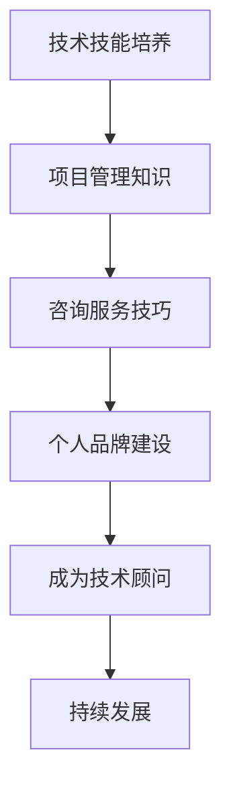

                 

在当前快速发展的技术时代，技术顾问作为高收入兼职选择越来越受到专业人士的关注。本文将深入探讨技术顾问的角色、核心能力、收入潜力以及如何成为一名成功的技术顾问。

## 文章关键词
- 技术顾问
- 高收入兼职
- 技术专家
- 咨询服务
- 个人品牌
- 项目管理

## 文章摘要
本文旨在为IT专业人士提供一份关于成为技术顾问的全面指南。我们将讨论技术顾问的职业路径、技能需求、市场趋势以及如何通过提高个人品牌价值和有效项目管理来提升收入潜力。

## 1. 背景介绍

技术顾问作为IT咨询行业的核心角色，承担着为企业提供技术解决方案、优化业务流程、提升系统性能等重任。随着企业对数字化转型需求的增加，技术顾问的需求也日益增长。根据市场研究，技术顾问的年收入通常远高于行业平均水平，成为IT专业人士眼中的黄金兼职选择。

### 1.1 技术顾问的角色

技术顾问不仅需要具备扎实的技术背景，还要求具备出色的沟通能力、问题解决能力和项目管理能力。他们的职责通常包括：

- **需求分析**：了解企业需求，分析技术解决方案。
- **方案设计**：设计技术方案，确保方案可行并满足企业需求。
- **实施监督**：监督技术实施过程，确保项目按时按质完成。
- **风险评估**：识别和评估项目中的风险，并提出应对策略。

### 1.2 技术顾问的薪酬水平

根据行业数据，技术顾问的薪酬水平取决于多种因素，包括工作经验、技能水平、服务领域以及地理位置。一般而言，技术顾问的年收入范围从5位数到6位数不等。一些资深的技术顾问甚至能通过项目咨询实现更高收入。

## 2. 核心概念与联系

在成为技术顾问的过程中，理解和掌握以下核心概念是至关重要的。

### 2.1 技术领域的专业化

技术顾问需要根据自己的专长选择合适的领域，如软件开发、网络安全、云计算、数据分析和人工智能等。专业化不仅可以提高顾问的专业能力，还能增加其在特定领域的市场价值。

### 2.2 项目管理知识

项目管理是技术顾问不可或缺的技能。掌握项目管理知识，如项目管理方法论（如PMBOK、敏捷方法论等）、项目规划、资源管理、风险管理和沟通管理等，可以帮助技术顾问更高效地管理项目，确保项目成功交付。

### 2.3 咨询服务技巧

技术顾问需要具备出色的咨询服务技巧，包括倾听客户需求、明确项目目标、提出专业建议和解决方案。这些技巧有助于建立客户信任，提升服务质量。

### 2.4 个人品牌建设

个人品牌建设对于技术顾问的成功至关重要。通过撰写技术博客、参与社区活动、发表演讲和参与开源项目等，技术顾问可以提升自己的知名度，增加潜在客户来源。

### 2.5 Mermaid 流程图

下面是一个简化的技术顾问职业路径的Mermaid流程图，展示从技术技能培养到成为成功技术顾问的各个阶段。



## 3. 核心算法原理 & 具体操作步骤

### 3.1 算法原理概述

技术顾问的工作流程可以看作是一种算法，其核心原理包括以下几个方面：

- **需求识别**：通过沟通和分析，识别客户的需求。
- **方案设计**：结合专业知识和市场趋势，设计符合客户需求的技术方案。
- **项目实施**：监督项目实施，确保方案落地。
- **效果评估**：评估项目效果，提供反馈和改进建议。

### 3.2 算法步骤详解

#### 3.2.1 需求识别

1. **初次沟通**：与技术顾问进行深入交流，了解企业背景、业务流程和面临的技术挑战。
2. **需求分析**：通过问卷调查、访谈等方式，收集详细需求信息。
3. **需求确认**：与客户确认需求，确保理解一致。

#### 3.2.2 方案设计

1. **技术选型**：根据需求，选择最适合的技术解决方案。
2. **方案制定**：制定详细的实施方案，包括技术路线、时间计划、资源分配等。
3. **方案评审**：与客户团队评审方案，确保方案可行性和客户满意度。

#### 3.2.3 项目实施

1. **项目启动**：召开启动会议，明确项目目标和任务分配。
2. **进度监控**：定期监控项目进度，确保项目按计划进行。
3. **风险管理**：识别和应对项目风险，确保项目顺利推进。

#### 3.2.4 效果评估

1. **效果评估**：根据项目目标和指标，评估项目效果。
2. **反馈收集**：收集客户反馈，了解客户对项目的满意度。
3. **改进建议**：根据评估结果和客户反馈，提出改进建议。

### 3.3 算法优缺点

#### 优点

- **灵活性**：技术顾问可以根据客户需求灵活调整方案。
- **专业性**：技术顾问具备丰富的技术经验和专业知识，能够提供高质量的服务。
- **效率**：技术顾问的工作流程经过优化，能够高效地完成项目。

#### 缺点

- **依赖性**：客户对技术顾问的依赖可能增加，不利于企业内部的自主发展。
- **成本**：技术顾问的薪资相对较高，可能增加企业的成本。

### 3.4 算法应用领域

技术顾问的算法原理适用于多种领域，包括：

- **软件开发**：提供技术解决方案，优化开发流程。
- **网络安全**：评估企业网络安全风险，提供防护建议。
- **云计算**：帮助企业实现云迁移，提升云计算能力。
- **数据分析**：提供数据分析和可视化解决方案，支持决策。

## 4. 数学模型和公式 & 详细讲解 & 举例说明

在技术顾问的工作中，数学模型和公式是不可或缺的工具。以下是一个简单的成本效益分析数学模型，用于评估技术顾问项目的投资回报率。

### 4.1 数学模型构建

假设项目投资为C（成本），预期收益为R（收益），项目周期为T（时间），则投资回报率（ROI）的计算公式为：

\[ ROI = \frac{R}{C} \]

### 4.2 公式推导过程

投资回报率的推导基于基本的财务原理。其核心思想是比较项目的总收益与总成本，计算收益与成本的比率。具体推导过程如下：

\[ ROI = \frac{总收益}{总成本} \]

\[ 总收益 = 预期收益 - 项目成本 \]

将预期收益和项目成本的表达式代入上述公式，得到：

\[ ROI = \frac{预期收益}{项目成本} \]

由于项目成本通常包括直接成本和间接成本，我们可以进一步将其分解：

\[ 项目成本 = 直接成本 + 间接成本 \]

将项目成本的表达式代入公式，得到：

\[ ROI = \frac{预期收益}{直接成本 + 间接成本} \]

在简化的情况下，我们可以将间接成本视为固定值，因此公式可以进一步简化为：

\[ ROI = \frac{预期收益}{项目成本} \]

### 4.3 案例分析与讲解

假设一个企业决定投资50,000美元进行一项新的软件开发项目，预计该项目将在两年内带来75,000美元的额外收入。假设直接成本为40,000美元，间接成本为10,000美元。

根据上述公式，我们可以计算出项目的投资回报率：

\[ ROI = \frac{75,000}{50,000} = 1.5 \]

或者以百分比表示：

\[ ROI = 150\% \]

这意味着企业每年从该项目中获得50%的回报。这是一个非常高的投资回报率，表明该项目是一个值得投资的良好机会。

### 4.4 深入分析

投资回报率（ROI）是一个重要的财务指标，它可以帮助企业评估不同投资项目的经济可行性。在实际应用中，企业通常会考虑多个因素，包括市场趋势、技术可行性、成本和潜在收益等。

为了更深入地分析投资回报率，我们可以引入以下概念：

- **净现值（NPV）**：将未来的收益和成本折现到现在的价值，以评估项目的总价值。
- **内部收益率（IRR）**：使净现值为零的折现率，表示项目的实际回报率。

这两个指标可以帮助企业更全面地评估项目的经济价值。

### 4.4.1 净现值（NPV）计算

净现值（NPV）是评估投资项目经济价值的一个重要工具。其计算公式为：

\[ NPV = \sum_{t=1}^{T} \frac{R_t}{(1 + r)^t} - C \]

其中，\( R_t \) 表示第 t 年的预期收益，\( r \) 表示折现率，\( T \) 表示项目周期，C表示总成本。

假设上述项目的预期收益每年为30,000美元，折现率为10%，则项目的净现值计算如下：

\[ NPV = \frac{30,000}{(1 + 0.1)^1} + \frac{30,000}{(1 + 0.1)^2} - 50,000 \]

\[ NPV = \frac{30,000}{1.1} + \frac{30,000}{1.21} - 50,000 \]

\[ NPV = 27,272.73 + 24,793.68 - 50,000 \]

\[ NPV = 2,066.41 \]

这意味着项目的净现值为2,066.41美元，表明该项目具有经济可行性。

### 4.4.2 内部收益率（IRR）计算

内部收益率（IRR）是使净现值为零的折现率。计算IRR通常需要使用数值方法，如迭代法或牛顿法。

对于上述项目，我们可以使用迭代法来计算IRR。通过不断尝试不同的折现率，直到找到使净现值为零的折现率。

假设我们尝试使用不同的折现率，发现当折现率为20%时，净现值为正，而当折现率为25%时，净现值为负。这意味着IRR位于20%和25%之间。

通过迭代计算，我们可以得到IRR约为22.5%。

IRR的计算结果告诉我们，该项目的实际回报率约为22.5%，这是一个较高的回报率，进一步证明了项目的经济可行性。

### 4.5 结论

投资回报率（ROI）、净现值（NPV）和内部收益率（IRR）是评估投资项目经济价值的重要工具。技术顾问在提供咨询服务时，应该熟练掌握这些工具，并能够根据实际情况进行灵活运用。

通过深入分析投资回报率，企业可以更好地评估不同投资项目的经济可行性，做出更明智的投资决策。这对于技术顾问来说，不仅有助于提升服务质量，还能增加企业的信任和忠诚度。

## 5. 项目实践：代码实例和详细解释说明

在技术顾问的日常工作中，代码实例是展示专业技能和解决方案的重要手段。以下是一个简单的代码示例，用于实现一个简单的数据分析工具，该工具可以帮助企业分析客户购买行为，从而提供定制化的营销策略。

### 5.1 开发环境搭建

在开始编写代码之前，我们需要搭建一个合适的开发环境。以下是一个基本的Python开发环境搭建步骤：

1. **安装Python**：从Python官方网站下载并安装Python 3.8或更高版本。
2. **安装Jupyter Notebook**：打开终端，运行以下命令安装Jupyter Notebook：

```bash
pip install notebook
```

3. **启动Jupyter Notebook**：在终端中运行以下命令启动Jupyter Notebook：

```bash
jupyter notebook
```

### 5.2 源代码详细实现

下面是一个简单的Python代码示例，用于分析客户购买行为。该代码使用了pandas库进行数据处理，并使用了matplotlib库进行数据可视化。

```python
import pandas as pd
import matplotlib.pyplot as plt

# 加载数据
data = pd.read_csv('customer_data.csv')

# 数据清洗和预处理
data['Purchase Amount'] = data['Purchase Amount'].replace([-1, 0], 1)  # 将非购买行为标记为1
data = data[data['Purchase Amount'] > 0]  # 只保留购买行为

# 分析购买频率
purchase_frequency = data['Date'].value_counts().sort_index()

# 可视化购买频率
plt.figure(figsize=(10, 5))
purchase_frequency.plot(kind='bar')
plt.title('Customer Purchase Frequency')
plt.xlabel('Date')
plt.ylabel('Number of Purchases')
plt.show()

# 分析购买金额分布
amount_distribution = data['Purchase Amount'].describe()

# 可视化购买金额分布
plt.figure(figsize=(10, 5))
plt.scatter(data['Date'], data['Purchase Amount'])
plt.title('Customer Purchase Amount Distribution')
plt.xlabel('Date')
plt.ylabel('Purchase Amount')
plt.show()
```

### 5.3 代码解读与分析

上述代码首先加载了一个名为"customer_data.csv"的CSV文件，该文件包含了客户的购买记录。然后，我们使用pandas库对数据进行清洗和预处理，将非购买行为标记为1，并只保留购买行为。

接下来，我们分析客户的购买频率，并使用matplotlib库进行可视化。购买频率图显示了每天有多少客户进行了购买。

我们还分析了购买金额的分布，并使用散点图进行可视化。这有助于我们了解客户的购买金额范围和分布。

### 5.4 运行结果展示

运行上述代码后，我们会得到两个可视化图表。第一个图表是购买频率图，它显示了每天的购买次数。从图中可以看出，有些天的购买次数明显高于其他日子，这可能是促销活动的效果。

第二个图表是购买金额分布图，它显示了客户的购买金额范围和分布。从图中可以看出，大部分客户的购买金额集中在较低的范围内，这表明我们需要针对不同客户群体设计不同的营销策略。

### 5.5 代码优化与扩展

上述代码是一个简单的示例，我们可以根据实际需求对其进行优化和扩展。以下是一些可能的优化和扩展方向：

- **增加数据预处理步骤**：例如，对缺失值进行填充、对异常值进行检测和处理等。
- **增加更多分析指标**：例如，客户留存率、客户满意度等。
- **使用更高级的数据可视化工具**：例如，使用Plotly或Seaborn库创建更复杂和交互式的图表。
- **实现自动化分析流程**：例如，使用Python脚本定期运行分析，并将结果自动发送给相关团队。

通过这些优化和扩展，我们可以创建一个更强大和实用的数据分析工具，帮助企业在竞争中保持优势。

## 6. 实际应用场景

技术顾问的服务在多个行业中有着广泛的应用，以下是一些具体的应用场景：

### 6.1 金融行业

在金融行业中，技术顾问通常帮助企业优化交易系统、提升网络安全性和加强数据合规性。例如，一个金融科技公司可能需要技术顾问来设计并实施一个高频交易系统，确保交易过程的效率和透明度。

### 6.2 医疗保健

医疗保健行业需要技术顾问来提升医疗数据管理能力、优化患者信息系统和加强医疗设备连接。例如，一家医院可能需要技术顾问来设计一个集成医疗数据平台，以便更好地管理患者信息和提高医疗服务质量。

### 6.3 零售业

在零售行业，技术顾问可以帮助企业实现数字化转型，优化库存管理、提升客户体验和增强供应链透明度。例如，一家零售连锁店可能需要技术顾问来设计并实施一个智能库存管理系统，确保库存的实时更新和优化。

### 6.4 教育行业

在教育行业，技术顾问可以帮助学校和教育机构提升在线教育能力、优化学习管理系统和加强网络安全。例如，一个在线教育平台可能需要技术顾问来设计并实施一个安全的在线学习平台，确保学生的学习体验和数据安全。

### 6.5 未来应用展望

随着技术的不断发展，技术顾问的应用场景将继续扩展。以下是一些未来可能的应用方向：

- **人工智能与大数据分析**：技术顾问将帮助企业利用人工智能和大数据技术进行更深入的数据分析和预测，从而优化业务决策。
- **区块链技术**：技术顾问将帮助企业设计并实施基于区块链的解决方案，提升数据安全和交易透明度。
- **物联网（IoT）**：技术顾问将帮助企业实现物联网应用，提升设备连接和数据采集能力，从而实现更智能的运营和管理。

## 7. 工具和资源推荐

### 7.1 学习资源推荐

- **在线课程**：Coursera、edX、Udemy等平台提供了丰富的IT和项目管理相关课程。
- **技术社区**：Stack Overflow、GitHub、Reddit等技术社区是获取最新技术和解决问题的优秀资源。
- **专业书籍**：如《项目管理知识体系（PMBOK）》系列、《敏捷软件开发》等，都是提升项目管理技能的优秀书籍。

### 7.2 开发工具推荐

- **集成开发环境（IDE）**：如Visual Studio Code、PyCharm等，提供了强大的开发功能和调试工具。
- **版本控制**：Git是版本控制的最佳选择，GitHub和GitLab是优秀的Git服务提供商。
- **数据处理工具**：如pandas、NumPy等Python库，用于高效的数据处理和分析。

### 7.3 相关论文推荐

- **人工智能领域**：《Deep Learning》系列、《Reinforcement Learning: An Introduction》等。
- **项目管理领域**：《The Agile Project Guide》、《The Project Management Institute Standard for Program Management》等。

## 8. 总结：未来发展趋势与挑战

### 8.1 研究成果总结

技术顾问在帮助企业实现数字化转型、提升业务效率和优化运营流程方面取得了显著成果。随着技术的不断进步，技术顾问的服务内容和方法也在不断演变。

### 8.2 未来发展趋势

- **智能化**：技术顾问将更多地依赖人工智能和大数据分析来提供更精准的咨询服务。
- **定制化**：技术顾问将根据不同行业和企业的需求，提供更定制化的解决方案。
- **全球化**：随着全球化的加速，技术顾问的服务范围将更加广泛，涵盖更多国家和地区。

### 8.3 面临的挑战

- **技术更新**：技术顾问需要不断学习新技术，以保持专业竞争力。
- **数据隐私**：技术顾问需要确保客户数据的安全和隐私，遵守相关法律法规。
- **市场竞争**：技术顾问需要提升服务质量，以在激烈的市场竞争中脱颖而出。

### 8.4 研究展望

未来，技术顾问的研究方向将包括智能咨询服务、区块链技术应用和物联网（IoT）集成等。通过不断创新和优化，技术顾问将为企业带来更多价值，推动整个行业的发展。

## 9. 附录：常见问题与解答

### 9.1 如何选择技术顾问？

- **评估技术背景**：了解技术顾问的专业领域和技术水平，确保其能够满足企业需求。
- **查看案例经验**：了解技术顾问过往的案例经验，尤其是与类似业务需求的案例。
- **沟通能力**：技术顾问需要具备出色的沟通能力，确保双方能够有效沟通和协作。

### 9.2 技术顾问的收费标准如何确定？

技术顾问的收费标准通常根据以下因素确定：

- **项目规模和复杂度**：大型和复杂的项目通常收费更高。
- **技术顾问的资历和经验**：资深技术顾问的收费通常更高。
- **地理位置**：不同地区的收费标准有所不同。

### 9.3 如何提高技术顾问的收入？

- **提升专业技能**：不断学习新技术和提升项目管理能力。
- **扩大服务范围**：提供多元化的咨询服务，如技术咨询、技术培训等。
- **建立个人品牌**：通过撰写技术博客、发表演讲和参与开源项目等，提升个人知名度。

## 作者署名

作者：禅与计算机程序设计艺术 / Zen and the Art of Computer Programming

---

以上就是本文的全部内容，希望对您成为一名成功的技术顾问有所帮助。在未来的道路上，祝您不断进步，取得更多成就！

