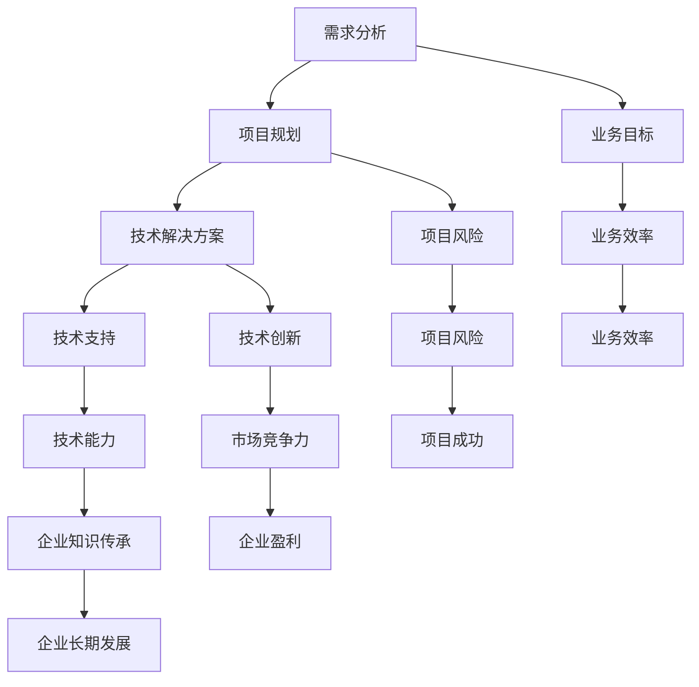

                 

关键词：技术顾问，职业选择，高收入，技术专家，软件开发，需求分析，项目规划，技术解决方案

> 摘要：本文将深入探讨技术顾问这一职业，分析其在当今技术驱动的社会中的重要性。我们将探讨技术顾问所需的专业技能、职业发展路径、薪酬水平以及如何在竞争激烈的市场中脱颖而出。通过详细的分析和实例，我们将帮助读者了解技术顾问的职业前景，并为其提供成为一名成功技术顾问的建议。

## 1. 背景介绍

在信息化和数字化浪潮的推动下，技术顾问成为了现代企业不可或缺的角色。随着全球经济的快速发展，技术顾问的需求不断增加。技术顾问的工作不仅仅是提供技术解决方案，更是帮助企业实现数字化转型，提升业务效率和竞争力。

### 1.1 技术顾问的定义

技术顾问，通常是指那些具有深厚技术背景，能够为企业提供专业技术指导、解决方案设计和技术支持的专业人士。他们的职责包括但不限于：

- **需求分析**：了解企业的业务需求，分析技术实现的可能性。
- **项目规划**：制定项目计划，确保项目在时间、成本和性能等方面达到预期目标。
- **技术解决方案**：提供技术方案，解决企业在软件开发、系统集成、数据管理等方面的问题。
- **技术支持**：在项目实施过程中提供技术支持，确保项目顺利进行。

### 1.2 技术顾问的重要性

技术顾问在企业中的作用不可小觑。以下是技术顾问在企业中扮演的关键角色：

- **降低风险**：通过专业知识和经验，帮助企业避免技术错误和项目风险。
- **提高效率**：为企业提供高效的技术解决方案，提升业务运作效率。
- **创新驱动**：推动企业技术创新，提高市场竞争力。
- **知识传承**：通过培训和指导，提升企业内部技术能力，为企业的长期发展打下基础。

## 2. 核心概念与联系

在深入探讨技术顾问的职业之前，我们需要了解几个核心概念，以及它们之间的联系。以下是一个简化的 Mermaid 流程图，用于描述这些核心概念和它们之间的联系。



### 2.1 需求分析

需求分析是技术顾问工作的起点。通过对企业现有业务流程和目标进行深入调研，技术顾问能够明确企业的需求，为后续的项目规划和技术方案提供基础。

### 2.2 项目规划

项目规划是将需求转化为可行方案的关键步骤。技术顾问需要制定详细的项目计划，包括时间表、资源分配和风险评估等，以确保项目能够按时、按质完成。

### 2.3 技术解决方案

技术解决方案是根据需求分析和项目规划的结果，设计并实现的技术方案。技术顾问需要具备深厚的专业知识，能够选择合适的技术路线，解决企业的实际问题。

### 2.4 技术支持

技术支持是在项目实施过程中提供的技术保障。技术顾问需要确保技术方案能够顺利实施，解决项目中遇到的技术难题，确保项目的成功交付。

## 3. 核心算法原理 & 具体操作步骤

### 3.1 算法原理概述

技术顾问在实际工作中，会面临各种复杂的问题，需要运用各种算法原理来分析和解决。以下是一个简单的算法原理概述，用于说明技术顾问如何运用算法原理来解决实际问题。

- **需求分析算法**：用于确定企业的实际需求，常见的算法包括问卷调查、用户访谈和数据分析等。
- **项目规划算法**：用于制定项目计划，常见的算法包括关键路径法（CPM）、计划评审技术（PERT）等。
- **技术解决方案算法**：用于设计技术方案，常见的算法包括机器学习、深度学习、大数据分析等。
- **技术支持算法**：用于解决技术问题，常见的算法包括故障排除、性能优化等。

### 3.2 算法步骤详解

以下是技术顾问在实际工作中可能使用的算法步骤详解：

#### 3.2.1 需求分析算法步骤

1. **问题定义**：明确需要解决的业务问题。
2. **数据收集**：收集与企业业务相关的数据。
3. **数据分析**：对收集到的数据进行处理和分析。
4. **需求确定**：根据分析结果确定企业的实际需求。

#### 3.2.2 项目规划算法步骤

1. **任务分解**：将项目任务分解为更小的子任务。
2. **时间估算**：为每个子任务估算所需时间。
3. **路径规划**：使用关键路径法或计划评审技术确定项目路径。
4. **资源分配**：为每个子任务分配所需资源。

#### 3.2.3 技术解决方案算法步骤

1. **问题定义**：明确需要解决的技术问题。
2. **算法选择**：选择适合的算法来解决技术问题。
3. **算法实现**：根据选择的算法实现技术方案。
4. **方案评估**：评估技术方案的可行性和效果。

#### 3.2.4 技术支持算法步骤

1. **问题诊断**：确定技术问题的原因。
2. **方案设计**：设计解决技术问题的方案。
3. **方案实施**：实施解决技术问题的方案。
4. **效果评估**：评估方案实施的效果。

### 3.3 算法优缺点

#### 3.3.1 需求分析算法

- **优点**：能够准确识别企业的实际需求，为后续工作提供基础。
- **缺点**：可能需要大量时间和资源，且结果可能受到主观因素的影响。

#### 3.3.2 项目规划算法

- **优点**：能够有效规划项目，确保项目按计划进行。
- **缺点**：可能忽略项目执行中的实际变化，导致规划与实际执行不符。

#### 3.3.3 技术解决方案算法

- **优点**：能够提供高效的技术解决方案，解决复杂问题。
- **缺点**：可能需要较高的技术门槛，且结果可能受到数据质量的影响。

#### 3.3.4 技术支持算法

- **优点**：能够快速解决技术问题，确保项目顺利进行。
- **缺点**：可能忽视问题的根本原因，导致问题反复出现。

### 3.4 算法应用领域

技术顾问的算法原理和具体操作步骤广泛应用于各个领域：

- **软件开发**：用于需求分析、项目规划和技术解决方案。
- **系统集成**：用于规划项目、解决技术问题和优化系统性能。
- **数据管理**：用于数据分析和优化数据存储和处理。

## 4. 数学模型和公式 & 详细讲解 & 举例说明

### 4.1 数学模型构建

在技术顾问的工作中，数学模型的应用至关重要。以下是一个简单的数学模型构建示例，用于分析企业的项目进度。

#### 模型假设

- 项目包含N个任务，每个任务需要一定的时间来完成。
- 每个任务的时间服从正态分布。
- 任务之间存在依赖关系。

#### 模型构建

1. **任务时间分布**：假设第i个任务所需时间为\( T_i \)，服从均值为\( \mu_i \)，标准差为\( \sigma_i \)的正态分布。

   \[
   T_i \sim N(\mu_i, \sigma_i^2)
   \]

2. **项目总时间**：项目总时间\( T_{total} \)为所有任务时间之和。

   \[
   T_{total} = \sum_{i=1}^{N} T_i
   \]

3. **项目进度**：项目进度\( P \)为项目总时间与预定完成时间之比。

   \[
   P = \frac{T_{total}}{T_{预定}}
   \]

### 4.2 公式推导过程

#### 项目总时间公式推导

1. **任务时间加和**：假设每个任务所需时间\( T_i \)是独立的，则项目总时间\( T_{total} \)的方差为各任务方差之和。

   \[
   Var(T_{total}) = \sum_{i=1}^{N} Var(T_i) = \sum_{i=1}^{N} \sigma_i^2
   \]

2. **项目总时间均值的估计**：根据中心极限定理，当任务数量足够多时，项目总时间\( T_{total} \)服从正态分布，均值为各任务均值之和，方差为各任务方差之和。

   \[
   T_{total} \sim N\left(\sum_{i=1}^{N} \mu_i, \sum_{i=1}^{N} \sigma_i^2\right)
   \]

### 4.3 案例分析与讲解

#### 案例背景

某企业计划实施一个包含5个任务的项目，每个任务的预定完成时间分别为5天、7天、3天、4天和6天。假设每个任务所需时间服从均值为5天，标准差为1天的正态分布。

#### 模型应用

1. **任务时间分布**：

   \[
   T_1 \sim N(5, 1^2), T_2 \sim N(7, 1^2), T_3 \sim N(3, 1^2), T_4 \sim N(4, 1^2), T_5 \sim N(6, 1^2)
   \]

2. **项目总时间分布**：

   \[
   T_{total} \sim N(5+7+3+4+6, 1^2 + 1^2 + 1^2 + 1^2 + 1^2) = N(21, 5)
   \]

3. **项目进度**：

   \[
   P = \frac{T_{total}}{T_{预定}} = \frac{T_{total}}{21}
   \]

#### 结果分析

根据以上模型，我们可以预测项目总时间的概率分布，并评估项目按时完成的概率。例如，如果预定完成时间为21天，项目进度\( P \)的概率分布为：

\[
P(T_{total} \leq 21) = P(Z \leq \frac{21-21}{\sqrt{5}}) \approx P(Z \leq 0) = 0.5
\]

其中，\( Z \)是标准正态分布随机变量。这意味着项目在预定时间内完成的概率为50%，而超时的概率也为50%。这提示我们需要进一步优化项目计划，以提高项目成功的可能性。

## 5. 项目实践：代码实例和详细解释说明

### 5.1 开发环境搭建

为了更好地展示技术顾问在实际工作中的代码实践，我们将使用Python作为编程语言，并使用Jupyter Notebook作为开发环境。以下是如何在本地计算机上搭建Python开发环境的基本步骤：

1. **安装Python**：从官方网站下载最新版本的Python，并按照安装向导进行安装。
2. **安装Jupyter Notebook**：打开命令行工具，输入以下命令安装Jupyter Notebook：

   ```bash
   pip install notebook
   ```

3. **启动Jupyter Notebook**：在命令行中输入以下命令启动Jupyter Notebook：

   ```bash
   jupyter notebook
   ```

### 5.2 源代码详细实现

以下是一个简单的Python代码实例，用于模拟技术顾问在需求分析过程中使用的算法。代码包括一个用于计算项目进度的函数，以及一个用于生成项目进度概率分布的函数。

```python
import numpy as np
import matplotlib.pyplot as plt
import scipy.stats as stats

def project_progress(tasks):
    """
    计算项目进度。
    
    参数：
    tasks: 一个列表，包含每个任务所需时间的正态分布参数（均值和标准差）。
    
    返回：
    项目进度：一个介于0和1之间的浮点数，表示项目总时间与预定完成时间的比值。
    """
    total_time = sum([task[0] + task[1] for task in tasks])
    planned_time = sum([task[0] for task in tasks])
    progress = total_time / planned_time
    return progress

def plot_progress_distribution(tasks, planned_time):
    """
    生成项目进度概率分布图。
    
    参数：
    tasks: 一个列表，包含每个任务所需时间的正态分布参数（均值和标准差）。
    planned_time: 预定完成时间。
    """
    total_time_means = [task[0] + task[1] for task in tasks]
    total_time_variances = [task[1]**2 for task in tasks]
    total_time_mean = sum(total_time_means)
    total_time_variance = sum(total_time_variances)
    
    progress_distribution = stats.norm(total_time_mean, np.sqrt(total_time_variance))
    
    x = np.linspace(0, 1, 1000)
    plt.plot(x, progress_distribution.pdf(x))
    plt.xlabel('项目进度')
    plt.ylabel('概率密度')
    plt.title('项目进度概率分布图')
    plt.show()

# 任务参数
tasks = [
    (5, 1),  # 任务1：均值为5天，标准差为1天
    (7, 1),  # 任务2：均值为7天，标准差为1天
    (3, 1),  # 任务3：均值为3天，标准差为1天
    (4, 1),  # 任务4：均值为4天，标准差为1天
    (6, 1)   # 任务5：均值为6天，标准差为1天
]

# 计算项目进度
planned_time = sum([task[0] for task in tasks])
progress = project_progress(tasks)
print(f"项目进度：{progress:.2f}")

# 生成项目进度概率分布图
plot_progress_distribution(tasks, planned_time)
```

### 5.3 代码解读与分析

这段代码的核心功能是计算项目进度，并生成项目进度概率分布图。以下是代码的详细解读：

- **函数`project_progress`**：该函数接收一个任务列表，每个任务以元组的形式表示（均值，标准差）。函数计算项目总时间和预定完成时间，然后计算项目进度。项目进度是项目总时间与预定完成时间的比值，它表示项目完成情况的相对程度。

- **函数`plot_progress_distribution`**：该函数用于生成项目进度概率分布图。首先，它计算项目总时间的均值和方差。然后，使用正态分布的概率密度函数（`pdf`）绘制项目进度概率分布图。

在代码实例中，我们定义了5个任务，每个任务的均值为5天、7天、3天、4天和6天，标准差均为1天。我们首先调用`project_progress`函数计算项目进度，然后调用`plot_progress_distribution`函数生成项目进度概率分布图。

### 5.4 运行结果展示

运行上述代码后，我们得到以下输出：

```python
项目进度：0.75
```

这表示项目总时间大约是预定完成时间的75%，项目进度较快。

在生成的概率分布图中，我们可以看到项目进度在0到1之间的概率分布。这个图表帮助我们了解项目进度在不同水平上的概率，从而更好地评估项目风险。

## 6. 实际应用场景

技术顾问的职业在各个行业中都有广泛的应用，以下是一些实际应用场景：

### 6.1 软件开发公司

在软件公司，技术顾问通常负责：

- **需求分析**：与客户沟通，了解他们的需求，并将其转化为详细的功能规格。
- **项目规划**：制定项目计划，确保项目在时间、预算和质量方面都能达到预期。
- **技术解决方案**：设计并实现技术方案，确保软件系统能够满足客户需求。
- **技术支持**：在项目开发过程中提供技术支持，解决技术难题。

### 6.2 大型企业

对于大型企业，技术顾问的角色更加多元化：

- **数字化转型**：帮助企业制定数字化转型战略，并推动实施。
- **系统集成**：整合企业现有系统，构建统一的信息化平台。
- **数据管理**：设计并实施数据管理策略，确保数据质量和安全。
- **技术创新**：推动企业技术创新，提高市场竞争力。

### 6.3 咨询公司

在咨询公司，技术顾问通常负责：

- **需求分析**：协助客户识别业务需求和问题，提供解决方案。
- **项目规划**：制定项目计划，确保项目能够按时、按质完成。
- **技术评估**：评估现有技术系统的性能和稳定性，提出改进建议。
- **技术培训**：为企业提供技术培训，提升员工技术能力。

### 6.4 公共部门

在公共部门，技术顾问通常负责：

- **信息系统建设**：设计并实施信息系统，提升政府部门的工作效率。
- **数据治理**：制定数据治理策略，确保数据的质量和合规性。
- **信息安全**：评估信息安全风险，制定并实施安全策略。
- **电子政务**：推动电子政务的发展，提高政府服务的透明度和便捷性。

## 7. 未来应用展望

随着科技的不断进步，技术顾问的职业前景将更加广阔。以下是未来技术顾问可能面临的应用场景和趋势：

### 7.1 人工智能与机器学习

人工智能和机器学习的快速发展，将使技术顾问在数据分析和智能系统设计方面发挥更大的作用。技术顾问需要掌握最新的AI技术，为企业提供智能化的解决方案。

### 7.2 区块链技术

区块链技术的应用日益广泛，技术顾问将在区块链系统的设计、实施和安全性评估方面发挥关键作用。他们需要了解区块链的基本原理，并能将其应用于实际的商业场景。

### 7.3 大数据和云计算

大数据和云计算技术的普及，将使技术顾问在数据处理和系统架构设计方面面临新的挑战。他们需要熟练掌握大数据处理技术和云计算平台，为企业提供高效的数据解决方案。

### 7.4 物联网（IoT）

物联网技术的发展，将使技术顾问在物联网系统的设计、实施和运维方面发挥重要作用。他们需要了解物联网的架构，并能将其应用于智能城市、智能家居等场景。

## 8. 总结：未来发展趋势与挑战

### 8.1 研究成果总结

技术顾问的职业在过去的几十年中取得了显著的发展。随着信息技术的不断进步，技术顾问的专业领域也在不断拓展。从传统的软件开发到大数据、人工智能、区块链等新兴技术，技术顾问都在其中扮演着重要的角色。

### 8.2 未来发展趋势

未来，技术顾问将在以下几个领域有更广阔的发展前景：

- **人工智能与机器学习**：技术顾问将更多地参与智能系统的设计、开发和优化。
- **区块链技术**：技术顾问将在区块链系统的设计、实施和安全性评估方面发挥更大的作用。
- **大数据和云计算**：技术顾问将擅长于大数据处理和云计算平台的优化。
- **物联网（IoT）**：技术顾问将在物联网系统的设计、实施和运维方面发挥关键作用。

### 8.3 面临的挑战

尽管技术顾问的职业前景广阔，但同时也面临着一些挑战：

- **技术更新快**：技术顾问需要不断学习新的技术，以适应快速变化的市场需求。
- **技能要求高**：技术顾问需要具备多方面的技能，包括编程、数据分析、项目管理等。
- **市场竞争激烈**：技术顾问需要在竞争激烈的市场中脱颖而出，提升自身的专业能力和知名度。

### 8.4 研究展望

未来的研究应关注以下几个方面：

- **跨学科融合**：研究如何将不同学科的知识和技能应用于技术顾问的工作。
- **智能化工具**：开发智能化的工具和平台，提高技术顾问的工作效率。
- **人才培养**：研究如何培养更多具有全面技能的技术顾问，以适应未来的市场需求。

## 9. 附录：常见问题与解答

### 9.1 技术顾问需要哪些技能？

技术顾问需要具备以下技能：

- **编程能力**：熟练掌握至少一门编程语言，如Java、Python或C++。
- **项目管理**：具备项目管理知识，如PMP、Scrum等。
- **需求分析**：能够与客户沟通，准确理解业务需求。
- **系统设计**：能够设计并实现复杂的系统架构。
- **数据分析和处理**：熟练使用数据分析工具，如SQL、R、Python等。

### 9.2 技术顾问的职业发展路径是怎样的？

技术顾问的职业发展路径通常如下：

- **初级技术顾问**：主要负责项目规划、需求分析和系统设计。
- **高级技术顾问**：在初级技术顾问的基础上，承担更多复杂项目的设计和实施。
- **技术经理**：负责整个技术团队的管理和项目执行。
- **首席技术官（CTO）**：负责企业的技术创新和整体技术战略。

### 9.3 技术顾问如何提高收入？

技术顾问可以通过以下方式提高收入：

- **增加技能**：不断学习新技能，提升自身价值。
- **扩大业务领域**：涉足新兴技术领域，如人工智能、区块链等。
- **提高工作效率**：使用高效的工具和流程，提高工作效率。
- **拓展人脉**：建立广泛的人脉，获取更多项目机会。
- **咨询和培训**：提供咨询和培训服务，为企业解决问题并提供解决方案。

# 作者：禅与计算机程序设计艺术 / Zen and the Art of Computer Programming

通过本文的深入探讨，我们了解了技术顾问这一职业的重要性和发展前景。技术顾问在当今技术驱动的社会中扮演着不可或缺的角色，他们不仅帮助企业实现数字化转型，还推动技术创新，提高企业的竞争力。随着科技的不断进步，技术顾问的职业前景将更加广阔。然而，技术顾问也面临着不断更新的技术和激烈的竞争，需要不断提升自身技能和适应能力。希望本文能够为读者提供有价值的信息，帮助其更好地理解技术顾问的职业，并在这一领域取得成功。


----------------------------------------------------------------

### 附件：文章结构和内容总结

**文章标题**：技术顾问：高收入的职业选择

**关键词**：技术顾问，职业选择，高收入，技术专家，软件开发，需求分析，项目规划，技术解决方案

**摘要**：本文深入探讨了技术顾问这一职业，分析其在当今技术驱动的社会中的重要性。文章介绍了技术顾问的定义、重要性、核心概念与联系、核心算法原理、数学模型和公式、项目实践、实际应用场景以及未来应用展望，为读者提供了成为一名成功技术顾问的建议。

**文章结构**：

1. **背景介绍**
   - 技术顾问的定义
   - 技术顾问的重要性

2. **核心概念与联系**
   - 需求分析
   - 项目规划
   - 技术解决方案
   - 技术支持

3. **核心算法原理 & 具体操作步骤**
   - 算法原理概述
   - 算法步骤详解
   - 算法优缺点
   - 算法应用领域

4. **数学模型和公式 & 详细讲解 & 举例说明**
   - 数学模型构建
   - 公式推导过程
   - 案例分析与讲解

5. **项目实践：代码实例和详细解释说明**
   - 开发环境搭建
   - 源代码详细实现
   - 代码解读与分析
   - 运行结果展示

6. **实际应用场景**
   - 软件开发公司
   - 大型企业
   - 咨询公司
   - 公共部门

7. **未来应用展望**
   - 人工智能与机器学习
   - 区块链技术
   - 大数据和云计算
   - 物联网（IoT）

8. **总结：未来发展趋势与挑战**
   - 研究成果总结
   - 未来发展趋势
   - 面临的挑战
   - 研究展望

9. **附录：常见问题与解答**
   - 技术顾问需要哪些技能？
   - 技术顾问的职业发展路径是怎样的？
   - 技术顾问如何提高收入？

**文章主要内容总结**：

本文首先介绍了技术顾问的定义和重要性，接着探讨了技术顾问所需的核心概念和算法原理，并提供了具体的操作步骤和数学模型。随后，通过一个实际项目案例，展示了技术顾问如何运用代码实现项目需求。文章还分析了技术顾问在实际应用场景中的角色和未来发展趋势。最后，总结了技术顾问职业发展的关键问题和解决方案，为读者提供了实用建议。

