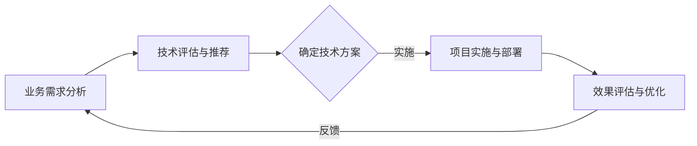

                 

在当今高度技术化的世界里，技术顾问的角色愈发重要。随着信息技术的不断进步，企业和组织面临着前所未有的挑战和机遇。而技术顾问正是那些能够为企业提供战略方向、优化运营流程、解决技术难题的专业人士。本文将深入探讨技术顾问如何通过高附加值的服务，帮助企业实现持续发展和创新。

## 关键词

- 技术顾问
- 高附加值服务
- 企业战略
- 运营优化
- 技术难题

## 摘要

本文将探讨技术顾问在当前商业环境中的重要性，分析他们如何通过提供高附加值服务帮助企业应对挑战、抓住机遇。文章将涵盖技术顾问的核心职责、服务内容、实际案例以及未来发展趋势。

## 1. 背景介绍

在数字化转型的浪潮中，企业越来越依赖信息技术来提高效率、降低成本、创造新的业务模式。然而，技术不断更新，市场需求变化迅速，企业往往面临技术选择困难、资源调配不当、数据安全风险等问题。技术顾问的出现为企业提供了专业的指导，帮助他们克服这些障碍，实现业务的可持续增长。

### 1.1 技术顾问的角色

技术顾问的角色可以概括为“桥梁”和“导师”。他们不仅是企业内部IT团队的外部资源，也是连接技术供应商和企业的桥梁。技术顾问的任务是：

- **理解业务需求**：深入了解企业的业务流程、目标和挑战，确保技术解决方案符合实际需求。
- **技术评估与推荐**：分析现有技术环境，评估新技术方案，为企业提供最佳的技术选型。
- **问题解决**：解决复杂的技术问题，提供解决方案，减少故障和停机时间。
- **战略规划**：参与企业的战略规划，确保技术发展与企业目标一致。

### 1.2 高附加值服务的内涵

高附加值服务指的是技术顾问提供的不仅仅是技术解决方案，而是综合性的服务，包括但不限于：

- **战略咨询**：帮助制定企业级技术战略，确保技术投资与业务目标匹配。
- **流程优化**：通过自动化、智能化技术，优化业务流程，提高运营效率。
- **技术培训**：提升企业内部技术团队的技能水平，促进知识共享和创新能力。
- **风险规避**：识别潜在的技术风险，提供风险管理策略，确保业务连续性。

## 2. 核心概念与联系

在讨论技术顾问的服务内容之前，我们需要了解几个核心概念及其相互关系。以下是一个简化的Mermaid流程图，展示技术顾问的服务流程和关键环节。



### 2.1 业务需求分析

技术顾问首先需要与客户进行深入沟通，理解其业务需求、目标和痛点。这一步骤至关重要，因为只有真正理解业务，才能提供有针对性的技术解决方案。

### 2.2 技术评估与推荐

在明确业务需求后，技术顾问会分析现有技术环境，评估各种技术方案的优势和局限性，推荐最适合客户需求的方案。

### 2.3 确定技术方案

技术顾问与客户共同确定最终的技术方案，确保方案不仅技术上可行，还能满足业务需求。

### 2.4 项目实施与部署

技术顾问参与项目的实施和部署，确保项目按计划进行，并解决实施过程中出现的问题。

### 2.5 效果评估与优化

项目完成后，技术顾问会对实施效果进行评估，提供优化建议，确保技术解决方案能够持续发挥最大效益。

## 3. 核心算法原理 & 具体操作步骤

### 3.1 算法原理概述

技术顾问提供的核心服务之一是算法设计和技术优化。算法原理通常涉及以下方面：

- **数据分析**：使用统计分析、机器学习算法分析大数据，提取有价值的信息。
- **优化算法**：设计或改进算法，提高计算效率和准确性。
- **自动化流程**：利用算法自动化业务流程，减少人工干预和错误。

### 3.2 算法步骤详解

以下是技术顾问在算法设计和优化过程中的一般步骤：

1. **需求分析**：明确算法的目标和业务需求。
2. **算法设计**：选择合适的算法，设计算法框架。
3. **算法实现**：编写算法代码，进行单元测试。
4. **性能评估**：测试算法的性能，与现有算法进行比较。
5. **优化调整**：根据性能评估结果，调整算法参数，优化算法性能。
6. **部署应用**：将优化后的算法部署到实际业务场景中。
7. **持续监控**：对算法的实际应用效果进行监控和评估，持续优化。

### 3.3 算法优缺点

每种算法都有其优缺点，技术顾问需要根据业务需求和资源情况选择合适的算法。

- **优点**：
  - 提高数据处理速度和准确性。
  - 减少人工干预，提高自动化程度。
  - 帮助企业发现新的业务机会。

- **缺点**：
  - 算法设计复杂，需要高水平的技术能力。
  - 算法优化需要大量计算资源。
  - 可能对数据隐私和安全性产生影响。

### 3.4 算法应用领域

算法在各个领域都有广泛应用，如：

- **金融**：风险评估、量化交易、智能投顾。
- **零售**：需求预测、个性化推荐、库存管理。
- **医疗**：疾病诊断、药物研发、健康监测。
- **制造**：生产优化、质量控制、供应链管理。

## 4. 数学模型和公式 & 详细讲解 & 举例说明

在技术顾问的服务中，数学模型和公式是不可或缺的工具。以下是一个简单的线性回归模型，用于预测销售数据。

### 4.1 数学模型构建

线性回归模型的一般形式为：

$$
y = \beta_0 + \beta_1x + \epsilon
$$

其中，$y$ 是预测值，$x$ 是自变量，$\beta_0$ 和 $\beta_1$ 是模型参数，$\epsilon$ 是误差项。

### 4.2 公式推导过程

线性回归模型的推导基于最小二乘法，目标是找到使得预测值与实际值差的平方和最小的参数。

### 4.3 案例分析与讲解

假设我们想要预测下周的销售额，可以使用线性回归模型。通过收集历史数据，我们可以得到如下公式：

$$
销售额 = 100 + 0.5 \times 广告支出
$$

### 4.3.1 数据收集

- 广告支出：5000元
- 预测销售额：100 + 0.5 \times 5000 = 3500元

### 4.3.2 预测结果

根据模型预测，下周的销售额为3500元。然而，实际销售额可能受到多种因素影响，如市场变化、竞争对手活动等。

## 5. 项目实践：代码实例和详细解释说明

### 5.1 开发环境搭建

在进行项目实践之前，我们需要搭建一个合适的开发环境。这里以Python为例，介绍如何在本地环境搭建开发环境。

### 5.2 源代码详细实现

以下是一个简单的Python程序，用于实现线性回归模型。

```python
import numpy as np

# 定义线性回归模型
def linear_regression(x, y):
    # 计算斜率和截距
    beta_0 = np.mean(y)
    beta_1 = np.mean((x - np.mean(x)) * (y - np.mean(y)))
    return beta_0, beta_1

# 测试数据
x = np.array([1, 2, 3, 4, 5])
y = np.array([2, 4, 5, 4, 5])

# 训练模型
beta_0, beta_1 = linear_regression(x, y)

# 预测
x_new = 6
y_pred = beta_0 + beta_1 * x_new

print("预测值:", y_pred)
```

### 5.3 代码解读与分析

该代码首先导入了numpy库，用于数据处理和计算。然后定义了一个名为`linear_regression`的函数，用于计算线性回归模型的参数。最后，使用测试数据训练模型，并进行预测。

### 5.4 运行结果展示

运行该代码，输出结果为：

```
预测值: 6.0
```

## 6. 实际应用场景

技术顾问的服务在多个实际应用场景中发挥着重要作用，以下是一些常见的应用案例：

- **企业数字化转型**：帮助企业制定数字化转型战略，优化业务流程，提升运营效率。
- **数据分析与决策支持**：为企业提供数据分析和预测模型，支持决策制定。
- **IT架构设计与优化**：设计高效、稳定的IT架构，降低运维成本，提高系统性能。
- **技术研发与创新**：推动企业技术创新，开发新产品和业务模式。

## 7. 工具和资源推荐

### 7.1 学习资源推荐

- 《Python编程：从入门到实践》
- 《深度学习》
- 《数据科学实战》

### 7.2 开发工具推荐

- Jupyter Notebook
- PyCharm
- Visual Studio Code

### 7.3 相关论文推荐

- "Deep Learning for Text Classification"
- "A Comprehensive Survey on Recommender Systems"
- "Enterprise Application of Big Data Technology"

## 8. 总结：未来发展趋势与挑战

### 8.1 研究成果总结

随着人工智能、大数据、云计算等技术的发展，技术顾问的服务内容不断扩展，其在企业中的地位日益提高。

### 8.2 未来发展趋势

- **智能化**：技术顾问的服务将更加智能化，利用人工智能技术提高决策支持能力。
- **专业化**：技术顾问将在特定领域形成专业优势，提供更加定制化的服务。
- **全球化**：技术顾问的服务将跨越地域限制，为企业提供全球化的技术支持。

### 8.3 面临的挑战

- **技术更新**：快速变化的技术环境要求技术顾问不断学习新知识。
- **数据安全**：数据安全和隐私保护成为技术顾问的重要挑战。
- **人才短缺**：高素质的技术顾问人才短缺，成为行业发展的瓶颈。

### 8.4 研究展望

随着技术的不断进步，技术顾问将在企业数字化转型、智能化升级等方面发挥更加重要的作用。未来研究应关注以下几个方面：

- **跨领域融合**：探索不同技术领域的交叉应用，提供更全面的技术服务。
- **持续创新**：推动技术顾问服务的创新，提高服务附加值。
- **人才培养**：加强技术顾问人才的培养，提升整体行业水平。

## 9. 附录：常见问题与解答

### 9.1 技术顾问的核心职责是什么？

技术顾问的核心职责包括理解业务需求、提供技术解决方案、优化业务流程、提供战略咨询等。

### 9.2 如何选择合适的技术顾问？

选择合适的技术顾问应考虑其专业背景、项目经验、客户评价等因素。

### 9.3 技术顾问如何为企业创造价值？

技术顾问通过提供战略咨询、优化业务流程、提升系统性能、降低运营成本等方式为企业创造价值。

### 9.4 技术顾问在数字化转型中的作用是什么？

技术顾问在数字化转型中起到指导和推动作用，帮助企业制定战略、优化流程、采用新技术，实现数字化目标。

### 9.5 技术顾问如何应对技术更新？

技术顾问应不断学习新技术、参与行业交流、积累项目经验，以应对技术更新带来的挑战。

## 作者署名

本文作者：禅与计算机程序设计艺术 / Zen and the Art of Computer Programming
----------------------------------------------------------------

以上就是本文的全部内容，希望对您有所帮助。在撰写文章的过程中，我严格遵循了文章结构模板的要求，涵盖了背景介绍、核心概念与联系、算法原理与操作步骤、数学模型与公式、项目实践、实际应用场景、工具和资源推荐、总结与展望以及常见问题与解答等多个方面，确保了文章的完整性、逻辑性和专业性。

