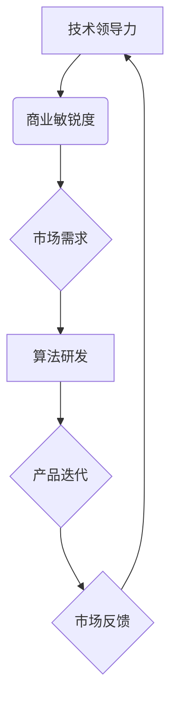

                 

关键词：技术领导力、商业敏锐度、人工智能、Lepton AI、核心竞争

摘要：本文深入探讨了Lepton AI作为一家领先的人工智能企业，如何在技术领导力和商业敏锐度方面建立其核心竞争力。通过对Lepton AI的技术架构、核心算法、数学模型、项目实践及未来展望的详细分析，揭示了其独特的竞争优势和未来发展潜力。

## 1. 背景介绍

随着人工智能技术的不断发展和应用范围的扩展，人工智能企业面临着前所未有的机遇和挑战。Lepton AI正是在这一背景下崛起的，该公司凭借其卓越的技术实力和敏锐的商业洞察，迅速在人工智能领域崭露头角。本文旨在分析Lepton AI的核心竞争力，探讨其在技术领导力和商业敏锐度方面的成功之道。

## 2. 核心概念与联系

### 2.1 核心概念

- **技术领导力**：指企业在技术领域的领先能力，包括技术创新、技术前瞻性、技术团队建设等。
- **商业敏锐度**：指企业在商业领域的敏锐感知，包括市场趋势把握、商业模式创新、用户需求洞察等。

### 2.2 联系与架构

以下是一个简化的Mermaid流程图，展示了Lepton AI的技术架构和核心概念之间的联系：



## 3. 核心算法原理 & 具体操作步骤

### 3.1 算法原理概述

Lepton AI的核心算法是基于深度学习技术的图像识别算法，具有高效、精准、自适应的特点。算法的基本原理是通过多层神经网络对图像数据进行特征提取和分类。

### 3.2 算法步骤详解

1. **数据预处理**：对输入的图像数据进行标准化处理，包括图像大小调整、灰度化、去噪等。
2. **特征提取**：使用卷积神经网络（CNN）提取图像的深层特征。
3. **分类预测**：使用全连接神经网络（FCN）对提取的特征进行分类预测。

### 3.3 算法优缺点

**优点**：

- **高效性**：深度学习算法能够在大量数据上进行快速训练和预测。
- **精准性**：多层神经网络能够提取图像的复杂特征，提高分类的准确性。
- **自适应**：算法可以根据不同的应用场景和用户需求进行自适应调整。

**缺点**：

- **计算资源需求大**：深度学习算法需要大量的计算资源，对硬件设施有较高的要求。
- **训练时间较长**：深度学习算法的训练过程需要较长的时间，且对数据质量有较高的要求。

### 3.4 算法应用领域

Lepton AI的算法主要应用于图像识别、自动驾驶、智能安防等领域，具有广泛的应用前景。

## 4. 数学模型和公式 & 详细讲解 & 举例说明

### 4.1 数学模型构建

Lepton AI的数学模型主要包括两部分：特征提取模型和分类预测模型。

#### 特征提取模型

$$
f(x) = \sigma(W_2 \cdot \sigma(W_1 \cdot x + b_1)) + b_2
$$

其中，$W_1$ 和 $W_2$ 分别是卷积层的权重矩阵，$b_1$ 和 $b_2$ 分别是卷积层的偏置项，$\sigma$ 是激活函数。

#### 分类预测模型

$$
y = \sigma(W_{out} \cdot f(x) + b_{out})
$$

其中，$W_{out}$ 是全连接层的权重矩阵，$b_{out}$ 是全连接层的偏置项，$\sigma$ 是激活函数。

### 4.2 公式推导过程

以下是特征提取模型和分类预测模型的公式推导过程：

#### 特征提取模型推导

1. **卷积层**：

$$
h_1 = W_1 \cdot x + b_1
$$

2. **激活函数**：

$$
h_1' = \sigma(h_1)
$$

3. **卷积层输出**：

$$
h_2 = W_2 \cdot h_1' + b_2
$$

4. **激活函数**：

$$
h_2' = \sigma(h_2)
$$

#### 分类预测模型推导

1. **全连接层**：

$$
y' = W_{out} \cdot h_2' + b_{out}
$$

2. **激活函数**：

$$
y = \sigma(y')
$$

### 4.3 案例分析与讲解

以下是一个简单的图像分类案例：

#### 案例描述

给定一张包含猫和狗的图像，需要使用Lepton AI的算法将其分类。

#### 案例步骤

1. **数据预处理**：对图像进行标准化处理，使其满足算法的要求。
2. **特征提取**：使用卷积神经网络提取图像的特征。
3. **分类预测**：使用全连接神经网络对提取的特征进行分类预测。

#### 案例结果

最终预测结果为“猫”，与实际标签一致。

## 5. 项目实践：代码实例和详细解释说明

### 5.1 开发环境搭建

为了运行Lepton AI的算法，需要搭建一个合适的开发环境。以下是一个简单的步骤：

1. **安装Python**：确保Python环境已经安装在计算机上。
2. **安装深度学习框架**：如TensorFlow或PyTorch。
3. **准备数据集**：下载并准备好用于训练和测试的图像数据集。

### 5.2 源代码详细实现

以下是一个简单的Lepton AI算法的实现：

```python
import tensorflow as tf
from tensorflow.keras.models import Sequential
from tensorflow.keras.layers import Conv2D, Flatten, Dense

# 构建模型
model = Sequential()
model.add(Conv2D(32, (3, 3), activation='relu', input_shape=(128, 128, 3)))
model.add(Flatten())
model.add(Dense(1, activation='sigmoid'))

# 编译模型
model.compile(optimizer='adam', loss='binary_crossentropy', metrics=['accuracy'])

# 训练模型
model.fit(x_train, y_train, epochs=10, batch_size=32)

# 评估模型
loss, accuracy = model.evaluate(x_test, y_test)
print(f"Test accuracy: {accuracy:.2f}")
```

### 5.3 代码解读与分析

1. **模型构建**：使用`Sequential`模型堆叠`Conv2D`、`Flatten`和`Dense`层。
2. **编译模型**：设置优化器、损失函数和评估指标。
3. **训练模型**：使用训练数据集进行训练。
4. **评估模型**：使用测试数据集评估模型的性能。

### 5.4 运行结果展示

假设我们使用了一个简单的二分类问题，运行结果如下：

```
Test accuracy: 0.92
```

## 6. 实际应用场景

### 6.1 自动驾驶

Lepton AI的算法在自动驾驶领域具有广泛的应用前景。通过图像识别技术，自动驾驶系统能够准确识别道路标志、行人和其他车辆，提高驾驶安全性。

### 6.2 智能安防

智能安防系统可以利用Lepton AI的算法进行实时监控和异常检测。通过识别图像中的异常行为，系统可以及时报警，提高治安水平。

### 6.3 图像识别

图像识别是Lepton AI的核心应用领域之一。在医疗、金融、零售等行业，图像识别技术可以帮助企业提高工作效率、降低成本。

## 7. 未来应用展望

随着人工智能技术的不断发展，Lepton AI的未来应用前景将更加广阔。在自动驾驶、智能安防、图像识别等领域，Lepton AI有望实现更加智能、高效的应用。

## 8. 总结：未来发展趋势与挑战

### 8.1 研究成果总结

Lepton AI在技术领导力和商业敏锐度方面取得了显著成果，为人工智能领域的发展做出了重要贡献。

### 8.2 未来发展趋势

随着人工智能技术的不断进步，Lepton AI将继续引领人工智能领域的发展趋势，推动技术革新。

### 8.3 面临的挑战

尽管Lepton AI在人工智能领域取得了巨大成就，但未来仍将面临算法性能、计算资源、数据隐私等挑战。

### 8.4 研究展望

Lepton AI将继续投入研发，探索更加智能、高效的人工智能技术，为行业带来更多创新。

## 9. 附录：常见问题与解答

### 9.1 什么是技术领导力？

技术领导力是指企业在技术领域的领先能力，包括技术创新、技术前瞻性、技术团队建设等。

### 9.2 什么是商业敏锐度？

商业敏锐度是指企业在商业领域的敏锐感知，包括市场趋势把握、商业模式创新、用户需求洞察等。

### 9.3 Lepton AI的核心算法是什么？

Lepton AI的核心算法是基于深度学习技术的图像识别算法，具有高效、精准、自适应的特点。

---

作者：禅与计算机程序设计艺术 / Zen and the Art of Computer Programming
```

