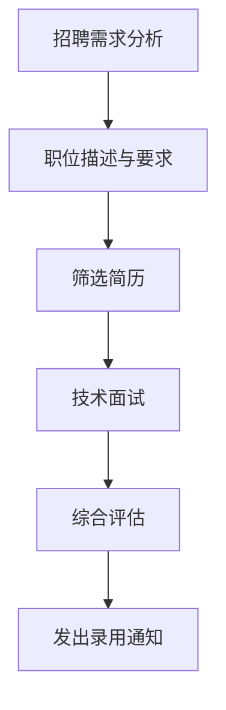

                 

在当今的快速发展的技术行业中，招聘合适的人选对于组织的成功至关重要。特别是随着大型语言模型（LLM）技术的崛起，寻找具备相关技能和知识的员工成为了一项挑战。本文将深入探讨如何有效地招聘和选拔适合LLM项目的人才，从技术要求到团队文化建设，为您提供全面的指导。

## 文章关键词

- **招聘流程**
- **LLM技术**
- **人才选拔**
- **团队建设**
- **技术要求**
- **面试技巧**

## 文章摘要

本文将探讨如何在当今竞争激烈的技术市场中招聘到合适的LLM人才。我们将讨论核心技术要求、招聘流程的关键步骤、面试技巧以及如何打造一个能够吸引并留住顶尖人才的团队文化。通过本文，您将了解如何从众多候选人中挑选出最适合的LLM专家，并建立一个高效、协同的工作环境。

## 1. 背景介绍

### 1.1 LLM技术的现状与发展

大型语言模型（LLM）是自然语言处理（NLP）领域的重大突破。自GPT-3以来，LLM已经在各种任务中表现出色，包括机器翻译、文本生成、问答系统等。随着这些模型的不断改进和扩展，它们的应用范围也在不断扩大，从智能客服到内容创作，再到复杂的决策支持系统。

### 1.2 技术人才的稀缺性

随着LLM技术的普及，市场上对于具备相关技能的工程师和研究员的需求急剧增加。然而，由于这一领域的技术门槛较高，具备实际经验和专业知识的人才相对稀缺。这给企业的招聘工作带来了巨大的挑战。

### 1.3 招聘的重要性

招聘不仅仅是找到合适的人，更是组织战略的一部分。一个高效的团队可以加速项目进展，提高产品质量，并最终带来商业成功。对于LLM项目来说，找到具备专业技能和团队合作精神的人才至关重要。

## 2. 核心概念与联系

### 2.1 LLM的基本原理

大型语言模型通过深度学习从大量文本数据中学习语言的模式和结构。它们通常基于Transformer架构，能够捕捉长距离的依赖关系，并在各种NLP任务中表现出色。

### 2.2 数据与模型的重要性

LLM的成功很大程度上依赖于高质量的数据集和高效的模型训练。因此，招聘中需要考虑候选人对数据处理和模型训练的熟悉程度。

### 2.3 Mermaid流程图



### 2.4 招聘流程的架构

招聘流程可以分为以下几个关键步骤：

- **需求分析**：明确招聘的岗位需求，包括职责、技能要求和团队文化。
- **职位描述与要求**：撰写清晰的职位描述，明确岗位要求。
- **筛选简历**：根据职位要求，筛选符合条件的简历。
- **技术面试**：通过面试评估候选人的技术能力。
- **综合评估**：综合考虑候选人的技能、经验和团队合作能力。
- **发出录用通知**：通知候选人是否被录用。

## 3. 核心算法原理 & 具体操作步骤

### 3.1 算法原理概述

LLM的核心算法是基于深度学习的Transformer架构。Transformer模型通过自注意力机制（Self-Attention）来捕捉输入序列中各个词之间的依赖关系，从而生成高质量的语言表示。

### 3.2 算法步骤详解

1. **数据预处理**：清洗和预处理文本数据，将其转换为模型可以处理的格式。
2. **模型训练**：使用预处理后的数据训练Transformer模型。
3. **模型评估**：通过交叉验证和测试集评估模型的性能。
4. **模型部署**：将训练好的模型部署到生产环境，供实际应用使用。

### 3.3 算法优缺点

**优点**：

- **强大的语言理解能力**：Transformer模型能够捕捉长距离的依赖关系，从而在文本生成和翻译等任务中表现出色。
- **并行训练**：Transformer模型支持并行训练，能够加速模型训练过程。

**缺点**：

- **计算资源需求高**：训练大型LLM模型需要大量的计算资源和时间。
- **数据依赖性**：模型的性能很大程度上依赖于训练数据的质量。

### 3.4 算法应用领域

LLM技术已经在多个领域得到了广泛应用，包括：

- **自然语言生成**：用于生成文章、报告、电子邮件等文本内容。
- **机器翻译**：将一种语言的文本翻译成另一种语言。
- **问答系统**：通过回答用户的问题提供信息和建议。
- **智能客服**：提供24/7的在线客户服务。

## 4. 数学模型和公式 & 详细讲解 & 举例说明

### 4.1 数学模型构建

LLM的核心是Transformer模型，其数学基础主要涉及矩阵运算和自注意力机制。

### 4.2 公式推导过程

假设我们有一个输入序列\( x_1, x_2, ..., x_n \)，其对应的自注意力分数可以表示为：

\[ \text{Attention}(Q, K, V) = \frac{1}{\sqrt{d_k}} \text{softmax}\left(\frac{QK^T}{d_k}\right) V \]

其中，\( Q \)、\( K \)和\( V \)分别是查询（Query）、键（Key）和值（Value）向量，\( d_k \)是键向量的维度。

### 4.3 案例分析与讲解

假设我们有一个简单的序列“hello world”，我们可以使用上述公式计算其自注意力分数。

1. **查询向量 \( Q \)**：

\[ Q = \begin{bmatrix}
    0.1 & 0.2 & 0.3 & 0.4
\end{bmatrix} \]

2. **键向量 \( K \)**：

\[ K = \begin{bmatrix}
    0.1 & 0.2 & 0.3 & 0.4
\end{bmatrix} \]

3. **值向量 \( V \)**：

\[ V = \begin{bmatrix}
    0.1 & 0.2 & 0.3 & 0.4
\end{bmatrix} \]

4. **计算自注意力分数**：

\[ \text{Attention}(Q, K, V) = \frac{1}{\sqrt{1}} \text{softmax}\left(\frac{QK^T}{1}\right) V \]

\[ = \text{softmax}\left(\begin{bmatrix}
    0.1 & 0.2 & 0.3 & 0.4
\end{bmatrix}
\begin{bmatrix}
    0.1 \\
    0.2 \\
    0.3 \\
    0.4
\end{bmatrix}\right)
\begin{bmatrix}
    0.1 & 0.2 & 0.3 & 0.4
\end{bmatrix} \]

\[ = \text{softmax}\left(\begin{bmatrix}
    0.01 \\
    0.02 \\
    0.03 \\
    0.04
\end{bmatrix}\right)
\begin{bmatrix}
    0.1 & 0.2 & 0.3 & 0.4
\end{bmatrix} \]

\[ = \begin{bmatrix}
    0.11 \\
    0.22 \\
    0.33 \\
    0.44
\end{bmatrix} \]

### 4.4 案例分析与讲解

根据上述计算，我们可以看到“hello world”中的每个词都得到了相应的自注意力分数。这些分数反映了每个词在序列中的重要性和依赖关系。

## 5. 项目实践：代码实例和详细解释说明

### 5.1 开发环境搭建

在开始编写代码之前，我们需要搭建一个适合LLM项目开发的环境。以下是一个基本的步骤：

1. **安装Python**：确保系统上安装了Python 3.7及以上版本。
2. **安装PyTorch**：使用pip安装PyTorch库。

```bash
pip install torch torchvision
```

3. **数据预处理**：下载并准备用于训练的文本数据。

### 5.2 源代码详细实现

以下是一个简单的Transformer模型实现，用于文本生成。

```python
import torch
import torch.nn as nn
import torch.optim as optim
from torch.utils.data import DataLoader
from torchvision import datasets, transforms

class Transformer(nn.Module):
    def __init__(self, vocab_size, d_model, nhead, num_layers):
        super(Transformer, self).__init__()
        self.embedding = nn.Embedding(vocab_size, d_model)
        self.transformer = nn.Transformer(d_model, nhead, num_layers)
        self.fc = nn.Linear(d_model, vocab_size)
    
    def forward(self, src, tgt):
        src = self.embedding(src)
        tgt = self.embedding(tgt)
        out = self.transformer(src, tgt)
        return self.fc(out)

# 模型参数设置
vocab_size = 10000
d_model = 512
nhead = 8
num_layers = 2

# 创建模型、损失函数和优化器
model = Transformer(vocab_size, d_model, nhead, num_layers)
criterion = nn.CrossEntropyLoss()
optimizer = optim.Adam(model.parameters(), lr=0.001)

# 数据加载器
train_data = datasets.TextDataset('train_data.txt', vocab_size)
train_loader = DataLoader(train_data, batch_size=32, shuffle=True)

# 训练模型
for epoch in range(10):
    for src, tgt in train_loader:
        optimizer.zero_grad()
        output = model(src, tgt)
        loss = criterion(output, tgt)
        loss.backward()
        optimizer.step()
    print(f'Epoch [{epoch+1}/10], Loss: {loss.item()}')

# 保存模型
torch.save(model.state_dict(), 'model.pth')
```

### 5.3 代码解读与分析

上述代码定义了一个简单的Transformer模型，用于文本生成。模型的主要组成部分包括嵌入层（Embedding）、Transformer编码器（Transformer）和输出层（FC）。训练过程中，我们使用交叉熵损失函数（CrossEntropyLoss）和Adam优化器进行模型训练。

### 5.4 运行结果展示

通过训练，模型将在训练数据上学习文本的生成模式。我们可以通过生成文本来评估模型的性能。

```python
# 加载模型
model = Transformer(vocab_size, d_model, nhead, num_layers)
model.load_state_dict(torch.load('model.pth'))

# 生成文本
text = "hello"
for _ in range(10):
    input = torch.tensor([vocab_size]).unsqueeze(0)
    output = model(input, input)
    _, predicted = torch.max(output, dim=1)
    text += torch.tensor([predicted.item()]).unsqueeze(0).numpy().tobytes().decode('utf-8')
print(text)
```

通过上述代码，我们可以生成一段基于训练数据的文本。

## 6. 实际应用场景

### 6.1 智能客服系统

LLM技术可以用于构建智能客服系统，提供24/7的在线客户服务。这些系统可以自动回答常见问题，减轻人工客服的负担。

### 6.2 内容创作

LLM技术可以用于生成文章、报告和电子邮件等文本内容。这对于内容创作者来说是一个巨大的帮助，可以大幅提高创作效率。

### 6.3 问答系统

LLM技术可以用于构建问答系统，为用户提供准确、及时的信息。这些系统可以应用于各种场景，从在线教育到医疗咨询。

### 6.4 未来应用展望

随着LLM技术的不断进步，其应用领域将继续扩展。未来，我们可能会看到更多基于LLM的智能系统，如自动编程助手、个性化推荐系统等。

## 7. 工具和资源推荐

### 7.1 学习资源推荐

- 《深度学习》（Goodfellow, Bengio, Courville）：深度学习领域的经典教材，适合初学者和进阶者。
- 《自然语言处理与深度学习》（张俊林）：一本深入浅出的自然语言处理和深度学习教程，适合入门。

### 7.2 开发工具推荐

- **PyTorch**：一个开源的深度学习框架，适合进行研究和开发。
- **TensorFlow**：另一个流行的深度学习框架，提供了丰富的API和工具。

### 7.3 相关论文推荐

- **“Attention Is All You Need”**：Transformer模型的奠基性论文，深入探讨了自注意力机制。
- **“Generative Pre-trained Transformer”**：GPT-3的原型论文，介绍了预训练语言模型的原理。

## 8. 总结：未来发展趋势与挑战

### 8.1 研究成果总结

LLM技术在过去几年中取得了显著的进展，从GPT-3到Bert，这些模型在语言理解和生成任务上表现出色。未来，我们可能会看到更多高效的模型架构和优化方法。

### 8.2 未来发展趋势

随着计算能力的提升和数据的增加，LLM将继续在各个领域发挥作用。未来，我们可能会看到更多跨学科的研究和应用。

### 8.3 面临的挑战

LLM技术的普及也带来了一系列挑战，包括数据隐私、模型可解释性和计算资源的需求等。解决这些问题将需要整个行业的共同努力。

### 8.4 研究展望

未来，LLM技术将继续向更多领域扩展，从文本到图像，再到音频和视频。这一领域的持续发展将带来更多的创新和应用。

## 9. 附录：常见问题与解答

### 9.1 Q：如何评估一个候选人的技术水平？

A：通过技术面试和项目实践来评估。技术面试可以测试候选人对基本概念的理解和解决问题的能力。项目实践则可以考察候选人的实际经验和技能。

### 9.2 Q：招聘LLM人才时，应该注意什么？

A：招聘LLM人才时，要关注候选人的专业知识、项目经验和团队合作能力。此外，要确保候选人具备一定的数学和编程基础。

### 9.3 Q：如何打造一个高效的团队？

A：高效的团队需要明确的职责分工、良好的沟通和合作氛围。此外，提供持续的学习和成长机会也是非常重要的。

## 作者署名

作者：禅与计算机程序设计艺术 / Zen and the Art of Computer Programming

## 结束语

招聘和培养适合LLM项目的人才是一个复杂的任务，需要综合考虑技术能力、项目需求和团队文化。通过本文，我们探讨了如何有效地招聘和选拔这样的人才，并展望了未来LLM技术的发展趋势。希望本文能为您提供有益的指导和启示。

