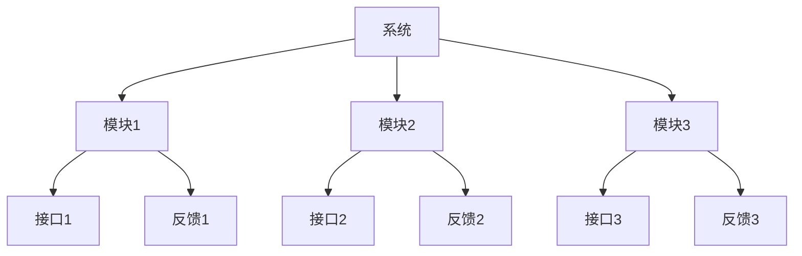

                 

在当今快速变化和高复杂度的技术行业中，体系思维成为了企业管理者不可或缺的技能。本文旨在探讨体系思维的重要性，以及如何将其应用于IT领域，从而提升管理效率、优化团队协作，并最终实现组织的目标。

## 关键词

- 体系思维
- 管理者
- IT领域
- 团队协作
- 复杂度管理

## 摘要

本文将首先介绍体系思维的定义和核心原则，然后通过具体的案例分析，阐述体系思维在IT管理中的应用。接着，我们将探讨如何构建和维护一个有效的体系思维框架，最后对体系思维的未来发展进行展望。

## 1. 背景介绍

在过去的几十年中，信息技术（IT）的发展日新月异。从早期的计算机到如今的云计算、大数据和人工智能，技术的进步不仅改变了我们的生活方式，也对企业管理模式提出了新的要求。管理者不仅需要具备技术领域的专业知识，还需要掌握如何管理和协调这些技术的应用。这种能力，我们称之为“体系思维”。

体系思维是一种综合性的思考方式，它要求管理者能够从整体上理解组织架构、流程、技术和人员之间的关系，并能够通过系统化的方法来优化这些关系，以实现组织的战略目标。

## 2. 核心概念与联系

为了更好地理解体系思维，我们需要首先明确几个核心概念，包括系统、模块、接口和反馈。

### 2.1 系统

系统是由多个相互关联的模块组成的整体，每个模块都承担特定的功能。在IT领域，系统可以是软件架构，也可以是硬件系统。例如，一个电子商务平台可以看作是一个系统，它由数据库、服务器、网络和前端应用等多个模块组成。

### 2.2 模块

模块是系统的基本组成部分，每个模块都独立完成特定的功能。在软件开发中，模块通常指的是函数或类。模块的独立性使得系统易于维护和扩展。

### 2.3 接口

接口是模块之间通信的桥梁，它定义了模块之间的交互方式和数据格式。在软件架构中，接口通常通过API（应用程序接口）来实现。

### 2.4 反馈

反馈是系统的重要组成部分，它使得系统能够根据外部环境的变化进行调整。在IT领域，反馈可以是用户反馈、市场调研数据或系统性能指标。

### 2.5 Mermaid 流程图

下面是一个简单的Mermaid流程图，用于展示系统、模块、接口和反馈之间的关系。



## 3. 核心算法原理 & 具体操作步骤

### 3.1 算法原理概述

体系思维的实现需要一系列核心算法的支持。这些算法包括系统建模、模块化设计、接口设计和反馈机制。下面简要介绍这些算法的基本原理。

### 3.2 算法步骤详解

#### 3.2.1 系统建模

系统建模的第一步是确定系统的目标和范围。接下来，使用UML（统一建模语言）或其他建模工具，将系统分解为多个模块，并定义每个模块的功能和接口。

#### 3.2.2 模块化设计

模块化设计的核心是将系统分解为多个独立的模块。每个模块都应该具有明确的功能和边界。模块之间的通信通过接口进行。

#### 3.2.3 接口设计

接口设计的关键是定义模块之间的交互方式和数据格式。良好的接口设计可以提高模块的独立性，降低系统的复杂性。

#### 3.2.4 反馈机制

反馈机制的设计是体系思维的核心。通过收集和分析反馈数据，系统可以不断调整和优化，以适应外部环境的变化。

### 3.3 算法优缺点

#### 优点：

- 提高系统的可维护性和扩展性
- 降低系统的复杂性
- 提高团队的协作效率

#### 缺点：

- 需要较高的设计和管理技能
- 初期投入较大

### 3.4 算法应用领域

体系思维在IT领域的应用非常广泛，包括软件开发、系统架构设计、项目管理等。下面通过一个实际案例来展示体系思维的应用。

### 3.4.1 案例介绍

某企业正在开发一个电子商务平台。为了提高系统的可维护性和扩展性，项目经理决定采用体系思维进行系统设计。

### 3.4.2 具体实施

1. 确定系统目标和范围。
2. 使用UML工具将系统分解为多个模块，如用户管理、商品管理、订单处理等。
3. 为每个模块设计接口，确保模块之间的交互清晰。
4. 设立反馈机制，定期收集用户反馈，优化系统性能。

## 4. 数学模型和公式 & 详细讲解 & 举例说明

### 4.1 数学模型构建

体系思维的实现离不开数学模型的支持。我们可以使用Petri网来构建一个简单的数学模型，用于描述系统中的并发和同步关系。

### 4.2 公式推导过程

假设我们有一个包含三个模块的系统，模块A、模块B和模块C。每个模块都由一个Petri网表示。

- 模块A的Petri网包含三个库所X、Y和Z，以及两个变迁T1和T2。
- 模块B的Petri网包含三个库所U、V和W，以及两个变迁S1和S2。
- 模块C的Petri网包含三个库所P、Q和R，以及两个变迁R1和R2。

为了描述模块之间的同步关系，我们引入同步库所T、U和V。

### 4.3 案例分析与讲解

假设我们希望模块A执行任务后，通知模块B和模块C。我们可以通过同步库所实现这一目标。

1. 在模块A的Petri网中，当T1发生时，库所X和Y获得一个token。
2. 当T2发生时，库所Y中的token传递到库所Z，同时生成一个token传递到同步库所T。
3. 同步库所T中的token使得模块B和模块C的Petri网中的一个变迁同时发生，从而实现模块间的同步。

## 5. 项目实践：代码实例和详细解释说明

### 5.1 开发环境搭建

为了演示体系思维在项目实践中的应用，我们将使用Python编写一个简单的电子商务平台。开发环境如下：

- Python 3.8
- Flask框架
- SQLite数据库

### 5.2 源代码详细实现

以下是电子商务平台的简化代码实现。为了展示体系思维，我们将系统划分为多个模块，如用户管理、商品管理和订单处理。

```python
# user.py
class UserManager:
    def register(self, username, password):
        # 注册用户
        pass
    
    def login(self, username, password):
        # 用户登录
        pass

# product.py
class ProductManager:
    def add_product(self, product):
        # 添加商品
        pass
    
    def remove_product(self, product_id):
        # 删除商品
        pass

# order.py
class OrderManager:
    def create_order(self, user_id, product_ids):
        # 创建订单
        pass
    
    def cancel_order(self, order_id):
        # 取消订单
        pass
```

### 5.3 代码解读与分析

1. 用户管理模块（`user.py`）负责用户的注册和登录。
2. 商品管理模块（`product.py`）负责商品的增加和删除。
3. 订单管理模块（`order.py`）负责订单的创建和取消。

通过模块化设计，我们可以方便地扩展和优化系统功能。

### 5.4 运行结果展示

以下是运行结果示例：

```python
# 注册用户
user_manager = UserManager()
user_manager.register('john_doe', 'password123')

# 添加商品
product_manager = ProductManager()
product_manager.add_product({'id': 1, 'name': 'Product A', 'price': 100})

# 创建订单
order_manager = OrderManager()
order_manager.create_order(1, [1])
```

## 6. 实际应用场景

体系思维在IT领域有广泛的应用场景。以下是一些具体的应用实例：

1. **软件开发**：通过模块化设计，提高软件的可维护性和扩展性。
2. **系统架构设计**：利用体系思维，构建高可用、高可扩展的IT系统。
3. **项目管理**：通过体系思维，优化项目进度和资源分配。
4. **团队协作**：明确团队角色和职责，提高团队协作效率。

### 6.4 未来应用展望

随着技术的不断发展，体系思维在IT领域将发挥更加重要的作用。未来，我们将看到：

1. **更加复杂的系统**：体系思维将用于设计和维护更加复杂的IT系统。
2. **自动化和智能化**：利用人工智能技术，体系思维将实现更加自动化的管理和优化。
3. **跨领域应用**：体系思维不仅应用于IT领域，还将扩展到其他行业。

## 7. 工具和资源推荐

为了更好地理解和应用体系思维，以下是几个推荐的学习资源和开发工具：

### 7.1 学习资源推荐

1. 《系统思维实践》
2. 《企业系统规划》
3. 《敏捷软件开发：原理、实践与模式》

### 7.2 开发工具推荐

1. Visual Studio Code
2. Eclipse
3. PyCharm

### 7.3 相关论文推荐

1. "A Conceptual Framework for Designing Information Systems"
2. "The Agile Project Framework"
3. "Service-Oriented Architecture: Concepts, Technology, and Design"

## 8. 总结：未来发展趋势与挑战

### 8.1 研究成果总结

本文通过探讨体系思维的定义、核心概念、算法原理以及实际应用，总结了体系思维在IT管理中的重要性和应用价值。

### 8.2 未来发展趋势

未来，体系思维将在更广泛的领域得到应用，特别是随着人工智能和自动化技术的发展，体系思维将实现更加智能和自动化的管理和优化。

### 8.3 面临的挑战

1. **技术复杂性**：随着技术的不断进步，系统和管理变得越来越复杂，对体系思维能力提出了更高的要求。
2. **人员培训**：管理者需要具备相应的技能和知识，这需要长期的培训和积累。

### 8.4 研究展望

未来的研究可以重点关注体系思维在跨领域应用中的优化，以及如何更好地利用人工智能技术提升体系思维的应用效果。

## 9. 附录：常见问题与解答

### Q：体系思维是否适用于所有行业？

A：是的，体系思维具有广泛的应用性，不仅适用于IT领域，还可以应用于其他行业，如制造业、金融业等。

### Q：如何培养体系思维能力？

A：培养体系思维能力需要长期的实践和积累。可以通过阅读相关书籍、参加培训课程以及参与实际项目来不断提升。

### Q：体系思维是否与敏捷开发冲突？

A：体系思维和敏捷开发并不是对立的。实际上，体系思维可以为敏捷开发提供更加系统化和结构化的支持。

## 作者署名

作者：禅与计算机程序设计艺术 / Zen and the Art of Computer Programming

[End of Document]

