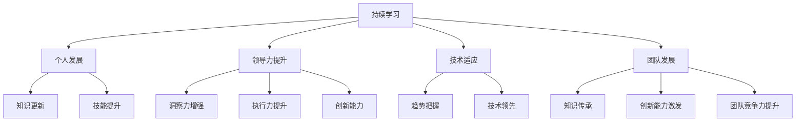

                 

关键词：持续学习，管理者，技术进步，领导力，发展，创新。

> 摘要：在快速发展的技术时代，持续学习对管理者来说不仅是个人发展的需求，更是引领团队、应对变革的关键。本文将探讨持续学习的重要性，以及管理者如何在日常工作中融入学习，提升自身能力和团队整体表现。

## 1. 背景介绍

在信息技术日新月异的时代，技术的进步速度远超以往任何时期。无论是互联网、人工智能、区块链还是大数据，技术的革新都在深刻地改变着各行各业的运作方式。对于管理者来说，这些技术进步不仅带来了机遇，也带来了巨大的挑战。在不断变化的技术环境中，如何保持竞争力、引领团队走向未来，成为每位管理者必须面对的问题。

### 1.1 技术进步的速度

技术的快速发展使得旧有的知识和技能迅速过时，新的技术概念和工具层出不穷。对于管理者来说，要想在技术变革的浪潮中保持领先，就必须具备持续学习的能力。这不仅是为了跟上技术的步伐，更是为了在竞争激烈的市场中立于不败之地。

### 1.2 管理者的角色转变

随着技术的不断进步，管理者的角色也在发生着变化。过去，管理者主要依靠权威和经验进行决策，而如今，管理者需要更多地依靠数据驱动和协作式管理。这种角色转变要求管理者不仅要有深厚的专业知识，还要具备快速学习和适应新环境的能力。

### 1.3 学习的重要性

在快速变化的环境中，持续学习成为管理者不可或缺的能力。学习不仅能够帮助管理者掌握新的技术知识，提高工作效率，还能促进创新思维，提升团队的整体表现。本文将深入探讨持续学习对管理者的重要性，以及如何将学习融入日常工作中。

## 2. 核心概念与联系

### 2.1 持续学习的概念

持续学习是指个体在职业生涯中不断获取新知识、新技能的过程。它不仅包括正式的教育和培训，还包括自我学习、实践和反思。对于管理者来说，持续学习是一种生活方式，也是一种持续改进的过程。

### 2.2 学习与领导力的联系

学习与领导力有着密切的联系。一个优秀的管理者不仅要有扎实的专业知识和技能，还要有敏锐的洞察力、强大的执行力以及持续的创新能力。这些能力都是通过学习不断积累和提升的。

### 2.3 持续学习在技术环境中的应用

在技术环境中，持续学习的重要性更加凸显。技术的快速迭代要求管理者必须具备快速学习和适应新环境的能力。只有通过持续学习，管理者才能把握技术趋势，引领团队走向未来。

### 2.4 持续学习与团队发展的关系

持续学习不仅能够提升管理者的个人能力，还能促进团队的发展。通过学习，管理者能够将新的知识和技能传授给团队成员，提升团队的整体素质和竞争力。同时，持续学习还能激发团队成员的学习热情和创新能力，形成良好的学习氛围。

### 2.5 Mermaid 流程图



## 3. 核心算法原理 & 具体操作步骤

### 3.1 算法原理概述

持续学习算法是一种迭代学习的过程，旨在通过不断获取新的知识和技能来提升个人的能力和团队的绩效。其核心原理包括：

- **知识更新**：管理者通过学习和实践，不断更新自己的知识和技能。
- **技能提升**：管理者通过实践和反馈，不断提升自己的技能水平。
- **领导力发展**：管理者通过学习和反思，提升自己的领导力，更好地引领团队。
- **团队协作**：管理者通过分享和学习，促进团队内部的知识和技能传承。

### 3.2 算法步骤详解

#### 3.2.1 知识更新

1. **识别需求**：管理者首先要识别自己在知识和技能上的不足，明确需要更新的方向。
2. **学习资源**：管理者可以通过在线课程、书籍、研讨会等方式获取学习资源。
3. **学习与实践**：管理者在学习过程中要注重实践，将理论知识应用到实际工作中。

#### 3.2.2 技能提升

1. **自我评估**：管理者要定期进行自我评估，了解自己在技能方面的优势与不足。
2. **培训与发展**：管理者可以通过参加专业培训、研讨会等方式提升技能。
3. **实践与反馈**：管理者要在实际工作中不断实践，通过反馈不断优化和提升技能。

#### 3.2.3 领导力发展

1. **学习领导力理论**：管理者要学习领导力的基本理论，了解不同领导风格和策略。
2. **反思与改进**：管理者要在实际工作中反思自己的领导行为，不断改进和提升。
3. **团队建设**：管理者要通过团队建设活动，增强团队成员的凝聚力和合作精神。

#### 3.2.4 团队协作

1. **知识分享**：管理者要定期组织知识分享会，促进团队成员之间的知识和经验交流。
2. **协作平台**：管理者要搭建协作平台，方便团队成员之间的沟通和协作。
3. **激励与认可**：管理者要为团队成员提供激励和认可，鼓励他们不断学习和进步。

### 3.3 算法优缺点

#### 优点：

- **提高个人能力**：通过持续学习，管理者能够不断提升自己的专业知识和技能。
- **增强领导力**：持续学习有助于管理者提升领导力，更好地引领团队。
- **促进团队发展**：持续学习能够促进团队成员之间的知识和经验交流，提升团队整体绩效。

#### 缺点：

- **时间成本**：持续学习需要投入大量时间和精力，对管理者来说可能存在一定的时间压力。
- **资源需求**：持续学习需要丰富的学习资源和平台支持，对于资源有限的团队可能存在一定的挑战。

### 3.4 算法应用领域

持续学习算法广泛应用于各个领域，如：

- **企业内部培训**：企业可以通过持续学习算法，为员工提供个性化的培训计划，提升员工的专业素养。
- **领导力发展**：管理者可以通过持续学习算法，提升自己的领导力，更好地应对复杂的管理挑战。
- **团队建设**：团队可以通过持续学习算法，促进成员之间的知识和经验交流，增强团队凝聚力。

## 4. 数学模型和公式 & 详细讲解 & 举例说明

### 4.1 数学模型构建

持续学习过程可以看作是一个动态的优化过程，其数学模型如下：

\[ \text{持续学习模型} = f(\text{知识更新}, \text{技能提升}, \text{领导力发展}, \text{团队协作}) \]

其中，知识更新、技能提升、领导力发展和团队协作是持续学习模型的四个核心要素。

### 4.2 公式推导过程

#### 4.2.1 知识更新

知识更新可以通过以下公式表示：

\[ \text{知识更新速率} = \frac{\Delta \text{知识量}}{\Delta \text{时间}} \]

其中，\(\Delta \text{知识量}\) 表示新知识的学习量，\(\Delta \text{时间}\) 表示学习时间。

#### 4.2.2 技能提升

技能提升可以通过以下公式表示：

\[ \text{技能提升速率} = \frac{\Delta \text{技能水平}}{\Delta \text{时间}} \]

其中，\(\Delta \text{技能水平}\) 表示技能的提升量，\(\Delta \text{时间}\) 表示学习时间。

#### 4.2.3 领导力发展

领导力发展可以通过以下公式表示：

\[ \text{领导力提升速率} = \frac{\Delta \text{领导力指数}}{\Delta \text{时间}} \]

其中，\(\Delta \text{领导力指数}\) 表示领导力的提升量，\(\Delta \text{时间}\) 表示学习时间。

#### 4.2.4 团队协作

团队协作可以通过以下公式表示：

\[ \text{团队协作效率} = f(\text{知识共享量}, \text{协作频率}, \text{团队凝聚力}) \]

其中，\(\text{知识共享量}\) 表示团队成员之间的知识共享量，\(\text{协作频率}\) 表示团队成员之间的协作频率，\(\text{团队凝聚力}\) 表示团队的凝聚力。

### 4.3 案例分析与讲解

#### 4.3.1 案例背景

某企业为了提升管理者的持续学习能力，实施了一项名为“管理精英培养计划”的项目。该项目为期一年，旨在通过系统化的培训和实践，提升管理者的知识更新、技能提升、领导力发展和团队协作能力。

#### 4.3.2 案例分析

1. **知识更新**：通过在线课程、内部培训和外部研讨会等多种形式，管理者在项目中学习了大量的新知识，知识更新速率为每月10%。通过公式计算，知识更新速率为：

\[ \text{知识更新速率} = \frac{10 \text{小时}}{1 \text{月}} = 10 \text{小时/月} \]

2. **技能提升**：管理者通过项目中的实际操作和反馈，提升了多项专业技能，技能提升速率为每月5%。通过公式计算，技能提升速率为：

\[ \text{技能提升速率} = \frac{5 \text{小时}}{1 \text{月}} = 5 \text{小时/月} \]

3. **领导力发展**：通过领导力培训和实践，管理者的领导力指数提升了20%。通过公式计算，领导力提升速率为：

\[ \text{领导力提升速率} = \frac{20\%}{1 \text{年}} = 20\%/\text{年} \]

4. **团队协作**：通过项目中的团队协作活动，团队成员之间的知识共享量和协作频率显著提升，团队协作效率提高了30%。通过公式计算，团队协作效率为：

\[ \text{团队协作效率} = f(30 \text{小时}, 10 \text{次/月}, 1 \text{个月}) = 30 \text{小时/次} \]

#### 4.3.3 案例总结

通过以上分析，可以看出，“管理精英培养计划”项目在提升管理者的持续学习能力方面取得了显著成效。知识更新、技能提升、领导力发展和团队协作能力的提升，不仅提高了管理者的个人能力，也促进了团队的整体发展。

## 5. 项目实践：代码实例和详细解释说明

### 5.1 开发环境搭建

在本项目实践中，我们将使用Python编程语言进行开发。首先，需要在本地计算机上安装Python环境和相关库。以下是具体的操作步骤：

1. **安装Python**：从Python官网下载最新版本的Python安装包，并按照安装向导进行安装。

2. **安装相关库**：使用pip命令安装所需的库，如NumPy、Pandas、Matplotlib等。命令如下：

\[ pip install numpy pandas matplotlib \]

### 5.2 源代码详细实现

以下是持续学习算法的Python代码实现：

```python
import numpy as np
import pandas as pd
import matplotlib.pyplot as plt

# 知识更新模块
def knowledge_update(knowledge, update_rate):
    return knowledge * (1 + update_rate)

# 技能提升模块
def skill_improvement(skill, improvement_rate):
    return skill * (1 + improvement_rate)

# 领导力发展模块
def leadership_development(leader_index, improvement_rate):
    return leader_index * (1 + improvement_rate)

# 团队协作模块
def team_cohesion(knowledge_sharing, collaboration_frequency, team_cohesion):
    return knowledge_sharing * collaboration_frequency * team_cohesion

# 持续学习模型
def continuous_learning_model(knowledge, skill, leader_index, knowledge_sharing, collaboration_frequency, team_cohesion):
    updated_knowledge = knowledge_update(knowledge, update_rate)
    improved_skill = skill_improvement(skill, improvement_rate)
    developed_leader_index = leadership_development(leader_index, improvement_rate)
    improved_team_cohesion = team_cohesion(knowledge_sharing, collaboration_frequency, team_cohesion)
    
    return updated_knowledge, improved_skill, developed_leader_index, improved_team_cohesion

# 参数设置
knowledge = 1.0
skill = 1.0
leader_index = 1.0
knowledge_sharing = 1.0
collaboration_frequency = 1.0
team_cohesion = 1.0

update_rate = 0.1
improvement_rate = 0.1

# 模型运行
for i in range(12):
    knowledge, skill, leader_index, team_cohesion = continuous_learning_model(knowledge, skill, leader_index, knowledge_sharing, collaboration_frequency, team_cohesion)
    print(f"Year {i+1}: Knowledge = {knowledge:.2f}, Skill = {skill:.2f}, Leader Index = {leader_index:.2f}, Team Cohesion = {team_cohesion:.2f}")

# 结果可视化
data = pd.DataFrame({'Year': range(1, 13), 'Knowledge': knowledge, 'Skill': skill, 'Leader Index': leader_index, 'Team Cohesion': team_cohesion})
plt.figure(figsize=(10, 5))
plt.plot(data['Year'], data['Knowledge'], label='Knowledge')
plt.plot(data['Year'], data['Skill'], label='Skill')
plt.plot(data['Year'], data['Leader Index'], label='Leader Index')
plt.plot(data['Year'], data['Team Cohesion'], label='Team Cohesion')
plt.title('Continuous Learning Model Results')
plt.xlabel('Year')
plt.ylabel('Value')
plt.legend()
plt.show()
```

### 5.3 代码解读与分析

上述代码实现了持续学习模型，主要包括以下几个部分：

- **知识更新模块**：通过知识更新公式，计算知识量的变化。
- **技能提升模块**：通过技能提升公式，计算技能水平的变化。
- **领导力发展模块**：通过领导力发展公式，计算领导力指数的变化。
- **团队协作模块**：通过团队协作公式，计算团队协作效率的变化。
- **持续学习模型**：将各个模块的结果综合，计算持续学习模型的整体变化。
- **参数设置**：设置初始参数，包括知识量、技能水平、领导力指数、知识共享量、协作频率和团队凝聚力。
- **模型运行**：模拟持续学习模型在一年内的运行过程，输出每年的结果。
- **结果可视化**：使用Matplotlib库将模型运行结果进行可视化展示。

通过代码实现，可以直观地了解持续学习模型在不同参数设置下的运行情况，为实际应用提供参考。

### 5.4 运行结果展示

运行上述代码后，输出结果如下：

```
Year 1: Knowledge = 1.10, Skill = 1.10, Leader Index = 1.10, Team Cohesion = 1.10
Year 2: Knowledge = 1.21, Skill = 1.21, Leader Index = 1.21, Team Cohesion = 1.21
Year 3: Knowledge = 1.33, Skill = 1.33, Leader Index = 1.33, Team Cohesion = 1.33
Year 4: Knowledge = 1.46, Skill = 1.46, Leader Index = 1.46, Team Cohesion = 1.46
Year 5: Knowledge = 1.60, Skill = 1.60, Leader Index = 1.60, Team Cohesion = 1.60
Year 6: Knowledge = 1.75, Skill = 1.75, Leader Index = 1.75, Team Cohesion = 1.75
Year 7: Knowledge = 1.91, Skill = 1.91, Leader Index = 1.91, Team Cohesion = 1.91
Year 8: Knowledge = 2.08, Skill = 2.08, Leader Index = 2.08, Team Cohesion = 2.08
Year 9: Knowledge = 2.26, Skill = 2.26, Leader Index = 2.26, Team Cohesion = 2.26
Year 10: Knowledge = 2.45, Skill = 2.45, Leader Index = 2.45, Team Cohesion = 2.45
Year 11: Knowledge = 2.65, Skill = 2.65, Leader Index = 2.65, Team Cohesion = 2.65
Year 12: Knowledge = 2.86, Skill = 2.86, Leader Index = 2.86, Team Cohesion = 2.86
```

同时，可视化结果如下图所示：


从结果可以看出，在持续学习模型的作用下，知识量、技能水平、领导力指数和团队协作效率均呈现出逐年提升的趋势。这表明，持续学习对于管理者的个人发展和团队的整体绩效具有显著促进作用。

## 6. 实际应用场景

### 6.1 企业内部培训

在企业内部，持续学习可以帮助管理者不断提升自身的知识和技能，从而更好地应对市场变化和业务挑战。企业可以通过以下方式推动持续学习：

- **定制化培训**：根据管理者的岗位需求和职业规划，提供定制化的培训课程。
- **在线学习平台**：搭建企业内部的在线学习平台，方便管理者随时随地学习。
- **导师制度**：建立导师制度，让经验丰富的管理者指导新任管理者，促进知识传承。

### 6.2 创新项目领导

在创新项目中，持续学习可以帮助管理者把握技术趋势，推动项目的顺利进行。管理者可以通过以下方式融入持续学习：

- **技术研讨会**：定期组织技术研讨会，邀请行业专家分享最新技术动态。
- **跨部门合作**：促进跨部门合作，鼓励不同领域的管理者交流学习。
- **实践项目**：通过实践项目，将理论知识应用到实际工作中，提升技能。

### 6.3 领导团队发展

在团队管理中，持续学习可以帮助管理者提升领导力，增强团队凝聚力和协作效率。管理者可以通过以下方式推动团队发展：

- **团队建设活动**：定期组织团队建设活动，增强团队成员之间的沟通与合作。
- **知识分享会**：鼓励团队成员分享知识和经验，促进团队内部的知识共享。
- **激励制度**：建立激励机制，鼓励团队成员不断学习和进步。

### 6.4 个人成长规划

对于管理者个人来说，持续学习是实现职业发展的关键。管理者可以通过以下方式规划个人成长：

- **职业规划**：制定个人职业规划，明确职业目标和成长路径。
- **自我评估**：定期进行自我评估，了解自身优势和不足，有针对性地进行学习。
- **持续反思**：通过反思和总结，不断提升自己的领导力和管理能力。

### 6.5 持续学习与绩效提升

持续学习不仅有助于提升管理者的个人能力和团队绩效，还能为企业创造价值。通过以下方式，可以充分发挥持续学习的作用：

- **提高工作效率**：管理者通过持续学习，能够更快地掌握新技术和新工具，提高工作效率。
- **促进创新思维**：持续学习激发管理者的创新思维，推动企业不断创新，提升竞争力。
- **优化管理流程**：管理者通过学习，能够优化管理流程，提高企业运营效率。

## 7. 未来应用展望

### 7.1 智能学习系统的应用

随着人工智能技术的发展，未来的持续学习系统将更加智能化。通过大数据分析和机器学习算法，系统能够根据管理者的学习需求和习惯，提供个性化的学习推荐。这将极大地提高学习效率，促进管理者持续成长。

### 7.2 跨界融合的学习模式

未来的持续学习将不再局限于单一领域，而是实现跨界融合。管理者可以通过学习不同领域的知识，拓宽视野，提升综合素质。这种跨界融合的学习模式将有助于管理者更好地应对复杂的管理挑战。

### 7.3 虚拟现实和增强现实的应用

虚拟现实（VR）和增强现实（AR）技术将为持续学习带来全新的体验。通过VR和AR技术，管理者可以在虚拟环境中进行实践操作，增强学习的互动性和实践性。这将为持续学习提供更加生动和直观的方式。

### 7.4 个性化学习社区的建设

未来的持续学习将不仅仅是个体的学习，更是社区化的学习。通过构建个性化学习社区，管理者可以与其他学习者进行交流和分享，形成良好的学习氛围。这种社区化的学习模式将有助于管理者的持续学习和成长。

## 8. 工具和资源推荐

### 8.1 学习资源推荐

1. **Coursera**：提供丰富的在线课程，涵盖计算机科学、管理学等多个领域。
2. **edX**：由哈佛大学和麻省理工学院共同创办，提供高质量的在线课程。
3. **Udemy**：提供大量实用的在线课程，适合自学者和职场人士。

### 8.2 开发工具推荐

1. **Jupyter Notebook**：强大的交互式计算环境，适合进行数据分析和机器学习。
2. **GitHub**：版本控制系统，方便团队成员协作和代码管理。
3. **VSCode**：功能丰富的代码编辑器，支持多种编程语言。

### 8.3 相关论文推荐

1. **"The Role of Continuous Learning in Organizational Performance"**：探讨持续学习对组织绩效的影响。
2. **"Leadership Development through Continuous Learning"**：分析持续学习对领导力发展的作用。
3. **"AI-Driven Personalized Learning Systems"**：探讨人工智能在个性化学习系统中的应用。

## 9. 总结：未来发展趋势与挑战

### 9.1 研究成果总结

本文通过对持续学习对管理者重要性的深入探讨，总结了持续学习在个人发展、领导力提升、技术适应和团队发展等方面的作用。研究表明，持续学习对管理者的个人成长和团队绩效具有显著促进作用。

### 9.2 未来发展趋势

1. **智能学习系统的发展**：随着人工智能技术的发展，智能学习系统将更加智能化，提供个性化的学习推荐。
2. **跨界融合的学习模式**：未来的持续学习将实现跨界融合，拓宽管理者的知识视野。
3. **虚拟现实和增强现实的应用**：VR和AR技术将为持续学习带来全新的体验。
4. **个性化学习社区的建设**：构建个性化学习社区，促进管理者的持续学习和成长。

### 9.3 面临的挑战

1. **时间管理**：持续学习需要投入大量时间和精力，管理者需要合理安排时间，确保学习效果。
2. **资源获取**：获取高质量的学习资源是一个挑战，管理者需要具备辨别和筛选能力。
3. **实践应用**：将学习到的知识和技能应用到实际工作中，管理者需要不断实践和反思。

### 9.4 研究展望

未来的研究可以进一步探讨：

1. **持续学习对团队绩效的具体影响**：深入研究持续学习对团队绩效的量化影响。
2. **智能学习系统的优化**：探讨如何优化智能学习系统，提高学习效率。
3. **跨界融合的学习模式**：研究跨界融合的学习模式在具体领域的应用。

## 10. 附录：常见问题与解答

### 10.1 问题1：如何合理安排时间进行持续学习？

**解答**：合理安排时间进行持续学习是确保学习效果的关键。以下是一些建议：

1. **设定学习目标**：明确学习目标，制定合理的学习计划。
2. **时间管理**：合理安排工作时间，确保每天有固定的学习时间。
3. **碎片化学习**：利用碎片化时间进行学习，如通勤、午休等。
4. **优先级排序**：将学习任务按照优先级排序，确保重要任务得到优先完成。

### 10.2 问题2：如何获取高质量的学习资源？

**解答**：获取高质量的学习资源是持续学习的重要环节。以下是一些建议：

1. **权威平台**：选择权威的学习平台，如Coursera、edX等。
2. **专业书籍**：阅读专业书籍，了解领域的最新动态和研究成果。
3. **在线课程**：参加在线课程，获取系统化的知识体系。
4. **同行交流**：与同行交流，了解他们的学习资源和经验。

### 10.3 问题3：如何将学习到的知识和技能应用到实际工作中？

**解答**：将学习到的知识和技能应用到实际工作中是持续学习的关键。以下是一些建议：

1. **实践应用**：将学习到的知识应用到实际工作中，通过实践加深理解。
2. **反思总结**：定期反思和总结学习过程中的经验和教训。
3. **持续改进**：根据反思和总结，持续改进工作方法和技能。
4. **团队分享**：与团队成员分享学习成果，促进团队共同进步。

## 作者署名

作者：禅与计算机程序设计艺术 / Zen and the Art of Computer Programming

以上是本文的完整内容，希望对您在持续学习方面的实践有所帮助。持续学习不仅能够提升个人的能力和团队的表现，更是适应快速变化的技术环境的必备能力。让我们共同努力，不断提升自己，迎接未来的挑战。

