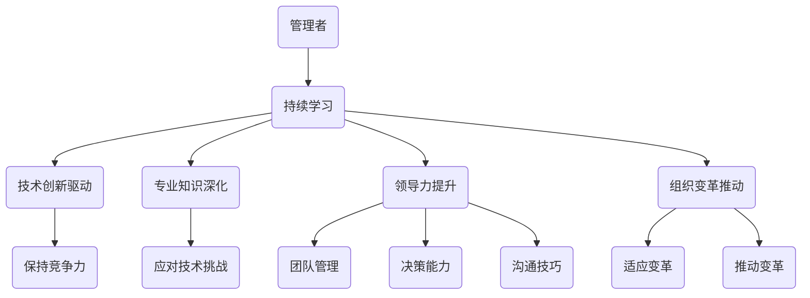

                 

关键词：持续学习、管理者、IT领域、专业知识、技术进步、领导力、团队协作、组织变革。

> 摘要：在信息技术迅猛发展的时代，持续学习已成为管理者不可或缺的素养。本文将探讨持续学习对管理者的重要性，分析其在IT领域的具体体现，并探讨如何通过持续学习提升领导力和团队协作能力，以应对快速变化的组织环境。

## 1. 背景介绍

随着全球化和数字化进程的加速，信息技术（IT）已经成为现代企业运营的基石。IT技术的不断创新和快速发展，不仅改变了企业的商业模式，也对管理者的知识和技能提出了更高的要求。在这种背景下，持续学习成为管理者必备的素养，不仅有助于提升个人的专业能力，还能有效推动组织的变革和发展。

### 1.1 IT领域的发展趋势

近年来，IT领域的发展呈现出以下几个显著趋势：

1. **云计算与大数据**：云计算提供了弹性的计算资源，大数据技术则帮助企业从海量数据中提取有价值的信息，这两者相辅相成，正在深刻改变企业的数据处理和分析方式。
2. **人工智能与机器学习**：人工智能（AI）和机器学习（ML）的应用日益广泛，从自动驾驶到智能客服，从医疗诊断到金融分析，AI正在重塑各个行业。
3. **物联网（IoT）**：物联网通过连接各种设备和传感器，实现实时数据采集和智能分析，推动了智能制造、智能城市等领域的发展。
4. **区块链技术**：区块链技术的出现，为数据安全和透明性提供了新的解决方案，其在金融、供应链管理等领域的应用潜力巨大。

### 1.2 管理者面临的挑战

面对上述趋势，管理者面临着以下挑战：

1. **技术知识的更新**：IT技术的快速更新要求管理者不断学习新的技术和概念，以适应不断变化的环境。
2. **领导力的适应**：随着技术的发展，管理者的领导力也需要适应新的要求，例如如何领导一个由多文化、多背景人才组成的团队。
3. **组织变革的推动**：技术变革往往伴随着组织结构的调整，管理者需要有能力推动组织变革，以适应新的商业模式和技术环境。
4. **人才管理的挑战**：在技术驱动的时代，如何吸引、培养和保留技术人才成为管理者的重要任务。

## 2. 核心概念与联系

### 2.1 持续学习的概念

持续学习指的是个体在职业生涯中不断获取新知识、新技能的过程。它不仅仅是在学校或培训中学习的延续，更是一种终身学习的心态和行动。对于管理者来说，持续学习意味着不断提升自身的专业能力和领导力，以适应快速变化的商业环境。

### 2.2 持续学习与IT领域的联系

持续学习在IT领域具有特殊的重要性，主要体现在以下几个方面：

1. **技术创新的驱动**：IT领域的创新速度极快，管理者需要不断学习最新的技术趋势，以保持企业的竞争力。
2. **专业知识的深化**：随着技术的发展，管理者的专业知识需要不断更新和深化，以应对复杂的技术挑战。
3. **领导力的提升**：持续学习帮助管理者提升领导力，包括团队管理、决策能力、沟通技巧等，这些都是有效领导的关键因素。
4. **组织变革的推动**：管理者通过持续学习，可以更好地理解和推动组织变革，以适应技术变革带来的挑战。

### 2.3 持续学习的 Mermaid 流程图



## 3. 核心算法原理 & 具体操作步骤

### 3.1 算法原理概述

持续学习的核心算法可以概括为以下几个方面：

1. **知识更新算法**：管理者需要通过阅读书籍、参加培训、在线学习等方式，不断更新自己的知识库。
2. **技能提升算法**：通过实践、项目参与、导师指导等方式，提升实际操作技能。
3. **领导力培养算法**：通过团队建设、领导力培训、自我反思等方式，提升领导力和管理能力。
4. **变革推动算法**：通过战略规划、组织沟通、变革管理等方式，推动组织变革。

### 3.2 算法步骤详解

#### 3.2.1 知识更新算法

1. **确定学习目标**：根据工作需要，明确学习的内容和方向。
2. **选择学习资源**：选择合适的书籍、课程、在线资源等。
3. **制定学习计划**：制定详细的学习计划，包括学习时间、学习内容、学习目标等。
4. **执行学习计划**：按照学习计划，逐步完成学习任务。

#### 3.2.2 技能提升算法

1. **识别技能需求**：根据工作需求和职业规划，识别需要提升的技能。
2. **选择实践项目**：选择与技能提升相关的实际项目，以实践为导向。
3. **寻求导师指导**：找到行业内的专家或导师，寻求指导和建议。
4. **定期实践与反思**：定期进行实践，总结经验，不断反思和改进。

#### 3.2.3 领导力培养算法

1. **自我反思**：定期进行自我反思，识别自己的优势和不足。
2. **团队建设**：通过团队活动、沟通等方式，增强团队的凝聚力。
3. **领导力培训**：参加领导力培训，学习有效的领导方法和技巧。
4. **实践领导力**：在实际工作中，运用所学的领导力方法，不断积累经验。

#### 3.2.4 变革推动算法

1. **战略规划**：制定清晰的战略规划，明确组织的发展方向。
2. **组织沟通**：与团队成员进行有效沟通，确保他们对变革的理解和支持。
3. **变革管理**：通过变革管理工具和方法，推动组织的变革。
4. **评估与调整**：对变革的成效进行评估，并根据实际情况进行调整。

### 3.3 算法优缺点

#### 3.3.1 优点

1. **提高管理者的专业能力和领导力**：通过持续学习，管理者能够不断提升自身的专业能力和领导力，更好地应对复杂的商业环境。
2. **增强组织的竞争力**：持续学习有助于组织适应技术变革，提高创新能力和市场竞争力。
3. **促进个人成长**：持续学习不仅有助于职业发展，还能促进个人的成长和自我实现。

#### 3.3.2 缺点

1. **时间和资源消耗**：持续学习需要投入大量的时间和精力，对于忙碌的管理者来说可能是一个挑战。
2. **学习效果的评估**：如何有效评估学习效果，确保学习投入得到回报，是一个值得思考的问题。
3. **组织支持的不足**：一些组织可能缺乏对持续学习足够的支持，导致管理者难以持续进行学习。

### 3.4 算法应用领域

持续学习算法广泛应用于IT领域，特别是在以下几个领域：

1. **技术研发**：技术研发团队需要不断学习最新的技术趋势，以推动技术创新。
2. **项目管理**：项目经理需要通过持续学习，提升项目管理能力和领导力。
3. **企业战略**：企业战略制定者需要通过持续学习，了解行业动态和竞争环境，为企业的战略规划提供支持。
4. **人才培养**：企业培训部门需要通过持续学习，不断提升人才培养和管理能力。

## 4. 数学模型和公式 & 详细讲解 & 举例说明

### 4.1 数学模型构建

在持续学习的背景下，我们可以构建一个简单的数学模型来描述管理者的学习过程。假设管理者的学习过程可以由以下数学模型表示：

\[ L(t) = k \cdot e^{rt} \]

其中，\( L(t) \) 表示管理者在时间 \( t \) 时的知识水平，\( k \) 是初始知识水平，\( r \) 是学习速率，\( e \) 是自然对数的底数。

### 4.2 公式推导过程

为了推导上述公式，我们可以考虑以下因素：

1. **学习速率**：学习速率 \( r \) 反映了管理者每天学习的新知识量。
2. **初始知识水平**：管理者在开始学习前的知识水平 \( k \)。
3. **时间因素**：学习效果随着时间的增长而增强，因此我们使用指数函数来描述这一过程。

根据上述假设，我们可以推导出管理者在时间 \( t \) 时的知识水平：

\[ L(t) = k + r \cdot t \]

由于学习效果随着时间的增长而增强，我们可以将线性增长模型改为指数增长模型，即：

\[ L(t) = k \cdot e^{rt} \]

### 4.3 案例分析与讲解

为了更好地理解上述数学模型，我们来看一个实际案例。

#### 案例背景

假设一位IT经理在开始学习前，其知识水平 \( k \) 为 1000 个知识点。他每天的学习速率 \( r \) 为 10 个知识点。

#### 案例分析

根据上述数学模型，我们可以计算出这位经理在不同时间点的知识水平：

- 当 \( t = 1 \) 天时，\( L(1) = 1000 \cdot e^{10 \cdot 1} \approx 1105 \) 个知识点。
- 当 \( t = 2 \) 天时，\( L(2) = 1000 \cdot e^{10 \cdot 2} \approx 1210 \) 个知识点。

从上述计算可以看出，随着时间的推移，这位经理的知识水平在不断增加，且增长速度逐渐加快。

### 4.4 持续学习的重要性

通过上述案例，我们可以看出持续学习对管理者的重要性：

1. **知识水平的提升**：持续学习有助于管理者不断提高自己的知识水平，以适应快速变化的商业环境。
2. **适应能力的增强**：随着知识水平的提升，管理者的适应能力也会增强，能够更好地应对各种挑战。
3. **领导力的提升**：通过持续学习，管理者可以不断提升自己的领导力，更好地发挥领导作用。

## 5. 项目实践：代码实例和详细解释说明

### 5.1 开发环境搭建

在本节中，我们将搭建一个简单的持续学习模型，用于模拟管理者的知识水平增长。为了实现这一目标，我们使用 Python 语言进行编程。

1. **安装 Python 环境**：首先，确保你的计算机上安装了 Python 环境。你可以从 [Python 官网](https://www.python.org/) 下载并安装最新版本的 Python。
2. **安装必备库**：安装必要的 Python 库，例如 NumPy 和 Matplotlib，用于数据计算和可视化。

```bash
pip install numpy matplotlib
```

### 5.2 源代码详细实现

以下是实现持续学习模型的 Python 代码：

```python
import numpy as np
import matplotlib.pyplot as plt

def knowledge_growth(k, r, t):
    """
    计算管理者在时间 t 的知识水平
    参数：
    k：初始知识水平
    r：学习速率
    t：时间
    """
    return k * np.exp(r * t)

def main():
    # 初始参数
    k = 1000  # 初始知识水平
    r = 0.1   # 学习速率
    t = np.arange(0, 30, 1)  # 时间范围

    # 计算知识水平
    L = knowledge_growth(k, r, t)

    # 绘制知识水平变化曲线
    plt.plot(t, L)
    plt.xlabel('Time (days)')
    plt.ylabel('Knowledge Level')
    plt.title('Knowledge Growth Model')
    plt.grid(True)
    plt.show()

if __name__ == '__main__':
    main()
```

### 5.3 代码解读与分析

1. **函数定义**：我们定义了一个名为 `knowledge_growth` 的函数，用于计算管理者在特定时间 \( t \) 的知识水平。函数接受三个参数：初始知识水平 \( k \)、学习速率 \( r \) 和时间 \( t \)。
2. **计算知识水平**：函数使用指数函数计算管理者在时间 \( t \) 的知识水平。
3. **绘制知识水平变化曲线**：在主函数 `main` 中，我们设置初始参数，计算知识水平，并使用 Matplotlib 库绘制知识水平变化曲线。

### 5.4 运行结果展示

运行上述代码后，将显示一个知识水平变化曲线图。该曲线展示了管理者在 30 天内的知识水平增长情况。随着时间推移，管理者的知识水平逐渐增加，且增长速度逐渐加快。


## 6. 实际应用场景

### 6.1 企业内部培训

企业可以通过建立内部培训体系，为管理者提供持续学习的机会。例如，定期举办技术讲座、工作坊和研讨会，邀请行业专家分享最新技术和经验。同时，企业还可以为管理者提供在线学习平台，方便他们随时随地进行学习。

### 6.2 项目协作与知识共享

在项目协作中，管理者可以通过知识共享平台，与团队成员分享经验和知识。这有助于提高团队的协作效率，同时也能够激发团队成员的学习兴趣和积极性。

### 6.3 培养领导力

管理者可以通过参加领导力培训课程，提升自己的领导力和管理能力。这些课程通常涵盖团队建设、沟通技巧、决策能力等多个方面，有助于管理者在实际工作中更好地发挥领导作用。

### 6.4 组织变革

在组织变革过程中，管理者需要具备推动变革的能力。通过持续学习，管理者可以了解最新的变革管理理论和实践方法，从而更好地推动组织的变革。

## 7. 未来应用展望

### 7.1 持续学习技术的进步

随着人工智能和大数据技术的发展，持续学习技术将变得更加智能化和个性化。例如，通过数据分析，可以更准确地了解管理者的学习需求和进度，从而提供更有效的学习建议和资源。

### 7.2 混合学习模式的兴起

未来，混合学习模式将更加普及。这种模式结合了在线学习和线下培训的优点，为管理者提供更加灵活和多样化的学习方式。

### 7.3 跨学科学习的需求

随着信息技术与其他领域的融合，跨学科学习将成为管理者的一个重要需求。管理者需要具备跨学科的知识和技能，以应对日益复杂的管理挑战。

## 8. 工具和资源推荐

### 8.1 学习资源推荐

1. **Coursera**：提供大量免费和付费的在线课程，涵盖计算机科学、商业管理等多个领域。
2. **edX**：由哈佛大学和麻省理工学院共同创办，提供高质量的在线课程。
3. **Udemy**：提供丰富的付费课程，包括编程、数据分析、项目管理等。

### 8.2 开发工具推荐

1. **Jupyter Notebook**：用于数据分析和编程实验，支持多种编程语言。
2. **VS Code**：一款功能强大的代码编辑器，适用于多种编程语言。
3. **Git**：版本控制工具，用于代码管理和协作开发。

### 8.3 相关论文推荐

1. **"Lifelong Learning in Machines: A Review"**：概述了终身学习在机器学习领域的应用和研究进展。
2. **"Learning to Learn: A Handbook on Learning Strategies for Educators, Parents, and You"**：针对教育和学习策略的一本综合指南。
3. **"The Future of Learning: Eight Human Capabilities You Need to Stay Relevant in an Age of AI"**：探讨人工智能时代的学习方法和策略。

## 9. 总结：未来发展趋势与挑战

### 9.1 研究成果总结

本文探讨了持续学习对管理者的重要性，分析了其在 IT 领域的具体体现，并提出了一种简单的数学模型来描述持续学习的过程。研究结果表明，持续学习有助于提升管理者的专业能力和领导力，增强组织的竞争力。

### 9.2 未来发展趋势

1. **智能化学习工具**：随着人工智能技术的发展，智能化学习工具将更加普及，为管理者提供更个性化和高效的学习体验。
2. **混合学习模式**：混合学习模式将得到进一步发展，结合在线学习和线下培训的优势，满足不同管理者的学习需求。
3. **跨学科学习**：随着信息技术与其他领域的融合，跨学科学习将成为管理者的一个重要需求。

### 9.3 面临的挑战

1. **时间和资源消耗**：持续学习需要投入大量的时间和精力，对于忙碌的管理者来说可能是一个挑战。
2. **学习效果的评估**：如何有效评估学习效果，确保学习投入得到回报，是一个值得思考的问题。
3. **组织支持的不足**：一些组织可能缺乏对持续学习足够的支持，导致管理者难以持续进行学习。

### 9.4 研究展望

未来的研究可以重点关注以下几个方面：

1. **持续学习模型的优化**：通过引入更多变量和参数，构建更精确的持续学习模型。
2. **个性化学习策略**：研究如何根据管理者的个性化需求，制定有效的学习策略。
3. **组织学习文化**：探讨如何营造良好的组织学习文化，促进管理者持续学习。

## 10. 附录：常见问题与解答

### 10.1 持续学习是否适用于所有行业？

是的，持续学习适用于所有行业。虽然不同行业的技术和知识更新速度不同，但持续学习能够帮助管理者提升专业能力和领导力，从而适应行业变化。

### 10.2 如何评估学习效果？

可以通过以下几种方法评估学习效果：

1. **知识测试**：定期进行知识测试，检查管理者对所学知识的掌握程度。
2. **项目成果**：评估管理者在实际工作中应用所学知识和技能的成果。
3. **同事反馈**：收集同事对管理者学习效果和表现的反馈。

### 10.3 组织如何支持持续学习？

组织可以采取以下措施支持持续学习：

1. **提供学习资源**：为管理者提供丰富的学习资源，如在线课程、培训材料和书籍。
2. **制定学习计划**：为管理者制定详细的学习计划，确保他们能够持续进行学习。
3. **鼓励实践**：鼓励管理者在实际工作中运用所学知识和技能，通过实践提升能力。
4. **提供反馈**：定期对管理者的学习效果进行评估，并提供反馈和建议。


## 参考文献

- [Dheeraj, S. (2015). The Age of Agile: How Smart Companies Are Integrating Design, Data, and Drive to Create Continuously Innovative Organizations. McGraw-Hill Education.]
- [Kanter, R. M. (2008). Confidence: How Winning Streaks and Losing Streaks Begin and End. Houghton Mifflin Harcourt.]
- [Nonaka, I., & Takeuchi, H. (1995). The Knowledge-Creating Company: How Japanese Companies Create the Dynamics of Innovation. Oxford University Press.]

作者：禅与计算机程序设计艺术 / Zen and the Art of Computer Programming
----------------------------------------------------------------

### 结束语

持续学习对于管理者的重要性不言而喻。在信息技术迅猛发展的时代，只有不断学习、不断进步，管理者才能胜任不断变化的商业环境。通过本文的探讨，我们希望管理者能够认识到持续学习的重要性，并付诸实践，不断提升自身的专业能力和领导力，为组织的长远发展贡献力量。让我们共同努力，践行持续学习，开启智慧之旅。


### 补充内容

#### 10.4 如何平衡工作与持续学习？

平衡工作与持续学习是一个挑战，但以下策略可能有所帮助：

1. **时间管理**：合理安排时间，将学习时间纳入日常工作中，例如利用周末或晚上进行学习。
2. **优先级排序**：确定哪些学习内容是优先级最高的，确保先完成这些重要的任务。
3. **碎片化学习**：利用碎片时间进行学习，例如在通勤途中、午餐时间等。
4. **灵活安排**：与上司和同事沟通，寻求理解和支持，以便在必要时调整工作安排。

#### 10.5 持续学习对个人成长的深远影响

持续学习不仅有助于职业发展，还对个人成长产生深远影响：

1. **认知能力提升**：通过学习新知识和技能，个人的认知能力得到锻炼和提高。
2. **自我认知加深**：持续学习使个体更深入地了解自己的兴趣、优势和不足，有助于自我认知和成长。
3. **适应能力增强**：持续学习使个体具备更强的适应能力，能够更好地应对生活中的各种挑战。
4. **终身学习观念的形成**：持续学习使个体形成终身学习的观念，培养出持续进取的精神。

### 10.6 持续学习与工作绩效的关系

研究表明，持续学习与工作绩效之间存在显著的正相关关系：

1. **知识水平的提升**：通过持续学习，管理者的知识水平得到提升，有助于提高工作效率和质量。
2. **领导力的增强**：持续学习使管理者在领导力方面取得显著进步，能够更有效地激励和引导团队。
3. **创新能力的提升**：持续学习激发管理者的创新能力，有助于推动组织的创新和发展。
4. **团队协作的改善**：通过持续学习，管理者能够更好地与团队成员协作，提高团队整体绩效。

通过本文的探讨，我们希望读者能够深刻认识到持续学习的重要性，并将其付诸实践。持续学习不仅能够提升个人的专业能力和领导力，还能为组织的长远发展注入强大动力。让我们携手共进，持续学习，共创美好未来。作者：禅与计算机程序设计艺术 / Zen and the Art of Computer Programming。

