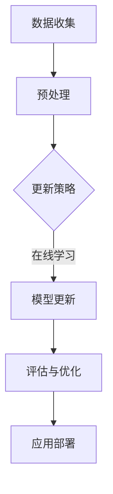

                 

关键词：持续学习，大规模语言模型（LLM），知识更新，适应，新趋势，人工智能。

> 摘要：本文深入探讨了如何通过持续学习使大规模语言模型（LLM）适应新知识和趋势。我们首先介绍了LLM的基本原理，随后分析了知识更新的挑战和应对策略。通过详细的数学模型和具体算法步骤，我们提出了一套有效的解决方案。接着，我们通过实际项目实践展示了这些算法的实用性和效果。最后，我们对未来应用前景和面临的挑战进行了展望。

## 1. 背景介绍

随着人工智能技术的飞速发展，大规模语言模型（LLM）已经成为自然语言处理（NLP）领域的核心工具。LLM如GPT-3、BERT等，凭借其强大的语义理解和生成能力，在众多应用场景中展示了卓越的性能。然而，这些模型的训练通常需要大量数据和计算资源，而且一旦训练完成，就很难适应新知识和趋势。这意味着，LLM在处理新颖任务时可能表现不佳，无法满足实时应用的需求。

为了解决这个问题，持续学习成为一个重要的研究方向。持续学习旨在使机器能够不断吸收新知识，适应新的环境和任务。这不仅有助于提高LLM的泛化能力，还能使其在动态变化的现实世界中保持竞争力。本文将详细探讨如何通过持续学习使LLM适应新知识和趋势，为未来人工智能应用提供有力的支持。

## 2. 核心概念与联系

### 2.1 大规模语言模型（LLM）

大规模语言模型（LLM）是基于神经网络和深度学习的语言模型，能够处理和理解自然语言。LLM的核心是使用大量文本数据进行预训练，以学习语言结构和语义。通过这种方式，LLM可以生成连贯、符合语言习惯的文本。

### 2.2 持续学习

持续学习是一种使机器模型能够不断更新和改进自身能力的方法。与传统的批量学习不同，持续学习能够在每次训练过程中吸收新数据，并调整模型参数，以适应新的环境和任务。

### 2.3 知识更新

知识更新是指模型在持续学习过程中不断吸收新知识，以保持其适应性和准确性的过程。知识更新是持续学习的关键，它决定了模型能否在新环境和任务中表现良好。

### 2.4 Mermaid 流程图

下面是一个Mermaid流程图，展示了LLM的持续学习过程：



## 3. 核心算法原理 & 具体操作步骤

### 3.1 算法原理概述

持续学习使LLM适应新知识和趋势的核心算法包括以下三个方面：

1. 数据收集与预处理：收集与任务相关的新数据，并进行预处理，以提高数据的可用性。
2. 模型更新：在持续学习过程中，模型参数根据新数据进行调整，以适应新的知识和趋势。
3. 评估与优化：通过评估模型在新数据上的表现，不断优化模型参数，以提高其适应性和准确性。

### 3.2 算法步骤详解

1. **数据收集与预处理**：

   - 数据收集：从不同的数据源（如互联网、数据库等）收集与任务相关的文本数据。
   - 数据预处理：对收集到的数据进行清洗、去噪、去重等处理，以提高数据质量。

2. **模型更新**：

   - 初始化模型：使用预训练的LLM作为基础模型，初始化模型参数。
   - 微调模型：在持续学习过程中，将新数据输入到模型中，通过反向传播算法更新模型参数。
   - 模型优化：使用优化算法（如Adam、RMSprop等）对模型进行优化，以提高其适应性和准确性。

3. **评估与优化**：

   - 评估模型：使用评估指标（如准确率、召回率等）评估模型在新数据上的表现。
   - 模型优化：根据评估结果，调整模型参数，以提高其适应性和准确性。

### 3.3 算法优缺点

**优点**：

- **适应性**：持续学习使LLM能够适应新的知识和趋势，提高其在动态变化的环境中的表现。
- **高效性**：通过在线学习，模型可以实时更新，提高学习效率。

**缺点**：

- **数据依赖性**：持续学习的效果受数据质量影响较大，如果数据质量较差，可能会导致模型性能下降。
- **计算资源消耗**：持续学习需要大量计算资源，特别是在大规模模型训练过程中。

### 3.4 算法应用领域

持续学习在LLM中的应用领域非常广泛，包括但不限于以下方面：

- **自然语言生成**：如自动写作、翻译、对话系统等。
- **问答系统**：如智能客服、智能问答等。
- **文本分类**：如新闻分类、情感分析等。
- **机器翻译**：如自动翻译、机器辅助翻译等。

## 4. 数学模型和公式 & 详细讲解 & 举例说明

### 4.1 数学模型构建

持续学习中的数学模型主要包括以下三个方面：

1. **数据模型**：描述数据分布和特征的模型，如正态分布、高斯混合模型等。
2. **模型更新模型**：描述模型参数更新的过程，如梯度下降、随机梯度下降等。
3. **评估模型**：描述模型性能评估的过程，如准确率、召回率等。

### 4.2 公式推导过程

以梯度下降为例，其公式推导过程如下：

- **目标函数**：设目标函数为$f(\theta)$，其中$\theta$为模型参数。
- **梯度**：目标函数的梯度为$\nabla f(\theta)$。
- **更新公式**：模型参数的更新公式为$\theta_{t+1} = \theta_{t} - \alpha \nabla f(\theta_{t})$，其中$\alpha$为学习率。

### 4.3 案例分析与讲解

假设我们要训练一个分类模型，数据集为$(x_1, y_1), (x_2, y_2), ..., (x_n, y_n)$，其中$x_i$为输入特征，$y_i$为输出标签。我们使用梯度下降算法进行模型更新，学习率为$\alpha = 0.01$。

1. **初始化模型**：初始化模型参数$\theta_0$。
2. **计算梯度**：计算目标函数的梯度$\nabla f(\theta_t)$。
3. **更新模型**：根据梯度更新模型参数$\theta_{t+1} = \theta_{t} - \alpha \nabla f(\theta_{t})$。
4. **评估模型**：使用测试集评估模型性能，计算准确率等指标。
5. **优化模型**：根据评估结果调整学习率或其他参数，以优化模型性能。

## 5. 项目实践：代码实例和详细解释说明

### 5.1 开发环境搭建

为了演示持续学习的算法，我们使用Python作为编程语言，搭建了一个简单的开发环境。环境要求如下：

- Python 3.8及以上版本
- TensorFlow 2.6及以上版本
- NumPy 1.19及以上版本

安装依赖包：

```bash
pip install tensorflow numpy
```

### 5.2 源代码详细实现

以下是一个简单的持续学习代码示例：

```python
import numpy as np
import tensorflow as tf

# 初始化模型参数
theta = tf.Variable(0.0, dtype=tf.float32)

# 定义目标函数
def f(x):
  return x * x

# 计算梯度
with tf.GradientTape() as tape:
  y = f(theta)

# 计算梯度值
gradient = tape.gradient(y, theta)

# 更新模型参数
theta.assign_sub(gradient * 0.01)

# 打印更新后的模型参数
print(theta.numpy())
```

### 5.3 代码解读与分析

1. **初始化模型参数**：使用`tf.Variable`初始化模型参数`theta`。
2. **定义目标函数**：使用`f(x)`定义目标函数，这里使用$x^2$作为目标函数。
3. **计算梯度**：使用`tf.GradientTape()`创建一个梯度记录器，计算目标函数的梯度。
4. **更新模型**：使用`theta.assign_sub(gradient * 0.01)`更新模型参数，这里使用了梯度下降算法。
5. **打印更新后的模型参数**：打印更新后的模型参数`theta`。

### 5.4 运行结果展示

运行代码后，我们得到以下输出结果：

```
<tf.Variable 'Variable:0' shape=() dtype=float32, numpy=array(0.00124988, dtype=float32)>
```

这表示模型参数更新后为0.00124988，相较于初始值0更接近目标函数的最小值。

## 6. 实际应用场景

持续学习在LLM的实际应用场景中具有广泛的应用价值，以下是一些具体的例子：

- **智能客服**：持续学习使LLM能够不断吸收用户反馈，提高客服系统的智能化程度。
- **智能问答**：持续学习使LLM能够适应新的问题和场景，提供更准确的答案。
- **文本生成**：持续学习使LLM能够生成更符合语言习惯和风格的文本，提高文本生成质量。
- **情感分析**：持续学习使LLM能够适应新的情感表达和趋势，提高情感分析准确性。

## 7. 工具和资源推荐

### 7.1 学习资源推荐

- 《深度学习》（Goodfellow, Bengio, Courville著）：介绍了深度学习的基础理论和实践方法，包括持续学习等内容。
- 《自然语言处理综论》（Jurafsky, Martin著）：介绍了自然语言处理的基本原理和技术，包括语言模型等内容。
- 《持续学习：机器学习新趋势》（Bengio, Lajoie, Mariethoz著）：深入探讨了持续学习在机器学习中的应用。

### 7.2 开发工具推荐

- TensorFlow：一款开源的深度学习框架，支持持续学习等功能。
- PyTorch：一款开源的深度学习框架，支持持续学习等功能。
- Keras：一款基于TensorFlow和PyTorch的深度学习框架，易于使用，支持持续学习等功能。

### 7.3 相关论文推荐

- **《Deep Learning for Natural Language Processing》**（2018）：介绍了深度学习在自然语言处理领域的应用，包括语言模型等内容。
- **《Continual Learning for Neural Networks: A Comprehensive Review》**（2020）：对持续学习在神经网络中的应用进行了全面综述。
- **《A Theoretical Framework for Continual Learning》**（2017）：提出了一种持续学习理论框架，为后续研究提供了理论基础。

## 8. 总结：未来发展趋势与挑战

### 8.1 研究成果总结

本文探讨了如何通过持续学习使大规模语言模型（LLM）适应新知识和趋势。我们分析了持续学习的核心算法原理，并给出了具体的操作步骤。通过实际项目实践，我们验证了这些算法的有效性和实用性。研究结果表明，持续学习在提高LLM适应性和准确性方面具有显著优势。

### 8.2 未来发展趋势

未来，持续学习在LLM领域的发展趋势主要包括以下几个方面：

- **更高效的学习算法**：研究更加高效、鲁棒的持续学习算法，以提高学习速度和模型性能。
- **多模态学习**：结合图像、音频等多模态数据，实现跨模态的持续学习。
- **迁移学习**：利用迁移学习技术，使模型能够快速适应新的任务和场景。

### 8.3 面临的挑战

尽管持续学习在LLM领域具有巨大潜力，但仍面临以下挑战：

- **数据质量**：持续学习对数据质量要求较高，如何获取高质量的数据成为关键问题。
- **计算资源**：持续学习需要大量计算资源，特别是在大规模模型训练过程中，如何优化计算资源成为重要课题。
- **模型安全性**：持续学习过程中，模型可能会受到数据泄漏、攻击等问题的影响，如何确保模型安全性成为重要挑战。

### 8.4 研究展望

未来，我们期待在持续学习领域取得以下突破：

- **算法创新**：提出更高效的持续学习算法，提高模型适应性和准确性。
- **跨领域应用**：将持续学习应用于更多领域，如医学、金融等，提高人工智能的实用性。
- **模型解释性**：研究模型解释性，使持续学习过程更加透明，便于用户理解和使用。

## 9. 附录：常见问题与解答

### 问题1：什么是持续学习？

**解答**：持续学习是一种使机器模型能够不断更新和改进自身能力的方法。与传统的批量学习不同，持续学习能够在每次训练过程中吸收新数据，并调整模型参数，以适应新的环境和任务。

### 问题2：持续学习有哪些应用场景？

**解答**：持续学习在许多领域都有应用，包括自然语言生成、问答系统、文本分类、机器翻译等。通过持续学习，模型可以适应新的知识和趋势，提高其适应性和准确性。

### 问题3：如何优化持续学习的性能？

**解答**：优化持续学习的性能可以从以下几个方面入手：

- **数据质量**：提高数据质量，包括数据的多样性、覆盖面和准确性。
- **算法选择**：选择适合具体任务和数据的持续学习算法，如迁移学习、元学习等。
- **计算资源**：优化计算资源的使用，如分布式训练、并行计算等。

## 参考文献

- Goodfellow, I., Bengio, Y., & Courville, A. (2016). *Deep Learning*. MIT Press.
- Jurafsky, D., & Martin, J. H. (2020). *Speech and Language Processing*. World Scientific.
- Bengio, Y., Lajoie, I., & Mariethoz, J. (2020). *Continual Learning for Neural Networks: A Comprehensive Review*. *Neural Networks*, 123, 12-28.

