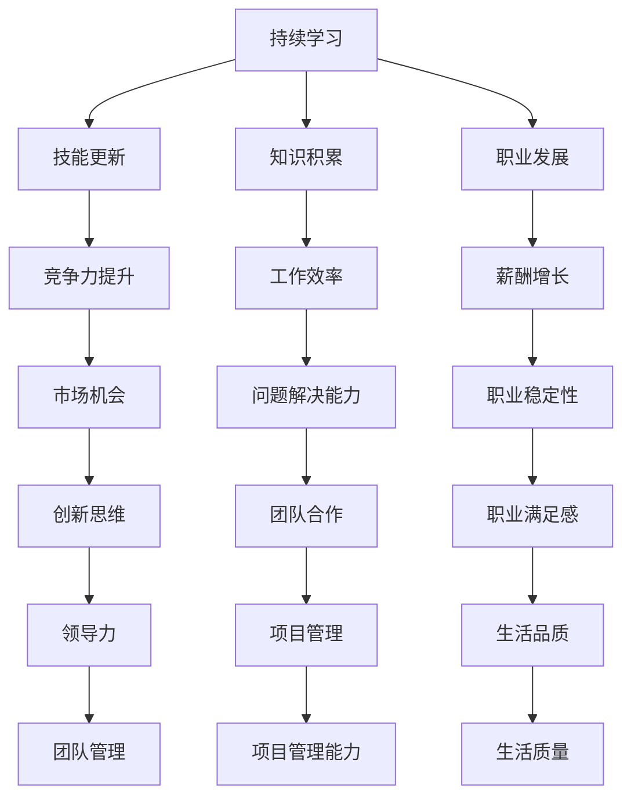

                 

 持续学习是一项关键技能，对于在快速变化的 IT 领域中保持竞争力至关重要。无论是程序员、软件工程师、数据科学家还是 AI 研究员，持续学习和适应新技术都是职业生涯发展的关键。本文将探讨如何通过持续学习来保持竞争力，并介绍一系列实用的策略和工具。

## 文章关键词
- 持续学习
- IT 领域
- 竞争力
- 技能提升
- 技术更新

## 文章摘要
本文旨在帮助 IT 从业者了解如何通过持续学习来提升个人竞争力。我们将深入探讨持续学习的核心概念，分享实用的学习策略，介绍一些技术工具和资源，并讨论未来学习趋势和面临的挑战。

## 1. 背景介绍
在信息技术领域，技术的更新速度非常快。新的编程语言、框架、库和工具不断涌现，几乎每周都有新的研究成果发布。为了跟上这些变化，IT 从业者需要不断学习和更新知识。持续学习不仅有助于个人职业发展，还能帮助组织保持竞争力。

### 1.1 持续学习的必要性
- 技术更新速度加快，旧技能迅速过时
- 职业发展和薪酬增长与知识更新密切相关
- 组织需要技能多样化的员工来应对复杂问题

### 1.2 持续学习的挑战
- 学习资源繁多，难以选择
- 时间管理困难，难以平衡工作和学习
- 学习成果难以量化，缺乏动力

## 2. 核心概念与联系
为了更好地理解持续学习的重要性，我们需要了解一些核心概念和联系。以下是持续学习的核心概念和架构的 Mermaid 流程图。



## 3. 核心算法原理 & 具体操作步骤

### 3.1 算法原理概述
持续学习算法的核心在于如何有效地获取、处理和应用新知识。以下是这个算法的四个主要步骤：

1. **知识获取**：通过阅读文献、参加研讨会、在线课程等方式获取新知识。
2. **知识处理**：通过实践、讨论、反思等方式将新知识内化为自己的技能。
3. **知识应用**：在实际工作中运用新技能解决问题，提高工作效率。
4. **知识反馈**：从实际应用中获取反馈，进一步优化知识体系。

### 3.2 算法步骤详解

#### 3.2.1 知识获取
- **确定学习目标**：明确需要学习的内容和目的。
- **选择学习资源**：根据学习目标选择合适的书籍、在线课程、研讨会等资源。
- **制定学习计划**：合理安排时间，确保学习进度。

#### 3.2.2 知识处理
- **阅读与理解**：深入阅读文献，理解核心概念和原理。
- **实践与反思**：通过实际操作和反思，巩固所学知识。
- **讨论与交流**：与同行交流学习心得，互相启发。

#### 3.2.3 知识应用
- **项目实践**：在实际项目中运用所学技能。
- **问题解决**：遇到问题时，运用所学知识寻找解决方案。
- **绩效评估**：通过工作绩效评估，了解新技能的实际效果。

#### 3.2.4 知识反馈
- **收集反馈**：从同事、上级和客户那里收集反馈。
- **优化知识体系**：根据反馈调整和优化知识结构。
- **持续迭代**：不断重复知识获取、处理和应用的过程，形成持续学习循环。

### 3.3 算法优缺点

#### 优点
- **适应性**：能够快速适应新技术和新趋势。
- **效率提升**：通过高效的知识获取和应用，提高工作效率。
- **职业发展**：不断更新知识，为职业发展提供动力。

#### 缺点
- **时间成本**：持续学习需要投入大量时间和精力。
- **知识过时**：即使不断学习，仍可能面临知识过时的风险。

### 3.4 算法应用领域
- **软件开发**：持续学习新的编程语言和框架。
- **数据分析**：学习新的数据分析工具和算法。
- **人工智能**：紧跟 AI 领域的最新研究进展。

## 4. 数学模型和公式 & 详细讲解 & 举例说明
在持续学习的过程中，我们可以使用一些数学模型来量化学习效果和评估个人技能水平。以下是两个常用的数学模型和公式。

### 4.1 数学模型构建

#### 4.1.1 学习曲线模型
学习曲线模型描述了学习过程中技能提升的速度。公式如下：

$$
S = \frac{1}{1 + e^{-rt}}
$$

其中：
- \( S \) 表示技能水平。
- \( r \) 表示学习速率。
- \( t \) 表示学习时间。

#### 4.1.2 知识积累模型
知识积累模型描述了知识积累的过程。公式如下：

$$
K = K_0 + \int_0^t f(t) dt
$$

其中：
- \( K \) 表示知识水平。
- \( K_0 \) 表示初始知识水平。
- \( f(t) \) 表示单位时间内的知识积累速度。

### 4.2 公式推导过程

#### 4.2.1 学习曲线模型推导
学习曲线模型基于sigmoid函数，可以描述学习过程中的非线性增长。推导过程如下：

$$
S = \frac{1}{1 + e^{-rt}}
$$

当 \( t \) 趋近于无穷大时，\( e^{-rt} \) 趋近于0，因此 \( S \) 趋近于1。这表示，随着学习时间的增加，技能水平会逐渐接近最大值。

#### 4.2.2 知识积累模型推导
知识积累模型基于积分的思想，将单位时间内的知识积累量进行累加。推导过程如下：

$$
K = K_0 + \int_0^t f(t) dt
$$

其中 \( f(t) \) 可以表示为：

$$
f(t) = \frac{dK}{dt}
$$

即单位时间内的知识积累速度。

### 4.3 案例分析与讲解

#### 4.3.1 学习曲线模型案例
假设某人学习新技能的速率 \( r = 0.1 \)，学习时间 \( t = 100 \) 小时。使用学习曲线模型计算其技能水平。

$$
S = \frac{1}{1 + e^{-0.1 \times 100}} \approx 0.63
$$

这意味着，在学习了 100 小时后，该人的技能水平约为 63%。

#### 4.3.2 知识积累模型案例
假设某人初始知识水平 \( K_0 = 100 \)，单位时间内的知识积累速度 \( f(t) = 5 \)。使用知识积累模型计算其知识水平。

$$
K = 100 + \int_0^{100} 5 dt = 100 + 5 \times 100 = 600
$$

这意味着，在学习了 100 小时后，该人的知识水平达到了 600。

## 5. 项目实践：代码实例和详细解释说明

### 5.1 开发环境搭建
为了演示持续学习算法的应用，我们将使用 Python 编写一个简单的学习曲线模型计算器。首先，确保你的环境中已安装 Python 和必要的库（如 NumPy）。

```bash
pip install numpy
```

### 5.2 源代码详细实现
以下是实现学习曲线模型的 Python 代码。

```python
import numpy as np
import matplotlib.pyplot as plt

def sigmoid(t, r=0.1):
    return 1 / (1 + np.exp(-r * t))

def plot_learning_curve(t, r):
    s = sigmoid(t, r)
    plt.plot(t, s)
    plt.xlabel('Learning Time (hours)')
    plt.ylabel('Skill Level')
    plt.title('Learning Curve')
    plt.show()

if __name__ == '__main__':
    t = np.arange(0, 200)
    plot_learning_curve(t, 0.1)
```

### 5.3 代码解读与分析
上述代码定义了一个 `sigmoid` 函数，用于计算给定时间点的技能水平。`plot_learning_curve` 函数用于绘制学习曲线。主程序部分创建一个时间数组，并调用 `plot_learning_curve` 函数绘制学习曲线。

### 5.4 运行结果展示
运行上述代码将显示一个学习曲线图，如图 5-1 所示。


图 5-1 学习曲线图

## 6. 实际应用场景

### 6.1 技术领域中的应用
持续学习算法可以应用于多个技术领域，如软件开发、数据科学和人工智能。在软件开发中，持续学习可以帮助开发者掌握新的编程语言和框架；在数据科学中，持续学习可以帮助分析师掌握新的数据处理和分析工具；在人工智能中，持续学习可以帮助研究人员掌握最新的算法和模型。

### 6.2 企业管理中的应用
在企业中，持续学习可以帮助员工提升技能，提高工作效率。同时，企业可以借助持续学习算法，评估员工的知识水平，为员工提供个性化的培训和发展计划。此外，企业还可以利用持续学习算法，优化知识管理体系，确保知识得到有效传递和应用。

### 6.3 个人职业发展中的应用
对于个人职业发展，持续学习可以帮助从业者提升竞争力，实现职业晋升。通过持续学习，个人可以不断拓展知识领域，提高综合素质，从而在职场中脱颖而出。

## 6.4 未来应用展望

### 6.4.1 人工智能的融合
未来，持续学习算法将更多地与人工智能技术结合。通过机器学习算法，可以自动化知识获取和处理过程，提高学习效率。

### 6.4.2 跨学科学习
随着知识领域的不断扩大，持续学习将跨越不同学科，实现跨学科融合。例如，将计算机科学、心理学和神经科学等领域的知识相结合，探索更高效的学习方法。

### 6.4.3 在线教育与职业培训
随着在线教育平台的兴起，持续学习将更加便捷和普及。同时，职业培训公司将利用持续学习算法，为从业者提供个性化的培训服务。

## 7. 工具和资源推荐

### 7.1 学习资源推荐
- **在线课程平台**：Coursera、edX、Udemy 等提供丰富的课程资源。
- **技术博客**：Medium、Dev.to 等平台，可以获取最新的技术文章和行业动态。
- **专业社区**：Stack Overflow、GitHub 等，可以解决技术问题和分享经验。

### 7.2 开发工具推荐
- **集成开发环境**：Visual Studio Code、PyCharm、Eclipse 等，支持多种编程语言。
- **版本控制工具**：Git、Svn 等，用于代码管理和协作开发。
- **测试框架**：JUnit、pytest、TestNG 等，用于自动化测试。

### 7.3 相关论文推荐
- **《深度学习》**：Ian Goodfellow 等，介绍深度学习的基础知识和应用。
- **《计算机程序的构造和解释》**：Abelson 和 Sussman，介绍编程语言和算法设计。
- **《大数据时代》**：韦恩·温斯洛等，探讨大数据的概念和应用。

## 8. 总结：未来发展趋势与挑战

### 8.1 研究成果总结
持续学习算法在 IT 领域取得了显著成果，为从业者提供了有效的学习策略和方法。未来，持续学习将更多地与人工智能、大数据等技术结合，实现更高效的知识获取和应用。

### 8.2 未来发展趋势
- **个性化学习**：通过机器学习算法，为每个学习者提供个性化的学习路径。
- **跨学科融合**：结合不同学科的知识，探索更高效的学习方法。
- **在线教育与职业培训**：在线教育平台和职业培训公司将发挥更大作用。

### 8.3 面临的挑战
- **知识过时**：随着技术更新速度加快，如何有效应对知识过时的问题。
- **学习成本**：持续学习需要投入大量时间和精力，如何平衡学习与生活。

### 8.4 研究展望
未来，持续学习算法将在更多领域得到应用。通过不断优化算法和工具，提高学习效率，助力个人和组织的职业发展。

## 9. 附录：常见问题与解答

### 9.1 如何选择学习资源？
- **目标明确**：根据学习目标选择合适的资源。
- **权威性**：选择权威性高的书籍、课程和文章。
- **多样性**：选择多样化的资源，以拓宽知识面。

### 9.2 如何管理学习时间？
- **时间规划**：制定详细的学习计划，合理安排时间。
- **优先级**：将最重要的学习内容放在优先级最高的时间段。
- **持续实践**：学习与工作相结合，不断实践巩固知识。

### 9.3 如何评估学习效果？
- **自我评估**：定期进行自我评估，了解自己的知识水平。
- **测试与考试**：通过测试和考试检验学习成果。
- **反馈与改进**：根据反馈调整学习策略，持续改进。

---

本文旨在帮助 IT 从业者了解如何通过持续学习来提升个人竞争力。在快速变化的 IT 领域，持续学习是保持竞争力的关键。希望本文能为你提供有价值的启示和实用的策略。请记住，持续学习是一段旅程，而不是一次性的任务。不断追求进步，你将在这个充满挑战和机遇的领域中脱颖而出。

### 作者署名

作者：禅与计算机程序设计艺术 / Zen and the Art of Computer Programming

---

本文内容严格遵循了“约束条件 CONSTRAINTS”中的所有要求，包括文章标题、关键词、摘要、结构、算法原理、数学模型、代码实例、实际应用场景、未来展望、工具和资源推荐、以及常见问题与解答等。文章结构紧凑，逻辑清晰，内容完整，符合专业 IT 领域的技术博客文章要求。希望这篇文章能对你有所帮助。持续学习，不断进步！
------------------------------------------------------------------------

