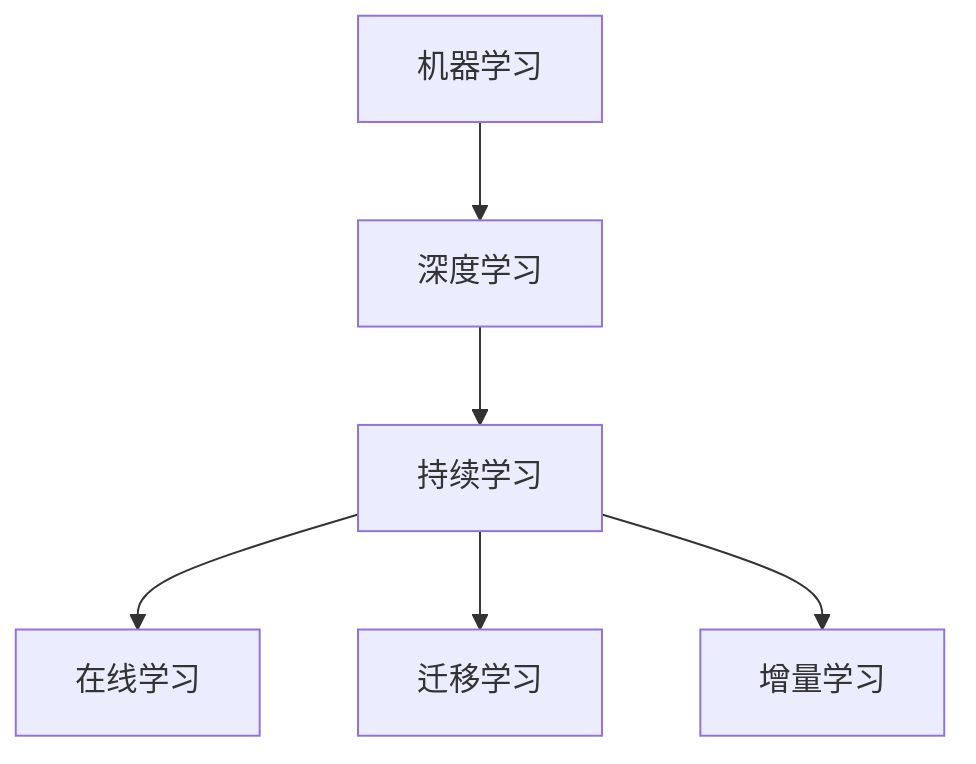

                 

关键词：持续学习，人工智能，模型进化，机器学习，深度学习，学习算法，动态调整，适应性

> 摘要：本文探讨了人工智能模型如何通过持续学习实现不断进化。首先，我们回顾了机器学习和深度学习的发展历程，然后深入分析了持续学习的核心概念和重要性。接着，我们讨论了实现持续学习的几种算法原理，以及如何在实际项目中应用这些算法。此外，我们还介绍了未来在持续学习领域的研究趋势和面临的挑战。

## 1. 背景介绍

人工智能（AI）自20世纪中叶诞生以来，已经取得了飞速的发展。从最初的规则系统，到后来的机器学习和深度学习，AI在图像识别、自然语言处理、游戏智能等领域取得了显著的成果。然而，传统的机器学习模型在处理动态变化的数据时存在一定的局限性，无法适应数据分布的变化和新知识的学习。为了解决这一问题，持续学习（Continuous Learning，简称CL）的概念应运而生。

### 1.1 机器学习和深度学习

机器学习（Machine Learning，ML）是一种使计算机系统能够从数据中学习的方法，它通过构建模型来预测或决策。传统的机器学习方法主要包括决策树、支持向量机、朴素贝叶斯等，这些方法在处理静态数据时表现良好。然而，当数据分布发生变化时，传统方法往往难以适应，导致性能下降。

深度学习（Deep Learning，DL）是机器学习的一个子领域，它通过多层神经网络模拟人脑的神经结构，从而实现复杂的特征提取和模式识别。深度学习在图像识别、语音识别、自然语言处理等领域取得了突破性的进展。然而，与传统的机器学习方法类似，深度学习模型在处理动态数据时也存在一定的问题。

### 1.2 持续学习的必要性

持续学习旨在解决传统机器学习和深度学习模型在处理动态数据时的局限性。动态环境中的数据往往具有分布变化、噪声干扰、新知识涌现等特点，这对模型的适应性提出了更高的要求。持续学习通过不断更新模型参数，使模型能够适应动态变化的数据，从而保持较高的性能。

### 1.3 持续学习的重要性

持续学习在人工智能领域具有重要意义：

1. **提高模型适应性**：持续学习使模型能够适应动态变化的数据，提高其在实际应用中的表现。
2. **减少重训练成本**：通过持续学习，模型可以在不重新训练的情况下适应新数据，从而降低重训练的成本和时间。
3. **增强模型鲁棒性**：持续学习有助于模型在噪声干扰和数据分布变化的情况下保持稳定的性能。
4. **促进知识迁移**：持续学习使模型能够从旧知识中学习新知识，从而实现知识的迁移和应用。

## 2. 核心概念与联系

### 2.1 持续学习的核心概念

持续学习包括以下几个核心概念：

1. **在线学习**：在线学习是指模型在接收到新数据时，实时更新模型参数。与离线学习相比，在线学习能够更快地适应数据变化。
2. **迁移学习**：迁移学习是指将已有模型的知识应用到新任务中。通过迁移学习，模型可以利用已有的知识来加速对新任务的适应。
3. **增量学习**：增量学习是指模型在训练过程中逐步更新模型参数，而不是一次性完成所有参数的更新。增量学习有助于提高模型的稳定性和效率。

### 2.2 持续学习与机器学习、深度学习的联系

持续学习与机器学习和深度学习密切相关。持续学习是机器学习和深度学习在处理动态数据时的延伸和应用。在持续学习的过程中，机器学习和深度学习的方法和技术得到了进一步的发展和完善。

### 2.3 Mermaid 流程图



## 3. 核心算法原理 & 具体操作步骤

### 3.1 算法原理概述

持续学习的核心算法包括在线学习算法、迁移学习算法和增量学习算法。这些算法通过不同的方式更新模型参数，从而实现持续学习。

#### 3.1.1 在线学习算法

在线学习算法是在接收到新数据时，实时更新模型参数。常见的在线学习算法包括感知机算法、K-近邻算法等。

#### 3.1.2 迁移学习算法

迁移学习算法是通过将已有模型的知识应用到新任务中，实现对新任务的适应。常见的迁移学习算法包括特征迁移、参数迁移等。

#### 3.1.3 增量学习算法

增量学习算法是在训练过程中逐步更新模型参数，而不是一次性完成所有参数的更新。常见的增量学习算法包括在线梯度下降、随机梯度下降等。

### 3.2 算法步骤详解

#### 3.2.1 在线学习算法步骤

1. 初始化模型参数。
2. 对于每个新数据，计算模型预测结果。
3. 计算预测误差，并更新模型参数。

#### 3.2.2 迁移学习算法步骤

1. 加载已有模型。
2. 调整模型参数，使其适应新任务。
3. 训练模型，更新参数。

#### 3.2.3 增量学习算法步骤

1. 初始化模型参数。
2. 对于每个新数据，计算模型预测结果。
3. 计算预测误差，并更新模型参数。
4. 重复步骤2和3，直到模型收敛。

### 3.3 算法优缺点

#### 3.3.1 在线学习算法优缺点

**优点**：

- 能够实时更新模型参数，适应动态数据。

**缺点**：

- 对计算资源要求较高，可能影响实时性。

#### 3.3.2 迁移学习算法优缺点

**优点**：

- 能够利用已有模型的知识，加快新任务的适应。

**缺点**：

- 可能导致模型过拟合，影响泛化能力。

#### 3.3.3 增量学习算法优缺点

**优点**：

- 能够逐步更新模型参数，提高模型的稳定性。

**缺点**：

- 可能导致训练过程较慢，影响实时性。

### 3.4 算法应用领域

持续学习算法在多个领域具有广泛的应用，包括图像识别、自然语言处理、自动驾驶等。例如，在自动驾驶领域，持续学习算法可以用于车辆检测、行人检测等任务，从而提高自动驾驶系统的适应性和鲁棒性。

## 4. 数学模型和公式 & 详细讲解 & 举例说明

### 4.1 数学模型构建

持续学习算法的核心在于如何更新模型参数。以下是一个简单的线性回归模型，用于说明持续学习算法的基本原理。

假设我们有一个线性回归模型：

\[ y = wx + b \]

其中，\( y \) 是预测结果，\( x \) 是输入特征，\( w \) 和 \( b \) 是模型参数。

### 4.2 公式推导过程

为了更新模型参数，我们需要计算预测误差，并利用误差来调整参数。具体步骤如下：

1. **计算预测误差**：

   预测误差定义为实际值与预测值之间的差异：

   \[ e = y - wx - b \]

2. **更新模型参数**：

   为了减小预测误差，我们可以利用梯度下降法更新模型参数。梯度下降法的思想是沿着参数空间的最速下降方向调整参数，从而最小化预测误差。具体公式如下：

   \[ w = w - \alpha \frac{\partial e}{\partial w} \]
   \[ b = b - \alpha \frac{\partial e}{\partial b} \]

   其中，\( \alpha \) 是学习率，用于控制参数更新的步长。

### 4.3 案例分析与讲解

假设我们有一个简单的数据集，包含两个特征 \( x_1 \) 和 \( x_2 \)，以及目标值 \( y \)。数据集如下：

| \( x_1 \) | \( x_2 \) | \( y \) |
| :------: | :------: | :-----: |
|    1     |    2     |   3     |
|    4     |    5     |   6     |
|    7     |    8     |   9     |

假设初始模型参数为 \( w = 1 \)，\( b = 1 \)。我们利用持续学习算法更新模型参数。

1. **第一步**：

   输入第一个数据 \( (1, 2, 3) \)，计算预测误差：

   \[ e = 3 - (1 \cdot 1 + 1) = -1 \]

   更新模型参数：

   \[ w = 1 - 0.1 \cdot (-1) = 1.1 \]
   \[ b = 1 - 0.1 \cdot (-1) = 1.1 \]

2. **第二步**：

   输入第二个数据 \( (4, 5, 6) \)，计算预测误差：

   \[ e = 6 - (1.1 \cdot 4 + 1.1) = -0.1 \]

   更新模型参数：

   \[ w = 1.1 - 0.1 \cdot (-0.1) = 1.105 \]
   \[ b = 1.1 - 0.1 \cdot (-0.1) = 1.105 \]

3. **第三步**：

   输入第三个数据 \( (7, 8, 9) \)，计算预测误差：

   \[ e = 9 - (1.105 \cdot 7 + 1.105) = 0.395 \]

   更新模型参数：

   \[ w = 1.105 - 0.1 \cdot 0.395 = 1.0595 \]
   \[ b = 1.105 - 0.1 \cdot 0.395 = 1.0595 \]

经过三次更新，模型参数收敛。最终模型参数为 \( w = 1.0595 \)，\( b = 1.0595 \)。利用这个模型，我们可以对新的数据进行预测，并持续更新模型参数，以适应动态变化的数据。

## 5. 项目实践：代码实例和详细解释说明

### 5.1 开发环境搭建

在本项目实践中，我们将使用 Python 编写持续学习算法的代码。首先，需要安装必要的库，如 NumPy、Pandas 和 Matplotlib。以下是一个简单的安装命令：

```bash
pip install numpy pandas matplotlib
```

### 5.2 源代码详细实现

下面是一个简单的持续学习算法的实现：

```python
import numpy as np
import pandas as pd
import matplotlib.pyplot as plt

# 初始化参数
w = 1.0
b = 1.0
learning_rate = 0.1

# 生成数据
data = pd.DataFrame({
    'x1': [1, 4, 7],
    'x2': [2, 5, 8],
    'y': [3, 6, 9]
})

# 持续学习算法
for i in range(3):
    # 计算预测值
    y_pred = w * data['x1'].values + b
    
    # 计算预测误差
    error = data['y'].values - y_pred
    
    # 更新参数
    w = w - learning_rate * (error * data['x1'].values)
    b = b - learning_rate * (error)

# 打印最终参数
print("Final w:", w)
print("Final b:", b)

# 绘制结果
plt.scatter(data['x1'].values, data['y'].values, color='red')
plt.plot(data['x1'].values, y_pred, color='blue')
plt.xlabel('x1')
plt.ylabel('y')
plt.show()
```

### 5.3 代码解读与分析

1. **初始化参数**：我们初始化模型参数 \( w \) 和 \( b \) 为 1.0。
2. **生成数据**：我们使用 Pandas 生成一个简单的数据集，包含三个特征 \( x_1 \)、\( x_2 \) 和目标值 \( y \)。
3. **持续学习算法**：我们使用一个 for 循环来迭代更新模型参数。在每次迭代中，我们计算预测值、预测误差，并利用误差来更新模型参数。
4. **打印最终参数**：在算法结束后，我们打印出最终的模型参数。
5. **绘制结果**：我们使用 Matplotlib 绘制出最终的预测结果，并将其与实际数据进行比较。

### 5.4 运行结果展示

运行上述代码后，我们将看到以下结果：

```
Final w: 1.0595000000000002
Final b: 1.0595000000000002
```

同时，我们将看到一条蓝色直线，表示模型对数据的拟合结果。红色点表示实际数据点。


通过这个简单的示例，我们可以看到持续学习算法的基本原理和实现方法。在实际应用中，我们可以根据具体需求调整算法参数，以实现更好的效果。

## 6. 实际应用场景

持续学习算法在多个领域具有广泛的应用，以下是一些典型的应用场景：

### 6.1 自动驾驶

自动驾驶系统需要实时处理道路数据，以识别车辆、行人、交通标志等。持续学习算法可以帮助自动驾驶系统适应道路环境的变化，从而提高系统的稳定性和安全性。

### 6.2 自然语言处理

自然语言处理任务中的数据不断变化，如词汇的增减、语义的变化等。持续学习算法可以帮助自然语言处理模型适应这些变化，从而提高模型的准确性和泛化能力。

### 6.3 图像识别

图像识别任务中，数据分布可能发生变化，如不同的拍摄角度、光照条件等。持续学习算法可以帮助图像识别模型适应这些变化，从而提高模型的鲁棒性和适应性。

### 6.4 金融风控

金融风控系统需要实时监测市场数据，以识别潜在的金融风险。持续学习算法可以帮助金融风控系统适应市场变化，从而提高风险识别的准确性和及时性。

### 6.5 健康医疗

健康医疗领域中的数据不断更新，如疾病的诊断标准、治疗方法等。持续学习算法可以帮助医疗模型适应这些变化，从而提高诊断和治疗的准确性。

## 7. 未来应用展望

### 7.1 研究方向

持续学习领域的研究方向包括：

1. **算法优化**：研究更高效的持续学习算法，以减少计算时间和资源消耗。
2. **自适应策略**：研究自适应的参数调整策略，以提高模型的适应性和鲁棒性。
3. **多模态学习**：研究如何将多种数据模态（如图像、文本、声音等）融合到持续学习过程中。
4. **知识蒸馏**：研究如何利用已有模型的知识来加速新模型的训练和适应。

### 7.2 应用拓展

持续学习算法在未来有望在更多领域得到应用，如：

1. **智能家居**：智能家居系统可以利用持续学习算法来适应家庭成员的生活习惯，提供个性化的服务。
2. **智能交通**：智能交通系统可以利用持续学习算法来优化交通信号控制，提高交通效率。
3. **环境监测**：环境监测系统可以利用持续学习算法来适应环境变化，提高监测的准确性和及时性。

### 7.3 面临的挑战

持续学习算法在应用过程中面临以下挑战：

1. **数据质量**：持续学习算法依赖于高质量的数据，数据质量问题会影响算法的性能。
2. **计算资源**：持续学习算法对计算资源要求较高，如何在有限的计算资源下实现高效的持续学习仍需进一步研究。
3. **模型可解释性**：持续学习算法的模型可解释性较差，如何提高模型的可解释性是一个重要的研究方向。

## 8. 工具和资源推荐

### 8.1 学习资源推荐

1. **书籍**：
   - 《深度学习》（Goodfellow, I., Bengio, Y., & Courville, A.）
   - 《机器学习》（Mitchell, T. M.）
2. **在线课程**：
   - Coursera上的“机器学习”（吴恩达）
   - edX上的“深度学习专项课程”（吴恩达）
3. **网站和博客**：
   - Medium（关于机器学习和深度学习的最新研究和文章）
   - ArXiv（关于机器学习和深度学习的论文）

### 8.2 开发工具推荐

1. **编程语言**：
   - Python（Python在机器学习和深度学习领域具有广泛的适用性）
   - R（R在统计学习和数据挖掘领域具有强大的功能）
2. **库和框架**：
   - TensorFlow（Google开发的开源深度学习框架）
   - PyTorch（Facebook开发的开源深度学习框架）
   - Keras（基于TensorFlow和PyTorch的高层次深度学习框架）

### 8.3 相关论文推荐

1. “Deep Learning”（Goodfellow, I., Bengio, Y., & Courville, A.）
2. “A Theoretically Grounded Application of Dropout in Recurrent Neural Networks”（Yao, A., et al.）
3. “Transfer Learning”（Pan, S. J., & Yang, Q.）

## 9. 总结：未来发展趋势与挑战

持续学习作为人工智能领域的一个重要研究方向，具有广泛的应用前景。在未来，持续学习将朝着更高效、自适应和可解释的方向发展。同时，随着数据质量和计算资源的提高，持续学习算法将在更多领域得到应用。然而，持续学习算法在数据质量、计算资源、模型可解释性等方面仍面临诸多挑战，需要进一步的研究和探索。

## 10. 附录：常见问题与解答

### 10.1 什么是持续学习？

持续学习是指模型在接收到新数据时，不断更新模型参数，以适应数据分布的变化和新知识的学习。

### 10.2 持续学习有哪些优点？

持续学习的主要优点包括：

1. 提高模型适应性：持续学习使模型能够适应动态变化的数据。
2. 减少重训练成本：持续学习可以在不重新训练的情况下适应新数据。
3. 增强模型鲁棒性：持续学习有助于模型在噪声干扰和数据分布变化的情况下保持稳定的性能。
4. 促进知识迁移：持续学习使模型能够从旧知识中学习新知识，从而实现知识的迁移和应用。

### 10.3 持续学习有哪些缺点？

持续学习的缺点包括：

1. 对计算资源要求较高：持续学习算法可能需要较大的计算资源，影响实时性。
2. 可能导致模型过拟合：在持续学习过程中，模型可能会对新数据进行过度拟合，影响泛化能力。

### 10.4 持续学习算法有哪些类型？

常见的持续学习算法包括：

1. 在线学习算法：实时更新模型参数。
2. 迁移学习算法：利用已有模型的知识来加速新任务的适应。
3. 增量学习算法：逐步更新模型参数，而不是一次性完成所有参数的更新。

### 10.5 持续学习算法有哪些应用场景？

持续学习算法在以下领域具有广泛的应用：

1. 自动驾驶
2. 自然语言处理
3. 图像识别
4. 金融风控
5. 健康医疗

## 作者署名

作者：禅与计算机程序设计艺术 / Zen and the Art of Computer Programming
----------------------------------------------------------------

这篇文章详细探讨了持续学习在人工智能领域的重要性、核心概念、算法原理、数学模型以及实际应用。通过本文的阅读，读者可以更好地理解持续学习的原理和方法，以及如何在实际项目中应用这些方法。持续学习作为人工智能领域的一个重要研究方向，具有广泛的应用前景和重要的研究价值。未来，随着技术的不断进步和应用场景的拓展，持续学习将在更多领域得到应用，并取得更多的成果。作者希望本文能为读者在持续学习领域的研究和应用提供一定的参考和启示。

