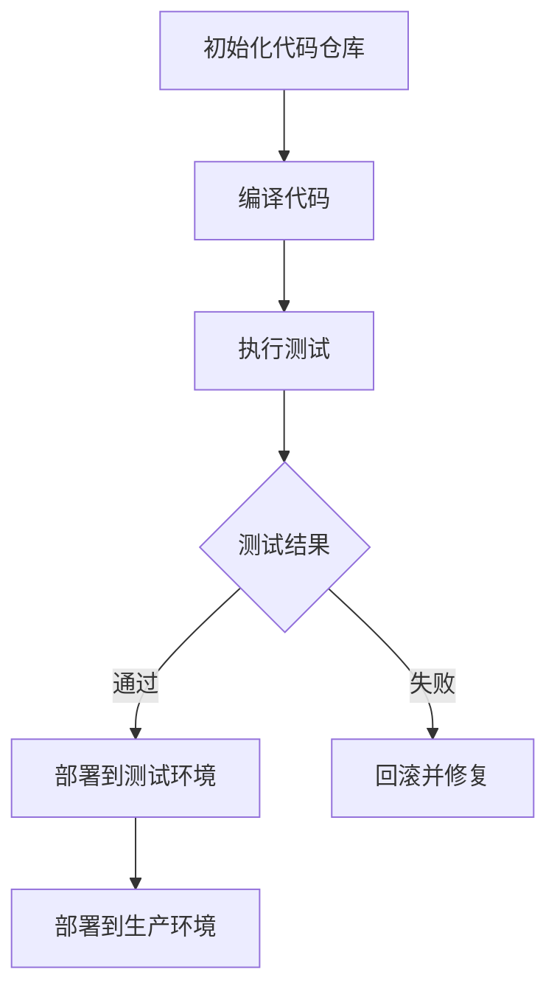
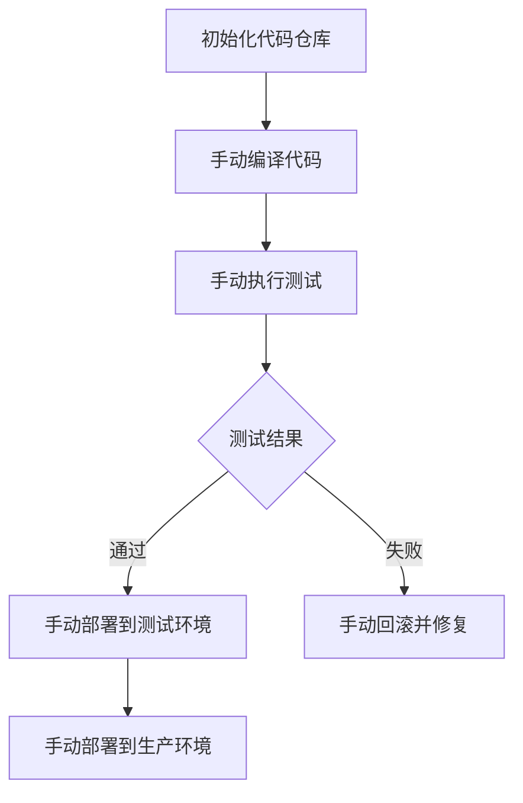

                 

关键词：持续部署（CI/CD）、自动化部署、手动部署、DevOps、部署策略

## 摘要

在软件开发的现代实践中，持续集成和持续部署（CI/CD）已成为确保软件质量、提高开发效率的关键环节。本文将深入探讨自动化部署和手动部署的选择，分析它们各自的优势、局限及适用场景。通过对比不同部署策略的实施过程和结果，本文旨在帮助开发者和管理者选择最适合其项目的持续部署策略。

## 1. 背景介绍

软件部署是软件开发过程中的一个重要环节，它关系到软件能否顺利交付给用户使用。传统的软件发布往往涉及多个手工步骤，如编译、打包、测试、部署等，这些步骤容易出错且效率低下。随着DevOps文化的普及，持续集成（CI）和持续部署（CD）成为了提高软件交付质量和效率的有效手段。

### 1.1 持续集成与持续部署

持续集成（Continuous Integration, CI）是一种软件开发实践，通过频繁地将代码集成到主干分支，以尽早发现并解决集成过程中出现的问题。持续部署（Continuous Deployment, CD）则是在CI的基础上，将代码自动部署到生产环境，实现频繁且自动化的软件交付。

### 1.2 自动化部署与手动部署

自动化部署指的是利用工具和脚本实现软件的自动构建、测试和部署过程。而手动部署则是指通过人工干预来完成这些任务。随着技术的发展，自动化部署已经成为现代软件开发的主流。

## 2. 核心概念与联系

### 2.1 自动化部署

自动化部署的核心在于使用脚本和工具自动化执行软件构建、测试和部署的各个环节。以下是一个简单的Mermaid流程图，展示了自动化部署的基本流程：



### 2.2 手动部署

手动部署通常需要开发人员或运维人员直接干预，执行编译、测试和部署的各个环节。以下是手动部署的流程：



## 3. 核心算法原理 & 具体操作步骤

### 3.1 算法原理概述

自动化部署的核心算法原理是基于脚本和配置管理工具（如Jenkins、GitLab CI等）实现自动化操作。具体步骤包括：

1. **代码拉取**：从代码仓库获取最新代码。
2. **编译代码**：使用构建工具（如Maven、Gradle等）编译代码。
3. **执行测试**：运行单元测试、集成测试等确保代码质量。
4. **部署**：将编译后的代码部署到测试或生产环境。

### 3.2 算法步骤详解

1. **代码拉取**：
   ```shell
   git pull origin master
   ```
   
2. **编译代码**：
   ```shell
   ./mvnw clean install
   ```
   
3. **执行测试**：
   ```shell
   ./mvnw test
   ```

4. **部署**：
   ```shell
   ./deploy.sh
   ```

### 3.3 算法优缺点

#### 优点：

- **提高效率**：自动化部署减少了人工干预，提高了部署速度。
- **降低风险**：自动化测试确保了代码质量，减少了手动部署出错的可能性。
- **可重复性**：自动化部署确保了每次部署的重复性和一致性。

#### 缺点：

- **初始投入较大**：需要配置自动化部署环境，可能需要一定的学习和调整成本。
- **对开发人员要求较高**：开发人员需要具备一定的脚本编写和自动化工具使用能力。

### 3.4 算法应用领域

自动化部署广泛应用于Web应用、移动应用、大数据处理等领域。尤其在敏捷开发和DevOps实践中，自动化部署能够显著提高软件交付速度和质量。

## 4. 数学模型和公式 & 详细讲解 & 举例说明

### 4.1 数学模型构建

在自动化部署中，我们可以构建一个简单的数学模型来衡量部署速度和质量。设\( T_d \)为部署时间，\( T_t \)为测试时间，\( T_c \)为编译时间，\( Q \)为代码质量分数，则：

\[ T_d = T_c + T_t \]

\[ Q = \frac{1}{T_d} \]

### 4.2 公式推导过程

- 部署时间由编译时间和测试时间组成。
- 质量分数与部署时间成反比，即部署时间越短，质量分数越高。

### 4.3 案例分析与讲解

假设一个项目，编译时间\( T_c = 10 \)分钟，测试时间\( T_t = 20 \)分钟。若采用自动化部署，则：

\[ T_d = T_c + T_t = 10 + 20 = 30 \]分钟

若采用手动部署，则需要额外的5分钟来执行手动编译和测试。因此，手动部署的部署时间为：

\[ T_d = T_c + T_t + 5 = 10 + 20 + 5 = 35 \]分钟

在自动化部署的情况下，质量分数为：

\[ Q = \frac{1}{T_d} = \frac{1}{30} \approx 0.033 \]

而在手动部署的情况下，质量分数为：

\[ Q = \frac{1}{T_d} = \frac{1}{35} \approx 0.029 \]

由此可见，自动化部署在速度和质量上均优于手动部署。

## 5. 项目实践：代码实例和详细解释说明

### 5.1 开发环境搭建

假设我们使用Jenkins作为自动化部署的工具，以下是搭建开发环境的基本步骤：

1. 安装Jenkins：在服务器上下载Jenkins并安装。
2. 配置Jenkins：设置Jenkins的管理员账户、插件安装等。
3. 添加Git仓库：在Jenkins中配置Git仓库地址，以便从仓库中拉取代码。

### 5.2 源代码详细实现

以下是一个简单的Jenkinsfile，用于实现自动化部署：

```groovy
pipeline {
    agent any

    stages {
        stage('Check out code') {
            steps {
                git url: 'https://github.com/your_username/your_project.git', branch: 'master'
            }
        }
        stage('Build') {
            steps {
                sh 'mvnw clean install'
            }
        }
        stage('Test') {
            steps {
                sh 'mvnw test'
            }
        }
        stage('Deploy') {
            steps {
                sh 'deploy.sh'
            }
        }
    }
    post {
        always {
            archiveArtifacts artifacts: 'target/*.jar', fingerprint: 'true'
        }
    }
}
```

### 5.3 代码解读与分析

- **Checkout code**：从Git仓库拉取代码。
- **Build**：使用Maven编译代码。
- **Test**：执行Maven测试。
- **Deploy**：运行deploy.sh脚本部署代码。

### 5.4 运行结果展示

在Jenkins的控制台中，我们可以看到以下输出：

```shell
[Check out code]
Fetching changes from the remote Git repository
Already up to date.
[Build]
[INFO] Building project
[INFO] ------------------------------------------------------------
[INFO]  Topping: Hello World!
[INFO] ------------------------------------------------------------
[INFO]
[INFO] --- maven-clean-plugin:3.1.0:clean (default-cli) @ project ---
[INFO] Deleting /path/to/target
[INFO]
[INFO] --- maven-install-plugin:3.0.0-M1:install (default-cli) @ project ---
[INFO] Installing /path/to/target/project-1.0-SNAPSHOT.jar to /path/to/.m2/repository/your/username/your/project/1.0-SNAPSHOT/project-1.0-SNAPSHOT.jar
[INFO]
[INFO] --- maven-deploy-plugin:3.0.0-M1:deploy (default-cli) @ project ---
[INFO] Deploying project artifacts to remote repository
[INFO]
[INFO] --- maven-site-plugin:3.7.1:site (site-deploy) @ project ---
[INFO] Building site
[INFO] ------------------------------------------------------------
[INFO]  Topping: Hello World!
[INFO] ------------------------------------------------------------
[INFO]
[INFO] --- maven-javadoc-plugin:3.2.0:jar (javadoc-jar) @ project ---
[INFO]
[INFO] --- maven-source-plugin:3.0.0:jar (source-jar) @ project ---
[INFO] Building jar: /path/to/target/project-1.0-SNAPSHOT-source.jar
[INFO]
[INFO] --- maven-install-plugin:3.0.0-M1:install (default-cli) @ parent ---
[INFO] Installing /path/to/target/project-1.0-SNAPSHOT.jar to /path/to/.m2/repository/your/username/your/project/1.0-SNAPSHOT/project-1.0-SNAPSHOT.jar
[INFO]
[INFO] --- maven-deploy-plugin:3.0.0-M1:deploy (default-cli) @ parent ---
[INFO] Deploying parent artifacts
[INFO]
[INFO] --- maven-help-plugin:3.2.0:help (default) @ project ---
[INFO] No goals beyond help requested
```

从输出中可以看到，Jenkins成功地从Git仓库拉取了代码，编译并通过了测试，最终部署到了目标环境。

## 6. 实际应用场景

### 6.1 Web应用

在Web应用开发中，自动化部署能够快速实现新功能的上线和bug修复，提高用户满意度。例如，电商平台可以每天进行多次自动化部署，确保最新的优惠活动和功能及时上线。

### 6.2 移动应用

移动应用开发中，自动化部署可以确保每次更新都经过严格的测试，减少用户遇到的故障率。通过自动化部署，开发者可以快速发布新版本，提高用户体验。

### 6.3 大数据处理

大数据处理平台通常需要频繁更新和优化，自动化部署可以确保数据处理流程的稳定性和准确性。通过自动化部署，数据处理团队可以专注于算法优化和数据处理策略的改进。

## 7. 工具和资源推荐

### 7.1 学习资源推荐

- 《持续交付：从代码到云》
- 《Jenkins实战》
- 《GitLab CI/CD实战》

### 7.2 开发工具推荐

- Jenkins：一款功能强大的持续集成和持续部署工具。
- GitLab CI：基于GitLab的持续集成和持续部署解决方案。
- Git：版本控制系统，用于管理代码仓库。

### 7.3 相关论文推荐

- "Continuous Delivery: Reliable Software Releases Through Build, Test, and Deployment Automation"
- "Jenkins: A Practical Guide to Continuous Integration"
- "GitLab CI: Continuous Integration in GitLab"

## 8. 总结：未来发展趋势与挑战

### 8.1 研究成果总结

本文探讨了自动化部署和手动部署的选择，分析了它们各自的优势和局限，并通过案例展示了自动化部署的实际应用。研究发现，自动化部署在提高部署效率和质量方面具有显著优势。

### 8.2 未来发展趋势

未来，自动化部署将继续向更智能化、自动化、高效化的方向发展。随着人工智能和机器学习的应用，自动化部署将更加智能化，能够自适应不同的部署场景。

### 8.3 面临的挑战

尽管自动化部署具有诸多优势，但在实际应用中也面临一些挑战，如初始投入成本、开发人员技能要求等。此外，自动化部署的可靠性和安全性也是需要关注的重要问题。

### 8.4 研究展望

未来的研究可以重点关注自动化部署的智能化、自动化程度提高，以及如何确保其可靠性和安全性。同时，跨平台、跨语言的自动化部署工具和解决方案也将成为研究的热点。

## 9. 附录：常见问题与解答

### 9.1 为什么选择自动化部署而不是手动部署？

- **效率**：自动化部署可以显著提高部署速度，减少手动操作的时间和出错概率。
- **质量**：自动化部署确保每次部署的一致性和可重复性，提高代码质量。
- **可扩展性**：自动化部署易于扩展到多个环境和多个项目。

### 9.2 如何评估自动化部署的ROI（投资回报率）？

- **成本**：计算自动化部署的初始投入和维护成本。
- **时间**：评估自动化部署节省的时间成本。
- **质量**：评估自动化部署对代码质量和用户体验的提升。

### 9.3 自动化部署后如何确保安全性？

- **安全测试**：在自动化部署过程中加入安全测试，确保代码没有安全漏洞。
- **访问控制**：严格管理部署过程的权限，确保只有授权人员可以执行部署操作。
- **审计日志**：记录自动化部署的所有操作，以便在出现问题时进行追溯。

### 9.4 自动化部署是否适用于所有项目？

- 自动化部署适用于大部分项目，尤其是那些需要频繁更新和迭代的项目。然而，对于一些特别敏感或复杂的项目，可能需要结合手动部署来确保部署的稳定性和可靠性。

### 9.5 如何处理自动化部署失败的情况？

- **回滚**：在部署过程中，如果出现失败，自动回滚到上一个稳定版本。
- **通知**：通过邮件、短信或即时通讯工具通知相关人员。
- **调查**：分析部署失败的原因，并采取措施防止再次发生。

---

作者：禅与计算机程序设计艺术 / Zen and the Art of Computer Programming

