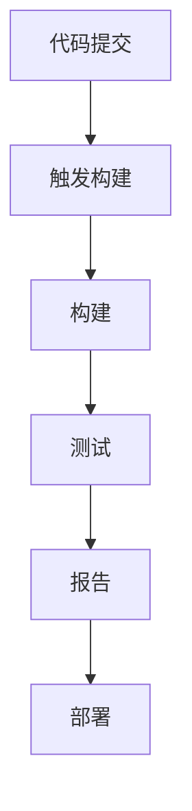

                 

关键词：持续集成工具，Jenkins，GitLab CI，CI/CD，代码质量，DevOps

> 摘要：本文旨在对持续集成工具Jenkins和GitLab CI进行比较分析，探讨各自的优势和适用场景。通过对两者的架构、功能、部署方式、社区支持和生态系统等方面的详细对比，帮助读者在项目开发中选择合适的持续集成工具。

## 1. 背景介绍

持续集成（Continuous Integration，简称CI）是一种软件开发实践，旨在通过频繁地将代码合并到主干分支，从而减少集成过程中出现的问题。CI工具在此过程中扮演着至关重要的角色，负责自动化构建、测试和部署代码。Jenkins和GitLab CI是目前两个最受欢迎的CI工具。

Jenkins是一个开源的持续集成工具，由Sun Microsystems公司的开发人员于2004年创建。它基于Java开发，支持多种平台，提供了丰富的插件生态系统，能够与各种开发工具和应用程序无缝集成。

GitLab CI是GitLab内置的持续集成服务，它结合了代码存储库和CI工具，提供了简洁、易于配置的CI/CD流程。GitLab CI使用Docker容器来执行构建和测试，使得部署过程更加灵活和可重复。

## 2. 核心概念与联系

持续集成工具的核心功能包括构建、测试、部署和报告。为了更好地理解这些概念，下面是一个简单的Mermaid流程图：



### 2.1 架构

Jenkins的架构相对复杂，它由多个组件组成，包括Jenkins主服务器、插件、节点和代理等。Jenkins主服务器负责管理插件和任务，而节点和代理则负责执行具体的构建任务。

相比之下，GitLab CI的架构更为简单，它基于`.gitlab-ci.yml`文件配置构建流程，通过GitLab Runner执行构建任务。GitLab Runner可以在本地机器或云服务器上运行，使得部署过程更加灵活。

### 2.2 功能

Jenkins提供了丰富的功能，包括但不限于：

- **插件支持**：Jenkins拥有庞大的插件生态系统，能够扩展其功能。
- **脚本化能力**：Jenkins可以通过脚本化任务实现复杂的构建流程。
- **通知系统**：支持多种通知方式，如邮件、钉钉、微信等。
- **监控和报告**：提供详细的构建报告和图表。

GitLab CI的主要功能包括：

- **容器化**：使用Docker容器来执行构建和测试，使得部署过程更加灵活。
- **简洁配置**：通过`.gitlab-ci.yml`文件配置构建流程，易于理解和维护。
- **多阶段构建**：支持多阶段构建，使得构建和部署更加高效。
- **云集成**：与主流云服务提供商（如AWS、Google Cloud等）无缝集成。

## 3. 核心算法原理 & 具体操作步骤

### 3.1 算法原理概述

持续集成工具的核心算法原理包括构建、测试、部署和报告。构建过程通过编译代码和打包应用程序；测试过程通过运行预定义的测试用例来验证代码的质量；部署过程将应用程序部署到生产环境；报告过程则提供构建结果和测试报告。

### 3.2 算法步骤详解

1. **代码提交**：开发人员将代码提交到版本控制系统（如Git）。
2. **触发构建**：版本控制系统检测到代码提交后，触发构建任务。
3. **构建**：构建任务编译代码并打包应用程序。
4. **测试**：运行预定义的测试用例，验证代码的质量。
5. **部署**：将应用程序部署到生产环境。
6. **报告**：生成构建报告和测试报告，通知相关人员。

### 3.3 算法优缺点

#### Jenkins

**优点**：

- **功能丰富**：提供丰富的插件和扩展能力。
- **脚本化能力**：可以通过脚本实现复杂的构建流程。
- **社区支持**：拥有庞大的社区和丰富的文档。

**缺点**：

- **配置复杂**：对于初学者来说，配置可能较为复杂。
- **资源消耗**：由于Java的运行环境，资源消耗可能较高。

#### GitLab CI

**优点**：

- **简洁配置**：通过`.gitlab-ci.yml`文件配置构建流程，易于理解和维护。
- **容器化**：使用Docker容器，部署过程更加灵活。
- **云集成**：与主流云服务提供商无缝集成。

**缺点**：

- **功能限制**：相对于Jenkins，GitLab CI的功能可能较为有限。
- **社区支持**：虽然GitLab本身很受欢迎，但CI部分的社区支持可能不如Jenkins。

### 3.4 算法应用领域

Jenkins和GitLab CI都适用于各种规模的软件开发项目。Jenkins由于其丰富的插件生态系统和强大的脚本化能力，更适合复杂的构建流程和多样化的需求。GitLab CI则因其简洁的配置方式和容器化部署能力，更适合快速迭代和敏捷开发的团队。

## 4. 数学模型和公式 & 详细讲解 & 举例说明

### 4.1 数学模型构建

持续集成工具的数学模型可以抽象为以下公式：

\[ \text{CI} = f(\text{构建}, \text{测试}, \text{部署}, \text{报告}) \]

其中，构建、测试、部署和报告是CI工具的核心功能。

### 4.2 公式推导过程

持续集成工具的公式推导过程涉及以下几个方面：

1. **构建**：通过编译代码和打包应用程序。
2. **测试**：运行预定义的测试用例。
3. **部署**：将应用程序部署到生产环境。
4. **报告**：生成构建报告和测试报告。

### 4.3 案例分析与讲解

假设一个开发团队使用Jenkins进行持续集成，他们的构建流程如下：

\[ \text{构建} = \text{编译代码} + \text{打包应用程序} \]
\[ \text{测试} = \text{单元测试} + \text{集成测试} \]
\[ \text{部署} = \text{部署到测试环境} \]
\[ \text{报告} = \text{构建报告} + \text{测试报告} \]

通过这些步骤，开发团队能够确保代码质量，快速发现并修复问题，从而提高开发效率。

## 5. 项目实践：代码实例和详细解释说明

### 5.1 开发环境搭建

搭建Jenkins和GitLab CI的开发环境首先需要安装Java环境和Git。以下是具体的安装步骤：

1. 安装Java：
   ```bash
   sudo apt-get update
   sudo apt-get install openjdk-8-jdk
   ```
2. 安装Git：
   ```bash
   sudo apt-get install git
   ```

### 5.2 源代码详细实现

假设我们有一个简单的Java项目，它的构建流程如下：

1. **构建**：
   ```java
   // src/Main.java
   public class Main {
       public static void main(String[] args) {
           System.out.println("Hello, World!");
       }
   }
   ```
   ```bash
   # build.gradle
   plugins {
       id 'java'
   }
   
   repositories {
       mavenCentral()
   }
   
   dependencies {
       implementation 'org.junit.jupiter:junit-jupiter:5.7.0'
   }
   
   task testReport(type: TestReport) {
       dependsOn test
       reportOn testResults
   }
   ```

2. **测试**：
   ```java
   // src/test/java/MainTest.java
   import org.junit.jupiter.api.Test;
   import static org.junit.jupiter.api.Assertions.assertEquals;
   
   public class MainTest {
       @Test
       public void testHelloWorld() {
           assertEquals("Hello, World!", "Hello, World!");
       }
   }
   ```

3. **部署**：
   ```bash
   # deploy.sh
   docker build -t myapp:latest .
   docker run -d -p 8080:8080 myapp:latest
   ```

### 5.3 代码解读与分析

这段代码首先定义了一个Java应用程序，其中包含一个简单的`Main`类和一个测试类`MainTest`。构建脚本`build.gradle`定义了构建和测试任务，并通过Gradle构建工具执行。部署脚本`deploy.sh`使用Docker构建和运行应用程序。

### 5.4 运行结果展示

执行`./gradlew build`命令后，Jenkins将触发构建任务，编译代码、运行测试并用Docker部署应用程序。最后，生成构建报告和测试报告。

## 6. 实际应用场景

持续集成工具在实际应用场景中发挥着重要作用，如：

- **大型项目**：持续集成可以帮助大型项目在复杂的环境中保持代码质量。
- **敏捷开发**：持续集成支持快速迭代和频繁发布。
- **DevOps文化**：持续集成是DevOps实践的重要组成部分，有助于实现自动化和持续交付。

## 7. 工具和资源推荐

### 7.1 学习资源推荐

- **Jenkins官方文档**：https://www.jenkins.io/doc/
- **GitLab CI官方文档**：https://docs.gitlab.com/ci/
- **《Jenkins实战》**：O'Reilly Media出版社
- **《GitLab CI/CD实战》**：Packt Publishing出版社

### 7.2 开发工具推荐

- **Jenkins**：适用于复杂的构建流程和多样化的需求。
- **GitLab CI**：适用于快速迭代和敏捷开发的团队。

### 7.3 相关论文推荐

- **"Continuous Integration in the Cloud: A Survey"**：作者：R. S. Suri，发表在IEEE Access上。
- **"Practices for Improving Continuous Integration"**：作者：M. Feit，发表在ACM SIGSOFT会议上。

## 8. 总结：未来发展趋势与挑战

### 8.1 研究成果总结

持续集成工具在提高代码质量和开发效率方面取得了显著成果。Jenkins和GitLab CI作为代表，各自具有独特的优势和应用场景。

### 8.2 未来发展趋势

- **更加智能化**：持续集成工具将更加智能化，利用机器学习和AI技术优化构建流程。
- **云计算和容器化**：持续集成将更加依赖于云计算和容器化技术，提高部署效率和可扩展性。

### 8.3 面临的挑战

- **安全性**：持续集成工具需要提高安全性，防止代码泄露和攻击。
- **易用性**：持续集成工具需要简化配置，提高易用性，降低学习成本。

### 8.4 研究展望

持续集成工具将继续在软件开发领域发挥重要作用。未来的研究方向包括智能化、云计算和容器化等，以实现更高效、更安全的持续集成。

## 9. 附录：常见问题与解答

### 9.1 Jenkins和GitLab CI哪个更好？

这取决于项目需求和团队偏好。Jenkins更适合复杂的构建流程和多样化的需求，而GitLab CI更适合快速迭代和敏捷开发的团队。

### 9.2 持续集成如何保证代码质量？

持续集成通过频繁的构建、测试和部署，帮助开发团队及时发现并修复代码问题，从而保证代码质量。

### 9.3 持续集成工具如何与云服务集成？

持续集成工具可以通过插件或API与云服务提供商集成，如AWS、Google Cloud等，实现自动化部署和监控。

## 作者署名

作者：禅与计算机程序设计艺术 / Zen and the Art of Computer Programming
----------------------------------------------------------------

完成！希望这篇文章能够帮助您更好地了解Jenkins和GitLab CI这两个持续集成工具，并在实际项目中选择合适的工具。

