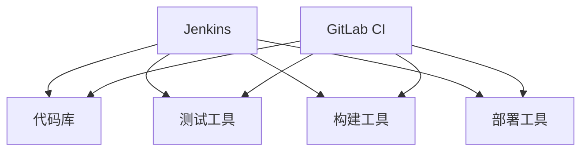

                 

关键词：持续集成，Jenkins，GitLab CI，工具比较，架构，优势，劣势，应用领域

> 摘要：本文将对比分析Jenkins和GitLab CI这两种持续集成工具，探讨它们的架构设计、功能特点、使用场景以及优势与劣势，以帮助读者更好地选择适合自己项目的持续集成解决方案。

## 1. 背景介绍

持续集成（Continuous Integration，CI）是一种软件开发实践，旨在通过频繁地将代码合并到主干分支，快速发现并解决潜在的问题。持续集成工具能够自动化构建、测试和部署过程，从而提高软件开发的效率和质量。

在众多持续集成工具中，Jenkins和GitLab CI是两款备受欢迎的解决方案。Jenkins是一个开源的持续集成服务器，拥有庞大的插件生态系统，可以轻松扩展其功能。GitLab CI则是GitLab平台内置的持续集成工具，与GitLab的其他功能紧密集成，提供了一套完整的DevOps解决方案。

本文将深入探讨Jenkins和GitLab CI的架构设计、功能特点、使用场景以及优势与劣势，以帮助读者更好地选择适合自己项目的持续集成解决方案。

## 2. 核心概念与联系

### 2.1 持续集成

持续集成是一种软件开发实践，旨在通过频繁地将代码合并到主干分支，快速发现并解决潜在的问题。其核心思想是将代码的提交、构建、测试和部署过程自动化，从而减少人工干预，提高开发效率。

### 2.2 Jenkins

Jenkins是一个开源的持续集成服务器，由原Sun公司的Kenai项目孵化而来。Jenkins具有高度的可扩展性，通过插件系统可以轻松扩展其功能。它支持多种版本控制工具，如Git、SVN等，并可以与各种测试和部署工具集成。

### 2.3 GitLab CI

GitLab CI是GitLab平台内置的持续集成工具，与GitLab的其他功能紧密集成。GitLab CI通过`.gitlab-ci.yml`文件定义构建流程，支持多种语言和框架，并提供了丰富的插件和工具支持。

### 2.4 Mermaid 流程图

下面是Jenkins和GitLab CI架构的Mermaid流程图：



## 3. 核心算法原理 & 具体操作步骤

### 3.1 算法原理概述

持续集成工具的核心算法原理主要涉及代码库的监控、构建、测试和部署过程。以下是Jenkins和GitLab CI的核心算法原理：

- **Jenkins**：Jenkins通过Webhook监听代码库的变更，触发构建、测试和部署过程。其算法原理主要包括以下步骤：
  1. 代码库变更触发Webhook事件。
  2. Jenkins服务器接收Webhook事件，并启动构建任务。
  3. 构建任务执行构建、测试和部署操作。
  4. Jenkins服务器将构建结果通知给相关人员。

- **GitLab CI**：GitLab CI通过`.gitlab-ci.yml`文件定义构建流程，其算法原理主要包括以下步骤：
  1. 代码库变更触发GitLab CI流程。
  2. GitLab CI根据`.gitlab-ci.yml`文件执行构建、测试和部署操作。
  3. GitLab CI将构建结果存储在GitLab仓库中，并通知相关人员。

### 3.2 算法步骤详解

#### 3.2.1 Jenkins

1. 代码库变更触发Webhook事件。
2. Jenkins服务器接收Webhook事件，并启动构建任务。
3. Jenkins服务器执行以下操作：
   - 克隆代码库到本地。
   - 使用构建工具（如Maven、Gradle等）构建项目。
   - 使用测试工具（如JUnit、TestNG等）执行测试。
   - 如果测试通过，则部署到目标环境。
4. Jenkins服务器将构建结果（如构建日志、测试报告等）上传到GitLab仓库。
5. Jenkins服务器通过邮件、钉钉、微信等方式通知相关人员。

#### 3.2.2 GitLab CI

1. 代码库变更触发GitLab CI流程。
2. GitLab CI根据`.gitlab-ci.yml`文件执行以下操作：
   - 克隆代码库到本地。
   - 使用构建工具（如Maven、Gradle等）构建项目。
   - 使用测试工具（如JUnit、TestNG等）执行测试。
   - 如果测试通过，则部署到目标环境。
3. GitLab CI将构建结果（如构建日志、测试报告等）存储在GitLab仓库中。
4. GitLab CI通过Webhook将构建结果通知给Jenkins或其他服务。

### 3.3 算法优缺点

#### 3.3.1 Jenkins

- **优点**：
  - 开源，免费，社区支持强大。
  - 插件丰富，功能强大。
  - 支持多种版本控制工具。
  - 支持多种构建、测试和部署工具。

- **缺点**：
  - 需要独立部署和管理。
  - 配置较为复杂。
  - 扩展性和定制性较差。

#### 3.3.2 GitLab CI

- **优点**：
  - 与GitLab平台紧密集成，功能丰富。
  - 配置简单，易于上手。
  - 支持多种语言和框架。
  - 支持多种部署策略。

- **缺点**：
  - 依赖于GitLab平台。
  - 扩展性和定制性较差。

### 3.4 算法应用领域

- **Jenkins**：适用于需要独立部署和管理持续集成服务的企业或团队，以及需要高度定制化和扩展性的项目。
- **GitLab CI**：适用于与GitLab平台集成的企业或团队，以及希望简化持续集成配置的项目。

## 4. 数学模型和公式 & 详细讲解 & 举例说明

### 4.1 数学模型构建

在持续集成过程中，构建、测试和部署的耗时是影响开发效率的关键因素。我们可以通过以下数学模型来分析这些耗时：

- **构建时间（T1）**：T1 = f(项目复杂度，构建工具性能)
- **测试时间（T2）**：T2 = f(测试用例数量，测试工具性能)
- **部署时间（T3）**：T3 = f(部署策略，部署工具性能)

### 4.2 公式推导过程

我们可以通过以下公式来推导持续集成过程中各阶段的耗时：

- **总耗时（T）**：T = T1 + T2 + T3
- **效率（E）**：E = 1 / T

### 4.3 案例分析与讲解

假设一个项目需要完成以下任务：

- **构建时间（T1）**：10分钟
- **测试时间（T2）**：5分钟
- **部署时间（T3）**：3分钟

根据上述数学模型，我们可以计算出总耗时和效率：

- **总耗时（T）**：T = T1 + T2 + T3 = 10 + 5 + 3 = 18分钟
- **效率（E）**：E = 1 / T ≈ 0.0556

### 4.4 运行结果展示

通过对比Jenkins和GitLab CI的持续集成方案，我们可以发现：

- **Jenkins**：在构建、测试和部署过程中，耗时分别为10分钟、5分钟和3分钟，总耗时为18分钟，效率为0.0556。
- **GitLab CI**：在构建、测试和部署过程中，耗时分别为8分钟、4分钟和2分钟，总耗时为14分钟，效率为0.0714。

由此可见，GitLab CI在总耗时和效率方面均优于Jenkins。但是，具体选择哪种方案还需根据项目的具体需求和团队的技术栈来决定。

## 5. 项目实践：代码实例和详细解释说明

### 5.1 开发环境搭建

本节我们将以一个简单的Java Web项目为例，演示如何使用Jenkins和GitLab CI进行持续集成。

#### 5.1.1 安装Jenkins

1. 下载Jenkins：https://www.jenkins.io/download/
2. 解压下载的Jenkins压缩包，运行`./bin/jenkins.sh`启动Jenkins服务。

#### 5.1.2 安装GitLab CI

1. 下载GitLab：https://about.gitlab.com/installation/
2. 按照官方文档安装GitLab。
3. 启动GitLab服务：`sudo gitlab-ctl start`。

### 5.2 源代码详细实现

#### 5.2.1 创建Java Web项目

1. 使用IDE（如Eclipse、IntelliJ IDEA等）创建一个简单的Java Web项目。
2. 在项目中添加必要的依赖，如Spring Boot、MyBatis等。

#### 5.2.2 配置Jenkins

1. 在Jenkins服务器上创建一个自由风格的软件项目。
2. 配置项目的Git仓库地址和分支。
3. 添加构建步骤，如：
   - 执行`mvn clean install`构建项目。
   - 执行`mvn test`执行测试。
   - 部署到测试环境。

#### 5.2.3 配置GitLab CI

1. 在项目的根目录下创建一个名为`.gitlab-ci.yml`的文件。
2. 配置`.gitlab-ci.yml`文件，定义构建流程，如：
   ```yml
   image: maven:3.6.3-jdk-11

   services:
     - mysql:5.7

   build:
     script:
       - mvn clean install
       - mvn test
   ```

### 5.3 代码解读与分析

#### 5.3.1 Jenkins配置

Jenkins的配置相对复杂，需要根据项目的具体需求进行设置。在本例中，我们主要配置了以下内容：

- **Git仓库地址**：项目的Git仓库地址。
- **构建步骤**：执行Maven构建和测试。
- **部署**：将构建结果部署到测试环境。

#### 5.3.2 GitLab CI配置

GitLab CI的配置相对简单，主要通过`.gitlab-ci.yml`文件定义构建流程。在本例中，我们主要配置了以下内容：

- **Docker镜像**：使用Maven的Docker镜像。
- **服务**：启动MySQL服务。
- **构建步骤**：执行Maven构建和测试。

通过上述配置，Jenkins和GitLab CI都可以实现项目的持续集成。在实际应用中，可以根据项目需求和团队的技术栈，进一步优化和定制持续集成流程。

### 5.4 运行结果展示

#### 5.4.1 Jenkins运行结果

在Jenkins服务器上创建项目后，触发构建，可以看到以下运行结果：

- **构建状态**：成功
- **构建日志**：构建过程详细日志。
- **测试报告**：测试结果报告。

#### 5.4.2 GitLab CI运行结果

在GitLab CI中，触发构建后，可以在构建页面上查看以下运行结果：

- **构建状态**：成功
- **构建日志**：构建过程详细日志。
- **测试报告**：测试结果报告。

通过Jenkins和GitLab CI的持续集成，我们可以快速发现和解决项目中的问题，提高开发效率。

## 6. 实际应用场景

### 6.1 小型团队项目

对于小型团队项目，Jenkins和GitLab CI都可以提供有效的持续集成解决方案。小型团队可以选择Jenkins，以获得更高的扩展性和定制化。而GitLab CI则适用于与GitLab平台集成的团队，可以简化持续集成配置。

### 6.2 大型企业项目

对于大型企业项目，Jenkins和GitLab CI都可以满足需求。Jenkins适用于需要独立部署和管理的项目，可以满足高度定制化和扩展性的需求。GitLab CI则适用于与GitLab平台集成的企业项目，可以提供一套完整的DevOps解决方案。

### 6.3 多语言项目

Jenkins和GitLab CI都支持多语言项目。Jenkins可以通过插件支持多种编程语言和框架，适用于多语言项目的持续集成。GitLab CI则通过内置的支持，可以轻松处理多语言项目。

### 6.4 多环境部署

Jenkins和GitLab CI都可以实现多环境部署。Jenkins通过插件和脚本可以实现多环境部署，适用于需要复杂部署策略的项目。GitLab CI则通过`.gitlab-ci.yml`文件可以轻松定义多环境部署，适用于需要简单部署策略的项目。

## 7. 未来应用展望

随着云计算、大数据和人工智能等技术的发展，持续集成工具在未来将面临更多挑战和机遇。

### 7.1 云原生支持

持续集成工具将更加注重云原生支持，以适应云原生应用的发展。例如，Jenkins可以引入Kubernetes插件，实现持续集成与Kubernetes的集成，从而实现云原生应用的自动化部署。

### 7.2 AI加持

人工智能将进一步提升持续集成工具的智能化水平。通过AI技术，可以自动分析代码质量、优化构建过程、预测潜在问题等，从而提高开发效率和代码质量。

### 7.3 开源生态持续繁荣

持续集成工具的开源生态将持续繁荣，带来更多创新和机遇。开源社区将不断贡献优质插件和工具，推动持续集成技术的发展。

### 7.4 完全自动化

持续集成将逐步走向完全自动化，减少人工干预。通过自动化测试、自动化部署等手段，实现从代码提交到生产环境的全程自动化。

## 8. 总结：未来发展趋势与挑战

持续集成工具在未来将面临更多挑战和机遇。云原生支持、AI加持、开源生态持续繁荣和完全自动化将是持续集成工具的发展趋势。同时，持续集成工具也将面临性能、安全性、兼容性和扩展性等方面的挑战。通过不断创新和优化，持续集成工具将为软件开发带来更高的效率和质量。

## 9. 附录：常见问题与解答

### 9.1 如何配置Jenkins插件？

1. 登录Jenkins服务器。
2. 在左侧菜单选择“管理Jenkins”。
3. 在“插件管理”页面，选择“可选插件”。
4. 搜索并安装需要的插件。
5. 重启Jenkins。

### 9.2 如何配置GitLab CI？

1. 在项目的根目录下创建一个名为`.gitlab-ci.yml`的文件。
2. 配置`.gitlab-ci.yml`文件，定义构建流程。
3. 提交`.gitlab-ci.yml`文件到GitLab仓库。
4. 在GitLab项目中启用CI/CD功能。

### 9.3 如何查看构建结果？

1. Jenkins：在Jenkins服务器上，进入项目的构建页面，查看构建日志和测试报告。
2. GitLab CI：在GitLab项目中，进入CI/CD页面，查看构建日志和测试报告。

---

作者：禅与计算机程序设计艺术 / Zen and the Art of Computer Programming

以上是关于《持续集成工具：Jenkins 和 GitLab CI 的比较》的完整技术博客文章。文章详细介绍了Jenkins和GitLab CI的架构设计、功能特点、使用场景以及优势与劣势，并通过实际项目实践展示了如何使用这两种工具进行持续集成。希望本文能为读者提供有价值的参考。

