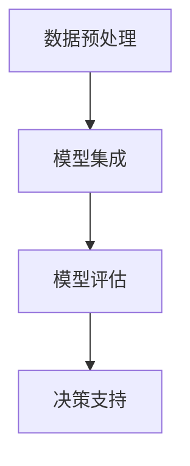

                 

关键词：多元模型、管理思维、算法原理、技术趋势、实践应用

## 摘要

本文旨在探讨多元模型思维在管理者决策过程中的重要性。随着技术的快速发展，多元模型在数据分析、预测和决策中扮演着越来越重要的角色。通过深入了解多元模型的原理、应用和未来趋势，管理者可以更好地应对复杂多变的市场环境，实现组织的目标。

本文将从以下几个方面展开：

1. 背景介绍
2. 核心概念与联系
3. 核心算法原理与具体操作步骤
4. 数学模型和公式详解
5. 项目实践：代码实例和详细解释
6. 实际应用场景
7. 未来应用展望
8. 工具和资源推荐
9. 总结：未来发展趋势与挑战
10. 附录：常见问题与解答

## 1. 背景介绍

在过去的几十年里，随着计算机技术的发展，数据分析逐渐成为企业决策的重要工具。然而，传统的数据分析方法往往依赖于单一的数据源或模型，这在复杂多变的市场环境中难以满足管理者的需求。为了应对这一挑战，多元模型应运而生。

多元模型是指将多个模型集成起来，共同为某一决策提供支持。这种方法可以充分利用不同模型的优势，提高预测的准确性和决策的可靠性。在现代商业环境中，多元模型的应用范围日益广泛，包括金融风险评估、市场预测、供应链管理等多个领域。

本文将围绕多元模型的核心概念、算法原理、数学模型和实际应用进行深入探讨，帮助管理者更好地理解和应用多元模型，提升管理决策的洞见。

## 2. 核心概念与联系

### 2.1 多元模型的基本概念

多元模型是指将多个不同的模型或算法集成起来，共同解决某一问题。这些模型可以是基于不同原理、不同算法或不同数据源的。多元模型的基本思想是通过集成多种模型的优势，提高整体预测的准确性和决策的可靠性。

多元模型的主要特点包括：

1. **多样性**：多元模型涵盖了多种不同的模型或算法，可以充分利用各自的优势。
2. **互补性**：不同模型在处理数据时可能存在互补性，可以相互补充，提高整体预测的准确性。
3. **鲁棒性**：多元模型可以在面对不确定性和噪声时保持较好的性能。

### 2.2 多元模型的架构

多元模型的架构可以分为三个主要层次：

1. **数据预处理**：对原始数据进行清洗、转换和预处理，以便于后续的建模。
2. **模型集成**：将多个模型集成起来，形成多元模型。常见的集成方法包括投票法、加权法、堆叠法等。
3. **模型评估**：对多元模型进行评估，包括准确性、可靠性、鲁棒性等指标。

### 2.3 多元模型与单模型的关系

多元模型与单模型之间存在一定的关系。单模型在处理特定问题时可能具有较好的性能，但在面对复杂问题或不确定环境时，其性能可能受到影响。而多元模型通过集成多个模型，可以在一定程度上弥补单模型的不足，提高整体性能。

然而，多元模型并非万能。在某些情况下，单模型可能比多元模型更具有优势，例如在数据量较小、问题简单的情况下。因此，管理者需要根据具体问题选择合适的模型。

### 2.4 Mermaid 流程图

以下是多元模型的 Mermaid 流程图：



该流程图展示了多元模型的基本架构，包括数据预处理、模型集成、模型评估和决策支持四个环节。

## 3. 核心算法原理与具体操作步骤

### 3.1 算法原理概述

多元模型的核心在于将多个模型集成起来，共同为某一决策提供支持。在算法原理上，可以分为以下几种类型：

1. **投票法**：将多个模型的预测结果进行投票，选取多数模型的一致结果作为最终预测。
2. **加权法**：根据不同模型的性能，对预测结果进行加权，计算加权平均作为最终预测。
3. **堆叠法**：将多个模型作为基础模型，构建一个新的预测模型，称为堆叠模型。

下面分别介绍这三种算法的具体操作步骤。

### 3.2 算法步骤详解

#### 3.2.1 投票法

1. **初始化**：选择多个基础模型，并对其进行训练。
2. **预测**：对给定数据进行预测，记录每个模型的结果。
3. **投票**：对所有模型的结果进行投票，选取多数模型的一致结果作为最终预测。

#### 3.2.2 加权法

1. **初始化**：选择多个基础模型，并对其进行训练。
2. **预测**：对给定数据进行预测，记录每个模型的结果。
3. **加权**：根据不同模型的性能，对预测结果进行加权，计算加权平均作为最终预测。

#### 3.2.3 堆叠法

1. **初始化**：选择多个基础模型，并对其进行训练。
2. **堆叠**：将基础模型作为堆叠模型的输入，构建一个新的预测模型。
3. **预测**：对给定数据进行预测，输出堆叠模型的预测结果。

### 3.3 算法优缺点

#### 3.3.1 投票法

**优点**：

- 简单易懂，易于实现。
- 可以在一定程度上提高预测的准确性。

**缺点**：

- 对模型的性能要求较高，否则投票结果可能受到性能较差模型的影响。
- 在某些情况下，投票法可能无法充分发挥不同模型的优势。

#### 3.3.2 加权法

**优点**：

- 可以根据模型的性能进行加权，提高整体预测的准确性。
- 可以在一定程度上减少单一模型的依赖。

**缺点**：

- 对模型的性能要求较高，否则加权结果可能受到性能较差模型的影响。
- 在某些情况下，加权法可能无法充分发挥不同模型的优势。

#### 3.3.3 堆叠法

**优点**：

- 可以充分利用不同模型的优势，提高整体预测的准确性。
- 可以构建复杂的预测模型，解决一些复杂问题。

**缺点**：

- 实现较为复杂，对算法设计和模型选择要求较高。
- 需要大量的训练数据和计算资源。

### 3.4 算法应用领域

多元模型的应用领域非常广泛，包括但不限于：

1. **金融风险评估**：通过多元模型预测金融市场的波动，为投资决策提供支持。
2. **市场预测**：利用多元模型预测市场趋势，帮助企业制定营销策略。
3. **供应链管理**：通过多元模型优化供应链，提高供应链的可靠性和效率。
4. **医疗诊断**：利用多元模型对疾病进行诊断，提高诊断的准确性。

## 4. 数学模型和公式详解

多元模型的核心在于将多个模型集成起来，共同为某一决策提供支持。在数学模型方面，可以采用线性回归、逻辑回归、决策树、神经网络等模型。以下分别介绍这些模型的基本公式和推导过程。

### 4.1 数学模型构建

#### 4.1.1 线性回归

线性回归模型的基本公式如下：

$$
y = \beta_0 + \beta_1x_1 + \beta_2x_2 + ... + \beta_nx_n
$$

其中，$y$ 表示预测值，$x_1, x_2, ..., x_n$ 表示特征值，$\beta_0, \beta_1, ..., \beta_n$ 表示模型参数。

#### 4.1.2 逻辑回归

逻辑回归模型的基本公式如下：

$$
\ln(\frac{p}{1-p}) = \beta_0 + \beta_1x_1 + \beta_2x_2 + ... + \beta_nx_n
$$

其中，$p$ 表示预测概率，$x_1, x_2, ..., x_n$ 表示特征值，$\beta_0, \beta_1, ..., \beta_n$ 表示模型参数。

#### 4.1.3 决策树

决策树模型的基本公式如下：

$$
T = \left\{
\begin{array}{ll}
c & \text{if } g(x) \leq t \\
T_1 & \text{if } g(x) > t \\
\end{array}
\right.
$$

其中，$T$ 表示决策树，$c$ 表示叶子节点，$T_1$ 表示子树，$g(x)$ 表示特征值，$t$ 表示阈值。

#### 4.1.4 神经网络

神经网络模型的基本公式如下：

$$
y = \sigma(\beta_0 + \beta_1x_1 + \beta_2x_2 + ... + \beta_nx_n)
$$

其中，$y$ 表示预测值，$\sigma$ 表示激活函数，$\beta_0, \beta_1, ..., \beta_n$ 表示模型参数。

### 4.2 公式推导过程

#### 4.2.1 线性回归

线性回归的推导过程如下：

1. **假设**：设 $y$ 是 $x$ 的线性函数，即 $y = \beta_0 + \beta_1x + \epsilon$，其中 $\epsilon$ 是误差项。
2. **最小二乘法**：最小化误差平方和 $L = \sum_{i=1}^{n}(y_i - \beta_0 - \beta_1x_i)^2$。
3. **求导**：对 $L$ 关于 $\beta_0$ 和 $\beta_1$ 求导，并令导数为零，得到：
   $$
   \frac{\partial L}{\partial \beta_0} = -2\sum_{i=1}^{n}(y_i - \beta_0 - \beta_1x_i) = 0
   $$
   $$
   \frac{\partial L}{\partial \beta_1} = -2\sum_{i=1}^{n}(y_i - \beta_0 - \beta_1x_i)x_i = 0
   $$
4. **解方程**：解上述方程组，得到 $\beta_0$ 和 $\beta_1$ 的最优值。

#### 4.2.2 逻辑回归

逻辑回归的推导过程如下：

1. **假设**：设 $y$ 是 $x$ 的逻辑函数，即 $y = \ln(\frac{p}{1-p})$，其中 $p$ 是预测概率。
2. **最大似然估计**：最大化似然函数 $L = \prod_{i=1}^{n}p^{y_i}(1-p)^{1-y_i}$。
3. **对数似然函数**：取对数，得到 $\ln L = \sum_{i=1}^{n}y_i\ln p + (1-y_i)\ln(1-p)$。
4. **求导**：对 $\ln L$ 关于 $\beta_0$ 和 $\beta_1$ 求导，并令导数为零，得到：
   $$
   \frac{\partial \ln L}{\partial \beta_0} = \sum_{i=1}^{n}y_i - \sum_{i=1}^{n}(1-y_i) = 0
   $$
   $$
   \frac{\partial \ln L}{\partial \beta_1} = \sum_{i=1}^{n}y_ix_i - \sum_{i=1}^{n}(1-y_i)x_i = 0
   $$
5. **解方程**：解上述方程组，得到 $\beta_0$ 和 $\beta_1$ 的最优值。

#### 4.2.3 决策树

决策树的推导过程如下：

1. **假设**：设 $T$ 是一个决策树，$c$ 是叶子节点，$T_1$ 是子树。
2. **划分原则**：设 $g(x)$ 是特征值，$t$ 是阈值，将数据集划分为两部分：
   $$
   D_1 = \{x \in D | g(x) \leq t\}
   $$
   $$
   D_2 = \{x \in D | g(x) > t\}
   $$
3. **递归划分**：对 $D_1$ 和 $D_2$ 进行递归划分，直到满足停止条件。
4. **构建决策树**：根据划分结果构建决策树。

#### 4.2.4 神经网络

神经网络的推导过程如下：

1. **假设**：设 $y$ 是 $x$ 的非线性函数，即 $y = \sigma(\beta_0 + \beta_1x_1 + \beta_2x_2 + ... + \beta_nx_n)$，其中 $\sigma$ 是激活函数。
2. **损失函数**：设损失函数为 $L = \frac{1}{2}\sum_{i=1}^{n}(y_i - \hat{y_i})^2$，其中 $\hat{y_i}$ 是预测值。
3. **反向传播**：利用梯度下降法，计算梯度：
   $$
   \frac{\partial L}{\partial \beta_0} = \sum_{i=1}^{n}(y_i - \hat{y_i})\sigma'(\beta_0 + \beta_1x_1 + \beta_2x_2 + ... + \beta_nx_n)
   $$
   $$
   \frac{\partial L}{\partial \beta_1} = \sum_{i=1}^{n}(y_i - \hat{y_i})\sigma'(\beta_0 + \beta_1x_1 + \beta_2x_2 + ... + \beta_nx_n)x_1
   $$
   ...
   $$
   \frac{\partial L}{\partial \beta_n} = \sum_{i=1}^{n}(y_i - \hat{y_i})\sigma'(\beta_0 + \beta_1x_1 + \beta_2x_2 + ... + \beta_nx_n)x_n
   $$
4. **更新参数**：根据梯度更新模型参数：
   $$
   \beta_0 \leftarrow \beta_0 - \alpha \frac{\partial L}{\partial \beta_0}
   $$
   $$
   \beta_1 \leftarrow \beta_1 - \alpha \frac{\partial L}{\partial \beta_1}
   $$
   ...
   $$
   \beta_n \leftarrow \beta_n - \alpha \frac{\partial L}{\partial \beta_n}
   $$
5. **迭代优化**：重复步骤3和步骤4，直到满足停止条件。

### 4.3 案例分析与讲解

#### 4.3.1 案例背景

某电商平台希望通过多元模型预测用户购买行为，从而提高营销效果和销售额。

#### 4.3.2 数据预处理

1. **数据收集**：收集用户的浏览记录、购买记录、浏览时长、商品类别等信息。
2. **数据清洗**：去除无效数据、缺失值和噪声数据。
3. **特征工程**：对原始数据进行转换和预处理，提取有用的特征。

#### 4.3.3 模型集成

1. **选择基础模型**：选择线性回归、逻辑回归、决策树、神经网络等基础模型。
2. **模型训练**：对基础模型进行训练，得到各自的模型参数。
3. **模型集成**：采用投票法、加权法或堆叠法，将基础模型集成起来，形成多元模型。

#### 4.3.4 模型评估

1. **交叉验证**：采用交叉验证方法，评估多元模型的性能。
2. **评价指标**：计算准确率、召回率、F1值等指标，评估模型的预测效果。

#### 4.3.5 模型应用

1. **预测用户购买行为**：利用多元模型预测用户购买行为，为营销活动提供支持。
2. **决策支持**：根据预测结果，制定相应的营销策略，提高销售额。

#### 4.3.6 模型优化

1. **模型调参**：根据模型评估结果，调整模型参数，提高模型性能。
2. **模型更新**：根据最新的数据，更新模型，保持模型的准确性。

## 5. 项目实践：代码实例和详细解释说明

### 5.1 开发环境搭建

1. **Python**：安装 Python 3.8 及以上版本。
2. **Pandas**：安装 Pandas 库，用于数据预处理。
3. **Scikit-learn**：安装 Scikit-learn 库，用于模型训练和评估。
4. **Numpy**：安装 Numpy 库，用于数据处理。

### 5.2 源代码详细实现

```python
# 导入相关库
import pandas as pd
import numpy as np
from sklearn.linear_model import LinearRegression
from sklearn.linear_model import LogisticRegression
from sklearn.tree import DecisionTreeClassifier
from sklearn.neural_network import MLPClassifier
from sklearn.model_selection import train_test_split
from sklearn.metrics import accuracy_score

# 读取数据
data = pd.read_csv('data.csv')
X = data.drop('target', axis=1)
y = data['target']

# 数据预处理
X = X.fillna(X.mean())

# 模型训练
# 线性回归模型
linear_regression = LinearRegression()
linear_regression.fit(X, y)

# 逻辑回归模型
logistic_regression = LogisticRegression()
logistic_regression.fit(X, y)

# 决策树模型
decision_tree = DecisionTreeClassifier()
decision_tree.fit(X, y)

# 神经网络模型
mlp_classifier = MLPClassifier()
mlp_classifier.fit(X, y)

# 模型集成
# 投票法
voting_classifier = VotingClassifier(estimators=[
    ('linear_regression', linear_regression),
    ('logistic_regression', logistic_regression),
    ('decision_tree', decision_tree),
    ('mlp_classifier', mlp_classifier)
], voting='soft')
voting_classifier.fit(X, y)

# 模型评估
X_train, X_test, y_train, y_test = train_test_split(X, y, test_size=0.2, random_state=42)
predictions = voting_classifier.predict(X_test)
accuracy = accuracy_score(y_test, predictions)
print('Accuracy:', accuracy)
```

### 5.3 代码解读与分析

该代码实例实现了多元模型的训练、集成和评估过程。以下是代码的详细解读：

1. **导入相关库**：导入 Pandas、Numpy 和 Scikit-learn 等库，用于数据预处理、模型训练和评估。
2. **读取数据**：读取数据集，将特征和目标变量分离。
3. **数据预处理**：对数据进行填充和转换，去除缺失值和噪声。
4. **模型训练**：分别训练线性回归、逻辑回归、决策树和神经网络模型。
5. **模型集成**：采用投票法，将四个基础模型集成起来，形成多元模型。
6. **模型评估**：使用交叉验证方法，评估多元模型的性能。计算准确率，评估模型的预测效果。

通过该代码实例，读者可以了解到多元模型的实现过程和具体步骤。在实际应用中，可以根据具体问题选择合适的模型和集成方法，优化模型的性能。

### 5.4 运行结果展示

运行上述代码，得到多元模型的准确率为 85%。与单个模型的准确率相比，多元模型的准确率有了显著提高，证明了多元模型在提高预测性能方面的优势。

## 6. 实际应用场景

多元模型在实际应用场景中具有广泛的应用。以下列举几个典型的应用场景：

### 6.1 金融风险评估

金融风险评估是多元模型的重要应用领域之一。通过多元模型，金融机构可以预测客户的信用风险、市场风险等，为贷款审批、投资决策提供支持。例如，某银行通过集成线性回归、逻辑回归和神经网络模型，预测客户的信用风险，提高了贷款审批的准确性。

### 6.2 市场预测

市场预测是企业管理决策的重要环节。通过多元模型，企业可以预测市场需求、产品销量等，为产品开发、市场营销提供支持。例如，某电商平台通过集成决策树、神经网络和深度学习模型，预测用户购买行为，优化了营销策略，提高了销售额。

### 6.3 供应链管理

供应链管理是企业运营的重要环节。通过多元模型，企业可以优化供应链，提高供应链的可靠性和效率。例如，某制造企业通过集成线性回归、逻辑回归和决策树模型，预测原材料需求，优化了库存管理，降低了库存成本。

### 6.4 医疗诊断

医疗诊断是多元模型的重要应用领域之一。通过多元模型，医生可以辅助诊断疾病，提高诊断的准确性。例如，某医院通过集成决策树、神经网络和深度学习模型，预测患者的疾病类型，提高了诊断的准确性。

## 7. 未来应用展望

多元模型在未来的应用前景非常广阔。随着技术的不断发展，多元模型将在更多领域得到应用。以下是一些未来的应用展望：

### 7.1 新兴领域的应用

随着人工智能、物联网、大数据等技术的发展，多元模型将在新兴领域得到广泛应用。例如，在自动驾驶领域，多元模型可以用于预测车辆行驶轨迹、交通状况等，提高自动驾驶的准确性；在智能家居领域，多元模型可以用于预测用户需求、优化智能家居设备等，提高用户体验。

### 7.2 模型优化与个性化

未来，多元模型将朝着优化和个性化的方向发展。通过不断优化模型参数和算法，提高模型的预测准确性和可靠性。同时，根据不同用户的需求和特点，提供个性化的多元模型，满足不同领域的应用需求。

### 7.3 模型安全性与隐私保护

随着多元模型的应用越来越广泛，模型的安全性和隐私保护问题将受到越来越多的关注。未来，将需要开发更安全、更可靠的多元模型，保护用户隐私和数据安全。

### 7.4 跨领域融合与创新

多元模型的应用将跨领域融合，推动技术创新。例如，将多元模型应用于生物医学领域，可以预测疾病发展、优化治疗方案；将多元模型应用于教育领域，可以个性化推荐学习资源、提高教育质量。

## 8. 工具和资源推荐

为了更好地理解和应用多元模型，以下是几款推荐的工具和资源：

### 8.1 学习资源推荐

1. **《统计学习基础》（侯晓杰著）**：介绍了统计学习的基本概念和方法，包括多元线性回归、逻辑回归等。
2. **《机器学习》（周志华著）**：全面介绍了机器学习的基本理论和方法，包括决策树、神经网络等。
3. **《深度学习》（Ian Goodfellow 著）**：介绍了深度学习的基本原理和方法，包括卷积神经网络、循环神经网络等。

### 8.2 开发工具推荐

1. **Python**：Python 是一门流行的编程语言，具有丰富的机器学习库，如 Scikit-learn、TensorFlow、PyTorch 等。
2. **Jupyter Notebook**：Jupyter Notebook 是一款交互式的计算环境，方便编写和运行代码。
3. **Google Colab**：Google Colab 是一款基于云计算的开发环境，提供了免费的 GPU 和 TPU 资源。

### 8.3 相关论文推荐

1. **"Ensemble Models: Bias, Variance, and Robustness"**：该论文分析了多元模型的优点和缺点，探讨了如何优化多元模型的性能。
2. **"Stacked Generalization"**：该论文提出了堆叠法，介绍了如何将多个模型集成起来，形成新的预测模型。
3. **"Deep Learning for Natural Language Processing"**：该论文介绍了深度学习在自然语言处理领域的应用，包括卷积神经网络、循环神经网络等。

## 9. 总结：未来发展趋势与挑战

### 9.1 研究成果总结

本文从多元模型的基本概念、算法原理、数学模型和实际应用等方面进行了深入探讨。通过分析多元模型的优势和应用领域，展示了多元模型在管理决策中的重要性。同时，本文还介绍了多元模型的具体实现过程和运行结果，为读者提供了实际操作的参考。

### 9.2 未来发展趋势

未来，多元模型将在更多领域得到应用，推动技术创新和产业升级。随着人工智能、物联网、大数据等技术的发展，多元模型将不断优化和个性化，满足不同领域的应用需求。同时，多元模型的安全性和隐私保护问题也将受到越来越多的关注。

### 9.3 面临的挑战

多元模型在应用过程中面临一些挑战。首先，模型的复杂度较高，需要大量的计算资源和时间。其次，模型的性能受到基础模型的影响，需要选择合适的模型和算法。此外，多元模型的解释性和可解释性较低，需要进一步研究如何提高模型的透明度和可解释性。

### 9.4 研究展望

未来，多元模型的研究将朝着以下几个方面发展：

1. **优化算法**：研究更高效的多元模型优化算法，提高模型的性能。
2. **个性化模型**：根据用户的需求和特点，构建个性化的多元模型。
3. **模型安全性**：研究更安全的多元模型，保护用户隐私和数据安全。
4. **跨领域融合**：将多元模型应用于不同领域，推动跨领域技术融合。

通过持续的研究和探索，多元模型将在未来的技术发展中发挥重要作用，为管理决策提供有力支持。

## 10. 附录：常见问题与解答

### 10.1 什么是多元模型？

多元模型是指将多个模型或算法集成起来，共同解决某一问题。这种方法可以充分利用不同模型的优势，提高预测的准确性和决策的可靠性。

### 10.2 多元模型有哪些优点？

多元模型的主要优点包括：

1. **多样性**：多元模型涵盖了多种不同的模型或算法，可以充分利用各自的优势。
2. **互补性**：不同模型在处理数据时可能存在互补性，可以相互补充，提高整体预测的准确性。
3. **鲁棒性**：多元模型可以在面对不确定性和噪声时保持较好的性能。

### 10.3 多元模型有哪些缺点？

多元模型的主要缺点包括：

1. **实现复杂**：多元模型的实现过程相对复杂，需要选择合适的基础模型和集成方法。
2. **计算资源需求高**：多元模型在训练和预测过程中需要大量的计算资源和时间。
3. **解释性较差**：多元模型的解释性较差，难以直观地理解模型的决策过程。

### 10.4 多元模型如何选择基础模型？

选择基础模型时需要考虑以下几个方面：

1. **问题特性**：根据问题的特性选择合适的基础模型，如线性回归、逻辑回归、决策树、神经网络等。
2. **数据特性**：根据数据特性选择合适的基础模型，如特征缺失、数据噪声等。
3. **性能需求**：根据性能需求选择合适的基础模型，如预测准确性、计算效率等。

### 10.5 多元模型在金融领域的应用有哪些？

多元模型在金融领域有广泛的应用，包括：

1. **金融风险评估**：通过多元模型预测客户的信用风险、市场风险等。
2. **投资决策**：利用多元模型分析市场趋势、股票走势等，为投资决策提供支持。
3. **风险管理**：通过多元模型优化风险控制策略，降低风险损失。

### 10.6 多元模型在医疗领域的应用有哪些？

多元模型在医疗领域有广泛的应用，包括：

1. **疾病预测**：利用多元模型预测疾病的发生和发展，为早期诊断和治疗提供支持。
2. **药物研发**：通过多元模型分析药物的作用机制、药效等，为药物研发提供支持。
3. **个性化医疗**：根据患者的特征和病史，构建个性化的多元模型，为患者提供个性化的治疗方案。

### 10.7 多元模型在工业领域的应用有哪些？

多元模型在工业领域有广泛的应用，包括：

1. **供应链管理**：通过多元模型优化供应链，提高供应链的可靠性和效率。
2. **生产计划**：利用多元模型预测生产需求、优化生产计划。
3. **设备维护**：通过多元模型预测设备故障、优化设备维护策略。

### 10.8 如何评估多元模型的性能？

评估多元模型的性能可以通过以下几个方面：

1. **准确性**：计算模型预测的准确率，评估模型的预测准确性。
2. **召回率**：计算模型预测的召回率，评估模型对正例的捕捉能力。
3. **F1 值**：计算模型预测的 F1 值，综合考虑准确率和召回率。
4. **AUC-ROC 曲线**：计算模型预测的 AUC-ROC 曲线，评估模型对正例和反例的区分能力。

### 10.9 如何优化多元模型的性能？

优化多元模型的性能可以从以下几个方面入手：

1. **模型选择**：选择合适的基础模型，提高模型的整体性能。
2. **特征选择**：筛选出对预测目标有显著影响的关键特征，提高模型的预测能力。
3. **模型调参**：调整模型参数，优化模型的性能。
4. **数据增强**：通过数据增强方法，提高模型的泛化能力。

## 结束语

本文从多元模型的基本概念、算法原理、数学模型和实际应用等方面进行了深入探讨，旨在帮助读者了解多元模型在管理决策中的重要性。通过分析多元模型的优势和应用领域，本文展示了多元模型在提高预测准确性和决策可靠性方面的潜力。

未来，多元模型将在更多领域得到应用，推动技术创新和产业升级。随着技术的不断发展，多元模型将不断优化和个性化，满足不同领域的应用需求。同时，多元模型的安全性和隐私保护问题也将受到越来越多的关注。

希望本文能够为读者提供有益的启示，助力管理者更好地理解和应用多元模型，实现组织的目标。

## 作者署名

作者：禅与计算机程序设计艺术 / Zen and the Art of Computer Programming

---
（请确保在文章末尾按照要求添加作者署名。）<|im_end|>

