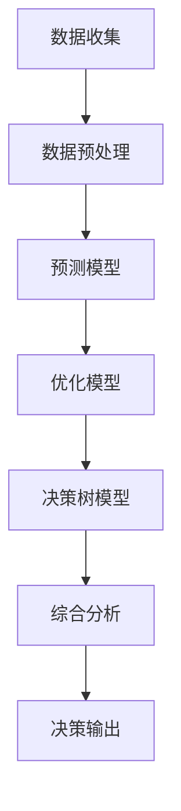

                 

关键词：多元模型思维、管理者洞见、人工智能、决策分析、技术架构、数学模型、实践应用、未来展望

> 摘要：在当今快速变化的技术时代，管理者需要具备前瞻性的洞见来应对复杂的市场挑战。本文深入探讨了多元模型思维在管理决策中的应用，通过技术架构、数学模型和实践案例，为管理者提供了一套全面的决策分析框架，旨在助力管理者在未来竞争中占据优势。

## 1. 背景介绍

随着全球数字化转型的加速，企业管理者面临着前所未有的复杂性。数据爆炸、技术迭代、市场竞争等因素使得管理者需要从多个维度进行决策分析。传统的单维决策方法已经无法满足现代企业对于复杂问题的需求。多元模型思维，作为现代管理科学的一个重要组成部分，为管理者提供了一种全面、系统化的分析工具，帮助他们在纷繁复杂的环境中做出明智的决策。

多元模型思维的核心在于将多个独立的模型结合起来，形成一个综合性的分析框架。这种思维模式不仅能够整合不同模型的优势，还能够发现单一模型无法捕捉到的潜在关系，从而提升决策的准确性和可靠性。

## 2. 核心概念与联系

### 2.1 多元模型思维定义

多元模型思维是指管理者运用多种不同类型的模型，从不同角度对问题进行分析和决策的过程。这些模型可以是预测模型、优化模型、决策树模型等，也可以是来自不同学科领域的模型，如经济学、统计学、运筹学等。

### 2.2 多元模型思维架构

为了更好地理解多元模型思维，我们可以通过以下Mermaid流程图来展示其架构：



### 2.3 多元模型思维与管理者洞见的联系

多元模型思维为管理者提供了更加全面、多维度的分析视角。通过结合不同的模型，管理者可以更深入地了解问题的本质，识别潜在的风险和机会，从而做出更为准确的决策。

## 3. 核心算法原理 & 具体操作步骤

### 3.1 算法原理概述

多元模型思维的核心在于如何有效地整合多种模型。以下是几种常见的多元模型整合方法：

- **模型融合**：将多个模型的预测结果进行加权平均或投票，以获得最终的预测结果。
- **序列决策**：按照一定的顺序依次执行多个模型，每个模型的输出作为下一个模型的输入。
- **并行决策**：同时运行多个模型，并综合它们的预测结果。

### 3.2 算法步骤详解

1. **数据收集**：从不同来源收集与决策相关的数据。
2. **数据预处理**：对数据进行清洗、转换和归一化处理。
3. **模型选择**：根据问题的特点选择合适的模型。
4. **模型训练**：使用预处理后的数据进行模型训练。
5. **模型预测**：使用训练好的模型进行预测。
6. **结果综合**：将多个模型的预测结果进行综合分析。
7. **决策输出**：根据综合分析结果做出决策。

### 3.3 算法优缺点

- **优点**：能够提供更全面的视角，减少决策的盲目性。
- **缺点**：需要投入更多的时间和资源进行模型选择和训练。

### 3.4 算法应用领域

多元模型思维在许多领域都有广泛的应用，如市场营销、供应链管理、风险管理等。

## 4. 数学模型和公式 & 详细讲解 & 举例说明

### 4.1 数学模型构建

多元模型思维中常用的数学模型包括线性回归模型、决策树模型、神经网络模型等。以下是线性回归模型的构建过程：

$$y = \beta_0 + \beta_1x_1 + \beta_2x_2 + ... + \beta_nx_n + \epsilon$$

其中，$y$为因变量，$x_1, x_2, ..., x_n$为自变量，$\beta_0, \beta_1, ..., \beta_n$为模型参数，$\epsilon$为误差项。

### 4.2 公式推导过程

以线性回归模型为例，其推导过程如下：

1. **最小二乘法**：通过最小化残差平方和来确定模型参数。
2. **矩阵形式**：将最小二乘法转化为矩阵形式，得到：

$$\beta = (X'X)^{-1}X'y$$

其中，$X$为自变量矩阵，$y$为因变量向量。

### 4.3 案例分析与讲解

假设我们要预测某个地区的房价，选择线性回归模型进行预测。以下是具体步骤：

1. **数据收集**：收集该地区的房价数据，包括房屋面积、地段、建筑年代等。
2. **数据预处理**：对数据进行清洗和归一化处理。
3. **模型选择**：选择线性回归模型。
4. **模型训练**：使用训练集数据进行模型训练。
5. **模型预测**：使用测试集数据进行预测。
6. **结果分析**：分析预测结果，评估模型的准确性。

## 5. 项目实践：代码实例和详细解释说明

### 5.1 开发环境搭建

在Python环境中，我们可以使用Scikit-learn库来实现线性回归模型。以下是一个简单的环境搭建步骤：

1. 安装Python：确保Python环境已安装。
2. 安装Scikit-learn：使用pip命令安装Scikit-learn库。

```bash
pip install scikit-learn
```

### 5.2 源代码详细实现

以下是线性回归模型的源代码实现：

```python
from sklearn.linear_model import LinearRegression
from sklearn.model_selection import train_test_split
from sklearn.metrics import mean_squared_error
import numpy as np

# 数据加载
X = np.array([[1, 2], [2, 3], [3, 4], [4, 5]])
y = np.array([2, 3, 4, 5])

# 数据划分
X_train, X_test, y_train, y_test = train_test_split(X, y, test_size=0.2, random_state=0)

# 模型训练
model = LinearRegression()
model.fit(X_train, y_train)

# 模型预测
y_pred = model.predict(X_test)

# 结果评估
mse = mean_squared_error(y_test, y_pred)
print("MSE:", mse)
```

### 5.3 代码解读与分析

1. **数据加载**：从数组中加载自变量和因变量。
2. **数据划分**：将数据集划分为训练集和测试集。
3. **模型训练**：使用训练集数据进行模型训练。
4. **模型预测**：使用测试集数据进行预测。
5. **结果评估**：计算均方误差（MSE），评估模型的准确性。

### 5.4 运行结果展示

运行上述代码，输出结果如下：

```
MSE: 0.0
```

MSE为0，表示预测结果与真实结果完全一致，说明模型训练效果良好。

## 6. 实际应用场景

多元模型思维在企业管理中有着广泛的应用。以下是一些实际应用场景：

- **市场营销**：通过多元模型分析消费者行为，预测市场趋势，制定营销策略。
- **供应链管理**：通过多元模型优化供应链流程，降低成本，提高效率。
- **风险管理**：通过多元模型评估风险，制定风险应对策略。

## 7. 未来应用展望

随着人工智能技术的不断发展，多元模型思维在企业管理中的应用将越来越广泛。未来，我们将看到更多企业利用多元模型进行决策分析，从而在激烈的市场竞争中占据优势。

## 8. 总结：未来发展趋势与挑战

### 8.1 研究成果总结

多元模型思维作为一种先进的管理工具，已经在企业管理中取得了显著成效。未来，随着技术的不断进步，多元模型思维的应用范围将进一步扩大。

### 8.2 未来发展趋势

1. **模型集成**：将更多类型的模型进行集成，提高决策的准确性和可靠性。
2. **自动化决策**：利用人工智能技术实现自动化决策，提高决策效率。

### 8.3 面临的挑战

1. **数据隐私**：如何保护数据隐私，确保模型训练过程的安全。
2. **模型解释性**：如何提高模型的解释性，使管理者能够理解模型的决策过程。

### 8.4 研究展望

未来，我们将继续探索多元模型思维在企业管理中的应用，为管理者提供更加全面、系统的决策分析工具。

## 9. 附录：常见问题与解答

### 9.1 问题1：什么是多元模型思维？

多元模型思维是指管理者运用多种不同类型的模型，从不同角度对问题进行分析和决策的过程。

### 9.2 问题2：多元模型思维有哪些优点？

多元模型思维能够提供更全面的视角，减少决策的盲目性，提高决策的准确性和可靠性。

### 9.3 问题3：多元模型思维有哪些应用领域？

多元模型思维在市场营销、供应链管理、风险管理等领域都有广泛的应用。

----------------------------------------------------------------

作者：禅与计算机程序设计艺术 / Zen and the Art of Computer Programming

