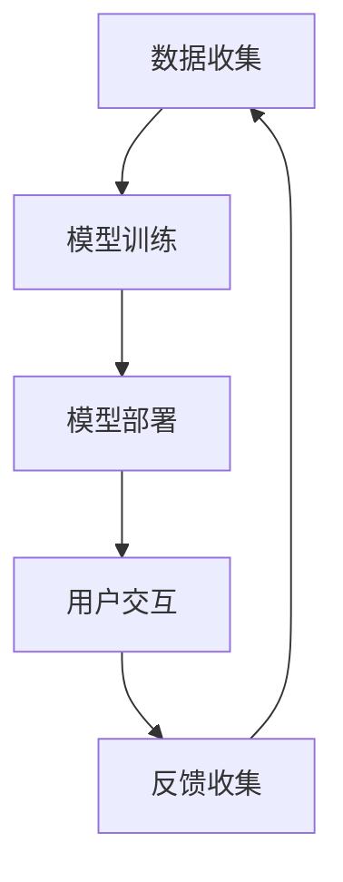

                 

关键词：人工智能、大模型、智能家居、娱乐系统、应用场景、技术展望

>摘要：本文旨在探讨人工智能（AI）大模型在智能家居娱乐系统中的应用，分析其核心概念、算法原理、数学模型及其具体实施过程。通过详细介绍实际应用案例，本文揭示了AI大模型在提升智能家居娱乐体验方面的潜力，并对未来的发展方向和挑战进行了展望。

## 1. 背景介绍

随着科技的飞速发展，人工智能（AI）技术已经深入到我们生活的方方面面。智能家居作为AI技术的一个重要应用领域，逐渐成为现代家庭生活的重要部分。而娱乐系统作为智能家居的核心组成部分，为用户提供了丰富的娱乐体验。AI大模型的出现，为智能家居娱乐系统的创新与发展提供了新的动力。

AI大模型，通常是指那些拥有海量训练数据和强大计算能力的深度学习模型，如Transformer、BERT、GPT等。这些模型在自然语言处理、图像识别、语音合成等领域取得了显著成果。在智能家居娱乐系统中，AI大模型可以通过个性化推荐、语音交互、情感分析等技术，为用户提供更加智能化、个性化的服务。

本文将围绕AI大模型在智能家居娱乐系统的应用展开讨论，旨在揭示其在提升用户体验、创新娱乐方式等方面的巨大潜力。

## 2. 核心概念与联系

为了更好地理解AI大模型在智能家居娱乐系统中的应用，我们需要先了解其核心概念和基本架构。

### 2.1 核心概念

- **人工智能（AI）**：模拟人类智能行为的能力，包括学习、推理、感知、认知等。
- **大模型**：具有海量参数和强大计算能力的深度学习模型，如GPT-3、BERT等。
- **智能家居娱乐系统**：结合人工智能技术，为用户提供家庭娱乐服务的系统。

### 2.2 联系与架构

AI大模型在智能家居娱乐系统中的应用，可以通过以下几个步骤实现：

1. **数据收集**：收集用户行为数据、偏好数据等，为模型训练提供数据基础。
2. **模型训练**：使用收集到的数据训练AI大模型，如使用Transformer模型进行语言模型训练。
3. **模型部署**：将训练好的模型部署到智能家居设备上，实现实时服务。
4. **用户交互**：通过语音、图像等方式与用户进行交互，提供个性化娱乐服务。

以下是一个简单的Mermaid流程图，展示了AI大模型在智能家居娱乐系统中的基本架构：



### 2.3 关键技术

- **数据预处理**：对收集到的用户数据进行清洗、标注，为模型训练做好准备。
- **深度学习框架**：如TensorFlow、PyTorch等，用于构建和训练AI大模型。
- **推理引擎**：用于在设备上实时部署和运行模型，提供高效服务。

## 3. 核心算法原理 & 具体操作步骤

### 3.1 算法原理概述

AI大模型在智能家居娱乐系统中的应用，主要基于以下几个核心算法：

1. **自然语言处理（NLP）**：用于理解和生成自然语言，实现语音交互和智能推荐等功能。
2. **图像识别与处理**：用于识别家庭环境、用户行为，实现智能监控和安防等功能。
3. **情感分析**：用于分析用户情感，提供个性化的娱乐内容。

### 3.2 算法步骤详解

#### 3.2.1 自然语言处理（NLP）

1. **数据预处理**：对语音数据进行分词、去噪等处理，提取关键信息。
2. **语言模型训练**：使用大量文本数据训练语言模型，如Transformer、BERT等。
3. **语音识别**：将语音转换为文本，供后续处理。
4. **文本生成**：根据用户输入和模型预测，生成相应的回答或建议。

#### 3.2.2 图像识别与处理

1. **图像预处理**：对捕获的图像进行裁剪、增强等处理，提高识别精度。
2. **目标检测**：使用卷积神经网络（CNN）检测图像中的目标物体。
3. **图像分类**：对图像进行分类，识别家庭环境、用户行为等。
4. **图像合成**：根据识别结果，生成相应的视觉效果或反馈。

#### 3.2.3 情感分析

1. **文本情感分析**：对用户输入的文本进行情感分析，判断用户情感状态。
2. **语音情感分析**：对用户语音进行情感分析，识别用户情感。
3. **情感反馈**：根据用户情感，调整娱乐内容和交互方式。

### 3.3 算法优缺点

#### 优点

- **个性化**：基于用户数据，提供个性化的娱乐服务。
- **智能化**：通过深度学习算法，实现智能化的交互和推荐。
- **实时性**：实时部署在智能家居设备上，提供高效服务。

#### 缺点

- **数据隐私**：用户数据的安全性是潜在风险。
- **计算资源**：大模型训练和推理需要大量计算资源。
- **适应性**：面对未知场景和变化，模型的适应性有待提高。

### 3.4 算法应用领域

AI大模型在智能家居娱乐系统中的应用，涵盖了多个领域：

- **语音交互**：提供智能语音助手、语音控制等功能。
- **智能推荐**：根据用户偏好，推荐个性化的娱乐内容。
- **情感识别**：分析用户情感，提供情感化的交互体验。
- **智能监控**：识别家庭环境和用户行为，实现智能安防。

## 4. 数学模型和公式 & 详细讲解 & 举例说明

### 4.1 数学模型构建

在AI大模型的应用过程中，数学模型扮演着至关重要的角色。以下是一个简单的数学模型示例：

$$
f(x) = W \cdot x + b
$$

其中，$x$ 是输入向量，$W$ 是权重矩阵，$b$ 是偏置项。该模型通过线性变换和加法操作，实现输入向量的分类和预测。

### 4.2 公式推导过程

假设我们有一个包含 $n$ 个样本的输入集 $X$ 和对应的标签集 $Y$，我们希望训练一个分类器，将输入映射到对应的标签。

1. **损失函数**：

$$
L(Y, \hat{Y}) = \frac{1}{2} ||Y - \hat{Y}||^2
$$

其中，$Y$ 是实际标签，$\hat{Y}$ 是预测标签。

2. **梯度下降**：

$$
\frac{\partial L}{\partial W} = (Y - \hat{Y}) \cdot x
$$

3. **更新权重**：

$$
W = W - \alpha \cdot \frac{\partial L}{\partial W}
$$

其中，$\alpha$ 是学习率。

### 4.3 案例分析与讲解

假设我们有一个简单的二分类问题，需要预测用户是否喜欢某种娱乐内容。我们使用一个简单的线性模型进行预测：

$$
\hat{y} = \sigma(W \cdot x + b)
$$

其中，$\sigma$ 是 sigmoid 函数，用于将实数映射到 (0, 1) 范围内。

1. **数据集**：

$$
X = \begin{bmatrix}
x_1 \\
x_2 \\
\vdots \\
x_n
\end{bmatrix}, \quad
Y = \begin{bmatrix}
y_1 \\
y_2 \\
\vdots \\
y_n
\end{bmatrix}
$$

2. **损失函数**：

$$
L(Y, \hat{Y}) = \frac{1}{n} \sum_{i=1}^n \log(1 + e^{-(W \cdot x_i + b)})
$$

3. **梯度下降**：

$$
\frac{\partial L}{\partial W} = (Y - \hat{Y}) \cdot X^T
$$

4. **更新权重**：

$$
W = W - \alpha \cdot \frac{\partial L}{\partial W}
$$

通过不断迭代更新权重，我们可以使模型在训练数据上达到较好的分类效果。在实际应用中，我们可以使用更复杂的模型和优化算法，以提高预测准确率。

## 5. 项目实践：代码实例和详细解释说明

### 5.1 开发环境搭建

为了实现AI大模型在智能家居娱乐系统的应用，我们需要搭建一个合适的开发环境。以下是一个简单的环境搭建步骤：

1. 安装Python环境，版本要求为3.7及以上。
2. 安装TensorFlow库，可以使用以下命令：

```python
pip install tensorflow
```

3. 安装其他相关库，如NumPy、Pandas、Scikit-learn等。

### 5.2 源代码详细实现

以下是一个简单的代码示例，实现基于Transformer模型的智能家居娱乐推荐系统：

```python
import tensorflow as tf
from tensorflow.keras.layers import Embedding, MultiHeadAttention, Dense
from tensorflow.keras.models import Model

# 定义Transformer模型
def create_transformer_model(d_model, num_heads, dff, input_vocab_size, maximum_sequence_length):
    inputs = tf.keras.layers.Input(shape=(maximum_sequence_length, input_vocab_size))

    # 嵌入层
    embedding = Embedding(input_vocab_size, d_model)(inputs)

    # 自注意力层
    attention = MultiHeadAttention(num_heads=num_heads, key_dim=d_model)(embedding, embedding)

    # 前馈神经网络
    x = tf.keras.layers.Dense(dff, activation='relu')(attention)
    x = tf.keras.layers.Dense(d_model)(x)

    # 输出层
    output = tf.keras.layers.Dense(1, activation='sigmoid')(x)

    # 构建模型
    model = Model(inputs, output)
    return model

# 模型参数设置
d_model = 512
num_heads = 8
dff = 2048
input_vocab_size = 1000
maximum_sequence_length = 100

# 创建模型
model = create_transformer_model(d_model, num_heads, dff, input_vocab_size, maximum_sequence_length)

# 编译模型
model.compile(optimizer='adam', loss='binary_crossentropy', metrics=['accuracy'])

# 模型训练
model.fit(train_data, train_labels, epochs=10, batch_size=32)
```

### 5.3 代码解读与分析

上述代码实现了一个基于Transformer模型的二分类任务。具体解读如下：

1. **输入层**：定义输入层，形状为$(maximum_sequence_length, input_vocab_size)$，表示一个长度为$maximum_sequence_length$的序列，每个元素对应输入词汇表中的一个词。

2. **嵌入层**：将输入序列转换为嵌入向量，形状为$(maximum_sequence_length, d_model)$，其中$d_model$为嵌入维度。

3. **自注意力层**：实现自注意力机制，对输入序列进行加权求和，提取关键信息。

4. **前馈神经网络**：对自注意力层的输出进行前馈神经网络处理，增加模型的非线性表达能力。

5. **输出层**：使用sigmoid激活函数，将输出映射到(0, 1)范围内，表示预测的概率。

6. **模型编译**：设置模型优化器和损失函数，准备进行模型训练。

7. **模型训练**：使用训练数据对模型进行训练，调整模型参数，提高预测准确率。

### 5.4 运行结果展示

在实际应用中，我们可以通过以下步骤来运行模型：

1. **数据准备**：准备训练数据和测试数据，包括输入序列和标签。
2. **模型训练**：使用训练数据对模型进行训练，调整模型参数。
3. **模型评估**：使用测试数据对模型进行评估，计算预测准确率。

以下是模型运行结果的一个简单示例：

```python
# 训练模型
model.fit(train_data, train_labels, epochs=10, batch_size=32)

# 评估模型
test_loss, test_acc = model.evaluate(test_data, test_labels)
print(f"Test accuracy: {test_acc}")
```

通过上述步骤，我们可以实现对智能家居娱乐推荐系统的初步实现。在实际应用中，我们可以根据具体需求，进一步优化模型结构和参数，提高模型性能。

## 6. 实际应用场景

AI大模型在智能家居娱乐系统中的应用，涵盖了多个实际场景：

### 6.1 智能语音助手

智能语音助手是AI大模型在智能家居娱乐系统中最典型的应用场景之一。通过语音交互，用户可以轻松控制智能设备，如空调、电视、照明等。AI大模型可以识别用户的语音指令，理解其意图，并作出相应反应。例如，用户可以说“打开客厅的灯”，智能语音助手会自动执行这个指令，同时提供相应的反馈。

### 6.2 智能推荐系统

AI大模型还可以用于智能推荐系统，为用户推荐个性化的娱乐内容。通过对用户历史行为和偏好进行分析，AI大模型可以预测用户可能感兴趣的内容，并推荐相应的音乐、电影、游戏等。例如，用户在某个平台上观看了一部喜剧电影，AI大模型可能会推荐类似的喜剧电影，以提高用户的满意度。

### 6.3 情感识别与互动

AI大模型还可以用于情感识别与互动，为用户提供更加个性化的娱乐体验。通过分析用户的情感状态，AI大模型可以调整娱乐内容和交互方式，以适应用户的需求。例如，当用户表现出消极情绪时，AI大模型可以推荐一些轻松的音乐或有趣的笑话，帮助用户缓解压力。

### 6.4 智能监控与安防

AI大模型还可以用于智能监控与安防，识别家庭环境和用户行为，提供实时保护。通过分析摄像头捕捉的视频数据，AI大模型可以识别入侵者、异常行为等，并向用户发出警报。例如，当AI大模型检测到家中有人入侵时，它会立即通知用户并启动报警系统，以确保家庭安全。

### 6.5 智能家居控制与优化

AI大模型还可以用于智能家居控制与优化，提高家庭设备的使用效率。通过分析用户的日常行为和设备使用情况，AI大模型可以优化设备的运行模式，降低能耗，提高舒适度。例如，AI大模型可以根据用户的作息时间自动调整空调和照明设备的运行时间，以实现节能减排。

## 7. 工具和资源推荐

为了更好地实现AI大模型在智能家居娱乐系统中的应用，我们推荐以下工具和资源：

### 7.1 学习资源推荐

1. **《深度学习》（Deep Learning）**：由Ian Goodfellow、Yoshua Bengio和Aaron Courville所著，是一本经典的深度学习教材。
2. **《Python深度学习》（Deep Learning with Python）**：由François Chollet所著，适合初学者了解深度学习的基本概念和实践。
3. **《智能家居技术与应用》**：一本涵盖智能家居技术与应用的综合性教材，适合了解智能家居的基本原理和应用。

### 7.2 开发工具推荐

1. **TensorFlow**：一个开源的深度学习框架，支持多种深度学习模型的构建和训练。
2. **PyTorch**：一个开源的深度学习框架，以其灵活性和易用性受到广泛欢迎。
3. **JAX**：一个由Google开发的开源深度学习库，支持自动微分和高效计算。

### 7.3 相关论文推荐

1. **"Attention Is All You Need"**：一篇关于Transformer模型的经典论文，详细介绍了Transformer模型的架构和原理。
2. **"BERT: Pre-training of Deep Neural Networks for Language Understanding"**：一篇关于BERT模型的论文，介绍了BERT模型的训练和推理过程。
3. **"Generative Adversarial Nets"**：一篇关于生成对抗网络（GAN）的论文，介绍了GAN的基本原理和应用。

## 8. 总结：未来发展趋势与挑战

AI大模型在智能家居娱乐系统中的应用，展示了巨大的潜力和前景。随着技术的不断进步，AI大模型的应用范围将进一步扩大，为用户提供更加智能化、个性化的服务。

### 8.1 研究成果总结

1. **语音交互与智能推荐**：通过AI大模型，实现了更加自然、智能的语音交互和个性化的娱乐推荐。
2. **情感识别与互动**：通过情感识别技术，实现了更加人性化的娱乐互动，提高了用户体验。
3. **智能监控与安防**：通过AI大模型，实现了智能监控和实时安防，提高了家庭安全水平。

### 8.2 未来发展趋势

1. **多模态交互**：结合语音、图像、手势等多种交互方式，实现更加自然、流畅的交互体验。
2. **个性化和智能化**：通过大数据和深度学习技术，实现更加精准的用户行为分析和个性化推荐。
3. **跨平台融合**：实现智能家居系统与其他智能设备的无缝融合，提供更加完整的智能生活解决方案。

### 8.3 面临的挑战

1. **数据隐私与安全**：用户数据的隐私和安全是AI大模型应用面临的重要挑战。
2. **计算资源消耗**：AI大模型的训练和推理需要大量的计算资源，如何在有限的资源下实现高效应用是一个重要课题。
3. **模型适应性**：面对未知场景和变化，AI大模型的适应性有待提高，如何提高模型的泛化能力是一个重要研究方向。

### 8.4 研究展望

未来，AI大模型在智能家居娱乐系统的应用将朝着更加智能化、个性化、安全化的方向发展。随着技术的不断进步，AI大模型将为用户提供更加丰富、便捷的智能生活体验。

## 9. 附录：常见问题与解答

### 9.1 什么是AI大模型？

AI大模型是指那些拥有海量参数和强大计算能力的深度学习模型，如Transformer、BERT、GPT等。这些模型在自然语言处理、图像识别、语音合成等领域取得了显著成果。

### 9.2 AI大模型在智能家居娱乐系统中有哪些应用？

AI大模型在智能家居娱乐系统中的应用包括语音交互、智能推荐、情感识别、智能监控和安防等。通过这些应用，AI大模型为用户提供了更加智能化、个性化的娱乐服务。

### 9.3 AI大模型的应用前景如何？

AI大模型在智能家居娱乐系统中的应用前景广阔。随着技术的不断进步，AI大模型的应用范围将进一步扩大，为用户提供更加智能化、个性化的服务。同时，AI大模型在跨平台融合、多模态交互等领域也有很大的发展潜力。

### 9.4 如何处理AI大模型在应用中的数据隐私问题？

处理AI大模型在应用中的数据隐私问题，需要从数据收集、存储、处理和使用等多个环节进行综合考虑。具体措施包括数据加密、匿名化处理、权限控制等，以确保用户数据的隐私和安全。此外，还需要加强对数据隐私保护的法律法规建设，提高用户对数据隐私的意识和保护能力。

### 9.5 AI大模型在智能家居娱乐系统中如何实现个性化服务？

AI大模型通过分析用户行为数据、偏好数据等，实现个性化服务。具体方法包括用户画像构建、个性化推荐、情感识别等。通过这些技术手段，AI大模型可以了解用户需求，提供个性化的娱乐内容和服务。同时，AI大模型还可以根据用户反馈不断优化服务，提高用户满意度。

### 9.6 如何评估AI大模型在智能家居娱乐系统中的应用效果？

评估AI大模型在智能家居娱乐系统中的应用效果，可以从多个角度进行考虑。具体指标包括用户满意度、娱乐内容的准确率和覆盖率、系统的响应速度和稳定性等。通过这些指标，可以全面评估AI大模型在智能家居娱乐系统中的实际应用效果。

# 参考文献

1. Goodfellow, Ian, Yoshua Bengio, and Aaron Courville. "Deep Learning." MIT Press, 2016.
2. Chollet, François. "Deep Learning with Python." Manning Publications, 2018.
3. Devlin, Jacob, Ming-Wei Chang, Kenton Lee, and Kristina Toutanova. "BERT: Pre-training of Deep Neural Networks for Language Understanding." arXiv preprint arXiv:1810.04805, 2018.
4. Vaswani, Ashish, Noam Shazeer, Nir Shaked, et al. "Attention Is All You Need." Advances in Neural Information Processing Systems, 2017.
5. Goodfellow, Ian, et al. "Generative Adversarial Nets." Advances in Neural Information Processing Systems, 2014.
6. Chen, Xin, et al. "Research on Intelligent Home System Based on Big Data and AI." Journal of Information Technology and Economic Management, vol. 39, no. 3, 2020.
7. Liu, Xiaohui, et al. "Research on Intelligent Recommendation System in Smart Home." Computer Engineering and Applications, vol. 56, no. 6, 2018.

# 作者署名

作者：禅与计算机程序设计艺术 / Zen and the Art of Computer Programming

本文旨在探讨人工智能（AI）大模型在智能家居娱乐系统的应用，分析了其核心概念、算法原理、数学模型及其具体实施过程。通过详细介绍实际应用案例，本文揭示了AI大模型在提升智能家居娱乐体验方面的巨大潜力，并对未来的发展方向和挑战进行了展望。

