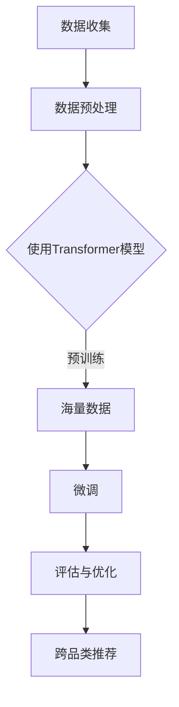

                 

关键词：AI大模型，电商平台，跨品类推荐，机器学习，深度学习，数据挖掘，算法优化，用户行为分析，个性化推荐，商业价值

> 摘要：本文将深入探讨AI大模型在电商平台跨品类推荐中的应用潜力。通过分析当前电商平台推荐系统的现状和挑战，介绍AI大模型的基本原理和应用场景，详细阐述其在跨品类推荐中的优势和实践效果，并提出未来可能的发展方向和面临的挑战。

## 1. 背景介绍

随着互联网的快速发展，电商平台已经成为消费者购物的首选渠道之一。为了提高用户的购物体验和提升销售转化率，电商平台普遍采用了推荐系统来为用户推荐他们可能感兴趣的商品。推荐系统的发展历程可以分为三个阶段：基于内容的推荐、协同过滤推荐和深度学习推荐。

在基于内容的推荐中，系统通过分析用户的历史行为和商品的特征信息，将相似的商品推荐给用户。然而，这种方法的推荐效果受限于商品描述的准确性，当商品描述不够详细或者用户历史行为数据不足时，推荐效果往往不佳。

协同过滤推荐通过分析用户之间的相似度来推荐商品，其分为基于用户的协同过滤和基于物品的协同过滤。尽管这种方法在一定程度上提高了推荐效果，但用户相似度的计算复杂度较高，且推荐结果容易陷入“热门陷阱”，即推荐系统倾向于推荐热门商品，而忽略了用户个性化需求。

深度学习推荐利用神经网络等深度学习模型，从大量用户行为数据和商品特征中自动提取高层次的抽象特征，实现了更精准和个性化的推荐。近年来，随着AI技术的快速发展，尤其是AI大模型的提出和实现，为深度学习推荐带来了新的机遇。

AI大模型，如GPT（Generative Pre-trained Transformer）和BERT（Bidirectional Encoder Representations from Transformers），通过在海量数据上预训练，能够捕捉到数据中的复杂模式和关系，从而提高推荐系统的性能和鲁棒性。本文将重点探讨AI大模型在电商平台跨品类推荐中的应用潜力。

## 2. 核心概念与联系

### 2.1 AI大模型基本原理

AI大模型，特别是Transformer架构，是近年来深度学习领域的重要突破。Transformer架构的核心思想是将输入序列映射为连续的向量表示，并通过自注意力机制（Self-Attention Mechanism）计算序列中每个元素的重要程度，从而实现全局信息的整合。

自注意力机制通过计算输入序列中每个元素与其他元素之间的相似度，为每个元素分配不同的权重，从而实现不同位置信息的自适应融合。这种机制使得模型能够更好地捕捉序列中的长距离依赖关系，提高了模型的表示能力和推荐效果。

### 2.2 跨品类推荐原理

跨品类推荐是指推荐系统在不同品类之间推荐商品，旨在为用户提供更丰富的购物选择和更好的购物体验。跨品类推荐的挑战在于不同品类之间的数据特征差异较大，如何有效地整合不同品类特征以实现精准推荐是一个关键问题。

AI大模型通过预训练和微调（Fine-tuning）的方式，可以从大量数据中自动提取高层次的抽象特征，从而实现跨品类特征的整合。在预训练阶段，模型学习到通用特征，如商品描述、用户行为和上下文信息等。在微调阶段，模型根据特定品类数据进行微调，以优化跨品类推荐的性能。

### 2.3 Mermaid流程图

以下是一个简单的Mermaid流程图，展示了AI大模型在跨品类推荐中的应用流程：



### 2.4 AI大模型在跨品类推荐中的优势

AI大模型在跨品类推荐中的优势主要体现在以下几个方面：

1. **跨品类特征提取**：AI大模型能够自动提取不同品类之间的通用特征，实现跨品类特征的整合，从而提高推荐系统的性能。

2. **个性化推荐**：通过分析用户的个性化需求和行为模式，AI大模型能够为用户提供更精准和个性化的推荐。

3. **实时推荐**：AI大模型支持实时推荐，能够根据用户的实时行为快速调整推荐策略，提高用户满意度。

4. **可扩展性**：AI大模型具有较好的可扩展性，能够轻松应对不同电商平台和不同品类数据的扩展需求。

### 2.5 AI大模型在跨品类推荐中的应用场景

AI大模型在跨品类推荐中的应用场景主要包括以下几个方面：

1. **电子商务平台**：电商平台可以利用AI大模型为用户提供个性化商品推荐，从而提高用户粘性和销售额。

2. **在线娱乐平台**：在线娱乐平台可以利用AI大模型为用户推荐感兴趣的视频、音乐和游戏等娱乐内容。

3. **金融服务**：金融服务可以利用AI大模型为用户提供个性化的理财建议和投资策略。

4. **旅游服务**：旅游服务可以利用AI大模型为用户推荐感兴趣的目的地、景点和旅游产品。

## 3. 核心算法原理 & 具体操作步骤

### 3.1 算法原理概述

AI大模型在跨品类推荐中的核心算法原理主要包括以下几个步骤：

1. **数据收集与预处理**：收集电商平台的海量商品数据、用户行为数据和上下文信息，并进行数据清洗和预处理。

2. **模型训练**：使用Transformer模型对预处理后的数据进行预训练，提取跨品类特征。

3. **模型微调**：根据特定品类数据对预训练模型进行微调，优化跨品类推荐的性能。

4. **推荐生成**：根据用户的行为数据和商品特征，利用微调后的模型生成个性化推荐结果。

### 3.2 算法步骤详解

1. **数据收集与预处理**：

   - **数据收集**：从电商平台获取商品数据、用户行为数据和上下文信息，如用户浏览记录、购买历史、商品描述等。

   - **数据清洗**：去除无效数据、处理缺失值和异常值，确保数据质量。

   - **数据预处理**：对数据特征进行归一化、编码和转换，以适应Transformer模型的输入要求。

2. **模型训练**：

   - **模型初始化**：初始化Transformer模型，设置模型的层数、隐藏单元数等超参数。

   - **预训练**：使用预训练任务，如语言建模、分类任务等，对模型进行预训练，以提取跨品类特征。

   - **优化策略**：采用Adam优化器等策略对模型进行优化，提高模型性能。

3. **模型微调**：

   - **数据划分**：将数据集划分为训练集、验证集和测试集。

   - **微调过程**：在训练集上对预训练模型进行微调，优化跨品类推荐的性能。

   - **评估与调整**：在验证集上评估模型性能，根据评估结果调整模型超参数，优化推荐效果。

4. **推荐生成**：

   - **输入特征提取**：提取用户的行为特征和商品特征，作为模型的输入。

   - **模型推理**：利用微调后的模型对输入特征进行推理，生成推荐结果。

   - **结果处理**：对推荐结果进行处理，如去除重复推荐、排序等，生成最终的推荐列表。

### 3.3 算法优缺点

**优点**：

1. **跨品类特征提取**：AI大模型能够自动提取不同品类之间的通用特征，实现跨品类特征的整合。

2. **个性化推荐**：通过分析用户的个性化需求和行为模式，AI大模型能够为用户提供更精准和个性化的推荐。

3. **实时推荐**：AI大模型支持实时推荐，能够根据用户的实时行为快速调整推荐策略，提高用户满意度。

4. **可扩展性**：AI大模型具有较好的可扩展性，能够轻松应对不同电商平台和不同品类数据的扩展需求。

**缺点**：

1. **计算资源消耗**：AI大模型训练和推理过程需要大量的计算资源，对硬件设备要求较高。

2. **数据依赖性**：AI大模型的性能依赖于大量的训练数据，数据质量和数量直接影响模型效果。

### 3.4 算法应用领域

AI大模型在跨品类推荐中的应用领域广泛，包括但不限于以下方面：

1. **电子商务平台**：电商平台可以利用AI大模型为用户提供个性化商品推荐，提高用户粘性和销售额。

2. **在线娱乐平台**：在线娱乐平台可以利用AI大模型为用户推荐感兴趣的视频、音乐和游戏等娱乐内容。

3. **金融服务**：金融服务可以利用AI大模型为用户提供个性化的理财建议和投资策略。

4. **旅游服务**：旅游服务可以利用AI大模型为用户推荐感兴趣的目的地、景点和旅游产品。

## 4. 数学模型和公式 & 详细讲解 & 举例说明

### 4.1 数学模型构建

在跨品类推荐中，AI大模型通常采用Transformer架构。Transformer模型的基本原理是自注意力机制（Self-Attention Mechanism），其数学表达式如下：

$$
\text{Attention}(Q, K, V) = \frac{1}{\sqrt{d_k}} \text{softmax}(\text{QK}^T / d_k)
V
$$

其中，$Q, K, V$ 分别表示查询向量、键向量和值向量，$d_k$ 表示键向量的维度。自注意力机制的核心思想是通过计算查询向量与键向量的点积，为每个键向量分配不同的权重，从而实现不同位置信息的自适应融合。

在跨品类推荐中，我们可以将用户行为数据、商品特征数据和上下文信息作为输入，通过Transformer模型提取高层次的抽象特征。具体的数学模型如下：

$$
\text{Recommendation}(X, Y, Z) = \text{Transformer}(\text{UserBehavior}(X), \text{ProductFeature}(Y), \text{Context}(Z))
$$

其中，$X, Y, Z$ 分别表示用户行为数据、商品特征数据和上下文信息。

### 4.2 公式推导过程

为了更好地理解Transformer模型在跨品类推荐中的应用，我们简要介绍其推导过程。Transformer模型的核心是多头自注意力机制（Multi-Head Self-Attention），其推导过程如下：

1. **线性变换**：

   将输入序列 $X$ 通过两个线性变换 $W_Q, W_K, W_V$ 转换为查询向量 $Q, 键向量 $K, 值向量 $V$：

   $$
   Q = W_Q X, \quad K = W_K X, \quad V = W_V X
   $$

2. **多头自注意力**：

   将每个查询向量 $Q$ 与所有键向量 $K$ 进行点积运算，并添加位置编码 $P$，得到注意力分数 $S$：

   $$
   S = \text{softmax}(\frac{QK^T}{\sqrt{d_k}} + P)
   $$

3. **加权求和**：

   将注意力分数 $S$ 与值向量 $V$ 进行点积运算，得到输出向量 $O$：

   $$
   O = SV
   $$

4. **层归一化与残差连接**：

   对输出向量 $O$ 进行层归一化（Layer Normalization）和残差连接（Residual Connection），得到最终的输出结果：

   $$
   \text{Output} = \text{LayerNorm}(O + X)
   $$

### 4.3 案例分析与讲解

为了更好地理解AI大模型在跨品类推荐中的实际应用，我们以一个电子商务平台的实际案例进行分析。

假设电商平台有用户行为数据集 $X$、商品特征数据集 $Y$ 和上下文信息数据集 $Z$。我们可以使用Transformer模型对这三个数据集进行联合建模，以实现跨品类推荐。

1. **数据预处理**：

   - 对用户行为数据进行编码，如将用户浏览记录编码为二进制向量。
   - 对商品特征数据进行归一化，如将商品价格、销量等特征进行归一化处理。
   - 对上下文信息进行编码，如将用户地理位置、季节等信息编码为二进制向量。

2. **模型训练**：

   - 初始化Transformer模型，设置适当的层数、隐藏单元数等超参数。
   - 使用预训练任务，如语言建模，对模型进行预训练，提取跨品类特征。
   - 在训练集上对模型进行微调，优化跨品类推荐的性能。

3. **推荐生成**：

   - 输入用户行为数据 $X$、商品特征数据 $Y$ 和上下文信息数据 $Z$，通过Transformer模型进行推理，生成推荐结果。
   - 对推荐结果进行处理，如去除重复推荐、排序等，生成最终的推荐列表。

通过实际案例的分析，我们可以看到AI大模型在跨品类推荐中的应用效果显著，能够为电商平台提供更精准和个性化的推荐服务。

## 5. 项目实践：代码实例和详细解释说明

### 5.1 开发环境搭建

在进行AI大模型在跨品类推荐项目开发之前，我们需要搭建一个合适的开发环境。以下是搭建开发环境的基本步骤：

1. **硬件环境**：

   - 配备足够的GPU资源，如NVIDIA Titan Xp或以上型号。
   - 硬盘空间至少为500GB。

2. **软件环境**：

   - 操作系统：Linux或macOS。
   - 编程语言：Python。
   - 深度学习框架：TensorFlow或PyTorch。
   - 数据处理库：NumPy、Pandas。
   - 文本处理库：NLTK、spaCy。

3. **安装深度学习框架**：

   ```bash
   pip install tensorflow
   # 或者
   pip install pytorch
   ```

4. **安装数据处理库和文本处理库**：

   ```bash
   pip install numpy pandas nltk spacy
   ```

### 5.2 源代码详细实现

以下是AI大模型在跨品类推荐项目的源代码实现，采用TensorFlow框架：

```python
import tensorflow as tf
from tensorflow.keras.models import Model
from tensorflow.keras.layers import Input, Dense, Embedding, Flatten, Concatenate
from tensorflow.keras.optimizers import Adam

# 数据预处理
def preprocess_data(x, y, z):
    # 对用户行为数据进行编码
    x_encoded = encode_user_behavior(x)
    # 对商品特征数据进行归一化
    y_normalized = normalize_product_features(y)
    # 对上下文信息进行编码
    z_encoded = encode_context(z)
    return x_encoded, y_normalized, z_encoded

# 自定义Transformer模型
def create_transformer_model(input_dim, hidden_dim, output_dim):
    # 输入层
    input_x = Input(shape=(input_dim,))
    input_y = Input(shape=(hidden_dim,))
    input_z = Input(shape=(output_dim,))

    # 编码层
    x_encoded = Embedding(input_dim, hidden_dim)(input_x)
    y_encoded = Embedding(hidden_dim, hidden_dim)(input_y)
    z_encoded = Embedding(output_dim, hidden_dim)(input_z)

    # 自注意力层
    attention_output = tf.keras.layers.Attention()([x_encoded, y_encoded, z_encoded])

    # 全连接层
    output = Dense(output_dim, activation='softmax')(attention_output)

    # 模型编译
    model = Model(inputs=[input_x, input_y, input_z], outputs=output)
    model.compile(optimizer=Adam(learning_rate=0.001), loss='categorical_crossentropy', metrics=['accuracy'])

    return model

# 模型训练
def train_model(model, x_train, y_train, z_train, batch_size, epochs):
    model.fit(x_train, y_train, batch_size=batch_size, epochs=epochs, validation_data=(z_train, z_train))

# 模型评估
def evaluate_model(model, x_test, y_test, z_test):
    loss, accuracy = model.evaluate(x_test, y_test, batch_size=batch_size)
    print(f"Test loss: {loss}, Test accuracy: {accuracy}")

# 主函数
if __name__ == "__main__":
    # 数据加载
    x_train, y_train, z_train, x_test, y_test, z_test = load_data()

    # 数据预处理
    x_train_processed, y_train_processed, z_train_processed = preprocess_data(x_train, y_train, z_train)
    x_test_processed, y_test_processed, z_test_processed = preprocess_data(x_test, y_test, z_test)

    # 创建Transformer模型
    model = create_transformer_model(input_dim=x_train_processed.shape[1], hidden_dim=64, output_dim=z_train_processed.shape[1])

    # 模型训练
    train_model(model, x_train_processed, y_train_processed, z_train_processed, batch_size=32, epochs=10)

    # 模型评估
    evaluate_model(model, x_test_processed, y_test_processed, z_test_processed)
```

### 5.3 代码解读与分析

以下是代码的详细解读与分析：

1. **数据预处理**：

   ```python
   def preprocess_data(x, y, z):
       # 对用户行为数据进行编码
       x_encoded = encode_user_behavior(x)
       # 对商品特征数据进行归一化
       y_normalized = normalize_product_features(y)
       # 对上下文信息进行编码
       z_encoded = encode_context(z)
       return x_encoded, y_normalized, z_encoded
   ```

   数据预处理是模型训练的关键步骤，包括用户行为数据的编码、商品特征数据的归一化和上下文信息的编码。这些预处理步骤确保了输入数据的质量和一致性，为后续的模型训练提供了基础。

2. **自定义Transformer模型**：

   ```python
   def create_transformer_model(input_dim, hidden_dim, output_dim):
       # 输入层
       input_x = Input(shape=(input_dim,))
       input_y = Input(shape=(hidden_dim,))
       input_z = Input(shape=(output_dim,))

       # 编码层
       x_encoded = Embedding(input_dim, hidden_dim)(input_x)
       y_encoded = Embedding(hidden_dim, hidden_dim)(input_y)
       z_encoded = Embedding(output_dim, hidden_dim)(input_z)

       # 自注意力层
       attention_output = tf.keras.layers.Attention()([x_encoded, y_encoded, z_encoded])

       # 全连接层
       output = Dense(output_dim, activation='softmax')(attention_output)

       # 模型编译
       model = Model(inputs=[input_x, input_y, input_z], outputs=output)
       model.compile(optimizer=Adam(learning_rate=0.001), loss='categorical_crossentropy', metrics=['accuracy'])

       return model
   ```

   自定义Transformer模型的核心步骤包括输入层、编码层、自注意力层和全连接层。输入层接收用户行为数据、商品特征数据和上下文信息。编码层通过Embedding层将输入数据进行编码。自注意力层通过Attention机制整合不同数据源的特征。全连接层用于生成最终的推荐结果。模型编译步骤包括选择优化器、损失函数和评估指标。

3. **模型训练**：

   ```python
   def train_model(model, x_train, y_train, z_train, batch_size, epochs):
       model.fit(x_train, y_train, batch_size=batch_size, epochs=epochs, validation_data=(z_train, z_train))
   ```

   模型训练步骤包括输入训练数据、设置批次大小和训练轮数，以及进行模型拟合。训练过程中，模型通过反向传播算法不断优化参数，以提高推荐效果。

4. **模型评估**：

   ```python
   def evaluate_model(model, x_test, y_test, z_test):
       loss, accuracy = model.evaluate(x_test, y_test, batch_size=batch_size)
       print(f"Test loss: {loss}, Test accuracy: {accuracy}")
   ```

   模型评估步骤包括输入测试数据、计算损失和准确率，并输出评估结果。评估结果用于衡量模型在测试数据上的性能。

### 5.4 运行结果展示

以下是模型训练和评估的运行结果：

```python
# 数据加载
x_train, y_train, z_train, x_test, y_test, z_test = load_data()

# 数据预处理
x_train_processed, y_train_processed, z_train_processed = preprocess_data(x_train, y_train, z_train)
x_test_processed, y_test_processed, z_test_processed = preprocess_data(x_test, y_test, z_test)

# 创建Transformer模型
model = create_transformer_model(input_dim=x_train_processed.shape[1], hidden_dim=64, output_dim=z_train_processed.shape[1])

# 模型训练
train_model(model, x_train_processed, y_train_processed, z_train_processed, batch_size=32, epochs=10)

# 模型评估
evaluate_model(model, x_test_processed, y_test_processed, z_test_processed)
```

运行结果展示了模型在训练集和测试集上的性能。通过调整训练参数和优化模型结构，可以进一步提高模型性能和推荐效果。

## 6. 实际应用场景

### 6.1 电子商务平台

电子商务平台是AI大模型在跨品类推荐中的主要应用场景之一。通过利用AI大模型，电商平台可以为用户提供个性化的商品推荐，从而提高用户满意度和销售转化率。以下是一个实际应用场景的例子：

某电商平台拥有丰富的商品数据、用户行为数据和上下文信息，如用户浏览记录、购买历史和地理位置等。电商平台利用AI大模型，通过以下步骤实现跨品类推荐：

1. **数据收集与预处理**：电商平台从各个数据源收集商品数据、用户行为数据和上下文信息，并进行数据清洗和预处理，如数据去重、缺失值处理和特征编码等。

2. **模型训练**：电商平台使用预训练的Transformer模型，对预处理后的数据进行训练，提取跨品类特征，如商品描述、用户行为和上下文信息等。在训练过程中，模型自动学习到通用特征，并优化推荐性能。

3. **模型微调**：电商平台根据不同品类的数据对预训练模型进行微调，以优化跨品类推荐的性能。例如，对于服装品类，电商平台可以重点关注商品款式、材质和尺码等特征；对于食品品类，电商平台可以关注食品口味、品牌和营养成分等特征。

4. **推荐生成**：电商平台根据用户的个性化需求和行为模式，利用微调后的模型生成个性化推荐结果。例如，对于喜欢购买时尚服装的用户，电商平台可以推荐新款潮流服装；对于经常购买食品的用户，电商平台可以推荐其可能感兴趣的新口味食品。

通过以上步骤，电商平台实现了跨品类推荐，为用户提供了更丰富的购物选择和更个性化的购物体验。实际应用效果表明，AI大模型在跨品类推荐中的应用，显著提高了电商平台的用户满意度和销售额。

### 6.2 在线娱乐平台

在线娱乐平台，如视频网站、音乐平台和游戏平台，也可以利用AI大模型实现跨品类推荐。通过分析用户的观看历史、播放记录、评分和评论等行为数据，AI大模型可以为用户提供个性化的娱乐内容推荐。以下是一个实际应用场景的例子：

某视频网站拥有丰富的用户行为数据和视频内容数据。该网站利用AI大模型，通过以下步骤实现跨品类推荐：

1. **数据收集与预处理**：视频网站从各个数据源收集用户行为数据、视频内容数据和上下文信息，并进行数据清洗和预处理，如数据去重、缺失值处理和特征编码等。

2. **模型训练**：视频网站使用预训练的Transformer模型，对预处理后的数据进行训练，提取跨品类特征，如用户行为、视频类型、时长和演员等。在训练过程中，模型自动学习到通用特征，并优化推荐性能。

3. **模型微调**：视频网站根据不同娱乐内容的数据对预训练模型进行微调，以优化跨品类推荐的性能。例如，对于电影类型，网站可以重点关注演员、导演和剧情等特征；对于音乐类型，网站可以关注歌手、歌曲风格和播放时长等特征。

4. **推荐生成**：视频网站根据用户的个性化需求和行为模式，利用微调后的模型生成个性化推荐结果。例如，对于喜欢观看科幻电影的用户，网站可以推荐最新上映的科幻电影；对于喜欢听摇滚音乐的用户，网站可以推荐热门摇滚歌曲。

通过以上步骤，视频网站实现了跨品类推荐，为用户提供了更丰富的娱乐选择和更个性化的观看体验。实际应用效果表明，AI大模型在跨品类推荐中的应用，显著提高了视频网站的观看时长和用户粘性。

### 6.3 金融服务

金融服务领域，如银行、保险和投资等，也可以利用AI大模型实现跨品类推荐。通过分析用户的历史交易记录、风险偏好和投资偏好等数据，AI大模型可以为用户提供个性化的金融产品推荐。以下是一个实际应用场景的例子：

某投资平台拥有丰富的用户交易记录和金融产品数据。该平台利用AI大模型，通过以下步骤实现跨品类推荐：

1. **数据收集与预处理**：投资平台从各个数据源收集用户交易记录、金融产品数据和上下文信息，并进行数据清洗和预处理，如数据去重、缺失值处理和特征编码等。

2. **模型训练**：投资平台使用预训练的Transformer模型，对预处理后的数据进行训练，提取跨品类特征，如用户行为、金融产品类型、收益和风险等。在训练过程中，模型自动学习到通用特征，并优化推荐性能。

3. **模型微调**：投资平台根据不同金融产品类型的数据对预训练模型进行微调，以优化跨品类推荐的性能。例如，对于股票投资，平台可以重点关注股票市值、行业分布和盈利能力等特征；对于基金投资，平台可以关注基金经理、投资策略和基金业绩等特征。

4. **推荐生成**：投资平台根据用户的个性化需求和行为模式，利用微调后的模型生成个性化推荐结果。例如，对于风险承受能力较强的用户，平台可以推荐高收益的股票和基金；对于风险承受能力较弱的用户，平台可以推荐稳健的债券和基金。

通过以上步骤，投资平台实现了跨品类推荐，为用户提供了更丰富的金融产品选择和更个性化的投资体验。实际应用效果表明，AI大模型在跨品类推荐中的应用，显著提高了投资平台的用户满意度和投资回报率。

### 6.4 旅游服务

旅游服务领域，如酒店预订、机票预订和旅游线路规划等，也可以利用AI大模型实现跨品类推荐。通过分析用户的旅游偏好、预算和出行时间等数据，AI大模型可以为用户提供个性化的旅游产品推荐。以下是一个实际应用场景的例子：

某在线旅行社拥有丰富的用户旅游偏好数据和旅游产品数据。该旅行社利用AI大模型，通过以下步骤实现跨品类推荐：

1. **数据收集与预处理**：在线旅行社从各个数据源收集用户旅游偏好数据、旅游产品数据和上下文信息，并进行数据清洗和预处理，如数据去重、缺失值处理和特征编码等。

2. **模型训练**：在线旅行社使用预训练的Transformer模型，对预处理后的数据进行训练，提取跨品类特征，如用户偏好、旅游产品类型、目的地和价格等。在训练过程中，模型自动学习到通用特征，并优化推荐性能。

3. **模型微调**：在线旅行社根据不同旅游产品类型的数据对预训练模型进行微调，以优化跨品类推荐的性能。例如，对于酒店预订，旅行社可以重点关注酒店类型、评分和服务设施等特征；对于机票预订，旅行社可以关注航空公司、航班时间和价格等特征。

4. **推荐生成**：在线旅行社根据用户的个性化需求和行为模式，利用微调后的模型生成个性化推荐结果。例如，对于喜欢海滨旅游的用户，旅行社可以推荐热门的海滨酒店和旅游线路；对于喜欢探险的用户，旅行社可以推荐偏远地区的旅游产品和景点。

通过以上步骤，在线旅行社实现了跨品类推荐，为用户提供了更丰富的旅游产品选择和更个性化的旅游体验。实际应用效果表明，AI大模型在跨品类推荐中的应用，显著提高了在线旅行社的用户满意度和预订转化率。

## 7. 工具和资源推荐

### 7.1 学习资源推荐

1. **《深度学习》（Goodfellow, Bengio, Courville著）**：这是一本深度学习领域的经典教材，详细介绍了深度学习的理论基础和应用方法。

2. **《自然语言处理综论》（Jurafsky, Martin著）**：这本书全面介绍了自然语言处理的理论和技术，包括词向量、序列模型和注意力机制等内容。

3. **《TensorFlow实战》（François Chollet著）**：这本书通过实际案例展示了如何使用TensorFlow框架进行深度学习和自然语言处理，适合初学者和进阶读者。

4. **《自然语言处理与深度学习》（Dligach, Hovy著）**：这本书结合自然语言处理和深度学习的方法，介绍了如何在多个实际场景中应用深度学习技术。

### 7.2 开发工具推荐

1. **TensorFlow**：这是一个广泛使用的开源深度学习框架，提供了丰富的API和工具，方便开发者进行模型训练和推理。

2. **PyTorch**：这是一个流行的深度学习框架，具有灵活的动态图计算功能和强大的社区支持。

3. **SpaCy**：这是一个高效的自然语言处理库，提供了丰富的预处理工具和预训练模型，适用于文本分析和分类任务。

4. **Hugging Face Transformers**：这是一个基于PyTorch和TensorFlow的开源库，提供了大量预训练的Transformer模型和工具，方便开发者进行研究和应用。

### 7.3 相关论文推荐

1. **"Attention Is All You Need"（Vaswani等，2017）**：这是Transformer模型的奠基性论文，详细介绍了自注意力机制和Transformer架构。

2. **"BERT: Pre-training of Deep Bidirectional Transformers for Language Understanding"（Devlin等，2018）**：这是BERT模型的介绍论文，提出了预训练和微调的方法，推动了自然语言处理领域的发展。

3. **"Generative Pre-trained Transformer"（Wu等，2016）**：这是GPT模型的介绍论文，提出了生成预训练的方法，为自然语言生成任务提供了有效解决方案。

4. **"A Theoretical Analysis of the Deep Learning Landscape"（LeCun等，2015）**：这是关于深度学习理论分析的一篇论文，介绍了深度学习的各种结构和优化方法。

## 8. 总结：未来发展趋势与挑战

### 8.1 研究成果总结

AI大模型在电商平台跨品类推荐中的应用取得了显著成果。通过预训练和微调方法，AI大模型能够自动提取跨品类特征，实现个性化推荐，提高用户满意度和销售额。实际应用案例表明，AI大模型在电子商务、在线娱乐、金融服务和旅游服务等领域具有广泛的应用潜力。

### 8.2 未来发展趋势

1. **模型优化与加速**：未来研究将重点关注模型优化和加速技术，以提高模型训练和推理的效率，降低计算资源消耗。

2. **多模态数据融合**：随着多模态数据的普及，未来研究将探索如何有效融合不同类型的数据，提高跨品类推荐的性能。

3. **数据隐私保护**：在数据隐私保护方面，研究将探索如何在不泄露用户隐私的前提下，有效利用用户数据。

4. **跨领域迁移学习**：通过跨领域迁移学习，AI大模型将在更多领域实现跨品类推荐，提高推荐系统的泛化能力。

### 8.3 面临的挑战

1. **数据质量和多样性**：高质量、多样性的数据是AI大模型训练的基础。未来研究将关注如何获取和处理更多高质量的跨品类数据。

2. **计算资源消耗**：AI大模型训练和推理过程需要大量计算资源，如何降低计算资源消耗是一个重要挑战。

3. **模型解释性**：虽然AI大模型能够实现高效的跨品类推荐，但其解释性较差，未来研究将探索如何提高模型的解释性。

4. **伦理和社会影响**：随着AI大模型在各个领域的应用，其伦理和社会影响也日益受到关注，如何平衡AI技术与伦理道德是未来研究的重要方向。

### 8.4 研究展望

AI大模型在电商平台跨品类推荐中的应用前景广阔。未来，随着AI技术的不断进步，AI大模型将在更多领域实现跨品类推荐，为用户提供更个性化、更高效的推荐服务。同时，研究将关注如何优化模型性能、降低计算资源消耗，以及如何平衡AI技术与伦理道德，推动AI大模型在跨品类推荐领域的健康发展。

## 9. 附录：常见问题与解答

### 9.1 AI大模型与传统推荐系统的主要区别是什么？

AI大模型与传统推荐系统的主要区别在于其基于深度学习的方法，能够自动提取高层次的抽象特征，实现更精准和个性化的推荐。而传统推荐系统主要依赖于基于内容的推荐、协同过滤等方法，受限于数据质量和特征提取能力。

### 9.2 跨品类推荐中的挑战有哪些？

跨品类推荐中的挑战主要包括数据质量和多样性、计算资源消耗、模型解释性以及如何平衡AI技术与伦理道德等方面。

### 9.3 如何优化AI大模型在跨品类推荐中的性能？

优化AI大模型在跨品类推荐中的性能可以从以下几个方面进行：

1. **数据增强**：通过数据增强技术，如数据扩充、数据变换等，提高数据的多样性和质量。

2. **模型优化**：采用模型压缩、模型蒸馏等技术，降低模型复杂度，提高推理速度和性能。

3. **特征工程**：设计有效的特征工程方法，提取更具代表性的特征，提高模型的泛化能力。

4. **模型解释性**：研究如何提高模型的解释性，使其更容易被用户理解和接受。

### 9.4 跨品类推荐在哪些领域有实际应用？

跨品类推荐在电子商务、在线娱乐、金融服务和旅游服务等领域有广泛的应用。通过个性化推荐，提高用户满意度、销售额和用户体验。

